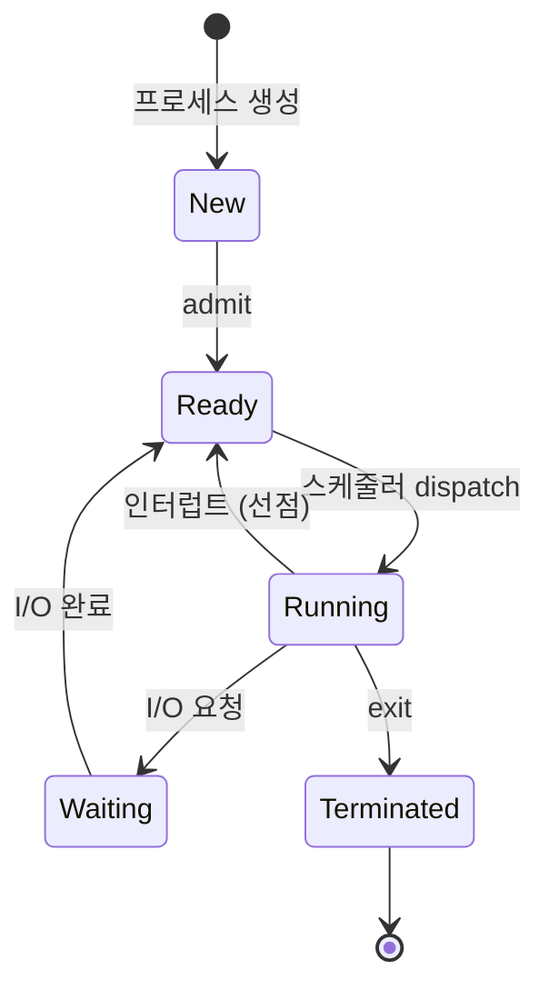
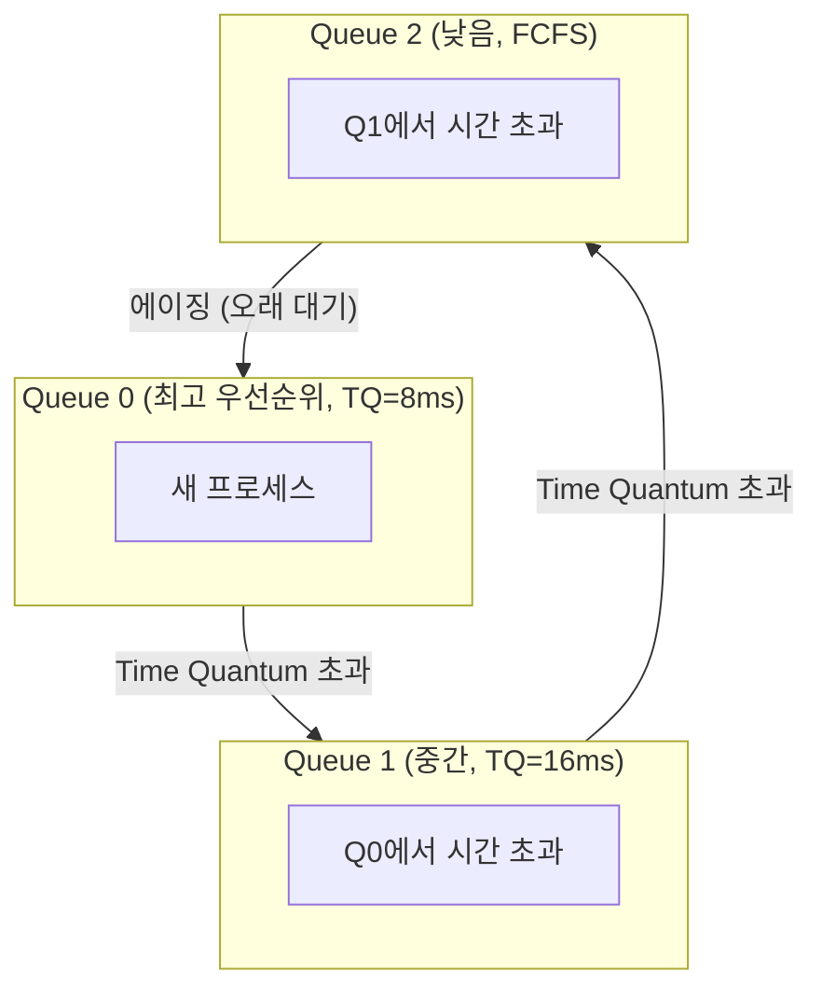
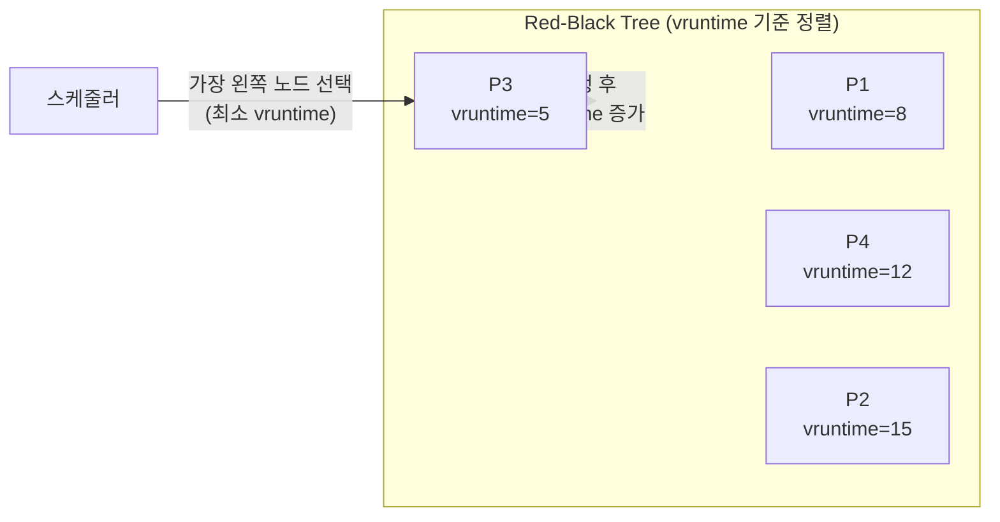

> CPU 스케줄링은 운영체제가 여러 프로세스 중 어떤 것에 CPU를 할당할지 결정하는 핵심 메커니즘입니다. 효율적인 스케줄링은 시스템 성능과 사용자 경험을 직접 좌우합니다.

## TL;DR

- **CPU 스케줄링**은 Ready Queue에 있는 프로세스 중 다음에 실행할 프로세스를 선택하는 알고리즘입니다
- **선점형(Preemptive)** vs **비선점형(Non-preemptive)** — 현대 OS는 거의 모두 선점형 사용
- FCFS → SJF → Round Robin → MLFQ 순으로 진화했고, Linux는 **CFS(Completely Fair Scheduler)** 사용
- 실무에서 Thread Pool 크기, Nginx worker 수, DB 커넥션 풀 설정에 직접 연결되는 개념
- 면접 단골: "Round Robin의 Time Quantum이 너무 크면? 너무 작으면?"

---

## 핵심 개념

운영체제에서 CPU는 가장 비싼 자원입니다. 여러 프로세스가 동시에 실행되려면, 누군가 **"다음은 누구 차례?"**를 결정해야 합니다. 이 역할을 하는 것이 **CPU 스케줄러(Scheduler)**입니다.

### 스케줄링이 필요한 이유

프로세스는 항상 CPU만 사용하는 게 아닙니다. I/O 작업(디스크 읽기, 네트워크 요청)을 할 때는 CPU가 놀게 됩니다. 이 **유휴 시간**에 다른 프로세스를 실행하면 전체 시스템 효율이 올라갑니다.

### CPU Burst와 I/O Burst

프로세스의 실행 패턴은 두 가지 burst의 반복입니다:

- **CPU Burst**: CPU에서 연산을 수행하는 구간
- **I/O Burst**: I/O 작업을 기다리는 구간

웹 서버처럼 네트워크 I/O가 많은 프로세스는 **I/O bound**, 영상 인코딩처럼 연산이 많은 프로세스는 **CPU bound**입니다.

### 선점형 vs 비선점형

| 구분 | 비선점형 (Non-preemptive) | 선점형 (Preemptive) |
|------|--------------------------|---------------------|
| CPU 양보 | 프로세스가 자발적으로 반납 | OS가 강제로 뺏을 수 있음 |
| 응답성 | 낮음 (한 프로세스가 독점 가능) | 높음 (공정한 분배) |
| 구현 | 단순 | 복잡 (동기화 이슈) |
| 사용처 | 초기 배치 시스템 | 현대 모든 OS |

---

## 동작 원리

### 프로세스 상태와 스케줄링 시점



스케줄링이 발생하는 4가지 시점:
1. Running → Waiting (I/O 요청) — 비선점
2. Running → Ready (인터럽트) — **선점**
3. Waiting → Ready (I/O 완료) — **선점**
4. Running → Terminated (종료) — 비선점

### 주요 스케줄링 알고리즘

#### 1. FCFS (First Come, First Served)

가장 단순한 알고리즘입니다. 먼저 도착한 프로세스가 먼저 실행됩니다.

**문제점: Convoy Effect** — CPU burst가 긴 프로세스 하나가 앞에 있으면, 뒤에 있는 짧은 프로세스들이 모두 기다려야 합니다.

#### 2. SJF (Shortest Job First)

CPU burst가 가장 짧은 프로세스를 먼저 실행합니다. **평균 대기 시간이 최소**가 되는 최적 알고리즘이지만, 실제로는 CPU burst를 미리 알 수 없다는 치명적 한계가 있습니다.

#### 3. Round Robin (RR)

현대 스케줄링의 기본이 되는 알고리즘입니다. 각 프로세스에 **Time Quantum**(보통 10~100ms)을 할당하고, 시간이 다 되면 다음 프로세스로 전환합니다.

```mermaid
gantt
    title Round Robin (Time Quantum = 4ms)
    dateFormat X
    axisFormat %s

    section P1 (burst=10)
    실행: 0, 4
    실행: 12, 16
    실행: 20, 22

    section P2 (burst=6)
    실행: 4, 8
    실행: 16, 18

    section P3 (burst=4)
    실행: 8, 12
```



**Time Quantum 딜레마:**
- **너무 크면** → FCFS와 같아짐 (응답성 저하)
- **너무 작으면** → Context Switch 오버헤드가 커짐 (실제 작업 시간 감소)
- **적정값**: Context Switch 시간의 약 100배 (일반적으로 10~100ms)

#### 4. MLFQ (Multi-Level Feedback Queue)

실무에서 가장 널리 쓰이는 알고리즘입니다. 여러 레벨의 큐를 두고, 프로세스의 행동에 따라 큐 간 이동합니다.



**핵심 규칙:**
1. 새 프로세스는 최상위 큐에 진입
2. Time Quantum 내에 완료하면 떠남 (I/O bound → 높은 우선순위 유지)
3. Time Quantum을 초과하면 아래 큐로 강등 (CPU bound)
4. 오래 대기한 프로세스는 다시 위로 승격 (에이징)

---

## 코드로 이해하기

### Round Robin 시뮬레이터 (Python)

```python
from collections import deque

def round_robin(processes, time_quantum):
    """
    processes: [(pid, burst_time), ...]
    returns: [(pid, completion_time, waiting_time), ...]
    """
    queue = deque()
    remaining = {pid: burst for pid, burst in processes}
    completion = {}
    current_time = 0

    # 초기 큐 설정
    for pid, _ in processes:
        queue.append(pid)

    while queue:
        pid = queue.popleft()

        # 실행 시간 계산
        exec_time = min(remaining[pid], time_quantum)
        current_time += exec_time
        remaining[pid] -= exec_time

        print(f"[t={current_time:3d}] P{pid} 실행 ({exec_time}ms)"
              f"{' ✓ 완료' if remaining[pid] == 0 else ''}")

        if remaining[pid] == 0:
            completion[pid] = current_time
        else:
            queue.append(pid)

    # 결과 계산
    results = []
    for pid, burst in processes:
        ct = completion[pid]
        wt = ct - burst
        results.append((pid, ct, wt))
        print(f"P{pid}: 완료={ct}ms, 대기={wt}ms")

    avg_wait = sum(wt for _, _, wt in results) / len(results)
    print(f"\n평균 대기 시간: {avg_wait:.1f}ms")
    return results

# 테스트
processes = [(1, 10), (2, 6), (3, 4)]
round_robin(processes, time_quantum=4)
```

**실행 결과:**
```
[t=  4] P1 실행 (4ms)
[t=  8] P2 실행 (4ms)
[t= 12] P3 실행 (4ms) ✓ 완료
[t= 16] P1 실행 (4ms)
[t= 18] P2 실행 (2ms) ✓ 완료
[t= 20] P1 실행 (2ms) ✓ 완료
P1: 완료=20ms, 대기=10ms
P2: 완료=18ms, 대기=12ms
P3: 완료=12ms, 대기=8ms

평균 대기 시간: 10.0ms
```

### Java — Thread Pool과 스케줄링의 관계

```java
import java.util.concurrent.*;

public class SchedulingDemo {
    public static void main(String[] args) {
        // CPU 코어 수 기반 스레드 풀 설정
        int cores = Runtime.getRuntime().availableProcessors();

        // CPU bound 작업: 코어 수만큼
        ExecutorService cpuPool = Executors.newFixedThreadPool(cores);

        // I/O bound 작업: 코어 수 * 2 (I/O 대기 중 다른 스레드 실행)
        ExecutorService ioPool = Executors.newFixedThreadPool(cores * 2);

        System.out.println("CPU 코어: " + cores);
        System.out.println("CPU bound 풀: " + cores + " threads");
        System.out.println("I/O bound 풀: " + (cores * 2) + " threads");

        // CPU bound 작업 예시
        for (int i = 0; i < 10; i++) {
            final int taskId = i;
            cpuPool.submit(() -> {
                long sum = 0;
                for (long j = 0; j < 100_000_000L; j++) sum += j;
                System.out.println("CPU Task " + taskId + " done");
            });
        }

        cpuPool.shutdown();
        ioPool.shutdown();
    }
}
```

---

## 실무 적용

### 1. Thread Pool 크기 결정 공식

```
최적 스레드 수 = CPU 코어 수 × (1 + 대기 시간 / 서비스 시간)
```

| 작업 유형 | 대기/서비스 비율 | 4코어 기준 스레드 수 |
|----------|----------------|-------------------|
| CPU bound | 0 (대기 없음) | 4 |
| I/O bound (DB 쿼리) | ~2 | 12 |
| I/O bound (HTTP 호출) | ~10 | 44 |

### 2. Nginx worker_processes 설정

```nginx
# CPU bound 프록시 → 코어 수와 동일
worker_processes auto;  # = CPU 코어 수

# 각 워커의 커넥션 수
events {
    worker_connections 1024;
    # 최대 동시 처리 = worker_processes × worker_connections
}
```

### 3. 흔한 실수

**실수 1: 스레드를 무한정 늘리기**
```python
# ❌ BAD — 10,000개 스레드 → Context Switch 지옥
pool = ThreadPoolExecutor(max_workers=10000)

# ✅ GOOD — I/O bound 기준 적정 수
import os
pool = ThreadPoolExecutor(max_workers=os.cpu_count() * 5)
```

**실수 2: CPU bound 작업에 async 사용**
```python
# ❌ BAD — async는 I/O bound에서만 이점
async def heavy_compute():
    result = sum(range(10**8))  # CPU를 점유하므로 이벤트 루프 블로킹
    return result

# ✅ GOOD — CPU bound는 ProcessPool 사용
from concurrent.futures import ProcessPoolExecutor
with ProcessPoolExecutor() as pool:
    result = pool.submit(sum, range(10**8))
```

---

## Deep Dive: Linux CFS (Completely Fair Scheduler)

Linux 2.6.23부터 사용되는 CFS는 **가상 실행 시간(vruntime)**이라는 개념을 도입했습니다.

### 핵심 아이디어

- 모든 프로세스에 **동일한 CPU 시간**을 공평하게 분배
- 가장 적게 실행된 프로세스(vruntime이 가장 작은)를 다음에 실행
- **Red-Black Tree**로 O(log n) 탐색

### CFS 동작 방식



### nice 값과 가중치

```bash
# nice 값 확인 (-20 ~ 19, 낮을수록 높은 우선순위)
$ ps -eo pid,ni,comm | head
  PID  NI COMMAND
    1   0 systemd
  123 -10 important_daemon
  456  10 background_job

# nice 값 변경
$ nice -n -5 ./critical_process   # 높은 우선순위로 실행
$ renice 10 -p 456                # 실행 중 프로세스 우선순위 변경
```

---

## 면접 Q&A

| 난이도 | 질문 | 핵심 답변 |
|--------|------|----------|
| ⭐ 기초 | FCFS의 단점은? | Convoy Effect — 긴 프로세스가 짧은 프로세스를 블로킹 |
| ⭐⭐ 중급 | Round Robin의 Time Quantum이 너무 크면? 작으면? | 크면 FCFS와 같아지고, 작으면 Context Switch 오버헤드 증가 |
| ⭐⭐ 중급 | 선점형과 비선점형의 차이는? | 선점형은 OS가 강제로 CPU를 회수 가능, 비선점형은 프로세스가 자발적 반납 |
| ⭐⭐⭐ 심화 | Starvation을 해결하는 방법은? | Aging — 대기 시간이 길어질수록 우선순위를 점진적으로 높임 |
| ⭐⭐⭐ 시니어 | Linux CFS는 어떻게 공정성을 보장하나? | vruntime 기반 Red-Black Tree로 가장 적게 실행된 프로세스를 O(log n)에 선택 |

---

## 정리

| 항목 | 내용 |
|------|------|
| **핵심 키워드** | CPU 스케줄링, FCFS, SJF, Round Robin, MLFQ, CFS, vruntime |
| **관련 개념** | 프로세스 상태, Context Switch, Priority Inversion |
| **연관 주제** | 프로세스와 스레드, 동기화(다음 포스트), 메모리 관리 |
| **난이도** | ⭐⭐⭐ 중급 |
| **실무 중요도** | ⭐⭐⭐⭐ 높음 (Thread Pool, 서버 성능 튜닝) |

---

## 관련 포스트

- [OS: 프로세스와 스레드](/2026/03/03/os-프로세스와-스레드/) — 이전 포스트

---

## 레퍼런스

**영상**
- [쉬운코드 — CPU 스케줄링](https://www.youtube.com/@ez.) — 한국어, 시각적 설명
- [MIT 6.004 — Operating Systems](https://ocw.mit.edu/) — 영어, 학술적 깊이
- [Computerphile — Scheduling](https://www.youtube.com/@Computerphile) — 영어, 직관적 설명

**문서 & 기사**
- [Linux Kernel — CFS Scheduler](https://docs.kernel.org/scheduler/sched-design-CFS.html) — 공식 문서
- [Operating System Concepts (Silberschatz)](https://www.os-book.com/) — 교재 Chapter 5
