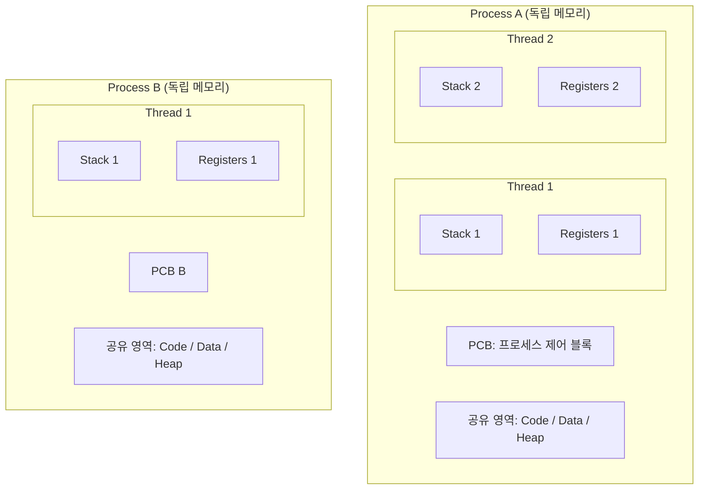

> 프로세스와 스레드는 운영체제에서 실행 단위의 핵심입니다. 이들의 차이와 협력 방식을 이해하는 것은 시스템 아키텍처와 멀티태스킹의 기초입니다.

## 핵심 개념

**프로세스(Process)**는 운영체제로부터 자원을 할당받아 실행 중인 프로그램을 의미합니다. 각 프로세스는 독립적인 메모리 공간(Code, Data, Stack, Heap)을 가지며, 다른 프로세스의 변수나 자료구조에 직접 접근할 수 없습니다.

**스레드(Thread)**는 프로세스 내에서 실행되는 흐름의 단위를 말합니다. 한 프로세스 내에 여러 스레드가 존재할 수 있으며, 이들은 프로세스의 자원(Code, Data, Heap)을 공유하고 각자 독립적인 **Stack**과 **Registers**만 가집니다.

## 동작 원리

프로세스 간의 전환을 **프로세스 컨텍스트 스위칭**이라고 하며, 이는 캐시 초기화 등 오버헤드가 큽니다. 반면, 스레드 간 전환은 공유하는 영역이 많아 상대적으로 빠릅니다.

## 실무에서는?

대부분의 현대 소프트웨어는 **멀티스레딩** 방식을 사용합니다. 예를 들어, 웹 브라우저에서 한 스레드는 네트워크 통신을, 다른 스레드는 화면을 그리는 작업을 동시에 수행합니다. 하지만 여러 스레드가 동시에 같은 자원에 접근할 때 발생하는 **경쟁 상태(Race Condition)**를 막기 위해 **뮤텍스(Mutex)**나 **세마포어(Semaphore)** 같은 동기화 기법을 사용해야 합니다.

## 면접 Q&A

| 질문 | 핵심 답변 |
|------|----------|
| 프로세스와 스레드의 가장 큰 차이는 무엇인가요? | 자원의 공유 여부입니다. 프로세스는 독립적인 자원을 가지며 스레드는 프로세스 내 자원을 공유합니다. |
| PCB(Process Control Block)란 무엇인가요? | 운영체제가 각 프로세스를 관리하기 위해 프로세스 상태, PID, 레지스터 값 등을 저장하는 자료구조입니다. |
| 멀티프로세스 대신 멀티스레드를 사용하는 이유는? | 자원 생성 및 통신 비용이 적고, 컨텍스트 스위칭 오버헤드가 낮아 효율적이기 때문입니다. |

## 정리

| 항목 | 설명 |
|------|------|
| 핵심 키워드 | PCB, Context Switching, Multithreading, Synchronization |
| 관련 개념 | Race Condition, IPC, Thread Safety |
| 난이도 | ★★☆☆☆ |
