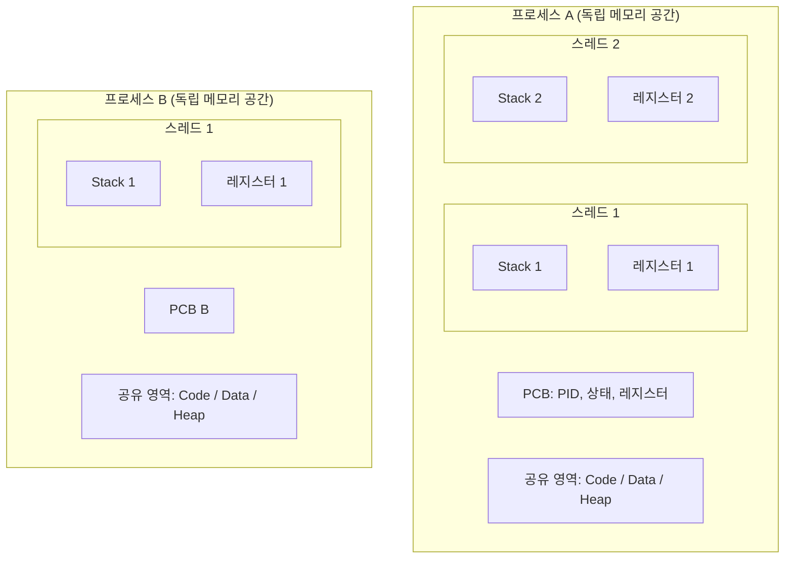
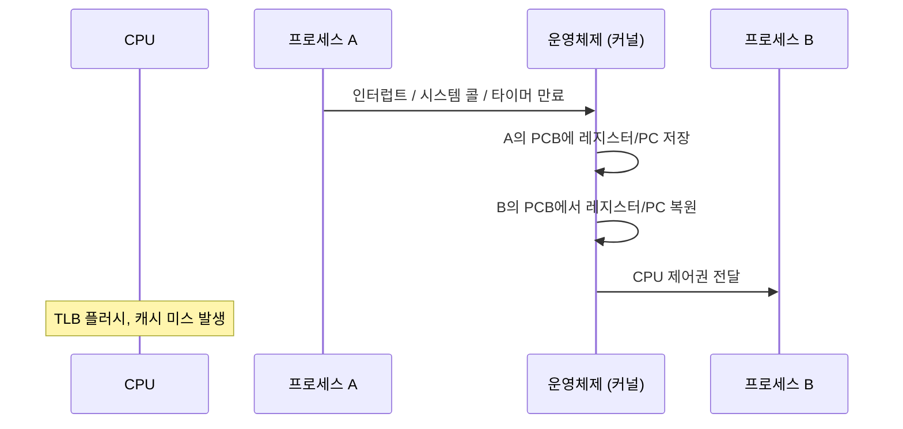

> 프로세스는 운영체제로부터 자원을 할당받아 독립적으로 실행되는 단위이고, 스레드는 프로세스 내에서 자원을 공유하며 실행되는 경량 단위이다.

## 핵심 요약 (TL;DR)

- **프로세스**는 독립 메모리(Code, Data, Stack, Heap)를 가진 실행 단위, **스레드**는 프로세스 내 자원을 공유하며 각자 Stack만 독립
- 프로세스 간 통신(IPC)은 비용이 크지만 안전하고, 스레드 간 통신은 빠르지만 동기화 문제 발생
- **컨텍스트 스위칭**: 프로세스 전환은 캐시 초기화 등 오버헤드가 크고, 스레드 전환은 상대적으로 가벼움
- 현대 OS는 대부분 **커널 레벨 스레드(1:1 모델)**를 사용하며, Go의 고루틴처럼 **M:N 모델**도 존재

## 핵심 개념

### 프로세스 (Process)

**프로세스**는 운영체제로부터 자원을 할당받아 실행 중인 프로그램을 의미한다. 실행 파일이 메모리에 로드되면 프로세스가 된다.

각 프로세스는 독립적인 메모리 공간을 가진다:
- **Code (Text)**: 실행할 명령어(기계어)가 저장된 영역. 읽기 전용.
- **Data**: 전역 변수, 정적 변수가 저장된 영역. BSS(초기화 안 된 전역변수)와 구분.
- **Heap**: 동적 메모리 할당 영역. `malloc()`, `new`로 할당.
- **Stack**: 함수 호출 정보(지역 변수, 매개변수, 복귀 주소)가 저장되는 영역. LIFO 구조.

운영체제는 각 프로세스를 **PCB(Process Control Block)**로 관리한다. PCB에는 프로세스 상태, PID, 프로그램 카운터, 레지스터 값, 메모리 관리 정보, 열린 파일 목록 등이 담긴다.

### 스레드 (Thread)

**스레드**는 프로세스 내에서 실행되는 흐름의 단위이다. 하나의 프로세스 안에 여러 스레드가 존재할 수 있으며, 이들은 프로세스의 **Code, Data, Heap을 공유**하고 각자 독립적인 **Stack**과 **레지스터**만 가진다.

| 구분 | 프로세스 | 스레드 |
|------|---------|--------|
| 메모리 | 독립 (Code, Data, Stack, Heap) | 공유 (Code, Data, Heap) + 독립 Stack |
| 생성 비용 | 높음 (fork → 메모리 복사) | 낮음 (Stack만 할당) |
| 통신 | IPC 필요 (파이프, 소켓, 공유 메모리) | 전역 변수로 직접 통신 |
| 안전성 | 한 프로세스 크래시 → 다른 프로세스 무영향 | 한 스레드 크래시 → 프로세스 전체 종료 |
| 전환 비용 | 높음 (TLB, 캐시 초기화) | 낮음 (공유 영역 유지) |

### PCB와 TCB

- **PCB (Process Control Block)**: OS가 프로세스를 관리하기 위한 자료구조. PID, 상태, 레지스터, 메모리 맵, 파일 디스크립터 등 포함.
- **TCB (Thread Control Block)**: 스레드별 정보 저장. TID, 스택 포인터, 프로그램 카운터, 레지스터 값, 소속 프로세스 PCB 포인터 포함.

## 동작 원리



### 컨텍스트 스위칭 (Context Switching)

CPU가 현재 실행 중인 프로세스/스레드를 다른 것으로 교체하는 작업이다.



**프로세스 컨텍스트 스위칭**은 메모리 주소 공간이 바뀌므로 TLB(Translation Lookaside Buffer) 플러시와 캐시 미스가 발생해 비용이 크다. **스레드 컨텍스트 스위칭**은 같은 프로세스 내에서 일어나므로 TLB 플러시가 필요 없고 상대적으로 빠르다.

## 코드로 이해하기

### 예제 1: 멀티프로세스 (Python)

```python
import os
import time

def child_work():
    """자식 프로세스 작업"""
    print(f"[자식] PID={os.getpid()}, 부모 PID={os.getppid()}")
    print(f"[자식] 독립 메모리 공간에서 실행 중")
    time.sleep(1)
    print(f"[자식] 작업 완료")

# fork()로 자식 프로세스 생성
pid = os.fork()

if pid == 0:
    # 자식 프로세스
    child_work()
elif pid > 0:
    # 부모 프로세스
    print(f"[부모] PID={os.getpid()}, 자식 PID={pid}")
    os.waitpid(pid, 0)  # 자식 종료 대기
    print(f"[부모] 자식 프로세스 종료 확인")
```

### 예제 2: 멀티스레드 (Python)

```python
import threading
import time

# 공유 자원
counter = 0
lock = threading.Lock()

def increment(name, count):
    """스레드가 공유 자원에 접근"""
    global counter
    for _ in range(count):
        with lock:  # 뮤텍스로 동기화
            counter += 1
    print(f"[{name}] 완료. counter={counter}")

# 스레드 생성 — 같은 프로세스 내 메모리 공유
t1 = threading.Thread(target=increment, args=("스레드-1", 100000))
t2 = threading.Thread(target=increment, args=("스레드-2", 100000))

t1.start()
t2.start()
t1.join()
t2.join()

print(f"최종 counter: {counter}")  # lock 덕분에 정확히 200000
```

### 예제 3: C에서 pthread

```c
#include <stdio.h>
#include <pthread.h>

// 공유 변수
int shared_data = 0;
pthread_mutex_t mutex;

void* thread_func(void* arg) {
    int id = *(int*)arg;
    for (int i = 0; i < 100000; i++) {
        pthread_mutex_lock(&mutex);   // 임계 영역 진입
        shared_data++;
        pthread_mutex_unlock(&mutex); // 임계 영역 탈출
    }
    printf("스레드 %d 완료\n", id);
    return NULL;
}

int main() {
    pthread_t t1, t2;
    int id1 = 1, id2 = 2;

    pthread_mutex_init(&mutex, NULL);
    pthread_create(&t1, NULL, thread_func, &id1);
    pthread_create(&t2, NULL, thread_func, &id2);
    pthread_join(t1, NULL);
    pthread_join(t2, NULL);

    printf("최종 shared_data: %d\n", shared_data); // 200000
    pthread_mutex_destroy(&mutex);
    return 0;
}
```

`lock` / `pthread_mutex`가 없으면 Race Condition으로 인해 결과가 200000보다 작아진다. 두 스레드가 동시에 `counter++`를 읽고-수정-쓰기 하면서 갱신이 유실되기 때문이다.

## 실무 적용

### 웹 서버 아키텍처

- **멀티프로세스**: Apache `prefork` 모드. 요청마다 자식 프로세스 생성. 안정적이지만 메모리 사용량 큼.
- **멀티스레드**: Apache `worker` 모드, Java 서블릿 컨테이너. 프로세스 내 스레드풀로 요청 처리. 효율적이지만 동기화 필요.
- **이벤트 기반**: Nginx, Node.js. 싱글 스레드 + 이벤트 루프. 동기화 문제 없지만 CPU 바운드 작업에 약함.

### 스레드 풀 설정 (Spring Boot)

```yaml
# application.yml
server:
  tomcat:
    threads:
      max: 200      # 최대 스레드 수
      min-spare: 10 # 유휴 스레드 수
    max-connections: 8192
    accept-count: 100
```

### 흔한 실수

1. **데드락**: 두 스레드가 서로 상대의 락을 기다리며 영원히 대기. 락 순서를 일관되게 정하면 예방 가능.
2. **Race Condition**: 동기화 없이 공유 자원 접근. `volatile` 키워드만으로는 해결 안 됨 — 원자적 연산이나 락 필요.
3. **스레드 누수**: 스레드 생성 후 join/종료 처리 누락. 스레드풀 사용으로 예방.

## Deep Dive: 사용자 수준 스레드 vs 커널 수준 스레드

### 스레딩 모델

| 모델 | 설명 | 예시 |
|------|------|------|
| **N:1** (Many-to-One) | 사용자 스레드 N개 → 커널 스레드 1개. 커널은 프로세스만 인식. | 초기 Java Green Thread |
| **1:1** (One-to-One) | 사용자 스레드 1개 → 커널 스레드 1개. OS가 직접 스케줄링. | Linux pthread, Java HotSpot |
| **M:N** (Many-to-Many) | 사용자 스레드 M개 → 커널 스레드 N개. 런타임이 매핑 관리. | Go 고루틴, Erlang 프로세스 |

Go의 고루틴은 M:N 모델의 대표적 사례다. 수백만 개의 고루틴을 소수의 OS 스레드에 매핑하여 경량 동시성을 구현한다. Go 런타임의 **GMP 스케줄러**(Goroutine-Machine-Processor)가 이 매핑을 담당한다.

### Linux의 clone() 시스템 콜

Linux에서 `fork()`와 `pthread_create()`는 내부적으로 모두 `clone()` 시스템 콜을 사용한다. `clone()`의 플래그로 어떤 자원을 공유할지 결정한다:

- `CLONE_VM`: 메모리 공간 공유 (스레드)
- `CLONE_FS`: 파일 시스템 정보 공유
- `CLONE_FILES`: 파일 디스크립터 테이블 공유
- `CLONE_SIGHAND`: 시그널 핸들러 공유

즉, Linux에서 프로세스와 스레드의 차이는 "얼마나 공유하느냐"의 스펙트럼이다.

## 면접 Q&A

| 질문 | 핵심 답변 |
|------|----------|
| 프로세스와 스레드의 가장 큰 차이는? | 메모리 공유 여부. 프로세스는 독립 메모리, 스레드는 Code/Data/Heap 공유 + 독립 Stack. |
| PCB란? | OS가 프로세스 관리에 사용하는 자료구조. PID, 상태, 레지스터, 메모리 맵, 파일 디스크립터 등 포함. |
| 멀티프로세스 대신 멀티스레드를 사용하는 이유? | 생성 비용 낮고, 통신이 빠르고(공유 메모리), 컨텍스트 스위칭 오버헤드가 적음. |
| 멀티스레드의 단점은? | 동기화 복잡(데드락, Race Condition), 한 스레드 크래시 → 전체 프로세스 종료, 디버깅 어려움. |
| 컨텍스트 스위칭이 비싼 이유? | 레지스터/PC 저장·복원, TLB 플러시(프로세스 전환 시), 캐시 미스 증가. |

## 정리

| 항목 | 설명 |
|------|------|
| 핵심 키워드 | PCB, TCB, Context Switching, IPC, Multithreading, Synchronization |
| 관련 개념 | Race Condition, Mutex, Semaphore, Deadlock, Thread Pool |
| 연관 주제 | CPU 스케줄링, 동기화와 교착상태, IPC 메커니즘 |
| 난이도 | ★★☆☆☆ |
| 실무 중요도 | ★★★★★ |

## 관련 포스트

- [OS: CPU 스케줄링](/2026/03/03/os-cpu-스케줄링/) — 프로세스/스레드를 어떻게 CPU에 할당하는지

## 레퍼런스

### 영상
- [프로세스와 스레드의 차이](https://www.youtube.com/watch?v=1grtWKqTn50) — 쉬운코드, 프로세스·스레드 개념을 시각적으로 설명
- [Context Switching 이해하기](https://www.youtube.com/watch?v=Xh9Nt7y07FE) — 널널한 개발자, 컨텍스트 스위칭의 비용과 원리

### 문서 & 기사
- [Linux man clone(2)](https://man7.org/linux/man-pages/man2/clone.2.html) — Linux에서 프로세스/스레드 생성의 핵심 시스템 콜
- [OSTEP: Processes](https://pages.cs.wisc.edu/~remzi/OSTEP/cpu-intro.pdf) — 운영체제 교과서, 프로세스 개념 기초

---

*이 포스트는 [HoneyByte](https://blog.honeybarrel.co.kr) 시리즈의 일부입니다.*
