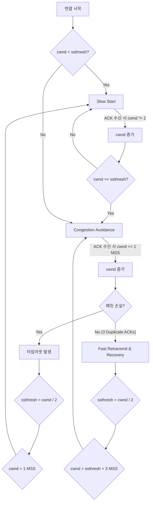
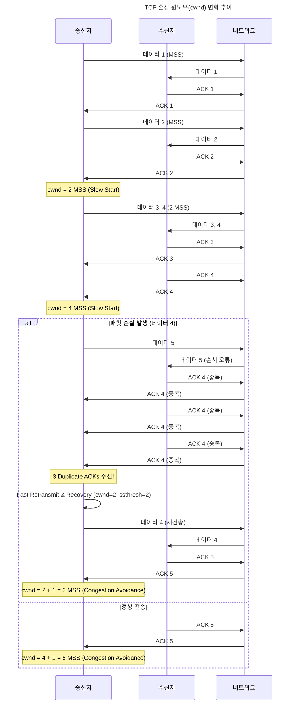

> TCP 혼잡 제어는 네트워크의 과부하를 방지하고 효율적인 데이터 전송을 보장하기 위한 메커니즘입니다.

## 핵심 요약 (TL;DR)

네트워크 혼잡 상태를 감지하고 대역폭을 동적으로 조절합니다. 패킷 손실, 지연 증가 등을 혼잡의 지표로 사용하며, Slow Start, Congestion Avoidance, Fast Retransmit/Recovery 등의 알고리즘을 통해 네트워크 붕괴를 방지하고 공평한 대역폭 분배를 돕습니다. Reno, Cubic, BBR 등 다양한 혼잡 제어 알고리즘이 존재합니다.

## 개념 이해

인터넷과 같은 패킷 교환 네트워크에서는 여러 사용자가 동시에 많은 데이터를 전송할 때 네트워크 장비(라우터, 스위치)의 버퍼가 과도하게 사용되어 패킷이 손실되는 '네트워크 혼잡(Network Congestion)'이 발생할 수 있습니다. 이로 인해 전송 지연이 길어지고, 심각한 경우 네트워크 전체의 성능이 급격히 저하되는 '혼잡 소용돌이(Congestion Collapse)' 현상까지 발생할 수 있습니다.

TCP(Transmission Control Protocol)는 이러한 네트워크 혼잡 문제를 해결하기 위해 '혼잡 제어(Congestion Control)' 메커니즘을 사용합니다. 이는 단순히 송신자와 수신자 간의 데이터를 안정적으로 주고받는 '흐름 제어(Flow Control)'와는 구분됩니다. 흐름 제어는 수신자의 처리 능력에 맞춰 송신 속도를 조절하는 반면, 혼잡 제어는 **네트워크 자체의 수용 능력**을 고려하여 송신 속도를 조절합니다.

### 혼잡의 신호

TCP는 네트워크 혼잡을 다음과 같은 지표를 통해 감지합니다.

*   **타임아웃 (Timeout):** 송신자가 데이터를 보낸 후 일정 시간(RTO: Retransmission Timeout) 안에 ACK(Acknowledgement) 응답을 받지 못했을 때, 패킷이 손실되었다고 판단하고 혼잡이 발생했다고 간주합니다.
*   **3-way handshake 실패:** TCP 연결 설정 과정에서 SYN-ACK 패킷이 전송되지 않거나 응답이 없는 경우도 혼잡의 신호로 볼 수 있습니다.
*   **중복 ACK (Duplicate ACK):** 송신자는 패킷이 순서대로 도착하지 않으면(즉, 패킷 손실 발생) 이전 패킷에 대한 ACK를 반복해서 보냅니다. 연속적으로 3개 이상의 중복 ACK가 수신되면 패킷 손실이 발생했다고 판단합니다. (Reno 이후 알고리즘에서 중요하게 사용)

### TCP 혼잡 제어 알고리즘의 기본 원리

TCP 혼잡 제어는 주로 **혼잡 윈도우(Congestion Window, `cwnd`)**라는 변수를 사용하여 송신량을 조절합니다. `cwnd`는 송신자가 혼잡을 유발하지 않고 한 번에 보낼 수 있는 최대 데이터 양을 의미합니다. TCP는 네트워크 상태에 따라 `cwnd`를 동적으로 조절하며, 대표적으로 다음과 같은 단계로 이루어집니다.

1.  **Slow Start (느린 시작):**
    *   연결 시작 시 `cwnd`를 매우 작게 (일반적으로 1 MSS: Maximum Segment Size) 설정합니다.
    *   ACK를 받을 때마다 `cwnd`를 2배씩 증가시킵니다 (지수적 증가).
    *   이 상태는 `cwnd`가 특정 임계값(ssthresh: slow start threshold)에 도달하거나 패킷 손실이 발생할 때까지 유지됩니다.

2.  **Congestion Avoidance (혼잡 회피):**
    *   `cwnd`가 `ssthresh`에 도달하면 Slow Start 단계를 벗어나 Congestion Avoidance 단계로 전환됩니다.
    *   `cwnd`를 이전처럼 2배씩 증가시키는 대신, ACK를 받을 때마다 `cwnd`를 약 1 MSS씩 선형적으로 증가시킵니다 (Additive Increase).
    *   이는 네트워크의 대역폭을 탐색하면서도 과도한 부하를 주지 않으려는 목적입니다.

3.  **Fast Retransmit (빠른 재전송) & Fast Recovery (빠른 복구):**
    *   이 두 메커니즘은 타임아웃보다는 중복 ACK를 통해 패킷 손실을 감지했을 때 더 빠르게 반응하기 위해 사용됩니다.
    *   **Fast Retransmit:** 3개 이상의 중복 ACK가 수신되면, 타임아웃을 기다리지 않고 손실된 패킷을 즉시 재전송합니다.
    *   **Fast Recovery:** 패킷 손실을 감지하고 재전송 후, `ssthresh`를 현재 `cwnd`의 절반으로 줄이고 `cwnd`를 `ssthresh`와 손실된 패킷 재전송으로 인해 증가한 양만큼만 증가시킵니다. 이후 Congestion Avoidance 단계로 진입합니다. 이 과정을 통해 네트워크 붕괴를 피하고 최대한 빠르게 손실된 데이터를 복구하려 합니다.

## 시각화





## 코드로 이해하기

TCP 혼잡 제어의 AIMD(Additive Increase, Multiplicative Decrease) 원리를 간단한 Python 코드로 시뮬레이션해 볼 수 있습니다. 이 코드는 실제 TCP 스택만큼 정교하지 않지만, `cwnd`의 변화를 이해하는 데 도움을 줍니다.

### 예제 1: AIMD 시뮬레이션

```python
import time
import math

class TCPCongestionControl:
    def __init__(self):
        self.cwnd = 1.0  # Congestion Window in MSS (Maximum Segment Size)
        self.ssthresh = float('inf') # Slow Start Threshold
        self.rtt = 1.0 # Round Trip Time (assumed constant for simplicity)
        self.state = "Slow Start" # Initial state
        self.last_ack_time = time.time()
        self.packets_in_flight = 0
        self.mss = 1000 # bytes per segment

    def _on_ack(self, ack_packet_size):
        current_time = time.time()
        if current_time - self.last_ack_time < 0.01: # Simulate multiple ACKs arriving close together
            pass # For simplicity, we just acknowledge one 'event' per call

        self.last_ack_time = current_time
        
        if self.state == "Slow Start":
            self.cwnd += ack_packet_size / self.mss
            print(f"ACK received in Slow Start. cwnd increased to {self.cwnd:.2f} MSS")
            if self.cwnd >= self.ssthresh:
                self.state = "Congestion Avoidance"
                print(f"ssthresh ({self.ssthresh:.2f} MSS) reached. Transitioning to Congestion Avoidance.")
        
        elif self.state == "Congestion Avoidance":
            # Additive Increase: increase cwnd by approximately 1 MSS per RTT
            # In a real system, this is averaged over an RTT. Here, we approximate by incrementing per ACK event.
            # A more accurate simulation would track packets in flight and RTTs.
            # For simulation, we increment by a fraction of MSS per received ACK.
            # The fraction should sum up to 1 MSS over one RTT duration.
            # This is a simplified simulation, actual increment logic is more complex.
            increment = ack_packet_size / self.mss # This is a simplification
            # A more robust AIMD would be:
            # self.cwnd += self.mss / self.cwnd # For every cwnd packets acknowledged, increase by 1 MSS
            self.cwnd += 1.0 / self.cwnd # This is a common simplification for simulation
            print(f"ACK received in Congestion Avoidance. cwnd increased to {self.cwnd:.2f} MSS")
        
        # Note: Fast Retransmit/Recovery logic is omitted for simplicity in this example.

    def _on_packet_loss(self):
        print("Packet loss detected (simulated timeout or triple duplicate ACK).")
        self.ssthresh = max(1.0, self.cwnd / 2.0) # Reduce threshold by half
        self.cwnd = 1.0 # Reset cwnd to 1 MSS (or 2 MSS for Fast Recovery)
        self.state = "Slow Start" # Or Fast Recovery state transition
        print(f"ssthresh set to {self.ssthresh:.2f} MSS. cwnd reset to {self.cwnd:.2f} MSS. State: {self.state}")

    def send_packet(self, size):
        if self.packets_in_flight * self.mss < self.cwnd * self.mss:
            self.packets_in_flight += 1
            print(f"Sending packet of size {size} bytes. cwnd={self.cwnd:.2f} MSS, In flight={self.packets_in_flight}")
            # Simulate packet arrival and ACK after RTT
            # In a real simulation, this would involve timers and queues
            return True
        else:
            print(f"cwnd ({self.cwnd:.2f} MSS) full. Cannot send packet of size {size} bytes. In flight={self.packets_in_flight}")
            return False
    
    def simulate_network_event(self):
        # This function simulates external network events that cause ACKs or packet loss
        # In a real simulation, this would be driven by timers and events
        if self.packets_in_flight > 0:
            # Simulate receiving an ACK for a packet
            # In a real simulation, RTT would matter. Here, we just assume ACK arrives.
            print("Simulating network event: ACK received.")
            self._on_ack(self.mss) # Assume ACK for one MSS segment
            self.packets_in_flight -= 1
        else:
            # Simulate a random packet loss event if no packets are in flight
            if time.time() % 10 < 0.1: # Small chance of loss if idle
                self._on_packet_loss()

# --- Simulation Run ---
print("--- TCP Congestion Control Simulation ---")
cc = TCPCongestionControl()
initial_ssthresh = 16.0 # Example threshold
cc.ssthresh = initial_ssthresh

# Simulate sending packets over time
for i in range(30): # Simulate 30 time steps
    print(f"\n--- Time Step {i+1} ---")
    
    # Attempt to send packets if cwnd allows
    # We simulate sending a burst of packets up to the current cwnd limit
    max_packets_to_send = int(cc.cwnd)
    sent_count = 0
    while sent_count < max_packets_to_send and cc.packets_in_flight < cc.cwnd:
        if cc.send_packet(cc.mss):
            sent_count += 1
    
    # Simulate network events (ACKs or losses)
    if cc.packets_in_flight > 0 or i % 5 == 0: # Simulate events periodically or if packets are in flight
        cc.simulate_network_event()
    
    time.sleep(0.5) # Slow down simulation for readability

print("\n--- Simulation End ---")

```

### 예제 2: TCP 혼잡 제어 알고리즘 비교 (표)

| 알고리즘 | 주요 특징 | 장점 | 단점 |
|---|---|---|---|
| **TCP Reno** | AIMD 기반, Fast Retransmit/Recovery | 구현이 간단하고 안정적. 낮은 지연 환경에서 효율적. | 고대역폭, 고지연(BDP가 큰) 네트워크에서 성능 저하. 패킷 손실에 민감. |
| **TCP Cubic** | AIMD 변형, 시간 기반 큐빅 함수로 `cwnd` 증가. 고대역폭/고지연 네트워크에 최적화. Linux, Windows 기본값. | 대규모 네트워크에서 Reno보다 빠른 대역폭 활용. 공정성 우수. | 급격한 `cwnd` 증가로 일시적 과부하 가능성. |
| **TCP BBR** (Bottleneck Bandwidth and RTT) | 손실 기반이 아닌, 병목 대역폭(BW) 및 최소 RTT(mR) 측정 기반. | 패킷 손실 없이도 높은 대역폭 활용. 지연 감소. | 일부 네트워크 환경(매우 불안정한 링크)에서 성능 저하 가능성. 오래된 시스템과의 호환성 문제. |

## 복잡도 분석

TCP 혼잡 제어 알고리즘 자체는 일반적으로 각 패킷 처리 또는 이벤트 발생 시(ACK 수신, 타임아웃, 중복 ACK 등) `cwnd` 및 `ssthresh` 값을 업데이트하는 방식으로 동작합니다. 이러한 업데이트 로직은 매우 효율적이며, 대부분의 표준 알고리즘(Reno, Cubic 등)에서 **각 이벤트당 O(1)의 시간 복잡도**를 가집니다.

-   **시간 복잡도:**
    -   **ACK 수신:** `cwnd` 증가 로직 (Slow Start, Congestion Avoidance) → O(1)
    -   **패킷 손실 감지 (타임아웃/3 Duplicate ACKs):** `ssthresh` 감소, `cwnd` 재설정 → O(1)
    -   **Fast Retransmit/Recovery:** `ssthresh` 감소, `cwnd` 재설정 → O(1)
-   **공간 복잡도:** `cwnd`, `ssthresh`, RTO 타이머 등 최소한의 상태 변수만을 유지하므로 **O(1)**입니다.

이처럼 TCP 혼잡 제어는 **계산적으로 매우 가볍게** 동작하여 네트워크 스택의 오버헤드를 최소화합니다. 알고리즘의 복잡성은 계산 복잡성이 아니라, 다양한 네트워크 환경(속도, 지연, 손실률, 버퍼 크기 등)에 대한 **수학적 모델링과 최적화**에 있습니다.

## 실무 적용

현대의 인터넷 환경에서는 다양한 TCP 혼잡 제어 알고리즘이 사용되며, 운영체제별로 기본값이 다릅니다.

*   **Linux:** 기본적으로 Cubic을 사용하지만, BBR 등 다른 알고리즘으로 변경할 수 있습니다. `/proc/sys/net/ipv4/tcp_congestion_control` 파일을 통해 현재 사용 중인 알고리즘을 확인할 수 있습니다.
*   **Windows:** Cubic 또는 Compound TCP(CTCP)를 사용합니다.
*   **macOS:** Reno 기반의 알고리즘을 사용하며, TCP Vegas, BIC, Cubic 등도 지원합니다.

고속 인터넷 환경, 클라우드 서비스, CDN 등에서는 네트워크 환경에 최적화된 알고리즘(예: Cubic, BBR)을 선택하여 사용함으로써 전송 속도와 효율성을 극대화합니다. 예를 들어, BBR은 패킷 손실이 적은 현대적인 네트워크 환경에서 기존 알고리즘보다 더 높은 처리량과 낮은 지연 시간을 제공하는 것으로 알려져 있습니다.

## 면접 Q&A

**Q1: TCP 혼잡 제어란 무엇이며 왜 중요한가요?**
A1: TCP 혼잡 제어는 네트워크의 과부하를 방지하고, 송신량이 네트워크 용량을 초과하지 않도록 조절하는 메커니즘입니다. 네트워크 붕괴를 막고, 모든 사용자가 공정하게 대역폭을 사용할 수 있도록 하며, 데이터 전송 효율성을 높이는 데 필수적입니다.

**Q2: 흐름 제어(Flow Control)와 혼잡 제어(Congestion Control)의 차이점은 무엇인가요?**
A2:
*   **흐름 제어:** 송신자와 수신자 간의 속도 조절입니다. 수신자의 처리 능력을 초과하지 않도록, 수신 윈도우(Receiver Window)를 사용하여 송신량을 조절합니다.
*   **혼잡 제어:** 송신자와 수신자 모두의 상태뿐만 아니라, **네트워크 자체의 혼잡 상태**를 고려하여 송신량을 조절합니다. 혼잡 윈도우(Congestion Window, `cwnd`)를 사용하여 네트워크 용량을 초과하지 않도록 조절합니다.

**Q3: Slow Start 단계에 대해 설명해주세요.**
A3: TCP 연결 초기에 혼잡 윈도우(`cwnd`)를 매우 작게(보통 1 MSS) 시작하여, ACK를 받을 때마다 `cwnd`를 2배씩 지수적으로 증가시키는 단계입니다. 이는 빠르게 네트워크 대역폭을 탐색하기 위한 목적이며, `ssthresh` 값에 도달하거나 패킷 손실이 발생하면 종료됩니다.

**Q4: Congestion Avoidance 단계에 대해 설명해주세요.**
A4: `cwnd`가 `ssthresh`에 도달한 후 진입하는 단계입니다. `cwnd`를 매 ACK 수신 시마다 약 1 MSS씩 선형적으로 증가시킵니다(Additive Increase). 이는 네트워크의 대역폭을 조심스럽게 탐색하면서도 과도한 부하를 주지 않으려는 목적입니다.

**Q5: AIMD란 무엇인가요?**
A5: AIMD는 Additive Increase, Multiplicative Decrease의 약자로, TCP 혼잡 제어의 핵심적인 윈도우 조절 방식입니다. 패킷 손실이 없을 때는 `cwnd`를 선형적으로 증가시키고(Additive Increase), 패킷 손실이 발생하면 `cwnd`를 절반으로 줄입니다(Multiplicative Decrease).

**Q6: Fast Retransmit와 Fast Recovery는 어떻게 동작하나요?**
A6:
*   **Fast Retransmit:** 타임아웃이 발생하기 전에, 3개 이상의 중복 ACK가 수신되면 즉시 손실된 것으로 추정되는 패킷을 재전송합니다.
*   **Fast Recovery:** Fast Retransmit 후, `ssthresh`를 현재 `cwnd`의 절반으로 줄이고 `cwnd`를 `ssthresh`와 손실된 패킷 재전송으로 인한 증가분만큼만 조절한 뒤 Congestion Avoidance 상태로 전환합니다. 이를 통해 타임아웃으로 인한 긴 지연 없이 빠르게 복구합니다.

**Q7: Cubic이 Reno보다 고대역폭/고지연 네트워크에서 유리한 이유는 무엇인가요?**
A7: Cubic은 선형 증가 방식(Reno)과 달리, 시간 기반의 큐빅 함수를 사용하여 `cwnd`를 증가시킵니다. 이 큐빅 함수는 `cwnd` 값이 커질수록 증가율이 완만해지다가, 특정 지점 이후에는 다시 증가율을 높여 고대역폭/고지연 환경에서도 더 빠르게 대역폭을 활용할 수 있도록 설계되었습니다.

**Q8: BBR이란 무엇이며 기존 알고리즘과 어떻게 다른가요?**
A8: BBR(Bottleneck Bandwidth and Round-trip Probing)은 Google이 개발한 혼잡 제어 알고리즘입니다. 기존 알고리즘들이 주로 패킷 손실을 혼잡의 지표로 삼는 것과 달리, BBR은 **병목 대역폭(Bottleneck Bandwidth)**과 **최소 RTT(minimum Round-Trip Time)**를 직접 측정하고 이를 기반으로 `cwnd`와 전송 속도를 조절합니다. 이를 통해 패킷 손실이 발생하지 않는 환경에서도 높은 대역폭을 효과적으로 활용하며 지연을 줄일 수 있습니다.

## 정리

| 항목 | 설명 |
|---|---|
| 핵심 키워드 | TCP 혼잡 제어, `cwnd`, `ssthresh`, Slow Start, Congestion Avoidance, AIMD, Reno, Cubic, BBR, 패킷 손실, 대역폭, RTT |
| 관련 개념 | 흐름 제어, TCP 3-way handshake, ACK, 타임아웃, MSS |
| 연관 주제 | TCP/IP 프로토콜 스택, 네트워크 성능 최적화, QUIC 혼잡 제어 |
| 난이도 | ★★★★☆ |
| 실무 중요도 | ★★★★★ |

## 관련 포스트

*   [HoneyByte] Network: TCP 3-way Handshake와 연결 관리 (/2026/01/01/tcp-3way-handshake/) — TCP 연결 설정의 기본 원리를 다룹니다.
*   [HoneyByte] Network: TCP 흐름 제어란? (/2026/01/05/tcp-flow-control/) — 수신자의 처리 능력에 맞춰 송신 속도를 조절하는 흐름 제어의 중요성을 설명합니다.

## 레퍼런스

### 영상
*   [TCP Congestion Control Explained](https://www.youtube.com/watch?v=FfM-dC210_A) — NetworkChuck, TCP 혼잡 제어의 개념과 동작 방식을 시각적으로 설명합니다.
*   [What is TCP BBR?](https://www.youtube.com/watch?v=dF7x5WlI5_g) — Packet Pub, BBR 알고리즘의 원리와 장점을 상세히 설명하는 영상입니다.

### 문서 & 기사
*   [TCP congestion control](https://en.wikipedia.org/wiki/TCP_congestion_control) — Wikipedia, TCP 혼잡 제어에 대한 포괄적인 정보를 제공하는 영문 위키백과 문서입니다.
*   [RFC 5681: TCP Congestion Control](https://datatracker.ietf.org/doc/html/rfc5681) — IETF, TCP 혼잡 제어에 대한 공식 표준 문서입니다.
*   [RFC 8893: TCP Alternate Congestion Control Algorithms](https://datatracker.ietf.org/doc/html/rfc8893) — IETF, Cubic, BBR 등 다양한 혼잡 제어 알고리즘에 대한 내용을 다룹니다.

---

*이 포스트는 [HoneyByte](https://blog.honeybarrel.co.kr) 시리즈의 일부입니다.*