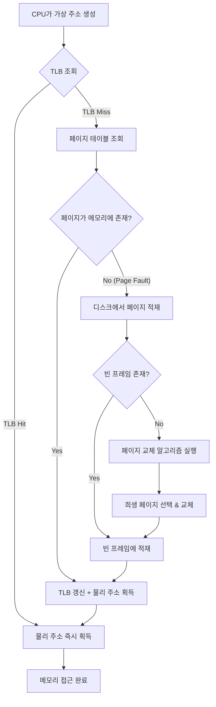
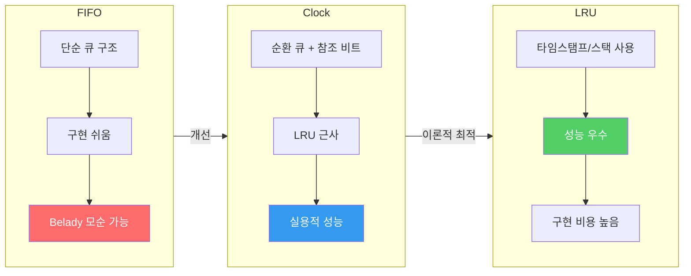

운영체제의 **메모리 관리**는 한정된 물리 메모리를 여러 프로세스가 안전하고 효율적으로 사용할 수 있도록 하는 핵심 메커니즘이다. **가상 메모리**는 각 프로세스에게 독립된 주소 공간을 제공하면서, 실제 물리 메모리보다 큰 메모리를 사용할 수 있게 해주는 추상화 기법이다.

이 글에서는 다음을 다룬다:

- **페이징(Paging)**: 고정 크기 블록으로 메모리를 나누어 관리하는 기법
- **세그멘테이션(Segmentation)**: 논리적 단위로 메모리를 분할하는 기법
- **TLB(Translation Lookaside Buffer)**: 주소 변환을 가속하는 하드웨어 캐시
- **페이지 교체(Page Replacement)**: 물리 메모리가 부족할 때 어떤 페이지를 내보낼지 결정하는 알고리즘

---

## 핵심 개념

### 물리 메모리 vs 가상 메모리

물리 메모리(RAM)는 용량이 제한되어 있다. 가상 메모리는 디스크를 확장 메모리처럼 활용하여 각 프로세스가 자신만의 넓은 주소 공간을 갖도록 한다. 프로세스 간 메모리 격리를 보장하면서도, 공유 메모리 영역을 통해 효율적인 IPC도 가능하게 한다.

### 페이징 (Paging)

가상 주소 공간과 물리 메모리를 동일한 크기의 블록으로 나눈다. 가상 주소 공간의 블록을 **페이지(Page)**, 물리 메모리의 블록을 **프레임(Frame)**이라 부른다. 일반적으로 4KB 크기를 사용하며, 페이지 테이블이 페이지 번호를 프레임 번호로 매핑한다.

| 구분 | 가상 메모리 | 물리 메모리 |
|------|------------|------------|
| 단위 | 페이지 (Page) | 프레임 (Frame) |
| 크기 | 보통 4KB | 보통 4KB |
| 관리 | 페이지 테이블 | 프레임 테이블 |

### 세그멘테이션 (Segmentation)

프로그램을 논리적 단위(코드, 데이터, 스택, 힙)로 나누어 관리한다. 각 세그먼트는 가변 크기를 가지며, 세그먼트 테이블이 베이스 주소와 한계(limit)를 관리한다. 현대 운영체제는 페이징과 세그멘테이션을 결합한 **세그먼트-페이징** 방식을 사용한다.

### TLB (Translation Lookaside Buffer)

페이지 테이블은 메인 메모리에 존재하므로, 모든 메모리 접근마다 페이지 테이블을 참조하면 접근 시간이 두 배로 늘어난다. TLB는 최근 사용된 페이지 테이블 엔트리를 캐싱하는 고속 하드웨어 캐시로, 일반적으로 **95% 이상의 히트율**을 보인다.

### 페이지 교체 알고리즘

물리 메모리가 가득 찼을 때 새로운 페이지를 적재하려면, 기존 페이지 중 하나를 내보내야 한다. 대표적인 알고리즘:

- **FIFO**: 가장 먼저 들어온 페이지를 교체 (Belady의 모순 발생 가능)
- **LRU (Least Recently Used)**: 가장 오래 사용되지 않은 페이지를 교체
- **LFU (Least Frequently Used)**: 사용 빈도가 가장 낮은 페이지를 교체
- **Clock (Second Chance)**: FIFO를 개선한 근사 LRU 알고리즘

---

## 동작 원리

### 가상 주소 → 물리 주소 변환 흐름



### 다단계 페이지 테이블

64비트 시스템에서 단일 페이지 테이블은 거대한 크기를 차지한다. 이를 해결하기 위해 현대 CPU(x86-64)는 **4단계 페이지 테이블**(PML4 → PDPT → PD → PT)을 사용한다. 사용하지 않는 주소 공간에 대해서는 하위 테이블을 생성하지 않아 메모리를 절약한다.

### 페이지 교체 알고리즘 비교



---

## 코드로 이해하기

### LRU 페이지 교체 시뮬레이터 (Python)

```python
from collections import OrderedDict

class LRUCache:
    """LRU 페이지 교체 알고리즘 시뮬레이터"""

    def __init__(self, capacity: int):
        self.capacity = capacity
        self.frames = OrderedDict()  # 페이지 번호 → 프레임 매핑
        self.page_faults = 0
        self.total_accesses = 0

    def access(self, page: int) -> str:
        self.total_accesses += 1

        if page in self.frames:
            # Hit: 해당 페이지를 가장 최근으로 이동
            self.frames.move_to_end(page)
            return f"Page {page}: HIT    | Frames: {list(self.frames.keys())}"

        # Miss (Page Fault)
        self.page_faults += 1
        evicted = None

        if len(self.frames) >= self.capacity:
            # 가장 오래 사용되지 않은 페이지 교체
            evicted, _ = self.frames.popitem(last=False)

        self.frames[page] = True

        evict_msg = f" (evicted: {evicted})" if evicted else ""
        return f"Page {page}: FAULT{evict_msg} | Frames: {list(self.frames.keys())}"

    def stats(self) -> str:
        fault_rate = (self.page_faults / self.total_accesses) * 100
        return (
            f"\n--- 결과 ---\n"
            f"총 접근: {self.total_accesses}\n"
            f"페이지 폴트: {self.page_faults}\n"
            f"폴트율: {fault_rate:.1f}%"
        )


# 시뮬레이션 실행
reference_string = [7, 0, 1, 2, 0, 3, 0, 4, 2, 3, 0, 3, 2, 1, 2]
cache = LRUCache(capacity=3)

print(f"프레임 수: 3")
print(f"참조열: {reference_string}\n")

for page in reference_string:
    print(cache.access(page))

print(cache.stats())
```

**실행 결과:**

```
프레임 수: 3
참조열: [7, 0, 1, 2, 0, 3, 0, 4, 2, 3, 0, 3, 2, 1, 2]

Page 7: FAULT  | Frames: [7]
Page 0: FAULT  | Frames: [7, 0]
Page 1: FAULT  | Frames: [7, 0, 1]
Page 2: FAULT (evicted: 7) | Frames: [0, 1, 2]
Page 0: HIT    | Frames: [1, 2, 0]
Page 3: FAULT (evicted: 1) | Frames: [2, 0, 3]
Page 0: HIT    | Frames: [2, 3, 0]
Page 4: FAULT (evicted: 2) | Frames: [3, 0, 4]
Page 2: FAULT (evicted: 3) | Frames: [0, 4, 2]
Page 3: FAULT (evicted: 0) | Frames: [4, 2, 3]
Page 0: FAULT (evicted: 4) | Frames: [2, 3, 0]
Page 3: HIT    | Frames: [2, 0, 3]
Page 2: HIT    | Frames: [0, 3, 2]
Page 1: FAULT (evicted: 0) | Frames: [3, 2, 1]
Page 2: HIT    | Frames: [3, 1, 2]

--- 결과 ---
총 접근: 15
페이지 폴트: 9
폴트율: 60.0%
```

### 가상 주소 분해 (C)

```c
#include <stdio.h>
#include <stdint.h>

/*
 * 32비트 가상 주소를 페이지 번호와 오프셋으로 분해
 * 페이지 크기: 4KB (2^12)
 */
void decode_virtual_address(uint32_t vaddr) {
    uint32_t page_size = 4096;  // 4KB
    uint32_t page_number = vaddr / page_size;
    uint32_t offset = vaddr % page_size;

    printf("가상 주소: 0x%08X\n", vaddr);
    printf("  페이지 번호: %u (0x%05X)\n", page_number, page_number);
    printf("  오프셋:      %u (0x%03X)\n", offset, offset);
}

int main(void) {
    uint32_t addresses[] = {0x00003A7F, 0x0000B2C0, 0x00010004};

    for (int i = 0; i < 3; i++) {
        decode_virtual_address(addresses[i]);
        printf("\n");
    }
    return 0;
}
```

---

## 실무 적용

### 1. JVM 힙 메모리와 가상 메모리

Java 애플리케이션에서 `-Xmx` 옵션으로 최대 힙 크기를 설정하면, JVM은 가상 메모리를 예약(reserve)하지만 실제 물리 메모리는 필요할 때 할당(commit)한다. 이는 운영체제의 **Demand Paging** 덕분이다.

```bash
# JVM 메모리 사용 현황 확인
jcmd <PID> VM.native_memory summary

# Linux에서 프로세스의 가상 메모리 vs 실제 메모리 확인
# VIRT: 가상 메모리 (예약), RES: 실제 사용 중인 물리 메모리
top -p <PID>
```

실무에서 흔한 실수: `VIRT`가 수 GB라고 해서 메모리 누수로 오해하는 경우가 있다. 중요한 것은 `RES`(Resident Set Size)이며, 이것이 실제로 물리 메모리에 올라와 있는 양이다.

### 2. mmap을 활용한 대용량 파일 처리

데이터베이스(SQLite, MongoDB 등)는 `mmap` 시스템 콜을 사용하여 파일을 가상 메모리에 매핑한다. 파일 전체를 메모리에 올리지 않고, 접근하는 부분만 페이지 단위로 적재하므로 대용량 파일도 효율적으로 처리할 수 있다.

```python
import mmap
import os

# 대용량 파일을 mmap으로 읽기
with open("large_data.bin", "r+b") as f:
    # 파일을 가상 메모리에 매핑 (물리 메모리는 접근 시 할당)
    mm = mmap.mmap(f.fileno(), 0)

    # 특정 위치의 데이터를 읽으면 해당 페이지만 물리 메모리에 적재
    mm.seek(1_000_000)
    data = mm.read(4096)

    mm.close()
```

### 3. 컨테이너 환경에서의 메모리 관리

Docker 컨테이너는 Linux cgroup을 통해 메모리를 제한한다. 컨테이너의 메모리 한계에 도달하면 OOM Killer가 프로세스를 종료시킨다.

```bash
# 컨테이너 메모리 제한 설정
docker run -m 512m --memory-swap 1g my-app

# 실행 중인 컨테이너의 메모리 사용량 모니터링
docker stats --format "table {{.Name}}\t{{.MemUsage}}\t{{.MemPerc}}"
```

### 4. Huge Pages 활용

데이터베이스나 고성능 애플리케이션에서는 기본 4KB 대신 **2MB 또는 1GB 크기의 Huge Page**를 사용하여 TLB 미스를 줄인다. 페이지 테이블 엔트리 수가 줄어들어 TLB 적중률이 크게 향상된다.

```bash
# Linux에서 Huge Pages 설정
echo 1024 > /proc/sys/vm/nr_hugepages

# Transparent Huge Pages 상태 확인
cat /sys/kernel/mm/transparent_hugepage/enabled
```

---

## Deep Dive

### Copy-on-Write (COW)

`fork()` 시스템 콜로 자식 프로세스를 생성하면, 부모의 전체 주소 공간을 즉시 복사하는 것은 비효율적이다. COW는 부모와 자식이 동일한 물리 페이지를 공유하되, 어느 한쪽이 **쓰기를 시도할 때만** 해당 페이지를 복사한다.

이 기법 덕분에 `fork()` 후 바로 `exec()`를 호출하는 일반적인 패턴에서 불필요한 메모리 복사를 방지할 수 있다. Linux의 경우 페이지 테이블 엔트리에 **읽기 전용** 플래그를 설정하고, 쓰기 시도 시 발생하는 **보호 폴트(Protection Fault)**를 통해 COW를 구현한다.

### 워킹 셋 (Working Set) 모델

Peter Denning이 제안한 워킹 셋 모델은 프로세스가 특정 시간 구간(윈도우) 동안 접근하는 페이지의 집합을 정의한다. 운영체제는 각 프로세스의 워킹 셋 크기를 추적하여, 물리 메모리에 유지해야 할 프레임 수를 결정한다.

**스래싱(Thrashing)**은 프로세스의 워킹 셋이 할당된 프레임 수보다 클 때 발생한다. 이 경우 페이지 폴트가 연쇄적으로 발생하여 CPU 이용률이 급격히 떨어진다. 해결 방법은:

1. 프로세스에 더 많은 프레임 할당
2. 다중 프로그래밍 정도(degree of multiprogramming) 감소
3. 워킹 셋 기반 페이지 할당 정책 적용

### NUMA (Non-Uniform Memory Access)

다중 소켓 서버에서는 CPU 소켓마다 로컬 메모리가 있으며, 다른 소켓의 메모리 접근은 인터커넥트를 통해 이루어져 지연 시간이 길어진다. NUMA-aware 메모리 할당은 프로세스가 실행되는 CPU에 가까운 메모리를 우선 사용한다.

```bash
# NUMA 토폴로지 확인
numactl --hardware

# 특정 NUMA 노드에 바인딩하여 실행
numactl --cpunodebind=0 --membind=0 ./my-app
```

### 리눅스 커널의 페이지 회수 전략

Linux 커널은 메모리 압박 상황에서 **kswapd** 데몬을 통해 백그라운드 페이지 회수를 수행한다. 두 가지 LRU 리스트를 관리한다:

- **Active List**: 최근에 접근된 페이지
- **Inactive List**: 한동안 접근되지 않은 페이지

페이지는 접근 패턴에 따라 두 리스트 사이를 이동하며, 회수 대상은 Inactive List에서 선택된다. 이는 순수 LRU보다 스캔 저항성(scan resistance)이 뛰어나다.

---

## 면접 Q&A

### Q1. 가상 메모리란 무엇이고, 왜 필요한가요? (기초)

**A:** 가상 메모리는 각 프로세스에게 독립적인 연속 주소 공간을 제공하는 메모리 관리 기법이다. 필요한 이유는 세 가지다. 첫째, **메모리 보호** — 프로세스 간 메모리 격리를 통해 한 프로세스의 버그가 다른 프로세스에 영향을 주지 않는다. 둘째, **메모리 확장** — 물리 메모리보다 큰 주소 공간을 사용할 수 있어 대규모 프로그램 실행이 가능하다. 셋째, **메모리 효율** — Demand Paging으로 실제 사용하는 페이지만 물리 메모리에 올려 효율을 높인다.

### Q2. 페이징과 세그멘테이션의 차이를 설명하고, 현대 OS가 페이징을 선호하는 이유는? (중급)

**A:** 페이징은 고정 크기 블록(4KB)으로 메모리를 나누고, 세그멘테이션은 가변 크기의 논리적 단위(코드, 데이터, 스택)로 나눈다. 현대 OS가 페이징을 선호하는 이유는 **외부 단편화가 없기 때문**이다. 세그멘테이션은 가변 크기 특성상 메모리에 빈 조각이 생기는 외부 단편화가 발생하며, 이를 해결하려면 컴팩션이 필요해 비용이 크다. 페이징은 내부 단편화(마지막 페이지의 미사용 공간)가 발생하지만, 최대 한 페이지 크기 미만이므로 관리가 단순하다. 실제로 x86-64 Linux는 세그멘테이션을 형식적으로만 사용하고(플랫 모델), 실질적인 메모리 관리는 페이징으로 수행한다.

### Q3. TLB 미스가 성능에 미치는 영향과 최적화 방법을 설명해주세요. (중급)

**A:** TLB 미스 시 페이지 테이블을 메모리에서 읽어야 하므로, 4단계 페이지 테이블 기준 최대 4번의 추가 메모리 접근이 발생한다. 이는 수백 사이클의 지연을 의미한다. 최적화 방법으로는: (1) **Huge Pages** 사용 — 2MB/1GB 페이지로 TLB 엔트리 하나가 커버하는 범위를 넓힌다. (2) **데이터 지역성 향상** — 배열 순회 시 행 우선(row-major) 접근으로 공간 지역성을 높인다. (3) **PCID(Process-Context Identifier)** — 컨텍스트 스위칭 시 TLB 전체를 무효화하지 않고 프로세스별 엔트리를 구분한다. (4) **Multi-level TLB** — L1 TLB(4사이클)와 L2 TLB(12사이클)의 계층 구조로 미스 페널티를 줄인다.

### Q4. 스래싱(Thrashing)이 발생하는 원인과 탐지 및 해결 방법을 설명하세요. (시니어)

**A:** 스래싱은 프로세스의 워킹 셋이 할당된 물리 프레임 수보다 클 때 발생한다. 페이지 폴트 → 디스크 I/O → CPU 유휴 → OS가 다중 프로그래밍 정도 증가 → 각 프로세스 프레임 감소 → 더 많은 페이지 폴트의 악순환이 일어난다. **탐지:** 페이지 폴트율 모니터링(`/proc/vmstat`의 `pgfault`, `pgmajfault`), CPU 이용률과 디스크 I/O의 역전 현상 관찰. **해결:** (1) 워킹 셋 모델 기반 프레임 할당 — 각 프로세스에 워킹 셋 크기만큼의 프레임 보장, (2) PFF(Page Fault Frequency) 알고리즘 — 폴트율 상한/하한을 두어 프레임 수 동적 조절, (3) 최후의 수단으로 일부 프로세스 스왑 아웃(mid-term scheduling).

### Q5. Linux 커널의 Reverse Mapping과 KSM(Kernel Same-page Merging)을 설명하세요. (시니어)

**A:** **Reverse Mapping(rmap)**은 물리 페이지에서 이를 참조하는 모든 PTE(Page Table Entry)를 역추적하는 메커니즘이다. 페이지 회수 시 해당 페이지를 매핑한 모든 프로세스의 페이지 테이블을 갱신해야 하는데, rmap 없이는 전체 페이지 테이블을 스캔해야 한다. Linux는 `anon_vma`(익명 페이지)와 `address_space`(파일 페이지) 구조체로 역매핑을 관리한다. **KSM**은 동일한 내용을 가진 익명 페이지를 탐지하여 하나의 물리 페이지로 병합하는 기능이다. COW로 보호되며, 가상화 환경에서 여러 VM이 동일한 게스트 OS를 실행할 때 메모리를 크게 절약한다. `ksmd` 데몬이 주기적으로 페이지 내용을 비교(해싱)하여 병합 대상을 찾는다. 단, 스캔 오버헤드와 COW 폴트 증가 간의 트레이드오프를 고려해야 한다.

---

## 정리

| 개념 | 핵심 포인트 |
|------|-----------|
| 가상 메모리 | 프로세스 격리 + 물리 메모리 이상의 주소 공간 제공 |
| 페이징 | 고정 크기(4KB) 블록, 외부 단편화 없음 |
| 세그멘테이션 | 논리적 단위 분할, 현대 OS에서는 형식적 사용 |
| TLB | 주소 변환 캐시, 95%+ 히트율로 성능 보장 |
| 페이지 교체 | LRU 계열이 실용적, Clock 알고리즘이 Linux 기반 |
| COW | fork 최적화의 핵심, 쓰기 시에만 복사 |
| 스래싱 | 워킹 셋 > 프레임 수일 때 발생, PFF로 해결 |

메모리 관리는 운영체제의 가장 정교한 서브시스템 중 하나이며, 하드웨어(MMU, TLB)와 소프트웨어(커널 페이지 관리)의 긴밀한 협력으로 동작한다. 실무에서는 프로파일링 도구(`perf`, `vmstat`, `pmap`)를 활용하여 메모리 사용 패턴을 이해하고 최적화하는 것이 중요하다.

---

## 레퍼런스

### 유튜브 영상
- [쉬운코드 - 가상 메모리, 페이징, 페이지 폴트](https://www.youtube.com/watch?v=5pEDL6c--_k) — 가상 메모리와 페이징의 핵심 개념을 시각적으로 이해하기 좋은 한국어 영상
- [널널한 개발자 - 가상 메모리와 페이지 테이블](https://www.youtube.com/watch?v=YCfVhkWhTko) — 실무 관점에서 가상 메모리가 왜 중요한지 설명
- [MIT OpenCourseWare - Virtual Memory (6.004)](https://www.youtube.com/watch?v=A9WLYbE0p-I) — MIT 강의에서 다루는 가상 메모리 하드웨어 구현

### 공식 문서 및 블로그
- [Linux Kernel Documentation - Memory Management](https://www.kernel.org/doc/html/latest/mm/index.html) — Linux 커널 공식 메모리 관리 문서
- [Operating Systems: Three Easy Pieces - Virtual Memory](https://pages.cs.wisc.edu/~remzi/OSTEP/) — OSTEP 무료 교재의 가상 메모리 챕터 (14~23장)
- [Red Hat - Introduction to Huge Pages](https://access.redhat.com/documentation/en-us/red_hat_enterprise_linux/8/html/monitoring_and_managing_system_status_and_performance/configuring-huge-pages_monitoring-and-managing-system-status-and-performance) — Huge Pages 설정 공식 가이드
