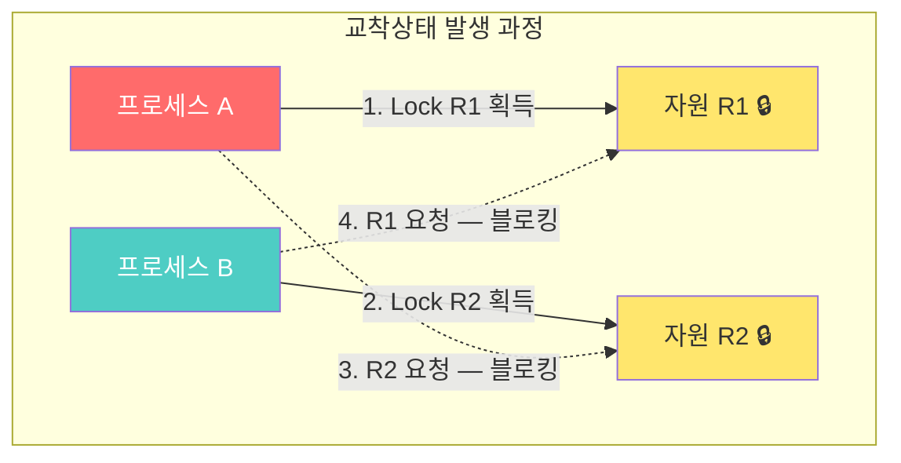
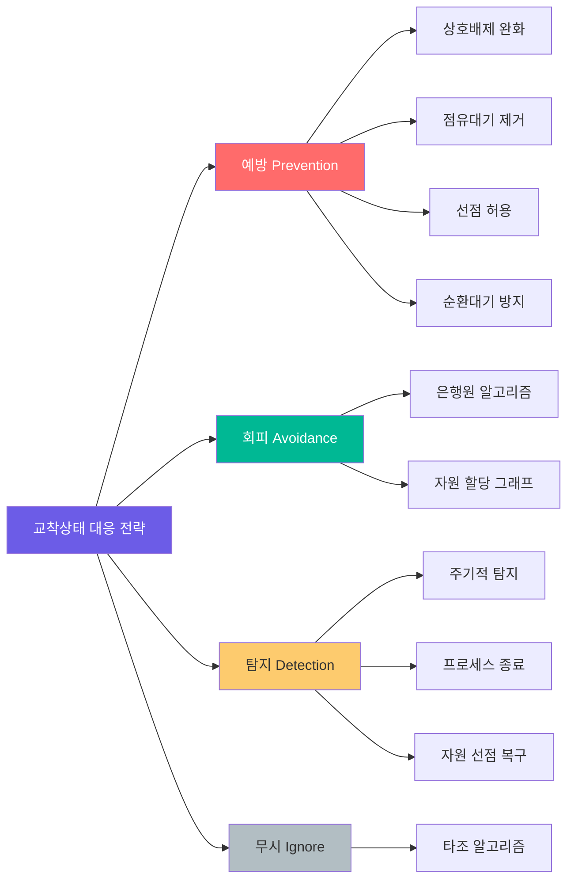

**교착상태(Deadlock)**는 둘 이상의 프로세스가 서로 상대방이 점유한 자원을 기다리며 무한히 블로킹되는 상태다. 운영체제와 멀티스레드 프로그래밍에서 가장 치명적인 동시성 문제 중 하나이며, 발생하면 시스템이 완전히 멈출 수 있다.

이 글에서는 다음을 다룬다:

- **교착상태 발생 4가지 필요조건** (Coffman 조건)
- **교착상태 예방(Prevention)**: 필요조건 중 하나를 원천 차단
- **교착상태 회피(Avoidance)**: 은행원 알고리즘으로 안전 상태 유지
- **교착상태 탐지(Detection) 및 복구(Recovery)**
- **실무에서의 데드락**: DB, Java, Go 환경의 실전 사례

---

## 핵심 개념

### 교착상태란?

교착상태는 일상에서 **좁은 골목길에서 두 차가 마주친 상황**과 같다. 양쪽 다 상대방이 비켜줄 때까지 기다리고, 아무도 움직이지 않는다. 컴퓨터에서는 프로세스 A가 자원 1을 점유한 채 자원 2를 요청하고, 프로세스 B가 자원 2를 점유한 채 자원 1을 요청하면 교착상태가 발생한다.

### Coffman의 4가지 필요조건

1965년 Edward Coffman이 정의한 교착상태 발생의 **필요충분조건** 4가지다. 이 4가지가 **동시에** 성립해야만 교착상태가 발생한다.

| 조건 | 설명 | 비유 |
|------|------|------|
| **상호 배제 (Mutual Exclusion)** | 자원을 한 번에 하나의 프로세스만 사용 | 화장실 칸 하나에 한 명만 |
| **점유 대기 (Hold and Wait)** | 자원을 점유한 채 다른 자원을 대기 | 포크 하나 쥐고 다른 포크 기다림 |
| **비선점 (No Preemption)** | 자원을 강제로 빼앗을 수 없음 | 식사 중인 사람 포크 뺏기 불가 |
| **순환 대기 (Circular Wait)** | 프로세스 간 자원 요청이 원형 고리 | A→B→C→A 순환 의존 |

### 자원 할당 그래프 (Resource Allocation Graph)

교착상태를 시각적으로 표현하는 방법이다. **프로세스(원)**와 **자원(사각형)**을 노드로, **요청(점선)**과 **할당(실선)**을 간선으로 표현한다. 그래프에 **사이클이 존재**하면 교착상태 가능성이 있다.

---

## 동작 원리



위 다이어그램에서 프로세스 A는 R1을 점유하고 R2를 기다리며, 프로세스 B는 R2를 점유하고 R1을 기다린다. 서로의 자원을 놓지 않으므로 무한 대기 — 이것이 교착상태다.

### 교착상태 해결 전략 비교



### 은행원 알고리즘 (Banker's Algorithm)

다익스트라가 고안한 교착상태 **회피** 알고리즘이다. 은행이 고객 대출 시 파산하지 않도록 관리하는 방식에서 유래했다.

**핵심 개념:**
- **Available**: 현재 사용 가능한 자원 수
- **Max**: 각 프로세스가 최대로 필요한 자원 수
- **Allocation**: 현재 할당된 자원 수
- **Need**: 추가로 필요한 자원 수 (Max - Allocation)

자원을 할당하기 전에 "이 할당 후에도 안전 상태(Safe State)인가?"를 검사한다. 안전 순서(Safe Sequence)가 존재하면 할당하고, 그렇지 않으면 거부한다.

---

## 코드로 이해하기

### 예제 1: Python으로 보는 교착상태

```python
import threading
import time

lock_a = threading.Lock()
lock_b = threading.Lock()

def worker_1():
    print("[Worker-1] lock_a 획득 시도...")
    with lock_a:
        print("[Worker-1] lock_a 획득 완료!")
        time.sleep(0.1)  # 컨텍스트 스위칭 유도
        print("[Worker-1] lock_b 획득 시도...")
        with lock_b:  # 여기서 블로킹 — Worker-2가 lock_b 보유 중
            print("[Worker-1] lock_b 획득 완료!")

def worker_2():
    print("[Worker-2] lock_b 획득 시도...")
    with lock_b:
        print("[Worker-2] lock_b 획득 완료!")
        time.sleep(0.1)
        print("[Worker-2] lock_a 획득 시도...")
        with lock_a:  # 여기서 블로킹 — Worker-1이 lock_a 보유 중
            print("[Worker-2] lock_a 획득 완료!")

t1 = threading.Thread(target=worker_1)
t2 = threading.Thread(target=worker_2)
t1.start()
t2.start()

# 실행하면 두 스레드 모두 영원히 블로킹됨
# t1.join(timeout=3)
# t2.join(timeout=3)
# print("타임아웃 — 교착상태 발생!")
```

**실행 결과:** Worker-1이 lock_a를, Worker-2가 lock_b를 각각 획득한 후 서로의 락을 기다리며 영원히 멈춘다.

### 예제 2: 교착상태 해결 — 락 순서 통일

```python
import threading
import time

lock_a = threading.Lock()
lock_b = threading.Lock()

def safe_worker_1():
    """순환 대기 조건을 제거: 항상 lock_a → lock_b 순서"""
    with lock_a:
        print("[Safe-1] lock_a 획득")
        time.sleep(0.1)
        with lock_b:
            print("[Safe-1] lock_b 획득 — 작업 수행!")

def safe_worker_2():
    """동일한 순서: lock_a → lock_b (lock_b → lock_a 아님!)"""
    with lock_a:  # lock_b가 아니라 lock_a를 먼저!
        print("[Safe-2] lock_a 획득")
        time.sleep(0.1)
        with lock_b:
            print("[Safe-2] lock_b 획득 — 작업 수행!")

t1 = threading.Thread(target=safe_worker_1)
t2 = threading.Thread(target=safe_worker_2)
t1.start()
t2.start()
t1.join()
t2.join()
print("교착상태 없이 정상 종료!")
```

**핵심:** 모든 스레드가 **동일한 순서**로 락을 획득하면 순환 대기가 깨져 교착상태가 발생하지 않는다. 이것이 가장 실용적인 예방법이다.

### 예제 3: 은행원 알고리즘 구현

```python
import numpy as np

def bankers_algorithm(available, max_need, allocation):
    """
    은행원 알고리즘: 안전 상태 여부 판별
    Returns: (is_safe, safe_sequence)
    """
    n_processes = len(max_need)
    n_resources = len(available)

    need = max_need - allocation
    work = available.copy()
    finish = [False] * n_processes
    safe_seq = []

    while len(safe_seq) < n_processes:
        found = False
        for i in range(n_processes):
            if not finish[i] and all(need[i] <= work):
                # 프로세스 i가 실행 가능
                work += allocation[i]  # 자원 반환
                finish[i] = True
                safe_seq.append(f"P{i}")
                found = True
                break
        if not found:
            return False, []  # 안전 순서 없음 → 교착상태 위험

    return True, safe_seq

# 예제: 3개 자원 타입, 5개 프로세스
available = np.array([3, 3, 2])
max_need = np.array([
    [7, 5, 3],  # P0
    [3, 2, 2],  # P1
    [9, 0, 2],  # P2
    [2, 2, 2],  # P3
    [4, 3, 3],  # P4
])
allocation = np.array([
    [0, 1, 0],  # P0
    [2, 0, 0],  # P1
    [3, 0, 2],  # P2
    [2, 1, 1],  # P3
    [0, 0, 2],  # P4
])

is_safe, seq = bankers_algorithm(available, max_need, allocation)
print(f"안전 상태: {is_safe}")
print(f"안전 순서: {' → '.join(seq)}")
# 출력: 안전 상태: True
# 출력: 안전 순서: P1 → P3 → P4 → P0 → P2
```

---

## 실무 적용

### 데이터베이스 데드락

실무에서 가장 흔하게 마주치는 교착상태는 **DB 트랜잭션 데드락**이다.

```sql
-- 트랜잭션 A
BEGIN;
UPDATE accounts SET balance = balance - 100 WHERE id = 1;  -- Row 1 잠금
UPDATE accounts SET balance = balance + 100 WHERE id = 2;  -- Row 2 대기...

-- 트랜잭션 B (동시 실행)
BEGIN;
UPDATE accounts SET balance = balance - 50 WHERE id = 2;   -- Row 2 잠금
UPDATE accounts SET balance = balance + 50 WHERE id = 1;   -- Row 1 대기... → 데드락!
```

**MySQL/PostgreSQL 대응:**
- DB 엔진이 자동으로 데드락을 **탐지**하고 하나의 트랜잭션을 **롤백**
- MySQL: `innodb_deadlock_detect = ON` (기본값), `SHOW ENGINE INNODB STATUS`로 데드락 로그 확인
- PostgreSQL: `log_lock_waits = on`, `deadlock_timeout = 1s` 설정

**예방법:**
- 테이블/행 접근 순서를 일관되게 유지 (ID 오름차순)
- 트랜잭션 범위를 최소화
- `SELECT ... FOR UPDATE NOWAIT`로 대기 대신 즉시 실패

### Java에서의 데드락 탐지

```java
// jstack으로 데드락 탐지
// $ jstack <PID> | grep -A 20 "deadlock"

// 프로그래밍 방식 탐지
ThreadMXBean mbean = ManagementFactory.getThreadMXBean();
long[] deadlockedThreads = mbean.findDeadlockedThreads();
if (deadlockedThreads != null) {
    ThreadInfo[] infos = mbean.getThreadInfo(deadlockedThreads, true, true);
    for (ThreadInfo info : infos) {
        System.err.println("Deadlocked thread: " + info.getThreadName());
        System.err.println("Waiting for lock: " + info.getLockName());
        System.err.println("Held by: " + info.getLockOwnerName());
    }
}
```

### Go의 교착상태 런타임 탐지

Go 런타임은 모든 고루틴이 블로킹되면 자동으로 `fatal error: all goroutines are asleep - deadlock!`을 출력한다.

```go
package main

import "sync"

func main() {
    var mu sync.Mutex
    mu.Lock()
    mu.Lock() // fatal error: all goroutines are asleep - deadlock!
}
```

### 흔한 실수와 장애 사례

| 실수 | 결과 | 해결 |
|------|------|------|
| 중첩 락 순서 불일치 | 스레드 데드락 | 전역 락 순서 정의 문서화 |
| DB 트랜잭션 내 외부 API 호출 | 긴 락 점유 → 데드락 | 트랜잭션 밖에서 API 호출 |
| 커넥션 풀 고갈 + 중첩 쿼리 | 커넥션 교착 | 풀 크기 증가, 중첩 방지 |
| `synchronized` 블록 내 `wait()` 없이 무한루프 | 사실상 데드락 | `wait()/notify()` 패턴 사용 |

---

## Deep Dive: 리눅스 커널의 락 의존성 검사기 (Lockdep)

리눅스 커널은 **Lockdep(Lock Dependency Validator)**이라는 런타임 검증 도구를 내장하고 있다. 커널 컴파일 시 `CONFIG_LOCKDEP=y`로 활성화하면, 모든 락 획득/해제를 추적하여 **잠재적 교착상태를 실행 시점에 경고**한다.

### Lockdep의 동작 원리

1. **락 클래스 추적**: 각 락 인스턴스를 클래스로 분류하고, 클래스 간 의존 관계를 방향 그래프로 구축
2. **순환 탐지**: 새로운 락 획득 시 의존 그래프에 사이클이 생기는지 검사
3. **즉시 경고**: 사이클 발견 시 `BUG: possible circular locking dependency detected` 출력

```
 ======================================================
 WARNING: possible circular locking dependency detected
 ======================================================
 swapper/0 is trying to acquire lock:
  (&rq->lock){-.-.}, at: task_fork_fair+0x35/0x160

 but task is already holding lock:
  (&p->pi_lock){-.-.}, at: sched_fork+0x63/0x1d0

 which lock already depends on the new lock.
```

### 왜 중요한가?

커널 코드의 교착상태는 **시스템 전체를 멈추게** 한다. Lockdep은 실제 교착상태가 **발생하기 전에** 잠재적 위험을 탐지한다. 실제로 "아직 한 번도 동시에 실행된 적 없는 코드 경로"에서도 락 순서 위반을 미리 잡아낸다.

### 유저스페이스에서의 활용

- **Valgrind Helgrind**: 유저 프로그램의 락 순서 위반 탐지
- **ThreadSanitizer (TSan)**: GCC/Clang 내장 도구, 데이터 레이스 + 데드락 탐지
- **Go Race Detector**: `go run -race` 옵션

```bash
# C/C++ 데드락 탐지
gcc -fsanitize=thread -g -o myapp myapp.c
./myapp  # 데드락 가능성 발견 시 경고 출력

# Valgrind Helgrind
valgrind --tool=helgrind ./myapp
```

---

## 면접 Q&A

| 질문 | 핵심 답변 |
|------|----------|
| Q1 (기초) 교착상태의 4가지 필요조건은? | 상호배제, 점유대기, 비선점, 순환대기. 4가지가 **동시에** 만족되어야 교착상태가 발생하며, 하나만 깨뜨려도 교착상태를 예방할 수 있다. |
| Q2 (중급) 예방 vs 회피 vs 탐지의 차이는? | **예방**: 4조건 중 하나를 구조적으로 제거 (보수적, 자원 낭비). **회피**: 은행원 알고리즘으로 할당 전 안전성 검사 (오버헤드). **탐지**: 교착상태 발생을 허용하고 주기적으로 탐지 후 복구 (실용적). |
| Q3 (심화) 은행원 알고리즘의 한계는? | 프로세스가 최대 자원 요구량을 미리 알아야 하고, 프로세스 수와 자원 수가 고정되어야 한다. 실제 운영체제에서는 이 조건을 만족하기 어려워 현대 OS는 대부분 **탐지+복구** 또는 **무시(타조 알고리즘)** 전략을 사용한다. |
| Q4 (실무) DB 데드락이 빈번하게 발생할 때 대처법은? | 1) 트랜잭션 내 테이블/행 접근 순서를 ID 오름차순으로 통일, 2) 트랜잭션 범위를 최소화, 3) `SELECT FOR UPDATE NOWAIT`로 즉시 실패, 4) `innodb_deadlock_detect` 모니터링, 5) 재시도 로직 구현 (exponential backoff). |
| Q5 (시니어) 분산 시스템에서의 교착상태는? | 단일 머신과 달리 **글로벌 상태 파악이 어렵다.** 분산 데드락 탐지에는 중앙 코디네이터(Centralized), 분산 탐지(Distributed), 타임아웃 기반 접근법이 있다. 실무에서는 **타임아웃 + 재시도**가 가장 보편적. 분산 락(Redis Redlock, ZooKeeper)은 TTL로 교착상태를 자연 해소한다. |

---

## 정리

| 항목 | 설명 |
|------|------|
| 핵심 키워드 | Deadlock, Coffman 조건, 은행원 알고리즘, 자원 할당 그래프, Lockdep |
| 관련 개념 | 뮤텍스, 세마포어, 스핀락, 모니터, 조건 변수 |
| 연관 주제 | 프로세스 동기화, 스레드 안전성, 분산 락, 트랜잭션 격리 수준 |
| 난이도 | ★★★☆☆ |
| 실무 중요도 | ★★★★★ |

---

## 관련 포스트

- [[HoneyByte] OS: 메모리 관리와 가상 메모리](/2026/03/09/honeybyte-2026-03-09-os-메모리-관리와-가상-메모리/) — 가상 메모리의 페이지 교체 과정에서도 자원 경쟁이 발생할 수 있으며, 교착상태와 연결된다

---

## 레퍼런스

### 영상
- [Operating Systems: Deadlocks](https://www.youtube.com/watch?v=UVo9FGnCEQw) — freeCodeCamp.org, 교착상태 전반 개념 설명
- [교착상태(Deadlock) 완벽 정리](https://www.youtube.com/watch?v=ESXCSNGFVto) — 쉬운코드, 한국어 교착상태 핵심 개념과 해결법
- [Deadlock in Operating System](https://www.youtube.com/watch?v=onkWXaXAgbY) — Computerphile, 자원 할당 그래프와 교착상태 시각적 설명

### 문서
- [Operating System Concepts (Silberschatz) — Chapter 8: Deadlocks](https://www.os-book.com/OS10/) — 교과서적 데드락 이론의 정석
- [Linux Kernel Lock Dependency Validator (Lockdep)](https://www.kernel.org/doc/html/latest/locking/lockdep-design.html) — 리눅스 커널 공식 Lockdep 설계 문서
- [MySQL InnoDB Deadlock Detection](https://dev.mysql.com/doc/refman/8.0/en/innodb-deadlock-detection.html) — MySQL 공식 데드락 탐지 메커니즘
