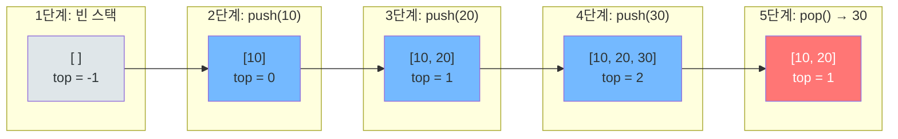
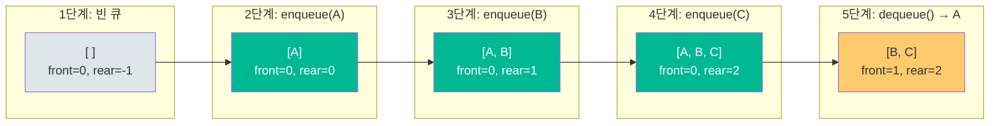
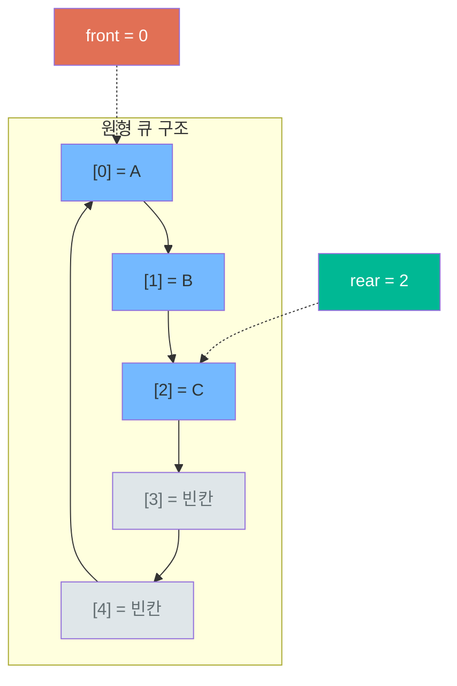

**스택(Stack)**과 **큐(Queue)**는 데이터를 저장하고 꺼내는 순서가 정해진 선형 자료구조다. 단순해 보이지만 운영체제, 컴파일러, 네트워크, 웹 브라우저 등 컴퓨터 과학의 거의 모든 분야에서 핵심 역할을 한다.

이 글에서는 다음을 다룬다:

- **스택**: LIFO(Last In First Out) 원리와 구현
- **큐**: FIFO(First In First Out) 원리와 구현
- **덱(Deque)**: 양방향 삽입/삭제가 가능한 자료구조
- **원형 큐(Circular Queue)**: 배열 기반 큐의 공간 낭비 해결
- **우선순위 큐(Priority Queue)**: 힙 기반의 우선순위 처리
- **실무 활용**: 브라우저 히스토리, BFS, 작업 스케줄링 등

---

## 📚 핵심 개념

### 스택(Stack)이란?

스택은 **접시 쌓기**와 같다. 접시를 쌓을 때 가장 위에 올리고, 꺼낼 때도 가장 위에서 꺼낸다. 이 원리를 **LIFO(Last In First Out, 후입선출)**라 한다.

| 연산 | 설명 | 시간복잡도 |
|------|------|-----------|
| `push(item)` | 스택 꼭대기에 요소 추가 | O(1) |
| `pop()` | 스택 꼭대기 요소 제거 및 반환 | O(1) |
| `peek()` / `top()` | 꼭대기 요소 확인 (제거 안 함) | O(1) |
| `isEmpty()` | 스택이 비었는지 확인 | O(1) |
| `size()` | 스택의 요소 개수 반환 | O(1) |

**스택이 쓰이는 대표적 사례:**
- 함수 호출 스택 (Call Stack)
- 브라우저 뒤로 가기
- 괄호 유효성 검사
- Undo/Redo 기능
- DFS (깊이 우선 탐색)

### 큐(Queue)란?

큐는 **줄 서기**와 같다. 먼저 줄을 선 사람이 먼저 서비스를 받는다. 이 원리를 **FIFO(First In First Out, 선입선출)**라 한다.

| 연산 | 설명 | 시간복잡도 |
|------|------|-----------|
| `enqueue(item)` | 큐의 뒤(rear)에 요소 추가 | O(1) |
| `dequeue()` | 큐의 앞(front) 요소 제거 및 반환 | O(1) |
| `peek()` / `front()` | 앞쪽 요소 확인 (제거 안 함) | O(1) |
| `isEmpty()` | 큐가 비었는지 확인 | O(1) |
| `size()` | 큐의 요소 개수 반환 | O(1) |

**큐가 쓰이는 대표적 사례:**
- 프린터 대기열
- 프로세스 스케줄링 (CPU 스케줄러)
- BFS (너비 우선 탐색)
- 메시지 큐 (Kafka, RabbitMQ)
- 버퍼 (키보드 입력, 네트워크 패킷)

### 스택 vs 큐 비교

| 항목 | 스택 (Stack) | 큐 (Queue) |
|------|-------------|-----------|
| 원리 | LIFO (후입선출) | FIFO (선입선출) |
| 삽입 위치 | 꼭대기(top) | 뒤쪽(rear) |
| 삭제 위치 | 꼭대기(top) | 앞쪽(front) |
| 열린 끝 | 한쪽만 열림 | 양쪽 열림 |
| 대표 활용 | DFS, Undo, 괄호 검사 | BFS, 스케줄링, 버퍼 |

### 덱(Deque, Double-Ended Queue)

덱은 **양쪽 끝에서 삽입과 삭제가 모두 가능**한 자료구조다. 스택과 큐의 기능을 합친 형태로, Python의 `collections.deque`와 Java의 `ArrayDeque`가 대표적이다.

| 연산 | 설명 | 시간복잡도 |
|------|------|-----------|
| `addFirst()` / `appendleft()` | 앞쪽에 삽입 | O(1) |
| `addLast()` / `append()` | 뒤쪽에 삽입 | O(1) |
| `removeFirst()` / `popleft()` | 앞쪽에서 제거 | O(1) |
| `removeLast()` / `pop()` | 뒤쪽에서 제거 | O(1) |

### 우선순위 큐(Priority Queue)

일반 큐와 달리 **우선순위가 높은 요소가 먼저 나온다**. 내부적으로 **힙(Heap)** 자료구조로 구현되며, 삽입과 삭제 모두 O(log n)의 시간복잡도를 가진다.

| 연산 | 시간복잡도 |
|------|-----------|
| 삽입 (insert) | O(log n) |
| 최솟값/최댓값 삭제 (extract) | O(log n) |
| 최솟값/최댓값 조회 (peek) | O(1) |

---

## ⚙️ 동작 원리

### 스택의 Push / Pop 과정



`push` 시 top 포인터가 1 증가하며 요소가 추가되고, `pop` 시 top 위치의 요소가 반환된 후 top이 1 감소한다. 모든 연산이 top에서만 일어나므로 O(1)이다.

### 큐의 Enqueue / Dequeue 과정



`enqueue` 시 rear가 1 증가하며 뒤쪽에 요소가 추가되고, `dequeue` 시 front 위치의 요소가 반환된 후 front가 1 증가한다. 삽입은 뒤에서, 삭제는 앞에서 — 이것이 FIFO의 핵심이다.

### 원형 큐 (Circular Queue)

배열 기반 큐에서 dequeue를 반복하면 앞쪽 공간이 낭비된다. 원형 큐는 배열의 끝과 처음을 연결하여 이 문제를 해결한다.



핵심 공식: `next_index = (current_index + 1) % capacity`

이 모듈로 연산 덕분에 rear가 배열 끝에 도달해도 앞쪽 빈 공간을 재활용할 수 있다.

---

## 💻 코드로 이해하기

### Python 구현

#### 스택 (배열 기반)

```python
class Stack:
    """배열 기반 스택 구현"""

    def __init__(self):
        self._data = []

    def push(self, item):
        """스택 꼭대기에 요소 추가 - O(1) 분할 상환"""
        self._data.append(item)

    def pop(self):
        """꼭대기 요소 제거 및 반환 - O(1)"""
        if self.is_empty():
            raise IndexError("pop from empty stack")
        return self._data.pop()

    def peek(self):
        """꼭대기 요소 확인 - O(1)"""
        if self.is_empty():
            raise IndexError("peek from empty stack")
        return self._data[-1]

    def is_empty(self):
        return len(self._data) == 0

    def size(self):
        return len(self._data)

    def __repr__(self):
        return f"Stack({self._data})"


# 사용 예시
stack = Stack()
stack.push(10)
stack.push(20)
stack.push(30)
print(stack)          # Stack([10, 20, 30])
print(stack.pop())    # 30 (LIFO)
print(stack.peek())   # 20
```

#### 큐 (collections.deque 기반)

```python
from collections import deque

class Queue:
    """deque 기반 큐 구현 - 모든 연산 O(1)"""

    def __init__(self):
        self._data = deque()

    def enqueue(self, item):
        """뒤쪽에 요소 추가 - O(1)"""
        self._data.append(item)

    def dequeue(self):
        """앞쪽 요소 제거 및 반환 - O(1)"""
        if self.is_empty():
            raise IndexError("dequeue from empty queue")
        return self._data.popleft()

    def front(self):
        """앞쪽 요소 확인 - O(1)"""
        if self.is_empty():
            raise IndexError("front from empty queue")
        return self._data[0]

    def is_empty(self):
        return len(self._data) == 0

    def size(self):
        return len(self._data)

    def __repr__(self):
        return f"Queue({list(self._data)})"


# 사용 예시
queue = Queue()
queue.enqueue("A")
queue.enqueue("B")
queue.enqueue("C")
print(queue)            # Queue(['A', 'B', 'C'])
print(queue.dequeue())  # A (FIFO)
print(queue.front())    # B
```

#### 원형 큐

```python
class CircularQueue:
    """고정 크기 원형 큐"""

    def __init__(self, capacity):
        self._data = [None] * capacity
        self._capacity = capacity
        self._front = 0
        self._rear = -1
        self._size = 0

    def enqueue(self, item):
        if self._size == self._capacity:
            raise OverflowError("queue is full")
        self._rear = (self._rear + 1) % self._capacity
        self._data[self._rear] = item
        self._size += 1

    def dequeue(self):
        if self.is_empty():
            raise IndexError("dequeue from empty queue")
        item = self._data[self._front]
        self._data[self._front] = None
        self._front = (self._front + 1) % self._capacity
        self._size -= 1
        return item

    def is_empty(self):
        return self._size == 0

    def is_full(self):
        return self._size == self._capacity


# 사용 예시
cq = CircularQueue(3)
cq.enqueue(1)
cq.enqueue(2)
cq.enqueue(3)
print(cq.dequeue())  # 1
cq.enqueue(4)        # 앞쪽 빈 공간 재활용
print(cq.dequeue())  # 2
```

#### 스택 2개로 큐 구현 (면접 빈출)

```python
class QueueUsingStacks:
    """스택 2개로 큐 구현 - 면접 단골 문제"""

    def __init__(self):
        self._in_stack = []   # enqueue용
        self._out_stack = []  # dequeue용

    def enqueue(self, item):
        self._in_stack.append(item)

    def dequeue(self):
        if not self._out_stack:
            while self._in_stack:
                self._out_stack.append(self._in_stack.pop())
        if not self._out_stack:
            raise IndexError("dequeue from empty queue")
        return self._out_stack.pop()


# 분할 상환 분석: dequeue 평균 O(1)
q = QueueUsingStacks()
q.enqueue(1)
q.enqueue(2)
q.enqueue(3)
print(q.dequeue())  # 1
print(q.dequeue())  # 2
```

### Java 구현

#### 스택 (배열 기반)

```java
public class ArrayStack<T> {
    private Object[] data;
    private int top;
    private int capacity;

    public ArrayStack(int capacity) {
        this.capacity = capacity;
        this.data = new Object[capacity];
        this.top = -1;
    }

    public void push(T item) {
        if (top == capacity - 1) {
            resize(capacity * 2);
        }
        data[++top] = item;
    }

    @SuppressWarnings("unchecked")
    public T pop() {
        if (isEmpty()) throw new RuntimeException("Stack is empty");
        T item = (T) data[top];
        data[top--] = null; // GC 도움
        return item;
    }

    @SuppressWarnings("unchecked")
    public T peek() {
        if (isEmpty()) throw new RuntimeException("Stack is empty");
        return (T) data[top];
    }

    public boolean isEmpty() { return top == -1; }
    public int size() { return top + 1; }

    private void resize(int newCapacity) {
        Object[] newData = new Object[newCapacity];
        System.arraycopy(data, 0, newData, 0, top + 1);
        data = newData;
        capacity = newCapacity;
    }

    public static void main(String[] args) {
        ArrayStack<Integer> stack = new ArrayStack<>(4);
        stack.push(10);
        stack.push(20);
        stack.push(30);
        System.out.println(stack.pop());  // 30
        System.out.println(stack.peek()); // 20
    }
}
```

#### 큐 (연결 리스트 기반)

```java
public class LinkedQueue<T> {
    private static class Node<T> {
        T data;
        Node<T> next;
        Node(T data) { this.data = data; }
    }

    private Node<T> front;
    private Node<T> rear;
    private int size;

    public LinkedQueue() {
        front = rear = null;
        size = 0;
    }

    public void enqueue(T item) {
        Node<T> newNode = new Node<>(item);
        if (isEmpty()) {
            front = rear = newNode;
        } else {
            rear.next = newNode;
            rear = newNode;
        }
        size++;
    }

    public T dequeue() {
        if (isEmpty()) throw new RuntimeException("Queue is empty");
        T item = front.data;
        front = front.next;
        if (front == null) rear = null;
        size--;
        return item;
    }

    public T front() {
        if (isEmpty()) throw new RuntimeException("Queue is empty");
        return front.data;
    }

    public boolean isEmpty() { return size == 0; }
    public int size() { return size; }

    public static void main(String[] args) {
        LinkedQueue<String> queue = new LinkedQueue<>();
        queue.enqueue("A");
        queue.enqueue("B");
        queue.enqueue("C");
        System.out.println(queue.dequeue()); // A
        System.out.println(queue.front());   // B
    }
}
```

#### 원형 큐 (배열 기반)

```java
public class CircularQueue<T> {
    private Object[] data;
    private int front, rear, size, capacity;

    public CircularQueue(int capacity) {
        this.capacity = capacity;
        this.data = new Object[capacity];
        this.front = 0;
        this.rear = -1;
        this.size = 0;
    }

    public void enqueue(T item) {
        if (size == capacity) throw new RuntimeException("Queue is full");
        rear = (rear + 1) % capacity;
        data[rear] = item;
        size++;
    }

    @SuppressWarnings("unchecked")
    public T dequeue() {
        if (isEmpty()) throw new RuntimeException("Queue is empty");
        T item = (T) data[front];
        data[front] = null;
        front = (front + 1) % capacity;
        size--;
        return item;
    }

    public boolean isEmpty() { return size == 0; }
    public boolean isFull() { return size == capacity; }
}
```

### 시간/공간 복잡도 종합

| 자료구조 | push / enqueue | pop / dequeue | peek | 공간복잡도 |
|---------|---------------|--------------|------|-----------|
| 스택 (배열) | O(1)* | O(1) | O(1) | O(n) |
| 스택 (연결 리스트) | O(1) | O(1) | O(1) | O(n) |
| 큐 (배열) | O(1)* | O(1) | O(1) | O(n) |
| 큐 (연결 리스트) | O(1) | O(1) | O(1) | O(n) |
| 원형 큐 | O(1) | O(1) | O(1) | O(n) |
| 덱 (deque) | O(1) | O(1) | O(1) | O(n) |
| 우선순위 큐 (힙) | O(log n) | O(log n) | O(1) | O(n) |

\* 분할 상환(amortized) O(1) — 동적 배열 리사이징 시 간헐적 O(n)

---

## 🔧 실무 적용

### 1. 브라우저 뒤로 가기 / 앞으로 가기 (스택 2개)

```python
class BrowserHistory:
    def __init__(self, homepage):
        self.back_stack = [homepage]
        self.forward_stack = []

    def visit(self, url):
        self.back_stack.append(url)
        self.forward_stack.clear()  # 새 페이지 방문 시 앞으로 가기 초기화

    def back(self):
        if len(self.back_stack) > 1:
            self.forward_stack.append(self.back_stack.pop())
        return self.back_stack[-1]

    def forward(self):
        if self.forward_stack:
            self.back_stack.append(self.forward_stack.pop())
        return self.back_stack[-1]
```

### 2. BFS (너비 우선 탐색) — 큐 활용

```python
from collections import deque

def bfs(graph, start):
    visited = set([start])
    queue = deque([start])
    result = []

    while queue:
        node = queue.popleft()
        result.append(node)
        for neighbor in graph[node]:
            if neighbor not in visited:
                visited.add(neighbor)
                queue.append(neighbor)
    return result
```

### 3. 작업 스케줄러 (우선순위 큐)

```python
import heapq
from dataclasses import dataclass, field

@dataclass(order=True)
class Task:
    priority: int
    name: str = field(compare=False)

class TaskScheduler:
    def __init__(self):
        self._queue = []

    def add_task(self, name, priority):
        heapq.heappush(self._queue, Task(priority, name))

    def next_task(self):
        if self._queue:
            return heapq.heappop(self._queue).name
        return None

# 숫자가 작을수록 우선순위 높음
scheduler = TaskScheduler()
scheduler.add_task("버그 수정", 1)
scheduler.add_task("문서 작성", 3)
scheduler.add_task("보안 패치", 0)
print(scheduler.next_task())  # 보안 패치
print(scheduler.next_task())  # 버그 수정
```

### 4. 괄호 유효성 검사 (스택)

```python
def is_valid_parentheses(s: str) -> bool:
    stack = []
    pairs = {')': '(', ']': '[', '}': '{'}

    for char in s:
        if char in '([{':
            stack.append(char)
        elif char in ')]}':
            if not stack or stack[-1] != pairs[char]:
                return False
            stack.pop()

    return len(stack) == 0

print(is_valid_parentheses("({[]})"))  # True
print(is_valid_parentheses("([)]"))    # False
```

### 5. 메시지 큐 패턴 (Producer-Consumer)

실무에서 Kafka, RabbitMQ, SQS 등의 메시지 브로커는 모두 큐의 확장이다. 기본 원리는 동일하다:

```python
import threading
from collections import deque

class MessageQueue:
    def __init__(self, max_size=100):
        self._queue = deque(maxlen=max_size)
        self._lock = threading.Lock()
        self._not_empty = threading.Condition(self._lock)

    def produce(self, message):
        with self._not_empty:
            self._queue.append(message)
            self._not_empty.notify()

    def consume(self, timeout=None):
        with self._not_empty:
            while not self._queue:
                self._not_empty.wait(timeout)
                if not self._queue:
                    return None
            return self._queue.popleft()
```

---

## 🔬 Deep Dive

### 배열 vs 연결 리스트 구현 — 무엇을 선택할까?

| 기준 | 배열 기반 | 연결 리스트 기반 |
|------|----------|----------------|
| 캐시 친화성 | 높음 (연속 메모리) | 낮음 (포인터 추적) |
| 메모리 오버헤드 | 미사용 슬롯 낭비 가능 | 노드당 포인터 추가 메모리 |
| 크기 예측 가능 | 배열이 유리 | 동적 변화에 유리 |
| GC 부담 (Java) | 적음 | 노드 객체 다수 생성 |

**결론**: 현대 하드웨어에서는 캐시 성능이 중요하므로, 크기를 대략 예측할 수 있다면 **배열 기반이 일반적으로 더 빠르다**. Java의 `ArrayDeque` 공식 문서도 "LinkedList보다 스택/큐로 사용할 때 더 빠를 가능성이 높다"고 명시한다.

### Python `list`를 큐로 쓰면 안 되는 이유

Python의 `list.pop(0)`은 O(n)이다. 앞쪽 요소를 제거하면 나머지 요소를 모두 한 칸씩 당겨야 하기 때문이다. 이런 이유로 Python에서 큐가 필요하면 반드시 `collections.deque`를 사용해야 한다.

```python
# 나쁜 예 — O(n) dequeue
queue = [1, 2, 3]
queue.pop(0)  # 내부적으로 전체 요소 이동 발생

# 좋은 예 — O(1) dequeue
from collections import deque
queue = deque([1, 2, 3])
queue.popleft()  # 이중 연결 리스트 기반, O(1) 보장
```

### Java에서 Stack 대신 ArrayDeque를 써야 하는 이유

Java의 `java.util.Stack`은 `Vector`를 상속받아 모든 메서드가 `synchronized`되어 있다. 단일 스레드 환경에서는 불필요한 동기화 오버헤드가 발생한다. Java 공식 문서도 스택이 필요하면 `ArrayDeque`를 권장한다.

```java
// 비추천 — 불필요한 동기화 오버헤드
Stack<Integer> stack = new Stack<>();

// 추천 — 더 빠르고 일관된 API
Deque<Integer> stack = new ArrayDeque<>();
stack.push(1);
stack.pop();
```

### 모노토닉 스택 (Monotonic Stack)

코딩 테스트에서 자주 등장하는 고급 패턴이다. 스택의 요소가 항상 단조증가 또는 단조감소를 유지하도록 관리한다. **Next Greater Element** 문제를 O(n)에 해결할 수 있다.

```python
def next_greater_element(nums):
    """각 요소의 오른쪽에서 처음으로 큰 수 찾기 — O(n)"""
    result = [-1] * len(nums)
    stack = []  # 인덱스 저장

    for i, num in enumerate(nums):
        while stack and nums[stack[-1]] < num:
            idx = stack.pop()
            result[idx] = num
        stack.append(i)

    return result

print(next_greater_element([2, 1, 4, 3]))  # [4, 4, -1, -1]
```

### 슬라이딩 윈도우 최댓값 (덱 활용)

덱을 사용하면 슬라이딩 윈도우 내 최댓값을 O(n)에 구할 수 있다. LeetCode 239번의 핵심 풀이법이다.

```python
from collections import deque

def max_sliding_window(nums, k):
    """크기 k 슬라이딩 윈도우의 최댓값 — O(n)"""
    dq = deque()  # 인덱스 저장, 단조감소 유지
    result = []

    for i, num in enumerate(nums):
        while dq and nums[dq[-1]] <= num:
            dq.pop()
        dq.append(i)

        if dq[0] <= i - k:  # 윈도우 밖 제거
            dq.popleft()

        if i >= k - 1:
            result.append(nums[dq[0]])

    return result

print(max_sliding_window([1, 3, -1, -3, 5, 3, 6, 7], 3))
# [3, 3, 5, 5, 6, 7]
```

---

## 🎯 면접 Q&A

### Q1. 스택과 큐의 차이점을 설명하세요.

**A:** 스택은 LIFO(Last In First Out) 원리로 가장 마지막에 삽입된 요소가 가장 먼저 삭제됩니다. 한쪽 끝(top)에서만 삽입과 삭제가 일어납니다. 큐는 FIFO(First In First Out) 원리로 가장 먼저 삽입된 요소가 가장 먼저 삭제됩니다. 삽입은 rear에서, 삭제는 front에서 일어나 양쪽 끝을 사용합니다. 스택은 DFS, Undo 기능에, 큐는 BFS, 작업 스케줄링에 주로 활용됩니다.

### Q2. 스택 2개로 큐를 구현하세요. 시간복잡도는?

**A:** in_stack에 enqueue하고, dequeue 시 out_stack이 비어있으면 in_stack의 모든 요소를 pop하여 out_stack에 push합니다. 그 후 out_stack에서 pop하면 FIFO 순서가 됩니다. 각 요소는 최대 2번 이동하므로 **분할 상환(amortized) O(1)**입니다. 위의 `QueueUsingStacks` 구현을 참고하세요.

### Q3. 원형 큐가 필요한 이유는?

**A:** 일반 배열 큐에서 dequeue를 반복하면 front 인덱스가 증가하면서 앞쪽 공간이 사용 불가능해집니다. 원형 큐는 `(index + 1) % capacity` 공식으로 배열의 끝과 시작을 논리적으로 연결하여 빈 공간을 재활용합니다. 고정 크기 버퍼(예: 네트워크 패킷 버퍼, 키보드 입력 버퍼)에서 특히 유용합니다.

### Q4. 우선순위 큐와 일반 큐의 차이점은?

**A:** 일반 큐는 FIFO 순서로 요소를 처리하지만, 우선순위 큐는 우선순위가 높은 요소가 먼저 나옵니다. 내부적으로 힙(Heap)으로 구현되어 삽입/삭제가 O(log n)이며, 일반 큐의 O(1)보다 느립니다. 다익스트라 알고리즘, 작업 스케줄링, A* 탐색 등에서 필수적으로 사용됩니다.

### Q5. Python에서 큐 구현 시 `list.pop(0)` 대신 `deque.popleft()`를 써야 하는 이유는?

**A:** `list.pop(0)`은 첫 번째 요소를 제거한 뒤 나머지 모든 요소를 한 칸씩 앞으로 이동시키므로 O(n)입니다. 반면 `deque.popleft()`는 이중 연결 리스트 기반으로 O(1)에 동작합니다. 데이터가 많아질수록 성능 차이가 극적으로 벌어집니다.

### Q6. Java에서 Stack 클래스 대신 ArrayDeque를 권장하는 이유는?

**A:** `java.util.Stack`은 `Vector`를 상속받아 모든 메서드에 `synchronized` 키워드가 붙어있습니다. 멀티스레드 환경이 아니면 불필요한 락 오버헤드가 발생합니다. 또한 `Vector` 상속으로 인해 인덱스 기반 접근(`get(i)`) 같은 스택답지 않은 연산이 노출됩니다. `ArrayDeque`는 동기화 없이 더 빠르고, LIFO/FIFO 인터페이스만 깔끔하게 제공합니다.

---

## 📝 정리

스택과 큐는 가장 기본적인 자료구조이지만, 이를 응용한 패턴은 실무와 면접 모두에서 핵심이다.

**꼭 기억할 것:**

1. **스택 = LIFO**, **큐 = FIFO** — 이 원리가 모든 응용의 출발점이다
2. **Python**: 스택은 `list`, 큐는 `collections.deque` 사용 (`list.pop(0)` 금지)
3. **Java**: `Stack` 클래스 대신 `ArrayDeque` 사용
4. **원형 큐**: `(index + 1) % capacity`로 공간 재활용
5. **우선순위 큐**: 힙 기반, O(log n) 삽입/삭제
6. **면접 필수**: 스택 2개로 큐 구현 (분할 상환 O(1))
7. **고급 패턴**: 모노토닉 스택, 슬라이딩 윈도우 최댓값

---

## 📎 레퍼런스

- [GeeksforGeeks - Stack Data Structure](https://www.geeksforgeeks.org/dsa/stack-data-structure/)
- [GeeksforGeeks - Stack vs Queue](https://www.geeksforgeeks.org/dsa/difference-between-stack-and-queue-data-structures/)
- [CMU 15-121 - Stacks and Queues](https://www.andrew.cmu.edu/course/15-121/lectures/Stacks%20and%20Queues/Stacks%20and%20Queues.html)
- [Wikibooks - Data Structures/Stacks and Queues](https://en.wikibooks.org/wiki/Data_Structures/Stacks_and_Queues)

### 관련 문제 (코딩 테스트 연습)

| 문제 | 플랫폼 | 난이도 | 핵심 개념 |
|------|--------|-------|----------|
| [Valid Parentheses](https://leetcode.com/problems/valid-parentheses/) | LeetCode #20 | Easy | 스택 |
| [Implement Queue using Stacks](https://leetcode.com/problems/implement-queue-using-stacks/) | LeetCode #232 | Easy | 스택 → 큐 |
| [Implement Stack using Queues](https://leetcode.com/problems/implement-stack-using-queues/) | LeetCode #225 | Easy | 큐 → 스택 |
| [Min Stack](https://leetcode.com/problems/min-stack/) | LeetCode #155 | Medium | 보조 스택 |
| [Sliding Window Maximum](https://leetcode.com/problems/sliding-window-maximum/) | LeetCode #239 | Hard | 덱 |
| [Next Greater Element I](https://leetcode.com/problems/next-greater-element-i/) | LeetCode #496 | Easy | 모노토닉 스택 |
| [스택](https://www.acmicpc.net/problem/10828) | 백준 #10828 | Silver V | 스택 기본 |
| [큐](https://www.acmicpc.net/problem/10845) | 백준 #10845 | Silver IV | 큐 기본 |
| [덱](https://www.acmicpc.net/problem/10866) | 백준 #10866 | Silver IV | 덱 기본 |
| [카드2](https://www.acmicpc.net/problem/2164) | 백준 #2164 | Silver IV | 큐 응용 |
