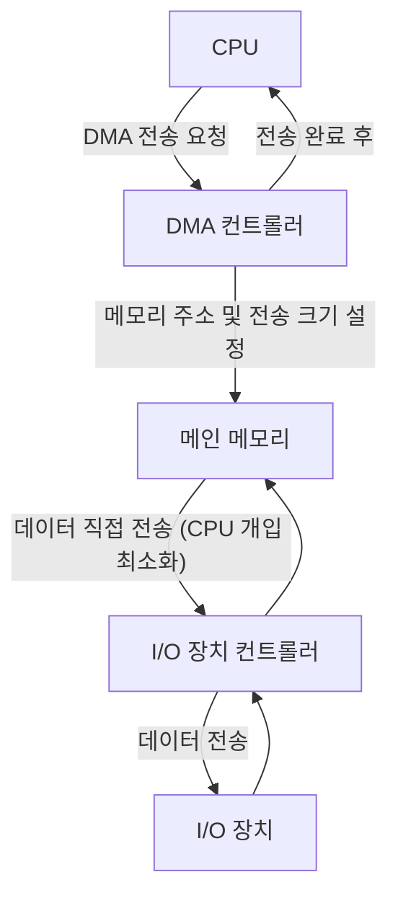

> 운영체제에서 파일 시스템은 데이터를 저장하고 관리하는 핵심적인 방법이며, I/O는 이러한 데이터를 시스템과 외부 장치 간에 주고받는 통로입니다.

## 핵심 요약 (TL;DR)

파일 시스템은 디스크 같은 비휘발성 저장 장치에 데이터를 구조화하고 관리하는 운영체제의 핵심 구성 요소입니다. 이는 파일, 디렉터리, 메타데이터를 조직하고, 사용자에게 일관된 인터페이스를 제공하여 데이터 접근을 용이하게 합니다. I/O(입출력)는 시스템 내부와 외부 장치(디스크, 네트워크, 키보드, 모니터 등) 간에 데이터를 전송하는 과정을 의미하며, 효율적인 I/O 관리는 시스템 성능에 결정적인 영향을 미칩니다. 운영체제는 버퍼링, 캐싱, 스케줄링 등의 기법을 통해 I/O 성능을 최적화하고, 다양한 장치 드라이버를 통해 하드웨어 추상화를 제공합니다.

## 핵심 개념

파일 시스템은 운영체제가 저장 장치(주로 하드 디스크 드라이브나 SSD)에 정보를 저장하고 검색하는 방식을 정의하는 추상화 계층입니다. 이는 단순히 데이터를 저장하는 것을 넘어, 데이터에 의미 있는 이름을 부여하고, 계층적인 디렉터리 구조로 조직하며, 접근 권한을 관리하고, 효율적인 저장 공간 할당 및 회수를 담당합니다.

**파일(File)**: 논리적인 데이터 저장 단위입니다. 운영체제는 파일을 물리적인 디스크 블록에 매핑하여 관리합니다. 파일은 이름, 크기, 생성/수정 시간, 접근 권한 등의 속성(메타데이터)을 가집니다.

**디렉터리(Directory)**: 파일 시스템의 계층적 구조를 형성하는 데 사용됩니다. 디렉터리는 파일 및 다른 디렉터리에 대한 참조를 포함하며, 파일 경로를 통해 특정 파일에 접근할 수 있게 합니다.

**I/O (Input/Output)**: 컴퓨터 시스템과 외부 세계(혹은 다른 컴퓨터 시스템) 사이에서 데이터를 주고받는 모든 동작을 총칭합니다. 이는 키보드 입력, 마우스 클릭, 모니터 출력, 디스크 읽기/쓰기, 네트워크 통신 등을 포함합니다.

**장치 컨트롤러(Device Controller)**: 각 I/O 장치마다 존재하는 특수 하드웨어로, 장치와의 통신을 제어합니다. CPU는 장치 컨트롤러를 통해 I/O 장치에 명령을 내리고 데이터를 주고받습니다.

**장치 드라이버(Device Driver)**: 운영체제 커널의 일부로, 특정 장치 컨트롤러와 통신하는 방법을 알고 있는 소프트웨어 모듈입니다. 장치 드라이버는 하드웨어의 복잡성을 추상화하여, 상위 수준의 운영체제나 애플리케이션이 장치를 쉽게 사용할 수 있도록 합니다.

## 동작 원리

파일 시스템과 I/O의 동작은 밀접하게 연결되어 있습니다. 파일에 대한 읽기/쓰기 요청은 결국 I/O 장치(디스크)에 대한 접근으로 이어집니다.

```mermaid
graph TD
    A[애플리케이션] --> B{시스템 호출 (open, read, write, close)};
    B --> C[운영체제 파일 시스템];
    C -- 파일명 해석, 권한 확인 --> D[파일 관리자];
    D -- 논리적 블록 번호 -> 물리적 블록 주소 변환 --> E[I/O 서브시스템];
    E -- 버퍼링, 캐싱, 스케줄링 --> F[장치 드라이버];
    F -- 하드웨어 특정 명령 --> G[장치 컨트롤러];
    G -- 데이터 전송 --> H[물리적 I/O 장치 (예: 디스크)];
    H --> G;
    G --> F;
    F --> E;
    E --> D;
    D --> C;
    C --> B;
    B --> A;
```
**파일 시스템 동작 흐름**:
1.  **애플리케이션 요청**: 사용자의 애플리케이션은 `open()`, `read()`, `write()`, `close()` 등의 시스템 호출을 통해 파일 시스템에 접근합니다.
2.  **시스템 호출 처리**: 운영체제 커널은 이 시스템 호출을 가로채어 처리합니다.
3.  **파일 시스템 관리**: 파일 시스템은 요청된 파일의 메타데이터(위치, 크기, 권한 등)를 확인하고, 논리적인 파일 블록 번호를 물리적인 디스크 섹터 주소로 변환합니다. 이는 파일 할당 방식(연속 할당, 연결 할당, 색인 할당 등)에 따라 달라집니다.
4.  **I/O 서브시스템**: 변환된 물리적 주소를 바탕으로 I/O 서브시스템이 작동합니다. 이곳에서는 버퍼 캐시 관리, 디스크 스케줄링 등의 최적화가 이루어집니다.
5.  **장치 드라이버**: I/O 서브시스템은 해당 I/O 장치에 맞는 장치 드라이버를 호출합니다. 드라이버는 장치 컨트롤러가 이해할 수 있는 명령어로 변환합니다.
6.  **장치 컨트롤러**: 장치 컨트롤러는 드라이버로부터 명령을 받아 물리적인 하드웨어(예: 디스크의 헤드 이동)를 제어하고 실제 데이터 전송을 수행합니다.
7.  **데이터 전송**: 데이터는 메모리(버퍼)와 I/O 장치 사이에서 전송됩니다. 전송이 완료되면 인터럽트가 발생하여 CPU에 I/O 완료를 알립니다.


**DMA (Direct Memory Access)**:
대부분의 고속 I/O 장치(디스크, 네트워크 카드 등)는 DMA 컨트롤러를 사용하여 CPU의 개입 없이 직접 메모리와 데이터를 주고받습니다.
1.  CPU는 DMA 컨트롤러에게 I/O 장치로부터 읽어올 데이터의 메모리 주소, 전송할 바이트 수, I/O 장치의 포트 번호 등을 설정합니다.
2.  DMA 컨트롤러는 CPU의 개입 없이 직접 I/O 장치와 메모리 사이에서 데이터를 전송합니다.
3.  데이터 전송이 완료되면 DMA 컨트롤러는 CPU에 인터럽트를 발생시켜 작업 완료를 알립니다.
이러한 방식은 CPU가 I/O 작업 동안 다른 작업을 수행할 수 있게 하여 시스템의 전반적인 처리율을 향상시킵니다.

## 코드로 이해하기

파일 시스템과 I/O는 대부분 운영체제 커널 레벨에서 구현되므로, 사용자 애플리케이션에서는 시스템 호출 API를 통해 간접적으로 접근합니다. 여기서는 일반적인 파일 I/O 작업을 파이썬과 C 언어로 살펴보겠습니다.

### 예제 1: Python 파일 읽기/쓰기

```python
import os

file_name = "example.txt"
content_to_write = "Hello, HoneyByte!\nThis is a file I/O example."

# 파일 쓰기
try:
    with open(file_name, "w") as f:
        f.write(content_to_write)
    print(f"'{file_name}'에 쓰기 완료.")
except IOError as e:
    print(f"파일 쓰기 오류: {e}")

# 파일 읽기
try:
    with open(file_name, "r") as f:
        read_content = f.read()
    print(f"'{file_name}'에서 읽은 내용:\n{read_content}")
except IOError as e:
    print(f"파일 읽기 오류: {e}")

# 파일 존재 여부 확인 및 삭제
if os.path.exists(file_name):
    os.remove(file_name)
    print(f"'{file_name}' 삭제 완료.")
else:
    print(f"'{file_name}' 파일이 존재하지 않습니다.")

```
**코드 설명**:
파이썬의 `open()` 함수는 운영체제의 `open()` 시스템 호출을 래핑하여 파일을 열고, `write()` 및 `read()` 메서드는 각각 `write()` 및 `read()` 시스템 호출을 사용하여 실제 디스크 I/O를 수행합니다. `with` 문은 파일 객체가 자동으로 닫히도록 (`close()` 시스템 호출) 보장합니다.

### 예제 2: C 언어 시스템 호출을 이용한 파일 I/O

C 언어에서는 POSIX 표준에 따라 `open`, `read`, `write`, `close` 등의 시스템 호출을 직접 사용하여 파일 I/O를 제어할 수 있습니다.

```c
#include <stdio.h>
#include <stdlib.h>
#include <fcntl.h> // open, close
#include <unistd.h> // read, write, close

#define BUFFER_SIZE 1024
#define FILE_NAME "c_example.txt"

int main() {
    int fd; // 파일 디스크립터
    ssize_t bytes_written, bytes_read;
    char write_buffer[] = "안녕하세요, HoneyByte! C 언어 파일 I/O 예제입니다.";
    char read_buffer[BUFFER_SIZE];

    // 파일 생성 및 쓰기 (O_CREAT: 없으면 생성, O_WRONLY: 쓰기 전용, O_TRUNC: 기존 내용 지움)
    // 0644는 파일 권한 (rw-r--r--)
    fd = open(FILE_NAME, O_CREAT | O_WRONLY | O_TRUNC, 0644);
    if (fd == -1) {
        perror("파일 열기 실패");
        exit(EXIT_FAILURE);
    }

    bytes_written = write(fd, write_buffer, sizeof(write_buffer) - 1); // null terminator 제외
    if (bytes_written == -1) {
        perror("파일 쓰기 실패");
        close(fd);
        exit(EXIT_FAILURE);
    }
    printf("'%s'에 %zd 바이트 쓰기 완료.\n", FILE_NAME, bytes_written);
    close(fd); // 파일 닫기

    // 파일 읽기
    fd = open(FILE_NAME, O_RDONLY); // 읽기 전용으로 열기
    if (fd == -1) {
        perror("파일 열기 실패");
        exit(EXIT_FAILURE);
    }

    bytes_read = read(fd, read_buffer, BUFFER_SIZE - 1); // 버퍼 크기-1 만큼 읽기 (null terminator 공간 확보)
    if (bytes_read == -1) {
        perror("파일 읽기 실패");
        close(fd);
        exit(EXIT_FAILURE);
    }
    read_buffer[bytes_read] = '\0'; // 읽은 데이터 끝에 null terminator 추가
    printf("'%s'에서 읽은 내용:\n%s\n", FILE_NAME, read_buffer);
    close(fd); // 파일 닫기

    // 파일 삭제 (운영체제 명령어)
    if (remove(FILE_NAME) != 0) {
        perror("파일 삭제 실패");
        exit(EXIT_FAILURE);
    }
    printf("'%s' 삭제 완료.\n", FILE_NAME);

    return 0;
}

```
**코드 실행 결과 설명**:
C 언어 예제는 `open()`, `write()`, `read()`, `close()`와 같은 시스템 호출을 직접 사용합니다. 이들은 운영체제 커널에 I/O 작업을 직접 요청하며, 파일 디스크립터(File Descriptor)를 통해 열린 파일을 참조합니다. `perror()` 함수는 시스템 호출 실패 시 오류 메시지를 출력하는 데 사용됩니다. `remove()` 함수는 `rm` 명령어에 해당하는 기능을 수행하여 파일을 삭제합니다.

## 실무 적용

파일 시스템과 I/O의 이해는 애플리케이션 성능 최적화, 시스템 안정성 확보, 데이터 관리 전략 수립에 필수적입니다.

*   **데이터베이스 시스템**: 데이터베이스는 파일 시스템 위에 구축되며, 디스크 I/O의 빈도와 효율성은 데이터베이스 성능에 직접적인 영향을 미칩니다. 인덱싱, 쿼리 최적화, 트랜잭션 로깅 등은 I/O 오버헤드를 줄이기 위한 노력입니다. SSD 사용, RAID 구성, 파일 시스템 선택(Ext4, XFS, ZFS 등)이 데이터베이스 성능에 중요합니다.
*   **웹 서버/캐싱**: Nginx, Apache 같은 웹 서버는 정적 파일을 서비스하기 위해 파일 시스템에 접근합니다. 효율적인 I/O는 높은 처리량과 낮은 응답 시간을 보장합니다. CDN, 메모리 캐싱(Redis, Memcached) 등은 디스크 I/O를 최소화하여 성능을 향상시키는 대표적인 방법입니다.
*   **분산 파일 시스템**: HDFS(Hadoop Distributed File System), Ceph, GlusterFS 등은 여러 노드의 저장 공간을 하나로 묶어 대규모 데이터 처리를 가능하게 합니다. 이는 데이터 복제, 병렬 I/O, 고가용성을 제공하여 빅데이터 및 클라우드 환경에서 필수적입니다.
*   **로깅 시스템**: 애플리케이션의 로그는 끊임없이 파일 시스템에 기록됩니다. 비동기 I/O, 로테이션(Log Rotation) 정책, 압축 등을 통해 로깅으로 인한 I/O 부하를 관리합니다. Elasticsearch 같은 검색 엔진은 대량의 로그 데이터를 효율적으로 색인하고 검색하기 위해 특화된 파일 시스템 접근 방식을 사용합니다.
*   **컨테이너 가상화**: Docker, Kubernetes 환경에서 컨테이너의 이미지 레이어, 볼륨(Volume) 관리는 파일 시스템 오버레이(OverlayFS 등) 기술을 기반으로 합니다. 컨테이너 I/O 성능은 전체 애플리케이션 성능에 영향을 미치므로, 스토리지를 효과적으로 구성하는 것이 중요합니다.

**흔한 실수 및 주의사항**:
*   **동기 I/O 블로킹**: 기본적으로 대부분의 I/O는 동기적으로 동작하여 I/O가 완료될 때까지 애플리케이션을 블로킹합니다. 이는 특히 네트워크 I/O나 대용량 파일 I/O에서 성능 저하를 유발할 수 있습니다. 비동기 I/O(논블로킹 I/O)나 멀티스레딩/멀티프로세싱을 통해 이를 해결해야 합니다.
*   **잦은 작은 I/O**: 작은 데이터를 자주 읽고 쓰는 것은 큰 데이터를 한 번에 처리하는 것보다 I/O 오버헤드가 훨씬 큽니다. 버퍼링이나 데이터를 모아서 한 번에 처리하는 전략(Batching)이 필요합니다.
*   **디스크 풀(Full) 관리**: 파일 시스템 공간이 부족하면 애플리케이션 오류, 시스템 불안정, 성능 저하가 발생합니다. 주기적인 모니터링 및 불필요한 파일 정리, 스케일 아웃 등의 전략이 필요합니다.
*   **권한 관리**: 파일 및 디렉터리에 대한 적절한 접근 권한 설정은 보안에 매우 중요합니다. 너무 느슨한 권한은 보안 취약점을 만들고, 너무 엄격한 권한은 서비스 장애를 유발할 수 있습니다.

## Deep Dive: 리눅스 VFS와 I/O 스케줄러

### 가상 파일 시스템 (VFS: Virtual File System)

리눅스 커널은 다양한 파일 시스템(Ext4, XFS, NTFS, FAT32 등)을 일관된 방식으로 처리하기 위해 **가상 파일 시스템(VFS)** 계층을 도입했습니다. VFS는 상위 수준의 시스템 호출(예: `open`, `read`)과 하위 수준의 실제 파일 시스템 구현 사이를 중재합니다. 애플리케이션은 VFS가 제공하는 통일된 인터페이스를 통해 어떤 파일 시스템이든 동일하게 접근할 수 있습니다.

VFS의 주요 구성 요소는 다음과 같습니다:
*   **슈퍼블록(Superblock)**: 파일 시스템 전체에 대한 메타데이터(타입, 크기, 상태 등)를 포함합니다.
*   **아이노드(Inode)**: 각 파일 및 디렉터리에 대한 메타데이터(소유자, 권한, 생성/수정 시간, 데이터 블록 포인터 등)를 저장합니다. 데이터 자체는 저장하지 않습니다.
*   **디엔트리(Dentry)**: 디렉터리 항목(파일명과 아이노드 번호의 매핑)을 나타냅니다. 파일 경로 탐색을 효율적으로 돕는 캐시 역할도 합니다.
*   **파일 객체(File Object)**: 프로세스가 파일을 열 때 생성되는 커널 내의 자료구조로, 파일 디스크립터와 연결됩니다. 현재 파일 포인터, 접근 모드 등을 포함합니다.

### I/O 스케줄러 (Disk Scheduler)

디스크 I/O는 CPU I/O에 비해 매우 느립니다. 따라서 여러 프로세스가 동시에 디스크에 접근하려 할 때, 효율적인 디스크 I/O 스케줄링은 전체 시스템 성능을 크게 향상시킬 수 있습니다. 리눅스 커널은 여러 I/O 스케줄러를 제공하며, 주로 다음 세 가지가 사용됩니다.

1.  **NOOP (No Operation)**: 가장 간단한 스케줄러로, 요청을 큐에 넣어 FIFO(First In, First Out) 방식으로 처리합니다. SSD처럼 탐색 시간이 거의 없는 장치에 적합합니다.
2.  **CFQ (Completely Fair Queuing)**: 각 프로세스에 대해 별도의 I/O 큐를 유지하고, 라운드 로빈 방식으로 각 큐를 처리합니다. 이는 모든 프로세스가 공정하게 디스크 대역폭을 사용할 수 있도록 보장하며, 특정 프로세스의 디스크 독점을 방지합니다. 일반적인 데스크톱 및 서버 환경에서 많이 사용됩니다.
3.  **Deadline**: 각 I/O 요청에 만료 시간(deadline)을 부여하고, 만료 시간이 임박한 요청을 우선 처리합니다. 읽기(read) 요청이 쓰기(write) 요청보다 더 빠른 만료 시간을 가지는 경향이 있어, 읽기 작업의 지연을 줄이는 데 효과적입니다. 데이터베이스 서버와 같이 읽기 응답 시간이 중요한 환경에 적합합니다.

최근에는 NVMe SSD와 같은 고성능 저장 장치의 등장으로, 디스크 스케줄링 자체의 오버헤드가 더 커질 수 있어 `mq-deadline` 또는 `none` (NOOP과 유사) 스케줄러가 권장되기도 합니다.

## 면접 Q&A

| 질문 | 핵심 답변 |
|------|----------|
| **Q1 (기초)** 파일 시스템이 무엇인지 설명하고, 그 역할은 무엇인가요? | 파일 시스템은 운영체제가 저장 장치에 데이터를 체계적으로 저장, 관리, 검색하는 방식입니다. 파일, 디렉터리 구조화, 접근 권한 관리, 공간 할당/회수 등의 역할을 합니다. |
| **Q2 (중급)** 버퍼링과 캐싱이 I/O 성능에 어떤 영향을 미치는지 설명하세요. | **버퍼링**은 데이터를 일시적으로 메모리에 모아 한 번에 I/O를 수행하여 물리적 장치 접근 횟수를 줄입니다. **캐싱**은 자주 접근하는 데이터를 메모리에 복사해두어 디스크 I/O 없이 빠르게 접근하게 합니다. 둘 다 디스크 I/O 오버헤드를 줄여 성능을 향상시킵니다. |
| **Q3 (심화)** DMA(Direct Memory Access) 방식이 필요한 이유와 동작 원리에 대해 설명하세요. | DMA는 CPU 개입 없이 I/O 장치와 메모리가 직접 데이터를 전송하는 방식입니다. CPU가 I/O 대기 없이 다른 작업을 수행하게 하여 시스템 전체의 효율성을 높입니다. CPU가 DMA 컨트롤러에 전송 정보를 설정하면, DMA 컨트롤러가 직접 데이터 전송을 관리하고 완료 후 CPU에 인터럽트를 보냅니다. |
| **Q4 (실무)** 대량의 로그 파일을 처리해야 할 때, I/O 관점에서 어떤 점을 고려해야 할까요? | **비동기 I/O**를 사용하여 메인 스레드 블로킹을 피하고, **버퍼링**을 통해 작은 I/O를 모아 처리합니다. **로그 로테이션**으로 파일 크기를 관리하고, **압축**하여 디스크 공간 및 I/O 대역폭을 절약합니다. 전용 로깅 서버나 메시지 큐(Kafka)를 사용하는 것도 고려합니다. |
| **Q5 (시니어)** 리눅스 커널의 VFS(Virtual File System) 계층이 왜 필요한지, 그리고 주요 구성 요소는 무엇인지 설명하세요. | VFS는 다양한 실제 파일 시스템을 응용 프로그램에게 일관된 인터페이스로 제공하기 위한 추상화 계층입니다. 이를 통해 애플리케이션은 특정 파일 시스템에 종속되지 않고 I/O를 수행할 수 있습니다. 주요 구성 요소로는 슈퍼블록, 아이노드, 디엔트리, 파일 객체가 있습니다. |

## 정리

| 항목 | 설명 |
|------|------|
| 핵심 키워드 | 파일 시스템, I/O, 디스크, 운영체제, 시스템 호출, DMA, 버퍼링, 캐싱, VFS, I/O 스케줄러 |
| 관련 개념 | 파일, 디렉터리, 메타데이터, 장치 드라이버, 장치 컨트롤러, 인터럽트 |
| 연관 주제 | 프로세스 관리, 메모리 관리, 분산 파일 시스템, 데이터베이스, 스토리지 |
| 난이도 | ★★★☆☆ |
| 실무 중요도 | ★★★★☆ |

## 관련 포스트

{이전에 작성한 CS Study 포스트 중 연관된 것이 있으면 링크}
- [운영체제 프로세스 관리 기초](/YYYY/MM/DD/process-management-basics/) — 프로세스와 파일 I/O의 관계
- [메모리 관리: 가상 메모리](/YYYY/MM/DD/virtual-memory/) — 가상 메모리와 디스크 스와핑 I/O

## 레퍼런스

### 영상
- [파일 시스템의 동작 원리 - 쉽게 설명](https://www.youtube.com/watch?v=sI91c99r_2I) — 쉬운코드, 파일 시스템 기본 개념
- [운영체제와 디스크 I/O - 자세한 설명](https://www.youtube.com/watch?v=02f1X7_F-cE) — 널널한 개발자 TV, I/O 스케줄링 및 DMA
- [시스템 프로그래밍 - 파일 I/O](https://www.youtube.com/watch?v=7M71Gq5hD8U) — KOCW, C 언어 파일 시스템 호출

### 문서 & 기사
- [리눅스 파일 시스템 내부 동작](https://velog.io/@damin_y/%EB%A6%AC%EB%88%85%EC%8A%A4-%ED%8C%8C%EC%9D%BC-%EC%8B%9C%EC%8A%A4%ED%85%9C-%EB%82%B4%EB%B6%80-%EB%8F%99%EC%9E%91) — Velog, VFS와 Inode 상세 설명
- [Operating System Concepts](https://www.cs.cornell.edu/courses/cs4410/2012fa/lectures/lecture23.pdf) — Cornell University, 파일 시스템과 I/O 기본 개념
- [IBM Documentation - Linux I/O schedulers](https://www.ibm.com/docs/en/linux-on-systems?topic=kernel-io-schedulers) — IBM, 리눅스 I/O 스케줄러 설명

---

*이 포스트는 [HoneyByte](https://blog.honeybarrel.co.kr) 시리즈의 일부입니다.*