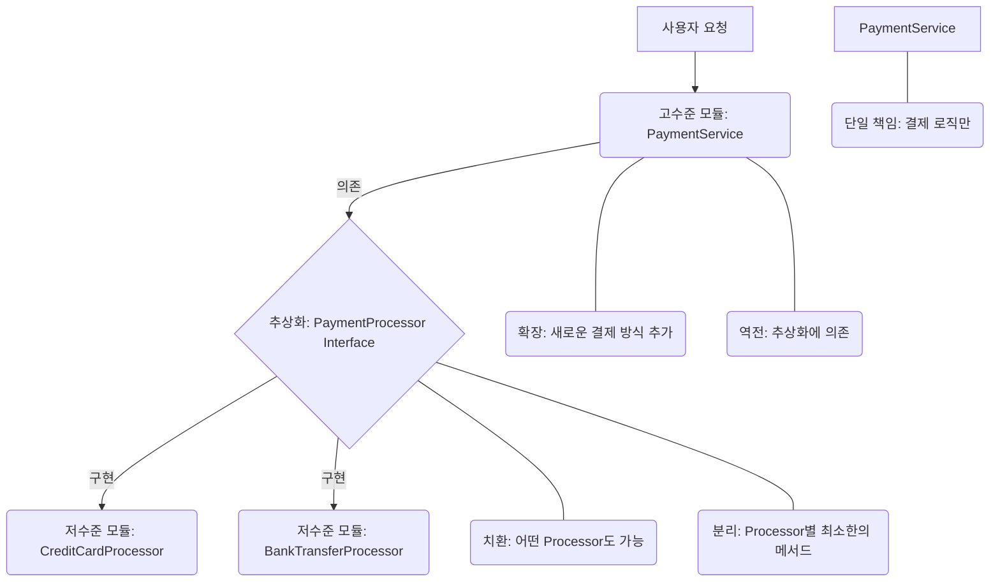

> 소프트웨어 설계의 5가지 핵심 원칙, SOLID를 통해 유연하고 확장 가능한 아키텍처를 구축합니다.

## 핵심 요약 (TL;DR)

SOLID 원칙은 로버트 C. 마틴(Uncle Bob)이 제안한 객체 지향 설계의 5가지 핵심 원칙으로, SRP(단일 책임 원칙), OCP(개방-폐쇄 원칙), LSP(리스코프 치환 원칙), ISP(인터페이스 분리 원칙), DIP(의존성 역전 원칙)를 의미합니다. 이 원칙들은 유지보수성을 높이고, 확장성을 확보하며, 유연한 시스템을 만드는 데 필수적인 가이드라인을 제공합니다. 이 포스트에서는 각 원칙의 개념을 구체적인 예제 코드와 함께 설명하고, 실제 프로젝트에서 SOLID 원칙을 어떻게 적용하여 더 나은 설계를 만들 수 있는지 심도 있게 다룹니다.

## 왜 알아야 하는가?

소프트웨어는 끊임없이 변화합니다. 새로운 기능이 추가되고, 요구사항이 변경되며, 버그가 수정됩니다. 이러한 변화 속에서 코드가 쉽게 엉키고 복잡해지는 것을 '스파게티 코드'라고 부르며, 이는 개발 비용 증가, 버그 발생률 상승, 생산성 저하로 이어집니다. SOLID 원칙은 이러한 문제들을 해결하고, 변화에 강하고 재사용 가능한 코드를 작성하기 위한 강력한 지침을 제공합니다. 이 원칙들을 이해하고 적용하는 것은 개발자가 더 나은 소프트웨어 아키텍처를 설계하고, 협업 효율성을 높이며, 장기적으로 프로젝트의 성공을 이끄는 데 필수적인 역량입니다.

## 개념 이해

SOLID는 객체 지향 설계의 핵심 개념들을 집대성한 것으로, 각 원칙이 상호 보완적으로 작용하여 견고한 시스템을 만듭니다.

### 1. SRP (Single Responsibility Principle) - 단일 책임 원칙
"클래스는 단 하나의 책임만 가져야 하며, 단 하나의 변경 이유만 가져야 한다."
이는 특정 클래스나 모듈이 여러 책임을 가지게 되면, 그 책임 중 하나라도 변경될 때마다 해당 클래스가 영향을 받게 되어 유지보수가 어려워지는 문제를 방지합니다.

### 2. OCP (Open/Closed Principle) - 개방-폐쇄 원칙
"확장에는 열려있고, 변경에는 닫혀있어야 한다."
기존 코드를 수정하지 않고도 새로운 기능을 추가할 수 있도록 설계해야 한다는 원칙입니다. 이는 유연한 확장을 위해 추상화(인터페이스, 추상 클래스)를 적극적으로 활용함을 의미합니다.

### 3. LSP (Liskov Substitution Principle) - 리스코프 치환 원칙
"자식 클래스는 언제나 자신의 부모 클래스를 대체할 수 있어야 한다."
자식 클래스의 객체는 부모 클래스의 객체가 사용되는 어떤 곳에서도 문제없이 동작해야 합니다. 이는 상속 관계에서 다형성을 올바르게 활용하고, 예상치 못한 동작을 방지하는 데 중요합니다.

### 4. ISP (Interface Segregation Principle) - 인터페이스 분리 원칙
"클라이언트는 자신이 사용하지 않는 인터페이스에 의존해서는 안 된다."
큰 덩어리의 인터페이스보다는, 클라이언트의 용도에 맞는 작고 구체적인 여러 인터페이스로 분리해야 한다는 원칙입니다. 이는 불필요한 메서드 구현을 강제하지 않고, 클래스 간의 결합도를 낮춥니다.

### 5. DIP (Dependency Inversion Principle) - 의존성 역전 원칙
"고수준 모듈은 저수준 모듈에 의존해서는 안 된다. 이 둘은 추상화에 의존해야 한다. 추상화는 세부 사항에 의존해서는 안 된다. 세부 사항은 추상화에 의존해야 한다."
구체적인 구현이 아닌 추상화(인터페이스, 추상 클래스)에 의존하도록 하여, 시스템의 유연성과 테스트 용이성을 높이는 원칙입니다. 대표적으로 의존성 주입(Dependency Injection) 메커니즘을 통해 구현됩니다.



## 환경 설정

SOLID 원칙은 특정 언어나 프레임워크에 국한되지 않는 일반적인 설계 원칙입니다. 여기서는 Python을 사용하여 원칙들을 설명하므로, Python이 설치되어 있어야 합니다.

```bash
# Python 설치 확인
python3 --version

# (필요시) 가상 환경 설정
python3 -m venv venv
source venv/bin/activate
```

## 구현

### Step 1: SRP (단일 책임 원칙) - 사용자 관리 예제

사용자 정보 관리와 알림 발송이라는 두 가지 책임을 한 클래스에 두지 않고 분리합니다.

```python
# SRP 위반 (Bad Practice)
class UserHandler:
    def __init__(self, name, email):
        self.name = name
        self.email = email

    def save_user_to_db(self):
        print(f"Saving user {self.name} to database.")
        # DB 저장 로직

    def send_welcome_email(self):
        print(f"Sending welcome email to {self.email}.")
        # 이메일 발송 로직

# SRP 준수 (Good Practice)
class UserRepository: # 사용자 데이터 관리 책임
    def save(self, user):
        print(f"Saving user {user.name} to database.")
        # DB 저장 로직 구현

class EmailService: # 이메일 발송 책임
    def send_welcome(self, user):
        print(f"Sending welcome email to {user.email}.")
        # 이메일 발송 로직 구현

class User: # 단순 데이터 객체
    def __init__(self, name, email):
        self.name = name
        self.email = email

# 사용 예시
user = User("Alice", "alice@example.com")
user_repo = UserRepository()
email_service = EmailService()

user_repo.save(user)
email_service.send_welcome(user)
```
`UserHandler`는 DB 저장과 이메일 발송이라는 두 가지 변경 이유를 가질 수 있습니다. 이를 `UserRepository`와 `EmailService`로 분리하여 각 클래스가 단일 책임을 갖도록 합니다.

### Step 2: OCP (개방-폐쇄 원칙) - 도형 면적 계산 예제

새로운 도형이 추가되어도 기존 면적 계산 로직을 수정하지 않도록 인터페이스와 다형성을 활용합니다.

```python
from abc import ABC, abstractmethod

# OCP 준수 (Good Practice)
class Shape(ABC): # 추상화: 모든 도형의 공통 인터페이스
    @abstractmethod
    def area(self):
        pass

class Rectangle(Shape):
    def __init__(self, width, height):
        self.width = width
        self.height = height
    def area(self):
        return self.width * self.height

class Circle(Shape):
    def __init__(self, radius):
        self.radius = radius
    def area(self):
        import math
        return math.pi * self.radius ** 2

class AreaCalculator: # 면적 계산기 (확장에는 열려있고, 변경에는 닫혀있음)
    def calculate_total_area(self, shapes):
        total_area = 0
        for shape in shapes:
            total_area += shape.area() # 다형성 활용
        return total_area

# 사용 예시
calculator = AreaCalculator()
shapes = [Rectangle(10, 5), Circle(7)]
print(f"Total area: {calculator.calculate_total_area(shapes)}")

# 새로운 도형이 추가되어도 AreaCalculator는 수정할 필요 없음
class Triangle(Shape):
    def __init__(self, base, height):
        self.base = base
        self.height = height
    def area(self):
        return 0.5 * self.base * self.height

shapes.append(Triangle(10, 4))
print(f"Total area with triangle: {calculator.calculate_total_area(shapes)}")
```
`AreaCalculator`는 `Shape` 인터페이스에 의존하므로, 새로운 `Shape` 구현체가 추가되어도 `calculate_total_area` 메서드를 수정할 필요가 없습니다.

### Step 3: LSP (리스코프 치환 원칙) - 새와 오리 예제

자식 클래스가 부모 클래스의 계약을 위반하지 않도록 설계합니다. 날 수 없는 펭귄이 날 수 있는 새를 상속받으면 문제가 발생합니다.

```python
# LSP 위반 (Bad Practice)
class Bird:
    def fly(self):
        return "I can fly!"

class Penguin(Bird):
    def fly(self):
        raise NotImplementedError("Penguins cannot fly!") # 부모의 계약 위반

def make_bird_fly(bird: Bird):
    try:
        print(f"The bird says: {bird.fly()}")
    except NotImplementedError as e:
        print(f"Error: {e}")

# make_bird_fly(Bird())    # OK
# make_bird_fly(Penguin()) # 런타임 에러 발생 (계약 위반)

# LSP 준수 (Good Practice)
class Animal: # 최상위 개념
    pass

class FlyingAnimal(Animal):
    def fly(self):
        return "I can fly!"

class SwimmingAnimal(Animal):
    def swim(self):
        return "I can swim!"

class Duck(FlyingAnimal, SwimmingAnimal):
    def fly(self):
        return "Duck is flying!"
    def swim(self):
        return "Duck is swimming!"

class Eagle(FlyingAnimal):
    def fly(self):
        return "Eagle is soaring!"

class Penguin(SwimmingAnimal): # FlyingAnimal을 상속받지 않음
    def swim(self):
        return "Penguin is swimming!"

# 사용 예시
def stimulate_flying(animal: FlyingAnimal):
    print(animal.fly())

def stimulate_swimming(animal: SwimmingAnimal):
    print(animal.swim())

stimulate_flying(Duck())
stimulate_flying(Eagle())
# stimulate_flying(Penguin()) # 타입 에러 발생, 애초에 불가능하도록 설계
stimulate_swimming(Duck())
stimulate_swimming(Penguin())
```
`Bird`와 `Penguin` 예제에서는 `Penguin`이 `fly` 메서드를 오버라이드하여 `NotImplementedError`를 발생시킴으로써 `Bird`의 계약을 위반했습니다. LSP를 준수하기 위해서는 행동에 따라 더 세분화된 인터페이스나 추상 클래스를 사용하여 불필요한 기능을 강제하지 않아야 합니다.

### Step 4: ISP (인터페이스 분리 원칙) - 복잡한 작업자 인터페이스 예제

하나의 거대한 `Worker` 인터페이스 대신, 역할에 맞는 작은 인터페이스로 분리합니다.

```python
from abc import ABC, abstractmethod

# ISP 위반 (Bad Practice)
class BadWorker(ABC):
    @abstractmethod
    def work_on_tasks(self):
        pass
    @abstractmethod
    def manage_subordinates(self):
        pass
    @abstractmethod
    def attend_meetings(self):
        pass

class Developer(BadWorker): # 개발자는 부하직원 관리 책임이 없음에도 구현해야 함
    def work_on_tasks(self):
        return "Developing features..."
    def manage_subordinates(self):
        raise NotImplementedError # 불필요한 구현
    def attend_meetings(self):
        return "Attending daily standup."

# ISP 준수 (Good Practice)
class TaskPerformer(ABC): # 작업 수행 책임
    @abstractmethod
    def work_on_tasks(self):
        pass

class Manager(ABC): # 관리 책임
    @abstractmethod
    def manage_subordinates(self):
        pass

class MeetingParticipant(ABC): # 회의 참여 책임
    @abstractmethod
    def attend_meetings(self):
        pass

class GoodDeveloper(TaskPerformer, MeetingParticipant): # 필요한 인터페이스만 구현
    def work_on_tasks(self):
        return "Developing features efficiently."
    def attend_meetings(self):
        return "Attending daily standup to discuss progress."

class TeamLead(TaskPerformer, Manager, MeetingParticipant): # 모든 책임 구현
    def work_on_tasks(self):
        return "Helping team members with complex features."
    def manage_subordinates(self):
        return "Reviewing team performance."
    def attend_meetings(self):
        return "Leading weekly sprint planning."

# 사용 예시
dev = GoodDeveloper()
lead = TeamLead()

print(dev.work_on_tasks())
print(lead.manage_subordinates())
```
`BadWorker`는 `Developer`에게 `manage_subordinates`와 같이 불필요한 기능을 구현하도록 강제합니다. 이를 `TaskPerformer`, `Manager`, `MeetingParticipant`와 같이 역할 기반의 작은 인터페이스로 분리하여 필요한 기능만 구현하도록 합니다.

### Step 5: DIP (의존성 역전 원칙) - 로깅 모듈 예제

구체적인 로거 구현체 대신 추상화된 로깅 인터페이스에 의존합니다.

```python
from abc import ABC, abstractmethod

# DIP 위반 (Bad Practice)
class BadLogger:
    def log_message(self, message):
        print(f"[ConsoleLogger] {message}") # 구체적인 구현에 직접 의존

class Application:
    def __init__(self):
        self.logger = BadLogger() # 구체적인 BadLogger에 의존
    def do_something(self):
        self.logger.log_message("Doing something important.")

# DIP 준수 (Good Practice)
class Logger(ABC): # 추상화: 로거 인터페이스
    @abstractmethod
    def log(self, message):
        pass

class ConsoleLogger(Logger): # 저수준 모듈: 콘솔 로거 구현
    def log(self, message):
        print(f"[ConsoleLogger] {message}")

class FileLogger(Logger): # 저수준 모듈: 파일 로거 구현
    def log(self, message):
        with open("app.log", "a") as f:
            f.write(f"[FileLogger] {message}\n")

class GoodApplication: # 고수준 모듈: 추상화된 Logger에 의존
    def __init__(self, logger: Logger): # 의존성 주입
        self.logger = logger
    def do_something(self):
        self.logger.log("Doing something important in GoodApplication.")

# 사용 예시
console_logger = ConsoleLogger()
file_logger = FileLogger()

app_with_console = GoodApplication(console_logger)
app_with_console.do_something()

app_with_file = GoodApplication(file_logger)
app_with_file.do_something()
```
`Application` 클래스는 `BadLogger`라는 구체적인 구현체에 직접 의존하여, 로거 변경 시 `Application` 코드를 수정해야 합니다. `GoodApplication`은 `Logger` 인터페이스에 의존하고, 생성자를 통해 구체적인 `Logger` 구현체를 주입받으므로, `Application` 코드를 변경하지 않고도 다른 로거를 사용할 수 있습니다.

## 실행 및 테스트

SOLID 원칙은 코드의 실행 결과보다는 내부 구조와 유지보수성에 중점을 둡니다. 따라서 각 원칙이 잘 적용되었는지 확인하려면 코드 리뷰와 단위 테스트를 통해 검증해야 합니다.

*   **단위 테스트**: DIP, OCP, ISP를 통해 모듈 간의 결합도가 낮아지면 각 모듈을 독립적으로 테스트하기 쉬워집니다. Mocking/Stubbing을 활용하여 의존성을 분리하고 테스트 코드의 작성 비용을 줄일 수 있습니다.
*   **코드 리뷰**: 팀원들과 함께 코드의 책임 분리(SRP), 확장성(OCP), 상속 관계(LSP), 인터페이스의 적절성(ISP), 의존성 방향(DIP) 등을 논의하며 원칙 준수 여부를 검토합니다.

## 설계 포인트

SOLID 원칙을 실제 프로젝트에 적용할 때는 다음과 같은 설계 포인트를 고려해야 합니다.

| 접근법 | 장점 | 단점 | 적합한 상황 |
|--------|------|------|------------|
| **SRP 적용** | 코드 가독성 증대, 변경 영향 최소화 | 클래스/파일 수 증가, 초기 설계 복잡성 | 모든 클래스 설계 시 필수적으로 고려 |
| **OCP 적용** | 높은 확장성, 기존 코드 변경 방지 | 과도한 추상화로 인한 복잡성 증가 가능 | 변화가 예상되는 모듈, 플러그인 아키텍처 |
| **LSP 준수** | 다형성 활용 극대화, 안정적인 상속 관계 | 부모-자식 관계 설계 시 주의, 철저한 계약 명시 | 모든 상속/구현 관계에서 기본 원칙 |
| **ISP 적용** | 클라이언트별 맞춤 인터페이스, 결합도 감소 | 인터페이스 수 증가, 관리 복잡성 증가 | 거대한 인터페이스를 가진 모듈, 다양한 클라이언트 |
| **DIP 적용** | 유연한 의존성 관리, 테스트 용이성 | 초기 학습 곡선, 의존성 주입 컨테이너 도입 | 모든 계층 간 의존성, 프레임워크 설계 |

## 주의사항 & 흔한 실수

*   **과도한 추상화**: OCP나 DIP를 적용하기 위해 불필요하게 많은 인터페이스나 추상 클래스를 만들면 오히려 코드의 복잡성이 증가하고 이해하기 어려워질 수 있습니다. "나중에 필요할 것 같아서"라는 이유로 미리 추상화하지 마세요.
*   **SRP 오해**: "클래스는 100줄을 넘으면 안 된다"와 같은 오해를 하여 무조건적으로 클래스를 잘게 쪼개는 경우가 있습니다. SRP는 코드의 길이가 아닌, **책임의 수**에 관한 것입니다.
*   **LSP 위반**: 부모 클래스의 기능을 자식 클래스에서 `NotImplementedError`를 발생시키거나, 원래 의도와 다르게 동작하도록 오버라이드하는 것은 LSP를 위반하는 대표적인 실수입니다. 상속 관계에서는 항상 계약을 존중해야 합니다.
*   **SOLID 만능주의**: SOLID 원칙은 좋은 설계의 가이드라인이지, 모든 상황에 대한 은총알은 아닙니다. 때로는 실용성과 개발 속도를 위해 일부 원칙을 유연하게 적용할 필요도 있습니다.

## 관련 포스트

- [객체 지향 프로그래밍의 핵심: 추상화, 캡슐화, 상속, 다형성](/2025/11/20/oop-pillars/) — SOLID 원칙의 기반이 되는 OOP 개념 설명

## 레퍼런스

### 영상
- [The SOLID Principles of Object-Oriented Design](https://www.youtube.com/watch?v=rtmEz-J-F-U) — Uncle Bob (Robert C. Martin)이 직접 설명하는 SOLID 원칙.
- [Design Patterns in Python](https://www.youtube.com/watch?v=FqBvB6Xb2A0) — Python으로 SOLID 원칙 및 디자인 패턴을 설명하는 튜토리얼.

### 문서 & 기사
- [SOLID (object-oriented design)](https://en.wikipedia.org/wiki/SOLID_(object-oriented_design)) — 위키피디아의 SOLID 원칙 설명.
- [클린 코드: 애자일 소프트웨어 장인 정신](https://book.naver.com/bookdb/book_detail.naver?bid=6045330) — 로버트 C. 마틴 저, SOLID 원칙을 포함한 좋은 코드 작성법.

---

*이 포스트는 [HoneyByte](https://blog.honeybarrel.co.kr) 시리즈의 일부입니다.*
