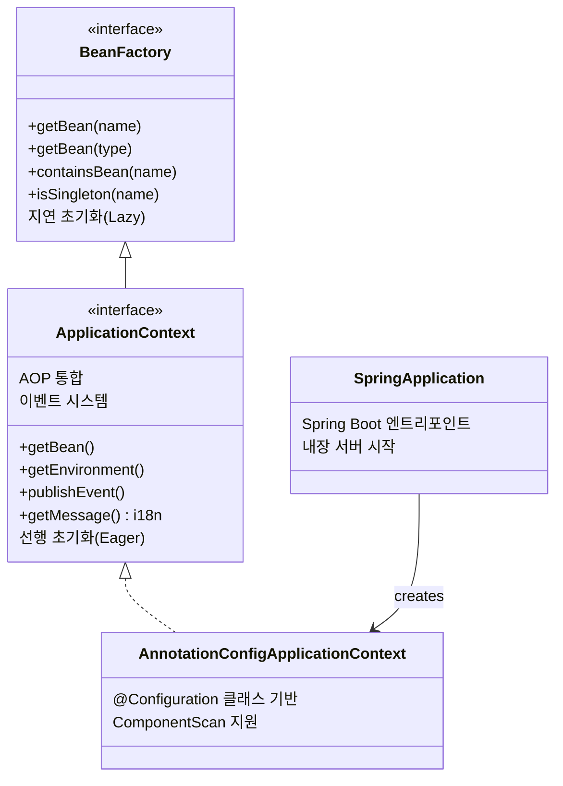
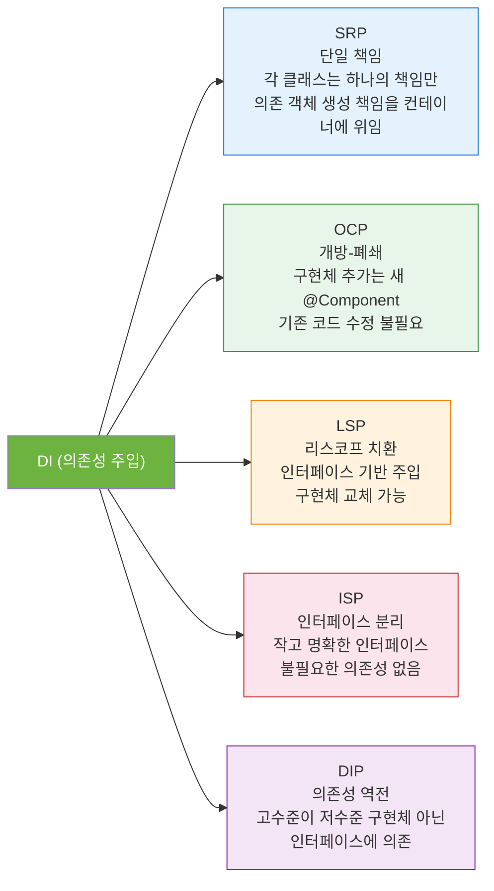

> Spring을 "그냥 쓰는" 것과 "이해하고 쓰는" 것의 차이는 IoC와 DI에서 갈린다. 제어의 역전이 왜 필요한지, 컨테이너가 빈을 어떻게 관리하는지, 주입 방식별 트레이드오프는 무엇인지 — 코드와 함께 완전히 파헤친다.

## 핵심 요약 (TL;DR)

**IoC(Inversion of Control)** 는 객체의 생성과 의존성 연결을 개발자가 아닌 프레임워크(컨테이너)가 담당하는 설계 원칙이다. **DI(Dependency Injection)** 는 IoC를 구현하는 구체적인 패턴으로, 객체가 직접 의존 객체를 `new`로 생성하지 않고 외부에서 주입받는다. Spring Boot에서 DI는 **생성자 주입을 기본으로** 사용하고 (`@RequiredArgsConstructor` + `final`), `@Component` / `@Service` / `@Repository` / `@Controller` 로 Bean을 등록한다. 실무에서 `BeanFactory`를 직접 쓸 일은 없고, `ApplicationContext`가 사실상 Spring 컨테이너다.

---

## IoC가 왜 필요한가 — 문제에서 출발

### DI 없는 코드의 문제

```java
// ❌ Bad: 강한 결합 — 직접 생성
public class OrderService {
    // OrderService가 EmailNotifier의 구체 클래스를 직접 생성
    // → 테스트 시 실제 이메일 발송됨
    // → EmailNotifier를 SlackNotifier로 바꾸려면 OrderService 코드 수정
    // → SRP, OCP, DIP 모두 위반
    private final EmailNotifier notifier = new EmailNotifier();

    public void placeOrder(Order order) {
        // ... 주문 처리 ...
        notifier.send("주문 완료: " + order.getId()); // 구체 구현에 직접 의존
    }
}
```

문제점:
1. **테스트 어려움** — `new EmailNotifier()`는 Mock으로 교체 불가
2. **변경에 취약** — `SlackNotifier`로 바꾸려면 `OrderService` 수정 필요
3. **SRP 위반** — `OrderService`가 `EmailNotifier` 생성 책임까지 가짐
4. **DIP 위반** — 고수준 모듈이 저수준 모듈 구체 클래스에 직접 의존

### DI를 적용한 코드

```java
// ✅ Good: 인터페이스 + 생성자 주입
public class OrderService {
    private final Notifier notifier; // 인터페이스에 의존 (DIP)

    // 의존성을 외부에서 주입받음 — 누가 주입할지는 컨테이너가 결정 (IoC)
    public OrderService(Notifier notifier) {
        this.notifier = notifier;
    }
}

// 구현체 A
@Component
public class EmailNotifier implements Notifier { ... }

// 구현체 B (나중에 추가해도 OrderService 수정 불필요 — OCP)
@Component
public class SlackNotifier implements Notifier { ... }
```

**IoC가 하는 일:** `OrderService`를 생성할 때, 컨테이너가 `Notifier` 구현체를 찾아 생성자에 넣어준다.

---

## Spring IoC 컨테이너 구조



### BeanFactory vs ApplicationContext

| 기능 | BeanFactory | ApplicationContext |
|------|------------|-------------------|
| **기본 DI** | ✅ | ✅ |
| **초기화 시점** | Lazy (최초 요청 시) | Eager (컨텍스트 시작 시) |
| **국제화(i18n)** | ❌ | ✅ `MessageSource` |
| **이벤트 발행** | ❌ | ✅ `ApplicationEventPublisher` |
| **AOP** | 제한적 | ✅ 완전 통합 |
| **`@PostConstruct` 등 생명주기** | 제한적 | ✅ |
| **Spring Boot에서 사용 여부** | 직접 거의 안 씀 | 사실상 표준 |

> **결론:** Spring Boot 개발에서 `BeanFactory`를 직접 사용하는 경우는 거의 없다. `ApplicationContext`가 `BeanFactory`를 확장한 완전한 컨테이너다.

---

## Bean 등록 방법

### 1. 컴포넌트 스캔 — `@Component` 계열

`@SpringBootApplication` 안에 포함된 `@ComponentScan`이 시작 패키지부터 하위를 모두 스캔한다.

```java
// 네 어노테이션은 모두 @Component의 특수화 버전
// 기능 차이는 거의 없고, 의미(계층 표시)와 부가 기능이 다름

@Component   // 범용 Bean 등록 — 어느 계층인지 명확하지 않을 때
@Service     // 비즈니스 로직 계층 — 트랜잭션 등 AOP 적용 대상
@Repository  // 데이터 접근 계층 — DataAccessException 변환 기능 추가
@Controller  // MVC 웹 계층 — DispatcherServlet이 처리
@RestController // @Controller + @ResponseBody
```

```java
// src/main/java/com/honeybarrel/honeyapi/notification/Notifier.java
package com.honeybarrel.honeyapi.notification;

/**
 * 알림 발송 인터페이스.
 * ISP(인터페이스 분리): 발송 책임만 정의.
 */
public interface Notifier {
    void send(String recipient, String message);
    String getType();
}
```

```java
// src/main/java/com/honeybarrel/honeyapi/notification/EmailNotifier.java
package com.honeybarrel.honeyapi.notification;

import lombok.extern.slf4j.Slf4j;
import org.springframework.stereotype.Component;

@Slf4j
@Component("emailNotifier")  // Bean 이름 명시 (기본: 클래스명 camelCase)
public class EmailNotifier implements Notifier {

    @Override
    public void send(String recipient, String message) {
        // 실제 구현에서는 JavaMailSender 등 사용
        log.info("[EMAIL] to={}, msg={}", recipient, message);
    }

    @Override
    public String getType() { return "EMAIL"; }
}
```

```java
// src/main/java/com/honeybarrel/honeyapi/notification/SlackNotifier.java
package com.honeybarrel.honeyapi.notification;

import lombok.extern.slf4j.Slf4j;
import org.springframework.context.annotation.Primary;
import org.springframework.stereotype.Component;

@Slf4j
@Component("slackNotifier")
@Primary  // 같은 타입의 Bean이 여러 개일 때 기본 선택
public class SlackNotifier implements Notifier {

    @Override
    public void send(String recipient, String message) {
        log.info("[SLACK] channel={}, msg={}", recipient, message);
    }

    @Override
    public String getType() { return "SLACK"; }
}
```

### 2. `@Configuration` + `@Bean` — 수동 등록

외부 라이브러리나 조건부 Bean 등록에 사용한다.

```java
// src/main/java/com/honeybarrel/honeyapi/config/AppConfig.java
package com.honeybarrel.honeyapi.config;

import com.honeybarrel.honeyapi.notification.EmailNotifier;
import com.honeybarrel.honeyapi.notification.Notifier;
import org.springframework.context.annotation.Bean;
import org.springframework.context.annotation.Configuration;
import org.springframework.context.annotation.Profile;

@Configuration  // @Component 포함 — 이 클래스 자체도 Bean
public class AppConfig {

    /**
     * prod 프로파일에서는 SlackNotifier 대신 PagerDutyNotifier 등록 예시.
     * OCP: 코드 수정 없이 프로파일만 바꾸면 구현체가 교체됨.
     */
    @Bean
    @Profile("prod")
    public Notifier prodNotifier() {
        // 운영환경에서는 다른 구현체
        return new EmailNotifier();
    }
}
```

---

## 세 가지 주입 방식 — 완전 비교

```java
// src/main/java/com/honeybarrel/honeyapi/order/OrderService.java
package com.honeybarrel.honeyapi.order;

import com.honeybarrel.honeyapi.notification.Notifier;
import lombok.RequiredArgsConstructor;
import org.springframework.beans.factory.annotation.Autowired;
import org.springframework.beans.factory.annotation.Qualifier;
import org.springframework.stereotype.Service;

@Service
public class OrderService {

    // ════════════════════════════════════════════════
    // 방식 1: 필드 주입 — 사용 지양
    // ════════════════════════════════════════════════
    // @Autowired
    // private Notifier notifier;
    //
    // 문제점:
    // ① 불변성 없음 — 런타임에 교체 가능 (의도치 않은 변경 위험)
    // ② 테스트 시 Reflection 필요 (ReflectionTestUtils.setField)
    // ③ 순환 의존성이 빌드 시점이 아닌 런타임에 발견됨
    // ④ final 선언 불가 → NullPointerException 위험

    // ════════════════════════════════════════════════
    // 방식 2: 세터 주입 — 선택적 의존성에만 사용
    // ════════════════════════════════════════════════
    // private Notifier optionalAuditLogger;
    //
    // @Autowired(required = false)  // 없어도 애플리케이션 기동 가능
    // public void setAuditLogger(Notifier auditLogger) {
    //     this.optionalAuditLogger = auditLogger;
    // }

    // ════════════════════════════════════════════════
    // 방식 3: 생성자 주입 — Spring 공식 권장 ✅
    // ════════════════════════════════════════════════
    private final Notifier notifier;         // final → 불변성 보장
    private final OrderRepository repository;

    // @Autowired 생략 가능 (단일 생성자이면 Spring이 자동 인식)
    // @Qualifier로 특정 Bean 지정 (@Primary보다 명시적)
    public OrderService(
            @Qualifier("slackNotifier") Notifier notifier,
            OrderRepository repository) {
        this.notifier = notifier;
        this.repository = repository;
    }

    public Order placeOrder(String productId, int quantity) {
        Order order = repository.save(new Order(productId, quantity));
        notifier.send("ops-channel", "주문 생성: " + order.getId());
        return order;
    }
}
```

### Lombok으로 생성자 주입 간소화

```java
// 실무에서 가장 많이 쓰는 패턴
@Service
@RequiredArgsConstructor  // final 필드의 생성자를 자동 생성
public class OrderService {

    private final Notifier notifier;       // @Qualifier 사용 불가 → @Primary 필요
    private final OrderRepository repository;

    // Lombok이 아래 생성자를 자동 생성:
    // public OrderService(Notifier notifier, OrderRepository repository) {
    //     this.notifier = notifier;
    //     this.repository = repository;
    // }
}
```

### 주입 방식 최종 비교표

| | 필드 주입 | 세터 주입 | 생성자 주입 |
|---|---|---|---|
| **불변성** | ❌ | ❌ | ✅ (`final`) |
| **테스트 용이성** | ❌ (Reflection 필요) | △ | ✅ (new로 직접 주입) |
| **순환 의존성 감지** | 런타임 | 런타임 | **컴파일 타임** |
| **필수 의존성 강제** | △ | ❌ | ✅ |
| **Spring 권장** | ❌ | △ (선택적) | ✅ |
| **코드 간결성** | 가장 짧음 | 보통 | Lombok으로 해결 |

---

## Bean 스코프 — 얼마나 살아있는가

```mermaid
graph TD
    subgraph "애플리케이션 생명주기"
        S[Singleton Bean\n컨테이너당 1개 인스턴스\n기본값, 상태 없는 서비스에 적합]
    end

    subgraph "HTTP 요청 생명주기"
        R[Request Bean\n@Scope 'request'\nHTTP 요청마다 새 인스턴스]
        Sess[Session Bean\n@Scope 'session'\nHTTP 세션마다 새 인스턴스]
    end

    subgraph "메서드 호출마다"
        P[Prototype Bean\n@Scope 'prototype'\ngetBean() 호출마다 새 인스턴스\n소멸은 개발자 책임]
    end

    style S fill:#c8e6c9,stroke:#2e7d32
    style R fill:#bbdefb,stroke:#1565c0
    style Sess fill:#e1bee7,stroke:#6a1b9a
    style P fill:#fff9c4,stroke:#f9a825
```

```java
// Prototype 스코프 예시
@Component
@Scope("prototype")
public class ReportGenerator {
    // 요청마다 새 인스턴스 — 상태를 가져도 안전
    private final List<String> lines = new ArrayList<>();

    public void addLine(String line) { lines.add(line); }
    public String generate() { return String.join("\n", lines); }
}

// Singleton에서 Prototype을 사용하는 올바른 방법
@Service
public class ReportService implements ApplicationContextAware {

    private ApplicationContext context;

    @Override
    public void setApplicationContext(ApplicationContext ctx) {
        this.context = ctx;
    }

    public String createReport(List<String> data) {
        // 매번 새 인스턴스를 명시적으로 요청
        ReportGenerator generator = context.getBean(ReportGenerator.class);
        data.forEach(generator::addLine);
        return generator.generate();
    }
}
```

---

## Bean 생명주기 — 생성부터 소멸까지

```java
// src/main/java/com/honeybarrel/honeyapi/infra/ConnectionPool.java
package com.honeybarrel.honeyapi.infra;

import jakarta.annotation.PostConstruct;
import jakarta.annotation.PreDestroy;
import lombok.extern.slf4j.Slf4j;
import org.springframework.beans.factory.InitializingBean;
import org.springframework.stereotype.Component;

/**
 * Bean 생명주기 훅 예시.
 * 실무 사용 예: DB 커넥션 풀 초기화, 캐시 프리워밍, 외부 서비스 연결.
 */
@Slf4j
@Component
public class ConnectionPool {

    private boolean initialized = false;

    /**
     * 생명주기 순서:
     * 1. 생성자 호출 (의존성 주입 전)
     * 2. 의존성 주입 완료
     * 3. @PostConstruct 호출 ← 여기서 초기화 로직
     * 4. Bean 사용
     * 5. @PreDestroy 호출 ← 여기서 정리 로직
     * 6. GC
     */
    public ConnectionPool() {
        log.info("[ConnectionPool] 1. 생성자 호출");
    }

    @PostConstruct
    public void init() {
        log.info("[ConnectionPool] 3. @PostConstruct — 커넥션 풀 초기화");
        this.initialized = true;
        // 실제 구현: HikariCP 설정, 외부 서비스 연결 확인 등
    }

    @PreDestroy
    public void destroy() {
        log.info("[ConnectionPool] 5. @PreDestroy — 커넥션 풀 종료");
        this.initialized = false;
        // 실제 구현: 열린 커넥션 정리, 파일 닫기 등
    }

    public boolean isAvailable() { return initialized; }
}
```

---

## 순환 의존성 — 탐지와 해결

생성자 주입의 가장 강력한 장점 중 하나는 순환 의존성을 **애플리케이션 시작 시점**에 탐지한다는 것이다.

```java
// ❌ 순환 의존성 — 생성자 주입이면 시작 시점에 에러 발생
@Service
public class ServiceA {
    private final ServiceB serviceB;
    public ServiceA(ServiceB serviceB) { this.serviceB = serviceB; }
}

@Service
public class ServiceB {
    private final ServiceA serviceA;  // A → B → A 순환!
    public ServiceB(ServiceA serviceA) { this.serviceA = serviceA; }
}
// → BeanCurrentlyInCreationException: Requested bean is currently in creation
```

**해결 전략 (우선순위 순):**

```java
// 전략 1 (권장): 공통 의존성을 별도 Service로 추출
// ServiceA와 ServiceB가 공통으로 필요한 로직 → ServiceC로 분리
@Service
public class ServiceC { /* 공통 로직 */ }

@Service
public class ServiceA {
    private final ServiceC serviceC;
    public ServiceA(ServiceC serviceC) { this.serviceC = serviceC; }
}

@Service
public class ServiceB {
    private final ServiceC serviceC;
    public ServiceB(ServiceC serviceC) { this.serviceC = serviceC; }
}
```

```java
// 전략 2: ApplicationContext를 통한 지연 조회 (Lazy DI)
@Service
public class ServiceA {
    private final ApplicationContext ctx;
    public ServiceA(ApplicationContext ctx) { this.ctx = ctx; }

    public void doSomething() {
        // 필요한 시점에 조회 — 순환 의존성 발생하지 않음
        ServiceB serviceB = ctx.getBean(ServiceB.class);
        serviceB.process();
    }
}
```

```java
// 전략 3: @Lazy — 최후 수단 (설계 문제를 숨기는 임시방편이므로 지양)
@Service
public class ServiceA {
    private final ServiceB serviceB;
    public ServiceA(@Lazy ServiceB serviceB) { this.serviceB = serviceB; }
}
```

---

## 실전 패턴 — 전략 패턴 + DI

DI의 진정한 힘은 **전략 패턴(Strategy Pattern)** 과 결합할 때 드러난다.

```java
// src/main/java/com/honeybarrel/honeyapi/notification/NotificationService.java
package com.honeybarrel.honeyapi.notification;

import lombok.extern.slf4j.Slf4j;
import org.springframework.stereotype.Service;

import java.util.List;
import java.util.Map;
import java.util.function.Function;
import java.util.stream.Collectors;

/**
 * 전략 패턴 + DI: Notifier 구현체 목록을 모두 주입받아 타입으로 선택.
 *
 * OCP: 새 Notifier 추가 = @Component 클래스 하나만 추가.
 *      NotificationService, 클라이언트 코드 모두 수정 불필요.
 */
@Slf4j
@Service
public class NotificationService {

    // Spring이 Notifier 인터페이스의 모든 구현체를 List로 주입
    private final Map<String, Notifier> notifierMap;

    public NotificationService(List<Notifier> notifiers) {
        // "EMAIL" → EmailNotifier, "SLACK" → SlackNotifier 형태로 변환
        this.notifierMap = notifiers.stream()
                .collect(Collectors.toMap(
                        n -> n.getType().toUpperCase(),
                        Function.identity()
                ));
        log.info("등록된 Notifier: {}", notifierMap.keySet());
    }

    /**
     * 채널 타입에 따라 동적으로 발송.
     * 새 채널 추가 = @Component 클래스 추가만으로 완료 (OCP).
     */
    public void send(String channelType, String recipient, String message) {
        Notifier notifier = notifierMap.get(channelType.toUpperCase());
        if (notifier == null) {
            throw new IllegalArgumentException(
                    "지원하지 않는 채널: " + channelType +
                    " (지원 채널: " + notifierMap.keySet() + ")"
            );
        }
        notifier.send(recipient, message);
    }

    public java.util.Set<String> getAvailableChannels() {
        return notifierMap.keySet();
    }
}
```

```java
// Controller에서 사용 예시
@RestController
@RequestMapping("/api/v1/notifications")
@RequiredArgsConstructor
public class NotificationController {

    private final NotificationService notificationService;

    @PostMapping
    public ResponseEntity<ApiResponse<Void>> send(
            @RequestParam String channel,
            @RequestParam String recipient,
            @RequestBody String message) {

        notificationService.send(channel, recipient, message);
        return ResponseEntity.ok(ApiResponse.ok(null));
    }

    @GetMapping("/channels")
    public ResponseEntity<ApiResponse<Set<String>>> getChannels() {
        return ResponseEntity.ok(
                ApiResponse.ok(notificationService.getAvailableChannels())
        );
    }
}
```

**결과:**
```bash
# 사용 가능한 채널 조회
curl http://localhost:8081/api/v1/notifications/channels
# { "data": ["EMAIL", "SLACK"] }

# Slack으로 발송
curl -X POST "http://localhost:8081/api/v1/notifications?channel=SLACK&recipient=ops-channel" \
     -H "Content-Type: text/plain" -d "서버 알림"
# 로그: [SLACK] channel=ops-channel, msg=서버 알림

# 미지원 채널
curl -X POST "http://localhost:8081/api/v1/notifications?channel=SMS&recipient=010-1234" \
     -H "Content-Type: text/plain" -d "테스트"
# { "success": false, "message": "지원하지 않는 채널: SMS (지원 채널: [EMAIL, SLACK])" }
```

새로운 `KakaoNotifier`를 추가하려면?

```java
@Slf4j
@Component
public class KakaoNotifier implements Notifier {
    @Override public void send(String recipient, String message) {
        log.info("[KAKAO] to={}, msg={}", recipient, message);
    }
    @Override public String getType() { return "KAKAO"; }
}
// 끝. NotificationService, Controller 수정 없음 — OCP 완벽 준수
```

---

## ApplicationContext 직접 활용

```java
// ApplicationContext를 직접 사용하는 경우 (드물지만 알아야 함)
@Component
@RequiredArgsConstructor
public class BeanInspector implements CommandLineRunner {

    private final ApplicationContext ctx;

    @Override
    public void run(String... args) {
        // 모든 등록된 Bean 이름 출력
        String[] names = ctx.getBeanDefinitionNames();
        System.out.println("=== 등록된 Bean 수: " + names.length + " ===");

        // 특정 타입의 Bean 목록 조회
        Map<String, Notifier> notifiers = ctx.getBeansOfType(Notifier.class);
        notifiers.forEach((name, bean) ->
                System.out.printf("  Bean: %-20s | Type: %s%n", name, bean.getType())
        );

        // 환경 변수 조회
        String activeProfile = ctx.getEnvironment().getActiveProfiles().length > 0
                ? ctx.getEnvironment().getActiveProfiles()[0]
                : "default";
        System.out.println("Active Profile: " + activeProfile);
    }
}
```

실행 결과 (애플리케이션 시작 시):
```
=== 등록된 Bean 수: 87 ===
  Bean: emailNotifier        | Type: EMAIL
  Bean: slackNotifier        | Type: SLACK
Active Profile: local
```

---

## 설계 포인트 — DI와 SOLID



---

## 트레이드오프 정리

| 결정 | 장점 | 단점 | 권장 |
|------|------|------|------|
| **생성자 주입** | 불변성, 테스트 용이, 순환 감지 | 매개변수 많으면 복잡 | ✅ 기본 |
| **필드 주입** | 코드 짧음 | 불변성 없음, 테스트 어려움 | ❌ 지양 |
| **세터 주입** | 선택적 의존성 | 불변성 없음 | △ 선택적 의존성만 |
| **`@Primary`** | 기본 Bean 지정 | 어느 Bean이 선택될지 불명확 | △ 명시적 선언 병행 |
| **`@Qualifier`** | 명시적 Bean 선택 | 문자열 오타 위험 | ✅ 여러 구현체 시 |
| **`List<Interface>` 주입** | 모든 구현체 자동 수집 | 순서 보장 필요 시 `@Order` 추가 | ✅ 전략 패턴에 |

---

## 시리즈 안내

| Part | 주제 | 상태 |
|------|------|------|
| Part 1 | Spring Boot 시작하기 | [보러가기](/2026/03/17/spring-boot-getting-started/) |
| **Part 2** | **의존성 주입과 IoC** | 현재 글 |
| Part 3 | 레이어드 아키텍처 | [보러가기](/2026/03/19/spring-boot-layered-architecture/) |
| Part 4 | Spring Data JPA | [보러가기](/2026/03/20/spring-boot-jpa/) |
| Part 7 | 테스트 전략 | [보러가기](/2026/03/25/spring-boot-testing/) |
| Part 8 | 운영 배포 전략 | 예정 |

---

## 레퍼런스

### 공식 문서
- [The IoC Container — Spring Framework Reference](https://docs.spring.io/spring-framework/reference/core/beans.html) — IoC 컨테이너 공식 레퍼런스
- [Dependency Injection — Spring Framework Reference](https://docs.spring.io/spring-framework/reference/core/beans/dependencies/factory-collaborators.html) — 의존성 주입 공식 가이드
- [Spring Boot Features: Spring Application](https://docs.spring.io/spring-boot/docs/current/reference/html/features.html#features.spring-application) — Spring Boot ApplicationContext

### 기술 블로그
- [Difference Between BeanFactory and ApplicationContext — Baeldung](https://www.baeldung.com/spring-beanfactory-vs-applicationcontext) — BeanFactory vs ApplicationContext 심층 비교
- [BeanFactory vs ApplicationContext in Spring — GeeksforGeeks](https://www.geeksforgeeks.org/springboot/beanfactory-vs-applicationcontext-in-spring/) — 비교 예제 코드 포함

---

*이 포스트는 [HoneyByte](https://blog.honeybarrel.co.kr) Spring Boot Deep Dive 시리즈의 일부입니다.*
