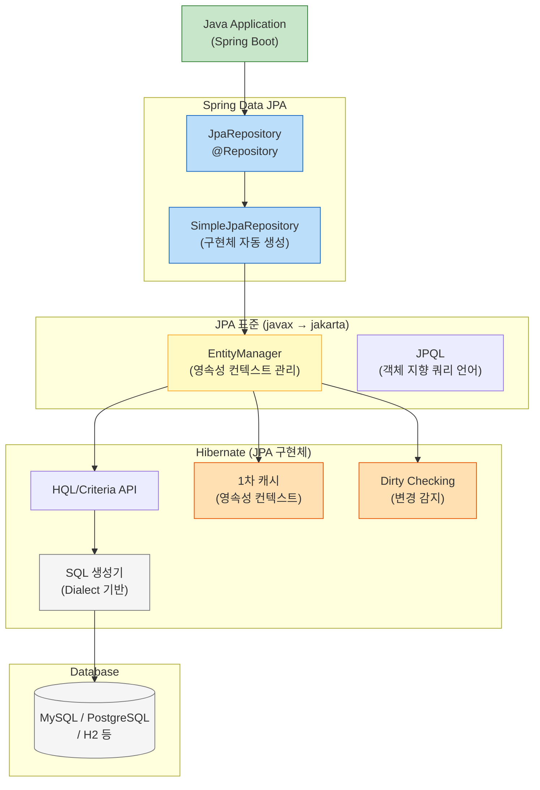
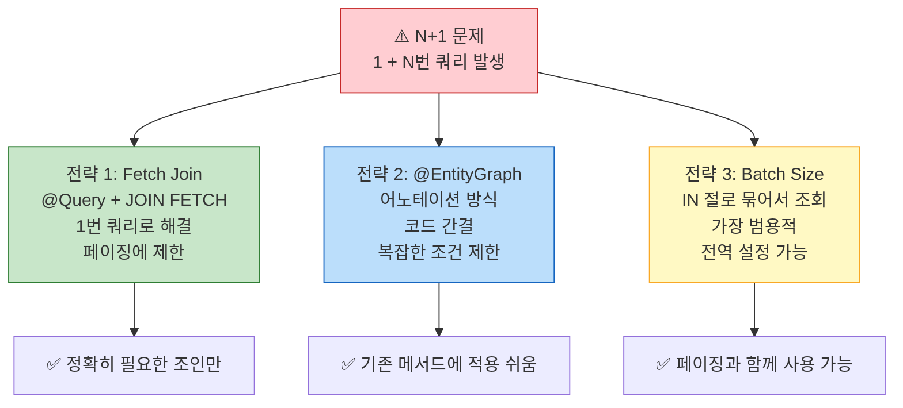

> JPA는 편리하지만 함정이 많다. N+1 쿼리 폭탄, 잘못된 Fetch 전략, 의도치 않은 Lazy 초기화 — 원리를 알아야 피할 수 있다. ORM 매핑부터 N+1 해결, QueryDSL 동적 쿼리까지 실무 관점으로 완전히 정복한다.

## 핵심 요약 (TL;DR)

**JPA(Java Persistence API)** 는 객체-관계 매핑(ORM) 표준으로, SQL 대신 객체로 DB를 다룰 수 있게 한다. **Hibernate**가 JPA의 기본 구현체, **Spring Data JPA**가 그 위에 `JpaRepository`를 제공한다. **N+1 문제**는 1번 쿼리로 N개를 조회했을 때 연관 엔티티를 N번 추가 조회하는 성능 함정이다 — 해결 전략은 ① Fetch Join, ② `@EntityGraph`, ③ Batch Size 설정 세 가지. **QueryDSL**은 타입 세이프한 동적 쿼리를 위해 사용한다 (Spring Boot 3에서는 `jakarta` 패키지 기반으로 설정 필요).

---

## ORM 계층 구조



---

## 환경 설정

### `build.gradle.kts`

```kotlin
plugins {
    java
    id("org.springframework.boot") version "3.4.3"
    id("io.spring.dependency-management") version "1.1.7"
    // QueryDSL APT — Q클래스 자동 생성
    kotlin("kapt") version "1.9.24"  // Kotlin 사용 시; Java 프로젝트면 아래 annotationProcessor 사용
}

dependencies {
    implementation("org.springframework.boot:spring-boot-starter-web")
    implementation("org.springframework.boot:spring-boot-starter-data-jpa")
    implementation("org.springframework.boot:spring-boot-starter-validation")

    // QueryDSL — Spring Boot 3 (Jakarta Persistence)
    implementation("com.querydsl:querydsl-jpa:5.1.0:jakarta")
    annotationProcessor("com.querydsl:querydsl-apt:5.1.0:jakarta")
    annotationProcessor("jakarta.annotation:jakarta.annotation-api")
    annotationProcessor("jakarta.persistence:jakarta.persistence-api")

    compileOnly("org.projectlombok:lombok")
    annotationProcessor("org.projectlombok:lombok")
    runtimeOnly("com.h2database:h2")

    testImplementation("org.springframework.boot:spring-boot-starter-test")
}

// QueryDSL Q클래스 생성 디렉토리 설정
tasks.compileJava {
    options.annotationProcessorPath = configurations["annotationProcessor"]
}

sourceSets {
    main {
        java {
            srcDir("$buildDir/generated/sources/annotationProcessor/java/main")
        }
    }
}
```

### `application.yml`

```yaml
spring:
  datasource:
    url: jdbc:h2:mem:jpadb
    driver-class-name: org.h2.Driver
    username: sa
  h2:
    console:
      enabled: true
  jpa:
    hibernate:
      ddl-auto: create-drop
    show-sql: true
    properties:
      hibernate:
        format_sql: true
        use_sql_comments: true        # JPQL → SQL 변환 주석 표시
        default_batch_fetch_size: 100  # ← N+1 전역 완화 (중요!)
```

---

## Entity 관계 매핑

이번 예제는 `Member` — `Order` — `OrderItem` — `Product` 4개 Entity의 관계로 구성한다.

```java
// Member.java
@Entity
@Table(name = "members")
@Getter
@NoArgsConstructor(access = AccessLevel.PROTECTED)
@Builder
@AllArgsConstructor
public class Member {

    @Id @GeneratedValue(strategy = GenerationType.IDENTITY)
    private Long id;

    @Column(nullable = false, unique = true)
    private String email;

    @Column(nullable = false)
    private String name;

    // 1:N — 기본값 LAZY (강력 권장)
    @OneToMany(mappedBy = "member", cascade = CascadeType.ALL, orphanRemoval = true)
    @Builder.Default
    private List<Order> orders = new ArrayList<>();

    public void addOrder(Order order) {
        orders.add(order);
        order.setMember(this);
    }
}
```

```java
// Order.java
@Entity
@Table(name = "orders")
@Getter
@NoArgsConstructor(access = AccessLevel.PROTECTED)
public class Order {

    @Id @GeneratedValue(strategy = GenerationType.IDENTITY)
    private Long id;

    // N:1 — 반드시 LAZY (EAGER가 기본인 @ManyToOne을 LAZY로 명시)
    @ManyToOne(fetch = FetchType.LAZY)
    @JoinColumn(name = "member_id")
    private Member member;

    @Enumerated(EnumType.STRING)
    private OrderStatus status;

    @CreatedDate
    @Column(updatable = false)
    private LocalDateTime orderedAt;

    @OneToMany(mappedBy = "order", cascade = CascadeType.ALL, orphanRemoval = true)
    private List<OrderItem> orderItems = new ArrayList<>();

    @Builder
    private Order(Member member) {
        this.member = member;
        this.status = OrderStatus.PENDING;
    }

    // 연관 관계 편의 메서드
    void setMember(Member member) { this.member = member; }

    public void addItem(OrderItem item) {
        orderItems.add(item);
        item.setOrder(this);
    }

    public BigDecimal getTotalPrice() {
        return orderItems.stream()
                .map(OrderItem::getSubTotal)
                .reduce(BigDecimal.ZERO, BigDecimal::add);
    }
}
```

```java
// OrderItem.java
@Entity
@Table(name = "order_items")
@Getter
@NoArgsConstructor(access = AccessLevel.PROTECTED)
public class OrderItem {

    @Id @GeneratedValue(strategy = GenerationType.IDENTITY)
    private Long id;

    @ManyToOne(fetch = FetchType.LAZY)
    @JoinColumn(name = "order_id")
    private Order order;

    @ManyToOne(fetch = FetchType.LAZY)
    @JoinColumn(name = "product_id")
    private Product product;

    @Column(nullable = false)
    private int quantity;

    @Column(nullable = false, precision = 12, scale = 2)
    private BigDecimal unitPrice;  // 주문 시점 가격 스냅샷

    @Builder
    private OrderItem(Product product, int quantity) {
        this.product = product;
        this.quantity = quantity;
        this.unitPrice = product.getPrice();  // 현재 가격 복사
    }

    void setOrder(Order order) { this.order = order; }

    public BigDecimal getSubTotal() {
        return unitPrice.multiply(BigDecimal.valueOf(quantity));
    }
}
```

---

## N+1 문제 — 원인부터 해결까지

### N+1이 발생하는 상황

```java
// ❌ N+1 발생 코드
List<Order> orders = orderRepository.findAll();  // 쿼리 1번: 주문 N개 조회

for (Order order : orders) {
    // 여기서 LAZY로 설정된 member 접근 → 쿼리 N번 추가 발생!
    System.out.println(order.getMember().getName());
}
// 총 쿼리: 1 + N번 (N=주문 수)
// 주문 100개 → 101번의 쿼리
```

**SQL 로그:**
```sql
-- 1번: 주문 전체 조회
SELECT o.* FROM orders o

-- N번: 각 주문의 회원 조회 (orders 수만큼 반복)
SELECT m.* FROM members m WHERE m.id = 1
SELECT m.* FROM members m WHERE m.id = 2
-- ... 100번 더
```

### 해결 전략 비교



### 해결 전략 1: Fetch Join (JPQL)

```java
public interface OrderRepository extends JpaRepository<Order, Long> {

    // Fetch Join — JOIN FETCH로 한 번에 조회
    @Query("SELECT DISTINCT o FROM Order o " +
           "JOIN FETCH o.member " +          // member 함께 조회
           "JOIN FETCH o.orderItems oi " +   // orderItems 함께 조회
           "JOIN FETCH oi.product")          // product 함께 조회
    List<Order> findAllWithMemberAndItems();

    // ⚠️ 컬렉션(OneToMany) Fetch Join + 페이징은 사용 불가
    // → Hibernate가 메모리에서 페이징하며 경고 로그 발생
    // → 이 경우 Batch Size 전략 사용
}
```

```sql
-- 생성되는 SQL (1번)
SELECT DISTINCT o.*, m.*, oi.*, p.*
FROM orders o
INNER JOIN members m ON o.member_id = m.id
INNER JOIN order_items oi ON oi.order_id = o.id
INNER JOIN products p ON oi.product_id = p.id
```

### 해결 전략 2: `@EntityGraph`

```java
public interface OrderRepository extends JpaRepository<Order, Long> {

    // @EntityGraph — 어노테이션으로 Eager 로딩 지정
    @EntityGraph(attributePaths = {"member", "orderItems", "orderItems.product"})
    List<Order> findByStatus(OrderStatus status);

    // 기존 쿼리 메서드에 덧붙이기 쉬운 장점
    @EntityGraph(attributePaths = "member")
    Optional<Order> findWithMemberById(Long id);
}
```

### 해결 전략 3: Batch Size (전역 설정)

```yaml
# application.yml — 전역 설정 (가장 실용적)
spring:
  jpa:
    properties:
      hibernate:
        default_batch_fetch_size: 100  # IN 절로 100개씩 묶어서 조회
```

```java
// 또는 특정 컬렉션에만 적용
@OneToMany(mappedBy = "order")
@BatchSize(size = 100)
private List<OrderItem> orderItems;
```

**Batch Size 작동 방식:**
```sql
-- 주문 N개 조회
SELECT o.* FROM orders o

-- IN 절로 한 번에 조회 (N번 대신 최대 N/100번)
SELECT oi.* FROM order_items oi
WHERE oi.order_id IN (1, 2, 3, ... 100)

-- 100개 이상이면 다음 batch
SELECT oi.* FROM order_items oi
WHERE oi.order_id IN (101, 102, ... 200)
```

### 전략 선택 가이드

| 상황 | 권장 전략 |
|------|----------|
| 특정 쿼리에서 정확히 필요한 연관 엔티티 | Fetch Join |
| 기존 쿼리 메서드에 Eager 로딩 추가 | @EntityGraph |
| 페이징 + 컬렉션 조회 (OneToMany) | Batch Size |
| 전체적인 N+1 완화 (기본값) | `default_batch_fetch_size: 100` |

> **실무 조언:** `default_batch_fetch_size: 100`을 기본 설정해두고, 성능이 중요한 쿼리에만 Fetch Join으로 추가 최적화한다. Batch Size가 만능처럼 느껴지지만, 조회 데이터가 매우 많을 때는 Fetch Join이 더 효율적이다.

---

## 쿼리 전략 비교 — 메서드 / JPQL / QueryDSL

### 쿼리 방식별 사용 기준

```mermaid
flowchart TD
    Q{쿼리 유형}

    Q -->|단순 조건 조회| QM["쿼리 메서드\nfindByNameAndStatus()"]
    Q -->|복잡한 조건 / 정적| JPQL["JPQL @Query\n'SELECT m FROM Member m WHERE...'"]
    Q -->|동적 조건 (AND/OR 선택적)| QD["QueryDSL\n타입 세이프 동적 쿼리"]
    Q -->|집계 / DB 함수 / 특수 SQL| NS["Native SQL\n@Query nativeQuery=true"]

    style QM fill:#c8e6c9,stroke:#2e7d32
    style JPQL fill:#bbdefb,stroke:#1565c0
    style QD fill:#ffe0b2,stroke:#e65100
    style NS fill:#fce4ec,stroke:#c62828
```

### 쿼리 메서드 (단순 조건)

```java
public interface MemberRepository extends JpaRepository<Member, Long> {

    Optional<Member> findByEmail(String email);

    List<Member> findByNameContainingIgnoreCase(String name);

    // 쿼리 메서드로 가능한 페이징
    Page<Member> findAll(Pageable pageable);

    // EXISTS, COUNT
    boolean existsByEmail(String email);
    long countByName(String name);
}
```

### JPQL (정적 복잡 쿼리)

```java
public interface OrderRepository extends JpaRepository<Order, Long>,
        OrderRepositoryCustom {  // QueryDSL 사용자 정의 인터페이스

    // DTO Projection — Entity 전체가 아닌 필요한 필드만 조회 (성능 최적화)
    @Query("SELECT new com.honeybarrel.honeyapi.order.dto.OrderSummary(" +
           "  o.id, m.name, o.status, o.orderedAt" +
           ") FROM Order o " +
           "JOIN o.member m " +
           "WHERE o.status = :status")
    List<OrderSummary> findOrderSummariesByStatus(@Param("status") OrderStatus status);

    // Fetch Join + 조건
    @Query("SELECT DISTINCT o FROM Order o " +
           "JOIN FETCH o.member m " +
           "JOIN FETCH o.orderItems oi " +
           "WHERE m.id = :memberId " +
           "ORDER BY o.orderedAt DESC")
    List<Order> findOrdersWithItemsByMemberId(@Param("memberId") Long memberId);

    // Native SQL — 복잡한 집계
    @Query(value = """
        SELECT DATE(o.ordered_at) AS orderDate,
               COUNT(*) AS orderCount,
               SUM(oi.unit_price * oi.quantity) AS totalRevenue
        FROM orders o
        JOIN order_items oi ON oi.order_id = o.id
        WHERE o.status = 'COMPLETED'
          AND o.ordered_at BETWEEN :startDate AND :endDate
        GROUP BY DATE(o.ordered_at)
        ORDER BY orderDate
        """, nativeQuery = true)
    List<Object[]> getDailyRevenue(
        @Param("startDate") LocalDateTime startDate,
        @Param("endDate") LocalDateTime endDate
    );
}
```

```java
// DTO Projection용 record
public record OrderSummary(
    Long orderId,
    String memberName,
    OrderStatus status,
    LocalDateTime orderedAt
) {}
```

### QueryDSL — 동적 쿼리의 정답

```java
// QueryDSL 설정
@Configuration
public class QueryDslConfig {
    @PersistenceContext
    private EntityManager em;

    @Bean
    public JPAQueryFactory jpaQueryFactory() {
        return new JPAQueryFactory(em);
    }
}
```

```java
// OrderRepositoryCustom 인터페이스
public interface OrderRepositoryCustom {
    List<Order> searchOrders(OrderSearchCondition condition);
    Page<OrderSummary> searchOrderSummaries(OrderSearchCondition condition, Pageable pageable);
}
```

```java
// OrderSearchCondition record
public record OrderSearchCondition(
    String memberName,      // null이면 조건 없음
    String memberEmail,
    OrderStatus status,
    LocalDateTime fromDate,
    LocalDateTime toDate,
    BigDecimal minAmount
) {}
```

```java
// QueryDSL 구현체
@Repository
@RequiredArgsConstructor
public class OrderRepositoryImpl implements OrderRepositoryCustom {

    private final JPAQueryFactory queryFactory;

    // Q클래스 (빌드 후 자동 생성)
    private static final QOrder order = QOrder.order;
    private static final QMember member = QMember.member;
    private static final QOrderItem orderItem = QOrderItem.orderItem;

    @Override
    public List<Order> searchOrders(OrderSearchCondition condition) {
        return queryFactory
                .selectFrom(order)
                .join(order.member, member).fetchJoin()  // N+1 방지
                .where(
                    memberNameContains(condition.memberName()),
                    memberEmailEq(condition.memberEmail()),
                    statusEq(condition.status()),
                    orderedAtBetween(condition.fromDate(), condition.toDate())
                )
                .orderBy(order.orderedAt.desc())
                .fetch();
    }

    @Override
    public Page<OrderSummary> searchOrderSummaries(
            OrderSearchCondition condition, Pageable pageable) {

        // 카운트 쿼리와 데이터 쿼리 분리 (페이징 최적화)
        List<OrderSummary> content = queryFactory
                .select(Projections.constructor(OrderSummary.class,
                        order.id,
                        member.name,
                        order.status,
                        order.orderedAt))
                .from(order)
                .join(order.member, member)
                .where(
                    memberNameContains(condition.memberName()),
                    statusEq(condition.status())
                )
                .offset(pageable.getOffset())
                .limit(pageable.getPageSize())
                .orderBy(order.orderedAt.desc())
                .fetch();

        // 카운트 쿼리 (join 없이 단순하게)
        Long total = queryFactory
                .select(order.count())
                .from(order)
                .join(order.member, member)
                .where(
                    memberNameContains(condition.memberName()),
                    statusEq(condition.status())
                )
                .fetchOne();

        return new PageImpl<>(content, pageable, total != null ? total : 0L);
    }

    // ── 동적 조건 메서드 (BooleanExpression: null 반환 시 조건 무시) ──

    private BooleanExpression memberNameContains(String name) {
        return StringUtils.hasText(name) ? member.name.containsIgnoreCase(name) : null;
    }

    private BooleanExpression memberEmailEq(String email) {
        return StringUtils.hasText(email) ? member.email.eq(email) : null;
    }

    private BooleanExpression statusEq(OrderStatus status) {
        return status != null ? order.status.eq(status) : null;
    }

    private BooleanExpression orderedAtBetween(LocalDateTime from, LocalDateTime to) {
        if (from == null && to == null) return null;
        if (from == null) return order.orderedAt.loe(to);
        if (to == null) return order.orderedAt.goe(from);
        return order.orderedAt.between(from, to);
    }
}
```

**QueryDSL의 핵심 장점:**
- `memberNameContains(null)` → `null` 반환 → where 절 조건 자동 무시 (동적 쿼리)
- `member.name.containsIgnoreCase(name)` → 컴파일 시점 필드명 오타 체크
- JPQL 문자열에서 런타임에 발견되는 오류를 컴파일 시점에 잡음

---

## 영속성 컨텍스트 심화 — 1차 캐시와 Dirty Checking

```java
@Service
@RequiredArgsConstructor
@Transactional
public class MemberService {

    private final MemberRepository memberRepository;

    public void demonstratePersistenceContext(Long id) {
        // 1차 캐시 동작
        Member member1 = memberRepository.findById(id).orElseThrow();  // DB 조회 (1번)
        Member member2 = memberRepository.findById(id).orElseThrow();  // 1차 캐시 (DB 0번)
        System.out.println(member1 == member2);  // true — 같은 객체 참조

        // Dirty Checking (변경 감지)
        member1.changeName("변경된 이름");
        // save() 호출 없이도 트랜잭션 커밋 시 자동으로 UPDATE 실행
        // Hibernate가 스냅샷과 현재 상태를 비교해서 변경된 필드만 UPDATE
    }
}
```

**영속성 컨텍스트 4가지 상태:**

```
비영속 (new)     → persist()  → 영속 (managed)
영속 (managed)   → detach()   → 준영속 (detached)
영속 (managed)   → remove()   → 삭제 (removed)
준영속 (detached) → merge()   → 영속 (managed)
```

---

## Service 구현 — 주문 생성 (비즈니스 로직)

```java
@Slf4j
@Service
@RequiredArgsConstructor
@Transactional(readOnly = true)
public class OrderService {

    private final OrderRepository orderRepository;
    private final MemberRepository memberRepository;
    private final ProductRepository productRepository;

    @Transactional
    public OrderDto.Response createOrder(Long memberId, OrderDto.CreateRequest request) {
        Member member = memberRepository.findById(memberId)
                .orElseThrow(() -> new IllegalArgumentException("회원을 찾을 수 없습니다"));

        Order order = Order.builder().member(member).build();

        // 주문 상품 추가
        for (OrderDto.OrderItemRequest itemRequest : request.items()) {
            Product product = productRepository.findById(itemRequest.productId())
                    .orElseThrow(() -> new IllegalArgumentException(
                            "상품을 찾을 수 없습니다: " + itemRequest.productId()));

            // 비즈니스 규칙: 재고 감소 (Product Entity의 비즈니스 메서드)
            product.decreaseStock(itemRequest.quantity());

            OrderItem item = OrderItem.builder()
                    .product(product)
                    .quantity(itemRequest.quantity())
                    .build();

            order.addItem(item);
        }

        Order saved = orderRepository.save(order);
        log.info("주문 생성: orderId={}, memberId={}, items={}", 
                saved.getId(), memberId, request.items().size());

        return OrderDto.Response.from(saved);
    }

    public Page<OrderDto.SummaryResponse> searchOrders(
            OrderSearchCondition condition, Pageable pageable) {
        return orderRepository.searchOrderSummaries(condition, pageable)
                .map(OrderDto.SummaryResponse::from);
    }

    public List<OrderDto.Response> getMemberOrders(Long memberId) {
        return orderRepository.findOrdersWithItemsByMemberId(memberId)
                .stream()
                .map(OrderDto.Response::from)
                .toList();
    }
}
```

---

## 실행 및 테스트

```bash
./gradlew clean build  # Q클래스 생성 포함 빌드
./gradlew bootRun

# ── 주문 생성
curl -s -X POST http://localhost:8081/api/v1/orders \
  -H "Content-Type: application/json" \
  -d '{
    "memberId": 1,
    "items": [
      {"productId": 1, "quantity": 2},
      {"productId": 2, "quantity": 1}
    ]
  }' | python3 -m json.tool

# ── 동적 검색 (QueryDSL)
curl "http://localhost:8081/api/v1/orders?memberName=꿀&status=PENDING&page=0&size=10"

# ── SQL 로그로 쿼리 수 확인
# JDBC Proxy 활용 (선택)
# implementation("com.github.gavlyukovskiy:p6spy-spring-boot-starter:1.9.2")
```

---

## 설계 포인트 — JPA 사용 시 지켜야 할 규칙

| 규칙 | 이유 |
|------|------|
| `@ManyToOne`은 반드시 `LAZY` | 기본값 `EAGER`는 연관 엔티티를 항상 조회 → 불필요한 쿼리 |
| `@OneToMany`에 `EAGER` 금지 | 컬렉션 EAGER = N+1 폭탄 |
| `default_batch_fetch_size: 100` 기본 설정 | LAZY 로딩 시 N+1을 IN 절로 완화 |
| Entity를 API 응답에 직접 사용 금지 | Jackson이 LAZY 컬렉션 직렬화 시 N+1 or LazyInitializationException |
| `@Transactional` 범위 밖에서 LAZY 접근 금지 | `LazyInitializationException` 발생 |
| QueryDSL `null` 반환 패턴 활용 | 동적 쿼리를 조건절 조합으로 명확하게 |

---

## 트레이드오프 정리

| 방식 | 장점 | 단점 | 선택 기준 |
|------|------|------|----------|
| **쿼리 메서드** | 코드 없이 자동 생성, 빠름 | 복잡한 조건 불가 | 단순 CRUD |
| **JPQL @Query** | 자유로운 객체 쿼리, Fetch Join 지원 | 문자열 기반 오타 위험, 동적 조건 불편 | 정적 복잡 쿼리 |
| **QueryDSL** | 타입 세이프, 동적 조건, 컴파일 체크 | 설정 복잡, 빌드 후 Q클래스 필요 | 동적 검색 |
| **Native SQL** | DB 고유 기능 활용, 집계 자유 | DB 벤더 종속, Entity 매핑 없음 | 통계/집계 |
| **Fetch Join** | 1번 쿼리로 해결, 정확함 | 컬렉션+페이징 불가 | to-one 관계 |
| **Batch Size** | 페이징 호환, 전역 적용 | 여전히 2번의 쿼리 | to-many 관계 |

---

## 시리즈 안내

| Part | 주제 | 상태 |
|------|------|------|
| Part 1 | Spring Boot 시작하기 | [보러가기](/2026/03/17/spring-boot-getting-started/) |
| Part 2 | 의존성 주입과 IoC | [보러가기](/2026/03/18/spring-boot-di-ioc/) |
| Part 3 | 레이어드 아키텍처 | [보러가기](/2026/03/19/spring-boot-layered-architecture/) |
| **Part 4** | **Spring Data JPA** | 현재 글 |
| Part 7 | 테스트 전략 | [보러가기](/2026/03/25/spring-boot-testing/) |
| Part 8 | 운영 배포 전략 | 예정 |

---

## 레퍼런스

### 공식 문서
- [Spring Data JPA Reference Documentation](https://docs.spring.io/spring-data/jpa/reference/) — JpaRepository, 쿼리 메서드 공식 레퍼런스
- [Hibernate ORM Documentation](https://docs.jboss.org/hibernate/orm/current/userguide/html_single/) — Hibernate 공식 가이드 (영속성 컨텍스트, N+1 등)
- [QueryDSL JPA 5.1.0](http://querydsl.com/static/querydsl/5.1.0/reference/html_single/) — QueryDSL 공식 레퍼런스

### 기술 블로그
- [Solving the N+1 Query Problem in Hibernate & JPA — DEV Community](https://dev.to/devcorner/solving-the-n1-query-problem-in-hibernate-jpa-1ijj) — N+1 해결 전략 정리 (2025)
- [Upgrade Guide to Spring Boot 3 for JPA and QueryDSL — DZone](https://dzone.com/articles/upgrade-guide-to-spring-boot-3-for-spring-data-jpa-3-and-querydsl-5) — Spring Boot 3 QueryDSL 마이그레이션
- [Is QueryDSL Still Used in 2024? — Reddit](https://www.reddit.com/r/SpringBoot/comments/1curzvz/is_querydsl_still_used_in_2024/) — QueryDSL 현황과 대안 논의

---

*이 포스트는 [HoneyByte](https://blog.honeybarrel.co.kr) Spring Boot Deep Dive 시리즈의 일부입니다.*
