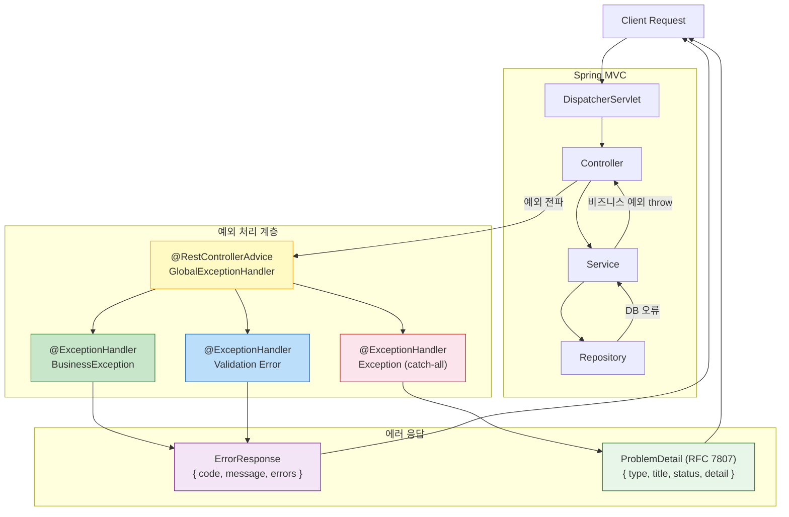
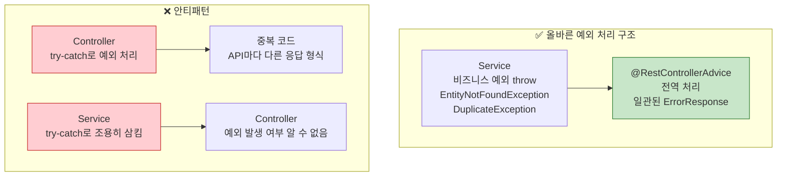

> 500 Internal Server Error 하나로 모든 오류를 때우는 API는 클라이언트를 배신하는 것이다. 예외 계층 설계, 검증, 전역 처리, RFC 7807 표준 응답까지 — 현업에서 바로 쓸 수 있는 완전한 예외 처리 전략.

## 핵심 요약 (TL;DR)

Spring Boot의 예외 처리 전략은 **예외 계층 설계 → `@RestControllerAdvice` 전역 처리 → `@Valid` 입력 검증 → 일관된 에러 응답** 4단계로 구성된다. 커스텀 예외는 `ErrorCode` 열거형으로 관리하고, `@ExceptionHandler`가 이를 잡아 클라이언트 친화적인 응답으로 변환한다. **Spring Boot 3**부터 RFC 7807 표준인 `ProblemDetail`을 지원하여 API 에러 응답을 국제 표준에 맞게 구성할 수 있다.

---

## 왜 예외 처리 전략이 필요한가

```java
// ❌ Bad: 예외 처리 없는 Controller
@GetMapping("/users/{id}")
public User getUser(@PathVariable Long id) {
    return userRepository.findById(id)
            .orElseThrow(); // NoSuchElementException → 500 응답
    // 클라이언트: "서버 오류"인지 "없는 리소스"인지 알 수 없음
    // 로그에 스택 트레이스 노출 → 보안 위협
}
```

```json
// ❌ 일관성 없는 에러 응답들
// 일부 API: { "error": "Not Found" }
// 다른 API: { "message": "User not found" }
// 또 다른: { "code": 404, "desc": "사용자 없음" }
```

**문제점:**
1. **클라이언트 혼란** — 에러 응답 형식이 API마다 다름
2. **디버깅 어려움** — 에러 코드 없이 메시지만으로는 원인 파악 불가
3. **보안 취약** — 스택 트레이스, 내부 클래스명 노출
4. **SRP 위반** — Controller마다 예외 처리 로직 중복

---

## 예외 처리 아키텍처



---

## 구현 — 예외 계층 설계

### 1. `ErrorCode` 열거형 — 에러의 단일 진실 공급원

```java
// src/main/java/com/honeybarrel/honeyapi/exception/ErrorCode.java
package com.honeybarrel.honeyapi.exception;

import lombok.Getter;
import lombok.RequiredArgsConstructor;
import org.springframework.http.HttpStatus;

/**
 * 애플리케이션 전체 에러 코드 정의.
 *
 * 장점:
 * - 에러 코드 중앙 관리 → 변경 시 한 곳만 수정 (OCP)
 * - 에러 코드로 문서화 자동화 가능
 * - 클라이언트가 에러 코드로 다국어 처리 가능
 */
@Getter
@RequiredArgsConstructor
public enum ErrorCode {

    // ── 공통 ──────────────────────────────────────────────────
    INVALID_INPUT("COMMON_001", "입력값이 올바르지 않습니다", HttpStatus.BAD_REQUEST),
    RESOURCE_NOT_FOUND("COMMON_002", "요청한 리소스를 찾을 수 없습니다", HttpStatus.NOT_FOUND),
    UNAUTHORIZED("COMMON_003", "인증이 필요합니다", HttpStatus.UNAUTHORIZED),
    FORBIDDEN("COMMON_004", "접근 권한이 없습니다", HttpStatus.FORBIDDEN),
    INTERNAL_ERROR("COMMON_500", "서버 내부 오류가 발생했습니다", HttpStatus.INTERNAL_SERVER_ERROR),

    // ── 회원 도메인 ────────────────────────────────────────────
    MEMBER_NOT_FOUND("MEMBER_001", "회원을 찾을 수 없습니다", HttpStatus.NOT_FOUND),
    MEMBER_EMAIL_DUPLICATE("MEMBER_002", "이미 사용 중인 이메일입니다", HttpStatus.CONFLICT),
    MEMBER_PASSWORD_INVALID("MEMBER_003", "비밀번호가 올바르지 않습니다", HttpStatus.BAD_REQUEST),

    // ── 상품 도메인 ────────────────────────────────────────────
    PRODUCT_NOT_FOUND("PRODUCT_001", "상품을 찾을 수 없습니다", HttpStatus.NOT_FOUND),
    PRODUCT_NAME_DUPLICATE("PRODUCT_002", "이미 존재하는 상품명입니다", HttpStatus.CONFLICT),
    PRODUCT_OUT_OF_STOCK("PRODUCT_003", "재고가 부족합니다", HttpStatus.CONFLICT),
    PRODUCT_INACTIVE("PRODUCT_004", "판매 중지된 상품입니다", HttpStatus.BAD_REQUEST),

    // ── 주문 도메인 ────────────────────────────────────────────
    ORDER_NOT_FOUND("ORDER_001", "주문을 찾을 수 없습니다", HttpStatus.NOT_FOUND),
    ORDER_CANCEL_FORBIDDEN("ORDER_002", "취소할 수 없는 주문입니다", HttpStatus.CONFLICT),
    ORDER_EMPTY_ITEMS("ORDER_003", "주문 상품이 없습니다", HttpStatus.BAD_REQUEST);

    private final String code;
    private final String message;
    private final HttpStatus httpStatus;
}
```

### 2. 커스텀 예외 계층

```java
// src/main/java/com/honeybarrel/honeyapi/exception/BusinessException.java
package com.honeybarrel.honeyapi.exception;

import lombok.Getter;

/**
 * 비즈니스 로직 예외의 최상위 클래스.
 * RuntimeException을 상속 — 체크 예외 강제 사용 불필요.
 *
 * 계층 구조:
 * RuntimeException
 * └── BusinessException (비즈니스 기반)
 *     ├── EntityNotFoundException (리소스 없음 → 404)
 *     ├── DuplicateException (중복 → 409)
 *     └── ValidationException (비즈니스 검증 실패 → 400/409)
 */
@Getter
public class BusinessException extends RuntimeException {

    private final ErrorCode errorCode;

    public BusinessException(ErrorCode errorCode) {
        super(errorCode.getMessage());
        this.errorCode = errorCode;
    }

    public BusinessException(ErrorCode errorCode, String detailMessage) {
        super(detailMessage);  // 상세 메시지 오버라이드
        this.errorCode = errorCode;
    }
}
```

```java
// src/main/java/com/honeybarrel/honeyapi/exception/EntityNotFoundException.java
package com.honeybarrel.honeyapi.exception;

/**
 * 엔티티를 찾을 수 없을 때 (HTTP 404).
 * 예: memberRepository.findById(id).orElseThrow(MemberNotFoundException::new)
 */
public class EntityNotFoundException extends BusinessException {

    public EntityNotFoundException(ErrorCode errorCode) {
        super(errorCode);
    }

    public EntityNotFoundException(ErrorCode errorCode, Long id) {
        super(errorCode, errorCode.getMessage() + " (id=" + id + ")");
    }
}
```

```java
// src/main/java/com/honeybarrel/honeyapi/exception/DuplicateException.java
package com.honeybarrel.honeyapi.exception;

/** 중복 리소스 (HTTP 409 Conflict) */
public class DuplicateException extends BusinessException {
    public DuplicateException(ErrorCode errorCode) {
        super(errorCode);
    }
    public DuplicateException(ErrorCode errorCode, String detail) {
        super(errorCode, detail);
    }
}
```

```java
// src/main/java/com/honeybarrel/honeyapi/exception/OutOfStockException.java
package com.honeybarrel.honeyapi.exception;

/** 재고 부족 — 도메인 특화 예외 */
public class OutOfStockException extends BusinessException {
    public OutOfStockException(Long productId, int requested, int available) {
        super(ErrorCode.PRODUCT_OUT_OF_STOCK,
              String.format("재고 부족 [productId=%d, 요청=%d, 재고=%d]",
                            productId, requested, available));
    }
}
```

### 3. 에러 응답 DTO

```java
// src/main/java/com/honeybarrel/honeyapi/exception/ErrorResponse.java
package com.honeybarrel.honeyapi.exception;

import com.fasterxml.jackson.annotation.JsonInclude;
import lombok.Builder;
import lombok.Getter;

import java.time.LocalDateTime;
import java.util.List;

/**
 * 표준 에러 응답 DTO.
 *
 * 응답 예시:
 * {
 *   "code": "PRODUCT_001",
 *   "message": "상품을 찾을 수 없습니다 (id=99)",
 *   "timestamp": "2026-03-21T09:00:00",
 *   "errors": [                    // 검증 실패 시만 포함 (null이면 생략)
 *     { "field": "name", "message": "상품명은 필수입니다", "rejectedValue": "" }
 *   ]
 * }
 */
@Getter
@Builder
@JsonInclude(JsonInclude.Include.NON_NULL)  // null 필드 JSON 응답에서 제외
public class ErrorResponse {

    private final String code;
    private final String message;

    @Builder.Default
    private final LocalDateTime timestamp = LocalDateTime.now();

    private final List<FieldError> errors;  // 검증 실패 시만 포함

    // 단순 에러 응답
    public static ErrorResponse of(ErrorCode errorCode) {
        return ErrorResponse.builder()
                .code(errorCode.getCode())
                .message(errorCode.getMessage())
                .build();
    }

    public static ErrorResponse of(ErrorCode errorCode, String detailMessage) {
        return ErrorResponse.builder()
                .code(errorCode.getCode())
                .message(detailMessage)
                .build();
    }

    // 검증 실패 응답 (필드별 오류 포함)
    public static ErrorResponse ofValidation(List<FieldError> fieldErrors) {
        return ErrorResponse.builder()
                .code(ErrorCode.INVALID_INPUT.getCode())
                .message(ErrorCode.INVALID_INPUT.getMessage())
                .errors(fieldErrors)
                .build();
    }

    /** 필드 검증 오류 상세 */
    @Getter
    @Builder
    public static class FieldError {
        private final String field;
        private final String message;
        private final Object rejectedValue;  // 클라이언트가 보낸 잘못된 값

        public static FieldError of(org.springframework.validation.FieldError error) {
            return FieldError.builder()
                    .field(error.getField())
                    .message(error.getDefaultMessage())
                    .rejectedValue(error.getRejectedValue())
                    .build();
        }
    }
}
```

### 4. `@RestControllerAdvice` — 전역 예외 처리

```java
// src/main/java/com/honeybarrel/honeyapi/exception/GlobalExceptionHandler.java
package com.honeybarrel.honeyapi.exception;

import lombok.extern.slf4j.Slf4j;
import org.springframework.http.HttpStatus;
import org.springframework.http.ResponseEntity;
import org.springframework.http.converter.HttpMessageNotReadableException;
import org.springframework.validation.BindingResult;
import org.springframework.web.bind.MethodArgumentNotValidException;
import org.springframework.web.bind.MissingServletRequestParameterException;
import org.springframework.web.bind.annotation.ExceptionHandler;
import org.springframework.web.bind.annotation.RestControllerAdvice;
import org.springframework.web.method.annotation.MethodArgumentTypeMismatchException;

import java.util.List;

/**
 * 전역 예외 처리 핸들러.
 *
 * @RestControllerAdvice = @ControllerAdvice + @ResponseBody
 * → 모든 @Controller에서 발생하는 예외를 AOP 방식으로 처리
 * → Controller마다 @ExceptionHandler 중복 불필요
 *
 * SRP: 예외 처리 로직을 한 곳에 집중
 * OCP: 새 예외 타입 추가 = @ExceptionHandler 메서드 하나 추가 (기존 코드 수정 없음)
 */
@Slf4j
@RestControllerAdvice
public class GlobalExceptionHandler {

    // ══════════════════════════════════════════════════════════
    // 1. 비즈니스 예외 처리
    // ══════════════════════════════════════════════════════════

    /**
     * BusinessException 계층 전체 처리.
     * EntityNotFoundException, DuplicateException, OutOfStockException 등 모두 포함.
     */
    @ExceptionHandler(BusinessException.class)
    public ResponseEntity<ErrorResponse> handleBusinessException(BusinessException e) {
        ErrorCode errorCode = e.getErrorCode();

        // 500 에러는 ERROR, 나머지는 WARN 로그
        if (errorCode.getHttpStatus().is5xxServerError()) {
            log.error("Business exception: code={}, message={}", errorCode.getCode(), e.getMessage(), e);
        } else {
            log.warn("Business exception: code={}, message={}", errorCode.getCode(), e.getMessage());
        }

        return ResponseEntity
                .status(errorCode.getHttpStatus())
                .body(ErrorResponse.of(errorCode, e.getMessage()));
    }

    // ══════════════════════════════════════════════════════════
    // 2. 입력 검증 예외 처리
    // ══════════════════════════════════════════════════════════

    /**
     * @Valid 검증 실패 — MethodArgumentNotValidException
     * 요청 바디 DTO 검증 실패 시 발생
     */
    @ExceptionHandler(MethodArgumentNotValidException.class)
    public ResponseEntity<ErrorResponse> handleValidationException(
            MethodArgumentNotValidException e) {

        BindingResult bindingResult = e.getBindingResult();
        List<ErrorResponse.FieldError> fieldErrors = bindingResult.getFieldErrors()
                .stream()
                .map(ErrorResponse.FieldError::of)
                .toList();

        log.warn("Validation failed: {} field errors", fieldErrors.size());

        return ResponseEntity
                .status(HttpStatus.BAD_REQUEST)
                .body(ErrorResponse.ofValidation(fieldErrors));
    }

    /**
     * @RequestParam, @PathVariable 타입 불일치
     * 예: /products/abc (Long 타입 ID에 문자열 전달)
     */
    @ExceptionHandler(MethodArgumentTypeMismatchException.class)
    public ResponseEntity<ErrorResponse> handleTypeMismatch(
            MethodArgumentTypeMismatchException e) {

        String message = String.format("파라미터 '%s'의 값 '%s'이 올바른 타입이 아닙니다 (기대 타입: %s)",
                e.getName(), e.getValue(),
                e.getRequiredType() != null ? e.getRequiredType().getSimpleName() : "unknown");

        log.warn("Type mismatch: {}", message);

        return ResponseEntity
                .status(HttpStatus.BAD_REQUEST)
                .body(ErrorResponse.of(ErrorCode.INVALID_INPUT, message));
    }

    /**
     * 필수 요청 파라미터 누락
     * 예: @RequestParam String name — name 파라미터 없이 요청
     */
    @ExceptionHandler(MissingServletRequestParameterException.class)
    public ResponseEntity<ErrorResponse> handleMissingParam(
            MissingServletRequestParameterException e) {

        String message = String.format("필수 파라미터 '%s'(%s)가 누락되었습니다",
                e.getParameterName(), e.getParameterType());

        return ResponseEntity
                .status(HttpStatus.BAD_REQUEST)
                .body(ErrorResponse.of(ErrorCode.INVALID_INPUT, message));
    }

    /**
     * 잘못된 JSON 형식 요청 바디
     */
    @ExceptionHandler(HttpMessageNotReadableException.class)
    public ResponseEntity<ErrorResponse> handleMessageNotReadable(
            HttpMessageNotReadableException e) {

        log.warn("Cannot read HTTP message: {}", e.getMessage());

        return ResponseEntity
                .status(HttpStatus.BAD_REQUEST)
                .body(ErrorResponse.of(ErrorCode.INVALID_INPUT, "요청 바디가 올바른 JSON 형식이 아닙니다"));
    }

    // ══════════════════════════════════════════════════════════
    // 3. catch-all — 예기치 못한 예외
    // ══════════════════════════════════════════════════════════

    /**
     * 처리되지 않은 모든 예외 — 마지막 방어선.
     * 내부 오류 정보를 클라이언트에 노출하지 않도록 주의.
     */
    @ExceptionHandler(Exception.class)
    public ResponseEntity<ErrorResponse> handleException(Exception e) {
        // 전체 스택 트레이스를 ERROR 레벨로 로그 (운영 알림 연동)
        log.error("Unexpected exception", e);

        return ResponseEntity
                .status(HttpStatus.INTERNAL_SERVER_ERROR)
                .body(ErrorResponse.of(ErrorCode.INTERNAL_ERROR));
        // ⚠️ 클라이언트에는 "서버 내부 오류"만 반환 — 내부 구조 절대 노출하지 않음
    }
}
```

---

## 입력 검증 — `@Valid` + Bean Validation

### 검증 어노테이션 완전 정리

```java
// src/main/java/com/honeybarrel/honeyapi/member/dto/MemberDto.java
package com.honeybarrel.honeyapi.member.dto;

import jakarta.validation.constraints.*;
import java.time.LocalDate;

public class MemberDto {

    public record CreateRequest(

        // 문자열 검증
        @NotBlank(message = "이름은 필수입니다")
        @Size(min = 2, max = 50, message = "이름은 2~50자 사이여야 합니다")
        @Pattern(regexp = "^[가-힣a-zA-Z\\s]+$", message = "이름은 한글, 영문, 공백만 허용합니다")
        String name,

        @NotBlank(message = "이메일은 필수입니다")
        @Email(message = "올바른 이메일 형식이 아닙니다")
        @Size(max = 200, message = "이메일은 200자 이하여야 합니다")
        String email,

        @NotBlank(message = "비밀번호는 필수입니다")
        @Size(min = 8, max = 100, message = "비밀번호는 8~100자 사이여야 합니다")
        @Pattern(
            regexp = "^(?=.*[0-9])(?=.*[a-z])(?=.*[A-Z])(?=.*[@#$%^&+=!]).*$",
            message = "비밀번호는 대문자, 소문자, 숫자, 특수문자를 각 1자 이상 포함해야 합니다"
        )
        String password,

        // 숫자 검증
        @NotNull(message = "나이는 필수입니다")
        @Min(value = 14, message = "14세 이상만 가입 가능합니다")
        @Max(value = 150, message = "올바른 나이를 입력해주세요")
        Integer age,

        // 날짜 검증
        @Past(message = "생년월일은 과거 날짜여야 합니다")
        LocalDate birthDate,

        // 전화번호 — 정규식
        @Pattern(
            regexp = "^(010|011|016|017|018|019)-?\\d{3,4}-?\\d{4}$",
            message = "올바른 휴대폰 번호 형식이 아닙니다"
        )
        String phone,

        // Positive/PositiveOrZero
        @PositiveOrZero(message = "포인트는 0 이상이어야 합니다")
        Integer initialPoints
    ) {}

    public record Response(Long id, String name, String email) {}
}
```

### 커스텀 Validator — 비즈니스 검증이 필요한 경우

```java
// src/main/java/com/honeybarrel/honeyapi/validation/UniqueEmail.java
package com.honeybarrel.honeyapi.validation;

import jakarta.validation.Constraint;
import jakarta.validation.Payload;
import java.lang.annotation.*;

/**
 * 이메일 중복 검증 커스텀 어노테이션.
 * DB 조회가 필요한 검증은 Bean Validation 어노테이션으로 표현.
 */
@Documented
@Constraint(validatedBy = UniqueEmailValidator.class)
@Target({ElementType.FIELD})
@Retention(RetentionPolicy.RUNTIME)
public @interface UniqueEmail {
    String message() default "이미 사용 중인 이메일입니다";
    Class<?>[] groups() default {};
    Class<? extends Payload>[] payload() default {};
}
```

```java
// src/main/java/com/honeybarrel/honeyapi/validation/UniqueEmailValidator.java
package com.honeybarrel.honeyapi.validation;

import com.honeybarrel.honeyapi.member.MemberRepository;
import jakarta.validation.ConstraintValidator;
import jakarta.validation.ConstraintValidatorContext;
import lombok.RequiredArgsConstructor;
import org.springframework.stereotype.Component;

@Component
@RequiredArgsConstructor
public class UniqueEmailValidator implements ConstraintValidator<UniqueEmail, String> {

    private final MemberRepository memberRepository;

    @Override
    public boolean isValid(String email, ConstraintValidatorContext context) {
        if (email == null || email.isBlank()) return true;  // @NotBlank가 처리
        return !memberRepository.existsByEmail(email);
    }
}
```

```java
// 사용 예시 — DTO에 적용
public record CreateRequest(
    @NotBlank @Email
    @UniqueEmail  // DB 조회로 중복 확인
    String email,
    // ...
) {}
```

### Controller에서 `@Valid` 사용

```java
@RestController
@RequestMapping("/api/v1/members")
@RequiredArgsConstructor
public class MemberController {

    private final MemberService memberService;

    @PostMapping
    public ResponseEntity<ApiResponse<MemberDto.Response>> createMember(
            @Valid @RequestBody MemberDto.CreateRequest request) {
        // @Valid가 검증 실패 시 MethodArgumentNotValidException 발생
        // → GlobalExceptionHandler가 처리
        MemberDto.Response response = memberService.createMember(request);
        return ResponseEntity.status(HttpStatus.CREATED)
                .body(ApiResponse.ok("회원 가입이 완료되었습니다", response));
    }

    @GetMapping("/{id}")
    public ResponseEntity<ApiResponse<MemberDto.Response>> getMember(
            @PathVariable Long id) {
        // Service에서 EntityNotFoundException 발생 → GlobalExceptionHandler 처리
        return ResponseEntity.ok(ApiResponse.ok(memberService.getMember(id)));
    }
}
```

### Service에서 커스텀 예외 사용

```java
@Service
@RequiredArgsConstructor
@Transactional(readOnly = true)
public class MemberService {

    private final MemberRepository memberRepository;
    private final PasswordEncoder passwordEncoder;

    @Transactional
    public MemberDto.Response createMember(MemberDto.CreateRequest request) {
        // 이메일 중복 검증 (UniqueEmailValidator로도 처리 가능 — 이중 방어)
        if (memberRepository.existsByEmail(request.email())) {
            throw new DuplicateException(ErrorCode.MEMBER_EMAIL_DUPLICATE, request.email());
        }

        Member member = Member.builder()
                .name(request.name())
                .email(request.email())
                .password(passwordEncoder.encode(request.password()))
                .build();

        return MemberDto.Response.from(memberRepository.save(member));
    }

    public MemberDto.Response getMember(Long id) {
        Member member = memberRepository.findById(id)
                .orElseThrow(() -> new EntityNotFoundException(ErrorCode.MEMBER_NOT_FOUND, id));
        return MemberDto.Response.from(member);
    }
}
```

---

## Spring Boot 3 — RFC 7807 ProblemDetail

Spring Boot 3부터 HTTP 문제 세부정보에 관한 RFC 7807 국제 표준 `ProblemDetail`을 기본 지원한다.

```yaml
# application.yml — ProblemDetail 활성화
spring:
  mvc:
    problemdetails:
      enabled: true  # Spring Boot 3 기본 활성화
```

```java
// RFC 7807 표준 응답 형식
// {
//   "type": "https://docs.honeybarrel.co.kr/errors/MEMBER_001",
//   "title": "회원을 찾을 수 없습니다",
//   "status": 404,
//   "detail": "회원을 찾을 수 없습니다 (id=99)",
//   "instance": "/api/v1/members/99"
// }

// ProblemDetail을 직접 반환하는 예외 처리 방식
@ExceptionHandler(BusinessException.class)
public ResponseEntity<ProblemDetail> handleBusinessException(
        BusinessException e, HttpServletRequest request) {

    ErrorCode errorCode = e.getErrorCode();

    ProblemDetail problemDetail = ProblemDetail.forStatusAndDetail(
            errorCode.getHttpStatus(),
            e.getMessage()
    );
    // RFC 7807 표준 필드
    problemDetail.setTitle(errorCode.getMessage());
    problemDetail.setType(URI.create(
        "https://docs.honeybarrel.co.kr/errors/" + errorCode.getCode()
    ));
    problemDetail.setInstance(URI.create(request.getRequestURI()));

    // 확장 필드 — 표준에 없는 추가 정보
    problemDetail.setProperty("errorCode", errorCode.getCode());
    problemDetail.setProperty("timestamp", LocalDateTime.now());

    return ResponseEntity
            .status(errorCode.getHttpStatus())
            .body(problemDetail);
}
```

> **커스텀 `ErrorResponse` vs `ProblemDetail`:**
> - 팀 내부 서비스라면 커스텀 `ErrorResponse`로 원하는 형식 정의
> - 외부 공개 API나 B2B라면 RFC 7807 `ProblemDetail` 표준 준수 권장
> - Spring Boot 3에서는 둘 다 공존 가능 — 상황에 맞게 선택

---

## API 테스트 — 예외 처리 검증

```bash
# 서버 실행
./gradlew bootRun

# ── 검증 실패 테스트 ──────────────────────────────────────

# 1. 이름 빈 문자열 + 잘못된 이메일 → 필드별 에러 목록
curl -s -X POST http://localhost:8081/api/v1/members \
  -H "Content-Type: application/json" \
  -d '{"name": "", "email": "not-email", "password": "weak", "age": 10}' \
  | python3 -m json.tool
```

```json
// 응답 예시
{
  "code": "COMMON_001",
  "message": "입력값이 올바르지 않습니다",
  "timestamp": "2026-03-21T09:00:00",
  "errors": [
    { "field": "name",     "message": "이름은 필수입니다",                  "rejectedValue": "" },
    { "field": "email",    "message": "올바른 이메일 형식이 아닙니다",        "rejectedValue": "not-email" },
    { "field": "password", "message": "비밀번호는 8~100자 사이여야 합니다",  "rejectedValue": "weak" },
    { "field": "age",      "message": "14세 이상만 가입 가능합니다",         "rejectedValue": 10 }
  ]
}
```

```bash
# 2. 존재하지 않는 회원 조회 → 404 Not Found
curl -s http://localhost:8081/api/v1/members/9999
```

```json
{
  "code": "MEMBER_001",
  "message": "회원을 찾을 수 없습니다 (id=9999)",
  "timestamp": "2026-03-21T09:00:01"
}
```

```bash
# 3. 이메일 중복 → 409 Conflict
curl -s -X POST http://localhost:8081/api/v1/members \
  -H "Content-Type: application/json" \
  -d '{"name": "꿀벌왕", "email": "king@honeybarrel.co.kr", ...}'
```

```json
{
  "code": "MEMBER_002",
  "message": "king@honeybarrel.co.kr",
  "timestamp": "2026-03-21T09:00:02"
}
```

```bash
# 4. 타입 불일치 → 400 Bad Request
curl -s http://localhost:8081/api/v1/members/abc
# { "code": "COMMON_001", "message": "파라미터 'id'의 값 'abc'이 올바른 타입이 아닙니다 (기대 타입: Long)" }

# 5. 잘못된 JSON → 400 Bad Request
curl -s -X POST http://localhost:8081/api/v1/members \
  -H "Content-Type: application/json" \
  -d 'invalid json'
# { "code": "COMMON_001", "message": "요청 바디가 올바른 JSON 형식이 아닙니다" }
```

---

## 설계 포인트 — 예외 처리 황금 규칙



**황금 규칙:**
1. `@RestControllerAdvice`는 **하나**만 — 여러 개 있으면 처리 우선순위 혼란
2. `catch-all` (`Exception.class`)은 반드시 **맨 마지막** — 구체 예외가 먼저 매칭
3. 예외 로그는 **비즈니스 오류는 WARN, 시스템 오류는 ERROR**
4. 클라이언트에 **스택 트레이스 절대 노출 금지**
5. `@Valid`는 Controller에서, 비즈니스 검증은 Service에서 — 역할 분리
6. 예외 메시지에 **사용자에게 보여줄 내용**과 **개발자 디버깅 내용**을 구분
7. `ErrorCode` 열거형으로 에러 코드 **중앙 관리** — 문서와 동기화

| 예외 유형 | 처리 위치 | HTTP 상태 |
|----------|----------|----------|
| 입력값 형식 오류 | `@Valid` + ControllerAdvice | 400 |
| 리소스 없음 | Service → `EntityNotFoundException` | 404 |
| 중복 리소스 | Service → `DuplicateException` | 409 |
| 비즈니스 규칙 위반 | Service → `BusinessException` | 400/409 |
| 인증 없음 | Security Filter | 401 |
| 권한 없음 | Security Filter / Service | 403 |
| 시스템 오류 | catch-all | 500 |

---

## 시리즈 안내

| Part | 주제 | 링크 |
|------|------|------|
| Part 1 | Spring Boot 시작하기 | [보러가기](/2026/03/17/spring-boot-시작하기-설치부터-첫-rest-api까지/) |
| Part 2 | 의존성 주입과 IoC | [보러가기](/2026/03/18/spring-boot-의존성-주입과-ioc-컨테이너-원리부터-실전까지/) |
| Part 3 | 레이어드 아키텍처 | [보러가기](/2026/03/19/spring-boot-레이어드-아키텍처-controllerservicerepository-완전-해부/) |
| Part 4 | Spring Data JPA | [보러가기](/2026/03/20/spring-data-jpa-orm-관계-매핑-n1-문제-querydsl-완전-정복/) |
| **Part 5** | **예외 처리와 검증** | 현재 글 |
| Part 6 | Spring Security | [보러가기](/2026/03/24/spring-security-securityfilterchain-jwt-rbac-cors-완전-정복/) |
| Part 7 | 테스트 전략 | [보러가기](/2026/03/25/spring-boot-테스트-전략-springboottest부터-testcontainers까지/) |
| Part 8 | 배포와 운영 | [보러가기](/2026/03/26/spring-boot-배포와-운영/) |

---

## 레퍼런스

### 공식 문서
- [Spring MVC Exception Handling Reference](https://docs.spring.io/spring-framework/reference/web/webmvc/mvc-controller/ann-exceptionhandler.html) — @ExceptionHandler 공식 가이드
- [Bean Validation 3.0 Specification](https://beanvalidation.org/3.0/) — jakarta.validation 어노테이션 스펙
- [Spring Boot 3 Problem Details (RFC 7807)](https://docs.spring.io/spring-framework/reference/web/webmvc/mvc-ann-rest-exceptions.html) — ProblemDetail 공식 문서

### 기술 블로그
- [Returning Errors Using ProblemDetail in Spring Boot — Baeldung](https://www.baeldung.com/spring-boot-return-errors-problemdetail) — RFC 7807 ProblemDetail 활용 가이드 (2024)

---

*이 포스트는 [HoneyByte](https://blog.honeybarrel.co.kr) Spring Boot Deep Dive 시리즈의 일부입니다.*
