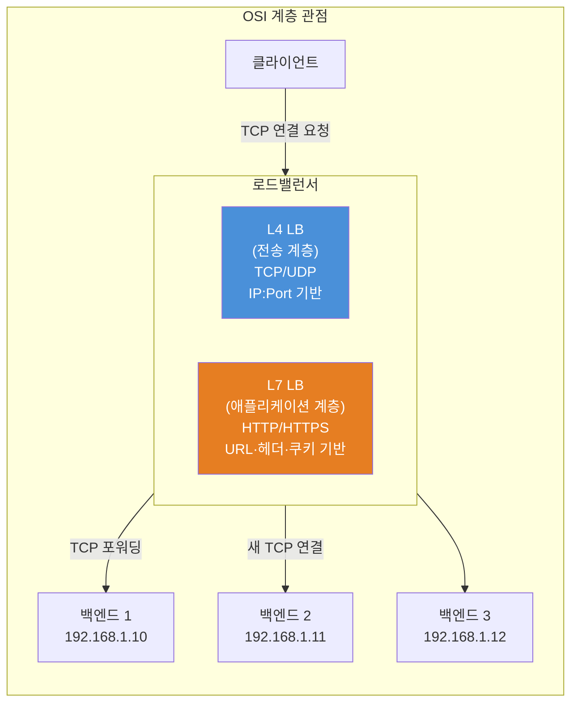
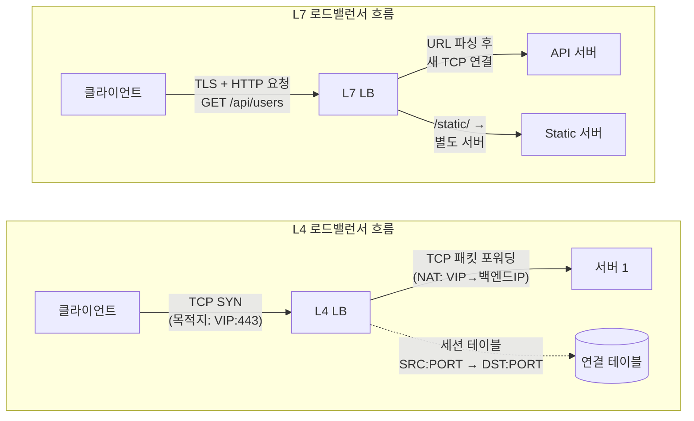
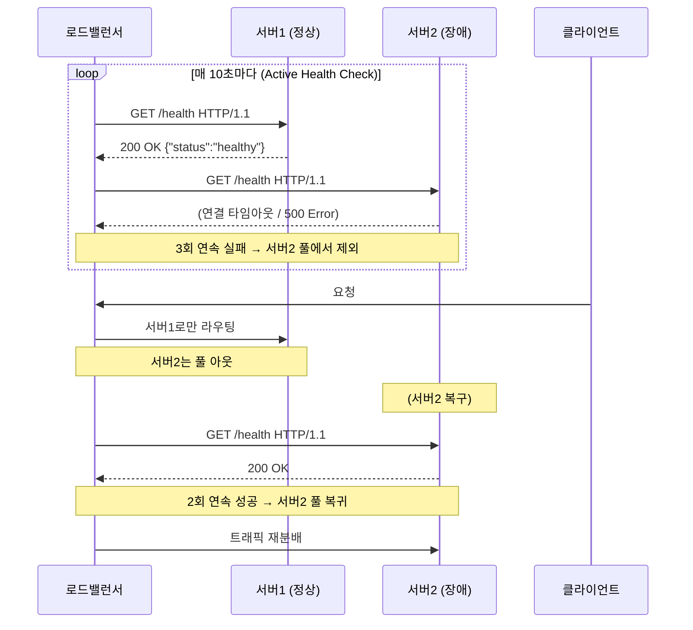

> **시리즈:** CS Study | **카테고리:** Network | **난이도:** ⭐⭐⭐⭐ (중급~시니어)
> **키워드:** `L4 로드밸런서` `L7 로드밸런서` `리버스 프록시` `헬스체크` `세션 유지` `HAProxy` `NGINX`

---

## 들어가며

서버가 하나뿐이던 시절은 끝났다. 트래픽이 폭발적으로 증가하면서 단일 서버는 한계에 부딪혔고, **수평 확장(Horizontal Scaling)** 이 사실상 필수가 됐다. 그런데 서버를 10대로 늘렸다고 끝이 아니다. 10대 서버에 트래픽을 골고루 나눠줄 무언가가 필요하다. 그게 바로 **로드밸런서(Load Balancer)** 다.

동시에, 보안과 성능 최적화를 위해 클라이언트와 서버 사이에 중개자를 두는 패턴도 보편화됐다. **프록시(Proxy)** 가 그 역할을 한다. 특히 **리버스 프록시(Reverse Proxy)** 는 현대 인프라의 핵심 컴포넌트로, 로드밸런싱과 함께 거의 항상 짝을 이룬다.

이 포스트에서는 L4/L7 로드밸런서의 차이, 리버스 프록시의 동작 원리, 헬스체크 메커니즘, 세션 유지 전략까지 — 인프라 엔지니어가 반드시 알아야 할 개념들을 처음부터 끝까지 깊이 파고든다.

---

## 1. 프록시의 기초: 포워드 vs 리버스

### 포워드 프록시 (Forward Proxy)

포워드 프록시는 **클라이언트를 대신**해서 요청을 보낸다. 클라이언트 → 프록시 → 인터넷 구조다.

```
클라이언트 → [포워드 프록시] → 인터넷 → 목적지 서버
```

**주요 용도:**
- 기업 내부망에서 외부 인터넷 접근 제어
- 익명성 확보 (VPN과 유사)
- 캐싱으로 대역폭 절약

### 리버스 프록시 (Reverse Proxy)

리버스 프록시는 **서버를 대신**해서 요청을 받는다. 클라이언트는 리버스 프록시와만 통신하며, 실제 백엔드 서버가 몇 대인지 알지 못한다.

```
클라이언트 → [리버스 프록시] → 백엔드 서버 1
                             → 백엔드 서버 2
                             → 백엔드 서버 3
```

**주요 용도:**
- 로드밸런싱
- SSL 종료 (SSL Termination)
- 캐싱 및 압축
- 보안 (백엔드 서버 IP 은닉, WAF)
- 속도 제한 (Rate Limiting)

> **핵심 차이:** 포워드 프록시는 클라이언트 측 중개자, 리버스 프록시는 서버 측 중개자다.

---

## 2. 로드밸런서: OSI 계층별 동작

로드밸런서는 OSI 모델의 어느 계층에서 동작하느냐에 따라 L4와 L7로 나뉜다. 이 차이가 성능, 유연성, 보안에 직결된다.



### 2-1. L4 로드밸런서 (전송 계층)

L4 로드밸런서는 **IP 주소와 포트 번호**만 보고 라우팅 결정을 내린다. HTTP 본문이 뭔지, URL이 뭔지 전혀 모른다. 그냥 TCP 패킷을 네트워크 레벨에서 전달한다.

**동작 방식:**
1. 클라이언트가 VIP(Virtual IP)로 TCP 연결 요청
2. L4 LB는 연결 테이블을 조회해 백엔드 서버 선택
3. **NAT** 또는 **DSR(Direct Server Return)** 방식으로 패킷 전달

**NAT 방식:**
```
클라이언트 IP: 203.0.113.5:54321
VIP: 10.0.0.1:80

→ L4 LB가 패킷 목적지를 10.0.0.1:80 → 192.168.1.10:8080으로 재기록
→ 응답 패킷은 역방향으로 다시 L4 LB를 거쳐 클라이언트에 전달
```

**DSR (Direct Server Return) 방식:**
```
클라이언트 → L4 LB(로드밸런서) → 백엔드 서버
백엔드 서버 → 클라이언트 (L4 LB를 거치지 않고 직접!)
```
응답이 LB를 우회하므로 대역폭이 절약되지만, 백엔드 서버에 VIP가 루프백으로 설정돼야 한다.

**L4의 특징:**
| 항목 | 내용 |
|------|------|
| 처리 속도 | 매우 빠름 (패킷 레벨 처리) |
| 라우팅 기준 | IP + Port |
| HTTP 인식 | 불가 |
| SSL 종료 | 불가 (패스스루만 가능) |
| 대표 제품 | AWS NLB, LVS, F5 BIG-IP |

**HAProxy L4 설정 예시:**
```haproxy
# haproxy.cfg - TCP 모드 (L4)
frontend tcp_frontend
    bind *:3306
    mode tcp
    default_backend mysql_backends

backend mysql_backends
    mode tcp
    balance roundrobin
    server db1 192.168.1.10:3306 check
    server db2 192.168.1.11:3306 check
    server db3 192.168.1.12:3306 check
```

### 2-2. L7 로드밸런서 (애플리케이션 계층)

L7 로드밸런서는 **HTTP/HTTPS 헤더, URL 경로, 쿠키, 요청 본문**까지 들여다보고 라우팅한다. 클라이언트 연결을 **완전히 종료**하고, 백엔드와 새 연결을 맺는다 (프록시 역할).

**동작 방식:**
1. 클라이언트 → L7 LB: TLS Handshake + HTTP 요청 파싱
2. L7 LB가 URL, 헤더, 쿠키 등을 분석해 라우팅 결정
3. L7 LB → 백엔드: **새로운 TCP 연결** 수립 후 요청 전달

**L7 고급 라우팅 예시 (NGINX):**
```nginx
upstream api_servers {
    server 192.168.1.10:8080;
    server 192.168.1.11:8080;
}

upstream static_servers {
    server 192.168.1.20:80;
    server 192.168.1.21:80;
}

server {
    listen 80;

    # URL 경로 기반 라우팅
    location /api/ {
        proxy_pass http://api_servers;
    }

    location /static/ {
        proxy_pass http://static_servers;
    }

    # 헤더 기반 라우팅 (A/B 테스트)
    location / {
        if ($http_x_version = "v2") {
            proxy_pass http://v2_servers;
        }
        proxy_pass http://v1_servers;
    }
}
```

**L7의 특징:**
| 항목 | 내용 |
|------|------|
| 처리 속도 | L4보다 느림 (HTTP 파싱 오버헤드) |
| 라우팅 기준 | URL, 헤더, 쿠키, 메서드, 본문 |
| HTTP 인식 | 완전 가능 |
| SSL 종료 | 가능 (백엔드는 HTTP로 통신 가능) |
| 대표 제품 | NGINX, HAProxy(HTTP 모드), AWS ALB, Traefik |

**L4 vs L7 한눈에 비교:**



---

## 3. 로드밸런싱 알고리즘

단순히 번갈아 보내는 것 외에도 다양한 분산 전략이 있다.

### Round Robin (라운드 로빈)
서버를 순서대로 돌아가며 요청을 배분. 가장 단순하고 기본값으로 많이 쓰인다.
```nginx
upstream backend {
    server 192.168.1.10;  # 1번째 요청
    server 192.168.1.11;  # 2번째 요청
    server 192.168.1.12;  # 3번째 요청, 이후 반복
}
```

**문제:** 서버 성능이 다를 때 부하가 불균등해진다.

### Weighted Round Robin (가중 라운드 로빈)
서버마다 가중치를 부여해 성능 차이를 반영한다.
```nginx
upstream backend {
    server 192.168.1.10 weight=5;  # 5/8 비율
    server 192.168.1.11 weight=2;  # 2/8 비율
    server 192.168.1.12 weight=1;  # 1/8 비율
}
```

### Least Connections (최소 연결)
현재 활성 연결 수가 가장 적은 서버로 보낸다. 처리 시간이 들쭉날쭉한 서비스에 효과적이다.
```nginx
upstream backend {
    least_conn;
    server 192.168.1.10;
    server 192.168.1.11;
    server 192.168.1.12;
}
```

### IP Hash (IP 해시)
클라이언트 IP를 해싱해 항상 같은 서버로 보낸다. 세션 유지(Sticky Session)의 가장 단순한 구현이다.
```nginx
upstream backend {
    ip_hash;
    server 192.168.1.10;
    server 192.168.1.11;
}
```
**문제:** 서버 추가/제거 시 IP-서버 매핑이 재배치돼 기존 세션이 깨질 수 있다.

### Consistent Hashing (일관 해싱)
서버 추가/제거 시 영향받는 키(세션)를 최소화하는 해싱 방식. 캐시 서버 클러스터(Redis, Memcached)에서 특히 중요하다.

```
일반 해싱: 서버 N개 → 서버 추가 시 거의 모든 키 재배치
일관 해싱: 서버 N개 → 서버 추가 시 전체의 1/N만 재배치
```

---

## 4. 헬스체크 (Health Check)

로드밸런서의 핵심 기능 중 하나. 죽은 서버에 계속 트래픽을 보내는 건 최악이다. 헬스체크로 장애 서버를 자동으로 제외하고, 복구되면 다시 투입한다.



### Active vs Passive 헬스체크

**Active (능동) 헬스체크:**
- LB가 **주기적으로** 백엔드에 직접 헬스체크 요청 전송
- NGINX Plus, HAProxy 기본 지원
- 실제 사용자 요청 없어도 서버 상태 파악 가능

```haproxy
# HAProxy Active Health Check
backend web_servers
    balance roundrobin
    option httpchk GET /health
    http-check expect status 200
    server web1 192.168.1.10:80 check inter 10s fall 3 rise 2
    server web2 192.168.1.11:80 check inter 10s fall 3 rise 2
    # inter: 체크 간격 (10초)
    # fall: N회 실패 시 DOWN 처리
    # rise: N회 성공 시 UP 처리
```

**Passive (수동) 헬스체크:**
- 실제 사용자 요청의 응답을 분석해 서버 상태 판단
- 별도의 헬스체크 엔드포인트 불필요
- 이미 실패한 요청이 사용자에게 전달될 수 있다는 단점

```nginx
# NGINX Passive Health Check (기본 NGINX)
upstream backend {
    server 192.168.1.10 max_fails=3 fail_timeout=30s;
    server 192.168.1.11 max_fails=3 fail_timeout=30s;
    # max_fails: 30초 내 3번 실패하면 30초간 사용 중지
}
```

**NGINX Plus Active Health Check:**
```nginx
upstream backend {
    server 192.168.1.10;
    server 192.168.1.11;
}

server {
    location / {
        proxy_pass http://backend;
        health_check interval=10 fails=3 passes=2 uri=/health;
        # interval: 10초마다 체크
        # fails: 3회 실패 시 OUT
        # passes: 2회 성공 시 복귀
    }
}
```

### 헬스체크 엔드포인트 구현 (Spring Boot)

단순히 HTTP 200을 반환하는 것으로는 부족하다. DB 연결, 캐시 상태까지 확인하는 실질적인 헬스체크가 필요하다.

```java
@RestController
@RequestMapping("/health")
public class HealthController {

    @Autowired
    private DataSource dataSource;

    @Autowired
    private RedisTemplate<String, String> redisTemplate;

    @GetMapping
    public ResponseEntity<Map<String, Object>> health() {
        Map<String, Object> status = new HashMap<>();
        boolean healthy = true;

        // DB 연결 체크
        try (Connection conn = dataSource.getConnection()) {
            conn.isValid(1);
            status.put("database", "UP");
        } catch (Exception e) {
            status.put("database", "DOWN: " + e.getMessage());
            healthy = false;
        }

        // Redis 연결 체크
        try {
            redisTemplate.opsForValue().get("health_ping");
            status.put("redis", "UP");
        } catch (Exception e) {
            status.put("redis", "DOWN: " + e.getMessage());
            healthy = false;
        }

        status.put("status", healthy ? "UP" : "DEGRADED");
        status.put("timestamp", System.currentTimeMillis());

        return ResponseEntity
            .status(healthy ? HttpStatus.OK : HttpStatus.SERVICE_UNAVAILABLE)
            .body(status);
    }
}
```

---

## 5. 세션 유지 (Session Persistence / Sticky Session)

HTTP는 무상태(Stateless) 프로토콜이지만, 많은 애플리케이션은 상태를 유지해야 한다 (로그인, 장바구니 등). 여기서 문제가 생긴다. 로드밸런서가 요청을 여러 서버에 분산하면, 서버 A에 저장된 세션 정보를 서버 B가 모른다.

### 해결책 1: Sticky Session (서버 고정)

같은 클라이언트의 요청을 항상 같은 서버로 보낸다.

**쿠키 기반 Sticky Session (HAProxy):**
```haproxy
backend web_servers
    balance roundrobin
    cookie SERVERID insert indirect nocache
    server web1 192.168.1.10:80 cookie web1 check
    server web2 192.168.1.11:80 cookie web2 check
    # 첫 요청 시 SERVERID=web1 쿠키 발급
    # 이후 요청은 쿠키를 보고 항상 web1으로 라우팅
```

**문제점:**
- 서버 장애 시 해당 서버의 모든 세션 소멸
- 서버 간 부하 불균등 (특정 서버에 몰릴 수 있음)
- 수평 확장이 어려움

### 해결책 2: Shared Session Storage (세션 공유)

세션 데이터를 외부 저장소(Redis)에 두고, 모든 서버가 공유한다.

```
클라이언트 → LB → 서버1 → Redis (세션 읽기/쓰기)
클라이언트 → LB → 서버2 → Redis (같은 세션 데이터 접근)
```

**Spring Session + Redis 설정:**
```java
// build.gradle
dependencies {
    implementation 'org.springframework.session:spring-session-data-redis'
    implementation 'org.springframework.boot:spring-boot-starter-data-redis'
}

// application.yml
spring:
  session:
    store-type: redis
    redis:
      flush-mode: on-save
      namespace: spring:session
  redis:
    host: redis-cluster.internal
    port: 6379
    timeout: 2000ms
    lettuce:
      pool:
        max-active: 8
        max-idle: 8
```

```java
@SpringBootApplication
@EnableRedisHttpSession(maxInactiveIntervalInSeconds = 3600)
public class Application {
    public static void main(String[] args) {
        SpringApplication.run(Application.class, args);
    }
}
```

이제 어느 서버가 요청을 받더라도 Redis에서 동일한 세션 데이터를 읽는다.

### 해결책 3: JWT (무상태 인증)

세션 자체를 없애버린다. 클라이언트가 JWT 토큰을 보유하고, 서버는 토큰만 검증하면 된다. 서버 간 세션 공유 불필요.

```java
// JWT 검증 (서버는 비밀키만 있으면 어디서든 검증 가능)
public Claims validateToken(String token) {
    return Jwts.parserBuilder()
        .setSigningKey(secretKey)
        .build()
        .parseClaimsJws(token)
        .getBody();
}
```

**비교:**
| 방식 | 장점 | 단점 |
|------|------|------|
| Sticky Session | 구현 단순 | 장애 취약, 확장 어려움 |
| Shared Session | 투명한 확장 | Redis 단일 장애점, 네트워크 지연 |
| JWT | 완전 무상태, 확장성 최고 | 토큰 폐기 어려움, 페이로드 크기 |

---

## 6. NGINX 리버스 프록시 실전 설정

실무에서 바로 쓸 수 있는 NGINX 설정이다.

```nginx
# /etc/nginx/nginx.conf

upstream backend_pool {
    least_conn;                    # 최소 연결 알고리즘

    server 192.168.1.10:8080 weight=3 max_fails=3 fail_timeout=30s;
    server 192.168.1.11:8080 weight=2 max_fails=3 fail_timeout=30s;
    server 192.168.1.12:8080 weight=1 max_fails=3 fail_timeout=30s;
    server 192.168.1.13:8080 backup;  # 모든 서버 다운 시에만 사용

    keepalive 32;  # 백엔드와 keepalive 연결 유지 (성능 개선)
}

server {
    listen 443 ssl http2;
    server_name api.example.com;

    # SSL 설정
    ssl_certificate     /etc/ssl/certs/api.crt;
    ssl_certificate_key /etc/ssl/private/api.key;
    ssl_protocols       TLSv1.2 TLSv1.3;
    ssl_ciphers         ECDHE-ECDSA-AES128-GCM-SHA256:ECDHE-RSA-AES128-GCM-SHA256;

    # 리버스 프록시 설정
    location / {
        proxy_pass http://backend_pool;

        # 헤더 설정 (백엔드가 실제 클라이언트 IP를 알 수 있게)
        proxy_set_header Host              $host;
        proxy_set_header X-Real-IP         $remote_addr;
        proxy_set_header X-Forwarded-For   $proxy_add_x_forwarded_for;
        proxy_set_header X-Forwarded-Proto $scheme;

        # 타임아웃 설정
        proxy_connect_timeout 5s;
        proxy_send_timeout    60s;
        proxy_read_timeout    60s;

        # 버퍼링 설정
        proxy_buffering on;
        proxy_buffer_size 4k;
        proxy_buffers 8 4k;

        # keepalive 활성화 (upstream keepalive와 함께)
        proxy_http_version 1.1;
        proxy_set_header Connection "";
    }

    # 헬스체크 엔드포인트 (로그 제외)
    location /health {
        proxy_pass http://backend_pool;
        access_log off;
    }
}

# HTTP → HTTPS 리다이렉트
server {
    listen 80;
    server_name api.example.com;
    return 301 https://$server_name$request_uri;
}
```

---

## 7. 장애 사례와 교훈

### 사례 1: Sticky Session + 서버 재시작

**상황:** 배포 시 서버를 순차적으로 재시작했는데, 재시작 중인 서버에 세션이 묶인 사용자들이 로그아웃되는 현상 발생.

**원인:** HAProxy의 Sticky Session으로 특정 서버에 묶인 세션이, 해당 서버 재시작으로 소멸.

**해결:**
```haproxy
# 서버를 graceful drain으로 전환 (새 연결은 안 받고, 기존 연결 처리 완료 후 종료)
# haproxy.sock을 통해 런타임 API 호출
echo "set server web_servers/web1 state drain" | socat stdio /var/run/haproxy.sock
# 또는 Redis 세션 공유로 전환
```

### 사례 2: L7 LB에서 WebSocket 연결 끊김

**상황:** 채팅 서비스 도입 후 WebSocket 연결이 주기적으로 끊김.

**원인:** L7 LB의 HTTP 타임아웃(기본 60초)이 WebSocket 유휴 연결에도 적용됨.

**해결 (NGINX WebSocket 설정):**
```nginx
location /ws {
    proxy_pass http://websocket_servers;
    proxy_http_version 1.1;
    proxy_set_header Upgrade $http_upgrade;
    proxy_set_header Connection "upgrade";

    # WebSocket용 타임아웃 연장
    proxy_read_timeout  3600s;
    proxy_send_timeout  3600s;
}
```

### 사례 3: 헬스체크 엔드포인트 DB 과부하

**상황:** 헬스체크가 매 10초마다 DB 쿼리를 날리면서 총 30대 서버 × 3 헬스체크 요청 = 90 QPS의 쓸모없는 DB 부하 발생.

**해결:** 헬스체크를 캐싱하거나, DB 실제 쿼리 대신 **DB 커넥션 풀 상태**만 확인:
```java
@GetMapping("/health/live")
public ResponseEntity<String> liveness() {
    // DB 쿼리 없이 앱 자체 살아있음만 확인
    return ResponseEntity.ok("OK");
}

@GetMapping("/health/ready")
public ResponseEntity<Map<String, Object>> readiness() {
    // 실제 DB, 캐시 연결 확인 (쿼리는 최소화)
    // 결과를 30초 캐싱
    return checkReadiness();
}
```

---

## 8. 보안 고려사항 (CISO 관점)

### SSL/TLS 오프로딩
리버스 프록시에서 SSL을 종료하고, 내부 트래픽은 평문 HTTP로 통신하는 패턴이 일반적이다. 하지만 **내부 네트워크도 신뢰할 수 없다**는 제로 트러스트 원칙에서는 End-to-End TLS가 필요하다.

```nginx
# mTLS (상호 TLS) 설정 - 내부 서비스 간 인증
upstream secure_backend {
    server 192.168.1.10:443;
}

location / {
    proxy_pass https://secure_backend;
    proxy_ssl_certificate        /etc/ssl/client.crt;
    proxy_ssl_certificate_key    /etc/ssl/client.key;
    proxy_ssl_trusted_certificate /etc/ssl/ca.crt;
    proxy_ssl_verify on;
}
```

### DDoS 방어 - Rate Limiting
```nginx
# IP당 초당 10 요청 제한
limit_req_zone $binary_remote_addr zone=api_limit:10m rate=10r/s;

location /api/ {
    limit_req zone=api_limit burst=20 nodelay;
    limit_req_status 429;
    proxy_pass http://backend_pool;
}
```

### 헤더 보안 강화
```nginx
# 보안 헤더 추가
add_header X-Frame-Options "SAMEORIGIN";
add_header X-Content-Type-Options "nosniff";
add_header X-XSS-Protection "1; mode=block";
add_header Strict-Transport-Security "max-age=31536000; includeSubDomains" always;
add_header Content-Security-Policy "default-src 'self'";

# 서버 정보 숨기기 (백엔드 서버 기술 스택 노출 방지)
proxy_hide_header X-Powered-By;
proxy_hide_header Server;
server_tokens off;
```

---

## 9. 면접 Q&A

**Q1. [기초] L4와 L7 로드밸런서의 차이는?**
> L4는 OSI 전송 계층에서 동작하며 IP와 포트만으로 라우팅합니다. 패킷 레벨에서 처리하므로 매우 빠르지만 HTTP 내용을 볼 수 없습니다. L7은 애플리케이션 계층에서 동작하며 URL, 헤더, 쿠키까지 분석해 라우팅할 수 있습니다. SSL 종료, A/B 테스트, 마이크로서비스 라우팅 등 고급 기능이 가능하지만 L4보다 처리 비용이 높습니다.

**Q2. [중급] 리버스 프록시를 쓰는 이유는?**
> 크게 세 가지입니다. ① **보안**: 백엔드 서버 IP를 외부에 노출하지 않고, WAF나 Rate Limiting을 한 곳에서 적용할 수 있습니다. ② **성능**: SSL 오프로딩, 캐싱, 압축을 프록시에서 처리해 백엔드 부담을 줄입니다. ③ **유연성**: 블루/그린 배포, A/B 테스트, 마이크로서비스 라우팅 등을 프록시 설정만으로 구현할 수 있습니다.

**Q3. [중급] Sticky Session의 문제점과 대안은?**
> Sticky Session은 서버 장애 시 해당 세션이 모두 소멸되고, 서버 간 부하 불균등이 발생할 수 있습니다. 또한 서버 추가/제거 시 기존 세션이 영향받습니다. 대안으로는 Redis 같은 외부 저장소에 세션을 공유하거나(Spring Session), JWT처럼 서버에 상태를 두지 않는 무상태 인증을 사용합니다.

**Q4. [시니어] Active/Passive 헬스체크의 차이와 각각 언제 사용하나?**
> Active 헬스체크는 LB가 주기적으로 백엔드에 직접 요청을 보내 상태를 확인합니다. 실사용자 트래픽과 무관하게 장애를 빠르게 감지할 수 있지만, NGINX Plus처럼 유료 버전이 필요한 경우도 있습니다. Passive 헬스체크는 실제 요청 응답을 분석해 판단하므로 별도 엔드포인트가 불필요하지만, 이미 실패한 요청이 사용자에게 도달한 뒤 장애를 감지합니다. 중요한 서비스에서는 Active 헬스체크를 기본으로 하고, Passive를 보조 수단으로 조합해 사용합니다.

**Q5. [시니어] DSR(Direct Server Return)이 유용한 상황은?**
> 응답 트래픽이 요청보다 훨씬 큰 서비스(예: 비디오 스트리밍, 대용량 파일 다운로드)에서 유용합니다. 일반적으로 요청은 작지만 응답은 수백 MB에 달하므로, 응답이 LB를 거치지 않으면 LB의 네트워크 대역폭 병목을 제거할 수 있습니다. 다만 설정이 복잡하고(백엔드 서버에 VIP 루프백 설정 필요), L4 전용이라 HTTP 계층 처리가 불가능합니다.

---

## 10. Deep Dive: 커넥션 드레이닝과 무중단 배포

배포 시 단순히 서버를 내리면 처리 중인 요청이 끊긴다. **커넥션 드레이닝(Connection Draining / Graceful Shutdown)** 은 이를 해결하는 핵심 패턴이다.

**흐름:**
1. 배포 시작 → 서버를 LB 풀에서 `drain` 상태로 전환
2. 새 요청은 받지 않고, 기존 진행 중인 요청은 완료까지 처리
3. 모든 기존 요청 완료 → 서버 안전 종료 → 새 버전 배포
4. 새 버전 기동 후 헬스체크 통과 → LB 풀에 재투입

**Kubernetes와의 연계:**
```yaml
# Kubernetes Pod 종료 시 Graceful Shutdown
spec:
  terminationGracePeriodSeconds: 30  # 최대 30초 대기
  containers:
  - name: app
    lifecycle:
      preStop:
        exec:
          command: ["/bin/sh", "-c", "sleep 5"]  
          # LB가 Pod를 풀에서 제거할 시간 확보
```

**SIGTERM 처리 (Spring Boot):**
```java
@Component
public class GracefulShutdownHandler {

    @EventListener(ContextClosedEvent.class)
    public void onShutdown() {
        // 진행 중인 요청 완료 대기
        log.info("Graceful shutdown initiated...");
        // Spring Boot 2.3+: server.shutdown=graceful 설정으로 자동 처리
    }
}
```
```yaml
# application.yml
server:
  shutdown: graceful
spring:
  lifecycle:
    timeout-per-shutdown-phase: 20s
```

---

## 마무리

로드밸런싱과 프록시는 단순한 인프라 컴포넌트가 아니라, **확장성·가용성·보안**을 동시에 제공하는 현대 아키텍처의 근간이다.

핵심 정리:
- **L4**: 빠르고 단순, TCP/UDP 레벨 포워딩, SSL 불가
- **L7**: 유연하고 강력, HTTP 인식, 고급 라우팅, SSL 종료
- **리버스 프록시**: 백엔드 보호 + 트래픽 제어의 중심
- **헬스체크**: Active(주기적 확인) + Passive(트래픽 분석) 조합이 최선
- **세션 유지**: Sticky Session → Redis 공유 → JWT 무상태 순으로 발전

다음 포스트에서는 이 개념들의 클라우드 확장판인 **AWS ELB(NLB/ALB)와 서비스 메시(Service Mesh, Istio/Envoy)** 를 다룰 예정이다.

---

## 레퍼런스

### 📹 추천 영상

- [freeCodeCamp.org — Backend Development and APIs Full Course](https://www.youtube.com/@freecodecamp) — 실무 백엔드 개발 전반을 다루는 무료 풀코스
- [널널한 개발자 TV — TCP/IP 핵심이론](https://www.youtube.com/@with2511) — 네트워크 계층 구조를 30년 경력의 관점에서 심층 해설
- [Computerphile — How Proxies Work](https://www.youtube.com/@Computerphile) — 프록시 동작 원리를 학술적으로 설명

### 📄 공식 문서 & 아티클

- [NGINX HTTP Load Balancing 공식 문서](https://nginx.org/en/docs/http/load_balancing.html) — NGINX 로드밸런싱 알고리즘 및 설정 전반
- [NGINX HTTP Health Checks 공식 문서](https://docs.nginx.com/nginx/admin-guide/load-balancer/http-health-check/) — Active/Passive 헬스체크 상세 설정
- [HAProxy Configuration Manual](https://www.haproxy.org/download/2.8/doc/configuration.txt) — HAProxy 전체 설정 레퍼런스
- [Load Balancing Prototype: L4 vs L7 (Medium, 2025)](https://medium.com/@shindevikram1210/load-balancing-prototype-l4-vs-l7-pass-through-vs-proxy-mode-docker-iptables-haproxy-nginx-9a34dd9afe5e) — Docker 환경에서 L4/L7 실습 가이드
