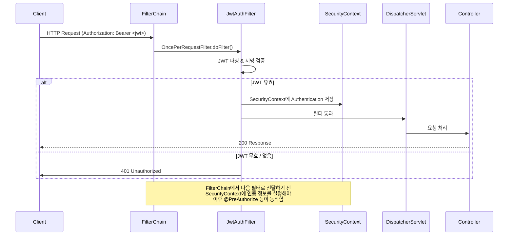
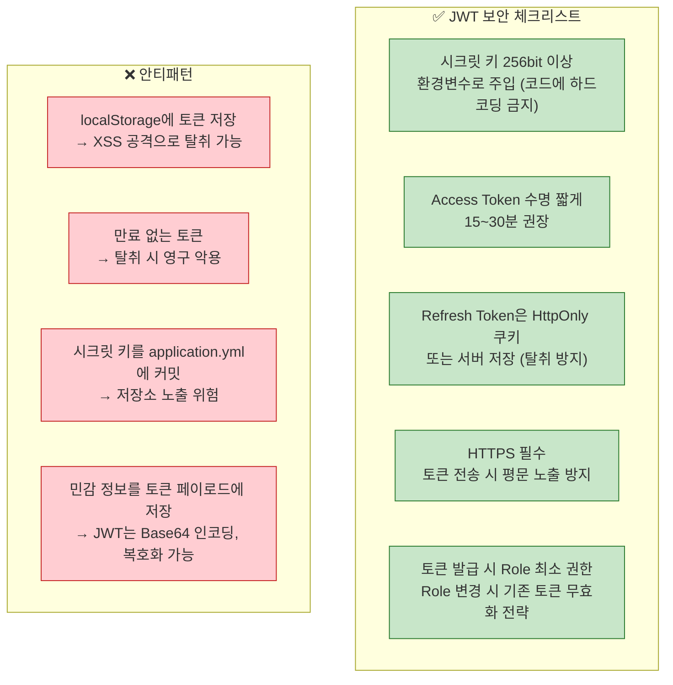

> 인증(Authentication)은 "당신이 누구인지", 인가(Authorization)는 "무엇을 할 수 있는지"를 결정한다. Spring Security 6의 람다 DSL, JWT 무상태 인증, RBAC 역할 기반 접근 제어, CORS — 보안 아키텍처의 전체를 코드로 설명한다.

## 핵심 요약 (TL;DR)

**Spring Security 6** (Spring Boot 3 기본 포함)는 람다 DSL 기반 `SecurityFilterChain`으로 설정을 구성한다. REST API에서는 세션 대신 **JWT(JSON Web Token)** 기반 무상태 인증이 표준으로, `OncePerRequestFilter`를 상속한 커스텀 필터가 모든 요청에서 토큰을 검증한다. **RBAC(Role-Based Access Control)** 로 역할(ADMIN, USER 등)별 엔드포인트 접근을 제어하고, `@PreAuthorize`로 메서드 수준 세밀한 권한 제어가 가능하다. **CORS**는 Spring Security 레벨에서 설정해야 preflight 요청도 올바르게 처리된다.

---

## Spring Security 필터 체인 구조



---

## 환경 설정

### `build.gradle.kts`

```kotlin
dependencies {
    implementation("org.springframework.boot:spring-boot-starter-web")
    implementation("org.springframework.boot:spring-boot-starter-data-jpa")
    implementation("org.springframework.boot:spring-boot-starter-validation")

    // Spring Security
    implementation("org.springframework.boot:spring-boot-starter-security")

    // JWT — JJWT 라이브러리 (0.12.x: Spring Boot 3 / Java 17+ 호환)
    implementation("io.jsonwebtoken:jjwt-api:0.12.6")
    runtimeOnly("io.jsonwebtoken:jjwt-impl:0.12.6")
    runtimeOnly("io.jsonwebtoken:jjwt-jackson:0.12.6")

    compileOnly("org.projectlombok:lombok")
    annotationProcessor("org.projectlombok:lombok")
    runtimeOnly("com.h2database:h2")
    testImplementation("org.springframework.boot:spring-boot-starter-test")
    testImplementation("org.springframework.security:spring-security-test")
}
```

### `application.yml`

```yaml
spring:
  application:
    name: honey-api

# JWT 설정 (운영에서는 환경변수로 주입)
jwt:
  secret: ${JWT_SECRET:honey-barrel-secret-key-must-be-at-least-256-bits-long-for-hs256}
  access-token-expiry: 1800000      # 30분 (ms)
  refresh-token-expiry: 604800000   # 7일 (ms)

logging:
  level:
    org.springframework.security: DEBUG  # 개발 시 Security 디버그 로그
```

---

## 구현 — JWT 기반 인증/인가

### 1. `Role` 열거형 — RBAC 역할 정의

```java
// src/main/java/com/honeybarrel/honeyapi/security/Role.java
package com.honeybarrel.honeyapi.security;

import lombok.Getter;
import lombok.RequiredArgsConstructor;

/**
 * RBAC(Role-Based Access Control) 역할 정의.
 * Spring Security는 역할에 "ROLE_" 접두사를 붙이는 관례가 있음.
 * @Secured("ROLE_ADMIN"), hasRole("ADMIN") — 내부적으로 "ROLE_ADMIN" 비교
 */
@Getter
@RequiredArgsConstructor
public enum Role {
    ADMIN("ROLE_ADMIN"),
    MANAGER("ROLE_MANAGER"),
    USER("ROLE_USER");

    private final String value;
}
```

### 2. `Member` Entity — Security와 통합

```java
// UserDetails를 구현하거나, 별도 UserDetails 클래스로 래핑
@Entity
@Table(name = "members")
@Getter
@NoArgsConstructor(access = AccessLevel.PROTECTED)
public class Member {

    @Id @GeneratedValue(strategy = GenerationType.IDENTITY)
    private Long id;

    @Column(nullable = false, unique = true)
    private String email;

    @Column(nullable = false)
    private String password;  // BCrypt 해시

    @Column(nullable = false)
    private String name;

    @Enumerated(EnumType.STRING)
    @Column(nullable = false)
    private Role role;

    @Builder
    private Member(String email, String password, String name, Role role) {
        this.email = email;
        this.password = password;
        this.name = name;
        this.role = role;
    }
}
```

### 3. `CustomUserDetailsService` — Security 사용자 조회

```java
// src/main/java/com/honeybarrel/honeyapi/security/CustomUserDetailsService.java
package com.honeybarrel.honeyapi.security;

import com.honeybarrel.honeyapi.exception.EntityNotFoundException;
import com.honeybarrel.honeyapi.exception.ErrorCode;
import com.honeybarrel.honeyapi.member.Member;
import com.honeybarrel.honeyapi.member.MemberRepository;
import lombok.RequiredArgsConstructor;
import org.springframework.security.core.authority.SimpleGrantedAuthority;
import org.springframework.security.core.userdetails.User;
import org.springframework.security.core.userdetails.UserDetails;
import org.springframework.security.core.userdetails.UserDetailsService;
import org.springframework.security.core.userdetails.UsernameNotFoundException;
import org.springframework.stereotype.Service;
import org.springframework.transaction.annotation.Transactional;

import java.util.List;

/**
 * Spring Security가 인증 시 사용자 정보를 로드하는 서비스.
 * UserDetailsService 인터페이스를 구현 — DIP(의존성 역전 원칙) 준수.
 */
@Service
@RequiredArgsConstructor
public class CustomUserDetailsService implements UserDetailsService {

    private final MemberRepository memberRepository;

    @Override
    @Transactional(readOnly = true)
    public UserDetails loadUserByUsername(String email) throws UsernameNotFoundException {
        Member member = memberRepository.findByEmail(email)
                .orElseThrow(() -> new UsernameNotFoundException("회원을 찾을 수 없습니다: " + email));

        return User.builder()
                .username(member.getEmail())
                .password(member.getPassword())
                .authorities(List.of(new SimpleGrantedAuthority(member.getRole().getValue())))
                .build();
    }
}
```

### 4. `JwtTokenProvider` — JWT 생성/검증

```java
// src/main/java/com/honeybarrel/honeyapi/security/JwtTokenProvider.java
package com.honeybarrel.honeyapi.security;

import io.jsonwebtoken.*;
import io.jsonwebtoken.security.Keys;
import lombok.extern.slf4j.Slf4j;
import org.springframework.beans.factory.annotation.Value;
import org.springframework.security.authentication.UsernamePasswordAuthenticationToken;
import org.springframework.security.core.Authentication;
import org.springframework.security.core.authority.SimpleGrantedAuthority;
import org.springframework.stereotype.Component;

import javax.crypto.SecretKey;
import java.nio.charset.StandardCharsets;
import java.util.Date;
import java.util.List;

/**
 * JWT 토큰 생성, 검증, 파싱 담당.
 *
 * 사용 라이브러리: JJWT 0.12.x (Jakarta 기반, Spring Boot 3 호환)
 * 알고리즘: HMAC-SHA256 (HS256)
 */
@Slf4j
@Component
public class JwtTokenProvider {

    private final SecretKey secretKey;
    private final long accessTokenExpiry;
    private final long refreshTokenExpiry;

    public JwtTokenProvider(
            @Value("${jwt.secret}") String secret,
            @Value("${jwt.access-token-expiry}") long accessTokenExpiry,
            @Value("${jwt.refresh-token-expiry}") long refreshTokenExpiry) {

        // 시크릿 키 생성 (256bit 이상 필수 for HS256)
        this.secretKey = Keys.hmacShaKeyFor(secret.getBytes(StandardCharsets.UTF_8));
        this.accessTokenExpiry = accessTokenExpiry;
        this.refreshTokenExpiry = refreshTokenExpiry;
    }

    /** Access Token 생성 */
    public String generateAccessToken(String email, String role) {
        return buildToken(email, role, accessTokenExpiry);
    }

    /** Refresh Token 생성 (role 정보 없음 — 재발급 용도만) */
    public String generateRefreshToken(String email) {
        return buildToken(email, null, refreshTokenExpiry);
    }

    private String buildToken(String email, String role, long expiry) {
        var builder = Jwts.builder()
                .subject(email)
                .issuedAt(new Date())
                .expiration(new Date(System.currentTimeMillis() + expiry))
                .signWith(secretKey);

        if (role != null) {
            builder.claim("role", role);
        }

        return builder.compact();
    }

    /** JWT → Authentication 객체 변환 */
    public Authentication getAuthentication(String token) {
        Claims claims = parseClaims(token);
        String email = claims.getSubject();
        String role = claims.get("role", String.class);

        List<SimpleGrantedAuthority> authorities = role != null
                ? List.of(new SimpleGrantedAuthority(role))
                : List.of();

        // principal에 email, credentials에 빈 문자열 (토큰 자체가 credentials)
        return new UsernamePasswordAuthenticationToken(email, "", authorities);
    }

    /** 이메일 추출 */
    public String getEmail(String token) {
        return parseClaims(token).getSubject();
    }

    /** 토큰 유효성 검증 */
    public boolean validateToken(String token) {
        try {
            parseClaims(token);
            return true;
        } catch (ExpiredJwtException e) {
            log.warn("JWT 토큰 만료: {}", e.getMessage());
        } catch (MalformedJwtException e) {
            log.warn("잘못된 JWT 형식: {}", e.getMessage());
        } catch (SecurityException e) {
            log.warn("JWT 서명 검증 실패: {}", e.getMessage());
        } catch (JwtException e) {
            log.warn("JWT 처리 오류: {}", e.getMessage());
        }
        return false;
    }

    /** Claims 파싱 (내부용) */
    private Claims parseClaims(String token) {
        return Jwts.parser()
                .verifyWith(secretKey)
                .build()
                .parseSignedClaims(token)
                .getPayload();
    }
}
```

### 5. `JwtAuthenticationFilter` — 요청 인터셉터

```java
// src/main/java/com/honeybarrel/honeyapi/security/JwtAuthenticationFilter.java
package com.honeybarrel.honeyapi.security;

import jakarta.servlet.FilterChain;
import jakarta.servlet.ServletException;
import jakarta.servlet.http.HttpServletRequest;
import jakarta.servlet.http.HttpServletResponse;
import lombok.RequiredArgsConstructor;
import lombok.extern.slf4j.Slf4j;
import org.springframework.security.core.Authentication;
import org.springframework.security.core.context.SecurityContextHolder;
import org.springframework.util.StringUtils;
import org.springframework.web.filter.OncePerRequestFilter;

import java.io.IOException;

/**
 * JWT 인증 필터.
 *
 * OncePerRequestFilter를 상속 — 요청당 정확히 1번 실행 보장.
 * (포워드 등으로 같은 필터가 중복 실행되는 것을 방지)
 */
@Slf4j
@RequiredArgsConstructor
public class JwtAuthenticationFilter extends OncePerRequestFilter {

    private static final String AUTHORIZATION_HEADER = "Authorization";
    private static final String BEARER_PREFIX = "Bearer ";

    private final JwtTokenProvider jwtTokenProvider;

    @Override
    protected void doFilterInternal(
            HttpServletRequest request,
            HttpServletResponse response,
            FilterChain filterChain) throws ServletException, IOException {

        String token = extractToken(request);

        if (StringUtils.hasText(token) && jwtTokenProvider.validateToken(token)) {
            // 유효한 토큰 → SecurityContext에 Authentication 등록
            Authentication authentication = jwtTokenProvider.getAuthentication(token);
            SecurityContextHolder.getContext().setAuthentication(authentication);
            log.debug("Security context: email={}, uri={}",
                    jwtTokenProvider.getEmail(token), request.getRequestURI());
        }

        // 인증 실패해도 필터 체인 계속 진행 (인가는 SecurityFilterChain에서 처리)
        filterChain.doFilter(request, response);
    }

    /** Authorization 헤더에서 Bearer 토큰 추출 */
    private String extractToken(HttpServletRequest request) {
        String bearerToken = request.getHeader(AUTHORIZATION_HEADER);
        if (StringUtils.hasText(bearerToken) && bearerToken.startsWith(BEARER_PREFIX)) {
            return bearerToken.substring(BEARER_PREFIX.length());
        }
        return null;
    }
}
```

### 6. `SecurityConfig` — 핵심 보안 설정

```java
// src/main/java/com/honeybarrel/honeyapi/config/SecurityConfig.java
package com.honeybarrel.honeyapi.config;

import com.honeybarrel.honeyapi.security.JwtAuthenticationFilter;
import com.honeybarrel.honeyapi.security.JwtTokenProvider;
import lombok.RequiredArgsConstructor;
import org.springframework.context.annotation.Bean;
import org.springframework.context.annotation.Configuration;
import org.springframework.http.HttpMethod;
import org.springframework.security.authentication.AuthenticationManager;
import org.springframework.security.authentication.AuthenticationProvider;
import org.springframework.security.authentication.dao.DaoAuthenticationProvider;
import org.springframework.security.config.annotation.authentication.configuration.AuthenticationConfiguration;
import org.springframework.security.config.annotation.method.configuration.EnableMethodSecurity;
import org.springframework.security.config.annotation.web.builders.HttpSecurity;
import org.springframework.security.config.annotation.web.configuration.EnableWebSecurity;
import org.springframework.security.config.annotation.web.configurers.AbstractHttpConfigurer;
import org.springframework.security.config.http.SessionCreationPolicy;
import org.springframework.security.crypto.bcrypt.BCryptPasswordEncoder;
import org.springframework.security.crypto.password.PasswordEncoder;
import org.springframework.security.web.SecurityFilterChain;
import org.springframework.security.web.authentication.UsernamePasswordAuthenticationFilter;
import org.springframework.web.cors.CorsConfiguration;
import org.springframework.web.cors.CorsConfigurationSource;
import org.springframework.web.cors.UrlBasedCorsConfigurationSource;

import java.util.List;

/**
 * Spring Security 6 (Lambda DSL) 설정.
 *
 * Spring Boot 3에서 WebSecurityConfigurerAdapter 삭제됨 →
 * SecurityFilterChain @Bean 방식으로 전환.
 *
 * @EnableMethodSecurity(prePostEnabled = true) — @PreAuthorize 활성화
 */
@Configuration
@EnableWebSecurity
@EnableMethodSecurity(prePostEnabled = true)  // @PreAuthorize 활성화
@RequiredArgsConstructor
public class SecurityConfig {

    private final CustomUserDetailsService userDetailsService;
    private final JwtTokenProvider jwtTokenProvider;

    // ── SecurityFilterChain (핵심) ────────────────────────────
    @Bean
    public SecurityFilterChain securityFilterChain(HttpSecurity http) throws Exception {
        http
            // CSRF: REST API는 세션 없음 → CSRF 불필요
            .csrf(AbstractHttpConfigurer::disable)

            // CORS 설정 적용
            .cors(cors -> cors.configurationSource(corsConfigurationSource()))

            // 세션 무상태 — JWT 사용 시 세션 생성/사용 안 함
            .sessionManagement(session ->
                    session.sessionCreationPolicy(SessionCreationPolicy.STATELESS))

            // 인증/인가 규칙 정의
            .authorizeHttpRequests(auth -> auth
                // 공개 엔드포인트 (인증 불필요)
                .requestMatchers("/api/v1/auth/**").permitAll()
                .requestMatchers("/api/v1/health").permitAll()
                .requestMatchers("/h2-console/**").permitAll()  // 개발 전용

                // 상품 조회는 공개
                .requestMatchers(HttpMethod.GET, "/api/v1/products/**").permitAll()

                // ADMIN만 접근 가능한 관리자 API
                .requestMatchers("/api/v1/admin/**").hasRole("ADMIN")

                // ADMIN 또는 MANAGER
                .requestMatchers("/api/v1/manage/**").hasAnyRole("ADMIN", "MANAGER")

                // 나머지는 인증 필요
                .anyRequest().authenticated()
            )

            // JWT 필터를 UsernamePasswordAuthenticationFilter 앞에 삽입
            .addFilterBefore(jwtAuthenticationFilter(),
                    UsernamePasswordAuthenticationFilter.class)

            // H2 Console 사용 시 필요 (프레임 허용)
            .headers(headers -> headers.frameOptions(frame -> frame.sameOrigin()))

            // 401 응답 커스터마이징
            .exceptionHandling(ex -> ex
                .authenticationEntryPoint((request, response, authException) -> {
                    response.setContentType("application/json;charset=UTF-8");
                    response.setStatus(401);
                    response.getWriter().write(
                        "{\"code\":\"COMMON_003\",\"message\":\"인증이 필요합니다\"}"
                    );
                })
                // 403 응답 커스터마이징
                .accessDeniedHandler((request, response, accessDeniedException) -> {
                    response.setContentType("application/json;charset=UTF-8");
                    response.setStatus(403);
                    response.getWriter().write(
                        "{\"code\":\"COMMON_004\",\"message\":\"접근 권한이 없습니다\"}"
                    );
                })
            );

        return http.build();
    }

    // ── CORS 설정 ─────────────────────────────────────────────
    @Bean
    public CorsConfigurationSource corsConfigurationSource() {
        CorsConfiguration config = new CorsConfiguration();

        // 허용할 Origin (운영에서는 실제 도메인으로 제한)
        config.setAllowedOriginPatterns(List.of(
            "http://localhost:3000",    // 로컬 프론트엔드
            "http://localhost:5173",    // Vite 개발 서버
            "https://honeybarrel.co.kr" // 운영 도메인
        ));

        // 허용할 HTTP 메서드
        config.setAllowedMethods(List.of("GET", "POST", "PUT", "PATCH", "DELETE", "OPTIONS"));

        // 허용할 헤더
        config.setAllowedHeaders(List.of("*"));

        // 쿠키/인증 정보 전송 허용
        config.setAllowCredentials(true);

        // Preflight 결과 캐시 시간 (초)
        config.setMaxAge(3600L);

        UrlBasedCorsConfigurationSource source = new UrlBasedCorsConfigurationSource();
        source.registerCorsConfiguration("/**", config);
        return source;
    }

    // ── Bean 등록 ─────────────────────────────────────────────
    @Bean
    public JwtAuthenticationFilter jwtAuthenticationFilter() {
        return new JwtAuthenticationFilter(jwtTokenProvider);
    }

    @Bean
    public PasswordEncoder passwordEncoder() {
        return new BCryptPasswordEncoder();  // 강도 기본 10
    }

    @Bean
    public AuthenticationProvider authenticationProvider() {
        DaoAuthenticationProvider provider = new DaoAuthenticationProvider();
        provider.setUserDetailsService(userDetailsService);
        provider.setPasswordEncoder(passwordEncoder());
        return provider;
    }

    @Bean
    public AuthenticationManager authenticationManager(
            AuthenticationConfiguration config) throws Exception {
        return config.getAuthenticationManager();
    }
}
```

### 7. `AuthController` — 로그인/회원가입 API

```java
// src/main/java/com/honeybarrel/honeyapi/auth/AuthController.java
package com.honeybarrel.honeyapi.auth;

import com.honeybarrel.honeyapi.dto.ApiResponse;
import jakarta.validation.Valid;
import lombok.RequiredArgsConstructor;
import org.springframework.http.ResponseEntity;
import org.springframework.web.bind.annotation.*;

@RestController
@RequestMapping("/api/v1/auth")
@RequiredArgsConstructor
public class AuthController {

    private final AuthService authService;

    @PostMapping("/signup")
    public ResponseEntity<ApiResponse<AuthDto.SignupResponse>> signup(
            @Valid @RequestBody AuthDto.SignupRequest request) {
        return ResponseEntity.ok(
                ApiResponse.ok("회원 가입 완료", authService.signup(request)));
    }

    @PostMapping("/login")
    public ResponseEntity<ApiResponse<AuthDto.TokenResponse>> login(
            @Valid @RequestBody AuthDto.LoginRequest request) {
        return ResponseEntity.ok(
                ApiResponse.ok("로그인 성공", authService.login(request)));
    }

    @PostMapping("/refresh")
    public ResponseEntity<ApiResponse<AuthDto.TokenResponse>> refresh(
            @RequestHeader("X-Refresh-Token") String refreshToken) {
        return ResponseEntity.ok(
                ApiResponse.ok(authService.refreshToken(refreshToken)));
    }
}
```

```java
// AuthDto.java
public class AuthDto {

    public record SignupRequest(
        @NotBlank @Email String email,
        @NotBlank @Size(min = 8) String password,
        @NotBlank String name
    ) {}

    public record LoginRequest(
        @NotBlank @Email String email,
        @NotBlank String password
    ) {}

    public record SignupResponse(Long id, String email, String name, String role) {}

    public record TokenResponse(
        String accessToken,
        String refreshToken,
        long expiresIn  // 초 단위
    ) {}
}
```

```java
// AuthService.java
@Slf4j
@Service
@RequiredArgsConstructor
@Transactional(readOnly = true)
public class AuthService {

    private final MemberRepository memberRepository;
    private final PasswordEncoder passwordEncoder;
    private final JwtTokenProvider jwtTokenProvider;
    private final AuthenticationManager authenticationManager;

    @Transactional
    public AuthDto.SignupResponse signup(AuthDto.SignupRequest request) {
        if (memberRepository.existsByEmail(request.email())) {
            throw new DuplicateException(ErrorCode.MEMBER_EMAIL_DUPLICATE);
        }

        Member member = Member.builder()
                .email(request.email())
                .password(passwordEncoder.encode(request.password()))
                .name(request.name())
                .role(Role.USER)  // 기본 역할
                .build();

        Member saved = memberRepository.save(member);
        return new AuthDto.SignupResponse(saved.getId(), saved.getEmail(),
                                          saved.getName(), saved.getRole().name());
    }

    @Transactional
    public AuthDto.TokenResponse login(AuthDto.LoginRequest request) {
        // AuthenticationManager를 통해 이메일/비밀번호 검증
        // 내부적으로 CustomUserDetailsService.loadUserByUsername() 호출
        var authentication = authenticationManager.authenticate(
                new UsernamePasswordAuthenticationToken(request.email(), request.password())
        );

        String email = authentication.getName();
        String role = authentication.getAuthorities().iterator().next().getAuthority();

        String accessToken = jwtTokenProvider.generateAccessToken(email, role);
        String refreshToken = jwtTokenProvider.generateRefreshToken(email);

        log.info("로그인 성공: email={}", email);

        return new AuthDto.TokenResponse(accessToken, refreshToken, 1800L);
    }

    public AuthDto.TokenResponse refreshToken(String refreshToken) {
        if (!jwtTokenProvider.validateToken(refreshToken)) {
            throw new BusinessException(ErrorCode.UNAUTHORIZED, "유효하지 않은 리프레시 토큰입니다");
        }

        String email = jwtTokenProvider.getEmail(refreshToken);
        Member member = memberRepository.findByEmail(email)
                .orElseThrow(() -> new EntityNotFoundException(ErrorCode.MEMBER_NOT_FOUND));

        String newAccessToken = jwtTokenProvider.generateAccessToken(
                email, member.getRole().getValue());

        return new AuthDto.TokenResponse(newAccessToken, refreshToken, 1800L);
    }
}
```

### 8. `@PreAuthorize` — 메서드 수준 권한 제어

```java
// 메서드 수준 세밀한 권한 제어 예시
@RestController
@RequestMapping("/api/v1")
@RequiredArgsConstructor
public class AdminController {

    private final MemberService memberService;

    // ADMIN만 모든 회원 조회 가능
    @GetMapping("/admin/members")
    @PreAuthorize("hasRole('ADMIN')")
    public ResponseEntity<ApiResponse<Page<MemberDto.Response>>> getAllMembers(Pageable pageable) {
        return ResponseEntity.ok(ApiResponse.ok(memberService.getAllMembers(pageable)));
    }

    // ADMIN 또는 본인만 조회 가능
    @GetMapping("/members/{id}")
    @PreAuthorize("hasRole('ADMIN') or #id == authentication.name")
    public ResponseEntity<ApiResponse<MemberDto.Response>> getMember(@PathVariable Long id) {
        return ResponseEntity.ok(ApiResponse.ok(memberService.getMember(id)));
    }

    // 인증된 사용자라면 본인 정보 조회
    @GetMapping("/me")
    public ResponseEntity<ApiResponse<MemberDto.Response>> getMyInfo(
            Authentication authentication) {
        // authentication.getName() = JWT의 subject (email)
        String email = authentication.getName();
        return ResponseEntity.ok(ApiResponse.ok(memberService.getMemberByEmail(email)));
    }

    // Service 메서드 수준 권한 제어 예시
    // Controller 없이 Service에서 직접 적용
}

// Service에서의 메서드 보안
@Service
public class ProductService {

    @PreAuthorize("hasRole('ADMIN')")
    @Transactional
    public void deleteProduct(Long id) {
        // ADMIN만 삭제 가능 — Controller 아닌 Service에서 강제
        productRepository.deleteById(id);
    }

    @PreAuthorize("isAuthenticated()")
    public ProductDto.Response createProduct(ProductDto.CreateRequest request) {
        // 로그인한 사람은 누구나 등록 가능
        return ProductDto.Response.from(productRepository.save(request.toEntity()));
    }
}
```

---

## 실행 및 테스트

```bash
./gradlew bootRun

# ── 1. 회원 가입
curl -s -X POST http://localhost:8081/api/v1/auth/signup \
  -H "Content-Type: application/json" \
  -d '{"email":"king@honeybarrel.co.kr","password":"Honey@1234","name":"꿀벌왕"}'

# ── 2. 로그인 → JWT 발급
curl -s -X POST http://localhost:8081/api/v1/auth/login \
  -H "Content-Type: application/json" \
  -d '{"email":"king@honeybarrel.co.kr","password":"Honey@1234"}' | python3 -m json.tool
```

```json
{
  "success": true,
  "data": {
    "accessToken": "eyJhbGciOiJIUzI1NiJ9.eyJzdWIiOiJraW5n...",
    "refreshToken": "eyJhbGciOiJIUzI1NiJ9.eyJzdWIiOiJraW5n...",
    "expiresIn": 1800
  }
}
```

```bash
# ── 3. 인증이 필요한 API 호출 (토큰 포함)
TOKEN="eyJhbGciOiJIUzI1NiJ9..."

curl -s http://localhost:8081/api/v1/me \
  -H "Authorization: Bearer $TOKEN"
# { "data": { "id": 1, "email": "king@honeybarrel.co.kr", "name": "꿀벌왕" } }

# ── 4. 토큰 없이 인증 필요 API → 401
curl -s http://localhost:8081/api/v1/me
# { "code": "COMMON_003", "message": "인증이 필요합니다" }

# ── 5. USER 권한으로 ADMIN API → 403
curl -s http://localhost:8081/api/v1/admin/members \
  -H "Authorization: Bearer $TOKEN"
# { "code": "COMMON_004", "message": "접근 권한이 없습니다" }

# ── 6. 토큰 갱신
curl -s -X POST http://localhost:8081/api/v1/auth/refresh \
  -H "X-Refresh-Token: $REFRESH_TOKEN"
# { "data": { "accessToken": "새 토큰..." } }
```

---

## JWT 보안 주의사항



---

## 설계 포인트 — 보안 황금 규칙

| 항목 | 권장 | 이유 |
|------|------|------|
| **비밀번호 해싱** | BCrypt (강도 10 이상) | Rainbow table 공격 방어 |
| **시크릿 키** | 환경변수 주입 (`${JWT_SECRET}`) | 코드 저장소 노출 방지 |
| **Access Token 수명** | 15~30분 | 탈취 시 피해 최소화 |
| **Refresh Token 저장** | HttpOnly 쿠키 또는 DB | XSS 공격 방어 |
| **HTTPS** | 필수 | 토큰 전송 평문 노출 방지 |
| **CORS allowedOrigins** | 명시적 도메인 목록 | `*` 허용은 CSRF 위험 |
| **`@PreAuthorize`** | Service 계층에도 적용 | Controller 우회 방어 |
| **에러 메시지** | 401과 403 구분 | 클라이언트가 재인증인지 권한 요청인지 파악 |

---

## 시리즈 안내

| Part | 주제 | 링크 |
|------|------|------|
| Part 1 | Spring Boot 시작하기 | [보러가기](/2026/03/17/spring-boot-시작하기-설치부터-첫-rest-api까지/) |
| Part 2 | 의존성 주입과 IoC | [보러가기](/2026/03/18/spring-boot-의존성-주입과-ioc-컨테이너-원리부터-실전까지/) |
| Part 3 | 레이어드 아키텍처 | [보러가기](/2026/03/19/spring-boot-레이어드-아키텍처-controllerservicerepository-완전-해부/) |
| Part 4 | Spring Data JPA | [보러가기](/2026/03/20/spring-data-jpa-orm-관계-매핑-n1-문제-querydsl-완전-정복/) |
| Part 5 | 예외 처리와 검증 | [보러가기](/2026/03/21/spring-boot-예외-처리와-검증-커스텀-예외부터-rfc-7807까지/) |
| **Part 6** | **Spring Security** | 현재 글 |
| Part 7 | 테스트 전략 | [보러가기](/2026/03/25/spring-boot-테스트-전략-springboottest부터-testcontainers까지/) |
| Part 8 | 배포와 운영 | [보러가기](/2026/03/26/spring-boot-배포와-운영/) |

---

## 레퍼런스

### 공식 문서
- [Spring Security Reference — Architecture](https://docs.spring.io/spring-security/reference/servlet/architecture.html) — 필터 체인 아키텍처 공식 가이드
- [Spring Security CORS Reference](https://docs.spring.io/spring-security/reference/reactive/integrations/cors.html) — CORS 공식 설정 문서
- [Spring Security Method Security (@PreAuthorize)](https://docs.spring.io/spring-security/reference/servlet/authorization/method-security.html) — 메서드 수준 보안

### 기술 블로그
- [Spring Boot 3 + Spring Security 6 With JWT — DevOps.dev](https://blog.devops.dev/spring-boot-3-spring-security-6-with-jwt-authentication-and-authorization-new-2024-989323f29b84) — Spring Security 6 JWT 구현 가이드
- [Spring Security Filters: Best Practices — Medium](https://medium.com/@persolenom/spring-security-the-right-way-to-use-filters-93616f863872) — OncePerRequestFilter 올바른 사용법 (2025)

---

*이 포스트는 [HoneyByte](https://blog.honeybarrel.co.kr) Spring Boot Deep Dive 시리즈의 일부입니다.*
