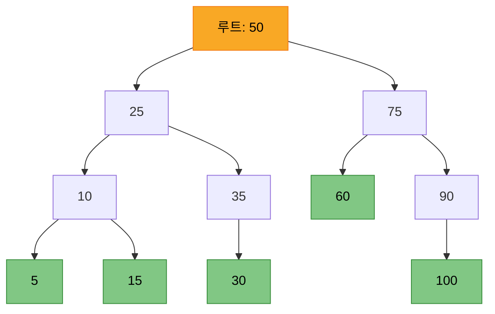
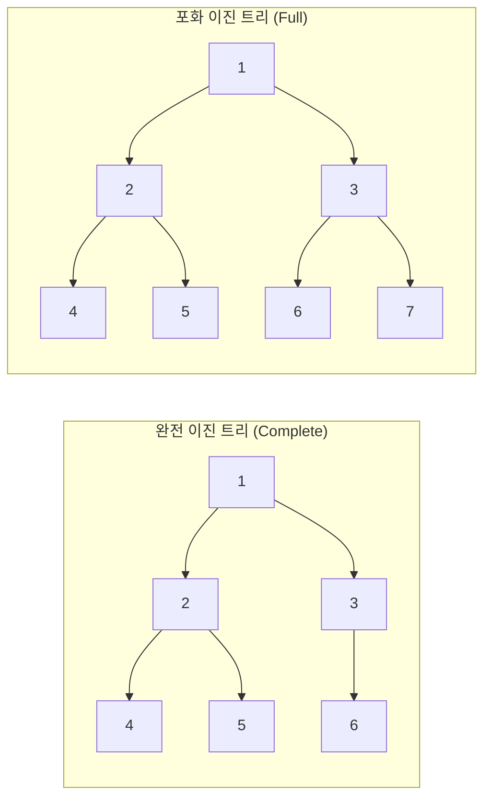
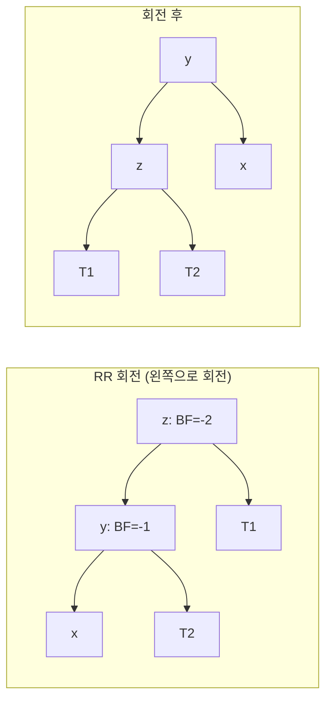
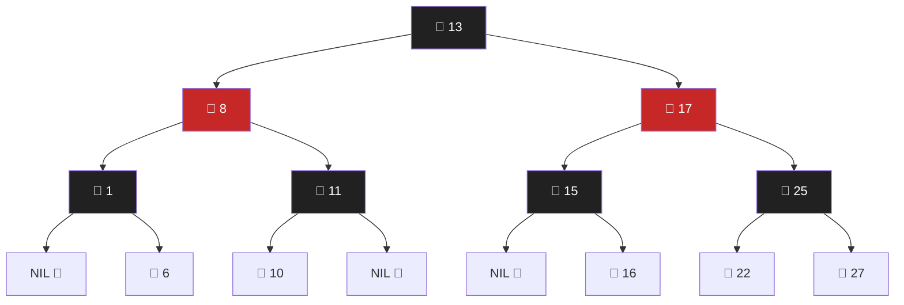
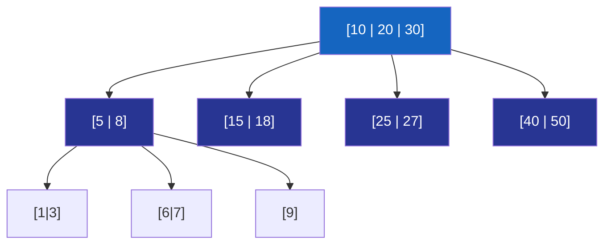
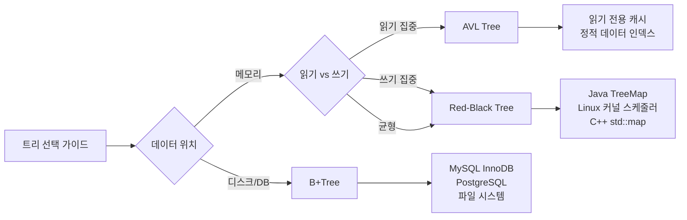

> **HoneyByte 시리즈** | 매주 수요일 — 자료구조 & 알고리즘  
> 난이도: ⭐⭐⭐⭐ | 타겟: 현업 개발자, CS 학생, 기술 면접 준비자

---

## 들어가며

자료구조 면접의 단골 손님, **트리(Tree)**. 배열과 연결 리스트가 선형적(linear)이라면, 트리는 계층적(hierarchical) 구조를 표현한다. 파일 시스템의 디렉토리 구조, 데이터베이스 인덱스(B-Tree), DOM 구조, 조직도… 우리가 매일 다루는 시스템 속에 트리는 이미 깊이 뿌리내리고 있다.

이번 포스트에서는 기본 트리 개념부터 이진 탐색 트리(BST), 그리고 BST의 치명적 약점을 극복한 **균형 트리(Balanced Tree)** — AVL, 레드-블랙, B-Tree까지 한 번에 깊게 파고든다.

---

## 1. 트리(Tree) 기본 개념

### 1.1 트리란 무엇인가

트리는 **사이클이 없는 계층적 그래프(Directed Acyclic Graph)**다. 아래 속성으로 정의된다:

- **루트(Root)**: 트리의 시작 노드 (부모가 없는 유일한 노드)
- **부모(Parent) / 자식(Child)**: 노드 간의 계층 관계
- **리프(Leaf)**: 자식이 없는 노드
- **높이(Height)**: 루트에서 가장 깊은 리프까지의 간선 수
- **깊이(Depth)**: 루트에서 특정 노드까지의 간선 수
- **서브트리(Subtree)**: 어떤 노드를 루트로 보는 부분 트리



### 1.2 트리 용어 정리

| 용어 | 설명 | 예시 (위 그림 기준) |
|------|------|---------------------|
| 루트 | 최상위 노드 | 50 |
| 리프 | 자식 없는 노드 | 5, 15, 30, 60, 100 |
| 높이 | 트리 전체 최대 깊이 | 3 |
| 차수(Degree) | 노드의 자식 수 | 50의 차수 = 2 |
| 레벨 | 루트를 0으로 했을 때 깊이 | 25, 75 → 레벨 1 |

---

## 2. 이진 트리 (Binary Tree)

모든 노드가 **최대 2개의 자식**을 가지는 트리.

### 2.1 이진 트리의 종류



- **완전 이진 트리(Complete BT)**: 마지막 레벨을 제외하고 모두 채워져 있으며, 마지막 레벨은 왼쪽부터 채워짐. **힙(Heap) 구현의 기반**
- **포화 이진 트리(Perfect BT)**: 모든 내부 노드가 두 자식을 가지고, 모든 리프가 같은 레벨
- **전 이진 트리(Full BT)**: 모든 노드가 0개 또는 2개의 자식을 가짐

### 2.2 트리 순회 (Tree Traversal)

트리의 모든 노드를 방문하는 방법. 순서에 따라 4가지로 구분된다.

```
      4
     / \
    2   6
   / \ / \
  1  3 5  7
```

| 순회 방식 | 방문 순서 | 결과 | 활용 |
|-----------|-----------|------|------|
| **전위(Pre-order)** | 루트 → 왼쪽 → 오른쪽 | 4, 2, 1, 3, 6, 5, 7 | 트리 복사, 직렬화 |
| **중위(In-order)** | 왼쪽 → 루트 → 오른쪽 | 1, 2, 3, 4, 5, 6, 7 | **BST에서 정렬된 순서 출력** |
| **후위(Post-order)** | 왼쪽 → 오른쪽 → 루트 | 1, 3, 2, 5, 7, 6, 4 | 트리 삭제, 수식 계산 |
| **레벨 순서(BFS)** | 레벨별 왼→오른쪽 | 4, 2, 6, 1, 3, 5, 7 | 최단 경로, 너비 우선 |

#### Python 구현

```python
from collections import deque

class TreeNode:
    def __init__(self, val=0, left=None, right=None):
        self.val = val
        self.left = left
        self.right = right

class BinaryTreeTraversal:
    def preorder(self, root: TreeNode) -> list[int]:
        """전위 순회: 루트 → 왼쪽 → 오른쪽"""
        if not root:
            return []
        return [root.val] + self.preorder(root.left) + self.preorder(root.right)

    def inorder(self, root: TreeNode) -> list[int]:
        """중위 순회: 왼쪽 → 루트 → 오른쪽"""
        if not root:
            return []
        return self.inorder(root.left) + [root.val] + self.inorder(root.right)

    def postorder(self, root: TreeNode) -> list[int]:
        """후위 순회: 왼쪽 → 오른쪽 → 루트"""
        if not root:
            return []
        return self.postorder(root.left) + self.postorder(root.right) + [root.val]

    def level_order(self, root: TreeNode) -> list[list[int]]:
        """레벨 순서 순회 (BFS)"""
        if not root:
            return []
        result, queue = [], deque([root])
        while queue:
            level_size = len(queue)
            current_level = []
            for _ in range(level_size):
                node = queue.popleft()
                current_level.append(node.val)
                if node.left:
                    queue.append(node.left)
                if node.right:
                    queue.append(node.right)
            result.append(current_level)
        return result

    def inorder_iterative(self, root: TreeNode) -> list[int]:
        """반복적 중위 순회 (스택 활용) — 재귀 스택 오버플로우 방지"""
        result, stack = [], []
        current = root
        while current or stack:
            while current:
                stack.append(current)
                current = current.left
            current = stack.pop()
            result.append(current.val)
            current = current.right
        return result
```

#### Java 구현

```java
import java.util.*;

public class BinaryTreeTraversal {
    static class TreeNode {
        int val;
        TreeNode left, right;
        TreeNode(int val) { this.val = val; }
    }

    // 중위 순회 (재귀)
    public List<Integer> inorderRecursive(TreeNode root) {
        List<Integer> result = new ArrayList<>();
        inorderHelper(root, result);
        return result;
    }

    private void inorderHelper(TreeNode node, List<Integer> result) {
        if (node == null) return;
        inorderHelper(node.left, result);
        result.add(node.val);
        inorderHelper(node.right, result);
    }

    // 레벨 순서 순회 (BFS)
    public List<List<Integer>> levelOrder(TreeNode root) {
        List<List<Integer>> result = new ArrayList<>();
        if (root == null) return result;

        Queue<TreeNode> queue = new LinkedList<>();
        queue.offer(root);

        while (!queue.isEmpty()) {
            int size = queue.size();
            List<Integer> level = new ArrayList<>();
            for (int i = 0; i < size; i++) {
                TreeNode node = queue.poll();
                level.add(node.val);
                if (node.left != null) queue.offer(node.left);
                if (node.right != null) queue.offer(node.right);
            }
            result.add(level);
        }
        return result;
    }
}
```

---

## 3. 이진 탐색 트리 (Binary Search Tree, BST)

### 3.1 BST의 정의와 속성

이진 탐색 트리는 이진 트리에 **정렬 속성**을 부여한 자료구조다:

> **왼쪽 서브트리의 모든 값 < 노드의 값 < 오른쪽 서브트리의 모든 값**

이 속성 덕분에 이진 탐색처럼 매 단계에서 탐색 범위를 절반으로 줄일 수 있다.

### 3.2 BST 핵심 연산

#### 검색 (Search) — O(h)

```python
class BST:
    class Node:
        def __init__(self, key):
            self.key = key
            self.left = self.right = None

    def __init__(self):
        self.root = None

    def search(self, key) -> bool:
        """반복적 탐색 — O(h), h = 트리 높이"""
        current = self.root
        while current:
            if key == current.key:
                return True
            elif key < current.key:
                current = current.left
            else:
                current = current.right
        return False

    def insert(self, key):
        """삽입 — O(h)"""
        if not self.root:
            self.root = self.Node(key)
            return
        current = self.root
        while True:
            if key < current.key:
                if current.left is None:
                    current.left = self.Node(key)
                    return
                current = current.left
            elif key > current.key:
                if current.right is None:
                    current.right = self.Node(key)
                    return
                current = current.right
            else:
                return  # 중복 키 무시

    def delete(self, key):
        """삭제 — O(h). 가장 복잡한 연산"""
        self.root = self._delete_recursive(self.root, key)

    def _delete_recursive(self, node, key):
        if node is None:
            return None
        if key < node.key:
            node.left = self._delete_recursive(node.left, key)
        elif key > node.key:
            node.right = self._delete_recursive(node.right, key)
        else:
            # Case 1: 자식이 없는 리프 노드
            if not node.left and not node.right:
                return None
            # Case 2: 자식이 하나
            if not node.left:
                return node.right
            if not node.right:
                return node.left
            # Case 3: 자식이 둘 → 중위 후계자(in-order successor)로 대체
            successor = self._find_min(node.right)
            node.key = successor.key
            node.right = self._delete_recursive(node.right, successor.key)
        return node

    def _find_min(self, node):
        while node.left:
            node = node.left
        return node
```

### 3.3 BST의 치명적 약점: 편향(Skew)

```
삽입 순서: 1, 2, 3, 4, 5 (정렬된 순서)

1
 \
  2
   \
    3
     \
      4
       \
        5
```

정렬된 데이터를 순서대로 삽입하면 트리가 연결 리스트처럼 변한다.  
**검색 시간복잡도: O(n)** — BST의 의미가 없어진다.

| 연산 | 평균 (균형 잡힌 경우) | 최악 (편향 트리) |
|------|----------------------|-----------------|
| 검색 | O(log n) | O(n) |
| 삽입 | O(log n) | O(n) |
| 삭제 | O(log n) | O(n) |
| 공간 | O(n) | O(n) |

이 문제를 해결하기 위해 **자가 균형 BST(Self-Balancing BST)**가 등장했다.

---

## 4. AVL 트리

### 4.1 AVL 트리란

1962년 Adelson-Velsky와 Landis가 고안한 **최초의 자가 균형 BST**.

> **균형 인수(Balance Factor) = 왼쪽 서브트리 높이 - 오른쪽 서브트리 높이**  
> 모든 노드의 균형 인수는 반드시 **-1, 0, 1** 중 하나여야 한다.

### 4.2 회전(Rotation) 연산

균형이 깨지면 **회전**으로 복구한다.



4가지 불균형 케이스:

| 케이스 | 불균형 조건 | 해결책 |
|--------|------------|--------|
| **LL** | z의 왼쪽-왼쪽에 삽입 | z를 오른쪽으로 회전 |
| **RR** | z의 오른쪽-오른쪽에 삽입 | z를 왼쪽으로 회전 |
| **LR** | z의 왼쪽-오른쪽에 삽입 | y를 왼쪽으로 회전 후, z를 오른쪽으로 회전 |
| **RL** | z의 오른쪽-왼쪽에 삽입 | y를 오른쪽으로 회전 후, z를 왼쪽으로 회전 |

#### Python AVL 트리 구현

```python
class AVLTree:
    class Node:
        def __init__(self, key):
            self.key = key
            self.left = self.right = None
            self.height = 1  # 새 노드의 초기 높이

    def __init__(self):
        self.root = None

    def _height(self, node) -> int:
        return node.height if node else 0

    def _balance_factor(self, node) -> int:
        return self._height(node.left) - self._height(node.right) if node else 0

    def _update_height(self, node):
        node.height = 1 + max(self._height(node.left), self._height(node.right))

    def _rotate_right(self, z):
        """오른쪽 회전 (LL 케이스)"""
        y = z.left
        T3 = y.right
        y.right = z
        z.left = T3
        self._update_height(z)
        self._update_height(y)
        return y

    def _rotate_left(self, z):
        """왼쪽 회전 (RR 케이스)"""
        y = z.right
        T2 = y.left
        y.left = z
        z.right = T2
        self._update_height(z)
        self._update_height(y)
        return y

    def insert(self, key):
        self.root = self._insert(self.root, key)

    def _insert(self, node, key):
        # 일반 BST 삽입
        if not node:
            return self.Node(key)
        if key < node.key:
            node.left = self._insert(node.left, key)
        elif key > node.key:
            node.right = self._insert(node.right, key)
        else:
            return node  # 중복 키

        self._update_height(node)
        bf = self._balance_factor(node)

        # LL 케이스
        if bf > 1 and key < node.left.key:
            return self._rotate_right(node)
        # RR 케이스
        if bf < -1 and key > node.right.key:
            return self._rotate_left(node)
        # LR 케이스
        if bf > 1 and key > node.left.key:
            node.left = self._rotate_left(node.left)
            return self._rotate_right(node)
        # RL 케이스
        if bf < -1 and key < node.right.key:
            node.right = self._rotate_right(node.right)
            return self._rotate_left(node)

        return node
```

### 4.3 AVL 트리 시간복잡도

| 연산 | 시간복잡도 |
|------|-----------|
| 검색 | O(log n) |
| 삽입 | O(log n) |
| 삭제 | O(log n) |
| 회전 횟수 (삽입) | 최대 2회 |
| 회전 횟수 (삭제) | O(log n)회 가능 |

**AVL vs 레드-블랙 트리**: AVL은 더 엄격하게 균형을 유지하므로 **읽기 집중** 워크로드에서 유리. 삽입/삭제 빈번하면 레드-블랙이 유리.

---

## 5. 레드-블랙 트리 (Red-Black Tree)

### 5.1 레드-블랙 트리 규칙

레드-블랙 트리는 **색깔(Red/Black)**을 이용한 균형 BST다. 5가지 규칙이 있다:

1. 모든 노드는 **빨간색** 또는 **검은색**
2. **루트는 항상 검은색**
3. 모든 **NIL(외부 노드)은 검은색**
4. **빨간 노드의 자식은 반드시 검은색** (빨강-빨강 연속 불가)
5. 루트에서 모든 NIL까지의 경로에 있는 **검은 노드 수는 동일** (Black-Height 동일)



### 5.2 AVL vs 레드-블랙 트리 비교

| 항목 | AVL 트리 | 레드-블랙 트리 |
|------|----------|---------------|
| 균형 기준 | 높이 차이 ≤ 1 | 색깔 규칙 |
| 균형 수준 | 더 엄격 | 덜 엄격 (최대 2배 높이 차) |
| 삽입 회전 | 최대 2회 | 최대 2회 |
| 삭제 회전 | O(log n)회 | 최대 3회 |
| 읽기 성능 | 더 빠름 | 약간 느림 |
| 쓰기 성능 | 약간 느림 | 더 빠름 |
| 실무 사용 | Java `TreeMap`(일부), 읽기 집중 DB | Linux 커널, Java `TreeMap`(JDK), C++ `std::map` |

**실무에서 레드-블랙 트리가 더 많이 쓰이는 이유**: 삽입/삭제 시 회전 횟수가 O(log n)이 아닌 **상수 시간(O(1))**에 가까워 쓰기 성능이 더 좋기 때문이다.

#### Java TreeMap은 레드-블랙 트리

```java
import java.util.TreeMap;

// Java의 TreeMap은 내부적으로 Red-Black Tree
TreeMap<String, Integer> scores = new TreeMap<>();
scores.put("Alice", 95);
scores.put("Bob", 87);
scores.put("Charlie", 92);

// 중위 순서(알파벳 순)로 출력
scores.forEach((name, score) ->
    System.out.println(name + ": " + score)
);
// Alice: 95, Bob: 87, Charlie: 92

// 범위 쿼리 — O(log n + k)
System.out.println(scores.subMap("Alice", "Charlie")); // {Alice=95, Bob=87}
System.out.println(scores.firstKey());  // Alice
System.out.println(scores.lastKey());   // Charlie
```

---

## 6. B-Tree와 B+Tree

### 6.1 왜 B-Tree가 필요한가?

AVL, 레드-블랙 트리는 메모리에서 효율적이다. 하지만 **디스크 기반 데이터베이스**에서는 문제가 생긴다:

- 디스크 I/O는 메모리보다 **10만 배** 이상 느리다
- 이진 트리는 한 노드당 1~2개의 키만 저장 → 트리 높이가 높아짐 → 디스크 I/O 횟수 증가

B-Tree는 노드 하나에 **여러 키**를 저장해 트리 높이를 낮춘다. 한 번의 디스크 I/O로 더 많은 키를 읽는다.

### 6.2 B-Tree 규칙 (차수 t 기준)



차수 `t`인 B-Tree의 규칙:
1. 모든 리프 노드는 **같은 레벨**
2. 각 노드는 **최소 t-1개, 최대 2t-1개**의 키 저장
3. 내부 노드의 자식 수 = 키 수 + 1
4. 모든 키는 **정렬된 상태** 유지

| 구조 | 키 범위 | 높이 | 디스크 I/O |
|------|---------|------|-----------|
| BST | 1 | O(log n) | O(log n) |
| B-Tree (t=500) | 499~999 | O(log_t n) | O(log_t n) |

### 6.3 B-Tree vs B+Tree

| 항목 | B-Tree | B+Tree |
|------|--------|--------|
| 데이터 저장 위치 | 모든 노드 | **리프 노드만** |
| 리프 노드 연결 | 없음 | **연결 리스트로 연결** |
| 범위 쿼리 | 전체 트리 순회 필요 | 리프 노드 연결 따라 O(k) |
| 내부 노드 크기 | 크다 (데이터 포함) | 작다 (키만 포함) → 팬아웃 증가 |
| 주요 사용처 | 파일 시스템 (NTFS, ext4) | **MySQL InnoDB, PostgreSQL** |

```
B+Tree 리프 노드 연결 구조:
[1|3|5] → [7|9|11] → [13|15|17] → ...
  ↑                                  
데이터는 리프에만, 리프는 링크드 리스트로 연결
→ 범위 쿼리(BETWEEN, >, <)에 최적화
```

#### MySQL InnoDB에서 B+Tree

```sql
-- InnoDB는 기본키를 B+Tree 클러스터드 인덱스로 저장
CREATE TABLE users (
    id BIGINT PRIMARY KEY,          -- B+Tree 루트 키
    email VARCHAR(255) UNIQUE,      -- 별도 보조 인덱스 B+Tree
    name VARCHAR(100),
    created_at TIMESTAMP
) ENGINE=InnoDB;

-- 이 쿼리는 B+Tree 리프 연결 구조를 활용한 범위 스캔
SELECT * FROM users WHERE id BETWEEN 1000 AND 2000;
-- → B+Tree에서 1000 위치 탐색 후 리프 링크 따라 순차 스캔
```

---

## 7. 트리 구조 비교 총정리



| 자료구조 | 높이 보장 | 삽입 | 삭제 | 검색 | 실무 사용처 |
|---------|----------|------|------|------|------------|
| BST | X (O(n) 최악) | O(h) | O(h) | O(h) | 단순 정렬 구현 |
| AVL | O(log n) | O(log n) | O(log n) | O(log n) | 읽기 집중 |
| 레드-블랙 | O(log n) | O(log n) | O(log n) | O(log n) | OS 커널, Java Collections |
| B-Tree | O(log_t n) | O(log_t n) | O(log_t n) | O(log_t n) | 파일 시스템 |
| B+Tree | O(log_t n) | O(log_t n) | O(log_t n) | O(log_t n) | RDBMS 인덱스 |

---

## 8. 실전 문제 (LeetCode / 백준)

### 핵심 BST 문제

| 문제 | 플랫폼 | 핵심 기술 | 난이도 |
|------|--------|-----------|--------|
| [Validate Binary Search Tree](https://leetcode.com/problems/validate-binary-search-tree/) | LeetCode #98 | 중위 순회 검증 | Medium |
| [Kth Smallest Element in a BST](https://leetcode.com/problems/kth-smallest-element-in-a-bst/) | LeetCode #230 | 중위 순회 k번째 | Medium |
| [Lowest Common Ancestor of BST](https://leetcode.com/problems/lowest-common-ancestor-of-a-binary-search-tree/) | LeetCode #235 | BST 속성 활용 | Easy |
| [Convert Sorted Array to BST](https://leetcode.com/problems/convert-sorted-array-to-binary-search-tree/) | LeetCode #108 | 이분 분할 | Easy |
| [트리의 지름](https://www.acmicpc.net/problem/1167) | 백준 #1167 | DFS 두 번 | Gold IV |
| [트리와 쿼리](https://www.acmicpc.net/problem/15681) | 백준 #15681 | 서브트리 크기 | Gold V |

### LeetCode #98 풀이 — BST 유효성 검사

```python
class Solution:
    def isValidBST(self, root: TreeNode) -> bool:
        """
        각 노드의 유효 범위를 전달하는 방식
        왼쪽 자식: (-inf, node.val)
        오른쪽 자식: (node.val, +inf)
        """
        def validate(node, min_val=float('-inf'), max_val=float('inf')) -> bool:
            if not node:
                return True
            if not (min_val < node.val < max_val):
                return False
            return (validate(node.left, min_val, node.val) and
                    validate(node.right, node.val, max_val))

        return validate(root)
```

---

## 9. 면접 필수 개념 & 자주 나오는 질문

### Q1. BST의 중위 순회 결과는?
**A**: 항상 오름차순으로 정렬된 결과가 나온다. BST에서 중위 순회는 정렬 알고리즘(Tree Sort)으로도 사용된다.

### Q2. AVL 트리와 레드-블랙 트리 중 언제 무엇을 쓰나?
**A**: 
- **읽기 작업이 압도적으로 많은 경우** → AVL (더 균형잡혀 검색 빠름)
- **삽입/삭제가 빈번한 경우** → 레드-블랙 트리 (재균형 비용 낮음)
- **실무에서는** 거의 모든 언어의 표준 라이브러리(Java TreeMap, C++ map)가 레드-블랙 트리를 채택

### Q3. 왜 MySQL은 B+Tree를 사용하는가?
**A**: 세 가지 이유:
1. **디스크 I/O 최소화**: 노드 하나에 많은 키 저장 → 트리 높이 낮음 → 디스크 접근 횟수 감소
2. **범위 쿼리 최적화**: 리프 노드가 연결 리스트로 연결 → `BETWEEN`, `ORDER BY` 효율적
3. **캐시 효율**: 하나의 페이지(4KB/16KB)에 많은 키가 들어가 페이지 캐시 히트율 높음

### Q4. 트리의 높이(height)와 깊이(depth)의 차이는?
**A**: 
- **높이**: 특정 노드에서 가장 깊은 리프까지의 거리 (위에서 아래로 보면 루트의 높이 = 전체 트리 높이)
- **깊이**: 루트에서 특정 노드까지의 거리 (루트의 깊이 = 0)

---

## 10. 마치며

트리는 단순한 자료구조가 아니다. BST에서 시작해 AVL, 레드-블랙을 거쳐 B+Tree에 이르기까지, 각 구조는 **특정 문제를 해결하기 위해 진화**해왔다:

- **BST**: 정렬된 데이터의 효율적인 검색
- **AVL**: 최악 케이스 방지 (균형 보장), 읽기 최적화
- **레드-블랙**: 실용적인 쓰기 성능, 표준 라이브러리의 선택
- **B+Tree**: 디스크 I/O 최소화, 데이터베이스 인덱스의 왕

다음 주제: **힙(Heap)과 우선순위 큐** — 완전 이진 트리를 활용한 O(1) 최솟값/최댓값 조회, Dijkstra 알고리즘과의 연결.

---

## 참고 자료

### 📹 추천 영상
- [Trees Compared and Visualized | BST vs AVL vs Red-Black vs Splay vs Heap](https://www.youtube.com/watch?v=hmSFuM2Tglw) — Geekific, BST/AVL/레드-블랙 트리 시각적 비교
- [Deep Dive into Binary, AVL, and Red-Black Trees with JavaScript](https://www.youtube.com/watch?v=6cc_qgGErwo) — 자바스크립트로 구현하며 이해하는 균형 트리
- [Balanced BSTs Explained: AVL & Red-Black Trees for Beginners!](https://www.youtube.com/watch?v=Hazb9VMDrdk) — 입문자를 위한 시각화 강의

### 📚 공식 문서 & 강의 노트
- [MIT 6.006 Lecture 5: Binary Search Trees, BST Sort](https://ocw.mit.edu/courses/6-006-introduction-to-algorithms-fall-2011/resources/lecture-5-binary-search-trees-bst-sort/) — MIT OpenCourseWare, BST 정렬과 이론적 배경
- [MIT 6.006 Lecture 6: Binary Trees, Part 1](https://ocw.mit.edu/courses/6-006-introduction-to-algorithms-spring-2020/resources/lecture-6-binary-trees-part-1/) — MIT OCW Spring 2020, 이진 트리 심화
- [MIT 6.006 BST Python Code](https://ocw.mit.edu/ans7870/6/6.006/s08/lecturenotes/search.htm) — MIT OCW, bst.py + avl.py 구현 코드
- [Introduction to Algorithms (CLRS)](https://mitpress.mit.edu/9780262046305/introduction-to-algorithms/) — 알고리즘 교과서의 바이블, Chapter 12-13 (BST, Red-Black Tree)

---

*이 포스트가 도움이 됐다면 댓글이나 공유로 응원해주세요! 🍯*

**이전 포스트:** [HoneyByte CS Study 시리즈 전체 보기](https://blog.honeybarrel.co.kr/categories/cs-study/)
