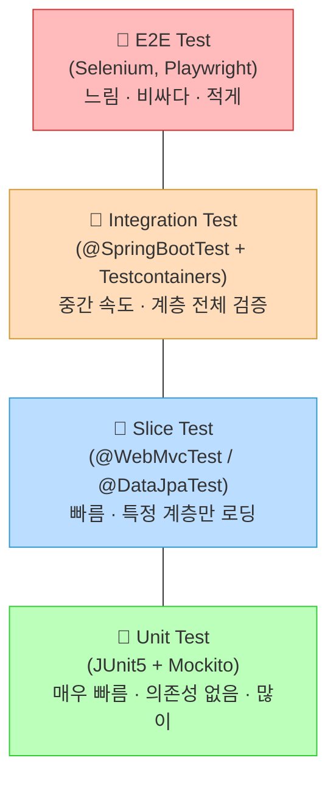
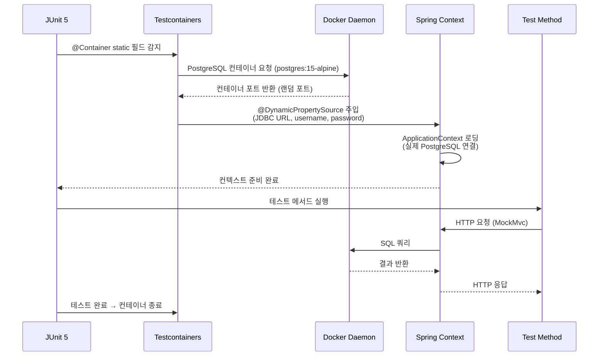

> 코드의 신뢰성은 테스트로 증명된다. `@SpringBootTest`부터 슬라이스 테스트, `Testcontainers`까지 — 실무에서 실제로 동작하는 테스트 계층 전략을 코드와 함께 깊이 파헤친다.

## 핵심 요약 (TL;DR)

Spring Boot의 테스트 전략은 **피라미드 구조**로 접근한다. 빠르고 가벼운 단위 테스트(Unit Test)를 기반으로, 웹 계층만 로딩하는 `@WebMvcTest`, 데이터 계층만 로딩하는 `@DataJpaTest` 등 **슬라이스 테스트**를 활용해 빌드 속도를 유지하면서 각 계층을 독립적으로 검증한다. 전체 통합 검증이 필요한 경우 `@SpringBootTest`를 사용하되, **Testcontainers**로 실제 DB 환경을 컨테이너로 띄워 H2 인메모리의 한계를 극복한다. 2025년 기준 Spring Boot 3.x는 `MockMvcTester`(AssertJ 기반)를 지원하며, 더욱 풍부한 assertion API를 제공한다.

---

## 왜 테스트 전략이 중요한가?

Spring Boot 애플리케이션은 애플리케이션 컨텍스트를 로딩하는 데 수 초가 걸린다. 모든 테스트에 `@SpringBootTest`를 남발하면:

- 전체 빌드 시간이 수 분으로 증가
- CI/CD 파이프라인의 피드백 루프가 느려짐
- 개발자가 테스트를 꺼리게 됨 → 테스트 커버리지 하락

**테스트 피라미드**는 이 문제의 해답이다.



**원칙:**
- **단위 테스트 (D)** — 비즈니스 로직, 유틸리티. 스프링 컨텍스트 불필요. 가장 많이 작성
- **슬라이스 테스트 (C)** — 특정 계층(Controller, Repository)만 로딩. 빠르고 정확
- **통합 테스트 (B)** — 전체 컨텍스트 + 실제 DB. 핵심 시나리오만
- **E2E 테스트 (A)** — 실제 브라우저/API. 최소한만

---

## 개념 이해

### 어노테이션 비교표

| 어노테이션 | 컨텍스트 로딩 | 속도 | 주요 용도 |
|---|---|---|---|
| `@SpringBootTest` | 전체 ApplicationContext | 느림 (3~10초+) | 통합 테스트, 전체 흐름 검증 |
| `@WebMvcTest` | MVC 계층만 | 빠름 (< 1초) | Controller 단독 테스트 |
| `@DataJpaTest` | JPA 계층만 | 보통 (< 2초) | Repository 테스트, 쿼리 검증 |
| `@DataMongoTest` | MongoDB 계층만 | 보통 | MongoDB Repository 테스트 |
| `@RestClientTest` | REST 클라이언트만 | 빠름 | RestTemplate/WebClient 테스트 |
| 없음 (plain) | 없음 | 매우 빠름 | 순수 단위 테스트 |

---

## 환경 설정

### `build.gradle` 테스트 의존성

```gradle
dependencies {
    // Spring Boot Test (JUnit5, MockMvc, Spring Test 포함)
    testImplementation 'org.springframework.boot:spring-boot-starter-test'

    // Testcontainers - Spring Boot 통합
    testImplementation 'org.springframework.boot:spring-boot-testcontainers'
    testImplementation 'org.testcontainers:junit-jupiter'
    testImplementation 'org.testcontainers:postgresql'  // PostgreSQL 컨테이너

    // AssertJ (spring-boot-starter-test에 포함, 명시적 선언도 가능)
    testImplementation 'org.assertj:assertj-core'

    // 런타임 의존성
    runtimeOnly 'org.postgresql:postgresql'
}

test {
    useJUnitPlatform()
}
```

### `application.yml` (테스트용 분리)

```yaml
# src/test/resources/application-test.yml
spring:
  datasource:
    url: jdbc:tc:postgresql:15:///testdb  # Testcontainers JDBC URL
    driver-class-name: org.testcontainers.jdbc.ContainerDatabaseDriver
  jpa:
    hibernate:
      ddl-auto: create-drop
    show-sql: true
    properties:
      hibernate:
        format_sql: true
```

---

## 구현 — 계층별 테스트 작성

테스트 대상은 시리즈 이전 파트에서 구현한 `User` CRUD API다.

### 1. 단위 테스트 — `UserService` (순수 Mockito)

스프링 컨텍스트 없이 `Mockito`만으로 비즈니스 로직을 검증한다. 가장 빠르고 격리된 테스트다.

```java
// src/test/java/com/honeybarrel/hellospringboot/service/UserServiceTest.java
package com.honeybarrel.hellospringboot.service;

import com.honeybarrel.hellospringboot.domain.User;
import com.honeybarrel.hellospringboot.dto.UserDto;
import com.honeybarrel.hellospringboot.repository.UserRepository;
import org.junit.jupiter.api.BeforeEach;
import org.junit.jupiter.api.DisplayName;
import org.junit.jupiter.api.Test;
import org.junit.jupiter.api.extension.ExtendWith;
import org.mockito.InjectMocks;
import org.mockito.Mock;
import org.mockito.junit.jupiter.MockitoExtension;

import java.util.Optional;

import static org.assertj.core.api.Assertions.*;
import static org.mockito.ArgumentMatchers.any;
import static org.mockito.BDDMockito.*;

@ExtendWith(MockitoExtension.class)  // 스프링 컨텍스트 로딩 없음 — 초고속
class UserServiceTest {

    @Mock
    UserRepository userRepository;

    @InjectMocks
    UserService userService;

    private User mockUser;

    @BeforeEach
    void setUp() {
        mockUser = User.builder()
                .id(1L)
                .name("꿀벌왕")
                .email("king@honeybarrel.co.kr")
                .build();
    }

    @Test
    @DisplayName("사용자 생성 — 정상 케이스")
    void createUser_success() {
        // Given
        UserDto.CreateRequest request = new UserDto.CreateRequest("꿀벌왕", "king@honeybarrel.co.kr");
        given(userRepository.save(any(User.class))).willReturn(mockUser);

        // When
        UserDto.Response response = userService.createUser(request);

        // Then
        assertThat(response.getId()).isEqualTo(1L);
        assertThat(response.getName()).isEqualTo("꿀벌왕");
        assertThat(response.getEmail()).isEqualTo("king@honeybarrel.co.kr");
        then(userRepository).should(times(1)).save(any(User.class));
    }

    @Test
    @DisplayName("존재하지 않는 ID 조회 — IllegalArgumentException 발생")
    void getUserById_notFound_throwsException() {
        // Given
        given(userRepository.findById(999L)).willReturn(Optional.empty());

        // When & Then
        assertThatThrownBy(() -> userService.getUserById(999L))
                .isInstanceOf(IllegalArgumentException.class)
                .hasMessageContaining("사용자를 찾을 수 없습니다");
    }

    @Test
    @DisplayName("사용자 삭제 — 정상 케이스")
    void deleteUser_success() {
        // Given
        given(userRepository.findById(1L)).willReturn(Optional.of(mockUser));
        willDoNothing().given(userRepository).delete(mockUser);

        // When
        userService.deleteUser(1L);

        // Then
        then(userRepository).should(times(1)).delete(mockUser);
    }
}
```

**포인트:**
- `@ExtendWith(MockitoExtension.class)` — Spring 컨텍스트 0, 실행 50ms 내외
- `given(...).willReturn(...)` — BDD 스타일 Mockito (given/when/then)
- `assertThatThrownBy` — 예외 케이스를 명확하게 검증
- SOLID 관점: `UserService`는 `UserRepository` 인터페이스에만 의존 → Mock으로 교체 가능 (DIP)

---

### 2. 슬라이스 테스트 — `@WebMvcTest` (Controller 계층)

MVC 계층만 로딩. `UserService`는 `@MockBean`으로 대체한다.

```java
// src/test/java/com/honeybarrel/hellospringboot/controller/UserControllerTest.java
package com.honeybarrel.hellospringboot.controller;

import com.fasterxml.jackson.databind.ObjectMapper;
import com.honeybarrel.hellospringboot.dto.UserDto;
import com.honeybarrel.hellospringboot.service.UserService;
import org.junit.jupiter.api.DisplayName;
import org.junit.jupiter.api.Test;
import org.springframework.beans.factory.annotation.Autowired;
import org.springframework.boot.test.autoconfigure.web.servlet.WebMvcTest;
import org.springframework.boot.test.mock.mockito.MockBean;
import org.springframework.http.MediaType;
import org.springframework.test.web.servlet.MockMvc;

import java.util.List;

import static org.mockito.ArgumentMatchers.any;
import static org.mockito.BDDMockito.*;
import static org.springframework.test.web.servlet.request.MockMvcRequestBuilders.*;
import static org.springframework.test.web.servlet.result.MockMvcResultHandlers.print;
import static org.springframework.test.web.servlet.result.MockMvcResultMatchers.*;

@WebMvcTest(UserController.class)  // UserController 관련 Bean만 로딩
class UserControllerTest {

    @Autowired
    MockMvc mockMvc;

    @Autowired
    ObjectMapper objectMapper;  // JSON 직렬화/역직렬화

    @MockBean  // Spring 컨텍스트에 Mock Bean 등록 (Service는 실제 구현체 불필요)
    UserService userService;

    @Test
    @DisplayName("POST /api/users — 사용자 생성 성공 (201 Created)")
    void createUser_returns201() throws Exception {
        // Given
        UserDto.CreateRequest request = new UserDto.CreateRequest("꿀벌왕", "king@honeybarrel.co.kr");
        UserDto.Response response = UserDto.Response.builder()
                .id(1L).name("꿀벌왕").email("king@honeybarrel.co.kr").build();

        given(userService.createUser(any(UserDto.CreateRequest.class))).willReturn(response);

        // When & Then
        mockMvc.perform(post("/api/users")
                        .contentType(MediaType.APPLICATION_JSON)
                        .content(objectMapper.writeValueAsString(request)))
                .andDo(print())  // 요청/응답 콘솔 출력
                .andExpect(status().isCreated())
                .andExpect(jsonPath("$.id").value(1L))
                .andExpect(jsonPath("$.name").value("꿀벌왕"))
                .andExpect(jsonPath("$.email").value("king@honeybarrel.co.kr"));
    }

    @Test
    @DisplayName("POST /api/users — 유효성 검사 실패 (400 Bad Request)")
    void createUser_invalidRequest_returns400() throws Exception {
        // Given — 이름 빈 문자열 (validation 실패)
        UserDto.CreateRequest invalidRequest = new UserDto.CreateRequest("", "not-an-email");

        // When & Then
        mockMvc.perform(post("/api/users")
                        .contentType(MediaType.APPLICATION_JSON)
                        .content(objectMapper.writeValueAsString(invalidRequest)))
                .andExpect(status().isBadRequest());
    }

    @Test
    @DisplayName("GET /api/users — 목록 조회 성공 (200 OK)")
    void getAllUsers_returns200() throws Exception {
        // Given
        List<UserDto.Response> users = List.of(
                UserDto.Response.builder().id(1L).name("꿀벌왕").email("king@honeybarrel.co.kr").build(),
                UserDto.Response.builder().id(2L).name("일벌A").email("worker_a@honeybarrel.co.kr").build()
        );
        given(userService.getAllUsers()).willReturn(users);

        // When & Then
        mockMvc.perform(get("/api/users"))
                .andExpect(status().isOk())
                .andExpect(jsonPath("$.length()").value(2))
                .andExpect(jsonPath("$[0].name").value("꿀벌왕"));
    }

    @Test
    @DisplayName("GET /api/users/{id} — 존재하지 않는 ID (400 Bad Request)")
    void getUserById_notFound_returns400() throws Exception {
        // Given
        given(userService.getUserById(999L))
                .willThrow(new IllegalArgumentException("사용자를 찾을 수 없습니다. ID: 999"));

        // When & Then
        mockMvc.perform(get("/api/users/999"))
                .andExpect(status().isBadRequest())
                .andExpect(content().string("사용자를 찾을 수 없습니다. ID: 999"));
    }
}
```

**포인트:**
- `@WebMvcTest(UserController.class)` — Controller, Filter, ControllerAdvice만 로딩. JPA, Service 없음
- `@MockBean` — Spring 컨텍스트에 Mock 등록 (`@Mock`과 다름)
- `jsonPath("$.name")` — JSON 응답 필드 검증
- **트레이드오프**: DB 연동 없으므로 실제 통합 동작은 검증 불가. 그러나 HTTP 계층 로직(상태코드, 응답 형식, validation)은 완전 검증 가능

---

### 3. 슬라이스 테스트 — `@DataJpaTest` (Repository 계층)

JPA 관련 Bean만 로딩. 기본으로 인메모리 H2 DB 사용.

```java
// src/test/java/com/honeybarrel/hellospringboot/repository/UserRepositoryTest.java
package com.honeybarrel.hellospringboot.repository;

import com.honeybarrel.hellospringboot.domain.User;
import org.junit.jupiter.api.DisplayName;
import org.junit.jupiter.api.Test;
import org.springframework.beans.factory.annotation.Autowired;
import org.springframework.boot.test.autoconfigure.orm.jpa.DataJpaTest;
import org.springframework.boot.test.autoconfigure.orm.jpa.TestEntityManager;

import java.util.Optional;

import static org.assertj.core.api.Assertions.*;

@DataJpaTest  // JPA 계층만 로딩, 자동으로 H2 인메모리 DB 사용, @Transactional 포함
class UserRepositoryTest {

    @Autowired
    TestEntityManager em;  // 테스트용 EntityManager

    @Autowired
    UserRepository userRepository;

    @Test
    @DisplayName("사용자 저장 및 조회 — ID로 찾기")
    void saveAndFindById() {
        // Given
        User user = User.builder()
                .name("꿀벌왕")
                .email("king@honeybarrel.co.kr")
                .build();
        User saved = userRepository.save(user);
        em.flush();   // 영속성 컨텍스트 → DB 반영
        em.clear();   // 1차 캐시 초기화 (실제 DB 조회 강제)

        // When
        Optional<User> found = userRepository.findById(saved.getId());

        // Then
        assertThat(found).isPresent();
        assertThat(found.get().getName()).isEqualTo("꿀벌왕");
        assertThat(found.get().getEmail()).isEqualTo("king@honeybarrel.co.kr");
    }

    @Test
    @DisplayName("이름으로 사용자 찾기 — 쿼리 메서드 검증")
    void findByName_returnsUser() {
        // Given
        User user = User.builder().name("일벌A").email("worker@honeybarrel.co.kr").build();
        em.persistAndFlush(user);
        em.clear();

        // When
        Optional<User> found = userRepository.findByName("일벌A");

        // Then
        assertThat(found).isPresent();
        assertThat(found.get().getEmail()).isEqualTo("worker@honeybarrel.co.kr");
    }

    @Test
    @DisplayName("존재하지 않는 이름 — 빈 Optional 반환")
    void findByName_notExists_returnsEmpty() {
        // When
        Optional<User> found = userRepository.findByName("없는유저");

        // Then
        assertThat(found).isEmpty();
    }

    @Test
    @DisplayName("사용자 삭제 — 삭제 후 조회 시 빈 Optional")
    void deleteUser_thenFindById_returnsEmpty() {
        // Given
        User user = User.builder().name("삭제유저").email("del@example.com").build();
        User saved = em.persistAndFlush(user);

        // When
        userRepository.deleteById(saved.getId());
        em.flush();
        em.clear();

        // Then
        assertThat(userRepository.findById(saved.getId())).isEmpty();
    }
}
```

**포인트:**
- `em.flush()` + `em.clear()` — 1차 캐시를 비워 실제 DB SELECT를 발생시켜야 쿼리 메서드가 제대로 동작하는지 검증
- `@DataJpaTest`는 기본적으로 각 테스트가 롤백됨 (`@Transactional` 포함)
- **주의**: H2와 실제 PostgreSQL은 SQL 방언이 다르다. 완전한 호환성은 Testcontainers로 보장

---

### 4. 통합 테스트 — `@SpringBootTest` + `Testcontainers`

전체 애플리케이션 컨텍스트 + 실제 PostgreSQL 컨테이너 사용. 프로덕션 환경에 가장 가까운 테스트다.

```java
// src/test/java/com/honeybarrel/hellospringboot/integration/UserIntegrationTest.java
package com.honeybarrel.hellospringboot.integration;

import com.fasterxml.jackson.databind.ObjectMapper;
import com.honeybarrel.hellospringboot.dto.UserDto;
import com.honeybarrel.hellospringboot.repository.UserRepository;
import org.junit.jupiter.api.*;
import org.springframework.beans.factory.annotation.Autowired;
import org.springframework.boot.test.autoconfigure.web.servlet.AutoConfigureMockMvc;
import org.springframework.boot.test.context.SpringBootTest;
import org.springframework.http.MediaType;
import org.springframework.test.context.DynamicPropertyRegistry;
import org.springframework.test.context.DynamicPropertySource;
import org.springframework.test.web.servlet.MockMvc;
import org.testcontainers.containers.PostgreSQLContainer;
import org.testcontainers.junit.jupiter.Container;
import org.testcontainers.junit.jupiter.Testcontainers;

import static org.assertj.core.api.Assertions.*;
import static org.springframework.test.web.servlet.request.MockMvcRequestBuilders.*;
import static org.springframework.test.web.servlet.result.MockMvcResultMatchers.*;

@SpringBootTest(webEnvironment = SpringBootTest.WebEnvironment.RANDOM_PORT)
@AutoConfigureMockMvc  // MockMvc 자동 설정
@Testcontainers        // Testcontainers 활성화
@TestMethodOrder(MethodOrderer.OrderAnnotation.class)  // 테스트 순서 지정
class UserIntegrationTest {

    // PostgreSQL 컨테이너 — 모든 테스트 클래스에서 공유 (static)
    @Container
    static final PostgreSQLContainer<?> postgres = new PostgreSQLContainer<>("postgres:15-alpine")
            .withDatabaseName("testdb")
            .withUsername("test")
            .withPassword("test");

    // 컨테이너 기동 후 Spring 데이터소스 속성을 동적으로 주입
    @DynamicPropertySource
    static void registerPgProperties(DynamicPropertyRegistry registry) {
        registry.add("spring.datasource.url", postgres::getJdbcUrl);
        registry.add("spring.datasource.username", postgres::getUsername);
        registry.add("spring.datasource.password", postgres::getPassword);
        registry.add("spring.datasource.driver-class-name", () -> "org.postgresql.Driver");
        registry.add("spring.jpa.database-platform", () -> "org.hibernate.dialect.PostgreSQLDialect");
    }

    @Autowired
    MockMvc mockMvc;

    @Autowired
    ObjectMapper objectMapper;

    @Autowired
    UserRepository userRepository;

    @BeforeEach
    void cleanUp() {
        userRepository.deleteAll();
    }

    @Test
    @Order(1)
    @DisplayName("[통합] 사용자 생성 → 목록 조회 → 삭제 전체 흐름")
    void fullCrudFlow() throws Exception {
        // 1. 생성
        UserDto.CreateRequest createRequest = new UserDto.CreateRequest("꿀벌왕", "king@honeybarrel.co.kr");

        String body = mockMvc.perform(post("/api/users")
                        .contentType(MediaType.APPLICATION_JSON)
                        .content(objectMapper.writeValueAsString(createRequest)))
                .andExpect(status().isCreated())
                .andExpect(jsonPath("$.name").value("꿀벌왕"))
                .andReturn().getResponse().getContentAsString();

        Long createdId = objectMapper.readTree(body).get("id").asLong();

        // 2. 단건 조회
        mockMvc.perform(get("/api/users/{id}", createdId))
                .andExpect(status().isOk())
                .andExpect(jsonPath("$.email").value("king@honeybarrel.co.kr"));

        // 3. 수정
        UserDto.UpdateRequest updateRequest = new UserDto.UpdateRequest(createdId, "꿀벌왕 수정", null);
        mockMvc.perform(put("/api/users")
                        .contentType(MediaType.APPLICATION_JSON)
                        .content(objectMapper.writeValueAsString(updateRequest)))
                .andExpect(status().isOk())
                .andExpect(jsonPath("$.name").value("꿀벌왕 수정"));

        // 4. 삭제
        mockMvc.perform(delete("/api/users/{id}", createdId))
                .andExpect(status().isNoContent());

        // 5. 삭제 후 조회 — 없음
        mockMvc.perform(get("/api/users/{id}", createdId))
                .andExpect(status().isBadRequest());

        // 6. DB 직접 검증
        assertThat(userRepository.findById(createdId)).isEmpty();
    }

    @Test
    @Order(2)
    @DisplayName("[통합] 중복 이메일 처리 — 비즈니스 정책 검증")
    void duplicateEmail_isHandled() throws Exception {
        // Given — 동일 이메일로 2명 생성 시도
        UserDto.CreateRequest req1 = new UserDto.CreateRequest("유저1", "dup@example.com");
        UserDto.CreateRequest req2 = new UserDto.CreateRequest("유저2", "dup@example.com");

        mockMvc.perform(post("/api/users")
                        .contentType(MediaType.APPLICATION_JSON)
                        .content(objectMapper.writeValueAsString(req1)))
                .andExpect(status().isCreated());

        // 두 번째 생성은 비즈니스 정책에 따라 처리 (예: 허용 또는 4xx 반환)
        // 실제 정책이 있다면 여기서 검증
        mockMvc.perform(post("/api/users")
                        .contentType(MediaType.APPLICATION_JSON)
                        .content(objectMapper.writeValueAsString(req2)));
        // 정책에 따라 .andExpect(status().isConflict()) 등으로 검증
    }
}
```

**Testcontainers 동작 원리:**



---

### 5. 공유 컨텍스트 최적화 — `AbstractIntegrationTest`

통합 테스트가 많아지면 컨텍스트를 반복 로딩하는 오버헤드가 생긴다. 추상 기반 클래스로 컨텍스트를 **재사용**한다.

```java
// src/test/java/com/honeybarrel/hellospringboot/integration/AbstractIntegrationTest.java
package com.honeybarrel.hellospringboot.integration;

import org.springframework.boot.test.autoconfigure.web.servlet.AutoConfigureMockMvc;
import org.springframework.boot.test.context.SpringBootTest;
import org.springframework.test.context.DynamicPropertyRegistry;
import org.springframework.test.context.DynamicPropertySource;
import org.testcontainers.containers.PostgreSQLContainer;
import org.testcontainers.junit.jupiter.Container;
import org.testcontainers.junit.jupiter.Testcontainers;

/**
 * 모든 통합 테스트가 상속하는 기반 클래스.
 * PostgreSQL 컨테이너를 한 번만 기동하고 공유한다 (static).
 */
@SpringBootTest(webEnvironment = SpringBootTest.WebEnvironment.RANDOM_PORT)
@AutoConfigureMockMvc
@Testcontainers
public abstract class AbstractIntegrationTest {

    @Container
    static final PostgreSQLContainer<?> POSTGRES = new PostgreSQLContainer<>("postgres:15-alpine")
            .withDatabaseName("testdb")
            .withUsername("test")
            .withPassword("test");

    @DynamicPropertySource
    static void configureProperties(DynamicPropertyRegistry registry) {
        registry.add("spring.datasource.url", POSTGRES::getJdbcUrl);
        registry.add("spring.datasource.username", POSTGRES::getUsername);
        registry.add("spring.datasource.password", POSTGRES::getPassword);
    }
}

// 사용 예시
// class UserIntegrationTest extends AbstractIntegrationTest { ... }
// class PostIntegrationTest extends AbstractIntegrationTest { ... }
// → 두 클래스 모두 동일한 컨테이너 인스턴스 재사용 → 빌드 시간 절약
```

---

## 실행 및 결과 확인

```bash
# 전체 테스트 실행
./gradlew test

# 특정 테스트 클래스만 실행
./gradlew test --tests "com.honeybarrel.hellospringboot.service.UserServiceTest"

# 통합 테스트만 (패키지 기준)
./gradlew test --tests "*.integration.*"

# 테스트 보고서 확인
open build/reports/tests/test/index.html
```

**예상 실행 시간:**

| 테스트 유형 | 예상 시간 |
|---|---|
| `UserServiceTest` (순수 단위) | ~100ms |
| `UserControllerTest` (@WebMvcTest) | ~500ms |
| `UserRepositoryTest` (@DataJpaTest) | ~1,500ms |
| `UserIntegrationTest` (@SpringBootTest + Testcontainers) | ~10~20초 (컨테이너 기동 포함) |

---

## 설계 포인트 — 좋은 테스트의 조건

**F.I.R.S.T 원칙:**
- **Fast** — 단위 테스트는 ms 단위. 슬로우 테스트는 격리
- **Isolated** — 각 테스트는 독립적. 순서에 의존하지 않음
- **Repeatable** — 어떤 환경에서도 동일한 결과 (Testcontainers가 이 문제 해결)
- **Self-validating** — assert로 명확한 pass/fail
- **Timely** — 코드 작성과 동시에 테스트 작성

**`@MockBean` vs `@Mock` 차이:**

| | `@Mock` (Mockito) | `@MockBean` (Spring) |
|---|---|---|
| 컨텍스트 | 불필요 | Spring Context 필요 |
| 사용 위치 | 순수 단위 테스트 | 슬라이스/통합 테스트 |
| 속도 | 빠름 | 상대적으로 느림 |
| 컨텍스트 캐시 | 영향 없음 | 새 컨텍스트 로딩 강제 (주의) |

> ⚠️ `@MockBean` 사용 시 Spring은 컨텍스트 캐시를 무효화한다. 동일 컨텍스트에서 다른 `@MockBean` 조합을 사용하면 매번 새로운 컨텍스트가 로딩되어 빌드가 느려진다. 가능하면 `@MockBean` 사용을 최소화하고, 컨텍스트 공유를 극대화한다.

---

## 시리즈 안내

| Part | 주제 | 링크 |
|------|------|------|
| Part 1 | Spring Boot 시작하기 | [보러가기](/2026/03/17/spring-boot-시작하기-설치부터-첫-rest-api까지/) |
| Part 2 | 의존성 주입과 IoC | [보러가기](/2026/03/18/spring-boot-의존성-주입과-ioc-컨테이너-원리부터-실전까지/) |
| Part 3 | 레이어드 아키텍처 | [보러가기](/2026/03/19/spring-boot-레이어드-아키텍처-controllerservicerepository-완전-해부/) |
| Part 4 | Spring Data JPA | [보러가기](/2026/03/20/spring-data-jpa-orm-관계-매핑-n1-문제-querydsl-완전-정복/) |
| Part 5 | 예외 처리와 검증 | [보러가기](/2026/03/21/spring-boot-예외-처리와-검증-커스텀-예외부터-rfc-7807까지/) |
| Part 6 | Spring Security | [보러가기](/2026/03/24/spring-security-securityfilterchain-jwt-rbac-cors-완전-정복/) |
| **Part 7** | **테스트 전략** | 현재 글 |
| Part 8 | 배포와 운영 | [보러가기](/2026/03/26/spring-boot-배포와-운영/) |

---

## 레퍼런스

### 공식 문서
- [Spring Boot Testing Reference Documentation](https://docs.spring.io/spring-boot/docs/current/reference/html/testing.html) — Spring 공식 테스팅 가이드
- [Testing the Web Layer — Spring Guides](https://spring.io/guides/gs/testing-web/) — spring.io 공식 튜토리얼
- [Testcontainers for Java](https://java.testcontainers.org/) — Testcontainers 공식 문서

### 기술 블로그
- [Using MockMvc With SpringBootTest vs. WebMvcTest — Baeldung](https://www.baeldung.com/spring-mockmvc-vs-webmvctest) — MockMvc 두 접근법 비교
- [Testing Spring Boot Applications With MockMvc — rieckpil](https://rieckpil.de/guide-to-testing-spring-boot-applications-with-mockmvc/) — MockMvc 심화 가이드
- [MockMvcTester Guide — JetBrains Blog](https://blog.jetbrains.com/idea/2025/04/a-practical-guide-to-testing-spring-controllers-with-mockmvctester/) — Spring Boot 3.4+ MockMvcTester

---

*이 포스트는 [HoneyByte](https://blog.honeybarrel.co.kr) Spring Boot Deep Dive 시리즈의 일부입니다.*
