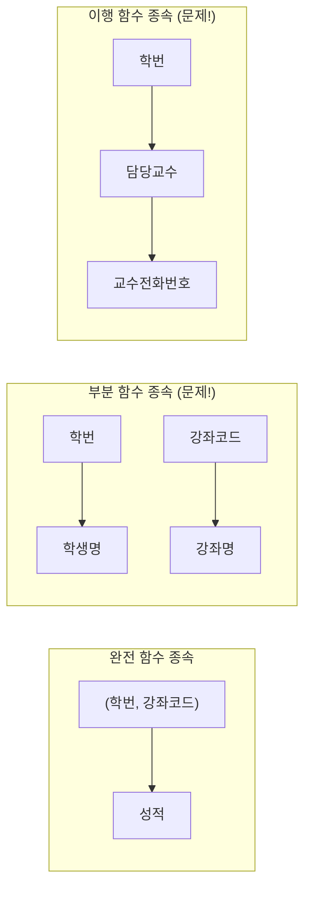
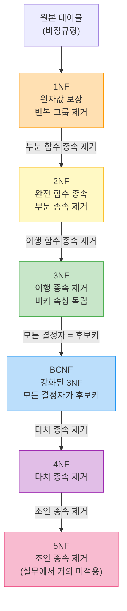

> **한 줄 요약:** 정규화는 중복을 제거하고 이상 현상을 막는 관계형 DB 설계의 핵심 원칙이다.  
> **난이도:** ⭐⭐⭐⭐ | **카테고리:** Database | **키워드:** 1NF, 2NF, 3NF, BCNF, 반정규화

---

## 1. 왜 정규화가 필요한가?

데이터베이스 설계에서 가장 흔히 저지르는 실수는 "일단 한 테이블에 다 넣자"는 유혹이다. 처음에는 편해 보이지만, 이런 설계는 시간이 지날수록 **이상 현상(Anomaly)** 이라는 치명적인 문제를 일으킨다.

### 이상 현상(Anomaly) 3종 세트

이상 현상은 정규화가 되지 않은 테이블에서 발생하는 데이터 불일치 문제다. 구체적인 예시로 살펴보자.

다음과 같은 `수강신청` 테이블이 있다고 가정하자:

| 학번 | 학생명 | 강좌코드 | 강좌명     | 담당교수 | 교수전화번호 |
|------|--------|----------|------------|----------|--------------|
| S001 | 김철수 | C101     | 자료구조   | 이교수   | 010-1234-5678 |
| S001 | 김철수 | C102     | 운영체제   | 박교수   | 010-9876-5432 |
| S002 | 이영희 | C101     | 자료구조   | 이교수   | 010-1234-5678 |
| S003 | 박민수 | C103     | 데이터베이스 | 이교수 | 010-1234-5678 |

이 테이블에서 발생하는 이상 현상:

**1) 삽입 이상 (Insertion Anomaly)**  
새 교수가 부임했는데 아직 강좌를 맡지 않았다면? 학번과 강좌코드 없이는 교수 정보를 삽입할 수 없다. 즉, 존재하지 않는 데이터를 억지로 채워야 한다.

**2) 삭제 이상 (Deletion Anomaly)**  
S003(박민수)이 C103 수업을 취소하면? 그 행을 삭제하면 이교수의 전화번호 정보도 함께 날아간다. 의도하지 않은 데이터 소실이 발생한다.

**3) 갱신 이상 (Update Anomaly)**  
이교수의 전화번호가 바뀌었다면? 이교수가 담당하는 모든 행을 찾아서 일일이 수정해야 한다. 하나라도 빠뜨리면 데이터 불일치가 생긴다.

이 세 가지 문제를 해결하기 위해 정규화(Normalization)가 탄생했다.

---

## 2. 함수 종속성(Functional Dependency) — 정규화의 이론적 토대

정규화를 이해하려면 먼저 **함수 종속성(FD: Functional Dependency)** 개념을 알아야 한다.

```
X → Y  (X가 Y를 함수적으로 결정한다)
```

즉, X의 값이 결정되면 Y의 값도 유일하게 결정된다는 뜻이다.

예시:
- `학번 → 학생명` (학번이 같으면 학생명도 같다)
- `강좌코드 → 강좌명` (강좌코드가 같으면 강좌명도 같다)
- `(학번, 강좌코드) → 성적` (복합키가 성적을 결정한다)

### 함수 종속성의 종류

| 종류 | 설명 | 예시 |
|------|------|------|
| **완전 함수 종속** | 기본키 전체에 종속 | `(학번, 강좌코드) → 성적` |
| **부분 함수 종속** | 기본키의 일부에만 종속 | `학번 → 학생명` (복합키 일부) |
| **이행 함수 종속** | A→B, B→C일 때 A→C | `학번→담당교수→전화번호` |



---

## 3. 정규화 단계별 완전 해부

### 제1정규형 (1NF: First Normal Form)

**조건:** 모든 속성값이 원자값(Atomic Value)이어야 한다. 즉, 반복 그룹이나 다중값 속성이 없어야 한다.

**위반 사례:**

| 학번 | 학생명 | 수강과목                    |
|------|--------|-----------------------------|
| S001 | 김철수 | 자료구조, 운영체제, DB       |
| S002 | 이영희 | 알고리즘, 네트워크           |

`수강과목` 컬럼에 여러 값이 들어 있어 1NF 위반이다.

**1NF 변환:**

| 학번 | 학생명 | 수강과목   |
|------|--------|------------|
| S001 | 김철수 | 자료구조   |
| S001 | 김철수 | 운영체제   |
| S001 | 김철수 | DB         |
| S002 | 이영희 | 알고리즘   |
| S002 | 이영희 | 네트워크   |

**SQL 구현 관점:**
```sql
-- 1NF 위반: 배열/JSON으로 여러 값 저장 (PostgreSQL 예시)
CREATE TABLE bad_enrollment (
    student_id VARCHAR(10),
    student_name VARCHAR(50),
    courses TEXT[]  -- 위반! 원자값이 아님
);

-- 1NF 준수: 각 행에 하나의 값
CREATE TABLE enrollment_1nf (
    student_id VARCHAR(10),
    student_name VARCHAR(50),
    course_name VARCHAR(100),
    PRIMARY KEY (student_id, course_name)
);
```

---

### 제2정규형 (2NF: Second Normal Form)

**조건:** 1NF를 만족하면서, 기본키가 아닌 모든 속성이 기본키에 **완전 함수 종속**이어야 한다. 즉, 부분 함수 종속을 제거한다.

**전제:** 복합 기본키 `(학번, 강좌코드)`를 가지는 테이블에서:

| 학번 | 강좌코드 | 성적 | 학생명 | 강좌명   |
|------|----------|------|--------|----------|
| S001 | C101     | A    | 김철수 | 자료구조 |
| S001 | C102     | B+   | 김철수 | 운영체제 |
| S002 | C101     | A+   | 이영희 | 자료구조 |

문제:
- `학생명`은 `학번`에만 종속 (부분 함수 종속)
- `강좌명`은 `강좌코드`에만 종속 (부분 함수 종속)
- `성적`만이 `(학번, 강좌코드)` 전체에 완전 종속

**2NF 변환 — 테이블 분리:**

```sql
-- 학생 테이블 (학번이 PK)
CREATE TABLE student (
    student_id   VARCHAR(10) PRIMARY KEY,
    student_name VARCHAR(50) NOT NULL
);

-- 강좌 테이블 (강좌코드가 PK)
CREATE TABLE course (
    course_id   VARCHAR(10) PRIMARY KEY,
    course_name VARCHAR(100) NOT NULL
);

-- 수강 테이블 (복합 PK, 성적만 여기에)
CREATE TABLE enrollment (
    student_id  VARCHAR(10) REFERENCES student(student_id),
    course_id   VARCHAR(10) REFERENCES course(course_id),
    grade       CHAR(2),
    PRIMARY KEY (student_id, course_id)
);
```

---

### 제3정규형 (3NF: Third Normal Form)

**조건:** 2NF를 만족하면서, 기본키가 아닌 속성이 기본키에 **이행 함수 종속(Transitive Dependency)** 이 없어야 한다.

**예시 테이블:**

| 학번 | 학과코드 | 학과명   | 학과위치 |
|------|----------|----------|----------|
| S001 | D01      | 컴퓨터공학 | 공학관 3층 |
| S002 | D01      | 컴퓨터공학 | 공학관 3층 |
| S003 | D02      | 전자공학 | 공학관 5층 |

이행 종속 구조:
```
학번 → 학과코드 → 학과명, 학과위치
```
`학번 → 학과명`은 직접 종속이 아니라 `학과코드`를 거치는 이행 종속이다.

**3NF 변환:**

```sql
-- 학과 정보 분리
CREATE TABLE department (
    dept_id       VARCHAR(10) PRIMARY KEY,
    dept_name     VARCHAR(50) NOT NULL,
    dept_location VARCHAR(100)
);

-- 학생 테이블은 학과코드(FK)만 가짐
CREATE TABLE student_3nf (
    student_id VARCHAR(10) PRIMARY KEY,
    dept_id    VARCHAR(10) REFERENCES department(dept_id),
    student_name VARCHAR(50) NOT NULL
);
```

---

### BCNF (Boyce-Codd Normal Form)

**조건:** 3NF보다 더 엄격한 형태. 모든 결정자(Determinant)가 후보키(Candidate Key)여야 한다.

3NF는 통과하지만 BCNF를 위반하는 사례가 존재한다. 이는 **복수의 후보키**가 있고 **후보키들이 서로 겹칠 때** 발생한다.

**대표적인 BCNF 위반 예시:**

| 학생    | 과목   | 교수   |
|---------|--------|--------|
| 김철수  | DB     | 이교수 |
| 김철수  | OS     | 박교수 |
| 이영희  | DB     | 이교수 |
| 이영희  | DB     | 최교수 |

**함수 종속:**
- `(학생, 과목) → 교수` (한 학생은 한 과목에 여러 교수를 가질 수 있다 가정)
- `교수 → 과목` (교수는 한 과목만 담당)

후보키: `(학생, 교수)` — 그러나 `교수 → 과목`에서 결정자 `교수`가 후보키가 아니어서 BCNF 위반!

**BCNF 변환:**

```sql
-- 교수-과목 관계 분리
CREATE TABLE professor_course (
    professor_name VARCHAR(50) PRIMARY KEY,
    course_name    VARCHAR(100) NOT NULL
);

-- 학생-교수 수강 관계
CREATE TABLE student_professor (
    student_name   VARCHAR(50),
    professor_name VARCHAR(50) REFERENCES professor_course(professor_name),
    PRIMARY KEY (student_name, professor_name)
);
```

---

## 4. 정규화 단계 한눈에 보기



---

## 5. 반정규화(Denormalization) — 성능을 위한 의도적 타협

### 왜 반정규화를 하는가?

완벽하게 정규화된 DB는 데이터 무결성 측면에서 이상적이지만, **JOIN이 많아질수록 쿼리 성능이 저하**된다. 실무에서는 **읽기 성능이 쓰기 정합성보다 중요한 경우** 반정규화를 선택한다.

### 반정규화 기법

**1) 테이블 합치기 (Table Merging)**

```sql
-- 정규화된 상태: JOIN 필요
SELECT o.order_id, o.order_date, c.customer_name, c.customer_email
FROM orders o
JOIN customers c ON o.customer_id = c.customer_id
WHERE o.order_id = 12345;

-- 반정규화: orders 테이블에 고객 정보 직접 저장
-- (주문 시점의 고객 정보를 스냅샷으로 보존하는 경우)
CREATE TABLE orders_denorm (
    order_id       BIGINT PRIMARY KEY,
    order_date     TIMESTAMP,
    customer_id    BIGINT,
    customer_name  VARCHAR(100),   -- 반정규화: 중복 저장
    customer_email VARCHAR(200)    -- 반정규화: 중복 저장
);
```

**2) 컬럼 추가 (Derived Column)**

자주 집계하는 값을 미리 계산해서 저장:

```sql
-- 매번 집계 쿼리를 날리는 대신
SELECT category_id, COUNT(*) as post_count
FROM posts GROUP BY category_id;

-- 반정규화: categories 테이블에 post_count 컬럼 추가
ALTER TABLE categories ADD COLUMN post_count INT DEFAULT 0;

-- INSERT/UPDATE/DELETE 트리거나 애플리케이션 레이어에서 관리
CREATE OR REPLACE FUNCTION update_category_post_count()
RETURNS TRIGGER AS $$
BEGIN
    IF TG_OP = 'INSERT' THEN
        UPDATE categories SET post_count = post_count + 1
        WHERE category_id = NEW.category_id;
    ELSIF TG_OP = 'DELETE' THEN
        UPDATE categories SET post_count = post_count - 1
        WHERE category_id = OLD.category_id;
    END IF;
    RETURN NULL;
END;
$$ LANGUAGE plpgsql;

CREATE TRIGGER trg_post_count
AFTER INSERT OR DELETE ON posts
FOR EACH ROW EXECUTE FUNCTION update_category_post_count();
```

**3) 수직 분할 (Vertical Partitioning) — 역방향 반정규화**

자주 조회하는 컬럼과 드물게 조회하는 컬럼을 분리:

```sql
-- 원본: 모든 컬럼을 한 테이블에
CREATE TABLE users (
    user_id      BIGINT PRIMARY KEY,
    username     VARCHAR(50),       -- 자주 조회
    email        VARCHAR(200),      -- 자주 조회
    bio          TEXT,              -- 드물게 조회
    profile_image BYTEA,            -- 매우 드물게 조회
    full_resume   TEXT              -- 거의 조회 안 함
);

-- 분리 후
CREATE TABLE users_core (
    user_id  BIGINT PRIMARY KEY,
    username VARCHAR(50),
    email    VARCHAR(200)
);

CREATE TABLE users_profile (
    user_id       BIGINT PRIMARY KEY REFERENCES users_core(user_id),
    bio           TEXT,
    profile_image BYTEA,
    full_resume   TEXT
);
```

### 반정규화 결정 기준

```
읽기 > 쓰기  AND  JOIN 비용이 큰 경우  →  반정규화 고려
쓰기 > 읽기  OR   데이터 정합성이 최우선  →  정규화 유지
```

---

## 6. 실무 적용 — ORM과 정규화

### JPA/Hibernate에서의 정규화 반영

```java
// 정규화된 구조를 JPA Entity로 표현

@Entity
@Table(name = "students")
public class Student {
    @Id
    @GeneratedValue(strategy = GenerationType.IDENTITY)
    private Long id;
    
    private String name;
    
    @ManyToOne(fetch = FetchType.LAZY)
    @JoinColumn(name = "dept_id")
    private Department department;  // 이행 종속 제거: dept_name, dept_location 없음
    
    @OneToMany(mappedBy = "student", cascade = CascadeType.ALL)
    private List<Enrollment> enrollments;
}

@Entity
@Table(name = "courses")
public class Course {
    @Id
    private String courseCode;
    
    private String courseName;
    
    @ManyToOne(fetch = FetchType.LAZY)
    @JoinColumn(name = "professor_id")
    private Professor professor;  // 부분 종속 제거
}

@Entity
@Table(name = "enrollments")
@IdClass(EnrollmentId.class)
public class Enrollment {
    @Id
    @ManyToOne
    @JoinColumn(name = "student_id")
    private Student student;
    
    @Id
    @ManyToOne
    @JoinColumn(name = "course_id")
    private Course course;
    
    private String grade;  // 완전 함수 종속
}
```

### N+1 문제와 반정규화의 트레이드오프

```java
// 정규화 상태에서 N+1 문제 발생 가능
// 학생 목록 조회 시 각 학생마다 학과 조회 쿼리 발생

// 해결책 1: JPQL Fetch Join (정규화 유지)
@Query("SELECT DISTINCT s FROM Student s LEFT JOIN FETCH s.department")
List<Student> findAllWithDepartment();

// 해결책 2: DTO Projection (반정규화 없이 최적화)
@Query("SELECT new com.example.StudentDto(s.id, s.name, d.deptName) " +
       "FROM Student s JOIN s.department d")
List<StudentDto> findStudentDtos();

// 해결책 3: 반정규화 (dept_name을 student 테이블에 직접 저장)
// → 데이터 변경 시 동기화 이슈 발생 가능
```

### 장애 사례: 반정규화 미적용으로 인한 슬로우 쿼리

실제 운영 중인 커머스 서비스에서 주문 목록 API가 초당 100건 요청에서 응답시간이 3초를 넘기 시작했다. 원인 분석:

```sql
-- 문제가 된 쿼리: 5개 테이블 JOIN
EXPLAIN ANALYZE
SELECT 
    o.order_id,
    o.created_at,
    u.username,
    p.product_name,
    p.thumbnail_url,
    oi.quantity,
    oi.unit_price
FROM orders o
JOIN users u ON o.user_id = u.user_id
JOIN order_items oi ON o.order_id = oi.order_id
JOIN products p ON oi.product_id = p.product_id
JOIN categories c ON p.category_id = c.category_id
WHERE o.user_id = 12345
ORDER BY o.created_at DESC
LIMIT 20;

-- 실행 계획: Nested Loop Join, rows=50000, time=2800ms
```

**해결:** `order_items`에 `product_name`, `thumbnail_url` 스냅샷 저장 → 쿼리 단순화 → 응답시간 120ms로 개선.

---

## 7. 면접 Q&A — 기초부터 시니어까지

### Q1. [기초] 정규화란 무엇이고, 왜 필요한가?

> **모범 답변:**  
> 정규화는 관계형 데이터베이스에서 데이터 중복을 최소화하고 이상 현상(삽입/삭제/갱신 이상)을 방지하기 위해 테이블을 체계적으로 분해하는 과정입니다. 함수 종속성 이론을 기반으로 1NF부터 BCNF까지 단계별 규칙을 적용합니다.

---

### Q2. [중급] 3NF와 BCNF의 차이는 무엇인가?

> **모범 답변:**  
> 3NF는 "기본키가 아닌 속성이 기본키에 이행 종속되지 않아야 한다"는 조건입니다. BCNF는 더 엄격하게 "모든 결정자가 후보키여야 한다"고 요구합니다.  
> 3NF를 만족하지만 BCNF를 위반하는 경우는 **복수의 후보키가 존재하고 서로 겹칠 때** 발생합니다. BCNF로 변환하면 더 강한 무결성을 보장하지만, 경우에 따라 원래 테이블의 함수 종속성이 보존되지 않는 단점이 생길 수 있습니다.

---

### Q3. [중급] 반정규화는 언제 적용하는가? 리스크는?

> **모범 답변:**  
> 반정규화는 주로 **OLAP(분석) 환경이나 읽기 집약적인 서비스**에서 JOIN 비용을 줄이기 위해 적용합니다. 적용 기준은 ①쿼리 성능이 SLA를 위반할 때, ②프로파일링으로 JOIN이 병목임을 확인했을 때, ③인덱스나 쿼리 최적화로 해결 불가능할 때입니다.  
> 리스크는 **데이터 중복으로 인한 정합성 문제**입니다. 중복 저장된 컬럼이 동기화되지 않으면 데이터 불일치가 발생합니다. 트리거, 애플리케이션 레이어 동기화, 또는 이벤트 소싱 패턴으로 관리해야 합니다.

---

### Q4. [시니어] NoSQL이 등장했는데도 정규화를 알아야 하는 이유는?

> **모범 답변:**  
> MongoDB, DynamoDB 같은 NoSQL은 의도적으로 반정규화(중복 저장, 임베딩)를 활용하는 경우가 많습니다. 그러나 정규화 원리를 모르고 NoSQL을 사용하면 업데이트 이상이나 데이터 불일치를 제어할 수 없게 됩니다.  
> 정규화 이론은 "어떤 데이터를 같이 저장하고 어떤 데이터를 분리할 것인가"를 판단하는 기준을 제공합니다. NoSQL 설계에서도 "어느 정도까지 임베딩할 것인가"를 결정할 때 함수 종속성 분석이 필요합니다.

---

### Q5. [시니어] 실무에서 3NF를 넘어 BCNF까지 적용하는 경우는?

> **모범 답변:**  
> 실무에서는 대부분 3NF 수준에서 설계를 마무리하고, BCNF 위반이 명확히 이상 현상을 유발할 때만 추가로 분해합니다. BCNF 변환이 오히려 해가 되는 경우도 있습니다.  
> 예를 들어, 항공 예약 시스템에서 "여객-항공편-좌석" 관계에서 BCNF 변환 시 무손실 분해는 가능하지만 원래의 함수 종속성을 보존하는 분해가 불가능해져서, 조인 없이는 비즈니스 규칙을 검증할 수 없게 됩니다. 이런 경우 3NF를 유지하면서 애플리케이션 레이어에서 제약을 관리하는 것이 현실적입니다.

---

## 8. Deep Dive — 정규화의 수학적 토대

### 암스트롱 공리 (Armstrong's Axioms)

함수 종속성 추론을 위한 공리 체계:

```
1. 반사율 (Reflexivity):   Y ⊆ X이면 X → Y
2. 첨가율 (Augmentation):  X → Y이면 XZ → YZ  
3. 이행율 (Transitivity):  X → Y, Y → Z이면 X → Z

유도 규칙:
4. 합집합 (Union):         X → Y, X → Z이면 X → YZ
5. 분해 (Decomposition):   X → YZ이면 X → Y, X → Z
6. 의사이행 (Pseudotransitivity): X → Y, WY → Z이면 WX → Z
```

### 최소 커버 (Minimal Cover) — 정규화 자동화의 핵심

정규화 도구들이 FD 집합을 분석할 때 **최소 커버**를 먼저 구한다:

1. 모든 FD를 단일 속성 결론으로 분해
2. 각 FD에서 불필요한 결정 속성 제거
3. 중복 FD 제거

```python
# 최소 커버 구하는 알고리즘 (의사코드)
def minimal_cover(fds):
    # Step 1: 우변 단순화
    result = [(X, {y}) for X, Y in fds for y in Y]
    
    # Step 2: 좌변 최소화
    for X, Y in result[:]:
        for attr in X:
            reduced_X = X - {attr}
            if Y <= closure(reduced_X, result):
                result.remove((X, Y))
                result.append((reduced_X, Y))
    
    # Step 3: 중복 FD 제거
    for fd in result[:]:
        temp = result - {fd}
        X, Y = fd
        if Y <= closure(X, temp):
            result.remove(fd)
    
    return result
```

### 무손실 분해 (Lossless Decomposition)

정규화에서 테이블을 분해할 때 **원본 데이터가 복원 가능**해야 한다.

**Heath의 정리:** 릴레이션 R이 `X → Y` 또는 `X → Z`를 만족하면, `R = R₁(X,Y) ⋈ R₂(X,Z)`로 무손실 분해 가능.

```sql
-- 무손실 분해 검증: 분해 후 JOIN 결과가 원본과 같은지 확인
SELECT COUNT(*) FROM original_table;  -- 100행
SELECT COUNT(*) FROM table1 JOIN table2 USING (key);  -- 동일한 100행이어야 함
```

---

## 9. 관련 개념 연결

정규화를 이해했다면 다음 개념으로 이어서 공부하자:

- **인덱스 설계:** 정규화로 테이블이 분리되면 JOIN 최적화를 위한 인덱스 전략이 중요해진다
- **트랜잭션 & ACID:** 정규화된 여러 테이블에 동시에 쓸 때 원자성 보장 방법
- **ERD (Entity-Relationship Diagram):** 정규화 전 데이터 모델링 단계
- **샤딩 & 파티셔닝:** 정규화된 DB를 수평 확장하는 방법
- **이벤트 소싱:** 반정규화의 현대적 대안 패턴

---

## 📚 레퍼런스

### 영상
- **[freeCodeCamp] Relational Database Design** — <https://www.youtube.com/watch?v=ztHopE5Wnpc>
- **[쉬운코드] 데이터베이스 정규화** — <https://www.youtube.com/@ezcd> (DB 개론 시리즈)
- **[Computerphile] Database Design** — <https://www.youtube.com/watch?v=1VLkAh1bCGI>

### 공식 문서 & 아티클
- **freeCodeCamp - Database Normalization** — <https://www.freecodecamp.org/news/database-normalization-1nf-2nf-3nf-table-examples/>
- **freeCodeCamp - Learn Relational Database Design** — <https://www.freecodecamp.org/news/learn-relational-database-design/>
- **Microsoft Learn - 데이터베이스 정규화 설명** — <https://learn.microsoft.com/ko-kr/office/troubleshoot/access/database-normalization-description>
- **PostgreSQL Documentation - Constraints** — <https://www.postgresql.org/docs/current/ddl-constraints.html>

---

*🍯 HoneyByte는 매일 하나의 CS 개념을 깊이 파고듭니다.*  
*틀린 내용이나 개선 제안은 댓글로 남겨주세요!*
