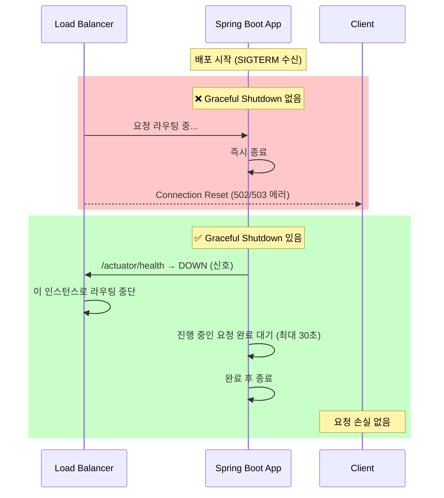
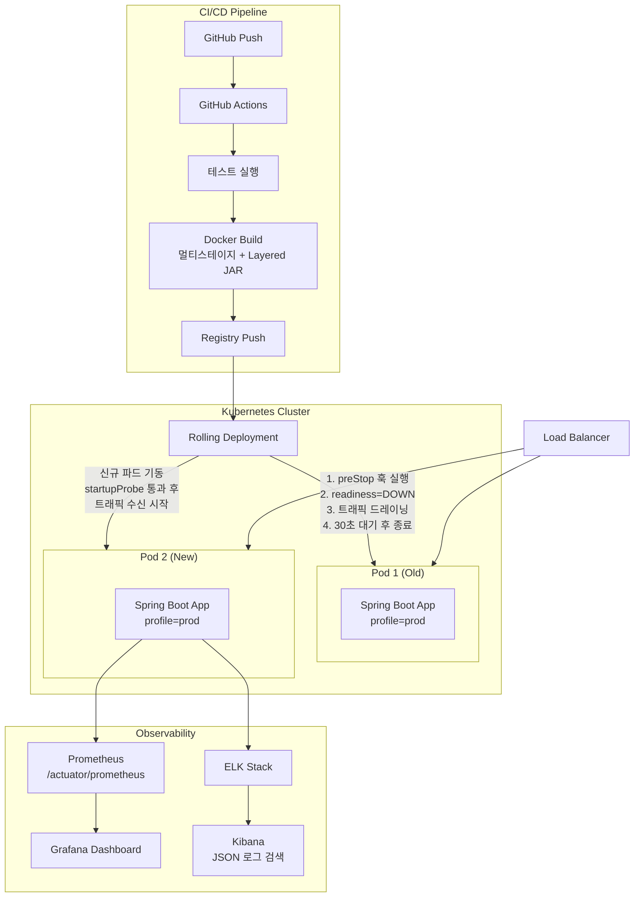

> **spring-boot-deep-dive 시리즈 Part 8/8 — 완결편**
> 지금까지 배운 모든 것을 프로덕션에 올린다.

---

## 들어가며

지금까지 7편에 걸쳐 Spring Boot의 핵심을 파고들었다. 의존성 주입, JPA, Security, Kafka, Redis, 테스트… 이제 남은 건 하나다. **배포하고 운영하는 것**.

코드가 아무리 훌륭해도 배포 과정에서 요청이 끊기거나, 운영 중 상태 파악이 안 되거나, 로그가 뒤죽박죽이면 소용없다. 이번 편에서는 Spring Boot 애플리케이션을 프로덕션에 안전하게 올리는 전 과정을 다룬다.

**다룰 내용:**
1. Docker 멀티스테이지 빌드 + Layered JAR
2. 환경별 프로파일(dev/staging/prod) 설정 전략
3. Spring Boot Actuator — 운영 상태 모니터링
4. Graceful Shutdown — 무중단 롤링 배포
5. 구조적 로깅(Structured Logging) — JSON 로그와 Logback 설정

---

## 1. Docker 멀티스테이지 빌드 + Layered JAR

### 1.1 왜 멀티스테이지 빌드인가?

일반적인 Dockerfile은 이렇게 생겼다:

```dockerfile
# 나쁜 예 — 빌드 도구가 최종 이미지에 그대로 남음
FROM eclipse-temurin:21-jdk
COPY . /app
WORKDIR /app
RUN ./gradlew build
ENTRYPOINT ["java", "-jar", "build/libs/app.jar"]
```

이 방식의 문제:
- **JDK**(~300MB)가 런타임 이미지에 불필요하게 포함
- **Gradle 캐시**, 소스코드, 빌드 중간 산물이 이미지에 남음
- 레이어 캐시 효율이 나쁨 — 코드 한 줄만 바꿔도 전체 의존성 재다운로드

멀티스테이지 빌드는 **빌드 단계**와 **런타임 단계**를 분리한다.

### 1.2 Spring Boot Layered JAR

Spring Boot 2.3+부터 **Layered JAR** 기능이 내장되어 있다. JAR 내부를 레이어로 분리해 Docker 캐시를 극대화한다.

```
app.jar
├── BOOT-INF/
│   ├── layers.idx          ← 레이어 순서 정의
│   ├── lib/                ← 의존성 (거의 변경 없음)
│   ├── classes/            ← 내 코드 (자주 변경)
│   └── classpath.idx
└── META-INF/
```

레이어 순서 (캐시 재사용률이 높은 것 → 낮은 것):
1. `dependencies` — 외부 라이브러리
2. `spring-boot-loader` — Spring Boot 로더
3. `snapshot-dependencies` — SNAPSHOT 의존성
4. `application` — 내 코드

### 1.3 멀티스테이지 Dockerfile 작성

**build.gradle 설정:**

```groovy
// build.gradle
plugins {
    id 'org.springframework.boot' version '3.4.3'
    id 'io.spring.dependency-management' version '1.1.7'
    id 'java'
}

group = 'com.honeybyte'
version = '1.0.0'
sourceCompatibility = '21'

// Layered JAR 활성화 (Spring Boot 3.x는 기본 활성화)
bootJar {
    layered {
        enabled = true
        includeLayerTools = true  // layertools 포함 (레이어 추출에 필요)
    }
}
```

**Dockerfile:**

```dockerfile
# ======================
# Stage 1: Build
# ======================
FROM eclipse-temurin:21-jdk-alpine AS builder

WORKDIR /workspace/app

# 의존성 캐시 최적화 — Gradle wrapper와 설정 파일을 먼저 복사
COPY gradle gradle
COPY gradlew settings.gradle build.gradle ./

# 의존성만 먼저 다운로드 (코드 변경과 독립적으로 캐시됨)
RUN ./gradlew dependencies --no-daemon

# 소스코드 복사 및 빌드
COPY src src
RUN ./gradlew bootJar --no-daemon -x test

# Layered JAR 추출
RUN mkdir -p build/extracted && \
    java -Djarmode=layertools -jar build/libs/*.jar extract \
    --destination build/extracted

# ======================
# Stage 2: Runtime
# ======================
FROM eclipse-temurin:21-jre-alpine AS runtime

# 보안: non-root 사용자 생성
RUN addgroup -S spring && adduser -S spring -G spring
USER spring:spring

WORKDIR /app

# 레이어 순서대로 복사 (캐시 재사용 극대화)
COPY --from=builder /workspace/app/build/extracted/dependencies/ ./
COPY --from=builder /workspace/app/build/extracted/spring-boot-loader/ ./
COPY --from=builder /workspace/app/build/extracted/snapshot-dependencies/ ./
COPY --from=builder /workspace/app/build/extracted/application/ ./

# 헬스체크
HEALTHCHECK --interval=30s --timeout=10s --start-period=60s --retries=3 \
    CMD wget -qO- http://localhost:8080/actuator/health || exit 1

# JVM 최적화 옵션
ENV JAVA_OPTS="-XX:+UseContainerSupport \
               -XX:MaxRAMPercentage=75.0 \
               -XX:+UseG1GC \
               -Djava.security.egd=file:/dev/./urandom"

EXPOSE 8080

ENTRYPOINT ["sh", "-c", "java $JAVA_OPTS org.springframework.boot.loader.launch.JarLauncher"]
```

**이미지 크기 비교:**

| 방식 | 이미지 크기 | 재빌드 시간 (코드만 수정) |
|------|------------|--------------------------|
| Fat JAR (단순) | ~450MB | ~3분 (전체 재빌드) |
| 멀티스테이지 | ~200MB | ~3분 (첫 빌드) |
| 멀티스테이지 + Layered | ~200MB | **~30초** (캐시 활용) |

**빌드 및 실행:**

```bash
# 빌드
docker build -t honeybyte-app:1.0.0 .

# 실행 (개발)
docker run -p 8080:8080 \
  -e SPRING_PROFILES_ACTIVE=dev \
  honeybyte-app:1.0.0

# 실행 (프로덕션)
docker run -d \
  --name honeybyte-app \
  -p 8080:8080 \
  -e SPRING_PROFILES_ACTIVE=prod \
  -e DB_URL=jdbc:postgresql://db:5432/honeybyte \
  -e DB_PASSWORD=${DB_PASSWORD} \
  --restart unless-stopped \
  honeybyte-app:1.0.0
```

---

## 2. 환경별 프로파일 설정 전략

### 2.1 프로파일 구조 설계

Spring Boot의 프로파일은 단순히 `application-dev.yml`을 만드는 것 이상이다. **설정 계층과 책임 분리**를 고려해야 한다.

```
src/main/resources/
├── application.yml           ← 공통 설정 (모든 환경 공유)
├── application-dev.yml       ← 로컬 개발
├── application-staging.yml   ← 스테이징
└── application-prod.yml      ← 프로덕션
```

### 2.2 공통 설정 (application.yml)

```yaml
# application.yml — 공통 설정
spring:
  application:
    name: honeybyte-app

  # 기본 프로파일 (명시적으로 설정하지 않으면 dev)
  profiles:
    default: dev
    group:
      # prod 프로파일 활성화 시 prod + monitoring 함께 활성화
      prod: "prod,monitoring"
      staging: "staging,monitoring"

  # JPA 공통 설정
  jpa:
    open-in-view: false  # OSIV 비활성화 (성능)
    properties:
      hibernate:
        format_sql: false

  # Jackson 공통 설정
  jackson:
    default-property-inclusion: non_null
    serialization:
      write-dates-as-timestamps: false
    deserialization:
      fail-on-unknown-properties: false

# 서버 공통 설정
server:
  port: 8080
  compression:
    enabled: true
    mime-types: application/json,application/xml,text/html,text/plain
    min-response-size: 1024

# 공통 Actuator 설정
management:
  endpoints:
    web:
      exposure:
        include: health,info
  endpoint:
    health:
      show-details: never
```

### 2.3 개발 환경 (application-dev.yml)

```yaml
# application-dev.yml
spring:
  datasource:
    url: jdbc:h2:mem:honeybyte;MODE=PostgreSQL;DB_CLOSE_DELAY=-1
    driver-class-name: org.h2.Driver
    username: sa
    password:

  h2:
    console:
      enabled: true
      path: /h2-console

  jpa:
    show-sql: true
    hibernate:
      ddl-auto: create-drop
    properties:
      hibernate:
        format_sql: true

  # 개발용 캐시 비활성화
  cache:
    type: none

logging:
  level:
    root: INFO
    com.honeybyte: DEBUG
    org.springframework.web: DEBUG
    org.hibernate.SQL: DEBUG
    org.hibernate.orm.jdbc.bind: TRACE  # 파라미터 바인딩 로그

# 개발에서는 Actuator 전체 공개
management:
  endpoints:
    web:
      exposure:
        include: "*"
  endpoint:
    health:
      show-details: always
```

### 2.4 프로덕션 환경 (application-prod.yml)

```yaml
# application-prod.yml
spring:
  datasource:
    url: ${DB_URL}
    username: ${DB_USERNAME}
    password: ${DB_PASSWORD}
    hikari:
      maximum-pool-size: 20
      minimum-idle: 5
      connection-timeout: 30000
      idle-timeout: 600000
      max-lifetime: 1800000
      # 커넥션 검증
      connection-test-query: SELECT 1
      validation-timeout: 5000

  jpa:
    hibernate:
      ddl-auto: validate  # 프로덕션에서는 자동 DDL 금지
    properties:
      hibernate:
        # 배치 처리 최적화
        jdbc.batch_size: 50
        order_inserts: true
        order_updates: true

  # Redis 캐시
  data:
    redis:
      host: ${REDIS_HOST}
      port: 6379
      password: ${REDIS_PASSWORD}
      timeout: 3000ms
      lettuce:
        pool:
          max-active: 16
          max-idle: 8

# 프로덕션 서버 설정
server:
  shutdown: graceful  # Graceful Shutdown 활성화
  tomcat:
    threads:
      max: 200
      min-spare: 10
    accept-count: 100
    connection-timeout: 60000
  # HTTPS (리버스 프록시 뒤에 있다면 생략 가능)
  forward-headers-strategy: native

# 프로덕션 로깅 — JSON 구조화
logging:
  level:
    root: WARN
    com.honeybyte: INFO
  pattern:
    console: ""  # 콘솔 패턴 비활성화 (JSON 포맷터가 처리)
  config: classpath:logback-spring.xml

# Actuator — 보안 설정된 엔드포인트만 공개
management:
  endpoints:
    web:
      base-path: /internal/actuator  # 경로 변경으로 외부 노출 방지
      exposure:
        include: health,info,metrics,prometheus,loggers
  endpoint:
    health:
      show-details: when-authorized
      show-components: when-authorized
    loggers:
      enabled: true
  # Prometheus 메트릭
  prometheus:
    metrics:
      export:
        enabled: true

spring.lifecycle:
  timeout-per-shutdown-phase: 30s
```

### 2.5 @Profile 애너테이션 활용

```java
// 개발 환경에서만 실행되는 데이터 초기화 Bean
@Component
@Profile("dev")
public class DevDataInitializer implements CommandLineRunner {

    private final UserRepository userRepository;
    private final PasswordEncoder passwordEncoder;

    public DevDataInitializer(UserRepository userRepository,
                               PasswordEncoder passwordEncoder) {
        this.userRepository = userRepository;
        this.passwordEncoder = passwordEncoder;
    }

    @Override
    public void run(String... args) {
        if (userRepository.count() == 0) {
            userRepository.save(User.builder()
                .email("admin@honeybyte.dev")
                .password(passwordEncoder.encode("admin1234"))
                .role(Role.ADMIN)
                .build());
            log.info("개발용 초기 데이터 삽입 완료");
        }
    }
}

// 프로파일별 Bean 분기
@Configuration
public class CacheConfig {

    @Bean
    @Profile("!prod")  // 프로덕션이 아닌 환경
    public CacheManager simpleCacheManager() {
        return new ConcurrentMapCacheManager();
    }

    @Bean
    @Profile("prod")  // 프로덕션
    public CacheManager redisCacheManager(RedisConnectionFactory factory) {
        RedisCacheConfiguration config = RedisCacheConfiguration.defaultCacheConfig()
            .entryTtl(Duration.ofMinutes(10))
            .serializeValuesWith(
                RedisSerializationContext.SerializationPair
                    .fromSerializer(new GenericJackson2JsonRedisSerializer())
            );
        return RedisCacheManager.builder(factory)
            .cacheDefaults(config)
            .build();
    }
}
```

---

## 3. Spring Boot Actuator — 운영 상태 모니터링

### 3.1 Actuator 의존성 및 기본 설정

```groovy
// build.gradle
dependencies {
    implementation 'org.springframework.boot:spring-boot-starter-actuator'
    implementation 'io.micrometer:micrometer-registry-prometheus'  // Prometheus 메트릭
}
```

### 3.2 핵심 Actuator 엔드포인트

| 엔드포인트 | 경로 | 용도 |
|-----------|------|------|
| `/actuator/health` | GET | 헬스체크 (로드밸런서용) |
| `/actuator/info` | GET | 앱 메타정보 |
| `/actuator/metrics` | GET | 메트릭 목록 |
| `/actuator/prometheus` | GET | Prometheus 스크래핑 |
| `/actuator/loggers` | GET/POST | 런타임 로그 레벨 변경 |
| `/actuator/env` | GET | 현재 환경 변수 |
| `/actuator/threaddump` | GET | 스레드 덤프 |

### 3.3 커스텀 헬스 인디케이터

```java
@Component
public class DatabaseHealthIndicator implements HealthIndicator {

    private final DataSource dataSource;

    public DatabaseHealthIndicator(DataSource dataSource) {
        this.dataSource = dataSource;
    }

    @Override
    public Health health() {
        try (Connection conn = dataSource.getConnection()) {
            PreparedStatement ps = conn.prepareStatement("SELECT 1");
            ResultSet rs = ps.executeQuery();

            if (rs.next()) {
                return Health.up()
                    .withDetail("database", "PostgreSQL")
                    .withDetail("status", "Connected")
                    .build();
            }
        } catch (Exception e) {
            return Health.down()
                .withDetail("error", e.getMessage())
                .build();
        }
        return Health.unknown().build();
    }
}

// 외부 API 헬스체크
@Component
public class ExternalApiHealthIndicator implements HealthIndicator {

    private final RestTemplate restTemplate;
    private final String externalApiUrl;

    @Override
    public Health health() {
        try {
            ResponseEntity<String> response = restTemplate.getForEntity(
                externalApiUrl + "/ping", String.class
            );
            if (response.getStatusCode().is2xxSuccessful()) {
                return Health.up()
                    .withDetail("externalApi", externalApiUrl)
                    .withDetail("responseTime", "OK")
                    .build();
            }
        } catch (Exception e) {
            return Health.down()
                .withDetail("externalApi", externalApiUrl)
                .withDetail("error", e.getMessage())
                .build();
        }
        return Health.down().build();
    }
}
```

**헬스체크 응답 예시:**

```json
{
  "status": "UP",
  "components": {
    "db": {
      "status": "UP",
      "details": {
        "database": "PostgreSQL",
        "status": "Connected"
      }
    },
    "redis": {
      "status": "UP"
    },
    "diskSpace": {
      "status": "UP",
      "details": {
        "total": 107374182400,
        "free": 52428800000,
        "threshold": 10485760
      }
    }
  }
}
```

### 3.4 커스텀 메트릭

```java
@Service
public class OrderService {

    private final Counter orderCreatedCounter;
    private final Counter orderFailedCounter;
    private final Timer orderProcessingTimer;
    private final Gauge activeOrdersGauge;
    private final AtomicInteger activeOrders = new AtomicInteger(0);

    public OrderService(MeterRegistry registry) {
        this.orderCreatedCounter = Counter.builder("orders.created.total")
            .description("총 주문 생성 수")
            .tag("service", "order")
            .register(registry);

        this.orderFailedCounter = Counter.builder("orders.failed.total")
            .description("총 주문 실패 수")
            .register(registry);

        this.orderProcessingTimer = Timer.builder("orders.processing.duration")
            .description("주문 처리 시간")
            .publishPercentiles(0.5, 0.95, 0.99)  // p50, p95, p99
            .register(registry);

        this.activeOrdersGauge = Gauge.builder("orders.active", activeOrders, AtomicInteger::get)
            .description("현재 처리 중인 주문 수")
            .register(registry);
    }

    public OrderResponse createOrder(CreateOrderRequest request) {
        return orderProcessingTimer.record(() -> {
            activeOrders.incrementAndGet();
            try {
                // 주문 처리 로직
                OrderResponse response = processOrder(request);
                orderCreatedCounter.increment();
                return response;
            } catch (Exception e) {
                orderFailedCounter.increment();
                throw e;
            } finally {
                activeOrders.decrementAndGet();
            }
        });
    }
}
```

### 3.5 Actuator 보안

```java
@Configuration
@EnableWebSecurity
public class ActuatorSecurityConfig {

    @Bean
    @Order(1)  // 일반 보안 설정보다 먼저 적용
    public SecurityFilterChain actuatorSecurityFilterChain(HttpSecurity http) throws Exception {
        http
            .securityMatcher("/internal/actuator/**")
            .authorizeHttpRequests(auth -> auth
                .requestMatchers("/internal/actuator/health").permitAll()
                .requestMatchers("/internal/actuator/prometheus").hasRole("MONITORING")
                .anyRequest().hasRole("ADMIN")
            )
            .httpBasic(Customizer.withDefaults())
            .csrf(csrf -> csrf.disable());
        return http.build();
    }
}
```

---

## 4. Graceful Shutdown — 무중단 롤링 배포

### 4.1 왜 Graceful Shutdown인가?



### 4.2 설정

```yaml
# application-prod.yml
server:
  shutdown: graceful  # 핵심 설정

spring:
  lifecycle:
    timeout-per-shutdown-phase: 30s  # 최대 대기 시간
```

### 4.3 Shutdown Hook 커스터마이징

```java
@Component
@Slf4j
public class AppShutdownHook implements DisposableBean {

    private final MessageQueueService messageQueueService;
    private final SchedulerService schedulerService;

    @Override
    public void destroy() throws Exception {
        log.info("애플리케이션 종료 시작 — 리소스 정리 중");

        // 1. 스케줄러 중단 (새 작업 받지 않음)
        schedulerService.shutdown();

        // 2. 메시지 큐 처리 완료 대기
        messageQueueService.drainAndStop();

        log.info("리소스 정리 완료 — 종료 진행");
    }
}

// Kubernetes preStop hook 대응 — 트래픽 드레이닝 지원
@RestController
@RequestMapping("/internal")
public class LifecycleController {

    private volatile boolean accepting = true;

    // Kubernetes preStop hook이 이 엔드포인트를 호출
    @PostMapping("/pre-stop")
    public ResponseEntity<Void> preStop() throws InterruptedException {
        log.info("preStop 호출 — 트래픽 수락 중단");
        accepting = false;
        // 로드밸런서가 라우팅 테이블에서 제거할 시간을 줌
        Thread.sleep(5000);
        return ResponseEntity.ok().build();
    }

    @GetMapping("/actuator/health/readiness")
    public ResponseEntity<Map<String, String>> readiness() {
        if (accepting) {
            return ResponseEntity.ok(Map.of("status", "UP"));
        }
        return ResponseEntity.status(503).body(Map.of("status", "OUT_OF_SERVICE"));
    }
}
```

### 4.4 Kubernetes 배포 설정

```yaml
# deployment.yaml
apiVersion: apps/v1
kind: Deployment
metadata:
  name: honeybyte-app
spec:
  replicas: 3
  strategy:
    type: RollingUpdate
    rollingUpdate:
      maxSurge: 1        # 동시에 최대 1개 추가
      maxUnavailable: 0  # 항상 모든 파드 유지
  template:
    spec:
      terminationGracePeriodSeconds: 60  # SIGTERM 후 SIGKILL까지 대기
      containers:
        - name: honeybyte-app
          image: honeybyte-app:1.0.0
          ports:
            - containerPort: 8080
          env:
            - name: SPRING_PROFILES_ACTIVE
              value: "prod"

          # 시작 프로브 — 앱이 완전히 뜰 때까지 대기
          startupProbe:
            httpGet:
              path: /actuator/health/liveness
              port: 8080
            failureThreshold: 30  # 최대 5분 대기 (30 * 10s)
            periodSeconds: 10

          # 활성 프로브 — 비정상 감지 시 재시작
          livenessProbe:
            httpGet:
              path: /actuator/health/liveness
              port: 8080
            initialDelaySeconds: 0
            periodSeconds: 10
            failureThreshold: 3

          # 준비 프로브 — 트래픽 수신 준비 여부
          readinessProbe:
            httpGet:
              path: /actuator/health/readiness
              port: 8080
            initialDelaySeconds: 0
            periodSeconds: 5
            failureThreshold: 3

          # Graceful Shutdown을 위한 preStop
          lifecycle:
            preStop:
              exec:
                command: ["/bin/sh", "-c", "sleep 10"]  # 로드밸런서 드레이닝 대기

          resources:
            requests:
              memory: "512Mi"
              cpu: "250m"
            limits:
              memory: "1Gi"
              cpu: "1000m"
```

### 4.5 Docker Compose 로컬 테스트

```yaml
# docker-compose.yml
version: '3.8'

services:
  app:
    build: .
    ports:
      - "8080:8080"
    environment:
      SPRING_PROFILES_ACTIVE: dev
    depends_on:
      db:
        condition: service_healthy
      redis:
        condition: service_healthy
    healthcheck:
      test: ["CMD", "wget", "-qO-", "http://localhost:8080/actuator/health"]
      interval: 30s
      timeout: 10s
      retries: 3
      start_period: 60s

  db:
    image: postgres:16-alpine
    environment:
      POSTGRES_DB: honeybyte
      POSTGRES_USER: honeybyte
      POSTGRES_PASSWORD: honeybyte123
    volumes:
      - postgres_data:/var/lib/postgresql/data
    healthcheck:
      test: ["CMD-SHELL", "pg_isready -U honeybyte"]
      interval: 10s
      timeout: 5s
      retries: 5

  redis:
    image: redis:7-alpine
    command: redis-server --save 20 1 --loglevel warning
    volumes:
      - redis_data:/data
    healthcheck:
      test: ["CMD", "redis-cli", "ping"]
      interval: 10s
      timeout: 5s
      retries: 5

volumes:
  postgres_data:
  redis_data:
```

---

## 5. 구조적 로깅 (Structured Logging)

### 5.1 왜 JSON 로그인가?

개발환경에서는 사람이 읽는 로그가 편하지만, 프로덕션에서는 **기계가 파싱하는 로그**가 필요하다.

```
# 텍스트 로그 (Splunk, ELK에서 파싱 어려움)
2026-03-26 14:35:22.123 ERROR 12345 --- [http-nio-8080-exec-1] c.h.service.OrderService : 주문 처리 실패 orderId=ORD-001 userId=42

# JSON 로그 (즉시 인덱싱, 검색 가능)
{"timestamp":"2026-03-26T14:35:22.123Z","level":"ERROR","thread":"http-nio-8080-exec-1","logger":"c.h.service.OrderService","message":"주문 처리 실패","orderId":"ORD-001","userId":42,"traceId":"abc123"}
```

### 5.2 Logback 설정 (logback-spring.xml)

```xml
<?xml version="1.0" encoding="UTF-8"?>
<configuration>

    <!-- Spring 프로파일별 설정 분기 -->
    <springProfile name="dev">
        <!-- 개발: 컬러 텍스트 로그 -->
        <appender name="CONSOLE" class="ch.qos.logback.core.ConsoleAppender">
            <encoder>
                <pattern>%clr(%d{HH:mm:ss.SSS}){faint} %clr(%5p) %clr(${PID:- }){magenta} %clr(---){faint} %clr([%15.15t]){faint} %clr(%-40.40logger{39}){cyan} %clr(:){faint} %m%n%throwable</pattern>
            </encoder>
        </appender>

        <root level="INFO">
            <appender-ref ref="CONSOLE"/>
        </root>
    </springProfile>

    <springProfile name="prod,staging">
        <!-- 프로덕션/스테이징: JSON 구조화 로그 -->
        <appender name="JSON_CONSOLE" class="ch.qos.logback.core.ConsoleAppender">
            <encoder class="net.logstash.logback.encoder.LogstashEncoder">
                <!-- 기본 필드 커스터마이징 -->
                <fieldNames>
                    <timestamp>timestamp</timestamp>
                    <version>[ignore]</version>
                    <levelValue>[ignore]</levelValue>
                </fieldNames>

                <!-- 앱 공통 필드 추가 -->
                <customFields>{"app":"honeybyte-app","env":"${spring.profiles.active}"}</customFields>

                <!-- 예외 스택트레이스 포함 -->
                <throwableConverter class="net.logstash.logback.stacktrace.ShortenedThrowableConverter">
                    <maxDepthPerCause>10</maxDepthPerCause>
                    <shortenedClassNameLength>20</shortenedClassNameLength>
                    <rootCauseFirst>true</rootCauseFirst>
                </throwableConverter>
            </encoder>
        </appender>

        <!-- 파일 로그 (롤링) -->
        <appender name="FILE" class="ch.qos.logback.core.rolling.RollingFileAppender">
            <file>/var/log/honeybyte/app.log</file>
            <rollingPolicy class="ch.qos.logback.core.rolling.TimeBasedRollingPolicy">
                <fileNamePattern>/var/log/honeybyte/app.%d{yyyy-MM-dd}.%i.log.gz</fileNamePattern>
                <maxFileSize>100MB</maxFileSize>
                <maxHistory>30</maxHistory>
                <totalSizeCap>3GB</totalSizeCap>
            </rollingPolicy>
            <encoder class="net.logstash.logback.encoder.LogstashEncoder"/>
        </appender>

        <root level="WARN">
            <appender-ref ref="JSON_CONSOLE"/>
            <appender-ref ref="FILE"/>
        </root>

        <logger name="com.honeybyte" level="INFO"/>
    </springProfile>

</configuration>
```

**build.gradle에 logstash 인코더 추가:**

```groovy
dependencies {
    implementation 'net.logstash.logback:logstash-logback-encoder:8.0'
}
```

### 5.3 MDC (Mapped Diagnostic Context) — 요청 추적

```java
// 모든 요청에 traceId, userId를 자동으로 MDC에 추가
@Component
@Order(Ordered.HIGHEST_PRECEDENCE)
public class RequestLoggingFilter implements Filter {

    @Override
    public void doFilter(ServletRequest request, ServletResponse response, FilterChain chain)
            throws IOException, ServletException {

        HttpServletRequest httpRequest = (HttpServletRequest) request;

        // 분산 추적 ID (없으면 생성)
        String traceId = Optional.ofNullable(httpRequest.getHeader("X-Trace-Id"))
            .orElse(UUID.randomUUID().toString().substring(0, 8));

        try {
            MDC.put("traceId", traceId);
            MDC.put("method", httpRequest.getMethod());
            MDC.put("uri", httpRequest.getRequestURI());

            // 인증된 사용자 정보 추가
            Authentication auth = SecurityContextHolder.getContext().getAuthentication();
            if (auth != null && auth.isAuthenticated()) {
                MDC.put("userId", auth.getName());
            }

            chain.doFilter(request, response);
        } finally {
            MDC.clear();  // 반드시 클리어 (스레드 풀 재사용 시 오염 방지)
        }
    }
}

// 서비스에서 구조화된 로그 출력
@Service
@Slf4j
public class OrderService {

    public OrderResponse createOrder(CreateOrderRequest request) {
        // MDC에 컨텍스트 추가
        MDC.put("orderId", request.getOrderId());

        log.info("주문 생성 시작",
            // logstash-logback-encoder의 구조화 인수
            StructuredArguments.kv("customerId", request.getCustomerId()),
            StructuredArguments.kv("amount", request.getAmount()),
            StructuredArguments.kv("itemCount", request.getItems().size())
        );

        try {
            OrderResponse response = processOrder(request);
            log.info("주문 생성 완료",
                StructuredArguments.kv("orderId", response.getId()),
                StructuredArguments.kv("processingTimeMs", response.getProcessingTime())
            );
            return response;
        } catch (InsufficientStockException e) {
            log.warn("재고 부족으로 주문 실패",
                StructuredArguments.kv("productId", e.getProductId()),
                StructuredArguments.kv("requested", e.getRequested()),
                StructuredArguments.kv("available", e.getAvailable())
            );
            throw e;
        } finally {
            MDC.remove("orderId");
        }
    }
}
```

**JSON 로그 출력 예시:**

```json
{
  "timestamp": "2026-03-26T14:35:22.123Z",
  "level": "INFO",
  "thread": "http-nio-8080-exec-5",
  "logger": "c.h.service.OrderService",
  "message": "주문 생성 완료",
  "app": "honeybyte-app",
  "env": "prod",
  "traceId": "a3f9b2c1",
  "userId": "user@honeybyte.com",
  "method": "POST",
  "uri": "/api/orders",
  "orderId": "ORD-20260326-001",
  "processingTimeMs": 127
}
```

### 5.4 런타임 로그 레벨 변경

배포 없이 특정 패키지의 로그 레벨을 실시간으로 변경할 수 있다:

```bash
# 현재 로그 레벨 확인
curl http://localhost:8080/internal/actuator/loggers/com.honeybyte

# 응답
{
  "configuredLevel": "INFO",
  "effectiveLevel": "INFO"
}

# DEBUG로 변경 (트러블슈팅 시)
curl -X POST \
  http://localhost:8080/internal/actuator/loggers/com.honeybyte \
  -H "Content-Type: application/json" \
  -d '{"configuredLevel": "DEBUG"}'

# 원복
curl -X POST \
  http://localhost:8080/internal/actuator/loggers/com.honeybyte \
  -H "Content-Type: application/json" \
  -d '{"configuredLevel": "INFO"}'
```

---

## 6. 전체 배포 아키텍처



---

## 마치며

Spring Boot 배포와 운영의 핵심을 정리하면:

1. **Docker 멀티스테이지 빌드 + Layered JAR** — 이미지 크기 절반, 재빌드 시간 90% 단축
2. **환경별 프로파일** — 공통 설정 상속 + 환경 특화 오버라이드, 환경 변수로 비밀값 분리
3. **Actuator** — 헬스체크, 커스텀 메트릭, 런타임 로그 레벨 변경
4. **Graceful Shutdown** — 30초 대기, readiness 프로브 연동, preStop 훅으로 완전한 무중단
5. **구조화 로그** — JSON + MDC로 분산 추적 가능한 로그 체계

> 코드는 로컬에서 돌아가도 충분하지 않다. 프로덕션에서 안정적으로 돌아가야 진짜다.

---

**spring-boot-deep-dive 시리즈 완결.**
Part 1~8을 통해 Spring Boot의 핵심 — DI부터 배포까지 — 을 모두 다뤘다.
다음엔 무엇을 파고들까?

---

*HoneyByte | 깊이 있는 개발 이야기*
