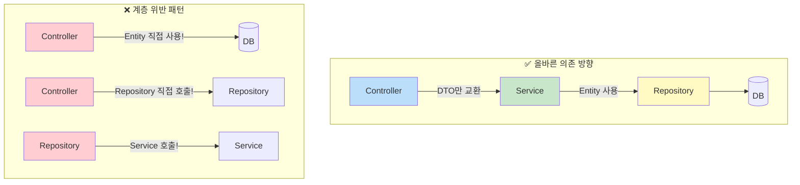

> Controller가 Repository를 직접 호출하면 왜 나쁜가? DTO와 Entity를 왜 분리해야 하는가? `@Transactional(readOnly = true)`가 성능에 왜 도움이 되는가? — '그냥 그렇게 한다'가 아닌, 이유를 완전히 이해하는 레이어드 아키텍처.

## 핵심 요약 (TL;DR)

Spring Boot의 표준 **3-Tier Layered Architecture**는 `Controller → Service → Repository` 흐름으로 각 계층이 명확한 책임을 가진다. **Entity는 DB 매핑 객체**이고 **DTO는 계층 간 데이터 운반 객체**로 역할이 다르다 — Controller에 Entity를 노출하면 API 계약이 DB 스키마에 종속된다. `@Transactional`은 Service 계층에서 비즈니스 단위로 선언하고, 조회는 `readOnly = true`로 성능을 최적화한다. 2025년 기준 Java `record`를 DTO로 사용하면 Lombok 없이도 불변 DTO를 간결하게 작성할 수 있다.

---

## 왜 계층을 분리하는가

### 계층 없는 코드의 붕괴

```java
// ❌ Bad: Controller가 모든 것을 다 하는 경우
@RestController
public class BadUserController {

    @Autowired
    private EntityManager em;  // Controller가 직접 DB 접근

    @GetMapping("/users/{id}")
    public User getUser(@PathVariable Long id) {
        User user = em.find(User.class, id);  // DB 쿼리 직접
        user.setPassword(null);  // 보안 처리도 여기서
        // 비즈니스 로직도 여기, 검증도 여기, 변환도 여기...
        return user;  // Entity를 그대로 JSON으로 반환 — DB 스키마 노출!
    }
}
```

**문제점:**
1. **테스트 불가** — Controller 테스트에 DB 연결 필수
2. **재사용 불가** — 동일 로직이 다른 Controller에서 중복
3. **보안 위험** — Entity의 모든 필드(password, 내부 ID 등) 노출
4. **변경 파급** — DB 컬럼명 변경 → API 응답 변경 → 클라이언트 깨짐
5. **트랜잭션 관리 불가** — Controller에서 트랜잭션 범위 설정 어려움

### 계층 분리 후

```mermaid
graph LR
    Client((🌐 Client))

    subgraph "Presentation Layer"
        C["@RestController\n① HTTP 요청 수신\n② 요청 DTO 검증(@Valid)\n③ Service 호출\n④ 응답 DTO 반환"]
    end

    subgraph "Business Layer"
        S["@Service\n① 비즈니스 규칙 적용\n② 트랜잭션 관리\n③ 여러 Repository 조율\n④ Entity ↔ DTO 변환"]
    end

    subgraph "Persistence Layer"
        R["@Repository\n① CRUD 쿼리 실행\n② DataAccessException 변환\n③ JPA/JDBC 추상화"]
    end

    subgraph "DB"
        DB[(🗄️ Database)]
    end

    Client -- "RequestDTO (JSON)" --> C
    C -- "Command/Query" --> S
    S -- "Entity (JPA)" --> R
    R <--> DB
    R -- "Entity (JPA)" --> S
    S -- "ResponseDTO" --> C
    C -- "ResponseDTO (JSON)" --> Client

    style C fill:#bbdefb,stroke:#1976d2
    style S fill:#c8e6c9,stroke:#388e3c
    style R fill:#fff9c4,stroke:#f9a825
    style DB fill:#f5f5f5,stroke:#757575
```

**각 계층의 책임과 '알아야 하는 것'의 범위:**

| 계층 | 알아야 하는 것 | 몰라야 하는 것 |
|------|--------------|--------------|
| Controller | HTTP 요청/응답, RequestDTO, ResponseDTO | DB 구조, 비즈니스 규칙 |
| Service | 비즈니스 규칙, Entity, DTO | HTTP 프로토콜, DB 쿼리 방법 |
| Repository | DB 쿼리, Entity 매핑 | 비즈니스 로직, HTTP |

---

## 환경 설정

### `build.gradle.kts`

```kotlin
dependencies {
    implementation("org.springframework.boot:spring-boot-starter-web")
    implementation("org.springframework.boot:spring-boot-starter-data-jpa")
    implementation("org.springframework.boot:spring-boot-starter-validation")  // @Valid 지원
    runtimeOnly("com.h2database:h2")  // 개발용 인메모리 DB
    compileOnly("org.projectlombok:lombok")
    annotationProcessor("org.projectlombok:lombok")
    testImplementation("org.springframework.boot:spring-boot-starter-test")
}
```

### `application.yml`

```yaml
spring:
  datasource:
    url: jdbc:h2:mem:honeydb
    driver-class-name: org.h2.Driver
    username: sa
    password:
  h2:
    console:
      enabled: true
      path: /h2-console
  jpa:
    hibernate:
      ddl-auto: create-drop  # 앱 시작/종료 시 스키마 생성/삭제
    show-sql: true
    properties:
      hibernate:
        format_sql: true
        default_batch_fetch_size: 100  # N+1 완화
```

---

## 구현 — 상품(Product) CRUD API

### 1. Entity — DB와 매핑되는 핵심 객체

```java
// src/main/java/com/honeybarrel/honeyapi/product/Product.java
package com.honeybarrel.honeyapi.product;

import jakarta.persistence.*;
import lombok.AccessLevel;
import lombok.Builder;
import lombok.Getter;
import lombok.NoArgsConstructor;
import org.springframework.data.annotation.CreatedDate;
import org.springframework.data.annotation.LastModifiedDate;
import org.springframework.data.jpa.domain.support.AuditingEntityListener;

import java.math.BigDecimal;
import java.time.LocalDateTime;

/**
 * Product Entity.
 *
 * 설계 원칙:
 * - Setter 공개 금지 → 비즈니스 메서드로 상태 변경 (Aggregate 패턴)
 * - Builder로 생성
 * - JPA Auditing으로 생성/수정 시각 자동 관리
 */
@Entity
@Table(name = "products")
@EntityListeners(AuditingEntityListener.class)  // Auditing 활성화
@Getter
@NoArgsConstructor(access = AccessLevel.PROTECTED)  // JPA 기본 생성자 (외부 호출 금지)
public class Product {

    @Id
    @GeneratedValue(strategy = GenerationType.IDENTITY)
    private Long id;

    @Column(nullable = false, length = 200)
    private String name;

    @Column(nullable = false)
    private String description;

    @Column(nullable = false, precision = 12, scale = 2)
    private BigDecimal price;

    @Column(nullable = false)
    private int stockQuantity;

    @Enumerated(EnumType.STRING)
    @Column(nullable = false)
    private ProductStatus status;

    @CreatedDate
    @Column(updatable = false)
    private LocalDateTime createdAt;

    @LastModifiedDate
    private LocalDateTime updatedAt;

    // ── Builder ──────────────────────────────────────────────
    @Builder
    private Product(String name, String description, BigDecimal price, int stockQuantity) {
        this.name = name;
        this.description = description;
        this.price = price;
        this.stockQuantity = stockQuantity;
        this.status = ProductStatus.ACTIVE;  // 생성 시 기본값 설정
    }

    // ── 비즈니스 메서드 (Setter 대신) ──────────────────────────
    /**
     * 상품 정보 수정.
     * Entity 스스로 상태 변경 책임 — 외부에서 setName() 같은 개별 Setter 호출 방지.
     */
    public void update(String name, String description, BigDecimal price) {
        if (name != null && !name.isBlank()) this.name = name;
        if (description != null) this.description = description;
        if (price != null && price.compareTo(BigDecimal.ZERO) > 0) this.price = price;
    }

    /** 재고 감소 — 비즈니스 규칙(0 미만 불가)을 Entity가 보호 */
    public void decreaseStock(int quantity) {
        if (this.stockQuantity < quantity) {
            throw new IllegalStateException(
                "재고 부족: 요청=" + quantity + ", 현재=" + this.stockQuantity
            );
        }
        this.stockQuantity -= quantity;
    }

    /** 재고 증가 */
    public void increaseStock(int quantity) {
        if (quantity <= 0) throw new IllegalArgumentException("증가량은 양수여야 합니다");
        this.stockQuantity += quantity;
    }

    /** 상품 비활성화 */
    public void deactivate() {
        this.status = ProductStatus.INACTIVE;
    }

    public boolean isActive() {
        return this.status == ProductStatus.ACTIVE;
    }
}
```

```java
// src/main/java/com/honeybarrel/honeyapi/product/ProductStatus.java
package com.honeybarrel.honeyapi.product;

public enum ProductStatus {
    ACTIVE, INACTIVE, DISCONTINUED
}
```

```java
// JPA Auditing 활성화
// src/main/java/com/honeybarrel/honeyapi/config/JpaConfig.java
package com.honeybarrel.honeyapi.config;

import org.springframework.context.annotation.Configuration;
import org.springframework.data.jpa.repository.config.EnableJpaAuditing;

@Configuration
@EnableJpaAuditing
public class JpaConfig {}
```

### 2. DTO — 계층 간 데이터 운반 전용

```java
// src/main/java/com/honeybarrel/honeyapi/product/dto/ProductDto.java
package com.honeybarrel.honeyapi.product.dto;

import com.honeybarrel.honeyapi.product.Product;
import com.honeybarrel.honeyapi.product.ProductStatus;
import jakarta.validation.constraints.*;
import java.math.BigDecimal;
import java.time.LocalDateTime;

/**
 * Product 계층 간 DTO 모음.
 *
 * 2025년 모던 Java: record 사용 — Lombok 없이 불변 DTO
 * record는 @Getter, @AllArgsConstructor, equals(), hashCode(), toString() 자동 생성
 */
public class ProductDto {

    // ── 생성 요청 ─────────────────────────────────────────────
    public record CreateRequest(
        @NotBlank(message = "상품명은 필수입니다")
        @Size(max = 200, message = "상품명은 200자 이하여야 합니다")
        String name,

        @NotBlank(message = "상품 설명은 필수입니다")
        String description,

        @NotNull(message = "가격은 필수입니다")
        @DecimalMin(value = "0.01", message = "가격은 0보다 커야 합니다")
        BigDecimal price,

        @Min(value = 0, message = "초기 재고는 0 이상이어야 합니다")
        int initialStock
    ) {
        /** DTO → Entity 변환 — 변환 책임을 DTO가 가져도 됨 (팀 컨벤션에 따라 Service에 두기도) */
        public Product toEntity() {
            return Product.builder()
                    .name(name)
                    .description(description)
                    .price(price)
                    .stockQuantity(initialStock)
                    .build();
        }
    }

    // ── 수정 요청 ─────────────────────────────────────────────
    public record UpdateRequest(
        String name,        // null이면 수정 안 함
        String description,
        BigDecimal price
    ) {}

    // ── 단건 응답 ─────────────────────────────────────────────
    public record Response(
        Long id,
        String name,
        String description,
        BigDecimal price,
        int stockQuantity,
        ProductStatus status,
        LocalDateTime createdAt,
        LocalDateTime updatedAt
    ) {
        /** Entity → DTO 변환 정적 팩토리 */
        public static Response from(Product product) {
            return new Response(
                    product.getId(),
                    product.getName(),
                    product.getDescription(),
                    product.getPrice(),
                    product.getStockQuantity(),
                    product.getStatus(),
                    product.getCreatedAt(),
                    product.getUpdatedAt()
            );
        }
    }

    // ── 목록 응답 (필드 축소) ──────────────────────────────────
    public record SummaryResponse(
        Long id,
        String name,
        BigDecimal price,
        int stockQuantity,
        ProductStatus status
    ) {
        public static SummaryResponse from(Product product) {
            return new SummaryResponse(
                    product.getId(),
                    product.getName(),
                    product.getPrice(),
                    product.getStockQuantity(),
                    product.getStatus()
            );
        }
    }

    // ── 재고 변경 요청 ────────────────────────────────────────
    public record StockRequest(
        @NotNull String operation,  // "INCREASE" | "DECREASE"
        @Min(1) int quantity
    ) {}
}
```

> **왜 DTO와 Entity를 분리하는가:**
> - Entity는 DB 스키마와 1:1 대응 — API 응답 형식과 다를 수 있음
> - Entity에는 민감 정보(password hash 등)가 있을 수 있음
> - API 버전이 바뀌어도 Entity 구조 유지 가능 (응답 DTO만 수정)
> - 목록 API는 `SummaryResponse`(필드 축소), 단건 API는 `Response`(전체) — 용도별 최적화

### 3. Repository — JPA 데이터 접근

```java
// src/main/java/com/honeybarrel/honeyapi/product/ProductRepository.java
package com.honeybarrel.honeyapi.product;

import com.honeybarrel.honeyapi.product.dto.ProductDto;
import org.springframework.data.domain.Page;
import org.springframework.data.domain.Pageable;
import org.springframework.data.jpa.repository.JpaRepository;
import org.springframework.data.jpa.repository.Modifying;
import org.springframework.data.jpa.repository.Query;
import org.springframework.data.repository.query.Param;
import org.springframework.stereotype.Repository;

import java.math.BigDecimal;
import java.util.List;

@Repository
public interface ProductRepository extends JpaRepository<Product, Long> {

    // 1. 쿼리 메서드 — 메서드 이름으로 쿼리 자동 생성
    List<Product> findByStatusOrderByCreatedAtDesc(ProductStatus status);

    Page<Product> findByStatus(ProductStatus status, Pageable pageable);

    List<Product> findByPriceBetween(BigDecimal min, BigDecimal max);

    boolean existsByName(String name);

    // 2. JPQL — 객체 지향 쿼리 (테이블명이 아닌 Entity명 사용)
    @Query("SELECT p FROM Product p WHERE p.stockQuantity < :threshold AND p.status = 'ACTIVE'")
    List<Product> findLowStockProducts(@Param("threshold") int threshold);

    // 3. Native SQL — 복잡한 집계 등 JPQL로 표현 어려울 때
    @Query(value = """
            SELECT status, COUNT(*) as count, AVG(price) as avgPrice
            FROM products
            GROUP BY status
            """, nativeQuery = true)
    List<Object[]> getStatusStatistics();

    // 4. @Modifying — UPDATE/DELETE 쿼리 (Entity 조회 없이 벌크 업데이트)
    @Modifying
    @Query("UPDATE Product p SET p.status = 'INACTIVE' WHERE p.stockQuantity = 0")
    int deactivateOutOfStockProducts();
}
```

### 4. Service — 비즈니스 로직과 트랜잭션 관리

```java
// src/main/java/com/honeybarrel/honeyapi/product/ProductService.java
package com.honeybarrel.honeyapi.product;

import com.honeybarrel.honeyapi.product.dto.ProductDto;
import lombok.RequiredArgsConstructor;
import lombok.extern.slf4j.Slf4j;
import org.springframework.data.domain.Page;
import org.springframework.data.domain.Pageable;
import org.springframework.stereotype.Service;
import org.springframework.transaction.annotation.Transactional;

import java.util.List;

/**
 * Product 비즈니스 로직.
 *
 * @Transactional(readOnly = true) 클래스 기본:
 * - 읽기 전용 트랜잭션 → Hibernate dirty checking 비활성화 → 성능 향상
 * - 실수로 데이터 변경 방지 (명시적으로 readOnly = false인 메서드만 쓰기 허용)
 *
 * 쓰기 메서드에는 @Transactional (readOnly = false, 기본값) 재선언
 */
@Slf4j
@Service
@RequiredArgsConstructor
@Transactional(readOnly = true)  // ← 클래스 기본: 읽기 전용
public class ProductService {

    private final ProductRepository productRepository;

    // ══════════════════════════════════════════════════════
    // 조회 (readOnly = true 상속)
    // ══════════════════════════════════════════════════════

    public ProductDto.Response getProduct(Long id) {
        Product product = findProductOrThrow(id);
        return ProductDto.Response.from(product);
    }

    public Page<ProductDto.SummaryResponse> getActiveProducts(Pageable pageable) {
        return productRepository.findByStatus(ProductStatus.ACTIVE, pageable)
                .map(ProductDto.SummaryResponse::from);
    }

    public List<ProductDto.SummaryResponse> getLowStockProducts(int threshold) {
        return productRepository.findLowStockProducts(threshold)
                .stream()
                .map(ProductDto.SummaryResponse::from)
                .toList();
    }

    // ══════════════════════════════════════════════════════
    // 쓰기 (@Transactional — readOnly = false, 기본)
    // ══════════════════════════════════════════════════════

    @Transactional  // 쓰기 트랜잭션으로 오버라이드
    public ProductDto.Response createProduct(ProductDto.CreateRequest request) {
        // 비즈니스 규칙: 중복 상품명 검증
        if (productRepository.existsByName(request.name())) {
            throw new IllegalArgumentException("이미 존재하는 상품명입니다: " + request.name());
        }

        Product product = request.toEntity();
        Product saved = productRepository.save(product);

        log.info("상품 생성: id={}, name={}", saved.getId(), saved.getName());
        return ProductDto.Response.from(saved);
    }

    @Transactional
    public ProductDto.Response updateProduct(Long id, ProductDto.UpdateRequest request) {
        Product product = findProductOrThrow(id);

        product.update(request.name(), request.description(), request.price());
        // save() 호출 불필요 — @Transactional 범위 내에서 Dirty Checking이 자동으로 UPDATE 실행

        return ProductDto.Response.from(product);
    }

    @Transactional
    public ProductDto.Response adjustStock(Long id, ProductDto.StockRequest request) {
        Product product = findProductOrThrow(id);

        switch (request.operation().toUpperCase()) {
            case "INCREASE" -> product.increaseStock(request.quantity());
            case "DECREASE" -> product.decreaseStock(request.quantity()); // 재고 부족 시 예외
            default -> throw new IllegalArgumentException("알 수 없는 재고 조작: " + request.operation());
        }

        log.info("재고 조정: id={}, op={}, qty={}, remaining={}",
                id, request.operation(), request.quantity(), product.getStockQuantity());
        return ProductDto.Response.from(product);
    }

    @Transactional
    public void deleteProduct(Long id) {
        Product product = findProductOrThrow(id);
        product.deactivate();  // 물리 삭제 대신 논리 삭제 (soft delete)
        log.info("상품 비활성화: id={}", id);
    }

    // ── 내부 헬퍼 ──────────────────────────────────────────
    private Product findProductOrThrow(Long id) {
        return productRepository.findById(id)
                .orElseThrow(() -> new IllegalArgumentException(
                        "상품을 찾을 수 없습니다. id=" + id));
    }
}
```

**`@Transactional(readOnly = true)` 성능 이유:**

```
readOnly = true 효과:
1. Hibernate Session flush 모드 → MANUAL
   → Dirty Checking(변경 감지) 완전 비활성화
   → 트랜잭션 커밋 시 Entity 상태 비교 과정 생략

2. DB 드라이버/커넥션 풀에 힌트 전달
   → 일부 DB(MySQL replication 등)에서 Read Replica로 라우팅 가능

3. 실수로 데이터 변경 시 예외 발생
   → 클래스에 readOnly = true, 쓰기 메서드에만 @Transactional 선언 패턴
```

### 5. 예외 처리 — `@RestControllerAdvice`

```java
// src/main/java/com/honeybarrel/honeyapi/exception/GlobalExceptionHandler.java
package com.honeybarrel.honeyapi.exception;

import com.honeybarrel.honeyapi.dto.ApiResponse;
import lombok.extern.slf4j.Slf4j;
import org.springframework.http.HttpStatus;
import org.springframework.http.ResponseEntity;
import org.springframework.validation.FieldError;
import org.springframework.web.bind.MethodArgumentNotValidException;
import org.springframework.web.bind.annotation.ExceptionHandler;
import org.springframework.web.bind.annotation.RestControllerAdvice;

import java.util.Map;
import java.util.stream.Collectors;

@Slf4j
@RestControllerAdvice
public class GlobalExceptionHandler {

    /** 유효성 검사 실패 — 필드별 오류 메시지 반환 */
    @ExceptionHandler(MethodArgumentNotValidException.class)
    public ResponseEntity<ApiResponse<Map<String, String>>> handleValidation(
            MethodArgumentNotValidException e) {

        Map<String, String> errors = e.getBindingResult()
                .getFieldErrors()
                .stream()
                .collect(Collectors.toMap(
                        FieldError::getField,
                        FieldError::getDefaultMessage,
                        (existing, replacement) -> existing  // 중복 키 처리
                ));

        return ResponseEntity.badRequest()
                .body(ApiResponse.<Map<String, String>>builder()
                        .success(false)
                        .message("입력값 검증 실패")
                        .data(errors)
                        .build());
    }

    /** 비즈니스 규칙 위반 (재고 부족, 중복 상품명 등) */
    @ExceptionHandler(IllegalArgumentException.class)
    public ResponseEntity<ApiResponse<Void>> handleIllegalArgument(IllegalArgumentException e) {
        log.warn("Business rule violation: {}", e.getMessage());
        return ResponseEntity.badRequest()
                .body(ApiResponse.error(e.getMessage()));
    }

    /** 비즈니스 상태 오류 (재고 부족 등) */
    @ExceptionHandler(IllegalStateException.class)
    public ResponseEntity<ApiResponse<Void>> handleIllegalState(IllegalStateException e) {
        log.warn("Illegal state: {}", e.getMessage());
        return ResponseEntity.status(HttpStatus.CONFLICT)
                .body(ApiResponse.error(e.getMessage()));
    }
}
```

### 6. Controller — HTTP 계층

```java
// src/main/java/com/honeybarrel/honeyapi/product/ProductController.java
package com.honeybarrel.honeyapi.product;

import com.honeybarrel.honeyapi.dto.ApiResponse;
import com.honeybarrel.honeyapi.product.dto.ProductDto;
import jakarta.validation.Valid;
import lombok.RequiredArgsConstructor;
import org.springframework.data.domain.Page;
import org.springframework.data.domain.Pageable;
import org.springframework.data.domain.Sort;
import org.springframework.data.web.PageableDefault;
import org.springframework.http.HttpStatus;
import org.springframework.http.ResponseEntity;
import org.springframework.web.bind.annotation.*;

import java.util.List;

/**
 * Product HTTP API.
 * Controller의 책임: 요청 수신, 검증, Service 위임, 응답 반환.
 * 비즈니스 로직, DB 접근, 트랜잭션 → 모두 Service/Repository 책임.
 */
@RestController
@RequestMapping("/api/v1/products")
@RequiredArgsConstructor
public class ProductController {

    private final ProductService productService;

    // POST /api/v1/products
    @PostMapping
    public ResponseEntity<ApiResponse<ProductDto.Response>> createProduct(
            @Valid @RequestBody ProductDto.CreateRequest request) {

        ProductDto.Response response = productService.createProduct(request);
        return ResponseEntity.status(HttpStatus.CREATED)
                .body(ApiResponse.ok("상품이 등록되었습니다", response));
    }

    // GET /api/v1/products/{id}
    @GetMapping("/{id}")
    public ResponseEntity<ApiResponse<ProductDto.Response>> getProduct(
            @PathVariable Long id) {

        return ResponseEntity.ok(ApiResponse.ok(productService.getProduct(id)));
    }

    // GET /api/v1/products?page=0&size=20&sort=createdAt,desc
    @GetMapping
    public ResponseEntity<ApiResponse<Page<ProductDto.SummaryResponse>>> getProducts(
            @PageableDefault(size = 20, sort = "createdAt", direction = Sort.Direction.DESC)
            Pageable pageable) {

        return ResponseEntity.ok(
                ApiResponse.ok(productService.getActiveProducts(pageable))
        );
    }

    // GET /api/v1/products/low-stock?threshold=10
    @GetMapping("/low-stock")
    public ResponseEntity<ApiResponse<List<ProductDto.SummaryResponse>>> getLowStock(
            @RequestParam(defaultValue = "10") int threshold) {

        return ResponseEntity.ok(
                ApiResponse.ok(productService.getLowStockProducts(threshold))
        );
    }

    // PUT /api/v1/products/{id}
    @PutMapping("/{id}")
    public ResponseEntity<ApiResponse<ProductDto.Response>> updateProduct(
            @PathVariable Long id,
            @RequestBody ProductDto.UpdateRequest request) {

        return ResponseEntity.ok(
                ApiResponse.ok(productService.updateProduct(id, request))
        );
    }

    // PATCH /api/v1/products/{id}/stock
    @PatchMapping("/{id}/stock")
    public ResponseEntity<ApiResponse<ProductDto.Response>> adjustStock(
            @PathVariable Long id,
            @Valid @RequestBody ProductDto.StockRequest request) {

        return ResponseEntity.ok(
                ApiResponse.ok(productService.adjustStock(id, request))
        );
    }

    // DELETE /api/v1/products/{id}  (논리 삭제)
    @DeleteMapping("/{id}")
    public ResponseEntity<ApiResponse<Void>> deleteProduct(@PathVariable Long id) {
        productService.deleteProduct(id);
        return ResponseEntity.ok(ApiResponse.ok(null));
    }
}
```

---

## 실행 및 테스트

```bash
# 애플리케이션 실행
./gradlew bootRun

# ── 상품 CRUD 테스트 ──────────────────────────────────────

# 1. 상품 등록
curl -s -X POST http://localhost:8081/api/v1/products \
  -H "Content-Type: application/json" \
  -d '{
    "name": "꿀 500g",
    "description": "국내산 아카시아 꿀",
    "price": 25000.00,
    "initialStock": 100
  }' | python3 -m json.tool

# 응답:
# { "success": true, "message": "상품이 등록되었습니다",
#   "data": { "id": 1, "name": "꿀 500g", "price": 25000.00, "stockQuantity": 100, "status": "ACTIVE" } }

# 2. 목록 조회 (페이징)
curl "http://localhost:8081/api/v1/products?page=0&size=5"

# 3. 단건 조회
curl "http://localhost:8081/api/v1/products/1"

# 4. 재고 감소 (DECREASE)
curl -s -X PATCH http://localhost:8081/api/v1/products/1/stock \
  -H "Content-Type: application/json" \
  -d '{"operation": "DECREASE", "quantity": 10}'
# stockQuantity: 90

# 5. 재고 초과 감소 → 비즈니스 예외
curl -s -X PATCH http://localhost:8081/api/v1/products/1/stock \
  -H "Content-Type: application/json" \
  -d '{"operation": "DECREASE", "quantity": 9999}'
# { "success": false, "message": "재고 부족: 요청=9999, 현재=90" }
# HTTP 409 Conflict

# 6. 유효성 검사 실패
curl -s -X POST http://localhost:8081/api/v1/products \
  -H "Content-Type: application/json" \
  -d '{"name": "", "description": "테스트", "price": -1, "initialStock": 0}'
# { "success": false, "message": "입력값 검증 실패",
#   "data": { "name": "상품명은 필수입니다", "price": "가격은 0보다 커야 합니다" } }

# 7. H2 Console로 DB 직접 확인
open http://localhost:8081/h2-console
# JDBC URL: jdbc:h2:mem:honeydb
```

---

## `@Transactional` 심화 — 전파(Propagation)

```java
// 트랜잭션 전파 주요 옵션
@Service
public class OrderService {

    private final ProductService productService;
    private final PaymentService paymentService;

    /**
     * REQUIRED (기본): 기존 트랜잭션 참여, 없으면 새로 생성
     * → OrderService.placeOrder()의 트랜잭션에 product/payment 서비스가 참여
     */
    @Transactional  // REQUIRED
    public Order placeOrder(Long productId, int quantity) {
        productService.decreaseStockInTransaction(productId, quantity); // 같은 트랜잭션 참여
        paymentService.processPayment(...);                             // 같은 트랜잭션 참여
        // 중간에 예외 → 재고 감소, 결제 모두 롤백
        return orderRepository.save(new Order(...));
    }

    /**
     * REQUIRES_NEW: 항상 새 트랜잭션 생성 (기존 트랜잭션 일시 중단)
     * → 주문 실패해도 알림 발송 로그는 남겨야 할 때
     */
    @Transactional(propagation = Propagation.REQUIRES_NEW)
    public void saveNotificationLog(String message) {
        // 별도 트랜잭션 — 주문 트랜잭션 롤백돼도 이 로그는 커밋됨
        notificationLogRepository.save(new NotificationLog(message));
    }
}
```

---

## 설계 포인트 — 레이어드 아키텍처의 황금 규칙



**황금 규칙:**
1. Controller는 Service만 호출 — Repository 직접 호출 금지
2. Service는 Repository와 다른 Service 호출 가능 — Controller 역방향 호출 금지
3. Controller는 Entity를 반환하지 않음 — 반드시 DTO로 변환
4. `@Transactional`은 Service 계층 — Controller나 Repository에 트랜잭션 시작 금지
5. 검증(@Valid)은 Controller에서 먼저 — Service에서 추가 비즈니스 검증

| 패턴 | 장점 | 단점 | 결정 |
|------|------|------|------|
| **Entity → DTO (Service에서 변환)** | 계층 분리 완전, 보안 강화 | 변환 코드 추가 | ✅ 기본 |
| **Java record DTO** | 불변성, 간결함, Lombok 불필요 | Java 16+ 필요 | ✅ 모던 Java |
| **`@Transactional(readOnly=true)` 기본** | 성능, 실수 방지 | 쓰기 메서드 재선언 필요 | ✅ 권장 |
| **논리 삭제 (soft delete)** | 데이터 복구 가능, 감사 로그 | 쿼리 복잡도 증가 | △ 도메인 따라 |
| **Entity 비즈니스 메서드** | Setter 공개 방지, 도메인 응집 | 패턴 익숙해져야 함 | ✅ 권장 |

---

## 시리즈 안내

| Part | 주제 | 상태 |
|------|------|------|
| Part 1 | Spring Boot 시작하기 | [보러가기](/2026/03/17/spring-boot-getting-started/) |
| Part 2 | 의존성 주입과 IoC | [보러가기](/2026/03/18/spring-boot-di-ioc/) |
| **Part 3** | **레이어드 아키텍처** | 현재 글 |
| Part 4 | Spring Data JPA | [보러가기](/2026/03/20/spring-boot-jpa/) |
| Part 7 | 테스트 전략 | [보러가기](/2026/03/25/spring-boot-testing/) |
| Part 8 | 운영 배포 전략 | 예정 |

---

## 레퍼런스

### 공식 문서
- [Spring @Transactional Documentation](https://docs.spring.io/spring-framework/reference/data-access/transaction/declarative/annotations.html) — 트랜잭션 어노테이션 공식 레퍼런스
- [Spring Data JPA Reference](https://docs.spring.io/spring-data/jpa/reference/) — JpaRepository, 쿼리 메서드
- [Spring Data Web Support (Pageable)](https://docs.spring.io/spring-data/commons/reference/repositories/core-extensions.html#core.web) — @PageableDefault

### 기술 블로그
- [Service Layer Pattern in Java With Spring Boot — foojay.io](https://foojay.io/today/service-layer-pattern-in-java-with-spring-boot/) — 서비스 레이어 설계 가이드 (2025)
- [Ultimate Guide to Using DTOs With Spring Boot — BellSoft](https://bell-sw.com/blog/ultimate-guide-to-using-dtos-with-spring-boot/) — DTO 활용 완전 가이드 (2025)
- [Where to Put Entity To DTO Transformation — Stack Overflow](https://stackoverflow.com/questions/58859348/where-to-put-entity-to-dto-transformation-in-a-spring-boot-project) — 변환 위치 실무 토론

---

*이 포스트는 [HoneyByte](https://blog.honeybarrel.co.kr) Spring Boot Deep Dive 시리즈의 일부입니다.*
