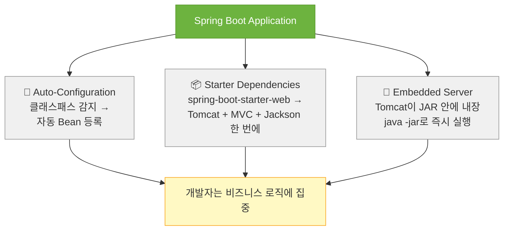
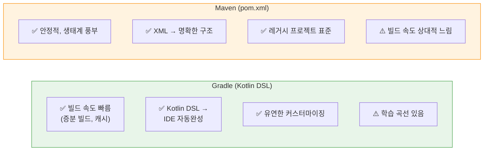

> Spring의 진입 장벽을 낮추고 '그냥 실행되는' 경험을 선사하는 Spring Boot. 설치, 프로젝트 생성, 첫 API 작성, 빌드, 실행까지 — 처음부터 끝까지 코드와 함께 설명한다.

## 핵심 요약 (TL;DR)

Spring Boot는 **Auto-Configuration + Starter Dependencies + Embedded Server** 세 가지 마법으로 Spring의 복잡한 초기 설정을 자동화한다. `start.spring.io`에서 프로젝트를 생성하고, `application.yml`로 설정을 관리하며, `@RestController`로 HTTP API를 선언하면 `java -jar` 한 줄로 서버가 뜬다. **Gradle**은 빌드 속도와 유연성, **Maven**은 안정성과 낮은 학습 곡선이 강점 — 2025년 신규 프로젝트라면 Gradle을 권장한다.

---

## 왜 Spring Boot인가?

### Spring Framework의 딜레마

Spring Framework는 강력하지만 초기 설정 비용이 높다. 웹 서비스 하나 만들려면:

- 웹 서버(Tomcat) 별도 설치 및 배포 설정
- `web.xml`에 DispatcherServlet 등록
- 수십 줄의 XML Bean 설정 또는 Java Config 클래스
- 의존성 버전 충돌 수동 해결

Spring Boot는 이 모든 것을 **"관례 기반 자동 설정(Convention over Configuration)"** 원칙으로 해결한다.

### Spring Boot 핵심 3요소



**Auto-Configuration 동작 원리:**
`@SpringBootApplication` → `@EnableAutoConfiguration` → `spring.factories` / `AutoConfiguration.imports` 파일 스캔 → 클래스패스에 존재하는 라이브러리에 맞는 Bean을 조건부(`@ConditionalOnClass`, `@ConditionalOnMissingBean`) 등록.

직접 Bean을 정의하면 Auto-Configuration은 뒤로 물러난다 — **OCP(개방-폐쇄 원칙)** 의 교과서적 구현.

---

## 환경 준비

### JDK 설치

Spring Boot 3.x는 **Java 17 이상** 필수다.

```bash
# macOS (SDKMAN 권장)
curl -s "https://get.sdkman.io" | bash
sdk install java 21.0.3-tem   # Eclipse Temurin 21 LTS

# 버전 확인
java -version
# openjdk version "21.0.3" 2024-04-16
```

> **왜 21인가?** Java 17이 최소 요구사항이지만, 21은 LTS + Virtual Threads(Project Loom) + Sequenced Collections 등 실무에 유용한 기능이 포함된 현재 권장 버전이다.

---

## 프로젝트 생성 — Spring Initializr

### 웹 UI 방식 (권장)

[start.spring.io](https://start.spring.io) 접속 후:

| 항목 | 선택 | 이유 |
|------|------|------|
| **Project** | `Gradle - Kotlin DSL` | 2025년 신규 프로젝트 권장. IDE 자동완성 + 빌드 속도 |
| **Language** | `Java` | — |
| **Spring Boot** | `3.4.x` (최신 안정판) | Java 21 LTS 지원, Virtual Thread auto-configuration |
| **Packaging** | `Jar` | 내장 서버로 독립 실행 |
| **Java** | `21` | — |

**Dependencies 추가:**
- `Spring Web` — RESTful API, 내장 Tomcat
- `Lombok` — 보일러플레이트 제거
- `Spring Boot DevTools` — 개발 중 자동 재시작

`GENERATE` → 압축 해제 → IDE에서 열기

### CLI 방식 (Spring Boot CLI)

```bash
# Spring Boot CLI 설치
brew install spring-io/tap/spring-boot

# 프로젝트 생성
spring init \
  --build=gradle \
  --java-version=21 \
  --boot-version=3.4.3 \
  --dependencies=web,lombok,devtools \
  --name=honey-api \
  --artifact-id=honey-api \
  honey-api.zip

unzip honey-api.zip && cd honey-api
```

---

## Gradle vs Maven — 2025년 선택 기준



**2025년 실무 권장:**
- 신규 프로젝트 → **Gradle (Kotlin DSL)**
- 레거시 유지보수 → 현행 유지 (Maven → Gradle 마이그레이션 비용 고려)
- 팀이 Groovy/Kotlin에 익숙하지 않음 → Maven도 나쁘지 않다

### 생성된 `build.gradle.kts` 분석

```kotlin
// build.gradle.kts
plugins {
    java
    id("org.springframework.boot") version "3.4.3"       // Spring Boot 플러그인
    id("io.spring.dependency-management") version "1.1.7" // 의존성 버전 BOM 관리
}

group = "com.honeybarrel"
version = "0.0.1-SNAPSHOT"

java {
    toolchain {
        languageVersion = JavaLanguageVersion.of(21) // Java 21 고정
    }
}

// Lombok 어노테이션 처리기
configurations {
    compileOnly {
        extendsFrom(configurations.annotationProcessor.get())
    }
}

repositories {
    mavenCentral()
}

dependencies {
    // Starter Dependencies — 하나가 수십 개의 관련 라이브러리를 묶어준다
    implementation("org.springframework.boot:spring-boot-starter-web")    // Tomcat + Spring MVC + Jackson
    compileOnly("org.projectlombok:lombok")
    annotationProcessor("org.projectlombok:lombok")
    developmentOnly("org.springframework.boot:spring-boot-devtools")      // 개발 전용 (운영 제외)
    testImplementation("org.springframework.boot:spring-boot-starter-test") // JUnit5 + MockMvc + AssertJ
}

tasks.withType<Test> {
    useJUnitPlatform()
}
```

> **`spring-boot-starter-web` 하나가 포함하는 것들:**
> `spring-webmvc`, `spring-web`, `tomcat-embed-core`, `jackson-databind`, `jackson-datatype-jsr310`, `spring-boot-autoconfigure` — 버전 충돌 걱정 없이 한 번에.

---

## 프로젝트 구조

```
honey-api/
├── src/
│   ├── main/
│   │   ├── java/com/honeybarrel/honeyapi/
│   │   │   ├── HoneyApiApplication.java      ← 진입점 (@SpringBootApplication)
│   │   │   ├── controller/
│   │   │   │   └── HelloController.java      ← 이번 예제
│   │   │   ├── service/
│   │   │   └── repository/
│   │   └── resources/
│   │       ├── application.yml               ← 핵심 설정 파일
│   │       ├── application-local.yml         ← 로컬 프로파일
│   │       └── static/
│   └── test/
│       └── java/.../HoneyApiApplicationTests.java
├── build.gradle.kts
├── settings.gradle.kts
└── gradlew                                   ← Gradle Wrapper (버전 고정)
```

---

## `application.yml` 설정 완전 해부

기본 생성되는 `application.properties` 대신 YAML을 사용한다 — 계층 구조가 명확하고 중복이 없다.

```yaml
# src/main/resources/application.yml

# ── 서버 설정 ──────────────────────────────────────────────
server:
  port: 8080                    # 기본값. 변경 시 8081 등
  servlet:
    context-path: /             # API 기본 경로 (예: /api 로 변경 가능)
  compression:
    enabled: true               # HTTP 응답 GZIP 압축 (운영 권장)
    mime-types: application/json,text/html

# ── 애플리케이션 메타데이터 ───────────────────────────────────
spring:
  application:
    name: honey-api             # Actuator, 로그, 서비스 디스커버리에서 식별자로 사용

  # ── 프로파일 활성화 ────────────────────────────────────────
  profiles:
    active: local               # 개발 시 local 프로파일 사용

  # ── Jackson (JSON 직렬화) ──────────────────────────────────
  jackson:
    default-property-inclusion: non_null  # null 필드 JSON 응답에서 제외
    serialization:
      write-dates-as-timestamps: false    # LocalDateTime → ISO-8601 문자열
    time-zone: Asia/Seoul

# ── 로깅 ──────────────────────────────────────────────────
logging:
  level:
    root: INFO
    com.honeybarrel: DEBUG      # 우리 패키지만 DEBUG
  pattern:
    console: "%d{HH:mm:ss.SSS} [%thread] %-5level %logger{36} - %msg%n"
```

```yaml
# src/main/resources/application-local.yml
# 로컬 개발 전용 설정 (git에 올라가도 무방한 것만)

server:
  port: 8081  # 로컬에서 포트 충돌 방지

logging:
  level:
    org.springframework.web: DEBUG  # 요청/응답 상세 로그
```

> **프로파일 전략:** `local`, `dev`, `staging`, `prod` 4단계 분리를 권장. 민감 정보(DB 비밀번호 등)는 환경변수로 주입 — `${DB_PASSWORD}` 형태.

---

## 구현 — 첫 REST API

### 1. 엔트리 포인트

```java
// src/main/java/com/honeybarrel/honeyapi/HoneyApiApplication.java
package com.honeybarrel.honeyapi;

import org.springframework.boot.SpringApplication;
import org.springframework.boot.autoconfigure.SpringBootApplication;

@SpringBootApplication
// ↑ @Configuration + @EnableAutoConfiguration + @ComponentScan 세 어노테이션의 합성
public class HoneyApiApplication {

    public static void main(String[] args) {
        SpringApplication.run(HoneyApiApplication.class, args);
        // IoC 컨테이너 초기화 → Auto-Configuration → 내장 Tomcat 시작
    }
}
```

### 2. Response DTO — 타입 안전한 응답 형식

```java
// src/main/java/com/honeybarrel/honeyapi/dto/ApiResponse.java
package com.honeybarrel.honeyapi.dto;

import com.fasterxml.jackson.annotation.JsonInclude;
import lombok.Builder;
import lombok.Getter;

import java.time.LocalDateTime;

/**
 * 모든 API 응답의 공통 래퍼.
 * SRP(단일 책임): 응답 형식 표준화만 담당.
 */
@Getter
@Builder
@JsonInclude(JsonInclude.Include.NON_NULL)  // null 필드 JSON 제외
public class ApiResponse<T> {

    private final boolean success;
    private final String message;
    private final T data;

    @Builder.Default
    private final LocalDateTime timestamp = LocalDateTime.now();

    // 정적 팩토리 메서드 — 생성 의도를 명확히 표현
    public static <T> ApiResponse<T> ok(T data) {
        return ApiResponse.<T>builder()
                .success(true)
                .data(data)
                .build();
    }

    public static <T> ApiResponse<T> ok(String message, T data) {
        return ApiResponse.<T>builder()
                .success(true)
                .message(message)
                .data(data)
                .build();
    }

    public static ApiResponse<Void> error(String message) {
        return ApiResponse.<Void>builder()
                .success(false)
                .message(message)
                .build();
    }
}
```

### 3. 도메인 DTO

```java
// src/main/java/com/honeybarrel/honeyapi/dto/GreetingDto.java
package com.honeybarrel.honeyapi.dto;

import jakarta.validation.constraints.NotBlank;
import jakarta.validation.constraints.Size;
import lombok.Builder;
import lombok.Getter;
import lombok.Setter;

public class GreetingDto {

    /** 요청 DTO — 클라이언트 입력 검증 책임 */
    @Getter
    @Setter
    public static class Request {

        @NotBlank(message = "이름은 필수입니다")
        @Size(min = 1, max = 50, message = "이름은 1~50자 사이여야 합니다")
        private String name;

        private String language = "ko";  // 기본값: 한국어
    }

    /** 응답 DTO — 클라이언트에게 노출할 데이터만 포함 */
    @Getter
    @Builder
    public static class Response {
        private final String greeting;
        private final String name;
        private final String language;
    }
}
```

### 4. Service — 비즈니스 로직 분리

```java
// src/main/java/com/honeybarrel/honeyapi/service/GreetingService.java
package com.honeybarrel.honeyapi.service;

import com.honeybarrel.honeyapi.dto.GreetingDto;
import org.springframework.stereotype.Service;

import java.util.Map;

/**
 * 인사말 생성 비즈니스 로직.
 *
 * OCP(개방-폐쇄): 새 언어 추가는 Map 확장만으로 가능 — Controller/API 변경 없음.
 * SRP(단일 책임): 인사말 생성 로직만 담당.
 */
@Service
public class GreetingService {

    private static final Map<String, String> GREETINGS = Map.of(
            "ko", "안녕하세요",
            "en", "Hello",
            "ja", "こんにちは",
            "zh", "你好",
            "es", "Hola"
    );

    public GreetingDto.Response greet(GreetingDto.Request request) {
        String template = GREETINGS.getOrDefault(request.getLanguage(), GREETINGS.get("ko"));
        String greeting = String.format("%s, %s! 🍯", template, request.getName());

        return GreetingDto.Response.builder()
                .greeting(greeting)
                .name(request.getName())
                .language(request.getLanguage())
                .build();
    }
}
```

### 5. Controller — HTTP 계층

```java
// src/main/java/com/honeybarrel/honeyapi/controller/HelloController.java
package com.honeybarrel.honeyapi.controller;

import com.honeybarrel.honeyapi.dto.ApiResponse;
import com.honeybarrel.honeyapi.dto.GreetingDto;
import com.honeybarrel.honeyapi.service.GreetingService;
import jakarta.validation.Valid;
import lombok.RequiredArgsConstructor;
import org.springframework.http.ResponseEntity;
import org.springframework.web.bind.annotation.*;

/**
 * @RestController = @Controller + @ResponseBody
 * 이 클래스의 모든 메서드는 반환값을 JSON으로 직렬화해 HTTP 응답 바디에 씁니다.
 *
 * SRP: HTTP 요청 수신 → 위임 → 응답 반환만 담당. 비즈니스 로직은 Service에.
 * DIP: 구체 클래스가 아닌 GreetingService 타입(인터페이스화 가능)에 의존.
 */
@RestController
@RequestMapping("/api/v1")      // 버전 관리 — 하위 호환성 보장
@RequiredArgsConstructor        // Lombok: final 필드 생성자 주입 (Spring 권장 방식)
public class HelloController {

    private final GreetingService greetingService;  // 생성자 주입 — 불변성 보장

    /**
     * GET /api/v1/hello
     * 간단한 서버 상태 확인용 엔드포인트 (Health check 대용)
     */
    @GetMapping("/hello")
    public ResponseEntity<ApiResponse<String>> hello() {
        return ResponseEntity.ok(
                ApiResponse.ok("Spring Boot가 살아있습니다 🐝")
        );
    }

    /**
     * GET /api/v1/hello/{name}?language=en
     * Path Variable + Query Parameter 조합 예시
     */
    @GetMapping("/hello/{name}")
    public ResponseEntity<ApiResponse<GreetingDto.Response>> helloName(
            @PathVariable String name,
            @RequestParam(defaultValue = "ko") String language) {

        GreetingDto.Request request = new GreetingDto.Request();
        request.setName(name);
        request.setLanguage(language);

        return ResponseEntity.ok(
                ApiResponse.ok(greetingService.greet(request))
        );
    }

    /**
     * POST /api/v1/hello
     * Request Body + Bean Validation (@Valid) 예시
     */
    @PostMapping("/hello")
    public ResponseEntity<ApiResponse<GreetingDto.Response>> helloPost(
            @Valid @RequestBody GreetingDto.Request request) {

        return ResponseEntity.ok(
                ApiResponse.ok("인사말 생성 완료", greetingService.greet(request))
        );
    }
}
```

### 6. 전역 예외 처리 — `@RestControllerAdvice`

```java
// src/main/java/com/honeybarrel/honeyapi/exception/GlobalExceptionHandler.java
package com.honeybarrel.honeyapi.exception;

import com.honeybarrel.honeyapi.dto.ApiResponse;
import lombok.extern.slf4j.Slf4j;
import org.springframework.http.HttpStatus;
import org.springframework.http.ResponseEntity;
import org.springframework.validation.FieldError;
import org.springframework.web.bind.MethodArgumentNotValidException;
import org.springframework.web.bind.annotation.ExceptionHandler;
import org.springframework.web.bind.annotation.RestControllerAdvice;

import java.util.stream.Collectors;

/**
 * AOP 기반 전역 예외 처리.
 * 모든 Controller에서 발생하는 예외를 한 곳에서 일관되게 처리.
 */
@Slf4j
@RestControllerAdvice
public class GlobalExceptionHandler {

    /** @Valid 유효성 검사 실패 */
    @ExceptionHandler(MethodArgumentNotValidException.class)
    public ResponseEntity<ApiResponse<Void>> handleValidationError(
            MethodArgumentNotValidException e) {

        String message = e.getBindingResult()
                .getFieldErrors()
                .stream()
                .map(FieldError::getDefaultMessage)
                .collect(Collectors.joining(", "));

        log.warn("Validation failed: {}", message);
        return ResponseEntity
                .status(HttpStatus.BAD_REQUEST)
                .body(ApiResponse.error(message));
    }

    /** 비즈니스 로직 예외 */
    @ExceptionHandler(IllegalArgumentException.class)
    public ResponseEntity<ApiResponse<Void>> handleIllegalArgument(
            IllegalArgumentException e) {
        log.warn("Business rule violation: {}", e.getMessage());
        return ResponseEntity
                .status(HttpStatus.BAD_REQUEST)
                .body(ApiResponse.error(e.getMessage()));
    }

    /** 기타 미처리 예외 */
    @ExceptionHandler(Exception.class)
    public ResponseEntity<ApiResponse<Void>> handleException(Exception e) {
        log.error("Unhandled exception", e);
        return ResponseEntity
                .status(HttpStatus.INTERNAL_SERVER_ERROR)
                .body(ApiResponse.error("서버 오류가 발생했습니다. 잠시 후 다시 시도해주세요."));
    }
}
```

---

## 빌드 및 실행

### 개발 중 실행 (DevTools 자동 재시작)

```bash
# Gradle Wrapper 사용 (gradlew — 팀 전체가 동일한 Gradle 버전 사용)
./gradlew bootRun

# 또는 IntelliJ IDEA에서 HoneyApiApplication main() 실행
```

### 프로덕션 JAR 빌드

```bash
# 빌드 (테스트 포함)
./gradlew clean build

# 테스트 제외 빠른 빌드
./gradlew clean build -x test

# 생성된 JAR 위치
ls -lh build/libs/
# honey-api-0.0.1-SNAPSHOT.jar  ~25MB (내장 Tomcat 포함)

# 실행
java -jar build/libs/honey-api-0.0.1-SNAPSHOT.jar

# 프로파일 지정 실행
java -jar build/libs/honey-api-0.0.1-SNAPSHOT.jar \
  --spring.profiles.active=prod \
  --server.port=9090
```

### 실행 확인 로그

```
  .   ____          _            __ _ _
 /\\ / ___'_ __ _ _(_)_ __  __ _ \ \ \ \
( ( )\___ | '_ | '_| | '_ \/ _` | \ \ \ \
 \\/  ___)| |_)| | | | | || (_| |  ) ) ) )
  '  |____| .__|_| |_|_| |_\__, | / / / /
 =========|_|==============|___/=/_/_/_/
 :: Spring Boot ::               (v3.4.3)

2026-03-17T09:00:01.234+09:00  INFO --- [main] c.h.honeyapi.HoneyApiApplication  : Starting HoneyApiApplication
2026-03-17T09:00:02.891+09:00  INFO --- [main] o.s.b.w.e.tomcat.TomcatWebServer  : Tomcat started on port 8081 (http)
2026-03-17T09:00:02.901+09:00  INFO --- [main] c.h.honeyapi.HoneyApiApplication  : Started HoneyApiApplication in 1.932 seconds
```

---

## API 테스트

### `curl` 기본 테스트

```bash
# 1. 헬스 체크
curl -s http://localhost:8081/api/v1/hello | python3 -m json.tool
# {
#   "success": true,
#   "data": "Spring Boot가 살아있습니다 🐝",
#   "timestamp": "2026-03-17T09:00:10"
# }

# 2. 이름 인사 (한국어 기본)
curl -s "http://localhost:8081/api/v1/hello/꿀벌왕" | python3 -m json.tool
# { "success": true, "data": { "greeting": "안녕하세요, 꿀벌왕! 🍯", ... } }

# 3. 영어 인사
curl -s "http://localhost:8081/api/v1/hello/HoneyBee?language=en"
# { "data": { "greeting": "Hello, HoneyBee! 🍯", "language": "en" } }

# 4. POST — 유효성 검사 통과
curl -s -X POST http://localhost:8081/api/v1/hello \
  -H "Content-Type: application/json" \
  -d '{"name": "Spring Boot", "language": "ja"}'
# { "data": { "greeting": "こんにちは, Spring Boot! 🍯" } }

# 5. POST — 유효성 검사 실패
curl -s -X POST http://localhost:8081/api/v1/hello \
  -H "Content-Type: application/json" \
  -d '{"name": "", "language": "ko"}'
# { "success": false, "message": "이름은 필수입니다" }
```

### HTTPie로 더 읽기 쉽게

```bash
pip install httpie

http GET localhost:8081/api/v1/hello/꿀벌왕 language==en
http POST localhost:8081/api/v1/hello name="Spring" language="ko"
```

---

## 설계 포인트 — 코드에 녹아든 SOLID

| 원칙 | 적용 위치 | 설명 |
|------|----------|------|
| **SRP** | `Controller / Service / DTO 분리` | 각 클래스는 하나의 책임만 |
| **OCP** | `GreetingService` GREETINGS Map | 새 언어 추가 = Map 항목 추가. 기존 코드 수정 없음 |
| **LSP** | `ApiResponse<T>` 제네릭 | 어떤 타입 `T`든 일관된 응답 구조 보장 |
| **ISP** | DTO 요청/응답 분리 | `Request`와 `Response`를 별도 클래스로 분리 |
| **DIP** | 생성자 주입 `final` 필드 | `HelloController`는 `GreetingService`에 의존, 구현체 교체 가능 |

### 트레이드오프 정리

| 결정 | 장점 | 단점 | 선택 이유 |
|------|------|------|----------|
| **Gradle Kotlin DSL** | IDE 자동완성, 빠른 빌드 | 러닝 커브 | 장기 유지보수 생산성 |
| **`application.yml`** | 계층 구조 명확, 중복 없음 | YAML 문법 민감 | 가독성 우선 |
| **`@RestControllerAdvice`** | 예외 처리 중앙화 | 오버엔지니어링 가능 | 일관된 API 응답 |
| **`ApiResponse<T>` 래퍼** | 응답 형식 표준화 | 단순 API에는 과함 | 프론트엔드 협업 편의 |
| **생성자 주입 (`@RequiredArgsConstructor`)** | 불변성, 테스트 용이 | — | Spring 공식 권장 |

---

## 시리즈 안내

| Part | 주제 | 상태 |
|------|------|------|
| **Part 1** | **Spring Boot 시작하기** | 현재 글 |
| Part 2 | 의존성 주입과 IoC 컨테이너 | [보러가기](/2026/03/18/spring-boot-di-ioc/) |
| Part 3 | 레이어드 아키텍처 | [보러가기](/2026/03/19/spring-boot-layered-architecture/) |
| Part 4 | Spring Data JPA | [보러가기](/2026/03/20/spring-boot-jpa/) |
| Part 7 | 테스트 전략 | [보러가기](/2026/03/25/spring-boot-testing/) |
| Part 8 | 운영 배포 전략 | 예정 |

---

## 레퍼런스

### 공식 문서
- [Spring Boot Reference Documentation 3.4.x](https://docs.spring.io/spring-boot/docs/3.4.x/reference/html/) — Spring 공식 레퍼런스
- [Spring Guides: Building a RESTful Web Service](https://spring.io/guides/gs/rest-service/) — spring.io 공식 튜토리얼
- [Spring Initializr](https://start.spring.io) — 프로젝트 생성 도구

### 기술 비교
- [Maven vs. Gradle in 2025 — Medium](https://medium.com/@ntiinsd/maven-vs-gradle-in-2025-the-ultimate-deep-dive-to-choose-your-build-tool-wisely-b67cb6f9b58f) — 2025년 기준 빌드 도구 심층 비교
- [Maven vs Gradle for API-Heavy Backends — Quash](https://quashbugs.com/blog/maven-vs-gradle-choosing-the-right-build-tool-for-api-heavy-backends-2025) — API 서버 관점의 비교

---

*이 포스트는 [HoneyByte](https://blog.honeybarrel.co.kr) Spring Boot Deep Dive 시리즈의 일부입니다.*
