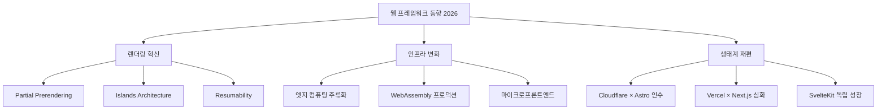
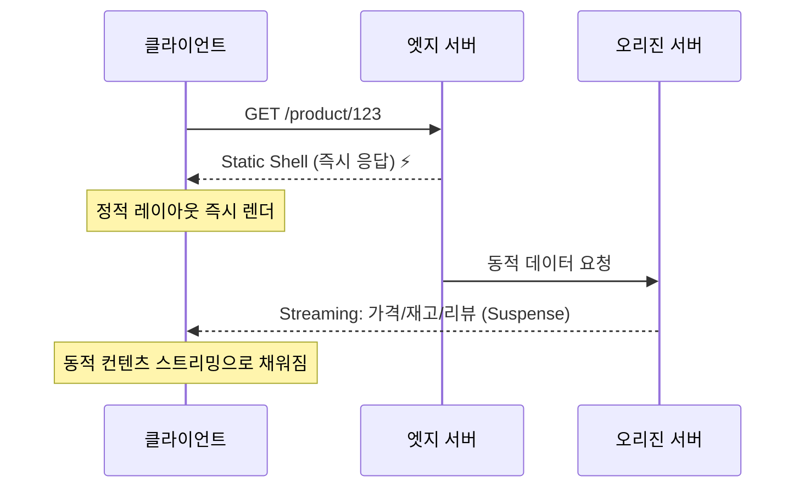
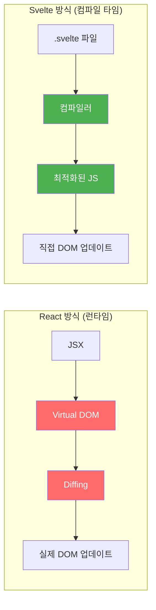
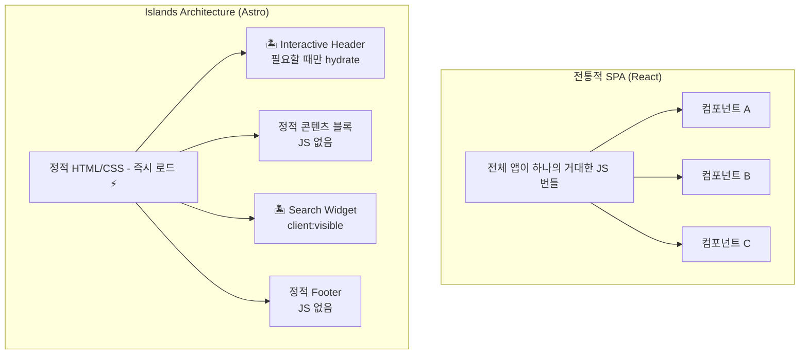
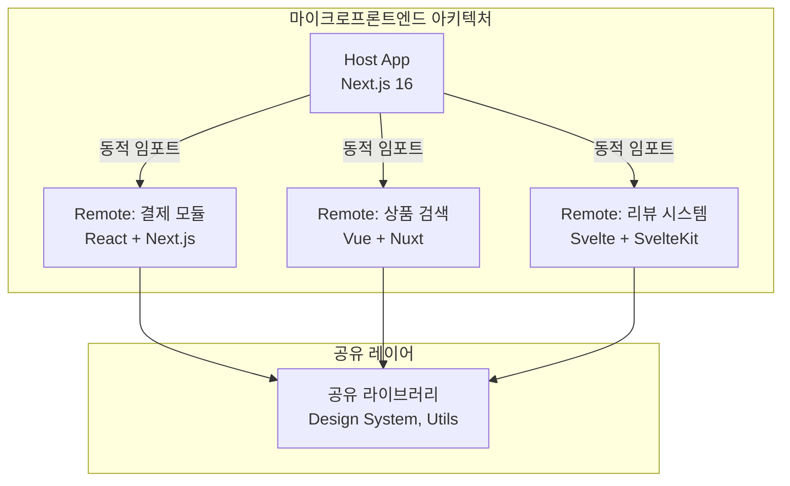
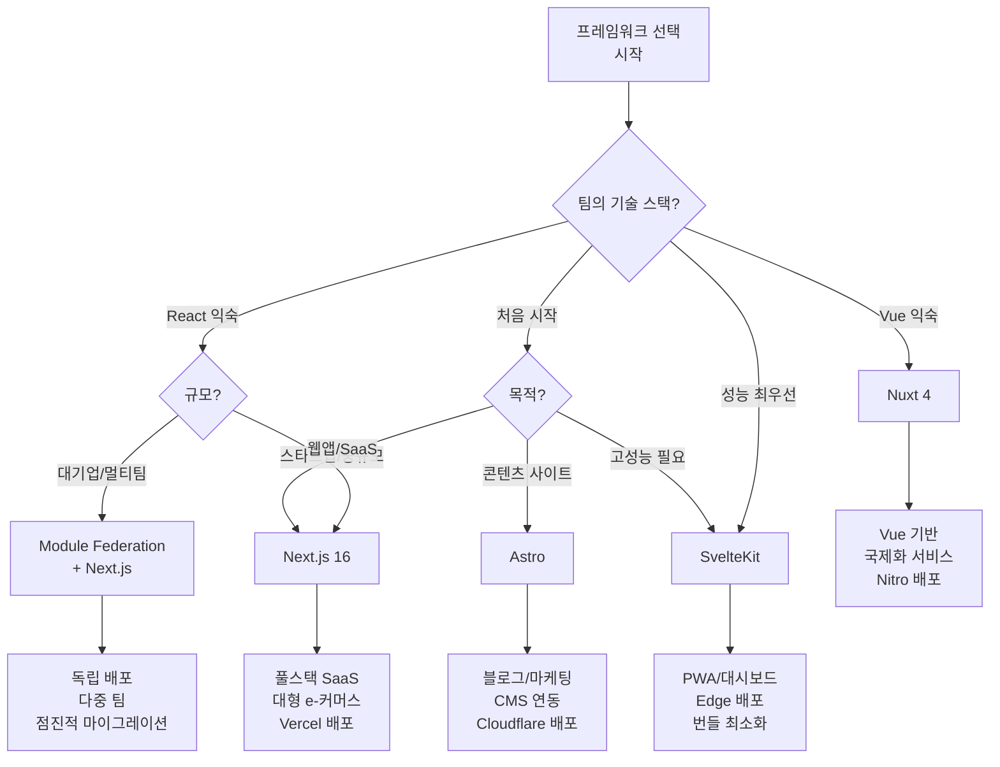

> **HoneyByte** — 현업 개발자를 위한 기술 트렌드 심층 분석

---

## TL;DR

| 프레임워크 | 2026 핵심 변화 | 최적 유스케이스 |
|---|---|---|
| **Next.js 16** | Turbopack 기본 활성화, PPR 정식화 | 풀스택 SaaS, 대규모 e-커머스 |
| **SvelteKit** | WebAssembly 통합, 엣지 배포 최적화 | 퍼포먼스 중심 대시보드, PWA |
| **Astro** | Cloudflare 인수 → 엣지 네이티브 | 콘텐츠 중심 사이트, 멀티프레임워크 |
| **Remix** | Vite 네이티브, Web Standard 강화 | 폼/데이터 중심 웹앱 |
| **Nuxt 4** | Nitro 최적화, Vue 3 Composition API | Vue 생태계 풀스택 |

**핵심 메시지:** 2026년 웹 프레임워크 선택은 단순한 기술 취향이 아니라 **렌더링 모델 × 배포 인프라 × 팀 생산성**의 삼각 최적화 문제다.

---

## 1. 왜 지금 웹 프레임워크 동향이 중요한가

Stack Overflow 개발자 설문(2025) 기준 프레임워크 사용률:

- Node.js: 48.7%
- **React: 44.7%**
- jQuery: 23.4%
- **Next.js: 20.8%**
- Angular: 18.2%
- Vue.js: 17.6%
- **Svelte: 7.2%**

숫자만 보면 React/Next.js 독주처럼 보이지만, 실상은 다르다. **채용 시장과 스타트업 스택이 이미 다양화**되고 있다. 2025~2026년에 걸쳐 세 가지 거대한 흐름이 동시에 진행 중이다:

1. **렌더링 패러다임의 재정의** — CSR/SSR/SSG의 경계가 무너지고 있다
2. **엣지 컴퓨팅의 주류화** — CDN에서 로직 실행이 표준이 됐다
3. **AI 코드 생성과의 궁합** — AI 친화적인 프레임워크가 생산성을 좌우한다



---

## 2. Next.js 16: 렌더링의 새 표준 — Partial Prerendering

### 2.1 Turbopack 기본 활성화

Next.js 15까지는 `--turbopack` 플래그가 필요했다. Next.js 16부터는 **기본 번들러가 Webpack에서 Turbopack으로 교체**됐다.

**체감 차이:**

| 지표 | Webpack | Turbopack |
|---|---|---|
| 초기 컴파일 | 15~45초 | 1~3초 |
| HMR (Hot Module Replacement) | 1~3초 | < 100ms |
| 메모리 사용량 | 높음 | 낮음 (Rust 기반) |

```bash
# Next.js 16: 이제 --turbopack 불필요
npx create-next-app@16 my-app
cd my-app
npm run dev  # 자동으로 Turbopack 사용
```

### 2.2 Partial Prerendering (PPR): 2026년을 정의하는 기능

기존 렌더링 모델의 딜레마:

```
SSG (정적): 빠름 ✅  BUT 실시간 데이터 ❌
SSR (동적): 실시간 ✅  BUT 느림 ❌
```

PPR은 이 이분법을 **단일 요청 안에서 해소**한다:



**코드 예제 — Next.js 16 PPR 활성화:**

```tsx
// next.config.ts
import type { NextConfig } from 'next'

const nextConfig: NextConfig = {
  experimental: {
    ppr: true,  // Partial Prerendering 활성화
  },
}

export default nextConfig
```

```tsx
// app/product/[id]/page.tsx
import { Suspense } from 'react'

// 이 컴포넌트는 정적으로 사전 렌더링 (CDN 캐싱)
export default function ProductPage({ params }: { params: { id: string } }) {
  return (
    <div>
      {/* 정적 셸 — 즉시 응답 */}
      <ProductLayout>
        <StaticProductInfo id={params.id} />

        {/* 동적 부분 — Suspense로 스트리밍 */}
        <Suspense fallback={<PriceSkeleton />}>
          <DynamicPrice id={params.id} />
        </Suspense>

        <Suspense fallback={<ReviewSkeleton />}>
          <LiveReviews id={params.id} />
        </Suspense>
      </ProductLayout>
    </div>
  )
}

// 동적 서버 컴포넌트 — 캐시 없음
async function DynamicPrice({ id }: { id: string }) {
  const price = await fetch(`/api/price/${id}`, { cache: 'no-store' })
  const data = await price.json()
  return <span className="price">₩{data.price.toLocaleString()}</span>
}
```

### 2.3 Server Actions 심화: Form과 Mutation의 통합

```tsx
// app/cart/actions.ts
'use server'

import { revalidatePath } from 'next/cache'
import { redirect } from 'next/navigation'

export async function addToCart(formData: FormData) {
  const productId = formData.get('productId') as string
  const quantity = parseInt(formData.get('quantity') as string)

  // DB 직접 접근 — API 라우트 불필요
  await db.cart.upsert({
    where: { userId: getCurrentUser().id, productId },
    update: { quantity: { increment: quantity } },
    create: { userId: getCurrentUser().id, productId, quantity },
  })

  revalidatePath('/cart')
  // redirect('/cart')  // 선택적 리다이렉션
}

// app/product/[id]/page.tsx — 클라이언트 없이 폼 처리
export default function AddToCartForm({ productId }: { productId: string }) {
  return (
    <form action={addToCart}>
      <input type="hidden" name="productId" value={productId} />
      <input type="number" name="quantity" defaultValue={1} min={1} />
      <button type="submit">장바구니 추가</button>
    </form>
  )
}
```

---

## 3. SvelteKit: 컴파일 타임 반란군의 조용한 부상

### 3.1 Svelte의 철학 — 런타임이 아닌 컴파일 타임

React와 Vue는 **가상 DOM(Virtual DOM)을 런타임에 조작**한다. Svelte는 다르다: **빌드 타임에 컴포넌트를 순수 JavaScript로 컴파일**해 런타임 오버헤드를 없앤다.



**실제 번들 크기 비교 (동일한 Todo 앱 기준):**

| 프레임워크 | 번들 크기 (gzip) | 초기 JS 파싱 시간 |
|---|---|---|
| React + React DOM | ~45KB | ~180ms |
| Vue 3 | ~34KB | ~140ms |
| **Svelte** | ~3.5KB | ~15ms |
| Angular | ~62KB | ~250ms |

### 3.2 Svelte 5의 Runes — 반응성 시스템 재설계

Svelte 5는 `$state`, `$derived`, `$effect` 등 **Runes**로 반응성 모델을 명시적으로 재설계했다:

```svelte
<!-- Svelte 5 — Runes 문법 -->
<script>
  // $state: 반응형 상태
  let count = $state(0)
  let name = $state('World')

  // $derived: 파생 상태 (React의 useMemo와 유사)
  let doubled = $derived(count * 2)
  let greeting = $derived(`Hello, ${name}! Count: ${count}`)

  // $effect: 사이드이펙트 (React의 useEffect와 유사)
  $effect(() => {
    console.log('count changed:', count)
    return () => console.log('cleanup') // 클린업
  })

  // $props: 컴포넌트 props
  let { initialValue = 0 } = $props()
</script>

<div>
  <p>{greeting}</p>
  <p>doubled: {doubled}</p>
  <button onclick={() => count++}>증가</button>
  <input bind:value={name} />
</div>
```

### 3.3 SvelteKit + 엣지 배포 실전

```typescript
// src/routes/api/products/+server.ts
import type { RequestHandler } from './$types'

export const GET: RequestHandler = async ({ url, platform }) => {
  const category = url.searchParams.get('category')

  // Cloudflare Workers / Vercel Edge 환경 자동 감지
  const cache = platform?.caches?.default

  const cacheKey = new Request(`https://api.example.com/products?cat=${category}`)

  // 엣지 캐시 확인
  if (cache) {
    const cached = await cache.match(cacheKey)
    if (cached) return cached
  }

  const products = await fetchProductsFromDB(category)

  const response = new Response(JSON.stringify(products), {
    headers: {
      'Content-Type': 'application/json',
      'Cache-Control': 'public, max-age=60, stale-while-revalidate=300',
    },
  })

  // 엣지에 캐싱
  if (cache) {
    await cache.put(cacheKey, response.clone())
  }

  return response
}
```

```javascript
// svelte.config.js — Cloudflare Workers 배포
import adapter from '@sveltejs/adapter-cloudflare'
import { vitePreprocess } from '@sveltejs/vite-plugin-svelte'

/** @type {import('@sveltejs/kit').Config} */
const config = {
  preprocess: vitePreprocess(),
  kit: {
    adapter: adapter({
      routes: {
        include: ['/*'],
        exclude: ['<all>'], // 정적 에셋 제외
      },
    }),
  },
}

export default config
```

---

## 4. Astro + Cloudflare: Islands Architecture의 진화

### 4.1 2026년 1월 — Cloudflare의 Astro 인수

2026년 1월, Cloudflare가 Astro를 인수하며 웹 프레임워크 생태계에 지각변동이 일었다. 이 인수의 의미:

- **Astro**는 즉시 Cloudflare Workers/Pages와 네이티브 통합
- **엣지 SSR**이 Astro의 기본값으로 전환 중
- **D1(SQLite), R2(스토리지), KV**를 Astro에서 직접 사용 가능

### 4.2 Islands Architecture 심층 분석



**Astro의 클라이언트 지시자 (Directives):**

```astro
---
// src/pages/index.astro
import HeavyChart from '../components/HeavyChart.tsx'
import SearchBox from '../components/SearchBox.svelte'  // Svelte 컴포넌트도 사용!
import ReactCounter from '../components/Counter.jsx'    // React도 섞어 쓰기 가능
---

<html>
  <body>
    <!-- 정적 콘텐츠 — JS 없음 -->
    <header>
      <h1>My Blog</h1>
    </header>

    <!-- client:load — 페이지 로드 즉시 hydrate -->
    <SearchBox client:load />

    <!-- client:idle — 브라우저가 idle 상태일 때 hydrate -->
    <ReactCounter client:idle />

    <!-- client:visible — 뷰포트에 진입할 때만 hydrate (LazyLoad 대체!) -->
    <HeavyChart client:visible />

    <!-- client:media — 미디어 쿼리 충족 시 hydrate -->
    <MobileMenu client:media="(max-width: 768px)" />
  </body>
</html>
```

### 4.3 Astro + Cloudflare D1 실전 예제

```typescript
// src/pages/api/posts.ts (Astro API Route)
import type { APIRoute } from 'astro'

export const GET: APIRoute = async ({ locals }) => {
  // Cloudflare D1 (SQLite) 직접 접근
  const { DB } = locals.runtime.env

  const posts = await DB.prepare(`
    SELECT id, title, excerpt, published_at
    FROM posts
    WHERE published = 1
    ORDER BY published_at DESC
    LIMIT 20
  `).all()

  return new Response(JSON.stringify(posts.results), {
    headers: { 'Content-Type': 'application/json' },
  })
}

export const POST: APIRoute = async ({ request, locals }) => {
  const { DB, KV } = locals.runtime.env
  const body = await request.json()

  const { meta } = await DB.prepare(`
    INSERT INTO posts (title, content, author_id, published_at)
    VALUES (?, ?, ?, ?)
  `).bind(body.title, body.content, body.authorId, new Date().toISOString())
    .run()

  // 캐시 무효화 (KV에 저장된 목록 캐시)
  await KV.delete('posts:list')

  return new Response(JSON.stringify({ id: meta.last_row_id }), {
    status: 201,
  })
}
```

---

## 5. 마이크로프론트엔드: 엔터프라이즈의 새 표준

Spotify, Zalando 같은 기업이 마이크로프론트엔드(MFE)를 도입하며 이 패턴이 검증됐다.

### 5.1 Module Federation 2.0 with Next.js



```javascript
// host/next.config.js — Module Federation 설정
const { NextFederationPlugin } = require('@module-federation/nextjs-mf')

module.exports = {
  webpack(config, options) {
    config.plugins.push(
      new NextFederationPlugin({
        name: 'host',
        remotes: {
          // 각 팀이 독립적으로 배포
          payment: 'payment@https://payment.internal.company.com/_next/static/chunks/remoteEntry.js',
          search: 'search@https://search.internal.company.com/_next/static/chunks/remoteEntry.js',
          reviews: 'reviews@https://reviews.internal.company.com/_next/static/chunks/remoteEntry.js',
        },
        shared: {
          react: { singleton: true, requiredVersion: '>=18.0.0' },
          'react-dom': { singleton: true },
          // 디자인 시스템 공유
          '@company/ui': { singleton: true },
        },
      })
    )
    return config
  },
}
```

```tsx
// host/app/product/[id]/page.tsx — 동적으로 원격 컴포넌트 로드
import dynamic from 'next/dynamic'
import { Suspense } from 'react'

// 결제 팀의 컴포넌트를 런타임에 로드
const PaymentButton = dynamic(
  () => import('payment/PaymentButton').then(m => m.PaymentButton),
  { ssr: true, loading: () => <ButtonSkeleton /> }
)

const ReviewSystem = dynamic(
  () => import('reviews/ReviewSystem'),
  { ssr: false } // 결제 후 로드
)

export default function ProductDetailPage({ params }) {
  return (
    <div>
      <ProductInfo id={params.id} />
      <Suspense fallback={<ButtonSkeleton />}>
        <PaymentButton productId={params.id} />
      </Suspense>
      <Suspense fallback={null}>
        <ReviewSystem productId={params.id} />
      </Suspense>
    </div>
  )
}
```

---

## 6. WebAssembly: 프론트엔드의 새 무기

2026년에 WebAssembly(Wasm)가 프로덕션에서 의미있는 비율로 사용되기 시작했다. 특히 **성능이 중요한 계산 로직**에서 두드러진다.

### 6.1 Rust → Wasm → 프론트엔드 통합

```rust
// src/image_processor.rs — Rust로 이미지 처리 로직 작성
use wasm_bindgen::prelude::*;

#[wasm_bindgen]
pub struct ImageProcessor {
    data: Vec<u8>,
    width: u32,
    height: u32,
}

#[wasm_bindgen]
impl ImageProcessor {
    #[wasm_bindgen(constructor)]
    pub fn new(data: Vec<u8>, width: u32, height: u32) -> Self {
        Self { data, width, height }
    }

    // 그레이스케일 변환 — JavaScript보다 10~50x 빠름
    pub fn grayscale(&mut self) {
        for chunk in self.data.chunks_mut(4) {
            let r = chunk[0] as f32;
            let g = chunk[1] as f32;
            let b = chunk[2] as f32;
            let gray = (0.299 * r + 0.587 * g + 0.114 * b) as u8;
            chunk[0] = gray;
            chunk[1] = gray;
            chunk[2] = gray;
        }
    }

    pub fn get_data(&self) -> Vec<u8> {
        self.data.clone()
    }
}
```

```typescript
// Next.js에서 Wasm 사용
// next.config.ts
const nextConfig = {
  experimental: {
    webAssembly: true,
  },
}

// components/ImageEditor.tsx
import { useEffect, useRef } from 'react'

export function ImageEditor({ imageUrl }: { imageUrl: string }) {
  const canvasRef = useRef<HTMLCanvasElement>(null)

  useEffect(() => {
    async function processImage() {
      // Wasm 모듈 동적 임포트
      const { ImageProcessor, default: init } = await import('../wasm/image_processor')
      await init() // Wasm 초기화

      const img = new Image()
      img.src = imageUrl
      img.onload = () => {
        const canvas = canvasRef.current!
        const ctx = canvas.getContext('2d')!
        ctx.drawImage(img, 0, 0)

        const imageData = ctx.getImageData(0, 0, canvas.width, canvas.height)

        // Rust/Wasm으로 처리 (5000x5000px 이미지도 <100ms)
        const processor = new ImageProcessor(
          Array.from(imageData.data),
          canvas.width,
          canvas.height
        )
        processor.grayscale()

        const processed = new Uint8ClampedArray(processor.get_data())
        ctx.putImageData(new ImageData(processed, canvas.width, canvas.height), 0, 0)
      }
    }

    processImage()
  }, [imageUrl])

  return <canvas ref={canvasRef} />
}
```

---

## 7. 2026년 프레임워크 선택 가이드



### 7.1 현업 선택 기준 요약

**Next.js 16을 선택해야 할 때:**
- React 생태계 레버리지가 필요할 때 (라이브러리 수 압도적)
- 팀에 이미 React 개발자가 많을 때
- Vercel 배포로 운영 비용을 최소화하고 싶을 때
- SEO + 동적 데이터가 공존하는 e-커머스/SaaS

**SvelteKit을 선택해야 할 때:**
- Core Web Vitals가 KPI에 직결될 때 (LCP < 1.5s 요구)
- 번들 크기가 엄격히 제한된 환경 (모바일, 저사양)
- 소규모 팀이 빠르게 고성능 서비스를 만들 때
- 엣지 전용 배포 (Cloudflare Workers)

**Astro를 선택해야 할 때:**
- 콘텐츠 중심 사이트 (블로그, 문서, 마케팅 페이지)
- 기존 React/Vue/Svelte 컴포넌트를 한 프로젝트에 섞어 써야 할 때
- Cloudflare 인프라를 최대한 활용하고 싶을 때

---

## 8. 보안 관점: 프레임워크별 주의 사항

### 8.1 Server Actions의 보안 취약점

Next.js Server Actions는 편리하지만 **서버 코드가 클라이언트에서 직접 호출 가능**하다는 특성상 반드시 입력 검증이 필요하다.

```tsx
// ❌ 위험 — 인증 없는 Server Action
'use server'

export async function deletePost(postId: string) {
  // 누구나 호출 가능!
  await db.posts.delete({ where: { id: postId } })
}

// ✅ 안전 — 인증 + 권한 검사 포함
'use server'

import { auth } from '@/lib/auth'
import { z } from 'zod'

const deleteSchema = z.object({
  postId: z.string().uuid(),
})

export async function deletePost(formData: FormData) {
  // 1. 인증 확인
  const session = await auth()
  if (!session?.user) throw new Error('Unauthorized')

  // 2. 입력 검증 (Zod)
  const { postId } = deleteSchema.parse({
    postId: formData.get('postId'),
  })

  // 3. 권한 검사 (작성자만 삭제 가능)
  const post = await db.posts.findUnique({ where: { id: postId } })
  if (post?.authorId !== session.user.id) throw new Error('Forbidden')

  await db.posts.delete({ where: { id: postId } })
}
```

### 8.2 CSP (Content Security Policy) 설정

```typescript
// next.config.ts — Next.js 보안 헤더
const nextConfig = {
  async headers() {
    return [
      {
        source: '/(.*)',
        headers: [
          {
            key: 'Content-Security-Policy',
            value: [
              "default-src 'self'",
              "script-src 'self' 'nonce-{NONCE}'",  // nonce 기반 인라인 스크립트
              "style-src 'self' 'unsafe-inline'",
              "img-src 'self' data: https:",
              "connect-src 'self' https://api.example.com",
            ].join('; '),
          },
          { key: 'X-Content-Type-Options', value: 'nosniff' },
          { key: 'X-Frame-Options', value: 'DENY' },
          { key: 'Referrer-Policy', value: 'strict-origin-when-cross-origin' },
        ],
      },
    ]
  },
}
```

---

## 9. 2026년 이후 전망

1. **PPR의 보편화** — Next.js 16이 검증하면, Vue/Nuxt/SvelteKit도 유사한 하이브리드 렌더링 채택 예상
2. **엣지 퍼스트 기본값** — Cloudflare+Astro 인수 이후, CDN에서의 서버사이드 로직 실행이 표준화
3. **AI 코드 생성 최적화** — LLM이 특정 프레임워크의 패턴을 더 잘 이해할수록 해당 생태계로 개발자 유입
4. **WebAssembly 컴포넌트 모델** — Wasm GC + Component Model 표준화로 크로스 언어 프론트엔드 증가
5. **마이크로프론트엔드 성숙** — Module Federation 3.0으로 멀티 프레임워크 MFE가 엔터프라이즈 표준으로 자리잡을 전망

---

## 관련 포스트

- [HoneyByte] CS Study 시리즈 — [blog.honeybarrel.co.kr](https://blog.honeybarrel.co.kr)

---

## 레퍼런스

### 영상
- 📹 [JavaScript Frameworks in 2025](https://www.youtube.com/watch?v=TKcetuFoYU0) — Fireship (2025.01)
- 📹 [The ULTIMATE Web Frameworks Tier List (2025 Edition)](https://www.youtube.com/watch?v=ix6f-9L5J0o) — Nuno Maduro (2025.10)
- 📹 [Top JavaScript Frameworks to Use in 2025](https://www.youtube.com/watch?v=QD5zQCVSpgQ) — freeCodeCamp (2025.12)

### 공식 문서 & 기술 블로그
- 📄 [Next.js 16 Release Notes](https://nextjs.org/blog/next-16) — Vercel (2025.10)
- 📄 [Next.js Version 16 Upgrade Guide](https://nextjs.org/docs/app/guides/upgrading/version-16) — Vercel
- 📄 [SvelteKit + WebAssembly Integration](https://blog.madrigan.com/en/blog/202602171002/) — Madrigan Blog (2026.02)
- 📄 [Next.js vs Remix vs Astro vs SvelteKit in 2026](https://pockit.tools/ko/blog/nextjs-vs-remix-vs-astro-vs-sveltekit-2026-comparison/) — Pockit Blog (2026.02)
- 📄 [Best Full-stack Web App Frameworks in 2026](https://wasp.sh/resources/2026/02/24/best-frameworks-web-dev-2026) — Wasp (2026.02)
- 📄 [Stack Overflow Developer Survey 2025](https://survey.stackoverflow.co/2025/) — Stack Overflow

---

*HoneyByte는 매주 금요일 현업 개발자를 위한 기술 트렌드를 깊이 있게 분석합니다. 🐝*
