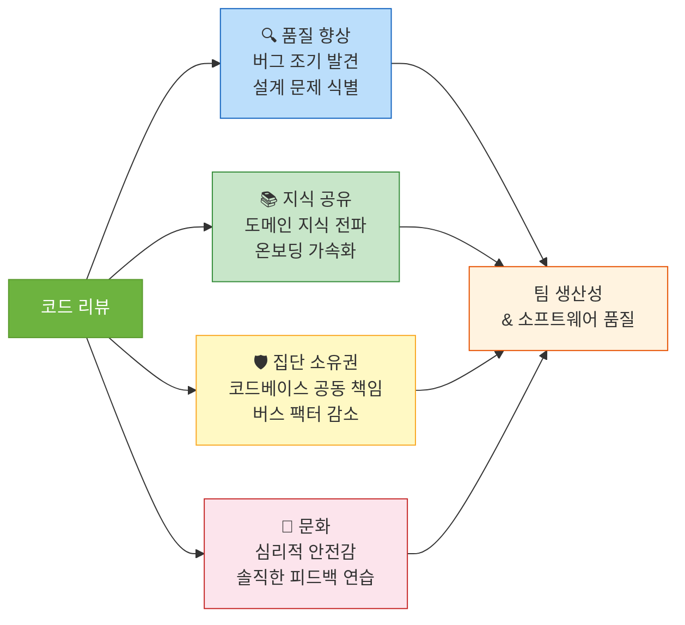
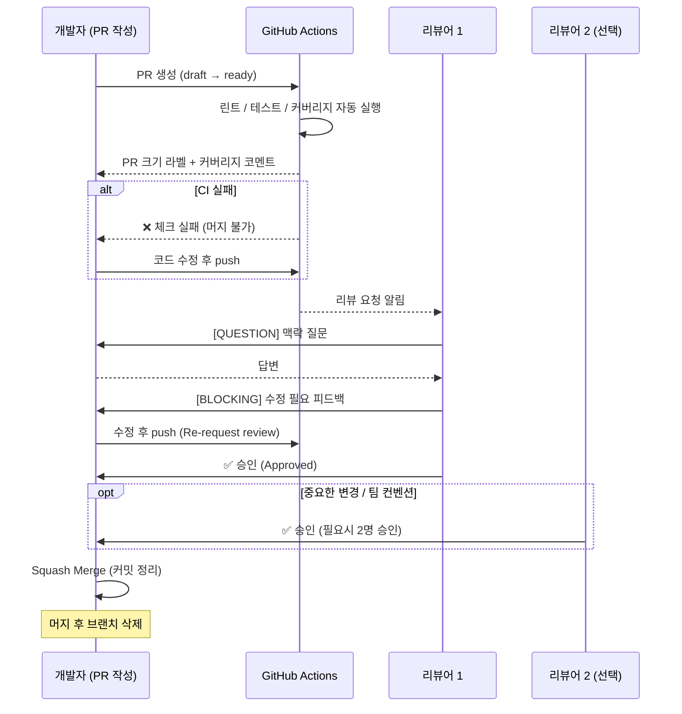

> 코드 리뷰를 무서워하거나, 귀찮아하거나, 형식적으로 처리하고 있다면 팀이 성장할 수 없다. 좋은 리뷰 문화는 개인 코딩 실력보다 팀 전체 품질을 높이는 가장 강력한 도구다.

## 핵심 요약 (TL;DR)

효과적인 코드 리뷰는 **작은 PR + 명확한 피드백 + 자동화** 세 축으로 구성된다. Google의 eng-practices에 따르면 "리뷰어는 코드베이스 전반의 품질을 올리는 방향으로 승인하되, 완벽주의로 리뷰를 지연하지 말라"고 한다. 실무에서는 **200줄 이하 PR**, **NITS/BLOCKING 피드백 구분**, **린트·테스트·커버리지 자동화**로 사람이 판단해야 하는 리뷰에만 집중한다.

---

## 코드 리뷰가 팀에 가져오는 가치



**버스 팩터(Bus Factor):** 핵심 개발자 1명이 갑자기 팀을 떠났을 때 프로젝트가 얼마나 유지될 수 있는가. 코드 리뷰는 팀 전체가 코드베이스를 이해하게 하여 버스 팩터를 높인다.

---

## 1. PR 작성자의 원칙

### PR 크기 — 작게, 더 작게

```
❌ 나쁜 PR:
  - 5개 기능을 한 PR에 묶음
  - 2,000줄 변경
  - "다음 스프린트 기능 + 리팩토링 + 버그 픽스 한 번에"

✅ 좋은 PR:
  - 하나의 목적 (기능/버그/리팩토링)
  - 200줄 이하 변경 권장
  - 리뷰 시간 15~30분 목표
```

**왜 200줄인가?** 연구에 따르면 400줄 이상에서 버그 발견율이 급격히 떨어진다. 사람의 집중력에는 한계가 있고, 작은 PR일수록 리뷰어가 맥락을 빠르게 파악한다.

### PR 템플릿 — 리뷰어의 맥락 이해를 도와라

```markdown
<!-- .github/PULL_REQUEST_TEMPLATE.md -->

## 📌 변경 요약
<!-- 이 PR이 무엇을 하는지 한 문장으로 -->

## 🎯 변경 이유
<!-- 왜 이 변경이 필요한가? (이슈 링크, 배경) -->
Closes #이슈번호

## 📦 변경 범위
- [ ] 새 기능 (breaking change 없음)
- [ ] 버그 픽스
- [ ] 리팩토링 (기능 변경 없음)
- [ ] 문서 수정
- [ ] 테스트 추가/수정

## 🔍 주요 변경 파일
<!-- 리뷰어가 먼저 봐야 할 파일 목록 -->
- `src/service/OrderService.java` — 주문 취소 로직 추가
- `src/controller/OrderController.java` — 취소 API 엔드포인트

## ✅ 테스트
<!-- 어떻게 테스트했는가? -->
- [ ] 단위 테스트 추가/수정
- [ ] 통합 테스트 확인
- [ ] 로컬 API 테스트 (curl 명령어 포함 시 더 좋음)

```bash
curl -X DELETE http://localhost:8081/api/v1/orders/1 \
  -H "Authorization: Bearer $TOKEN"
```

## ⚠️ 주의 사항 / 리뷰 포인트
<!-- 특별히 의견을 구하고 싶은 부분, 트레이드오프가 있는 결정 -->
- `OrderService.cancel()` 메서드의 트랜잭션 범위 결정 — 더 좋은 방법이 있을까요?

## 📸 스크린샷 (UI 변경 시)
```

### 커밋 메시지 컨벤션 (Conventional Commits)

```bash
# 형식: <type>(<scope>): <description>
# type: feat, fix, refactor, test, docs, chore, perf

# ✅ 좋은 예
feat(order): 주문 취소 API 추가 (#123)
fix(auth): JWT 만료 토큰 처리 오류 수정
refactor(product): ProductService N+1 쿼리 최적화
test(member): 회원 가입 중복 이메일 테스트 케이스 추가
docs(api): 주문 API OpenAPI 명세 업데이트

# ❌ 나쁜 예
git commit -m "수정"
git commit -m "fix bug"
git commit -m "WIP"
git commit -m "여러 가지 수정"
```

---

## 2. 리뷰어의 원칙

### 피드백 강도 구분 — NITS, SUGGESTING, BLOCKING

리뷰 댓글에 명확한 레이블을 붙이면 작성자가 우선순위를 파악하기 쉽다.

```
# 피드백 레이블 컨벤션

[BLOCKING] 반드시 수정 필요 — 머지 불가
[BLOCKING] 이 구현은 N+1 쿼리가 발생합니다.
         findAll() 후 루프에서 getSomething()을 호출하고 있어
         데이터 100개면 쿼리 101번이 나갑니다.
         Fetch Join이나 @EntityGraph를 사용해주세요.

[SUGGEST] 더 나은 방법이 있지만 선택은 작성자에게
[SUGGEST] Optional.orElseThrow(IllegalArgumentException::new) 대신
          커스텀 예외를 사용하면 에러 코드가 명확해질 것 같습니다.
          현재 방식도 동작은 합니다.

[NIT] 사소한 스타일, 네이밍, 포맷 이슈 — 취향 차이
[NIT] getUser → findUser로 이름 변경하면 더 관용적이지만
      팀 컨벤션에 따르세요.

[QUESTION] 이해를 위한 질문 — 수정 불필요
[QUESTION] 여기서 REQUIRES_NEW를 쓴 이유가 있나요?
           부모 트랜잭션과 분리가 필요한 케이스인가요?

[PRAISE] 좋은 코드에 칭찬
[PRAISE] 이 캐싱 전략 깔끔합니다! 배웠습니다 👍
```

### 리뷰 시 집중할 것들

```
✅ 리뷰어가 봐야 하는 것
├── 버그 & 로직 오류 (기능이 의도대로 동작하는가?)
├── 설계 & 아키텍처 (계층 책임, SOLID 원칙)
├── 보안 취약점 (SQL Injection, XSS, 인증/인가 누락)
├── 성능 이슈 (N+1, 불필요한 DB 쿼리, 루프 내 IO)
├── 테스트 품질 (엣지 케이스 커버, 의미 있는 검증)
└── 도메인 지식 (비즈니스 룰을 올바르게 구현했는가?)

❌ 리뷰어가 하지 말아야 하는 것
├── 코드 스타일/포맷 지적 (→ 자동화로 처리)
├── 개인 취향 강요 ("나라면 이렇게 했을 텐데...")
├── 너무 늦은 리뷰 (24시간 이내 1차 피드백 목표)
└── "왜 이렇게 했어요?" 같은 판단적 표현
```

### 건설적 피드백 작성법

```markdown
❌ 나쁜 피드백:
"이 코드 이해할 수 없네요"
"왜 이렇게 복잡하게 짰어요?"
"전에 설명한 방법으로 하세요"

✅ 좋은 피드백 구조:
"[문제 설명] + [이유/근거] + [구체적 대안]"

예시:
"[BLOCKING] 여기서 List를 반복하며 findById()를 호출하면
 N+1 문제가 발생합니다. (근거: 주문 100개면 DB 쿼리 101번 발생)
 
 개선 방법: findAllById(ids)로 한 번에 조회하거나,
 @EntityGraph로 미리 fetch하는 것을 권장합니다.
 
 참고: Part 4 JPA 포스트의 N+1 해결 섹션 참고하시면 도움될 것 같습니다."
```

---

## 3. 자동화 — 사람이 할 일만 남겨라

린트, 포맷, 테스트, 커버리지는 자동화로 처리하고, 리뷰어는 로직과 설계에 집중해야 한다.

### GitHub Actions CI 파이프라인

```yaml
# .github/workflows/pr-check.yml
name: PR Quality Gate

on:
  pull_request:
    branches: [main, develop]

jobs:
  quality-gate:
    runs-on: ubuntu-latest
    steps:
      - uses: actions/checkout@v4

      - name: Set up JDK 21
        uses: actions/setup-java@v4
        with:
          java-version: '21'
          distribution: 'temurin'

      # Gradle 빌드 캐시 — 반복 실행 속도 향상
      - name: Cache Gradle packages
        uses: actions/cache@v4
        with:
          path: |
            ~/.gradle/caches
            ~/.gradle/wrapper
          key: gradle-${{ hashFiles('**/*.gradle*', '**/gradle-wrapper.properties') }}

      # 코드 스타일 검사 (Checkstyle)
      - name: Checkstyle
        run: ./gradlew checkstyleMain checkstyleTest

      # 컴파일 오류 + 단위 테스트
      - name: Build & Test
        run: ./gradlew clean build

      # 테스트 커버리지 리포트 (JaCoCo)
      - name: Coverage Report
        run: ./gradlew jacocoTestReport jacocoTestCoverageVerification

      # 커버리지 PR 코멘트 자동 게시
      - name: Coverage Comment
        uses: madrapps/jacoco-report@v1.7.1
        with:
          paths: ${{ github.workspace }}/build/reports/jacoco/test/jacocoTestReport.xml
          token: ${{ secrets.GITHUB_TOKEN }}
          min-coverage-overall: 70
          min-coverage-changed-files: 80
          title: '📊 테스트 커버리지 리포트'

  # PR 크기 경고 (200줄 초과 시 라벨 + 코멘트)
  pr-size-check:
    runs-on: ubuntu-latest
    steps:
      - uses: actions/checkout@v4
        with:
          fetch-depth: 0

      - name: Check PR size
        uses: actions/github-script@v7
        with:
          script: |
            const { data: pr } = await github.rest.pulls.get({
              owner: context.repo.owner,
              repo: context.repo.repo,
              pull_number: context.issue.number,
            });

            const additions = pr.additions;
            const deletions = pr.deletions;
            const total = additions + deletions;

            let label, message;

            if (total <= 100) {
              label = 'size/XS';
              message = '✅ 이상적인 PR 크기입니다! (변경 줄 수: ' + total + ')';
            } else if (total <= 200) {
              label = 'size/S';
              message = '👍 적절한 PR 크기입니다. (변경 줄 수: ' + total + ')';
            } else if (total <= 400) {
              label = 'size/M';
              message = '⚠️ PR 크기가 다소 큽니다 (' + total + '줄). 분리를 고려해보세요.';
            } else {
              label = 'size/L';
              message = '🚨 PR 크기가 매우 큽니다 (' + total + '줄). 작은 PR으로 분리를 강력 권장합니다.';
            }

            // 라벨 추가
            await github.rest.issues.addLabels({
              owner: context.repo.owner,
              repo: context.repo.repo,
              issue_number: context.issue.number,
              labels: [label]
            });

            // 코멘트 추가
            await github.rest.issues.createComment({
              owner: context.repo.owner,
              repo: context.repo.repo,
              issue_number: context.issue.number,
              body: message
            });
```

### `build.gradle.kts` — 자동화 도구 설정

```kotlin
// build.gradle.kts

plugins {
    // ... 기존 플러그인 ...
    id("checkstyle")         // 코드 스타일 검사
    id("jacoco")             // 테스트 커버리지
}

// ── Checkstyle 설정 ───────────────────────────────────────
checkstyle {
    toolVersion = "10.20.1"
    configFile = file("config/checkstyle/checkstyle.xml")
    isIgnoreFailures = false  // 스타일 위반 시 빌드 실패
}

// ── JaCoCo 커버리지 설정 ──────────────────────────────────
jacoco {
    toolVersion = "0.8.12"
}

tasks.jacocoTestReport {
    dependsOn(tasks.test)
    reports {
        xml.required = true   // GitHub Actions에서 읽음
        html.required = true  // 로컬 브라우저에서 확인
    }
}

tasks.jacocoTestCoverageVerification {
    violationRules {
        rule {
            limit {
                minimum = "0.70".toBigDecimal()  // 전체 70% 이상
            }
        }
        rule {
            // 변경된 파일에 대한 더 엄격한 기준
            limit {
                counter = "LINE"
                value = "COVEREDRATIO"
                minimum = "0.80".toBigDecimal()
            }
        }
    }
}
```

### `checkstyle.xml` — 코드 스타일 규칙

```xml
<!-- config/checkstyle/checkstyle.xml -->
<?xml version="1.0"?>
<!DOCTYPE module PUBLIC "-//Checkstyle//DTD Checkstyle Configuration 1.3//EN"
    "https://checkstyle.org/dtds/configuration_1_3.dtd">

<module name="Checker">
    <property name="charset" value="UTF-8"/>
    <property name="severity" value="error"/>

    <module name="TreeWalker">
        <!-- 임포트 순서 및 미사용 임포트 -->
        <module name="UnusedImports"/>
        <module name="RedundantImport"/>

        <!-- 메서드 길이 제한 -->
        <module name="MethodLength">
            <property name="max" value="60"/>  <!-- 60줄 초과 시 경고 -->
        </module>

        <!-- 파일당 클래스 수 제한 -->
        <module name="OuterTypeNumber">
            <property name="max" value="1"/>
        </module>

        <!-- Javadoc (공개 API에만 강제) -->
        <!-- <module name="JavadocMethod"> 팀 컨벤션에 따라 활성화 -->

        <!-- 빈 catch 블록 금지 -->
        <module name="EmptyCatchBlock">
            <property name="exceptionVariableName" value="expected|ignore"/>
        </module>
    </module>
</module>
```

### reviewdog — 인라인 리뷰 자동화

```yaml
# .github/workflows/reviewdog.yml
name: reviewdog

on: [pull_request]

jobs:
  checkstyle:
    runs-on: ubuntu-latest
    permissions:
      pull-requests: write
    steps:
      - uses: actions/checkout@v4
      - uses: actions/setup-java@v4
        with:
          java-version: '21'
          distribution: 'temurin'
      - uses: reviewdog/action-checkstyle@v1
        with:
          github_token: ${{ secrets.GITHUB_TOKEN }}
          reporter: github-pr-review   # PR에 인라인 댓글로 달림
          checkstyle_config: config/checkstyle/checkstyle.xml
          level: warning
```

**reviewdog를 사용하면:** Checkstyle 위반 사항이 PR의 해당 코드 라인에 자동으로 인라인 댓글로 달린다. 리뷰어가 스타일 문제를 일일이 지적할 필요가 없어진다.

---

## 4. 코드 리뷰 워크플로우



### 브랜치 보호 규칙 설정 (GitHub)

```yaml
# GitHub Repository → Settings → Branches → Branch protection rules

# main 브랜치에 적용
Branch name pattern: main

# ✅ Require a pull request before merging
  Required approvals: 1 (팀 규모에 따라 2로 설정)

# ✅ Require status checks to pass before merging
  Status checks: quality-gate, pr-size-check

# ✅ Require branches to be up to date before merging

# ✅ Restrict who can push to matching branches
  (팀 리드 / 자동화 봇만)
```

---

## 5. 페어 프로그래밍 — 리뷰가 필요 없는 코드

페어 프로그래밍은 작성 단계에서 리뷰가 동시에 이뤄지는 방식이다. 모든 코드에 적용할 수는 없지만, 복잡한 기능이나 온보딩 상황에서 매우 효과적이다.

```
상황별 활용 기준:

✅ 페어 프로그래밍이 효과적인 경우:
  - 복잡한 알고리즘 / 설계 결정이 많은 기능
  - 신규 팀원 온보딩 (드라이버: 신규, 내비게이터: 시니어)
  - 버그 원인을 찾기 어려울 때
  - 도메인 지식 전수가 필요할 때
  - 보안 관련 민감한 코드 작성

✅ 일반 코드 리뷰가 더 적합한 경우:
  - 단순한 CRUD 기능
  - 이미 팀이 잘 아는 패턴의 반복 작업
  - 비동기 리뷰가 가능한 시간대가 맞지 않는 팀
  - 집중 작업이 필요한 경우
```

### 페어 프로그래밍 도구

```bash
# VS Code Live Share — 실시간 원격 협업
# 1. Extension 설치
code --install-extension ms-vsliveshare.vsliveshare

# 2. 세션 시작 (호스트)
# VS Code: Live Share → Share → 링크 공유

# 3. 접속 (게스트)
# 공유 링크 클릭 → 브라우저 또는 VS Code에서 참가

# IntelliJ IDEA Code With Me
# Tools → Code With Me → Enable Access and Start Session
```

---

## 6. 리뷰 문화 체크리스트

### 팀 레벨 — "우리 팀의 리뷰 문화는 건강한가?"

```markdown
# 주간 리뷰 문화 체크 (팀 회고에 활용)

## PR 작성자 측면
- [ ] PR이 200줄 이하로 유지되고 있는가?
- [ ] PR 설명에 '왜 변경했는지'가 명확한가?
- [ ] 테스트가 포함되어 있는가?
- [ ] CI가 통과된 후 리뷰를 요청하고 있는가?
- [ ] 리뷰 피드백에 24시간 이내 답변하고 있는가?

## 리뷰어 측면
- [ ] 리뷰 요청 후 24시간 이내 1차 피드백을 주고 있는가?
- [ ] [BLOCKING] / [SUGGEST] / [NIT] 구분이 명확한가?
- [ ] 코드 스타일 지적보다 로직/설계에 집중하고 있는가?
- [ ] 긍정적인 피드백([PRAISE])도 남기고 있는가?
- [ ] 판단적이지 않은 언어를 사용하고 있는가?

## 자동화 측면
- [ ] CI 파이프라인이 린트/테스트/커버리지를 자동 검사하는가?
- [ ] PR 머지 전 CI 통과가 강제되어 있는가?
- [ ] 커버리지 임계값이 설정되어 있는가?
- [ ] PR 크기 라벨 자동화가 되어 있는가?
```

### 개인 레벨 — 리뷰어 자가 점검

```markdown
# 리뷰 시작 전 5분 체크

1. PR 설명과 관련 이슈를 먼저 읽었는가? (맥락 이해)
2. 변경 파일 목록을 훑어봤는가? (큰 그림 파악)
3. 핵심 변경 파일에 집중했는가? (자동 생성 파일, 설정 파일 제외)
4. 비즈니스 로직이 올바른지 우선 확인했는가?
5. 피드백이 구체적이고 건설적인가?
```

---

## 실무 적용 예시 — 실제 리뷰 댓글 비교

### 나쁜 리뷰 vs 좋은 리뷰

```java
// 리뷰 대상 코드
public List<User> getActiveUsers() {
    List<User> users = userRepository.findAll();
    List<User> result = new ArrayList<>();
    for (User user : users) {
        if (user.getStatus() == "ACTIVE") {  // 버그!
            result.add(user);
        }
    }
    return result;
}
```

```
❌ 나쁜 리뷰 댓글들:
- "이 코드 뭔가요?"
- "왜 이렇게 구현했어요?"
- "전부 다시 짜야 할 것 같습니다"
- "String 비교를 이렇게 하면 안 되죠 (우리 스터디에서 배웠잖아요)"
```

```
✅ 좋은 리뷰 댓글들:

[BLOCKING] String을 ==로 비교하면 참조 비교가 됩니다.
           user.getStatus() == "ACTIVE"는 항상 false일 수 있습니다.
           "ACTIVE".equals(user.getStatus()) 또는 Enum으로 변경해주세요.

[BLOCKING] findAll()로 모든 유저를 로드한 뒤 메모리에서 필터링하고 있어
           사용자가 100만 명이면 OutOfMemoryError가 발생할 수 있습니다.
           findByStatus(UserStatus.ACTIVE)로 DB 레벨 필터링을 권장합니다:
           
           public List<User> findByStatus(UserStatus status);  // Repository에 추가

[SUGGEST] status를 String 대신 enum UserStatus로 변경하면
          컴파일 타임 오류 방지 + IDE 자동완성이 됩니다.
          (현재 방식도 수정 후 동작은 합니다)

[NIT] 메서드 이름 getActiveUsers → findActiveUsers
      (Spring Data JPA 관례와 통일)
```

---

## 트레이드오프 정리

| 항목 | 권장 | 트레이드오프 |
|------|------|------------|
| **PR 크기** | 200줄 이하 | 기능이 크면 분할하는 오버헤드 발생 |
| **필수 승인 수** | 1~2명 | 2명 이상이면 속도 느려짐 / 1명이면 품질 위험 |
| **자동화 범위** | 린트+테스트+커버리지 | 과도한 자동화는 개발자 창의성 제한 가능 |
| **리뷰 응답 SLA** | 24시간 이내 | 리뷰어 다른 업무와 충돌 가능 |
| **페어 프로그래밍** | 복잡한 코드에만 | 항상 페어하면 생산성 저하 가능 |
| **[NIT] 피드백** | 남기되 강제 수정 X | 너무 많으면 작성자 부담 증가 |

---

## 마무리 — 코드 리뷰 문화의 핵심

> "코드 리뷰의 목표는 완벽한 코드를 만드는 것이 아니라, 코드베이스 전반의 건강함을 올리는 것이다." — Google Engineering Practices

좋은 코드 리뷰 문화는 하루아침에 만들어지지 않는다. **작은 PR로 시작하고, 자동화로 사소한 것들을 제거하고, 피드백은 명확하고 건설적으로** — 이 세 가지를 팀이 꾸준히 실천하면 반년 후 코드베이스와 팀 문화 모두 달라진다.

---

## 레퍼런스

### 공식 가이드
- [Google Engineering Practices — Code Review](https://google.github.io/eng-practices/review/) — Google의 코드 리뷰 표준 (리뷰어 가이드 + 작성자 가이드)
- [GitHub Code Review Features](https://github.com/features/code-review) — GitHub 코드 리뷰 기능 소개

### 도구
- [reviewdog — Automated Code Review Tool](https://github.com/reviewdog/reviewdog) — 린터 결과를 PR 인라인 댓글로 자동 게시
- [How to Automate Code Reviews Using GitHub Actions](https://github.com/orgs/community/discussions/178963) — GitHub Actions 기반 리뷰 자동화 (2025)
- [jacoco-report GitHub Action](https://github.com/madrapps/jacoco-report) — JaCoCo 커버리지를 PR 코멘트로 자동 표시

### 기술 블로그
- [Google's Code Review Guidelines (GitHub Adaptation)](https://solmaz.io/google-eng-practices-github) — Google 리뷰 가이드라인 실무 적용법 (2025)

---

*이 포스트는 [HoneyByte](https://blog.honeybarrel.co.kr) 개발 문화 시리즈의 일부입니다.*
