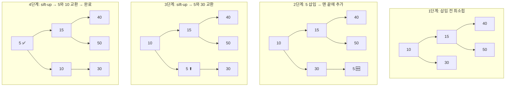
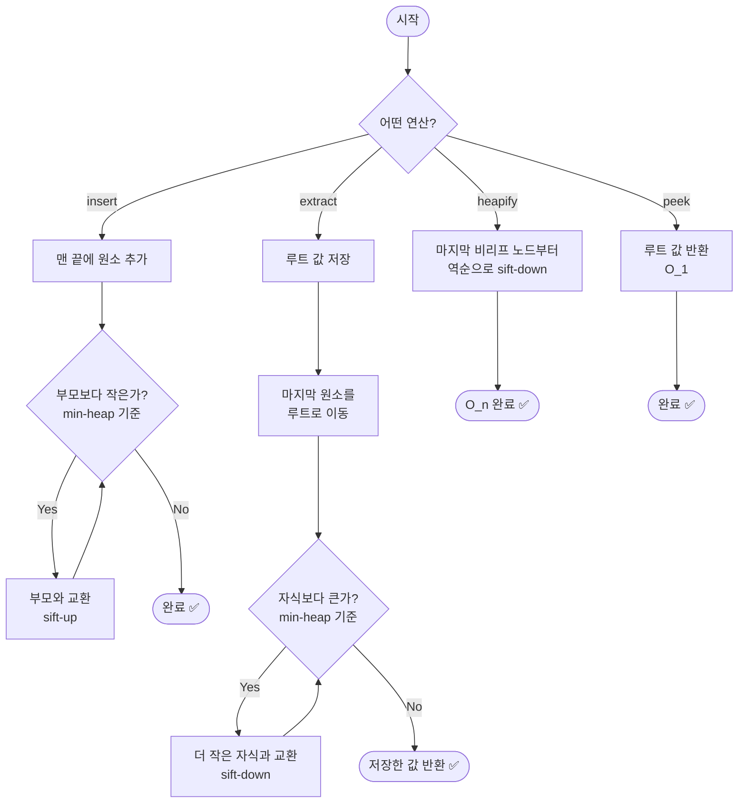

자료 수집이 완료되었습니다. 이제 HoneyByte 포맷에 맞춰 포스트를 작성하겠습니다.

---

# [HoneyByte] 2026.04.01 - DataStructure: 힙과 우선순위 큐

> 🐝 HoneyByte CS Study | 자료구조 시리즈
> 작성일: 2026-04-01 | 카테고리: DataStructure

> **한 줄 요약:** 힙은 "항상 가장 중요한 것을 먼저 꺼내는" 완전 이진 트리이며, 우선순위 큐의 가장 효율적인 구현체다.
> **난이도:** ⭐⭐⭐ | **카테고리:** 자료구조 / 트리 / 정렬 | **키워드:** 최소힙, 최대힙, 힙 정렬, heapify, 우선순위 큐

---

## 1. 왜 힙이 필요한가?

**응급실을 떠올려보자.** 환자가 도착한 순서대로 치료하지 않는다. 심정지 환자가 감기 환자보다 먼저 치료받는다. 이것이 바로 **우선순위 큐(Priority Queue)** 의 핵심 개념이다 — 들어온 순서가 아니라, **중요도(우선순위)** 에 따라 처리하는 것.

그렇다면 이걸 어떻게 효율적으로 구현할까?

| 구현 방식 | 삽입 | 최솟값/최댓값 삭제 | 문제점 |
|-----------|------|-------------------|--------|
| 정렬된 배열 | O(n) | O(1) | 삽입할 때마다 전체를 밀어야 함 |
| 정렬 안 된 배열 | O(1) | O(n) | 꺼낼 때 전체를 스캔해야 함 |
| 연결 리스트 | O(n) 또는 O(1) | O(n) 또는 O(1) | 어느 쪽이든 한쪽이 느림 |
| **힙 (Heap)** | **O(log n)** | **O(log n)** | ✅ 양쪽 모두 빠름 |

**결론: 힙은 삽입과 삭제 모두 O(log n)을 보장하는 유일한 구조다.** 이것이 우선순위 큐의 표준 구현체로 힙이 선택된 이유다.

실무에서도 힙은 어디에나 등장한다:
- **운영체제**: 프로세스 스케줄링 (우선순위 높은 프로세스 먼저 실행)
- **네트워크**: 다익스트라 최단 경로 알고리즘
- **데이터베이스**: Top-K 쿼리 처리
- **이벤트 시스템**: 타이머 기반 이벤트 큐 (가장 빨리 만료되는 이벤트 먼저 처리)

---

## 2. 핵심 개념 (이론)

### 2.1 힙이란?

**힙(Heap)** 은 **완전 이진 트리(Complete Binary Tree)** 로서, 부모-자식 간에 특정한 대소 관계를 항상 만족하는 자료구조다.

> 🍯 **비유**: 힙은 "회사 조직도"와 비슷하다. 최대힙이면 사장(루트)이 항상 모든 직원보다 직급이 높고, 각 부서장도 자기 팀원보다 직급이 높다. 단, 같은 레벨의 부서 간에는 순서가 정해져 있지 않다.

### 2.2 최소힙 vs 최대힙

| 속성 | 최소힙 (Min-Heap) | 최대힙 (Max-Heap) |
|------|-------------------|-------------------|
| **힙 속성** | 부모 ≤ 자식 | 부모 ≥ 자식 |
| **루트** | 전체 최솟값 | 전체 최댓값 |
| **용도** | 가장 작은 값 빠르게 추출 | 가장 큰 값 빠르게 추출 |
| **Python** | `heapq` (기본) | `-value` 로 부호 반전하여 사용 |
| **Java** | `PriorityQueue` (기본) | `Collections.reverseOrder()` 사용 |

### 2.3 완전 이진 트리와 배열 표현

힙의 핵심 트릭: **완전 이진 트리는 배열로 표현할 수 있다.** 포인터가 필요 없다.

인덱스 0부터 시작할 때:
- **부모 인덱스**: `(i - 1) // 2`
- **왼쪽 자식**: `2 * i + 1`
- **오른쪽 자식**: `2 * i + 2`

```
           10              배열: [10, 15, 30, 40, 50, 100, 40]
         /    \            인덱스: [0,  1,  2,  3,  4,   5,  6]
       15      30
      /  \    /  \
    40   50  100  40
```

> 왜 배열인가? 완전 이진 트리는 중간에 빈 자리가 없기 때문에 배열에 빈틈 없이 저장 가능하다. 캐시 지역성(Cache Locality)도 좋아져 실제 성능도 뛰어나다.

### 2.4 핵심 연산

| 연산 | 설명 | 시간 복잡도 |
|------|------|------------|
| **insert (push)** | 맨 끝에 추가 → sift-up | O(log n) |
| **extract (pop)** | 루트 제거 → 마지막 원소를 루트로 → sift-down | O(log n) |
| **peek** | 루트 값 반환 (제거 안 함) | O(1) |
| **heapify** | 배열을 힙으로 변환 | O(n) ← O(n log n) 아님! |
| **heap sort** | heapify + 반복적 extract | O(n log n) |

#### Sift-Up (삽입 시)
새 원소를 맨 끝에 놓고, 부모보다 우선순위가 높으면 부모와 교환하며 위로 올라간다.

#### Sift-Down (삭제 시)
루트를 제거하고 마지막 원소를 루트에 놓은 뒤, 자식 중 우선순위가 더 높은 쪽과 교환하며 아래로 내려간다.

#### Heapify가 O(n)인 이유
직관적으로 O(n log n)일 것 같지만, 실제로는 O(n)이다. 리프 노드(전체의 약 절반)는 sift-down 할 필요가 없고, 높이가 낮은 노드일수록 많기 때문에 전체 작업량의 합이 O(n)으로 수렴한다.

---

## 3. 시각화

### 3.1 최소힙 삽입/삭제 과정



### 3.2 힙 연산 흐름도



---

## 4. 구현

### Python

```python
"""
최소힙 (Min-Heap) 구현
- 배열 기반 완전 이진 트리
- 모든 연산에서 불변성 원칙은 내부 상태 관리를 위해
  힙 자체에서만 예외 (자료구조 내부 동작)
"""


class MinHeap:
    """배열 기반 최소힙 구현."""

    def __init__(self):
        self._data: list[int] = []

    def __len__(self) -> int:
        return len(self._data)

    def __bool__(self) -> bool:
        return len(self._data) > 0

    def __repr__(self) -> str:
        return f"MinHeap({self._data})"

    # ── 인덱스 계산 ──

    @staticmethod
    def _parent(i: int) -> int:
        return (i - 1) // 2

    @staticmethod
    def _left(i: int) -> int:
        return 2 * i + 1

    @staticmethod
    def _right(i: int) -> int:
        return 2 * i + 2

    # ── 핵심 내부 연산 ──

    def _swap(self, i: int, j: int) -> None:
        self._data[i], self._data[j] = self._data[j], self._data[i]

    def _sift_up(self, idx: int) -> None:
        """삽입된 원소를 올바른 위치까지 위로 이동."""
        while idx > 0:
            parent = self._parent(idx)
            if self._data[idx] < self._data[parent]:
                self._swap(idx, parent)
                idx = parent
            else:
                break

    def _sift_down(self, idx: int) -> None:
        """원소를 올바른 위치까지 아래로 이동."""
        size = len(self._data)
        while True:
            smallest = idx
            left = self._left(idx)
            right = self._right(idx)

            if left < size and self._data[left] < self._data[smallest]:
                smallest = left
            if right < size and self._data[right] < self._data[smallest]:
                smallest = right

            if smallest == idx:
                break

            self._swap(idx, smallest)
            idx = smallest

    # ── 공개 API ──

    def push(self, value: int) -> None:
        """O(log n): 원소 삽입."""
        self._data.append(value)
        self._sift_up(len(self._data) - 1)

    def pop(self) -> int:
        """O(log n): 최솟값 제거 및 반환."""
        if not self._data:
            raise IndexError("pop from empty heap")

        root = self._data[0]
        last = self._data.pop()

        if self._data:
            self._data[0] = last
            self._sift_down(0)

        return root

    def peek(self) -> int:
        """O(1): 최솟값 반환 (제거 안 함)."""
        if not self._data:
            raise IndexError("peek from empty heap")
        return self._data[0]

    @classmethod
    def heapify(cls, arr: list[int]) -> "MinHeap":
        """O(n): 배열을 힙으로 변환."""
        heap = cls()
        heap._data = list(arr)  # 원본 보호를 위해 복사

        # 마지막 비리프 노드부터 역순으로 sift-down
        last_non_leaf = len(heap._data) // 2 - 1
        for i in range(last_non_leaf, -1, -1):
            heap._sift_down(i)

        return heap

    def heap_sort(self) -> list[int]:
        """O(n log n): 힙 정렬 (오름차순)."""
        result = []
        temp = MinHeap()
        temp._data = list(self._data)  # 원본 보호

        while temp:
            result.append(temp.pop())

        return result


# ── 사용 예제 ──

if __name__ == "__main__":
    # 1. 기본 사용
    heap = MinHeap()
    for val in [40, 10, 30, 5, 15, 50]:
        heap.push(val)
    print(f"힙 상태: {heap}")        # MinHeap([5, 10, 30, 40, 15, 50])
    print(f"최솟값: {heap.peek()}")   # 5
    print(f"추출: {heap.pop()}")      # 5
    print(f"다음 최솟값: {heap.peek()}")  # 10

    # 2. heapify (O(n) 변환)
    data = [35, 33, 42, 10, 14, 19, 27, 44, 26, 31]
    heap2 = MinHeap.heapify(data)
    print(f"\nHeapify 결과: {heap2}")

    # 3. 힙 정렬
    sorted_result = heap2.heap_sort()
    print(f"정렬 결과: {sorted_result}")

    # 4. Python 표준 라이브러리 heapq 사용법
    import heapq

    nums = [40, 10, 30, 5, 15, 50]
    heapq.heapify(nums)              # in-place O(n)
    print(f"\nheapq 결과: {nums}")
    heapq.heappush(nums, 3)          # 삽입
    print(f"3 삽입 후: {nums}")
    smallest = heapq.heappop(nums)   # 최솟값 추출
    print(f"추출: {smallest}, 남은 힙: {nums}")

    # 최대힙 트릭: 부호 반전
    max_heap = []
    for val in [40, 10, 30, 5, 15, 50]:
        heapq.heappush(max_heap, -val)
    print(f"\n최대힙(부호 반전): 최댓값 = {-heapq.heappop(max_heap)}")  # 50
```

### Java

```java
import java.util.ArrayList;
import java.util.Arrays;
import java.util.Collections;
import java.util.List;
import java.util.PriorityQueue;

/**
 * 최소힙 (Min-Heap) 구현
 * - 배열 기반 완전 이진 트리
 * - 제네릭 지원 (Comparable 구현체)
 */
public class MinHeap<T extends Comparable<T>> {

    private final List<T> data;

    public MinHeap() {
        this.data = new ArrayList<>();
    }

    public int size() {
        return data.size();
    }

    public boolean isEmpty() {
        return data.isEmpty();
    }

    // ── 인덱스 계산 ──

    private int parent(int i) { return (i - 1) / 2; }
    private int left(int i)   { return 2 * i + 1; }
    private int right(int i)  { return 2 * i + 2; }

    // ── 핵심 내부 연산 ──

    private void swap(int i, int j) {
        T temp = data.get(i);
        data.set(i, data.get(j));
        data.set(j, temp);
    }

    private void siftUp(int idx) {
        while (idx > 0) {
            int parentIdx = parent(idx);
            if (data.get(idx).compareTo(data.get(parentIdx)) < 0) {
                swap(idx, parentIdx);
                idx = parentIdx;
            } else {
                break;
            }
        }
    }

    private void siftDown(int idx) {
        int size = data.size();
        while (true) {
            int smallest = idx;
            int leftIdx = left(idx);
            int rightIdx = right(idx);

            if (leftIdx < size
                    && data.get(leftIdx).compareTo(data.get(smallest)) < 0) {
                smallest = leftIdx;
            }
            if (rightIdx < size
                    && data.get(rightIdx).compareTo(data.get(smallest)) < 0) {
                smallest = rightIdx;
            }

            if (smallest == idx) break;

            swap(idx, smallest);
            idx = smallest;
        }
    }

    // ── 공개 API ──

    /** O(log n): 원소 삽입 */
    public void push(T value) {
        data.add(value);
        siftUp(data.size() - 1);
    }

    /** O(log n): 최솟값 제거 및 반환 */
    public T pop() {
        if (data.isEmpty()) {
            throw new IllegalStateException("Heap is empty");
        }

        T root = data.get(0);
        T last = data.remove(data.size() - 1);

        if (!data.isEmpty()) {
            data.set(0, last);
            siftDown(0);
        }

        return root;
    }

    /** O(1): 최솟값 반환 (제거 안 함) */
    public T peek() {
        if (data.isEmpty()) {
            throw new IllegalStateException("Heap is empty");
        }
        return data.get(0);
    }

    /** O(n): 배열을 힙으로 변환 */
    public static <T extends Comparable<T>> MinHeap<T> heapify(List<T> arr) {
        MinHeap<T> heap = new MinHeap<>();
        heap.data.addAll(arr);  // 원본 보호를 위해 복사

        int lastNonLeaf = heap.data.size() / 2 - 1;
        for (int i = lastNonLeaf; i >= 0; i--) {
            heap.siftDown(i);
        }

        return heap;
    }

    /** O(n log n): 힙 정렬 (오름차순) */
    public List<T> heapSort() {
        // 원본 보호: 임시 힙 생성
        MinHeap<T> temp = new MinHeap<>();
        temp.data.addAll(this.data);

        List<T> result = new ArrayList<>();
        while (!temp.isEmpty()) {
            result.add(temp.pop());
        }
        return result;
    }

    @Override
    public String toString() {
        return "MinHeap(" + data + ")";
    }

    // ── 사용 예제 ──

    public static void main(String[] args) {
        // 1. 직접 구현한 MinHeap 사용
        MinHeap<Integer> heap = new MinHeap<>();
        for (int val : new int[]{40, 10, 30, 5, 15, 50}) {
            heap.push(val);
        }
        System.out.println("힙 상태: " + heap);
        System.out.println("최솟값: " + heap.peek());
        System.out.println("추출: " + heap.pop());

        // 2. heapify
        List<Integer> data = Arrays.asList(35, 33, 42, 10, 14, 19, 27, 44, 26, 31);
        MinHeap<Integer> heap2 = MinHeap.heapify(data);
        System.out.println("\nHeapify 결과: " + heap2);

        // 3. 힙 정렬
        List<Integer> sorted = heap2.heapSort();
        System.out.println("정렬 결과: " + sorted);

        // 4. Java 표준 라이브러리 PriorityQueue 사용법
        // 최소힙 (기본)
        PriorityQueue<Integer> minPQ = new PriorityQueue<>();
        for (int val : new int[]{40, 10, 30, 5, 15, 50}) {
            minPQ.offer(val);
        }
        System.out.println("\nPriorityQueue 최솟값: " + minPQ.peek());
        System.out.println("추출: " + minPQ.poll());

        // 최대힙 (reverseOrder)
        PriorityQueue<Integer> maxPQ =
                new PriorityQueue<>(Collections.reverseOrder());
        for (int val : new int[]{40, 10, 30, 5, 15, 50}) {
            maxPQ.offer(val);
        }
        System.out.println("\n최대힙 최댓값: " + maxPQ.peek());
        System.out.println("추출: " + maxPQ.poll());
    }
}
```

---

## 5. 복잡도 분석

### 시간 복잡도

| 연산 | 평균 | 최악 | 설명 |
|------|------|------|------|
| **push (삽입)** | O(1)* | O(log n) | *평균적으로 몇 단계만 올라감 |
| **pop (삭제)** | O(log n) | O(log n) | 항상 루트에서 리프까지 내려갈 수 있음 |
| **peek** | O(1) | O(1) | 루트만 확인 |
| **heapify** | O(n) | O(n) | 상향식 구축의 수학적 증명 |
| **heap sort** | O(n log n) | O(n log n) | n번 pop × 각 O(log n) |
| **탐색** | O(n) | O(n) | 힙은 탐색에 최적화되지 않음 |

> **push의 평균이 O(1)인 이유**: 새 원소가 이미 제자리에 있을 확률이 높다. 리프 노드가 전체의 ~50%이고, 대부분의 삽입은 트리 하단에서 멈추기 때문이다.

### 공간 복잡도

| 구현 | 공간 | 설명 |
|------|------|------|
| 배열 기반 힙 | O(n) | 추가 포인터 불필요 |
| 힙 정렬 (in-place) | O(1) | 추가 배열 없이 가능 |

### 📊 자료구조 비교 차트

```mermaid
xychart-beta
    title "우선순위 큐 구현체별 연산 비교 (log scale 근사, 낮을수록 좋음)"
    x-axis ["삽입", "최솟값 삭제", "최솟값 조회", "배열→힙 변환"]
    y-axis "시간 복잡도 단계 (1=O(1), 2=O(log n), 3=O(n), 4=O(n log n))" 0 --> 5
    bar "힙" [2, 2, 1, 3]
    bar "정렬 배열" [3, 1, 1, 4]
    bar "비정렬 배열" [1, 3, 3, 1]
    bar "이진 탐색 트리(BST)" [2, 2, 2, 3]
```



---

## 6. 실무 활용

### 6.1 운영체제 — 프로세스 스케줄링

OS 커널의 스케줄러는 우선순위 큐를 사용한다. Linux CFS(Completely Fair Scheduler)는 레드-블랙 트리를 쓰지만, 전통적인 우선순위 기반 스케줄러는 힙을 사용한다.

```
높은 우선순위 프로세스 → 힙의 루트 → 먼저 CPU 할당
```

### 6.2 네트워크 — 다익스트라 최단 경로

그래프에서 최단 경로를 찾는 다익스트라 알고리즘의 핵심은 **"현재까지 가장 비용이 적은 노드를 선택"** 하는 것이다. 이것은 정확히 최소힙의 `pop()` 연산이다.

```python
import heapq

def dijkstra(graph, start):
    distances = {node: float('inf') for node in graph}
    distances[start] = 0
    pq = [(0, start)]  # (거리, 노드) — 최소힙

    while pq:
        curr_dist, curr_node = heapq.heappop(pq)

        if curr_dist > distances[curr_node]:
            continue  # 이미 더 짧은 경로 발견됨

        for neighbor, weight in graph[curr_node]:
            distance = curr_dist + weight
            if distance < distances[neighbor]:
                distances[neighbor] = distance
                heapq.heappush(pq, (distance, neighbor))

    return distances
```

> 힙 없이 다익스트라: O(V²). 힙 사용 시: O((V+E) log V). 정점이 많을수록 차이가 극적이다.

### 6.3 실시간 시스템 — Top-K 문제

"실시간으로 들어오는 데이터에서 상위 K개만 유지하라" — 이것은 코딩 인터뷰의 단골이자 실무에서 가장 많이 쓰이는 힙 활용 패턴이다.

- **크기 K의 최소힙**을 유지
- 새 원소가 힙의 루트(현재 K개 중 최솟값)보다 크면 교체
- 결과: 항상 상위 K개만 O(K) 공간에 보관

```python
import heapq

def top_k_elements(stream, k):
    """스트림에서 상위 K개 원소를 효율적으로 유지."""
    min_heap = []

    for value in stream:
        if len(min_heap) < k:
            heapq.heappush(min_heap, value)
        elif value > min_heap[0]:
            heapq.heapreplace(min_heap, value)  # pop + push 한 번에

    return sorted(min_heap, reverse=True)
```

### 6.4 장애/보안 관점

| 관점 | 리스크 | 대응 |
|------|--------|------|
| **DoS 공격** | 우선순위 큐에 대량 삽입 → 메모리 폭발 | 힙 크기 상한(capacity) 설정 |
| **우선순위 역전** | 낮은 우선순위 작업이 자원을 점유 → 높은 우선순위 작업 지연 | 우선순위 상속 프로토콜, 타임아웃 |
| **기아(Starvation)** | 낮은 우선순위 작업이 영원히 처리되지 않음 | 에이징(aging): 대기 시간에 따라 우선순위 점진적 상승 |

### 6.5 프레임워크 적용 사례

| 프레임워크/라이브러리 | 활용 | 내부 구현 |
|----------------------|------|----------|
| **Java `Timer` / `ScheduledThreadPoolExecutor`** | 타이머 기반 작업 스케줄링 | 내부적으로 힙 사용 |
| **Python `asyncio`** | 이벤트 루프의 예약된 콜백 관리 | `heapq` 기반 |
| **Spring Framework `TaskScheduler`** | 예약 작업 실행 | `PriorityQueue` 기반 |
| **Kafka Streams** | 윈도우 기반 집계에서 타임스탬프 정렬 | 내부 힙 활용 |
| **Redis** | Sorted Set (ZSET) | Skip List + Hash (힙과 유사 목적) |

---

## 7. 연습 문제

### 기초 (힙 동작 이해)

| 난이도 | 문제 | 링크 |
|--------|------|------|
| Silver II | 최소 힙 | [백준 1927](https://www.acmicpc.net/problem/1927) |
| Silver II | 최대 힙 | [백준 11279](https://www.acmicpc.net/problem/11279) |
| Silver I | 절댓값 힙 | [백준 11286](https://www.acmicpc.net/problem/11286) |
| Easy | Last Stone Weight | [LeetCode 1046](https://leetcode.com/problems/last-stone-weight/) |
| Easy | Kth Largest Element in a Stream | [LeetCode 703](https://leetcode.com/problems/kth-largest-element-in-a-stream/) |

### 응용 (힙 활용 패턴)

| 난이도 | 문제 | 링크 |
|--------|------|------|
| Gold IV | 카드 정렬하기 | [백준 1715](https://www.acmicpc.net/problem/1715) |
| Gold IV | 이중 우선순위 큐 | [백준 7662](https://www.acmicpc.net/problem/7662) |
| Gold II | 가운데를 말해요 | [백준 1655](https://www.acmicpc.net/problem/1655) |
| Medium | Top K Frequent Elements | [LeetCode 347](https://leetcode.com/problems/top-k-frequent-elements/) |
| Medium | Kth Largest Element in an Array | [LeetCode 215](https://leetcode.com/problems/kth-largest-element-in-an-array/) |

### 심화 (두 힙 패턴, 복합 구조)

| 난이도 | 문제 | 핵심 패턴 | 링크 |
|--------|------|----------|------|
| Hard | Find Median from Data Stream | 최대힙 + 최소힙 | [LeetCode 295](https://leetcode.com/problems/find-median-from-data-stream/) |
| Hard | Merge k Sorted Lists | 크기 k 최소힙 | [LeetCode 23](https://leetcode.com/problems/merge-k-sorted-lists/) |

> 💡 **학습 추천 순서**: 백준 1927 → 11279 → 11286으로 기본기 → LeetCode 1046(Easy) → 347(Medium) → 295(Hard) 순으로 난이도를 높여라.

---

## 📎 레퍼런스

### 영상
- [MIT 6.006 — Lecture 4: Heaps and Heap Sort](https://ocw.mit.edu/courses/6-006-introduction-to-algorithms-fall-2011/resources/lecture-4-heaps-and-heap-sort/) — MIT OpenCourseWare. 힙의 수학적 증명과 heapify O(n) 유도를 다루는 학술적 강의
- [NeetCode — Heap/Priority Queue 문제 풀이 시리즈](https://neetcode.io/practice/problem-list/heap-priority-queue) — 코딩 인터뷰 빈출 힙 문제를 패턴별로 정리. 각 문제마다 YouTube 영상 풀이 제공

### 문서
- [Python `heapq` 공식 문서](https://docs.python.org/3/library/heapq.html) — Python 표준 라이브러리 최소힙. heappush, heappop, nlargest, nsmallest 등 API 레퍼런스
- [Java `PriorityQueue` 공식 문서 (Java 21)](https://docs.oracle.com/en/java/javase/21/docs/api/java.base/java/util/PriorityQueue.html) — Oracle 공식 API. 삽입/삭제 O(log n) 보장, Comparator 커스터마이징 방법
- [Programiz — Priority Queue Data Structure](https://www.programiz.com/dsa/priority-queue) — 시각화와 함께 힙 기반 우선순위 큐 개념을 설명. 다국어 구현 예제 포함
- [Real Python — The Python heapq Module](https://realpython.com/python-heapq-module/) — heapq의 실전 활용법. Top-K, 이벤트 스케줄링 등 실무 패턴 중심