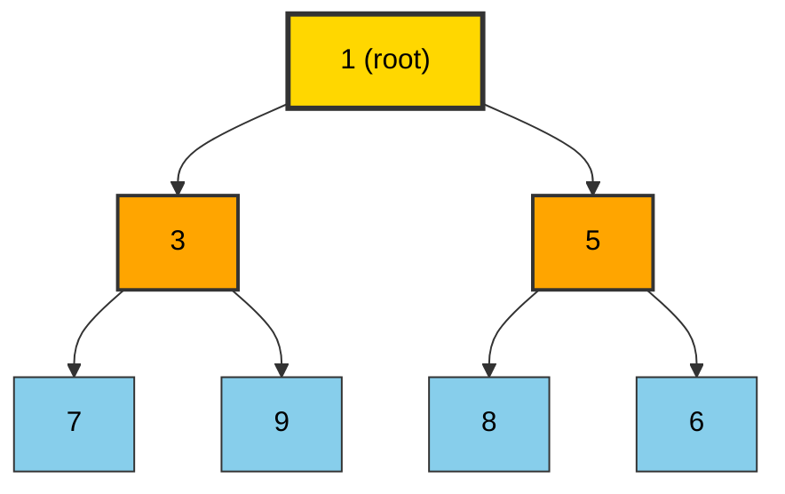
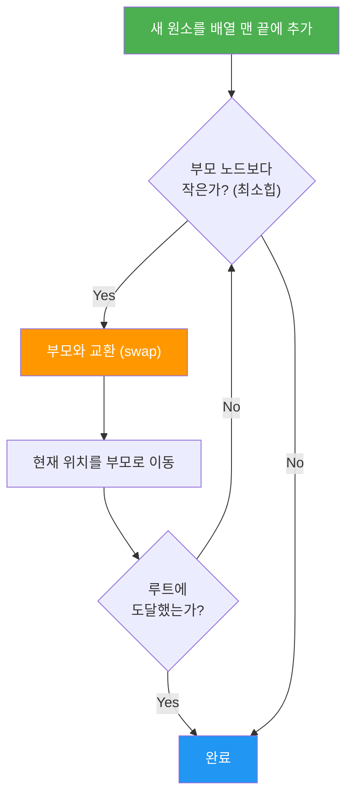
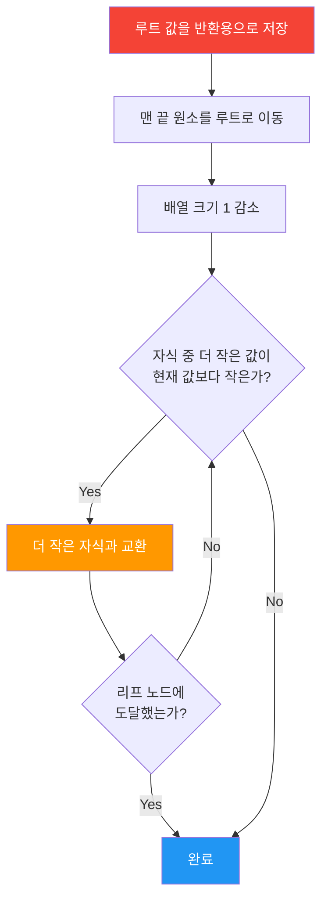

> 🐝 HoneyByte CS Study | 자료구조 시리즈
> 작성일: 2026-04-01 | 카테고리: DataStructure

> **한 줄 요약:** 힙(Heap)은 "가장 중요한 것을 항상 맨 위에" 유지하는 완전 이진 트리로, 우선순위 큐를 O(log n)에 구현하는 핵심 자료구조다.
> **난이도:** ⭐⭐⭐ | **카테고리:** DataStructure | **키워드:** 최소힙, 최대힙, 힙 정렬, heapify, 우선순위 큐

---

## 1. 왜 힙이 필요한가?

응급실을 떠올려 보자. 환자가 도착한 순서대로 치료하는 게 아니라, **중증도가 높은 환자부터** 치료한다. 감기 환자가 먼저 왔어도 심정지 환자가 들어오면 즉시 심정지 환자를 치료한다. 이것이 바로 **우선순위 큐(Priority Queue)**의 동작 방식이다.

그런데 이걸 어떻게 효율적으로 구현할까?

| 구현 방식 | 삽입 | 최솟값/최댓값 삭제 | 문제점 |
|-----------|------|-------------------|--------|
| 정렬된 배열 | O(n) | O(1) | 삽입할 때마다 정렬 위치를 찾아 밀어야 함 |
| 정렬되지 않은 배열 | O(1) | O(n) | 삭제할 때마다 전체를 탐색해야 함 |
| 연결 리스트 | O(n) 또는 O(1) | O(n) 또는 O(1) | 어느 쪽이든 한쪽이 O(n) |
| **힙(Heap)** | **O(log n)** | **O(log n)** | **양쪽 모두 빠름!** |

배열이나 연결 리스트로 구현하면 삽입과 삭제 중 하나는 반드시 O(n)이 된다. 힙은 **두 연산 모두 O(log n)**이라는 균형 잡힌 성능을 제공한다. 이것이 힙이 존재하는 이유다.

---

## 2. 핵심 개념 (이론)

### 2.1 힙(Heap)이란?

힙은 다음 두 가지 조건을 만족하는 트리다:

1. **완전 이진 트리(Complete Binary Tree):** 마지막 레벨을 제외한 모든 레벨이 꽉 차 있고, 마지막 레벨은 왼쪽부터 채워진다.
2. **힙 속성(Heap Property):** 부모 노드와 자식 노드 사이에 일정한 대소 관계가 성립한다.

### 2.2 최소힙 vs 최대힙

| 특성 | 최소힙(Min-Heap) | 최대힙(Max-Heap) |
|------|-----------------|-----------------|
| 루트 노드 | 전체에서 **가장 작은** 값 | 전체에서 **가장 큰** 값 |
| 부모-자식 관계 | 부모 ≤ 자식 | 부모 ≥ 자식 |
| peek 결과 | 최솟값 | 최댓값 |
| 대표 용도 | 다익스트라, 작업 스케줄링 | 힙 정렬, Top-K 문제 |

> **주의:** 힙은 "부모-자식" 관계만 보장한다. 같은 레벨의 형제 노드끼리는 크기 관계가 없다. 즉, 힙은 **부분 정렬(partial order)**이지, 완전 정렬이 아니다.

### 2.3 배열 기반 표현

완전 이진 트리의 장점은 **배열 하나로 트리를 표현**할 수 있다는 것이다. 포인터가 필요 없으므로 메모리 효율적이다.

```
인덱스 0부터 시작할 때:
- 부모 인덱스:       (i - 1) // 2
- 왼쪽 자식 인덱스:   2 * i + 1
- 오른쪽 자식 인덱스:  2 * i + 2
```

예시 (최소힙):
```
트리 형태:           배열 표현:
       1             [1, 3, 5, 7, 9, 8, 6]
      / \             0  1  2  3  4  5  6
     3   5
    / \ / \
   7  9 8  6
```

### 2.4 핵심 연산

| 연산 | 설명 | 시간 복잡도 |
|------|------|------------|
| **insert (push)** | 값을 삽입하고 sift-up으로 위치 조정 | O(log n) |
| **extract (pop)** | 루트를 제거하고 sift-down으로 재정렬 | O(log n) |
| **peek** | 루트 값 확인 (제거하지 않음) | O(1) |
| **heapify** | 임의의 배열을 힙으로 변환 | O(n) |
| **heap sort** | 힙을 이용한 정렬 | O(n log n) |

### 2.5 sift-up과 sift-down

**sift-up (버블업):** 삽입 시 사용. 새 원소를 맨 끝에 넣고, 부모보다 작으면(최소힙) 부모와 교환하며 올라간다.

**sift-down (버블다운):** 삭제 시 사용. 루트를 제거하고 맨 끝 원소를 루트로 올린 뒤, 자식 중 더 작은 것과 교환하며 내려간다.

### 2.6 heapify의 비밀: 왜 O(n)인가?

직관적으로 n개 원소를 하나씩 삽입하면 O(n log n)이다. 하지만 **Bottom-up heapify**는 O(n)에 가능하다.

비밀은 이렇다: 트리의 절반은 리프 노드(sift-down 불필요)이고, 높이가 올라갈수록 노드 수는 절반으로 줄지만 sift-down 거리는 늘어난다. 이 합을 계산하면:

```
Σ (높이 h에서의 노드 수) × h = n × Σ(h / 2^h) ≤ 2n = O(n)
```

---

## 3. 시각화

### 3.1 최소힙 구조



### 3.2 삽입 연산 (sift-up) 흐름



### 3.3 삭제 연산 (sift-down) 흐름



---

## 4. 구현

### Python

```python
class MinHeap:
    """최소힙 구현 — 배열 기반, 인덱스 0부터 시작."""

    def __init__(self):
        self._data: list[int] = []

    def __len__(self) -> int:
        return len(self._data)

    def __bool__(self) -> bool:
        return len(self._data) > 0

    def __repr__(self) -> str:
        return f"MinHeap({self._data})"

    # ── 내부 헬퍼 ──

    def _parent(self, i: int) -> int:
        return (i - 1) // 2

    def _left(self, i: int) -> int:
        return 2 * i + 1

    def _right(self, i: int) -> int:
        return 2 * i + 2

    def _swap(self, i: int, j: int) -> None:
        self._data[i], self._data[j] = self._data[j], self._data[i]

    def _sift_up(self, i: int) -> None:
        """삽입 후 힙 속성 복원 — 부모보다 작으면 교환하며 올라간다."""
        while i > 0 and self._data[i] < self._data[self._parent(i)]:
            self._swap(i, self._parent(i))
            i = self._parent(i)

    def _sift_down(self, i: int) -> None:
        """삭제 후 힙 속성 복원 — 자식 중 더 작은 것과 교환하며 내려간다."""
        size = len(self._data)
        while True:
            smallest = i
            left = self._left(i)
            right = self._right(i)

            if left < size and self._data[left] < self._data[smallest]:
                smallest = left
            if right < size and self._data[right] < self._data[smallest]:
                smallest = right

            if smallest == i:
                break

            self._swap(i, smallest)
            i = smallest

    # ── 공개 API ──

    def push(self, value: int) -> None:
        """O(log n) — 값을 힙에 삽입."""
        self._data.append(value)
        self._sift_up(len(self._data) - 1)

    def pop(self) -> int:
        """O(log n) — 최솟값을 제거하고 반환."""
        if not self._data:
            raise IndexError("pop from empty heap")

        root = self._data[0]
        last = self._data.pop()

        if self._data:
            self._data[0] = last
            self._sift_down(0)

        return root

    def peek(self) -> int:
        """O(1) — 최솟값 확인 (제거하지 않음)."""
        if not self._data:
            raise IndexError("peek from empty heap")
        return self._data[0]

    @classmethod
    def heapify(cls, arr: list[int]) -> "MinHeap":
        """O(n) — 기존 배열을 힙으로 변환 (Bottom-up)."""
        heap = cls()
        heap._data = list(arr)  # 원본 보호 — 새 리스트 생성
        # 마지막 비-리프 노드부터 역순으로 sift-down
        for i in range(len(heap._data) // 2 - 1, -1, -1):
            heap._sift_down(i)
        return heap

    @staticmethod
    def heap_sort(arr: list[int]) -> list[int]:
        """O(n log n) — 힙 정렬. 오름차순 정렬된 새 리스트 반환."""
        heap = MinHeap.heapify(arr)
        return [heap.pop() for _ in range(len(heap))]


# ── 사용 예시 ──
if __name__ == "__main__":
    # 1) 기본 사용
    h = MinHeap()
    for v in [5, 3, 8, 1, 9, 2]:
        h.push(v)
    print(f"Heap: {h}")           # MinHeap([1, 3, 2, 5, 9, 8])
    print(f"Peek: {h.peek()}")    # 1
    print(f"Pop:  {h.pop()}")     # 1
    print(f"Pop:  {h.pop()}")     # 2

    # 2) heapify
    data = [9, 7, 5, 3, 1, 8, 6]
    heap = MinHeap.heapify(data)
    print(f"Heapified: {heap}")   # MinHeap([1, 3, 5, 9, 7, 8, 6])

    # 3) 힙 정렬
    sorted_list = MinHeap.heap_sort([4, 10, 3, 5, 1])
    print(f"Sorted: {sorted_list}")  # [1, 3, 4, 5, 10]

    # 4) Python 표준 라이브러리 heapq 사용
    import heapq
    pq: list[int] = []
    heapq.heappush(pq, 5)
    heapq.heappush(pq, 1)
    heapq.heappush(pq, 3)
    print(f"heapq pop: {heapq.heappop(pq)}")  # 1

    # 최대힙은 부호 반전 트릭 사용
    max_pq: list[int] = []
    for v in [5, 1, 3]:
        heapq.heappush(max_pq, -v)
    print(f"Max: {-heapq.heappop(max_pq)}")   # 5
```

### Java

```java
import java.util.Arrays;
import java.util.PriorityQueue;
import java.util.Collections;

/**
 * 최소힙 직접 구현 — 배열 기반, 인덱스 0부터 시작.
 */
public class MinHeap {

    private int[] data;
    private int size;
    private static final int DEFAULT_CAPACITY = 16;

    public MinHeap() {
        this.data = new int[DEFAULT_CAPACITY];
        this.size = 0;
    }

    // ── 내부 헬퍼 ──

    private int parent(int i)  { return (i - 1) / 2; }
    private int left(int i)    { return 2 * i + 1; }
    private int right(int i)   { return 2 * i + 2; }

    private void swap(int i, int j) {
        int temp = data[i];
        data[i] = data[j];
        data[j] = temp;
    }

    private void ensureCapacity() {
        if (size == data.length) {
            data = Arrays.copyOf(data, data.length * 2);
        }
    }

    private void siftUp(int i) {
        while (i > 0 && data[i] < data[parent(i)]) {
            swap(i, parent(i));
            i = parent(i);
        }
    }

    private void siftDown(int i) {
        while (true) {
            int smallest = i;
            int l = left(i);
            int r = right(i);

            if (l < size && data[l] < data[smallest]) {
                smallest = l;
            }
            if (r < size && data[r] < data[smallest]) {
                smallest = r;
            }
            if (smallest == i) break;

            swap(i, smallest);
            i = smallest;
        }
    }

    // ── 공개 API ──

    public void push(int value) {
        ensureCapacity();
        data[size] = value;
        siftUp(size);
        size++;
    }

    public int pop() {
        if (size == 0) {
            throw new IllegalStateException("Heap is empty");
        }
        int root = data[0];
        size--;
        data[0] = data[size];
        siftDown(0);
        return root;
    }

    public int peek() {
        if (size == 0) {
            throw new IllegalStateException("Heap is empty");
        }
        return data[0];
    }

    public int size() {
        return size;
    }

    public boolean isEmpty() {
        return size == 0;
    }

    /** O(n) Bottom-up heapify */
    public static MinHeap heapify(int[] arr) {
        MinHeap heap = new MinHeap();
        heap.data = Arrays.copyOf(arr, Math.max(arr.length, DEFAULT_CAPACITY));
        heap.size = arr.length;

        for (int i = arr.length / 2 - 1; i >= 0; i--) {
            heap.siftDown(i);
        }
        return heap;
    }

    /** O(n log n) 힙 정렬 */
    public static int[] heapSort(int[] arr) {
        MinHeap heap = heapify(arr);
        int[] sorted = new int[arr.length];
        for (int i = 0; i < arr.length; i++) {
            sorted[i] = heap.pop();
        }
        return sorted;
    }

    @Override
    public String toString() {
        return "MinHeap" + Arrays.toString(Arrays.copyOf(data, size));
    }

    // ── 사용 예시 ──

    public static void main(String[] args) {
        // 1) 직접 구현 사용
        MinHeap h = new MinHeap();
        for (int v : new int[]{5, 3, 8, 1, 9, 2}) {
            h.push(v);
        }
        System.out.println("Heap: " + h);
        System.out.println("Peek: " + h.peek());  // 1
        System.out.println("Pop:  " + h.pop());    // 1
        System.out.println("Pop:  " + h.pop());    // 2

        // 2) 힙 정렬
        int[] sorted = MinHeap.heapSort(new int[]{4, 10, 3, 5, 1});
        System.out.println("Sorted: " + Arrays.toString(sorted));

        // 3) Java 표준 라이브러리 PriorityQueue (최소힙)
        PriorityQueue<Integer> minPQ = new PriorityQueue<>();
        minPQ.offer(5);
        minPQ.offer(1);
        minPQ.offer(3);
        System.out.println("PQ poll: " + minPQ.poll());  // 1

        // 4) 최대힙 — reverseOrder 사용
        PriorityQueue<Integer> maxPQ = new PriorityQueue<>(Collections.reverseOrder());
        maxPQ.offer(5);
        maxPQ.offer(1);
        maxPQ.offer(3);
        System.out.println("Max PQ poll: " + maxPQ.poll());  // 5
    }
}
```

---

## 5. 복잡도 분석

### 시간 복잡도

| 연산 | 평균 | 최악 |
|------|------|------|
| push (삽입) | O(log n) | O(log n) |
| pop (삭제) | O(log n) | O(log n) |
| peek (조회) | O(1) | O(1) |
| heapify (구축) | O(n) | O(n) |
| heap sort (정렬) | O(n log n) | O(n log n) |
| search (탐색) | O(n) | O(n) |

### 공간 복잡도

| 항목 | 복잡도 |
|------|--------|
| 힙 저장 | O(n) |
| 삽입/삭제 보조 공간 | O(1) |
| 힙 정렬 (in-place) | O(1) |

### 📊 우선순위 큐 구현 방식 비교

```mermaid
xychart-beta
    title "우선순위 큐 구현별 연산 비교 (1=O(1), 2=O(log n), 3=O(n))"
    x-axis ["삽입", "최솟값 삭제", "최솟값 조회", "구축"]
    y-axis "복잡도 등급" 0 --> 4
    bar "정렬된 배열" [3, 1, 1, 3]
    bar "비정렬 배열" [1, 3, 3, 1]
    bar "힙" [2, 2, 1, 1]
```



> **핵심 인사이트:** 정렬된 배열과 비정렬 배열은 한쪽이 빠르면 다른 쪽이 느리다. 힙은 **모든 연산에서 균형 잡힌 성능**을 제공한다.

---

## 6. 실무 활용

### 6.1 운영체제 — 프로세스 스케줄링

OS의 **우선순위 기반 스케줄러**는 힙으로 구현된다. 실시간 프로세스가 일반 프로세스보다 우선 실행되어야 할 때, 힙이 O(log n)에 다음 실행할 프로세스를 결정한다.

### 6.2 네트워크 — 다익스트라 최단 경로

```python
import heapq

def dijkstra(graph: dict[str, list[tuple[str, int]]], start: str) -> dict[str, int]:
    """다익스트라 알고리즘 — 최소힙으로 O((V+E) log V)."""
    dist: dict[str, int] = {start: 0}
    pq: list[tuple[int, str]] = [(0, start)]

    while pq:
        cost, node = heapq.heappop(pq)
        if cost > dist.get(node, float('inf')):
            continue
        for neighbor, weight in graph.get(node, []):
            new_cost = cost + weight
            if new_cost < dist.get(neighbor, float('inf')):
                dist[neighbor] = new_cost
                heapq.heappush(pq, (new_cost, neighbor))

    return dist
```

### 6.3 백엔드 — 작업 스케줄링 / 이벤트 루프

- **타이머 관리:** nginx, Node.js 등의 이벤트 루프에서 다음에 실행할 타이머를 최소힙으로 관리한다.
- **Rate Limiter:** 요청의 타임스탬프를 힙에 넣어 가장 오래된 요청을 O(log n)에 만료시킨다.
- **로드 밸런서:** 현재 연결 수가 가장 적은 서버를 최소힙으로 빠르게 찾는다.

### 6.4 데이터 엔지니어링 — Top-K 문제

수십억 건의 로그에서 **가장 빈번한 상위 K개 항목**을 찾을 때, 크기 K의 최소힙을 유지하면 O(n log K)에 해결된다. 전체 정렬(O(n log n))보다 K가 작을수록 극적으로 빠르다.

### 6.5 장애 사례: 힙 사용 시 주의점

| 실수 | 결과 | 해결책 |
|------|------|--------|
| Java `PriorityQueue`에 mutable 객체 넣고 값 변경 | 힙 속성 깨짐, 잘못된 결과 | 변경 시 remove → 수정 → re-insert |
| Python `heapq`로 최대힙 쓸 때 부호 반전 누락 | 최솟값이 나옴 | push/pop 모두 `-` 적용 확인 |
| 커스텀 comparator에서 `a - b` 사용 (Java) | 정수 오버플로 | `Integer.compare(a, b)` 사용 |

---

## 7. 연습 문제

| 난이도 | 문제 | 링크 | 힌트 |
|--------|------|------|------|
| Easy | Kth Largest Element in a Stream | [LeetCode #703](https://leetcode.com/problems/kth-largest-element-in-a-stream/) | 크기 K 최소힙 유지 |
| Easy | Last Stone Weight | [LeetCode #1046](https://leetcode.com/problems/last-stone-weight/) | 최대힙 시뮬레이션 |
| Medium | Top K Frequent Elements | [LeetCode #347](https://leetcode.com/problems/top-k-frequent-elements/) | 빈도 계산 + 최소힙 |
| Medium | K Closest Points to Origin | [LeetCode #973](https://leetcode.com/problems/k-closest-points-to-origin/) | 거리 기반 최대힙 K개 |
| Medium | Task Scheduler | [LeetCode #621](https://leetcode.com/problems/task-scheduler/) | 최대힙 + 쿨다운 큐 |
| Hard | Find Median from Data Stream | [LeetCode #295](https://leetcode.com/problems/find-median-from-data-stream/) | 최대힙 + 최소힙 투 힙 |
| Medium | 최소 힙 | [백준 #1927](https://www.acmicpc.net/problem/1927) | 힙 기본 구현 |
| Medium | 절댓값 힙 | [백준 #11286](https://www.acmicpc.net/problem/11286) | 커스텀 비교 함수 |
| Gold | 중앙값 구하기 | [백준 #1655](https://www.acmicpc.net/problem/1655) | 투 힙 (Two Heaps) |

---

## 📎 레퍼런스

### 영상
- [HackerRank - Data Structures: Heaps](https://www.youtube.com/watch?v=t0Cq6tVNRBA) — 힙의 기본 개념과 삽입/삭제 과정을 시각적으로 설명하는 입문 영상
- [Abdul Bari - Heap Sort](https://www.youtube.com/watch?v=HqPJF2L5h9U) — heapify부터 힙 정렬까지 단계별로 풀어내는 강의. 복잡도 분석이 명확함

### 문서
- [Python heapq 공식 문서](https://docs.python.org/ko/3/library/heapq.html) — Python 표준 라이브러리의 힙 큐 알고리즘 레퍼런스
- [GeeksforGeeks - Priority Queue Introduction](https://www.geeksforgeeks.org/dsa/priority-queue-set-1-introduction/) — 우선순위 큐의 다양한 구현 방법 비교와 활용 사례
- [CS3 OpenDSA - Heaps and Priority Queues](https://opendsa-server.cs.vt.edu/ODSA/Books/CS3/html/Heaps.html) — 버지니아 공대 교재. 이론적 기반과 수학적 분석이 탄탄함
- [Cornell CS 2110 - Heaps and Priority Queues](https://courses.cis.cornell.edu/courses/cs2110/2025fa/lectures/lec18/) — 코넬 대학교 강의 자료. 학술적 깊이와 실용적 예시의 균형

---

> 🐝 **다음 HoneyByte 예고:** 힙을 활용한 그래프 알고리즘 — 다익스트라와 프림의 최소 신장 트리를 힙 관점에서 깊이 파고듭니다.