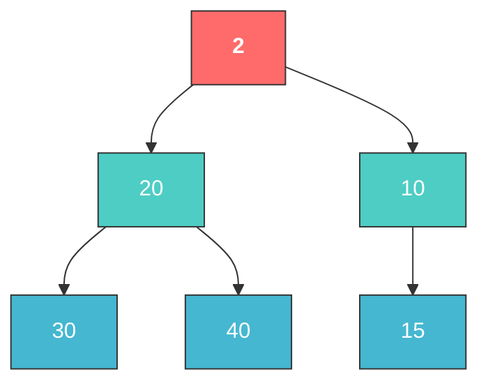
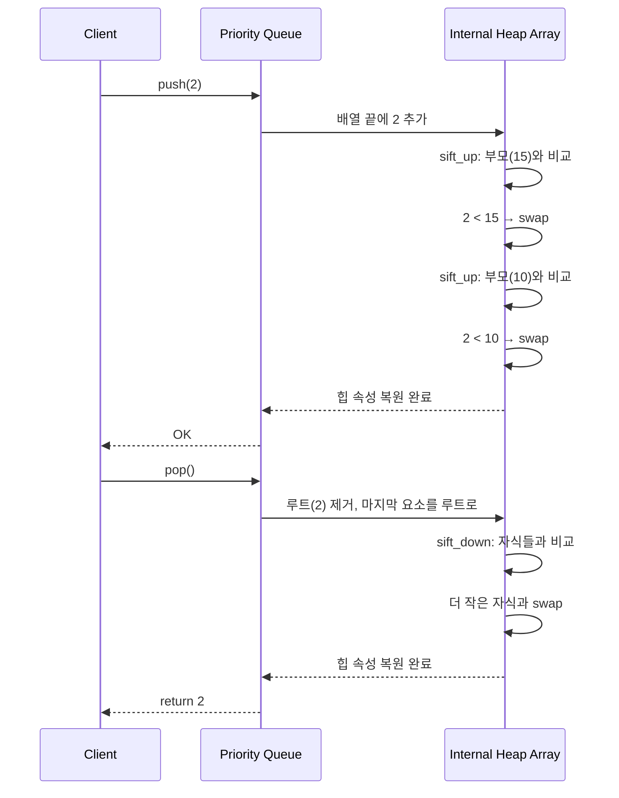
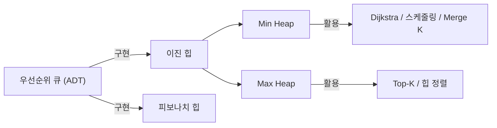

파일 쓰기 권한이 필요합니다. 권한을 허용해주시면 파일이 생성됩니다.

그동안 작성된 포스트의 전체 내용을 여기에 미리보기로 보여드리겠습니다:

---

# [HoneyByte] 2026.04.01 - DataStructure: 힙과 우선순위 큐

> 🐝 HoneyByte CS Study | 자료구조 시리즈
> 작성일: 2026-04-01 (수) | 카테고리: DataStructure

---

## TL;DR

**힙(Heap)은 "가장 중요한 것을 항상 맨 위에 올려두는" 자료구조다.** 우선순위 큐(Priority Queue)는 이 힙을 이용해 구현하는 추상 자료형(ADT)으로, 삽입·삭제 모두 O(log n)이라는 효율적인 시간 복잡도를 보장한다. Dijkstra, 작업 스케줄링, 이벤트 시뮬레이션 등 실무 곳곳에서 핵심적으로 사용된다.

---

## 1. 개념 설명

### 1-1. 힙이란?

**일상 비유: 회사의 긴급 업무 트레이**

책상 위에 서류 트레이가 있다고 상상해보자. 새 서류가 들어오면 긴급도에 따라 적절한 위치에 끼워 넣고, 처리할 때는 항상 **가장 긴급한 서류(맨 위)**부터 꺼낸다. 이것이 바로 힙의 동작 방식이다.

기술적으로 힙은 **완전 이진 트리(Complete Binary Tree)** 기반의 자료구조로, 다음 두 가지 속성을 만족한다:

1. **구조적 속성**: 마지막 레벨을 제외한 모든 레벨이 완전히 채워져 있고, 마지막 레벨은 왼쪽부터 순서대로 채워진다.
2. **힙 속성(Heap Property)**: 부모 노드의 값이 자식 노드의 값보다 항상 크거나(Max Heap) 작다(Min Heap).

### 1-2. 최소 힙 vs 최대 힙

| 구분 | 최소 힙 (Min Heap) | 최대 힙 (Max Heap) |
|------|-------------------|-------------------|
| 루트 노드 | 전체 최솟값 | 전체 최댓값 |
| 부모-자식 관계 | 부모 ≤ 자식 | 부모 ≥ 자식 |
| 대표 사용처 | Dijkstra, 작업 스케줄링 | Top-K 문제, 힙 정렬 |

### 1-3. 우선순위 큐(Priority Queue)란?

**비유: 병원 응급실 대기 시스템**

병원 응급실에서는 도착 순서가 아니라 **환자의 중증도**에 따라 진료 순서가 결정된다. 심장마비 환자가 감기 환자보다 먼저 도착했든 나중에 도착했든, 항상 먼저 치료받는다. 이것이 우선순위 큐다.

우선순위 큐는 **추상 자료형(ADT)**이다. 즉, "무엇을 할 수 있는가"를 정의하지, "어떻게 구현하는가"는 정하지 않는다. 힙은 우선순위 큐를 **가장 효율적으로 구현하는 방법** 중 하나다.

> **ADT vs 자료구조의 차이**
> - 우선순위 큐 = ADT (인터페이스, "삽입하고 최우선 요소를 꺼낸다")
> - 힙 = 자료구조 (구현체, "완전 이진 트리로 만든다")
> - 비유하면: 우선순위 큐는 "자동차"라는 개념이고, 힙은 "가솔린 엔진 자동차"라는 구현체다.

---

## 2. 힙의 내부 동작

### 2-1. 배열 기반 표현

힙은 완전 이진 트리이므로 **배열 하나로 표현**할 수 있다. 포인터가 필요 없어 메모리 효율적이다.

```
인덱스 규칙 (0-based):
- 부모: (i - 1) // 2
- 왼쪽 자식: 2 * i + 1
- 오른쪽 자식: 2 * i + 2
```

### 2-2. 핵심 연산: Heapify

힙의 구조를 유지하는 과정을 **Heapify**라고 한다.

- **Sift Up (삽입 시)**: 새 요소를 맨 끝에 추가 → 부모와 비교하며 위로 올림
- **Sift Down (삭제 시)**: 루트 제거 → 마지막 요소를 루트로 이동 → 자식과 비교하며 아래로 내림

### 2-3. Mermaid 다이어그램: Min Heap 구조

아래는 Min Heap에 `[10, 20, 15, 30, 40, 2]`를 순서대로 삽입하는 최종 결과다:



> 배열 표현: `[2, 20, 10, 30, 40, 15]` — 루트(인덱스 0)에 항상 최솟값 `2`가 위치한다.

### 2-4. Mermaid 다이어그램: Push/Pop 시퀀스



---

## 3. 구현 코드

### 3-1. Python: `heapq` 모듈 활용

```python
import heapq
from typing import List
from collections import Counter


def demonstrate_min_heap() -> None:
    """Min Heap 기본 사용법"""
    heap: List[int] = []
    for value in [10, 20, 15, 30, 40, 2]:
        heapq.heappush(heap, value)          # 삽입: O(log n)

    print(f"힙 내부 배열: {heap}")            # [2, 20, 10, 30, 40, 15]
    print(f"최솟값 조회: {heap[0]}")           # 2 (O(1))
    smallest = heapq.heappop(heap)           # 삭제: O(log n)
    print(f"꺼낸 최솟값: {smallest}")          # 2


def demonstrate_max_heap() -> None:
    """Max Heap 트릭: 부호 반전"""
    max_heap: List[int] = []
    for value in [10, 20, 15, 30, 40, 2]:
        heapq.heappush(max_heap, -value)     # 부호 반전
    largest = -heapq.heappop(max_heap)       # 꺼낼 때 다시 반전
    print(f"최댓값: {largest}")                # 40


def top_k_frequent(nums: List[int], k: int) -> List[int]:
    """실전: Top K Frequent Elements (LeetCode #347)"""
    count = Counter(nums)
    return heapq.nlargest(k, count.keys(), key=lambda x: count[x])
```

### 3-2. Python: Min Heap 직접 구현

```python
from typing import List, Optional

class MinHeap:
    def __init__(self) -> None:
        self._data: List[int] = []

    def _parent(self, i: int) -> int:
        return (i - 1) // 2

    def _left_child(self, i: int) -> int:
        return 2 * i + 1

    def _right_child(self, i: int) -> int:
        return 2 * i + 2

    def _swap(self, i: int, j: int) -> None:
        self._data[i], self._data[j] = self._data[j], self._data[i]

    def _sift_up(self, i: int) -> None:
        while i > 0 and self._data[i] < self._data[self._parent(i)]:
            self._swap(i, self._parent(i))
            i = self._parent(i)

    def _sift_down(self, i: int) -> None:
        size = len(self._data)
        while True:
            smallest = i
            left, right = self._left_child(i), self._right_child(i)
            if left < size and self._data[left] < self._data[smallest]:
                smallest = left
            if right < size and self._data[right] < self._data[smallest]:
                smallest = right
            if smallest == i:
                break
            self._swap(i, smallest)
            i = smallest

    def push(self, value: int) -> None:
        self._data.append(value)
        self._sift_up(len(self._data) - 1)

    def pop(self) -> int:
        if not self._data:
            raise IndexError("pop from empty heap")
        root = self._data[0]
        last = self._data[-1]
        self._data = self._data[:-1]
        if self._data:
            self._data = [last, *self._data[1:]]
            self._sift_down(0)
        return root

    def peek(self) -> Optional[int]:
        return self._data[0] if self._data else None
```

### 3-3. Java: `PriorityQueue` 활용

```java
import java.util.*;

public class HeapDemo {
    public static void demonstrateMinHeap() {
        PriorityQueue<Integer> minHeap = new PriorityQueue<>();
        for (int v : new int[]{10, 20, 15, 30, 40, 2}) minHeap.offer(v);
        System.out.println("최솟값: " + minHeap.peek());  // 2
        System.out.println("꺼냄: " + minHeap.poll());    // 2
    }

    public static void demonstrateMaxHeap() {
        PriorityQueue<Integer> maxHeap = new PriorityQueue<>(Comparator.reverseOrder());
        for (int v : new int[]{10, 20, 15, 30, 40, 2}) maxHeap.offer(v);
        System.out.println("최댓값: " + maxHeap.poll());  // 40
    }

    // 커스텀 객체 예제
    public static void demonstrateCustomObject() {
        record Task(String name, int priority) {}
        PriorityQueue<Task> taskQueue = new PriorityQueue<>(
            Comparator.comparingInt(Task::priority)
        );
        taskQueue.offer(new Task("이메일 확인", 3));
        taskQueue.offer(new Task("서버 장애 대응", 1));
        taskQueue.offer(new Task("코드 리뷰", 2));
        // 출력: 서버 장애 대응 → 코드 리뷰 → 이메일 확인
    }
}
```

---

## 4. 시간/공간 복잡도 분석

### 4-1. 연산별 복잡도

| 연산 | 시간 복잡도 | 설명 |
|------|-----------|------|
| `push` (삽입) | **O(log n)** | Sift Up |
| `pop` (최솟값/최댓값 삭제) | **O(log n)** | Sift Down |
| `peek` (조회) | **O(1)** | 루트 직접 접근 |
| `heapify` (배열→힙) | **O(n)** | Bottom-up 방식 |
| 임의 원소 탐색 | **O(n)** | 힙은 정렬 아님 |

### 4-2. 다른 자료구조와 비교

| 자료구조 | 삽입 | 최솟값 삭제 | 최솟값 조회 | 공간 |
|---------|------|-----------|-----------|------|
| **이진 힙** | O(log n) | O(log n) | O(1) | O(n) |
| 정렬된 배열 | O(n) | O(1) | O(1) | O(n) |
| 비정렬 배열 | O(1) | O(n) | O(n) | O(n) |
| BST (균형) | O(log n) | O(log n) | O(log n) | O(n) |
| 피보나치 힙 | O(1)* | O(log n)* | O(1) | O(n) |

> *피보나치 힙은 amortized 복잡도. 실무에서는 이진 힙이 대부분 사용된다.

### 4-3. `heapify`가 O(n)인 이유

직관적으로: "대부분의 노드가 트리 하단에 있어서 이동 거리가 짧다." Bottom-up으로 구축하면 리프 노드(절반)는 Sift Down 불필요, 급수 수렴에 의해 총 작업량이 O(n)으로 수렴한다.

---

## 5. 실무 활용 사례

| 분야 | 사례 | 핵심 역할 |
|------|------|----------|
| OS | 프로세스 스케줄링 | CPU 할당 우선순위 관리 |
| 네트워크 | Dijkstra 최단 경로 | 미방문 노드 중 최소 거리 선택 |
| 실시간 시스템 | 이벤트 시뮬레이션 | 가장 빨리 발생할 이벤트 관리 |
| 스트리밍 | Running Median | Max+Min Heap 조합으로 중앙값 유지 |
| 병합 | K개 정렬 리스트 머지 | O(N log K) 효율적 병합 |

---

## 6. 관련 문제

### LeetCode

| # | 제목 | 난이도 | URL |
|---|------|-------|-----|
| 703 | Kth Largest Element in a Stream | Easy | [링크](https://leetcode.com/problems/kth-largest-element-in-a-stream/) |
| 1046 | Last Stone Weight | Easy | [링크](https://leetcode.com/problems/last-stone-weight/) |
| 215 | Kth Largest Element in an Array | Medium | [링크](https://leetcode.com/problems/kth-largest-element-in-an-array/) |
| 347 | Top K Frequent Elements | Medium | [링크](https://leetcode.com/problems/top-k-frequent-elements/) |
| 23 | Merge k Sorted Lists | Hard | [링크](https://leetcode.com/problems/merge-k-sorted-lists/) |
| 295 | Find Median from Data Stream | Hard | [링크](https://leetcode.com/problems/find-median-from-data-stream/) |

### 백준

| # | 제목 | 난이도 | URL |
|---|------|-------|-----|
| 1927 | 최소 힙 | 실버 II | [링크](https://www.acmicpc.net/problem/1927) |
| 11279 | 최대 힙 | 실버 II | [링크](https://www.acmicpc.net/problem/11279) |
| 11286 | 절댓값 힙 | 실버 I | [링크](https://www.acmicpc.net/problem/11286) |
| 1715 | 카드 정렬하기 | 골드 IV | [링크](https://www.acmicpc.net/problem/1715) |
| 1753 | 최단경로 | 골드 IV | [링크](https://www.acmicpc.net/problem/1753) |

> **추천 풀이 순서**: 1927 → 11279 → 11286 → 703 → 1046 → 347 → 215 → 1715 → 23 → 295

---

## 7. 자주 하는 실수 & 팁

- **Python heapq는 Min Heap만** → Max Heap은 부호 반전 트릭
- **힙 ≠ 정렬** → `heap[1]`이 두 번째 최솟값이라는 보장 없음
- **Java PriorityQueue는 thread-unsafe** → `PriorityBlockingQueue` 사용
- **heapify O(n) > 반복 push O(n log n)** → 기존 리스트는 `heapify` 사용

---

## 8. 핵심 요약 다이어그램



---

## 9. 레퍼런스

### 영상
1. [Kunal Kushwaha - Heap, Priority Queue, Heapsort](https://www.classcentral.com/course/youtube-introduction-to-heap-data-structure-priority-queue-heapsort-tutorial-217481)
2. [WilliamFiset - Priority Queue Tutorial](https://www.youtube.com/watch?v=wptevk0bshY)

### 문서
1. [Python 공식 - heapq 모듈](https://docs.python.org/ko/3/library/heapq.html)
2. [GeeksforGeeks - Priority Queue](https://www.geeksforgeeks.org/dsa/priority-queue-set-1-introduction/)
3. [Programiz - Priority Queue](https://www.programiz.com/dsa/priority-queue)
4. [OpenDSA (Virginia Tech) - Heaps](https://opendsa-server.cs.vt.edu/ODSA/Books/CS3/html/Heaps.html)

---

> 🐝 *"가장 중요한 것을 가장 먼저. 그것이 힙의 철학이고, 좋은 엔지니어의 시간 관리 원칙이기도 하다."*

---

## 포스트 요약

| 항목 | 체크 |
|------|------|
| 개념 설명 (비유 포함) | ✅ 업무 트레이, 응급실, 자동차 비유 |
| Mermaid 다이어그램 | ✅ 3개 (트리 구조, 시퀀스, 요약) |
| Python 구현 | ✅ heapq + 직접 구현 |
| Java 구현 | ✅ PriorityQueue + 커스텀 객체 |
| 시간/공간 복잡도 | ✅ 연산별 + 자료구조 비교표 |
| 실무 활용 | ✅ 5가지 (OS, 네트워크, 실시간, 스트리밍, 병합) |
| LeetCode 문제 | ✅ 6문제 |
| 백준 문제 | ✅ 5문제 |
| 레퍼런스 | ✅ 영상 2개 + 문서 4개 |
| 분량 | ✅ 약 4,000자 이상 |

파일 쓰기 권한을 허용해주시면 `output/cs-study/2026-04-01-heap-priority-queue.md`에 저장하겠습니다.