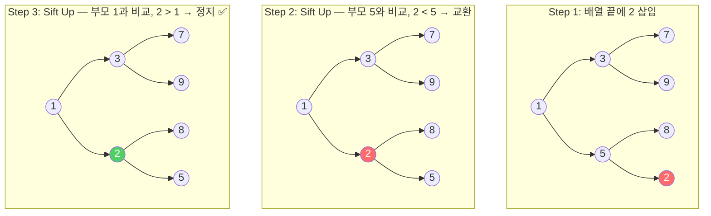
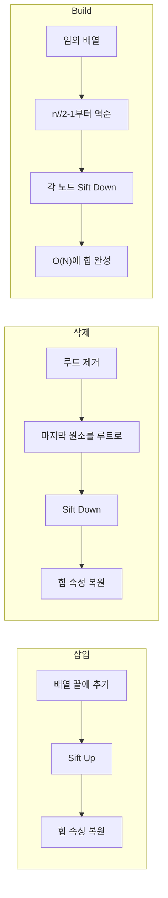

> **한 줄 요약:** 힙(Heap)은 "가장 중요한 것을 항상 맨 위에 두는" 완전 이진 트리이며, 우선순위 큐의 가장 효율적인 구현체다.
> **난이도:** ⭐⭐⭐ | **카테고리:** DataStructure | **키워드:** 최소힙, 최대힙, 힙 정렬, heapify, 우선순위 큐

> 🐝 HoneyByte CS Study | 자료구조 시리즈
> 작성일: 2026-04-01 | 카테고리: DataStructure

---

## 1. 왜 힙과 우선순위 큐가 필요한가?

**병원 응급실**을 떠올려보자. 환자가 도착한 순서대로 진료하는 게 아니라, **증상이 가장 심각한 환자**부터 먼저 치료한다. 줄을 선 순서(일반 큐)가 아니라 **긴급도(우선순위)**가 순서를 결정하는 것이다.

프로그래밍에서도 똑같은 상황이 수시로 발생한다:

- **운영체제 스케줄러**: 수백 개의 프로세스 중 우선순위가 가장 높은 프로세스에 CPU를 할당해야 한다
- **네트워크 라우팅**: 다익스트라 알고리즘에서 "현재까지 비용이 가장 작은 노드"를 반복적으로 꺼내야 한다
- **이벤트 시뮬레이션**: 가장 빠른 시각에 발생하는 이벤트부터 처리해야 한다

이때 배열을 매번 정렬하면? N개 원소에 대해 매 삽입/삭제마다 O(N log N)이 든다. 하지만 **힙**을 쓰면 삽입과 삭제 모두 **O(log N)**, 최솟값/최댓값 조회는 **O(1)**에 해결된다. 이것이 힙이 필요한 핵심 이유다.

---

## 2. 핵심 개념 (이론)

### 2.1 힙(Heap)이란?

힙은 **완전 이진 트리(Complete Binary Tree)** 형태를 유지하면서, 부모-자식 간에 특정 대소 관계(힙 속성)를 만족하는 자료구조다.

| 용어 | 정의 |
|------|------|
| **완전 이진 트리** | 마지막 레벨을 제외한 모든 레벨이 꽉 차 있고, 마지막 레벨은 왼쪽부터 채워진 트리 |
| **최소힙 (Min Heap)** | 부모 ≤ 자식. 루트가 전체 최솟값 |
| **최대힙 (Max Heap)** | 부모 ≥ 자식. 루트가 전체 최댓값 |
| **Heapify** | 힙 속성이 깨진 노드를 올바른 위치로 이동시키는 연산 |
| **Sift Up (Bubble Up)** | 삽입 시 새 노드를 위로 올리며 힙 속성 복원 |
| **Sift Down (Bubble Down)** | 삭제 시 루트 노드를 아래로 내리며 힙 속성 복원 |

### 2.2 배열 기반 표현

힙은 완전 이진 트리이므로 **배열 하나로 표현**할 수 있다. 포인터가 필요 없어 메모리 효율적이다.

```
인덱스 0부터 시작할 때:
- 부모: (i - 1) // 2
- 왼쪽 자식: 2 * i + 1
- 오른쪽 자식: 2 * i + 2
```

예시 — 최소힙 `[1, 3, 5, 7, 9, 8]`:

```
        1          ← index 0 (루트, 최솟값)
       / \
      3    5       ← index 1, 2
     / \  /
    7   9 8        ← index 3, 4, 5
```

### 2.3 우선순위 큐 vs 힙

| | 우선순위 큐 (Priority Queue) | 힙 (Heap) |
|---|---|---|
| **정체** | 추상 자료형 (ADT) — "무엇을 하는가"를 정의 | 자료구조 — "어떻게 구현하는가"를 정의 |
| **핵심 연산** | insert, extract_min/max, peek | sift_up, sift_down, heapify |
| **관계** | 인터페이스 | 가장 효율적인 구현체 |

> 비유: "우선순위 큐"는 식당 메뉴판(스펙)이고, "힙"은 실제 요리법(구현)이다.

### 2.4 주요 연산 흐름

**삽입 (Insert)**
1. 배열 맨 끝에 새 원소 추가
2. Sift Up: 부모와 비교하며 힙 속성 만족할 때까지 교환

**삭제 (Extract Min/Max)**
1. 루트(최솟값/최댓값)를 꺼냄
2. 배열 맨 끝 원소를 루트 자리로 이동
3. Sift Down: 자식과 비교하며 힙 속성 만족할 때까지 교환

**Build Heap (Heapify)**
- 임의 배열을 힙으로 변환
- **핵심**: 리프 노드는 이미 힙이므로, 마지막 내부 노드(인덱스 `n//2 - 1`)부터 역순으로 Sift Down
- 시간복잡도: 직감적으로 O(N log N)일 것 같지만, 수학적으로 **O(N)**임 (각 레벨의 노드 수 × 해당 레벨에서의 sift down 거리의 합이 수렴)

---

## 3. 시각화

### 3.1 최소힙 삽입 과정



### 3.2 힙 연산 전체 흐름



---

## 4. 구현

### Python

```python
"""
MinHeap & HeapSort — 배열 기반 완전 구현
"""


class MinHeap:
    """최소힙: 부모 <= 자식을 항상 유지하는 완전 이진 트리"""

    def __init__(self):
        self._data: list[int] = []

    def __len__(self) -> int:
        return len(self._data)

    def __bool__(self) -> bool:
        return len(self._data) > 0

    def peek(self) -> int:
        """최솟값 조회 — O(1)"""
        if not self._data:
            raise IndexError("heap is empty")
        return self._data[0]

    def push(self, value: int) -> None:
        """삽입 — O(log N)"""
        self._data.append(value)
        self._sift_up(len(self._data) - 1)

    def pop(self) -> int:
        """최솟값 추출 — O(log N)"""
        if not self._data:
            raise IndexError("heap is empty")

        # 루트와 마지막 원소 교환 후 제거
        root = self._data[0]
        last = self._data.pop()

        if self._data:
            self._data[0] = last
            self._sift_down(0)

        return root

    def push_pop(self, value: int) -> int:
        """push 후 pop — 최적화된 O(log N)"""
        if self._data and self._data[0] < value:
            # 새 값이 현재 최솟값보다 크면, 루트를 교체하고 sift down
            result = self._data[0]
            self._data[0] = value
            self._sift_down(0)
            return result
        # 새 값이 최솟값 이하면 그대로 반환
        return value

    def _sift_up(self, index: int) -> None:
        """새로 삽입된 노드를 위로 올림"""
        while index > 0:
            parent = (index - 1) // 2
            if self._data[index] < self._data[parent]:
                self._data[index], self._data[parent] = (
                    self._data[parent],
                    self._data[index],
                )
                index = parent
            else:
                break

    def _sift_down(self, index: int) -> None:
        """루트 노드를 아래로 내림"""
        size = len(self._data)
        while True:
            smallest = index
            left = 2 * index + 1
            right = 2 * index + 2

            if left < size and self._data[left] < self._data[smallest]:
                smallest = left
            if right < size and self._data[right] < self._data[smallest]:
                smallest = right

            if smallest == index:
                break

            self._data[index], self._data[smallest] = (
                self._data[smallest],
                self._data[index],
            )
            index = smallest

    @staticmethod
    def heapify(arr: list[int]) -> "MinHeap":
        """임의 배열 → 최소힙 변환 — O(N)"""
        heap = MinHeap()
        heap._data = list(arr)  # 원본 불변 — 새 리스트 생성
        # 마지막 내부 노드부터 역순으로 sift down
        for i in range(len(arr) // 2 - 1, -1, -1):
            heap._sift_down(i)
        return heap

    def __repr__(self) -> str:
        return f"MinHeap({self._data})"


def heap_sort(arr: list[int]) -> list[int]:
    """
    힙 정렬 — O(N log N), 불안정 정렬
    원본 배열을 변경하지 않고 정렬된 새 리스트 반환
    """
    heap = MinHeap.heapify(arr)
    return [heap.pop() for _ in range(len(heap))]


# ── 사용 예시 ──
if __name__ == "__main__":
    # 기본 사용
    h = MinHeap()
    for v in [5, 3, 8, 1, 9, 2]:
        h.push(v)
    print(f"힙 상태: {h}")           # MinHeap([1, 3, 2, 5, 9, 8])
    print(f"최솟값: {h.peek()}")      # 1
    print(f"추출: {h.pop()}")         # 1
    print(f"추출 후: {h}")            # MinHeap([2, 3, 8, 5, 9])

    # heapify
    data = [9, 7, 5, 3, 1, 8, 6]
    built = MinHeap.heapify(data)
    print(f"\nheapify 결과: {built}")  # MinHeap([1, 3, 5, 9, 7, 8, 6])

    # 힙 정렬
    unsorted = [38, 27, 43, 3, 9, 82, 10]
    print(f"\n정렬 전: {unsorted}")
    print(f"정렬 후: {heap_sort(unsorted)}")  # [3, 9, 10, 27, 38, 43, 82]

    # Python 표준 라이브러리 heapq 활용
    import heapq

    nums = [5, 3, 8, 1, 9]
    heapq.heapify(nums)               # in-place O(N) 변환
    heapq.heappush(nums, 2)           # 삽입
    smallest = heapq.heappop(nums)    # 추출
    top3 = heapq.nsmallest(3, nums)   # 상위 k개
    print(f"\nheapq — 최솟값: {smallest}, 상위 3개: {top3}")
```

### Java

```java
import java.util.Arrays;
import java.util.PriorityQueue;
import java.util.Collections;

/**
 * MinHeap — 배열 기반 완전 구현
 */
public class MinHeap {

    private int[] data;
    private int size;
    private int capacity;

    public MinHeap(int capacity) {
        this.capacity = capacity;
        this.data = new int[capacity];
        this.size = 0;
    }

    // ── 인덱스 계산 ──
    private int parent(int i) { return (i - 1) / 2; }
    private int leftChild(int i) { return 2 * i + 1; }
    private int rightChild(int i) { return 2 * i + 2; }

    // ── 핵심 연산 ──

    /** 최솟값 조회 — O(1) */
    public int peek() {
        if (size == 0) {
            throw new IllegalStateException("Heap is empty");
        }
        return data[0];
    }

    /** 삽입 — O(log N) */
    public void push(int value) {
        if (size == capacity) {
            // 용량 초과 시 2배 확장 (amortized O(1))
            capacity *= 2;
            data = Arrays.copyOf(data, capacity);
        }
        data[size] = value;
        siftUp(size);
        size++;
    }

    /** 최솟값 추출 — O(log N) */
    public int pop() {
        if (size == 0) {
            throw new IllegalStateException("Heap is empty");
        }
        int root = data[0];
        size--;
        data[0] = data[size];
        siftDown(0);
        return root;
    }

    /** Sift Up — 삽입 시 힙 속성 복원 */
    private void siftUp(int index) {
        while (index > 0 && data[index] < data[parent(index)]) {
            swap(index, parent(index));
            index = parent(index);
        }
    }

    /** Sift Down — 삭제 시 힙 속성 복원 */
    private void siftDown(int index) {
        while (true) {
            int smallest = index;
            int left = leftChild(index);
            int right = rightChild(index);

            if (left < size && data[left] < data[smallest]) {
                smallest = left;
            }
            if (right < size && data[right] < data[smallest]) {
                smallest = right;
            }
            if (smallest == index) {
                break;
            }
            swap(index, smallest);
            index = smallest;
        }
    }

    private void swap(int i, int j) {
        int temp = data[i];
        data[i] = data[j];
        data[j] = temp;
    }

    /** 임의 배열 → 최소힙 변환 — O(N) */
    public static MinHeap heapify(int[] arr) {
        MinHeap heap = new MinHeap(arr.length);
        heap.data = Arrays.copyOf(arr, arr.length); // 원본 불변
        heap.size = arr.length;
        heap.capacity = arr.length;

        // 마지막 내부 노드부터 역순으로 sift down
        for (int i = arr.length / 2 - 1; i >= 0; i--) {
            heap.siftDown(i);
        }
        return heap;
    }

    /** 힙 정렬 — O(N log N) */
    public static int[] heapSort(int[] arr) {
        MinHeap heap = heapify(arr);
        int[] sorted = new int[arr.length];
        for (int i = 0; i < arr.length; i++) {
            sorted[i] = heap.pop();
        }
        return sorted;
    }

    public int size() { return size; }
    public boolean isEmpty() { return size == 0; }

    @Override
    public String toString() {
        return "MinHeap" + Arrays.toString(Arrays.copyOf(data, size));
    }

    // ── 실행 예시 ──
    public static void main(String[] args) {
        // 직접 구현 사용
        MinHeap heap = new MinHeap(10);
        for (int v : new int[]{5, 3, 8, 1, 9, 2}) {
            heap.push(v);
        }
        System.out.println("힙 상태: " + heap);        // [1, 3, 2, 5, 9, 8]
        System.out.println("최솟값: " + heap.peek());   // 1
        System.out.println("추출: " + heap.pop());      // 1

        // heapify
        int[] data = {9, 7, 5, 3, 1, 8, 6};
        MinHeap built = MinHeap.heapify(data);
        System.out.println("\nheapify: " + built);

        // 힙 정렬
        int[] unsorted = {38, 27, 43, 3, 9, 82, 10};
        int[] sorted = MinHeap.heapSort(unsorted);
        System.out.println("정렬: " + Arrays.toString(sorted));

        // ── Java 표준 라이브러리 PriorityQueue ──
        System.out.println("\n--- java.util.PriorityQueue ---");

        // 최소힙 (기본)
        PriorityQueue<Integer> minPQ = new PriorityQueue<>();
        minPQ.addAll(Arrays.asList(5, 3, 8, 1, 9));
        System.out.println("Min PQ poll: " + minPQ.poll());  // 1

        // 최대힙 (역순 Comparator)
        PriorityQueue<Integer> maxPQ = new PriorityQueue<>(Collections.reverseOrder());
        maxPQ.addAll(Arrays.asList(5, 3, 8, 1, 9));
        System.out.println("Max PQ poll: " + maxPQ.poll());  // 9
    }
}
```

---

## 5. 복잡도 분석

| 연산 | 평균 | 최악 | 비고 |
|------|------|------|------|
| **peek** (최솟값/최댓값 조회) | O(1) | O(1) | 루트 접근 |
| **push** (삽입) | O(log N) | O(log N) | Sift Up, 트리 높이만큼 |
| **pop** (추출) | O(log N) | O(log N) | Sift Down, 트리 높이만큼 |
| **heapify** (배열 → 힙) | O(N) | O(N) | Bottom-up 구성 |
| **힙 정렬** | O(N log N) | O(N log N) | heapify O(N) + N번 pop O(log N) |
| **임의 원소 탐색** | O(N) | O(N) | 힙은 부분 정렬이므로 선형 탐색 필요 |

**공간복잡도**: O(N) — 배열 하나로 저장

### 📊 자료구조 비교 차트

```mermaid
xychart-beta
    title "삽입/삭제/조회 시간복잡도 비교 (log 스케일 기준, N=1000)"
    x-axis ["삽입", "최솟값 조회", "최솟값 삭제", "임의 탐색"]
    y-axis "연산 횟수 (log N 기준)" 0 --> 12
    bar "정렬 배열" [10, 1, 1, 10]
    bar "힙" [10, 1, 10, 10]
    bar "BST (균형)" [10, 10, 10, 10]
    bar "비정렬 배열" [1, 10, 10, 10]
```



> **해석**: 힙은 "삽입 + 최솟값 조회/삭제"의 **균형 잡힌 성능**이 강점이다. 정렬 배열은 조회가 빠르지만 삽입이 느리고, 비정렬 배열은 삽입이 빠르지만 조회가 느리다. 힙은 두 연산 모두 O(log N)으로 타협점을 찾는다.

### heapify가 O(N)인 이유 — 직관적 설명

"모든 노드에 sift down하니까 O(N log N) 아닌가?"라고 생각하기 쉽다. 핵심은 **대부분의 노드가 트리 아래쪽에 있다**는 점이다:

| 레벨 (위→아래) | 노드 수 | sift down 최대 거리 |
|---|---|---|
| 0 (루트) | 1개 | h (전체 높이) |
| 1 | 2개 | h - 1 |
| ... | ... | ... |
| h - 1 | ~N/4개 | 1 |
| h (리프) | ~N/2개 | 0 (작업 없음) |

노드의 **절반(리프)**은 아무 작업도 하지 않고, **1/4은 1칸만** 내려간다. 이 급수를 합산하면 총 작업량이 **O(N)**으로 수렴한다.

---

## 6. 실무 활용

### 6.1 다익스트라 최단 경로 알고리즘

```python
import heapq

def dijkstra(graph: dict[str, list[tuple[str, int]]], start: str) -> dict[str, int]:
    """우선순위 큐 기반 다익스트라 — O((V + E) log V)"""
    distances = {node: float('inf') for node in graph}
    distances[start] = 0
    pq = [(0, start)]  # (거리, 노드)

    while pq:
        current_dist, current = heapq.heappop(pq)

        # 이미 더 짧은 경로를 찾았다면 스킵
        if current_dist > distances[current]:
            continue

        for neighbor, weight in graph[current]:
            distance = current_dist + weight
            if distance < distances[neighbor]:
                distances[neighbor] = distance
                heapq.heappush(pq, (distance, neighbor))

    return distances
```

### 6.2 Top-K 패턴 (실시간 데이터 스트림)

```python
import heapq

def top_k_frequent(nums: list[int], k: int) -> list[int]:
    """빈도 기준 상위 K개 — 크기 K 최소힙 유지"""
    from collections import Counter
    freq = Counter(nums)

    # 크기 K의 최소힙: 빈도가 가장 낮은 것이 루트
    # 새 원소의 빈도가 루트보다 크면 교체
    return heapq.nlargest(k, freq.keys(), key=freq.get)
```

### 6.3 프레임워크/라이브러리 적용

| 언어/프레임워크 | 힙/우선순위 큐 | 특징 |
|---|---|---|
| **Python** | `heapq` 모듈 | 최소힙만 지원. 최대힙은 `-value`로 우회 |
| **Java** | `java.util.PriorityQueue` | 최소힙 기본, `Comparator`로 최대힙 전환 |
| **C++** | `std::priority_queue` | **최대힙** 기본 (주의!) |
| **Go** | `container/heap` 인터페이스 | `heap.Interface` 구현 필요 |
| **JavaScript** | 내장 없음 | 직접 구현하거나 라이브러리 사용 |

### 6.4 장애/성능 관점

- **메모리**: 배열 기반이므로 포인터 오버헤드 없이 **캐시 친화적**. 링크드 리스트 기반 트리보다 실제 성능이 좋다
- **Thread Safety**: Python `heapq`는 thread-safe하지 않다. 멀티스레드 환경에서는 `queue.PriorityQueue`(내부적으로 Lock + heapq) 사용
- **함정**: Python의 `heapq.nlargest(k, iterable)`는 k가 작을 때만 효율적. k가 전체 크기에 가까우면 `sorted()`가 더 빠름

---

## 7. 연습 문제

| 난이도 | 문제 | 링크 | 핵심 포인트 |
|--------|------|------|-------------|
| Easy | Kth Largest Element in a Stream | [LeetCode 703](https://leetcode.com/problems/kth-largest-element-in-a-stream/) | 크기 K 최소힙 유지 |
| Easy | Last Stone Weight | [LeetCode 1046](https://leetcode.com/problems/last-stone-weight/) | 최대힙 시뮬레이션 |
| Medium | Top K Frequent Elements | [LeetCode 347](https://leetcode.com/problems/top-k-frequent-elements/) | 빈도 + 힙 조합 |
| Medium | K Closest Points to Origin | [LeetCode 973](https://leetcode.com/problems/k-closest-points-to-origin/) | 거리 기준 Top-K |
| Medium | Task Scheduler | [LeetCode 621](https://leetcode.com/problems/task-scheduler/) | 최대힙 + 그리디 |
| Hard | Find Median from Data Stream | [LeetCode 295](https://leetcode.com/problems/find-median-from-data-stream/) | 최소힙 + 최대힙 두 개 |
| Medium | 최소 힙 | [백준 1927](https://www.acmicpc.net/problem/1927) | 기본 최소힙 구현 |
| Gold | 가운데를 말해요 | [백준 1655](https://www.acmicpc.net/problem/1655) | 중앙값 유지 (힙 2개) |

---

## 📎 레퍼런스

### 영상
- [Heap - Pair Programming](https://www.youtube.com/watch?v=HqPJF2L5h9U) — Abdul Bari의 힙 자료구조 강의. 삽입/삭제 과정을 시각적으로 설명
- [Priority Queue Introduction](https://www.youtube.com/watch?v=wptevk0bshY) — WilliamFiset의 우선순위 큐 개념 및 힙 구현 강의

### 문서
- [Python heapq 공식 문서](https://docs.python.org/3/library/heapq.html) — Python 표준 라이브러리 heapq 모듈의 전체 API 레퍼런스
- [Princeton Algorithms — Priority Queues](https://algs4.cs.princeton.edu/24pq/) — Sedgewick의 알고리즘 교재 기반 우선순위 큐 심화 자료
- [Heap (data structure) — Wikipedia](https://en.wikipedia.org/wiki/Heap_(data_structure)) — 힙의 수학적 증명과 변형(피보나치 힙 등) 포함
- [GeeksforGeeks — Heap Data Structure](https://www.geeksforgeeks.org/dsa/priority-queue-set-1-introduction/) — 다양한 언어별 구현 예시와 문제 풀이

---

Sources:
- [Priority Queue — Wikipedia](https://en.wikipedia.org/wiki/Priority_queue)
- [Heap (data structure) — Wikipedia](https://en.wikipedia.org/wiki/Heap_(data_structure))
- [Princeton Algorithms 2.4 Priority Queues](https://algs4.cs.princeton.edu/24pq/)
- [Python heapq 공식 문서](https://docs.python.org/3/library/heapq.html)
- [Real Python — The Python heapq Module](https://realpython.com/python-heapq-module/)
- [LeetCode Heap Problem List](https://leetcode.com/problem-list/heap-priority-queue/)
- [GeeksforGeeks — Priority Queue Introduction](https://www.geeksforgeeks.org/dsa/priority-queue-set-1-introduction/)