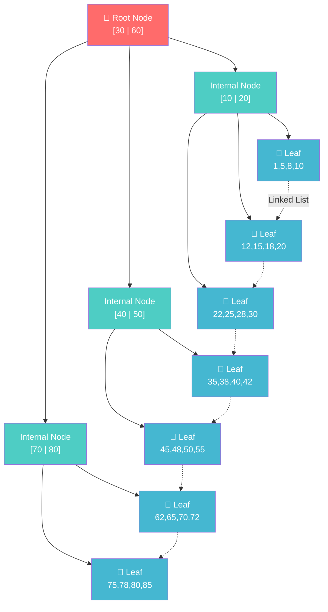
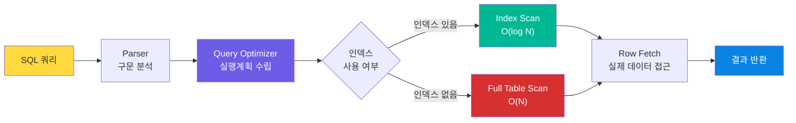

도서관에서 "운영체제" 관련 책을 찾는다고 하자. 선반 만 개를 하나씩 훑으면 하루가 걸린다. 하지만 분류 카드(색인)를 쓰면? "컴퓨터과학 → 운영체제" 항목을 펼쳐 서가 번호를 확인하고 곧장 이동한다. 30초면 충분하다.

데이터베이스도 마찬가지다. 100만 행짜리 `orders` 테이블에서 `SELECT * FROM orders WHERE customer_id = 42`를 실행하면, 인덱스 없이는 **Full Table Scan** — 디스크에서 100만 행을 전부 읽는다. `customer_id`에 B-Tree 인덱스를 걸면? 트리를 3~4 단계만 타고 내려가 해당 행의 물리 주소를 즉시 얻는다. I/O가 100만 → 4로 줄어드는 셈이다.

인덱스가 없으면 데이터가 늘어날 때마다 응답 시간이 **선형으로** 증가한다. 서비스 초기에는 티가 안 나지만, 사용자가 늘어 데이터가 수백만 건을 넘기는 순간 슬로우 쿼리가 터지고 장애로 이어진다. 현업에서 DB 성능 문제의 80% 이상은 **인덱스 미설정 또는 잘못된 인덱스 설계**에서 비롯된다.

---

## 2. 핵심 개념 (이론)

### 2.1 인덱스란?

인덱스는 테이블의 특정 컬럼 값을 **정렬된 별도 자료구조**에 저장하고, 각 값에 해당하는 행의 **물리적 위치(Row Pointer)**를 매핑한 것이다.

| 용어 | 설명 |
|------|------|
| **인덱스 키(Key)** | 인덱스를 구성하는 컬럼 값 |
| **Row Pointer** | 실제 데이터 행의 물리 주소 (Heap 또는 Clustered 위치) |
| **Clustered Index** | 테이블 데이터 자체가 인덱스 순서로 물리 정렬. 테이블당 1개만 존재 |
| **Non-Clustered (Secondary) Index** | 별도 공간에 키+포인터를 저장. 테이블당 여러 개 가능 |
| **Composite Index** | 2개 이상 컬럼을 묶어 만든 복합 인덱스 |
| **Covering Index** | 쿼리에 필요한 모든 컬럼이 인덱스 안에 있어, 테이블 접근 없이 인덱스만으로 응답 |
| **Cardinality** | 컬럼 값의 고유 개수. 높을수록 인덱스 효율이 좋다 |

### 2.2 인덱스 자료구조

#### B-Tree (B+Tree)

관계형 데이터베이스가 기본으로 채택하는 인덱스 구조다. 여기서 B는 Binary가 아니라 **Balanced**를 의미한다.

**B+Tree의 특징:**
- **리프 노드에만 데이터(Row Pointer)** 가 저장된다. 내부 노드는 탐색용 키만 보관.
- **리프 노드끼리 Linked List**로 연결되어 범위 검색(`BETWEEN`, `>`, `<`)에 유리하다.
- 루트에서 어떤 리프까지든 깊이가 동일(**Balanced**) → 탐색이 항상 O(log N).
- 하나의 노드가 디스크 페이지(보통 8~16 KB)에 대응하도록 **팬아웃(Fan-out)**이 크다. 100만 행 테이블도 깊이 3~4로 충분하다.

**왜 B-Tree인가? (이진 탐색 트리 대비)**

| 비교 항목 | 이진 탐색 트리(BST) | B-Tree (B+Tree) |
|-----------|---------------------|-----------------|
| 노드당 키 수 | 1개 | 수십~수백 개 |
| 트리 깊이 (100만 행) | ~20 | 3~4 |
| 디스크 I/O | 노드마다 1회 → 20회 | 노드마다 1회 → 3~4회 |
| 범위 검색 | 중위 순회 필요 | 리프 Linked List 순차 스캔 |
| 캐시 효율 | 낮음 (노드 분산) | 높음 (페이지 단위 적재) |

BST의 노드 하나는 키 1개만 담는다. 디스크에서 4KB 페이지를 읽어도 키 1개만 쓰고 나머지 공간은 낭비다. B-Tree는 한 페이지에 수백 개 키를 채우니 **디스크 I/O 1회당 얻는 정보량이 압도적으로 많다.**

#### 해시 인덱스

해시 함수로 키를 버킷에 매핑한다. **등호 검색(`=`)**에 O(1)로 가장 빠르지만, 범위 검색·정렬·부분 매칭은 불가능하다.

| 항목 | B-Tree | Hash Index |
|------|--------|------------|
| 등호(`=`) | O(log N) | **O(1)** |
| 범위(`>`, `<`, `BETWEEN`) | **지원** | ❌ 불가 |
| ORDER BY 활용 | **가능** | ❌ 불가 |
| LIKE 'abc%' | **가능** | ❌ 불가 |
| 지원 엔진 | InnoDB, PostgreSQL 등 대부분 | Memory 엔진, PostgreSQL (제한적) |

MySQL InnoDB는 해시 인덱스를 직접 생성할 수 없다. 대신 **Adaptive Hash Index**라는 내부 최적화 메커니즘이 자주 접근하는 페이지를 자동으로 해시 캐싱한다.

---

## 3. 시각화

### 3.1 B+Tree 인덱스 구조



**탐색 과정 (WHERE id = 48):**
1. 루트 [30|60] → 48은 30~60 사이 → 중간 자식으로
2. Internal [40|50] → 48은 40~50 사이 → 두 번째 자식으로
3. Leaf [45,48,50,55] → 48 발견! → Row Pointer로 실제 행 접근

디스크 I/O: **단 3회**

### 3.2 쿼리 실행 흐름



---

## 4. 구현

### 4.1 SQL: 인덱스 생성과 실행계획 분석

#### MySQL

```sql
-- ========================================
-- 테이블 생성
-- ========================================
CREATE TABLE orders (
    id          BIGINT AUTO_INCREMENT PRIMARY KEY,  -- Clustered Index (자동)
    customer_id BIGINT NOT NULL,
    product_id  INT NOT NULL,
    status      VARCHAR(20) NOT NULL DEFAULT 'pending',
    total_price DECIMAL(10, 2) NOT NULL,
    order_date  DATE NOT NULL,
    created_at  TIMESTAMP DEFAULT CURRENT_TIMESTAMP
) ENGINE=InnoDB;

-- ========================================
-- 단일 컬럼 인덱스
-- ========================================
CREATE INDEX idx_orders_customer ON orders (customer_id);

-- ========================================
-- 복합 인덱스 (Composite Index)
-- 좌측 접두사 규칙(Leftmost Prefix Rule):
-- (customer_id), (customer_id, status), (customer_id, status, order_date) 모두 활용 가능
-- 하지만 (status)만 단독으로는 이 인덱스를 타지 못한다
-- ========================================
CREATE INDEX idx_orders_cust_status_date 
    ON orders (customer_id, status, order_date);

-- ========================================
-- 커버링 인덱스 (Covering Index)
-- SELECT에 필요한 컬럼까지 인덱스에 포함 → 테이블 접근 자체를 제거
-- ========================================
CREATE INDEX idx_orders_covering
    ON orders (customer_id, status, order_date, total_price);

-- ========================================
-- EXPLAIN으로 실행계획 확인
-- ========================================

-- 1) 인덱스 없는 쿼리 → type: ALL (Full Table Scan)
EXPLAIN SELECT * FROM orders WHERE status = 'shipped';

-- 2) 인덱스 활용 쿼리 → type: ref 
EXPLAIN SELECT * FROM orders WHERE customer_id = 42;

-- 3) 커버링 인덱스 → Extra: Using index (테이블 접근 없음!)
EXPLAIN SELECT customer_id, status, order_date, total_price
FROM orders
WHERE customer_id = 42 AND status = 'completed';

-- 4) 범위 검색 → type: range
EXPLAIN SELECT * FROM orders
WHERE customer_id = 42
  AND order_date BETWEEN '2026-01-01' AND '2026-03-31';
```

**EXPLAIN 출력의 핵심 컬럼:**

| 컬럼 | 의미 | 좋은 값 | 나쁜 값 |
|------|------|---------|---------|
| `type` | 접근 방식 | `const`, `eq_ref`, `ref`, `range` | `ALL` (Full Scan) |
| `key` | 실제 사용된 인덱스 | 인덱스 이름 | `NULL` |
| `rows` | 예상 탐색 행 수 | 작을수록 좋음 | 전체 행 수에 가까우면 위험 |
| `Extra` | 추가 정보 | `Using index` (커버링) | `Using filesort`, `Using temporary` |

#### PostgreSQL

```sql
-- ========================================
-- EXPLAIN ANALYZE — 실제 실행 후 측정값 포함
-- ========================================
EXPLAIN (ANALYZE, BUFFERS, FORMAT TEXT)
SELECT customer_id, status, order_date, total_price
FROM orders
WHERE customer_id = 42 AND status = 'completed';

-- 출력 예시:
-- Index Only Scan using idx_orders_covering on orders
--   Index Cond: ((customer_id = 42) AND (status = 'completed'))
--   Heap Fetches: 0            ← 테이블 접근 0 = 완벽한 커버링
--   Buffers: shared hit=3      ← 캐시에서 3개 페이지 읽음
--   Planning Time: 0.15 ms
--   Execution Time: 0.08 ms

-- ========================================
-- Partial Index (PostgreSQL 전용) — 조건부 인덱스
-- 전체 행 중 일부만 인덱싱하여 인덱스 크기와 갱신 비용을 줄인다
-- ========================================
CREATE INDEX idx_orders_active
    ON orders (customer_id, order_date)
    WHERE status = 'pending';

-- 'pending' 상태인 주문만 인덱싱 — 전체의 5%만 인덱스에 포함
-- 인덱스 크기가 1/20로 줄어든다
```

### 4.2 Python — B-Tree 시뮬레이션 구현

```python
"""
B-Tree 인덱스 동작 원리를 이해하기 위한 간소화된 구현.
실제 DB 인덱스의 핵심 연산(검색, 삽입, 범위 탐색)을 체험한다.
"""
from __future__ import annotations
from typing import Optional


class BTreeNode:
    """B-Tree의 개별 노드. 최대 (2 * degree - 1)개의 키를 보관한다."""

    def __init__(self, degree: int, is_leaf: bool = True) -> None:
        self.degree = degree          # 최소 차수 (t)
        self.keys: list[int] = []     # 정렬된 키 목록
        self.children: list[BTreeNode] = []  # 자식 포인터
        self.is_leaf = is_leaf

    @property
    def is_full(self) -> bool:
        return len(self.keys) >= 2 * self.degree - 1


class BTree:
    """
    B-Tree 인덱스 시뮬레이터.
    
    degree=3 이면 노드당 최대 5개 키, 최소 2개 키.
    실제 DB는 degree가 수백 이상으로, 100만 행도 깊이 3~4 안에 처리한다.
    """

    def __init__(self, degree: int = 3) -> None:
        self.degree = degree
        self.root = BTreeNode(degree, is_leaf=True)
        self._io_count = 0  # 디스크 I/O 시뮬레이션

    def search(self, key: int, node: Optional[BTreeNode] = None) -> bool:
        """키 검색. 탐색 경로마다 I/O 카운트를 증가시킨다."""
        if node is None:
            node = self.root
            self._io_count = 0

        self._io_count += 1  # 이 노드를 디스크에서 읽었다고 가정

        # 현재 노드에서 키 위치를 찾는다
        i = 0
        while i < len(node.keys) and key > node.keys[i]:
            i += 1

        # 키를 찾았다
        if i < len(node.keys) and node.keys[i] == key:
            print(f"  ✅ 키 {key} 발견! (디스크 I/O: {self._io_count}회)")
            return True

        # 리프 노드인데 키가 없다 → 존재하지 않음
        if node.is_leaf:
            print(f"  ❌ 키 {key} 없음 (디스크 I/O: {self._io_count}회)")
            return False

        # 적절한 자식으로 내려간다
        return self.search(key, node.children[i])

    def insert(self, key: int) -> None:
        """키 삽입. 루트가 가득 차면 분할 후 삽입한다."""
        root = self.root

        if root.is_full:
            new_root = BTreeNode(self.degree, is_leaf=False)
            new_root.children.append(root)
            self._split_child(new_root, 0)
            self.root = new_root

        self._insert_non_full(self.root, key)

    def range_search(self, low: int, high: int) -> list[int]:
        """범위 검색 — B-Tree가 해시 인덱스보다 유리한 핵심 연산."""
        result: list[int] = []
        self._range_collect(self.root, low, high, result)
        print(f"  🔍 범위 [{low}, {high}]: {len(result)}건 발견")
        return result

    def _range_collect(
        self, node: BTreeNode, low: int, high: int, result: list[int]
    ) -> None:
        i = 0
        while i < len(node.keys):
            # 왼쪽 자식 탐색 (키보다 작은 범위에 해당 키가 있을 수 있음)
            if not node.is_leaf and node.keys[i] >= low:
                self._range_collect(node.children[i], low, high, result)

            # 현재 키가 범위 안이면 결과에 추가
            if low <= node.keys[i] <= high:
                result.append(node.keys[i])
            elif node.keys[i] > high:
                # 오른쪽은 볼 필요 없음 — 정렬 특성 활용
                if not node.is_leaf:
                    self._range_collect(node.children[i], low, high, result)
                return

            i += 1

        # 마지막 자식 탐색
        if not node.is_leaf and i < len(node.children):
            self._range_collect(node.children[i], low, high, result)

    def _split_child(self, parent: BTreeNode, index: int) -> None:
        t = self.degree
        full_child = parent.children[index]
        new_child = BTreeNode(t, is_leaf=full_child.is_leaf)

        # 중간 키를 부모로 승격
        parent.keys.insert(index, full_child.keys[t - 1])
        parent.children.insert(index + 1, new_child)

        # 오른쪽 절반을 새 노드로 이동
        new_child.keys = full_child.keys[t:]
        full_child.keys = full_child.keys[: t - 1]

        if not full_child.is_leaf:
            new_child.children = full_child.children[t:]
            full_child.children = full_child.children[:t]

    def _insert_non_full(self, node: BTreeNode, key: int) -> None:
        i = len(node.keys) - 1

        if node.is_leaf:
            node.keys.append(0)
            while i >= 0 and key < node.keys[i]:
                node.keys[i + 1] = node.keys[i]
                i -= 1
            node.keys[i + 1] = key
        else:
            while i >= 0 and key < node.keys[i]:
                i -= 1
            i += 1
            if node.children[i].is_full:
                self._split_child(node, i)
                if key > node.keys[i]:
                    i += 1
            self._insert_non_full(node.children[i], key)


# ── 실행 예시 ──
if __name__ == "__main__":
    tree = BTree(degree=3)

    # 데이터 삽입
    data = [10, 20, 5, 6, 12, 30, 7, 17, 3, 25, 40, 50, 15, 35, 45]
    for val in data:
        tree.insert(val)

    print("=== B-Tree 검색 ===")
    tree.search(17)   # ✅ 키 17 발견! (디스크 I/O: 2회)
    tree.search(99)   # ❌ 키 99 없음

    print("\n=== B-Tree 범위 검색 ===")
    results = tree.range_search(10, 30)
    print(f"  결과: {sorted(results)}")
    # 🔍 범위 [10, 30]: 6건 발견
    # 결과: [10, 12, 15, 17, 20, 25, 30]
```

### 4.3 Java — 인덱스 시뮬레이터 (TreeMap 기반)

```java
import java.util.*;

/**
 * Java TreeMap(Red-Black Tree)을 활용한 인덱스 동작 시뮬레이터.
 * 실제 B-Tree 대신 TreeMap으로 인덱스의 핵심 개념을 체험한다.
 * 
 * 핵심 포인트:
 * - NavigableMap의 subMap → 범위 검색
 * - Composite Key → 복합 인덱스
 * - Covering Index → 인덱스만으로 쿼리 응답
 */
public class IndexSimulator {

    // 테이블 데이터 (Heap 저장 시뮬레이션)
    private final Map<Long, Map<String, Object>> heap = new LinkedHashMap<>();

    // 단일 컬럼 인덱스: customer_id → Set<rowId>
    private final TreeMap<Long, Set<Long>> idxCustomer = new TreeMap<>();

    // 복합 인덱스: "customerId:status" → Set<rowId>
    private final TreeMap<String, Set<Long>> idxCustStatus = new TreeMap<>();

    private long nextRowId = 1;
    private int ioCount = 0;

    // ── INSERT ──
    public void insert(long customerId, String status, String orderDate, double totalPrice) {
        long rowId = nextRowId++;

        // Heap에 행 저장
        Map<String, Object> row = Map.of(
            "id", rowId,
            "customer_id", customerId,
            "status", status,
            "order_date", orderDate,
            "total_price", totalPrice
        );
        heap.put(rowId, row);

        // 인덱스 갱신 — INSERT 시 인덱스 유지 비용 발생
        idxCustomer.computeIfAbsent(customerId, k -> new HashSet<>()).add(rowId);

        String compositeKey = customerId + ":" + status;
        idxCustStatus.computeIfAbsent(compositeKey, k -> new HashSet<>()).add(rowId);
    }

    // ── Full Table Scan (인덱스 없이) ──
    public List<Map<String, Object>> fullTableScan(String column, Object value) {
        ioCount = 0;
        List<Map<String, Object>> results = new ArrayList<>();

        for (Map<String, Object> row : heap.values()) {
            ioCount++;  // 행 하나 읽을 때마다 I/O
            if (value.equals(row.get(column))) {
                results.add(row);
            }
        }

        System.out.printf("  [Full Scan] %d건 발견, I/O: %d회%n", results.size(), ioCount);
        return results;
    }

    // ── Index Scan (customer_id 인덱스 사용) ──
    public List<Map<String, Object>> indexScan(long customerId) {
        ioCount = 0;
        List<Map<String, Object>> results = new ArrayList<>();

        ioCount++;  // 인덱스 트리 탐색 = 1 I/O (실제론 log N)
        Set<Long> rowIds = idxCustomer.getOrDefault(customerId, Set.of());

        for (Long rowId : rowIds) {
            ioCount++;  // Row Pointer로 Heap 접근 = 추가 I/O
            results.add(heap.get(rowId));
        }

        System.out.printf("  [Index Scan] %d건 발견, I/O: %d회%n", results.size(), ioCount);
        return results;
    }

    // ── Range Scan (인덱스 범위 검색) ──
    public List<Map<String, Object>> rangeScan(long fromCustomerId, long toCustomerId) {
        ioCount = 0;
        List<Map<String, Object>> results = new ArrayList<>();

        ioCount++;  // 인덱스 범위 탐색 시작점 찾기
        NavigableMap<Long, Set<Long>> subMap = 
            idxCustomer.subMap(fromCustomerId, true, toCustomerId, true);

        for (Set<Long> rowIds : subMap.values()) {
            for (Long rowId : rowIds) {
                ioCount++;
                results.add(heap.get(rowId));
            }
        }

        System.out.printf("  [Range Scan] 범위 [%d, %d]: %d건, I/O: %d회%n",
            fromCustomerId, toCustomerId, results.size(), ioCount);
        return results;
    }

    // ── 실행 & 비교 ──
    public static void main(String[] args) {
        IndexSimulator sim = new IndexSimulator();

        // 10만 건 데이터 삽입
        String[] statuses = {"pending", "completed", "shipped", "cancelled"};
        Random rng = new Random(42);

        for (int i = 0; i < 100_000; i++) {
            sim.insert(
                rng.nextInt(1000),          // customer_id: 0~999
                statuses[rng.nextInt(4)],
                "2026-01-" + String.format("%02d", rng.nextInt(28) + 1),
                rng.nextDouble() * 1000
            );
        }

        System.out.println("=== Full Table Scan vs Index Scan ===");
        System.out.println("WHERE customer_id = 42:");
        sim.fullTableScan("customer_id", 42L);   // I/O: 100,000회
        sim.indexScan(42);                         // I/O: ~100회

        System.out.println("\n=== Range Scan ===");
        sim.rangeScan(40, 45);
    }
}
```

---

## 5. 복잡도 분석

### 인덱스별 연산 복잡도

| 연산 | B-Tree (평균) | B-Tree (최악) | Hash (평균) | Hash (최악) |
|------|---------------|---------------|-------------|-------------|
| 포인트 검색 (`=`) | O(log N) | O(log N) | **O(1)** | O(N) |
| 범위 검색 | **O(log N + K)** | O(log N + K) | ❌ 불가 | ❌ 불가 |
| 삽입 | O(log N) | O(log N) | O(1) | O(N) |
| 삭제 | O(log N) | O(log N) | O(1) | O(N) |
| 정렬 (ORDER BY) | **O(1)** 이미 정렬됨 | O(1) | ❌ 불가 | ❌ 불가 |

> K = 범위 검색 결과 건수. B-Tree는 시작점만 O(log N)에 찾고, 이후 리프 Linked List를 K만큼 순차 스캔한다.

### 인덱스 유무에 따른 쿼리 성능 비교

```mermaid
xychart-beta
    title "100만 행 테이블 — 쿼리 방식별 디스크 I/O 비교 (로그 스케일 근사)"
    x-axis ["Point Query", "Range (1K rows)", "Full Scan"]
    y-axis "디스크 I/O 횟수" 0 --> 100
    bar "B-Tree Index" [4, 12, 100]
    bar "No Index" [100, 100, 100]
```



### 인덱스의 공간·쓰기 비용

인덱스는 공짜가 아니다. 모든 인덱스는 **읽기 성능 ↔ 쓰기 비용** 사이의 트레이드오프다.

| 항목 | 영향 |
|------|------|
| 디스크 공간 | 테이블 크기의 10~30% 추가 (컬럼 수·타입에 따라 다름) |
| INSERT 성능 | 인덱스 1개당 ~10% 느려짐 (B-Tree 노드 분할 가능) |
| UPDATE 성능 | 인덱스 컬럼 변경 시 삭제+삽입 발생 |
| DELETE 성능 | 인덱스에서도 해당 엔트리 제거 필요 |

**경험 법칙:** 한 테이블에 인덱스가 5개를 넘으면 쓰기 성능을 반드시 벤치마크하라.

---

## 6. 실무 활용

### 6.1 프레임워크에서의 인덱스 설정

#### Django ORM

```python
# models.py
class Order(models.Model):
    customer_id = models.BigIntegerField(db_index=True)  # 단일 인덱스
    status = models.CharField(max_length=20)
    order_date = models.DateField()
    total_price = models.DecimalField(max_digits=10, decimal_places=2)

    class Meta:
        indexes = [
            # 복합 인덱스
            models.Index(
                fields=['customer_id', 'status', 'order_date'],
                name='idx_order_cust_status_date'
            ),
            # 조건부 인덱스 (PostgreSQL Partial Index)
            models.Index(
                fields=['customer_id', 'order_date'],
                condition=models.Q(status='pending'),
                name='idx_order_active'
            ),
        ]
```

#### Spring Data JPA

```java
@Entity
@Table(name = "orders", indexes = {
    @Index(name = "idx_orders_customer", columnList = "customerId"),
    @Index(name = "idx_orders_cust_status", columnList = "customerId, status")
})
public class Order {
    @Id @GeneratedValue(strategy = GenerationType.IDENTITY)
    private Long id;

    @Column(nullable = false)
    private Long customerId;

    @Column(nullable = false, length = 20)
    private String status;

    @Column(nullable = false)
    private LocalDate orderDate;

    @Column(nullable = false, precision = 10, scale = 2)
    private BigDecimal totalPrice;
}
```

### 6.2 실전 장애 사례와 해결

#### 사례 1: N+1 쿼리 + 인덱스 미설정

**증상:** 주문 목록 API 응답 8초 → 서비스 타임아웃

```sql
-- 문제: orders.customer_id에 인덱스 없음 + N+1 쿼리
-- ORM이 고객마다 개별 쿼리 발생 → 고객 1,000명 × Full Scan
SELECT * FROM orders WHERE customer_id = 1;  -- Full Scan
SELECT * FROM orders WHERE customer_id = 2;  -- Full Scan
-- ... 1,000번 반복

-- 해결 1: 인덱스 추가
CREATE INDEX idx_orders_customer ON orders (customer_id);

-- 해결 2: JOIN으로 1회 쿼리
SELECT o.* FROM orders o
JOIN customers c ON c.id = o.customer_id
WHERE c.region = 'KR';
```

**결과:** 8초 → 50ms (160배 개선)

#### 사례 2: 좌측 접두사 규칙 위반

```sql
-- 복합 인덱스: (customer_id, status, order_date)

-- ✅ 인덱스 활용됨 — 좌측부터 순서대로 사용
WHERE customer_id = 42
WHERE customer_id = 42 AND status = 'completed'
WHERE customer_id = 42 AND status = 'completed' AND order_date > '2026-01-01'

-- ❌ 인덱스 활용 안 됨 — customer_id를 건너뛰었다
WHERE status = 'completed'
WHERE order_date > '2026-01-01'
WHERE status = 'completed' AND order_date > '2026-01-01'
```

복합 인덱스는 **전화번호부**와 같다. "성 → 이름 → 생년" 순서로 정렬되어 있으면 "이름"만으로는 찾을 수 없다. 반드시 왼쪽부터 순서대로 조건을 걸어야 한다.

#### 사례 3: 인덱스를 무력화하는 함수 사용

```sql
-- ❌ 인덱스 무력화 — 컬럼에 함수를 씌우면 B-Tree를 탈 수 없다
WHERE YEAR(order_date) = 2026
WHERE UPPER(status) = 'COMPLETED'
WHERE customer_id + 1 = 43

-- ✅ 인덱스 활용 — 상수 쪽을 변환하라
WHERE order_date >= '2026-01-01' AND order_date < '2027-01-01'
WHERE status = 'completed'   -- 데이터를 소문자로 통일
WHERE customer_id = 42
```

### 6.3 보안 관점

인덱스는 성능뿐 아니라 **보안**과도 연결된다.

| 위협 | 설명 | 대응 |
|------|------|------|
| 타이밍 공격 | 인덱스 유무에 따라 응답 시간이 달라져 컬럼 존재 여부를 추론할 수 있다 | 민감 컬럼 조회에 일정한 지연 추가 |
| 사이드 채널 | `EXPLAIN` 출력으로 테이블 구조, 행 수, 인덱스 정보가 노출된다 | 프로덕션에서 `EXPLAIN` 권한 제한 |
| Slow Query DoS | 인덱스를 우회하는 쿼리를 의도적으로 반복하여 DB 부하 유발 | WAF + Rate Limiting + 슬로우 쿼리 모니터링 |

---

## 7. 면접 Q&A

### Q1. (기초) 인덱스를 쓰면 항상 빨라지나요?

**아닙니다.** 인덱스에는 유지 비용이 있어서, 쓰기(INSERT/UPDATE/DELETE)가 잦은 테이블에 인덱스를 과도하게 걸면 오히려 전체 처리량(throughput)이 떨어집니다. 또 전체 행의 20% 이상을 읽어야 하는 쿼리에서는 옵티마이저가 인덱스 대신 Full Scan을 선택하는 게 더 효율적입니다. 인덱스는 읽기 성능과 쓰기 비용의 트레이드오프입니다.

### Q2. (기초) Clustered Index와 Non-Clustered Index의 차이는?

Clustered Index는 **테이블 데이터 자체**가 인덱스 키 순서로 물리 정렬됩니다. InnoDB에서 Primary Key가 곧 Clustered Index이며, 테이블당 1개만 가능합니다. Non-Clustered Index는 **별도 공간**에 키+포인터를 저장하고, 포인터를 따라 실제 행에 접근합니다. Clustered가 한 단계 적으니 더 빠르지만, PK 외의 검색 조건에는 Secondary Index가 필수입니다.

### Q3. (중급) 커버링 인덱스(Covering Index)란?

쿼리의 SELECT, WHERE, ORDER BY에 사용되는 **모든 컬럼**이 인덱스 안에 포함되어, 테이블(Heap/Clustered)에 전혀 접근하지 않고 인덱스만으로 결과를 반환하는 것입니다. MySQL EXPLAIN에서 `Extra: Using index`로 확인됩니다. 디스크 랜덤 I/O를 완전히 제거하므로 성능 향상이 극적이지만, 인덱스 크기가 커져 메모리와 쓰기 비용이 증가하는 트레이드오프가 있습니다.

### Q4. (중급) 복합 인덱스의 컬럼 순서는 어떻게 결정하나요?

**좌측 접두사 규칙(Leftmost Prefix Rule)** 때문에 순서가 매우 중요합니다. 기본 원칙은: ① **등호(`=`) 조건**에 사용되는 컬럼을 앞에, ② **범위 조건**에 사용되는 컬럼을 뒤에 배치합니다. 범위 조건 이후의 컬럼은 인덱스를 활용하지 못하기 때문입니다. 또한 Cardinality(고유 값 수)가 높은 컬럼을 앞에 두면 초기 필터링 효율이 올라갑니다.

### Q5. (시니어) 인덱스 관리 전략을 어떻게 수립하나요?

운영 중인 DB의 인덱스 전략은 **모니터링 기반**이어야 합니다. ① 슬로우 쿼리 로그를 수집하고 `EXPLAIN ANALYZE`로 병목을 분석합니다. ② `pg_stat_user_indexes`(PostgreSQL)나 `sys.dm_db_index_usage_stats`(SQL Server)로 사용되지 않는 인덱스를 주기적으로 정리합니다. 쓰이지 않는 인덱스는 공간 낭비에 쓰기 성능만 떨어뜨립니다. ③ 대량 INSERT 배치 작업 전에는 인덱스를 DROP 후 재생성하는 것이 빠릅니다. ④ Online DDL(`ALTER TABLE ... ALGORITHM=INPLACE`)을 활용해 서비스 무중단 인덱스 추가를 합니다.

---

## 8. Deep Dive — 시니어/CISO를 위한 심화

### 8.1 InnoDB의 Clustered Index 내부 구조

InnoDB 테이블은 **Clustered Index 자체가 테이블**이다. 리프 노드에 행 데이터 전체가 저장되어 있어, PK 검색은 인덱스 탐색 = 데이터 접근이라는 점에서 추가 I/O가 없다.

Secondary Index의 리프에는 PK 값이 Row Pointer로 들어간다. 따라서 Secondary Index로 검색하면 **이중 탐색(Double Lookup)**이 발생한다:

```
Secondary Index 탐색 → PK 값 획득 → Clustered Index 재탐색 → 행 데이터 접근
```

이 이중 탐색 비용 때문에 커버링 인덱스의 가치가 더 높다. 커버링 인덱스는 두 번째 탐색 자체를 제거하기 때문이다.

### 8.2 Index Condition Pushdown (ICP)

MySQL 5.6+에서 도입된 최적화. 과거에는 인덱스에서 행을 먼저 꺼낸 뒤 서버 레이어에서 추가 조건을 필터링했다. ICP는 **스토리지 엔진 레벨**에서 인덱스 컬럼 기반 필터링을 먼저 수행해, 불필요한 행 접근을 줄인다.

```sql
-- 복합 인덱스: (customer_id, status, order_date)
-- ICP 없이: customer_id로 인덱스 탐색 → 모든 행 fetch → 서버에서 status 필터
-- ICP 있음: 인덱스 레벨에서 status 조건까지 평가 → 매칭되는 행만 fetch
EXPLAIN SELECT * FROM orders
WHERE customer_id = 42
  AND status LIKE 'comp%'
  AND total_price > 100;
-- Extra: Using index condition  ← ICP 활성화 표시
```

### 8.3 pg_stat_user_indexes로 미사용 인덱스 탐지

```sql
-- PostgreSQL: 미사용 인덱스 탐지
SELECT
    schemaname || '.' || relname AS table_name,
    indexrelname AS index_name,
    pg_size_pretty(pg_relation_size(indexrelid)) AS index_size,
    idx_scan AS times_used,
    idx_tup_read AS tuples_read
FROM pg_stat_user_indexes
WHERE idx_scan = 0             -- 한 번도 사용되지 않은 인덱스
  AND schemaname = 'public'
ORDER BY pg_relation_size(indexrelid) DESC;

-- 결과 예시:
-- table_name     | index_name          | index_size | times_used | tuples_read
-- orders         | idx_orders_legacy   | 256 MB     | 0          | 0
-- ↑ 256MB를 차지하면서 한 번도 사용되지 않는 인덱스 → DROP 대상
```

---

## 9. 연습 문제

| 난이도 | 문제 | 링크 |
|--------|------|------|
| Easy | 175. Combine Two Tables (JOIN + 인덱스 활용) | [LeetCode](https://leetcode.com/problems/combine-two-tables/) |
| Easy | 1757번: 달려라 홍준 (구간 탐색 기초) | [백준](https://www.acmicpc.net/problem/1757) |
| Medium | 1179. Reformat Department Table (PIVOT + 쿼리 최적화) | [LeetCode](https://leetcode.com/problems/reformat-department-table/) |
| Medium | 2750번: 수 정렬하기 (정렬 알고리즘 ↔ B-Tree 정렬 연결) | [백준](https://www.acmicpc.net/problem/2750) |
| Hard | 262. Trips and Users (다중 JOIN + 인덱스 전략) | [LeetCode](https://leetcode.com/problems/trips-and-users/) |

---

## 📎 레퍼런스

### 영상

- [쉬운코드 — DB 인덱스(B-Tree) 핵심 정리](https://www.youtube.com/@ezcd) — 시니어 백엔드 개발자가 설명하는 B-Tree 인덱스 원리. 왜 DB가 B-Tree를 쓰는지, 인덱스 설계 시 주의점까지 실무 중심 정리
- [얄팍한 코딩사전 — 갖고 노는 MySQL 데이터베이스](https://www.yalco.kr/51_mysql) — 비유와 애니메이션으로 MySQL의 인덱스, 트랜잭션, 뷰를 쉽게 설명. 초급~중급 대상

### 문서

- [Use The Index, Luke — SQL Indexing Tutorial](https://use-the-index-luke.com/) — B-Tree 구조부터 실행계획 분석까지, DB 벤더(MySQL/PostgreSQL/Oracle) 별 인덱싱 전략을 담은 무료 웹 튜토리얼. 개발자 필독
- [PostgreSQL 공식 문서 — Using EXPLAIN](https://www.postgresql.org/docs/current/using-explain.html) — 실행계획 읽는 법, ANALYZE 옵션, Buffers 분석까지 PostgreSQL 쿼리 최적화의 기본서
- [MySQL 8.0 공식 문서 — Optimization and Indexes](https://dev.mysql.com/doc/refman/8.0/en/optimization-indexes.html) — MySQL 인덱스 타입별 동작 원리, 복합 인덱스 전략, 옵티마이저 힌트 등 공식 가이드
- [PlanetScale — B-trees and database indexes](https://planetscale.com/blog/btrees-and-database-indexes) — B-Tree가 디스크 I/O에 최적화된 이유를 시각적으로 설명한 기술 블로그