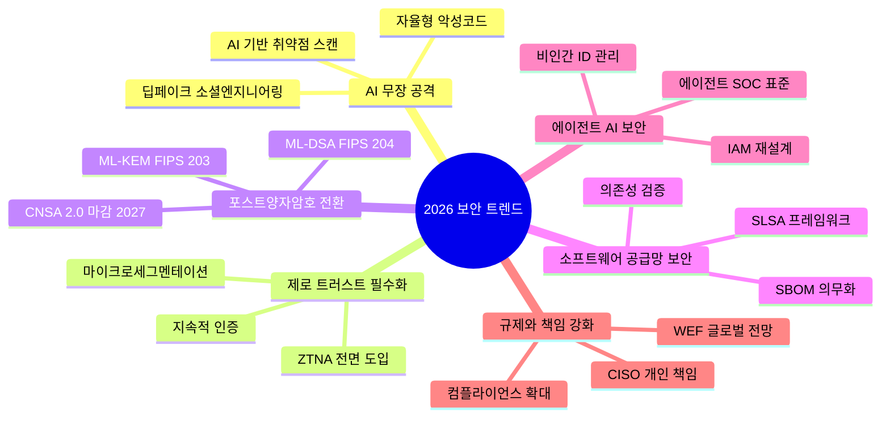
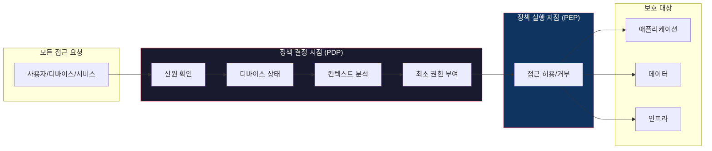
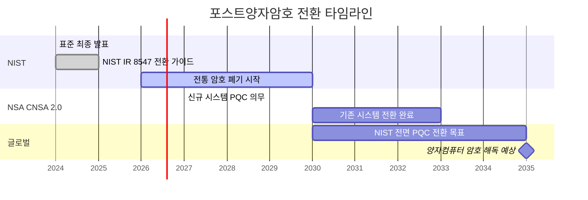
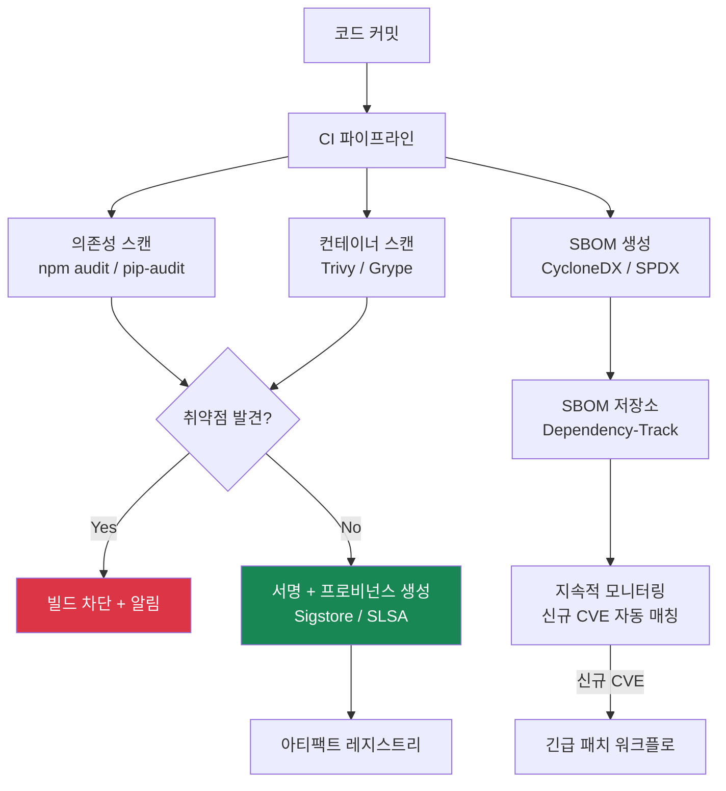
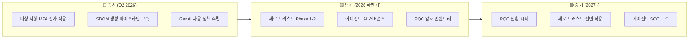

집에 자물쇠를 달아두면 안전할까? 10년 전이라면 그랬을 것이다. 하지만 이제 도둑은 3D프린터로 열쇠를 복제하고, 드론으로 창문을 열며, AI로 경비 패턴을 분석한다. **자물쇠를 바꾸지 않으면 문이 열린다.**

사이버보안도 마찬가지다. 2025년까지의 "방화벽 + 안티바이러스" 패러다임은 이미 무력화되었다. CrowdStrike의 2026 Global Threat Report에 따르면 **공격자가 최초 침투부터 횡적 이동(Lateral Movement)까지 걸리는 시간이 평균 29분**, 최단 기록은 **27초**다. 커피 한 잔 내리는 시간에 시스템이 통째로 털린다는 뜻이다.

Gartner가 2026년 2월에 발표한 6대 사이버보안 트렌드, 삼성SDS의 위협 전망 보고서, IBM·CrowdStrike의 글로벌 위협 리포트를 종합하면 하나의 메시지로 수렴한다: **AI가 공격 도구이자 방어 도구가 된 지금, 보안은 더 이상 보안팀만의 업무가 아니라 모든 개발자의 기본 소양이다.**

---

## 2. 2026 사이버보안 6대 핵심 트렌드

### 🔍 한눈에 보기



---

## 3. 트렌드 ①: AI 무장 공격자의 시대

### 핵심 수치

| 지표 | 수치 | 출처 |
|------|------|------|
| AI 기반 공격 증가율 | 전년 대비 **89%** | CrowdStrike 2026 |
| 평균 eCrime 침투 시간 | **29분** (2024년 대비 65% 단축) | CrowdStrike 2026 |
| 최단 침투 시간 | **27초** | CrowdStrike 2026 |
| 기업 최대 우려 위협 | AI 기반 위협 **81.2%** | 삼성SDS 2026 |
| 하이퍼 개인화 피싱 우려 | **50%** | Practical DevSecOps |

AI가 공격에 쓰이는 방식은 크게 네 가지다:

1. **하이퍼 개인화 피싱**: GPT 수준의 LLM으로 타겟의 SNS, 이메일, 슬랙 대화 패턴을 학습해 "진짜 동료가 보낸 것 같은" 메일을 생성
2. **자동화 취약점 익스플로잇**: AI 에이전트가 자율적으로 정찰 → 취약점 스캔 → 익스플로잇 체이닝까지 수행
3. **적응형 악성코드**: 탐지 엔진의 시그니처를 학습해 실시간으로 코드를 변형하는 폴리모픽 멀웨어
4. **딥페이크 보이스 사기**: CEO 목소리를 합성해 재무팀에 송금을 지시하는 BEC(Business Email Compromise) 공격

### 방어 코드: AI 피싱 탐지 기본 구현

```python
"""
AI 기반 피싱 이메일 탐지 — 헤더 분석 + 텍스트 이상 탐지
실무에서는 이 기본 로직 위에 ML 모델을 결합한다.
"""
import re
from dataclasses import dataclass
from enum import Enum


class ThreatLevel(Enum):
    SAFE = "safe"
    SUSPICIOUS = "suspicious"
    DANGEROUS = "dangerous"


@dataclass(frozen=True)
class EmailAnalysis:
    threat_level: ThreatLevel
    score: float
    reasons: tuple[str, ...]


class PhishingDetector:
    """규칙 기반 피싱 탐지기 — 점수 기반 판정"""

    URGENCY_PATTERNS = [
        r"긴급|urgent|immediately|지금\s*바로|즉시",
        r"계정.*(?:정지|중단|만료)|account.*(?:suspend|terminat)",
        r"비밀번호.*(?:변경|재설정)|password.*(?:reset|change)",
        r"확인.*(?:클릭|링크)|verify.*(?:click|link)",
    ]

    SPOOFING_INDICATORS = [
        r"reply-to.*differs.*from",  # Reply-To ≠ From
        r"X-Mailer.*unknown",
        r"received.*from.*(?:unknown|suspicious)",
    ]

    def analyze(self, subject: str, body: str, headers: dict[str, str]) -> EmailAnalysis:
        score = 0.0
        reasons: list[str] = []

        # 1) 긴급성 패턴 탐지
        for pattern in self.URGENCY_PATTERNS:
            if re.search(pattern, f"{subject} {body}", re.IGNORECASE):
                score += 0.2
                reasons.append(f"긴급성 패턴 탐지: {pattern}")

        # 2) 발신자 스푸핑 검사
        from_addr = headers.get("From", "")
        reply_to = headers.get("Reply-To", "")
        if reply_to and from_addr and reply_to != from_addr:
            score += 0.3
            reasons.append(f"Reply-To({reply_to}) ≠ From({from_addr})")

        # 3) 의심스러운 URL 검사
        urls = re.findall(r"https?://[^\s<>\"']+", body)
        for url in urls:
            if re.search(r"\d{1,3}\.\d{1,3}\.\d{1,3}\.\d{1,3}", url):
                score += 0.25
                reasons.append(f"IP 기반 URL 탐지: {url}")
            if len(url) > 100:
                score += 0.1
                reasons.append(f"비정상 긴 URL: {url[:50]}...")

        # 4) 위협 레벨 판정
        if score >= 0.7:
            threat_level = ThreatLevel.DANGEROUS
        elif score >= 0.4:
            threat_level = ThreatLevel.SUSPICIOUS
        else:
            threat_level = ThreatLevel.SAFE

        return EmailAnalysis(
            threat_level=threat_level,
            score=min(score, 1.0),
            reasons=tuple(reasons),
        )


# 사용 예시
if __name__ == "__main__":
    detector = PhishingDetector()
    result = detector.analyze(
        subject="[긴급] 계정 정지 예정 — 즉시 확인 필요",
        body="귀하의 계정이 24시간 내 정지됩니다. 아래 링크를 클릭하여 확인하세요: http://192.168.1.100/verify-account-now-please-click-here-immediately",
        headers={
            "From": "security@company.com",
            "Reply-To": "attacker@evil.xyz",
        },
    )
    print(f"위협 레벨: {result.threat_level.value}")
    print(f"점수: {result.score:.2f}")
    for reason in result.reasons:
        print(f"  - {reason}")
```

```java
/**
 * AI 피싱 탐지 — Java 구현
 * Spring Security 프로젝트에 통합 가능한 형태
 */
import java.util.*;
import java.util.regex.*;

public class PhishingDetector {

    enum ThreatLevel { SAFE, SUSPICIOUS, DANGEROUS }

    record EmailAnalysis(ThreatLevel threatLevel, double score, List<String> reasons) {}

    private static final List<Pattern> URGENCY_PATTERNS = List.of(
        Pattern.compile("긴급|urgent|immediately|즉시", Pattern.CASE_INSENSITIVE),
        Pattern.compile("계정.*(정지|중단|만료)|account.*(suspend|terminat)", Pattern.CASE_INSENSITIVE),
        Pattern.compile("비밀번호.*(변경|재설정)|password.*(reset|change)", Pattern.CASE_INSENSITIVE),
        Pattern.compile("확인.*(클릭|링크)|verify.*(click|link)", Pattern.CASE_INSENSITIVE)
    );

    private static final Pattern IP_URL = Pattern.compile("\\d{1,3}\\.\\d{1,3}\\.\\d{1,3}\\.\\d{1,3}");
    private static final Pattern URL_PATTERN = Pattern.compile("https?://[^\\s<>\"']+");

    public EmailAnalysis analyze(String subject, String body, Map<String, String> headers) {
        double score = 0.0;
        List<String> reasons = new ArrayList<>();
        String combined = subject + " " + body;

        // 1) 긴급성 패턴 탐지
        for (Pattern pattern : URGENCY_PATTERNS) {
            if (pattern.matcher(combined).find()) {
                score += 0.2;
                reasons.add("긴급성 패턴 탐지: " + pattern.pattern());
            }
        }

        // 2) 발신자 스푸핑 검사
        String from = headers.getOrDefault("From", "");
        String replyTo = headers.getOrDefault("Reply-To", "");
        if (!replyTo.isEmpty() && !from.isEmpty() && !replyTo.equals(from)) {
            score += 0.3;
            reasons.add("Reply-To(%s) ≠ From(%s)".formatted(replyTo, from));
        }

        // 3) 의심스러운 URL 검사
        Matcher urlMatcher = URL_PATTERN.matcher(body);
        while (urlMatcher.find()) {
            String url = urlMatcher.group();
            if (IP_URL.matcher(url).find()) {
                score += 0.25;
                reasons.add("IP 기반 URL: " + url);
            }
            if (url.length() > 100) {
                score += 0.1;
                reasons.add("비정상 긴 URL: " + url.substring(0, 50) + "...");
            }
        }

        // 4) 위협 레벨 판정
        score = Math.min(score, 1.0);
        ThreatLevel level = score >= 0.7 ? ThreatLevel.DANGEROUS
                          : score >= 0.4 ? ThreatLevel.SUSPICIOUS
                          : ThreatLevel.SAFE;

        return new EmailAnalysis(level, score, Collections.unmodifiableList(reasons));
    }

    public static void main(String[] args) {
        var detector = new PhishingDetector();
        var result = detector.analyze(
            "[긴급] 계정 정지 예정",
            "즉시 확인: http://192.168.1.100/verify-now-click-here-immediately-please",
            Map.of("From", "sec@company.com", "Reply-To", "evil@attacker.xyz")
        );
        System.out.println("위협 레벨: " + result.threatLevel());
        System.out.printf("점수: %.2f%n", result.score());
        result.reasons().forEach(r -> System.out.println("  - " + r));
    }
}
```

---

## 4. 트렌드 ②: 제로 트러스트 — "신뢰하지 말고 항상 검증하라"

### 비유로 이해하기

전통적 네트워크 보안은 **성곽 모델**이다. 성벽(방화벽) 안에 들어오면 누구든 자유롭게 돌아다닌다. 하지만 제로 트러스트는 **공항 보안**에 가깝다. 탑승 게이트마다 신분증을 확인하고, 수하물을 스캔하며, 의심스러우면 추가 검사를 한다. 건물 안에 있다는 이유만으로 신뢰하지 않는다.

### 핵심 원칙 (NIST SP 800-207)



### 2026년 제로 트러스트 구현 로드맵

| 단계 | 기간 | 핵심 작업 | 도구/기술 |
|------|------|-----------|-----------|
| Phase 1 | 1~3개월 | IAM 강화, 피싱 저항 MFA 전사 적용 | Okta, Azure AD, FIDO2 |
| Phase 2 | 3~6개월 | EDR 전 엔드포인트 배포, 디바이스 신뢰도 평가 | CrowdStrike, SentinelOne |
| Phase 3 | 6~9개월 | 마이크로세그멘테이션, 워크로드 격리 | Illumio, Cisco ACI |
| Phase 4 | 9~12개월 | SIEM/SOAR 통합, VPN→ZTNA 전환 | Zscaler, Cloudflare Access |

### 실무 코드: ZTNA 스타일 접근 제어 미들웨어

```python
"""
제로 트러스트 접근 제어 미들웨어 — FastAPI 기반
매 요청마다 신원 + 디바이스 + 컨텍스트를 검증한다.
"""
from dataclasses import dataclass
from datetime import datetime
from enum import Enum
from typing import Optional

from fastapi import FastAPI, Request, HTTPException, Depends
from fastapi.security import HTTPBearer, HTTPAuthorizationCredentials


class RiskLevel(Enum):
    LOW = "low"
    MEDIUM = "medium"
    HIGH = "high"
    CRITICAL = "critical"


@dataclass(frozen=True)
class DevicePosture:
    os_patched: bool
    edr_active: bool
    disk_encrypted: bool
    last_scan: datetime


@dataclass(frozen=True)
class AccessContext:
    user_id: str
    device: DevicePosture
    source_ip: str
    geo_location: str
    request_time: datetime
    resource_sensitivity: str


class ZeroTrustPolicyEngine:
    """정책 결정 지점(PDP) — 리스크 점수 기반 접근 제어"""

    TRUSTED_GEOS = {"KR", "US", "JP"}
    BUSINESS_HOURS = range(6, 23)  # 06:00 ~ 22:59

    def evaluate(self, ctx: AccessContext) -> tuple[bool, RiskLevel, list[str]]:
        risk_score = 0
        violations: list[str] = []

        # 1) 디바이스 상태 검증
        if not ctx.device.edr_active:
            risk_score += 30
            violations.append("EDR 비활성 상태")
        if not ctx.device.os_patched:
            risk_score += 20
            violations.append("OS 패치 미적용")
        if not ctx.device.disk_encrypted:
            risk_score += 15
            violations.append("디스크 암호화 미적용")

        # 2) 지리적 이상 탐지
        if ctx.geo_location not in self.TRUSTED_GEOS:
            risk_score += 25
            violations.append(f"비인가 지역 접근: {ctx.geo_location}")

        # 3) 시간 이상 탐지
        if ctx.request_time.hour not in self.BUSINESS_HOURS:
            risk_score += 10
            violations.append(f"업무 외 시간 접근: {ctx.request_time.hour}시")

        # 4) 리소스 민감도에 따른 임계값 조정
        threshold = {
            "public": 80,
            "internal": 50,
            "confidential": 30,
            "restricted": 15,
        }.get(ctx.resource_sensitivity, 30)

        # 5) 판정
        if risk_score >= 70:
            risk_level = RiskLevel.CRITICAL
        elif risk_score >= 50:
            risk_level = RiskLevel.HIGH
        elif risk_score >= 30:
            risk_level = RiskLevel.MEDIUM
        else:
            risk_level = RiskLevel.LOW

        allowed = risk_score < threshold
        return allowed, risk_level, violations


# FastAPI 미들웨어 적용 예시
app = FastAPI()
policy_engine = ZeroTrustPolicyEngine()
security = HTTPBearer()


async def zero_trust_gate(
    request: Request,
    credentials: HTTPAuthorizationCredentials = Depends(security),
) -> AccessContext:
    """모든 요청에 대해 제로 트러스트 검증 수행"""
    # 실제로는 JWT 디코딩, 디바이스 인증서 검증, GeoIP 조회 등이 필요
    ctx = AccessContext(
        user_id="user-from-jwt",
        device=DevicePosture(
            os_patched=True,
            edr_active=True,
            disk_encrypted=True,
            last_scan=datetime.now(),
        ),
        source_ip=request.client.host if request.client else "unknown",
        geo_location="KR",
        request_time=datetime.now(),
        resource_sensitivity="confidential",
    )

    allowed, risk_level, violations = policy_engine.evaluate(ctx)

    if not allowed:
        raise HTTPException(
            status_code=403,
            detail={
                "message": "접근 거부 — 제로 트러스트 정책 위반",
                "risk_level": risk_level.value,
                "violations": violations,
            },
        )

    return ctx


@app.get("/api/sensitive-data")
async def get_sensitive_data(ctx: AccessContext = Depends(zero_trust_gate)):
    return {"message": "접근 허용", "user": ctx.user_id}
```

---

## 5. 트렌드 ③: 포스트양자암호(PQC) — 조용한 카운트다운

### "지금 수확하고, 나중에 해독한다"

양자컴퓨터가 RSA-2048을 깨기까지 아직 시간이 있다고 안심하는 건 위험하다. **"Harvest Now, Decrypt Later(HNDL)"** — 공격자는 지금 암호화된 트래픽을 저장해두고 양자컴퓨터가 상용화되면 한꺼번에 복호화한다. 의료 기록, 군사 기밀, 금융 데이터처럼 10년 뒤에도 가치 있는 정보는 이미 위험에 노출되어 있다.

### NIST 최종 표준 3종

| 표준 | FIPS | 용도 | 대체 대상 | 알고리즘 기반 |
|------|------|------|-----------|-------------|
| **ML-KEM** | FIPS 203 | 키 캡슐화(Key Encapsulation) | RSA, ECDH | 격자(Lattice) |
| **ML-DSA** | FIPS 204 | 전자서명 | ECDSA, RSA 서명 | 격자(Lattice) |
| **SLH-DSA** | FIPS 205 | 전자서명 (보수적) | ECDSA, RSA 서명 | 해시 기반 |

### 마감 타임라인



### 실무 코드: Python에서 PQC 키 교환 테스트

```python
"""
포스트양자암호 키 교환 예시 — oqs-python (liboqs 래퍼)
pip install oqs
※ liboqs 시스템 설치 필요: https://github.com/open-quantum-safe/liboqs
"""
import oqs


def pqc_key_exchange():
    """ML-KEM-768 (FIPS 203) 키 캡슐화 시뮬레이션"""
    kem_algorithm = "ML-KEM-768"

    # 1) 서버: 키 쌍 생성
    with oqs.KeyEncapsulation(kem_algorithm) as server:
        public_key = server.generate_keypair()
        print(f"알고리즘: {kem_algorithm}")
        print(f"공개키 크기: {len(public_key)} bytes")

        # 2) 클라이언트: 공개키로 공유 비밀 캡슐화
        with oqs.KeyEncapsulation(kem_algorithm) as client:
            ciphertext, shared_secret_client = client.encap_secret(public_key)
            print(f"암호문 크기: {len(ciphertext)} bytes")
            print(f"공유 비밀 크기: {len(shared_secret_client)} bytes")

        # 3) 서버: 비밀키로 공유 비밀 복호화
        shared_secret_server = server.decap_secret(ciphertext)

        # 4) 검증: 양쪽 공유 비밀이 동일한지 확인
        assert shared_secret_client == shared_secret_server
        print("✅ 키 교환 성공 — 양쪽 공유 비밀 일치")
        print(f"공유 비밀 (hex): {shared_secret_client[:16].hex()}...")


def pqc_digital_signature():
    """ML-DSA-65 (FIPS 204) 전자서명 시뮬레이션"""
    sig_algorithm = "ML-DSA-65"
    message = b"2026 PQC migration is critical"

    with oqs.Signature(sig_algorithm) as signer:
        public_key = signer.generate_keypair()
        signature = signer.sign(message)
        print(f"\n서명 알고리즘: {sig_algorithm}")
        print(f"서명 크기: {len(signature)} bytes")

    with oqs.Signature(sig_algorithm) as verifier:
        is_valid = verifier.verify(message, signature, public_key)
        print(f"서명 검증: {'✅ 유효' if is_valid else '❌ 무효'}")


if __name__ == "__main__":
    pqc_key_exchange()
    pqc_digital_signature()
```

---

## 6. 트렌드 ④: 소프트웨어 공급망 보안과 SBOM

### 문제의 심각성

지난 5년간 **소프트웨어 공급망 공격은 4배 증가**했다(IBM X-Force). SolarWinds(2020), Log4Shell(2021), 3CX(2023), XZ Utils(2024)를 거치며 업계는 "내가 쓰는 코드가 정말 안전한가?"라는 질문에 답해야 하는 상황이 되었다.

SBOM(Software Bill of Materials)은 소프트웨어의 **성분표**다. 식품에 원재료를 표기하듯, 소프트웨어에 포함된 모든 의존성과 라이선스, 버전 정보를 투명하게 공개한다.

### SBOM 생성 실무 예시

```bash
# CycloneDX를 이용한 SBOM 생성 (Node.js 프로젝트)
npx @cyclonedx/cyclonedx-npm --output-format json --output-file sbom.json

# Python 프로젝트
pip install cyclonedx-bom
cyclonedx-py environment --output sbom.json --format json

# SBOM 취약점 스캔 (Grype)
grype sbom:sbom.json --output table

# SLSA 레벨 검증 (slsa-verifier)
slsa-verifier verify-artifact my-binary \
  --provenance-path provenance.json \
  --source-uri github.com/myorg/myrepo
```

### 공급망 보안 자동화 파이프라인



---

## 7. 트렌드 ⑤: 에이전트 AI 시대의 IAM 재설계

Gartner 설문(2025.05~11)에 따르면 직원의 **57%가 개인 GenAI 계정을 업무에 사용**하고, **33%가 비인가 도구에 민감 정보를 입력**한다. 여기에 에이전트 AI까지 합류하면서 기존 IAM(Identity and Access Management) 체계가 흔들리고 있다.

### 핵심 문제: 비인간 ID(Non-Human Identity)의 폭증

전통 IAM은 "사람"을 전제로 설계되었다. 하지만 이제 AI 에이전트, 자동화 봇, 서비스 메시 사이드카가 API를 호출한다. 이들에게 어떤 수준의 권한을 부여하고, 어떻게 인증하며, 언제 폐기할지에 대한 거버넌스가 비어 있다.

```python
"""
에이전트 AI용 세분화된 권한 관리 예시
RBAC(역할 기반)이 아닌 ABAC(속성 기반) + 시간 제한 토큰
"""
from dataclasses import dataclass
from datetime import datetime, timedelta
from enum import Enum
import hashlib
import secrets


class AgentType(Enum):
    CODE_ASSISTANT = "code_assistant"      # 코드 읽기만
    DEPLOYMENT_BOT = "deployment_bot"      # 배포 실행
    DATA_ANALYST = "data_analyst"          # 데이터 조회
    SECURITY_SCANNER = "security_scanner"  # 전체 읽기


@dataclass(frozen=True)
class AgentCredential:
    agent_id: str
    agent_type: AgentType
    allowed_resources: frozenset[str]
    max_actions_per_minute: int
    expires_at: datetime
    token_hash: str


class AgentIdentityManager:
    """에이전트 AI 전용 IAM — 최소 권한 + 시간 제한 + 속도 제한"""

    PERMISSION_MAP: dict[AgentType, frozenset[str]] = {
        AgentType.CODE_ASSISTANT: frozenset({"repo:read", "docs:read"}),
        AgentType.DEPLOYMENT_BOT: frozenset({"deploy:execute", "config:read", "logs:read"}),
        AgentType.DATA_ANALYST: frozenset({"data:read", "reports:write"}),
        AgentType.SECURITY_SCANNER: frozenset({"repo:read", "infra:read", "vuln:write"}),
    }

    RATE_LIMITS: dict[AgentType, int] = {
        AgentType.CODE_ASSISTANT: 60,
        AgentType.DEPLOYMENT_BOT: 10,
        AgentType.DATA_ANALYST: 30,
        AgentType.SECURITY_SCANNER: 120,
    }

    def __init__(self) -> None:
        self._credentials: dict[str, AgentCredential] = {}

    def register_agent(
        self,
        agent_type: AgentType,
        ttl_hours: int = 8,
    ) -> tuple[str, str]:
        """에이전트 등록 — 시간 제한 크레덴셜 발급"""
        agent_id = f"agent-{agent_type.value}-{secrets.token_hex(4)}"
        raw_token = secrets.token_urlsafe(32)
        token_hash = hashlib.sha256(raw_token.encode()).hexdigest()

        credential = AgentCredential(
            agent_id=agent_id,
            agent_type=agent_type,
            allowed_resources=self.PERMISSION_MAP[agent_type],
            max_actions_per_minute=self.RATE_LIMITS[agent_type],
            expires_at=datetime.now() + timedelta(hours=ttl_hours),
            token_hash=token_hash,
        )
        self._credentials[agent_id] = credential

        print(f"✅ 에이전트 등록: {agent_id}")
        print(f"   권한: {', '.join(credential.allowed_resources)}")
        print(f"   속도 제한: {credential.max_actions_per_minute}/min")
        print(f"   만료: {credential.expires_at.isoformat()}")

        return agent_id, raw_token

    def authorize(self, agent_id: str, resource: str) -> bool:
        """접근 시마다 권한 + 만료 검증"""
        cred = self._credentials.get(agent_id)
        if cred is None:
            print(f"❌ 미등록 에이전트: {agent_id}")
            return False

        if datetime.now() > cred.expires_at:
            print(f"❌ 만료된 크레덴셜: {agent_id}")
            del self._credentials[agent_id]
            return False

        if resource not in cred.allowed_resources:
            print(f"❌ 권한 없음: {agent_id} → {resource}")
            return False

        print(f"✅ 접근 허용: {agent_id} → {resource}")
        return True


if __name__ == "__main__":
    iam = AgentIdentityManager()
    agent_id, token = iam.register_agent(AgentType.CODE_ASSISTANT, ttl_hours=4)

    iam.authorize(agent_id, "repo:read")       # ✅ 허용
    iam.authorize(agent_id, "deploy:execute")   # ❌ 권한 없음
```

---

## 8. 트렌드 ⑥: 규제 강화 — CISO에게 개인 책임이 온다

WEF(세계경제포럼) 글로벌 사이버보안 전망 2026 보고서의 핵심 메시지: **"보안은 기술 문제가 아닌 국가·경제 전략이다."**

2026년부터 여러 법역에서 **중대 과실로 인한 침해 사고 발생 시 CISO와 이사회 위원이 개인적으로 벌금 또는 기소 대상**이 될 수 있다. SEC(미국 증권거래위원회)는 이미 SolarWinds 사태에서 CISO를 기소한 전례를 만들었고, EU의 NIS2 지침은 경영진 책임을 명시한다.

| 규제 | 지역 | 핵심 요구사항 | 위반 시 제재 |
|------|------|-------------|------------|
| NIS2 | EU | 공급망 보안, 사고 보고 24h 이내 | GDP의 최대 2% 또는 1,000만 유로 |
| DORA | EU (금융) | ICT 리스크 관리, 침투 테스트 의무 | 영업정지 가능 |
| SEC 사이버 공시 | 미국 | 4 영업일 내 중대 사고 공시 | CISO 개인 기소 가능 |
| 개인정보보호법 개정 | 한국 | AI 프로파일링 규제, 정보주체 권리 강화 | 매출의 3% 과징금 |

---

## 9. 종합: 2026 보안 위협 대응 체크리스트



### 개발자를 위한 당장 실천 리스트

1. **`npm audit` / `pip-audit` CI에 추가** — 의존성 취약점을 빌드 단계에서 차단
2. **모든 API 엔드포인트에 인증 + 속도 제한** — "내부 API니까 괜찮겠지"는 제로 트러스트 시대에 통하지 않는다
3. **시크릿 관리 도구 도입** — .env 직접 관리 → Vault, AWS Secrets Manager, 1Password CLI
4. **PQC 라이브러리 테스트** — `liboqs`, `oqs-python`으로 하이브리드 키 교환 실험
5. **SBOM 생성 자동화** — CycloneDX 또는 SPDX 포맷으로 빌드마다 자동 생성

---

## 10. 전망: 2027년을 향한 시선

AI 공격과 AI 방어의 군비 경쟁은 더욱 가속될 것이다. 특히 주목할 세 가지:

- **에이전트 SOC의 표준화**: 2026년 하반기부터 보안 운영센터(SOC)에 소형 전문 AI 에이전트들이 경보 그룹핑, 유사도 탐지, 예측적 대응을 자동 수행하는 구조가 보편화된다
- **PQC 하이브리드 모드**: 당분간 기존 암호(RSA/ECDH)와 PQC를 동시에 사용하는 하이브리드 키 교환이 표준이 된다. TLS 1.3에서 ML-KEM + X25519 조합이 이미 Chrome과 Cloudflare에서 실험 중이다
- **개발자 보안 역량의 필수화**: "보안은 보안팀이 하는 것"이라는 인식이 빠르게 사라진다. DevSecOps를 넘어 개발자 개개인의 보안 코딩 역량이 채용과 평가의 기준이 된다

---

## 📎 레퍼런스

### 영상
- [Harvard CS50's Cybersecurity — freeCodeCamp (8h 풀코스)](https://www.freecodecamp.org/news/learn-cybersecurity-from-harvard-university/) — David J. Malan 교수가 가르치는 사이버보안 기초. 계정 보안, 데이터 보호, 소프트웨어 보안, 위협 평가까지 체계적으로 다룬다
- [Cybersecurity and Ethical Hacking with Kali Linux — freeCodeCamp (4h)](https://www.freecodecamp.org/news/learn-cybersecurity-and-ethical-hacking-using-kali-linux/) — 2026년 2월 게시. Kali Linux를 이용한 침투 테스트, 네트워크 보안, 취약점 평가 실습
- [Computerphile — CybSec 시리즈](https://www.nottingham.ac.uk/computerscience/research/cyber-security/cybsec-videos-on-computerphile.aspx) — 노팅엄 대학 사이버보안 연구팀의 Computerphile 영상 시리즈. 암호학, 보안 기초, 공격 기법을 학술적이면서 접근 가능하게 설명

### 보고서 및 문서
- [CrowdStrike 2026 Global Threat Report](https://www.crowdstrike.com/en-us/global-threat-report/) — eCrime 침투 시간 29분, AI 기반 공격 89% 증가 등 핵심 위협 통계
- [Gartner — Top Cybersecurity Trends for 2026 (2026.02)](https://www.gartner.com/en/newsroom/press-releases/2026-02-05-gartner-identifies-the-top-cybersecurity-trends-for-2026) — 에이전트 AI, GenAI 거버넌스, IAM 재설계 등 6대 트렌드
- [삼성SDS — 2026년 사이버 보안 위협 트렌드 전망 및 대응](https://www.samsungsds.com/kr/insights/cybersecurity-threats-and-response-2026.html) — AI 기반 위협 81.2% 우려, 국내 관점의 보안 전망
- [NIST — Post-Quantum Cryptography](https://www.nist.gov/pqc) — ML-KEM, ML-DSA, SLH-DSA 공식 표준 및 전환 가이드
- [NIST SP 800-207 — Zero Trust Architecture](https://nvlpubs.nist.gov/nistpubs/specialpublications/NIST.SP.800-207.pdf) — 제로 트러스트 아키텍처의 정의와 구현 원칙 표준 문서
- [Google Cloud CISO Perspectives — 2026년 사이버보안 전망](https://cloud.google.com/blog/ko/products/identity-security/cloud-ciso-perspectives-2026?hl=ko) — 클라우드 환경 중심의 CISO 관점 보안 전략
- [ISACA — The 6 Cybersecurity Trends That Will Shape 2026](https://www.isaca.org/resources/news-and-trends/industry-news/2026/the-6-cybersecurity-trends-that-will-shape-2026) — 거버넌스, 컴플라이언스, 기술 트렌드 통합 분석
- [AhnLab — 2025년 사이버 위협 동향 및 2026년 전망 보고서](https://www.ahnlab.com/ko/contents/content-center/36017) — 국내 위협 동향과 대응 전략

---

> 🐝 *다음 HoneyByte에서는 "네트워크 보안 기초 — TLS 1.3과 mTLS 핸드셰이크 Deep Dive"를 다룰 예정입니다.*