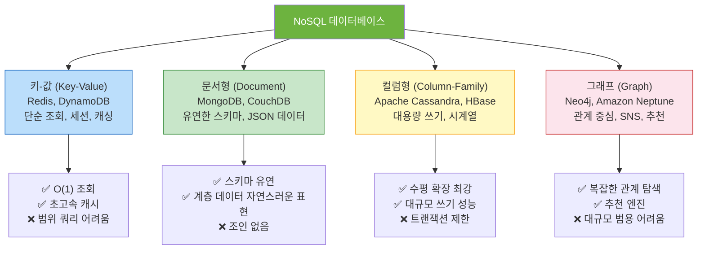
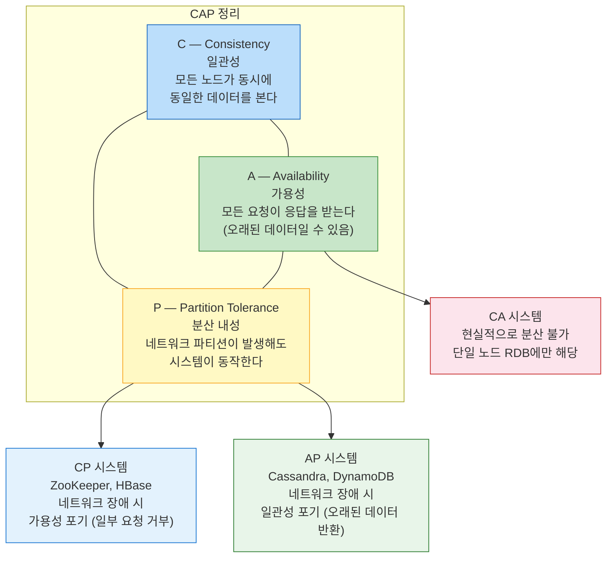
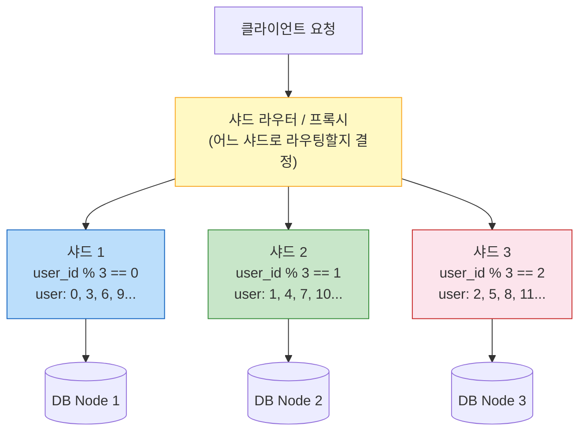

> 수억 건의 데이터, 초당 수십만 요청 — RDB는 한계에 부딪힌다. NoSQL과 분산 데이터베이스는 이 문제를 어떻게 해결하는가. CAP 정리, BASE, 샤딩, 레플리케이션까지 원리부터 실무까지 완전히 정리한다.

## 핵심 요약 (TL;DR)

**NoSQL**은 "Not Only SQL"로, 관계형 모델의 제약(스키마 고정, 수직 확장 한계)을 탈피하기 위해 등장했다. 분산 데이터베이스는 **CAP 정리**에 따라 일관성(C), 가용성(A), 분산 내성(P) 중 최대 2가지만 보장할 수 있다. RDB의 ACID 대신 NoSQL은 **BASE** (Basically Available, Soft state, Eventually consistent)를 채택한다. **샤딩**은 데이터를 여러 노드에 수평 분할하고, **레플리케이션**은 동일 데이터를 여러 노드에 복제하여 가용성과 읽기 성능을 높인다.

---

## 핵심 개념

### NoSQL 데이터베이스 4가지 유형



### NoSQL vs RDB 핵심 비교

| 항목 | RDB (MySQL, PostgreSQL) | NoSQL (MongoDB, Cassandra) |
|------|------------------------|--------------------------|
| **스키마** | 고정 (ALTER TABLE 필요) | 유연 (스키마리스 or 동적) |
| **확장 방식** | 수직 확장 (Scale Up) | 수평 확장 (Scale Out) |
| **일관성 모델** | ACID | BASE (일반적) |
| **조인** | 자연스러운 지원 | 지원 없거나 제한적 |
| **트랜잭션** | 완전한 ACID 지원 | 제한적 (DB마다 다름) |
| **적합한 사용 사례** | 금융, 결제, 복잡한 쿼리 | 소셜미디어, 실시간, 빅데이터 |

---

## CAP 정리 — 분산 시스템의 불가능 정리

**Eric Brewer**가 2000년에 제안하고, 2002년 Gilbert & Lynch가 수학적으로 증명한 정리.

> **"분산 데이터 스토어는 네트워크 파티션이 발생할 때 일관성(C)과 가용성(A) 중 하나만 선택할 수 있다"**



**핵심 이해:**
- 현실의 분산 시스템에서는 **네트워크 파티션(P)이 불가피**하다 — 인터넷이 끊기거나 노드 간 통신이 실패하는 상황은 반드시 발생한다.
- 따라서 실질적인 선택은 **"C와 A 중 무엇을 포기할 것인가"** 다.
- **CP** (일관성 + 분산 내성): 파티션 발생 시 일부 요청을 거부 → 결제 시스템, 재고 관리
- **AP** (가용성 + 분산 내성): 파티션 발생 시 오래된 데이터 반환 → SNS, 장바구니, 뉴스피드

**CAP의 한계와 PACELC:**
CAP은 "파티션 발생 시"에만 초점을 맞추지만, PACELC 정리는 **파티션이 없을 때도 지연(Latency)과 일관성(Consistency) 간 트레이드오프**가 존재함을 보완한다.

---

## ACID vs BASE

### ACID (관계형 DB의 원칙)

- **Atomicity** (원자성): 트랜잭션은 전부 성공하거나 전부 실패
- **Consistency** (일관성): 트랜잭션 전후로 DB 제약 조건 보장
- **Isolation** (격리성): 동시 트랜잭션이 서로 간섭하지 않음
- **Durability** (지속성): 커밋된 데이터는 장애에도 유지

### BASE (NoSQL의 철학)

- **Basically Available**: 항상 응답하지만 일부는 실패하거나 오래된 데이터일 수 있음
- **Soft state**: 시스템 상태가 입력 없이도 시간에 따라 변할 수 있음
- **Eventually Consistent**: 즉각적 일관성 대신 최종적으로 일관성을 달성

```
예시: 좋아요 카운터

ACID 방식:
  POST /like → DB Lock → count++ → 모든 서버에 즉시 반영
  → 동시 요청 많으면 Lock 경합으로 느려짐

BASE 방식 (Eventually Consistent):
  POST /like → 각 서버가 로컬 카운터 증가 → 주기적 동기화
  → 잠깐은 서버마다 다른 카운트 표시 가능 (1000 vs 1003)
  → 수 초 후 최종 일관된 값 수렴
  → Facebook의 좋아요는 이 방식 사용
```

---

## 샤딩 (Sharding) — 데이터 수평 분할

**샤딩**은 하나의 큰 데이터셋을 여러 물리적 서버(샤드)에 분산 저장하는 기법이다.



### 샤딩 전략

**1. 범위 기반 샤딩 (Range-Based)**
```
샤드 1: user_id 1~1,000,000
샤드 2: user_id 1,000,001~2,000,000
샤드 3: user_id 2,000,001~3,000,000

✅ 범위 쿼리 효율적
❌ 핫스팟 문제: 최신 데이터(높은 ID)에 쏠릴 수 있음
```

**2. 해시 기반 샤딩 (Hash-Based)**
```
shard = hash(user_id) % 샤드 수

✅ 균등한 데이터 분포
❌ 샤드 추가 시 대규모 데이터 이동 (Consistent Hashing으로 완화)
```

**3. 디렉터리 기반 샤딩 (Directory-Based)**
```
별도 매핑 테이블: user_id → shard_id 저장

✅ 유연한 샤드 재할당
❌ 매핑 서비스가 단일 장애점(SPOF)이 될 수 있음
```

### Consistent Hashing — 샤드 추가 시 데이터 이동 최소화

```python
import hashlib
from sortedcontainers import SortedDict

class ConsistentHashRing:
    """일관성 해싱 구현 — 샤드 추가 시 최소한의 데이터만 이동"""
    
    def __init__(self, virtual_nodes=150):
        self.ring = SortedDict()
        self.virtual_nodes = virtual_nodes  # 가상 노드로 균등 분포
    
    def add_node(self, node: str):
        for i in range(self.virtual_nodes):
            key = self._hash(f"{node}:{i}")
            self.ring[key] = node
    
    def remove_node(self, node: str):
        for i in range(self.virtual_nodes):
            key = self._hash(f"{node}:{i}")
            self.ring.pop(key, None)
    
    def get_node(self, data_key: str) -> str:
        if not self.ring:
            raise Exception("링이 비어있습니다")
        h = self._hash(data_key)
        # h 이상의 가장 작은 가상 노드 찾기 (시계 방향)
        idx = self.ring.bisect_left(h)
        if idx == len(self.ring):
            idx = 0
        return self.ring.peekitem(idx)[1]
    
    def _hash(self, key: str) -> int:
        return int(hashlib.md5(key.encode()).hexdigest(), 16)


# 시뮬레이션
ring = ConsistentHashRing()
ring.add_node("node-1")
ring.add_node("node-2")
ring.add_node("node-3")

# 데이터 분배 확인
for user_id in range(1, 11):
    node = ring.get_node(f"user:{user_id}")
    print(f"user:{user_id} → {node}")

# node-4 추가 — 전체의 약 25%만 이동
ring.add_node("node-4")
print("\n[node-4 추가 후 재분배]")
for user_id in range(1, 11):
    node = ring.get_node(f"user:{user_id}")
    print(f"user:{user_id} → {node}")
```

---

## 레플리케이션 (Replication) — 데이터 복제

레플리케이션은 동일 데이터를 여러 노드에 복제하여 **고가용성**과 **읽기 성능**을 높인다.

### 주요 패턴

**Primary-Replica (Master-Slave)**
```
Primary (쓰기)
    ├── Replica 1 (읽기)
    ├── Replica 2 (읽기)
    └── Replica 3 (읽기)

✅ 읽기 부하 분산 (Read Scaling)
✅ Primary 장애 시 Replica가 Primary로 승격 (Failover)
❌ Primary 장애와 Replica 승격 사이 다운타임 발생 가능
❌ 동기 복제 시 레이턴시 증가, 비동기 복제 시 데이터 유실 가능
```

**Multi-Primary (Active-Active)**
```
Primary 1 ←→ Primary 2 ←→ Primary 3 (모두 쓰기 가능)

✅ 쓰기 확장 가능
✅ 지역별 지연 최소화 (지리적 분산)
❌ 충돌 해결(Conflict Resolution) 복잡
```

---

## 실무 적용 — NoSQL별 사용 시나리오

### Redis (Key-Value) — 세션 & 캐싱

```python
import redis
import json
from datetime import timedelta

# Redis 연결 (클러스터 모드)
r = redis.Redis(
    host='localhost', 
    port=6379, 
    db=0,
    decode_responses=True,
    # 운영환경: RedisCluster 사용
    # cluster_mode=True, startup_nodes=[...]
)

class SessionManager:
    SESSION_PREFIX = "session:"
    DEFAULT_TTL = timedelta(hours=2)
    
    def create_session(self, user_id: int, data: dict) -> str:
        import uuid
        session_id = str(uuid.uuid4())
        key = f"{self.SESSION_PREFIX}{session_id}"
        
        r.setex(
            name=key,
            time=self.DEFAULT_TTL,
            value=json.dumps({**data, "user_id": user_id})
        )
        return session_id
    
    def get_session(self, session_id: str) -> dict | None:
        key = f"{self.SESSION_PREFIX}{session_id}"
        data = r.get(key)
        if data is None:
            return None
        # TTL 슬라이딩 윈도우 갱신
        r.expire(key, int(self.DEFAULT_TTL.total_seconds()))
        return json.loads(data)
    
    def delete_session(self, session_id: str):
        r.delete(f"{self.SESSION_PREFIX}{session_id}")

# 캐싱 패턴 — Cache-Aside
class ProductCacheService:
    CACHE_TTL = 300  # 5분
    
    def get_product(self, product_id: int) -> dict:
        cache_key = f"product:{product_id}"
        
        # 1. 캐시 확인
        cached = r.get(cache_key)
        if cached:
            return json.loads(cached)  # Cache Hit
        
        # 2. Cache Miss → DB 조회 (실제로는 DB 라이브러리 사용)
        product = self._fetch_from_db(product_id)
        
        # 3. 캐시 저장
        r.setex(cache_key, self.CACHE_TTL, json.dumps(product))
        return product
    
    def invalidate(self, product_id: int):
        r.delete(f"product:{product_id}")
    
    def _fetch_from_db(self, product_id: int) -> dict:
        # DB 조회 시뮬레이션
        return {"id": product_id, "name": "꿀 500g", "price": 25000}

# 분산 락 — Redlock 패턴
class DistributedLock:
    def __init__(self, lock_key: str, expire_ms: int = 5000):
        self.key = f"lock:{lock_key}"
        self.expire_ms = expire_ms
    
    def __enter__(self):
        import uuid
        self.token = str(uuid.uuid4())
        # SET NX PX — 없을 때만 설정, 만료시간 포함
        acquired = r.set(self.key, self.token, nx=True, px=self.expire_ms)
        if not acquired:
            raise RuntimeError(f"락 획득 실패: {self.key}")
        return self
    
    def __exit__(self, *args):
        # Lua 스크립트로 토큰 확인 후 원자적 삭제
        script = """
        if redis.call('get', KEYS[1]) == ARGV[1] then
            return redis.call('del', KEYS[1])
        else
            return 0
        end
        """
        r.eval(script, 1, self.key, self.token)

# 사용 예시
with DistributedLock("order:1001"):
    print("주문 1001 처리 중 (다른 서버 접근 차단)")
```

### MongoDB (Document) — 유연한 스키마

```python
from pymongo import MongoClient, ASCENDING, DESCENDING
from pymongo.errors import DuplicateKeyError
from datetime import datetime

client = MongoClient("mongodb://localhost:27017/")
db = client["honey_store"]

# 컬렉션 및 인덱스 설정
products = db["products"]
products.create_index([("category", ASCENDING), ("price", ASCENDING)])
products.create_index("name", unique=True)
# 텍스트 검색 인덱스
products.create_index([("name", "text"), ("description", "text")])

def create_product(data: dict) -> str:
    try:
        result = products.insert_one({
            **data,
            "created_at": datetime.utcnow(),
            "updated_at": datetime.utcnow()
        })
        return str(result.inserted_id)
    except DuplicateKeyError:
        raise ValueError(f"이미 존재하는 상품명: {data.get('name')}")

def search_products(category: str = None, 
                    min_price: float = None,
                    max_price: float = None,
                    text: str = None,
                    page: int = 1, 
                    page_size: int = 20) -> list:
    query = {}
    if category:
        query["category"] = category
    if min_price is not None or max_price is not None:
        query["price"] = {}
        if min_price is not None:
            query["price"]["$gte"] = min_price
        if max_price is not None:
            query["price"]["$lte"] = max_price
    if text:
        query["$text"] = {"$search": text}
    
    cursor = products.find(
        query,
        projection={"_id": 1, "name": 1, "price": 1, "category": 1}
    ).sort("price", ASCENDING).skip((page-1)*page_size).limit(page_size)
    
    return list(cursor)

# Aggregation Pipeline — MongoDB의 강력한 집계
def get_category_stats() -> list:
    pipeline = [
        {"$match": {"price": {"$gt": 0}}},
        {"$group": {
            "_id": "$category",
            "count": {"$sum": 1},
            "avg_price": {"$avg": "$price"},
            "max_price": {"$max": "$price"},
            "min_price": {"$min": "$price"}
        }},
        {"$sort": {"count": -1}},
        {"$project": {
            "category": "$_id",
            "count": 1,
            "avg_price": {"$round": ["$avg_price", 2]},
            "_id": 0
        }}
    ]
    return list(products.aggregate(pipeline))

# 테스트 실행
if __name__ == "__main__":
    # 샘플 데이터
    create_product({
        "name": "아카시아 꿀 500g",
        "category": "honey",
        "price": 25000,
        "description": "국내산 아카시아 꿀",
        "stock": 100,
        "tags": ["natural", "organic"]
    })
    
    # 검색
    results = search_products(category="honey", min_price=10000)
    print(f"검색 결과: {len(results)}건")
    
    # 통계
    stats = get_category_stats()
    print(f"카테고리별 통계: {stats}")
```

### Spring Boot + MongoDB 설정

```yaml
# application.yml
spring:
  data:
    mongodb:
      uri: mongodb://localhost:27017/honey_store
      # 운영 (Replica Set):
      # uri: mongodb://mongo1:27017,mongo2:27017,mongo3:27017/honey_store?replicaSet=rs0
      auto-index-creation: true

# application-prod.yml
spring:
  data:
    mongodb:
      uri: ${MONGO_URI}  # 환경변수로 주입
      # 연결 풀 설정
      connection-string: ${MONGO_URI}&maxPoolSize=50&minPoolSize=5&connectTimeoutMS=5000
```

---

## Deep Dive: Cassandra의 분산 아키텍처

Apache Cassandra는 **AP** 시스템으로, Facebook의 메시지 저장소를 위해 설계되었다. 일관성 수준(Consistency Level)을 요청별로 조정할 수 있다.

```
Cassandra 일관성 수준 (Consistency Level):

ONE: 1개 노드만 응답하면 성공 (가장 빠름, 가용성 최고)
QUORUM: 과반수 노드 응답 필요 (균형)
ALL: 모든 노드 응답 필요 (가장 강한 일관성, 느림)
LOCAL_QUORUM: 로컬 데이터센터의 과반수 (지리적 분산에서 활용)

읽기 QUORUM + 쓰기 QUORUM > 복제 팩터(N)
→ 강한 일관성 달성 가능

예시: N=3 (복제 팩터 3)
  쓰기 QUORUM(2) + 읽기 QUORUM(2) = 4 > 3
  → 항상 최신 데이터를 읽음을 보장
```

**Cassandra vs MongoDB vs Redis 선택 가이드:**

```
시계열 데이터 (로그, IoT) → Cassandra (대규모 쓰기 최적화)
실시간 캐싱, 세션 → Redis (인메모리, 초저지연)
유연한 문서 데이터 → MongoDB (풍부한 쿼리)
복잡한 관계 분석 → Neo4j (그래프 탐색)
금융, 일관성 필수 → PostgreSQL + 읽기 레플리카
```

---

## 장애 사례 — N+1 레플리케이션 래그

**시나리오:** 이커머스 사이트에서 재고 감소 후 즉시 재고 확인 시 0이 아닌 기존 값이 표시되는 문제.

```
원인 분석:
1. Primary DB에 재고 감소 쓰기 → 완료
2. 클라이언트가 즉시 재고 조회 → Replica로 라우팅
3. Replica는 아직 Primary의 변경 미반영 (레플리케이션 래그 200ms)
4. 사용자에게 잘못된 재고 표시

해결 방법:
방법 1: 재고 관련 읽기는 항상 Primary로 라우팅
         @Transactional(readOnly = false) 또는 
         @Primary 어노테이션으로 쓰기 DS 지정

방법 2: Read-After-Write Consistency
         쓰기 직후 동일 사용자의 읽기는 Primary로 전달

방법 3: Redis를 이용한 재고 캐시
         쓰기 시 Redis 재고도 즉시 업데이트 (캐시 = 최신 데이터)
```

```java
// Spring Boot 다중 DataSource 라우팅 예시
@Configuration
public class DataSourceConfig {
    
    @Bean
    @Primary  // 기본: Primary (쓰기)
    public DataSource primaryDataSource() { ... }
    
    @Bean
    public DataSource replicaDataSource() { ... }
}

// 재고 관련 서비스 — 항상 Primary에서 읽기
@Service
@Transactional  // readOnly = false → Primary 사용
public class StockService {
    
    public int getStock(Long productId) {
        // Primary DB 조회 (최신 보장)
        return stockRepository.findById(productId)
                .map(Stock::getQuantity)
                .orElse(0);
    }
}
```

---

## 면접 Q&A

| 레벨 | 질문 | 핵심 답변 |
|------|------|----------|
| 🟢 기초 | NoSQL과 RDB의 가장 큰 차이점은? | RDB는 스키마 고정 + ACID + 수직 확장, NoSQL은 유연한 스키마 + BASE + 수평 확장. 각각 강한 일관성 vs 높은 확장성 트레이드오프 |
| 🟡 중급 | CAP 정리에서 왜 C와 A 중 하나를 선택해야 하는가? | 분산 시스템에서 네트워크 파티션(P)은 불가피. 파티션 발생 시 일관성을 위해 일부 요청을 거부(CP)하거나, 가용성을 위해 오래된 데이터를 반환(AP)해야 함 |
| 🟡 중급 | 샤딩과 레플리케이션의 차이를 설명하라 | 샤딩은 데이터를 여러 노드에 **분할** 저장 (쓰기 확장, 데이터 크기 확장). 레플리케이션은 동일 데이터를 여러 노드에 **복제** (읽기 확장, 고가용성) |
| 🔴 심화 | Eventually Consistent가 허용되는 상황과 허용되지 않는 상황은? | 허용: SNS 좋아요, 조회수, 장바구니 임시 상태 (수 초 차이 무방). 불허: 은행 계좌 잔액, 재고 (과잉 판매 방지), 예약 시스템 (이중 예약 방지) |
| 🔴 시니어 | Consistent Hashing이 왜 일반 해시 샤딩보다 우수한가? | 일반 해시 샤딩은 노드 추가/삭제 시 전체 데이터의 이동 필요 (mod N 변경). Consistent Hashing은 노드 1개 추가 시 인접 노드의 데이터 일부만 이동 — 평균 K/N 개만 재배치 (K: 전체 데이터, N: 노드 수) |

---

## 정리

| 항목 | 설명 |
|------|------|
| **핵심 키워드** | NoSQL 4유형, CAP(C/A/P), ACID vs BASE, 샤딩(범위/해시/디렉터리), 레플리케이션(Primary-Replica, Multi-Primary), Consistent Hashing |
| **관련 개념** | PACELC, 최종 일관성, 읽기/쓰기 분리(CQRS), 이벤트 소싱, 분산 트랜잭션(Saga 패턴) |
| **실무 선택 기준** | 일관성 필수 → RDB, 확장성/유연성 → NoSQL, 캐싱 → Redis, 대용량 쓰기 → Cassandra, 문서 → MongoDB |

---

## 레퍼런스

### 영상
- [Apache Cassandra Vs. Redis Vs. MongoDB: NoSQL Databases Compared!](https://www.youtube.com/watch?v=oqLy82qVrt4) — NoSQL 주요 DB 비교 (2024)
- [쉬운코드 (@ezcd)](https://www.youtube.com/@ezcd) — DB 개론, 트랜잭션, 동시성 심화 시리즈

### 문서 & 기사
- [CAP Theorem — 초보자를 위한 CAP 이론](https://hamait.tistory.com/197) — CAP 정리 한국어 해설
- [MongoDB Official Documentation](https://www.mongodb.com/docs/) — MongoDB 공식 문서
- [Apache Cassandra Documentation](https://cassandra.apache.org/doc/latest/) — Cassandra 공식 문서
- [Redis Documentation](https://redis.io/docs/latest/) — Redis 공식 문서

---

*이 포스트는 [HoneyByte](https://blog.honeybarrel.co.kr) CS Study 시리즈의 일부입니다.*
