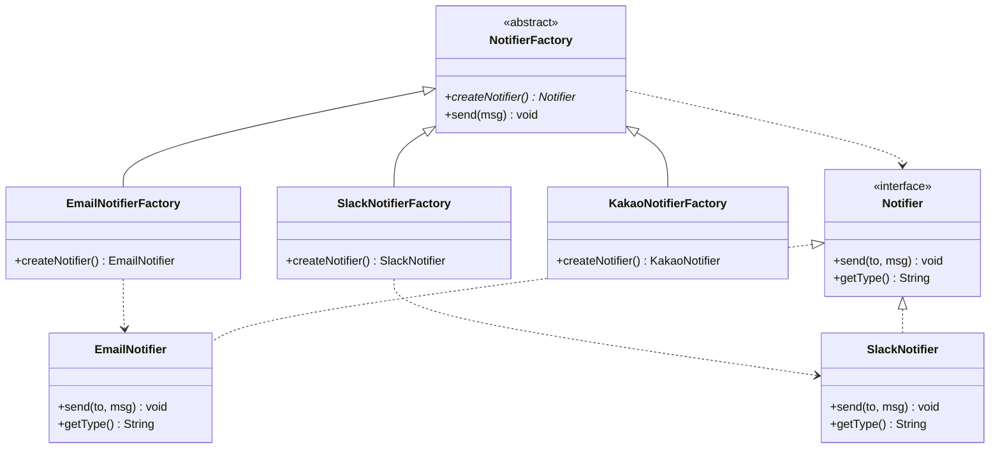
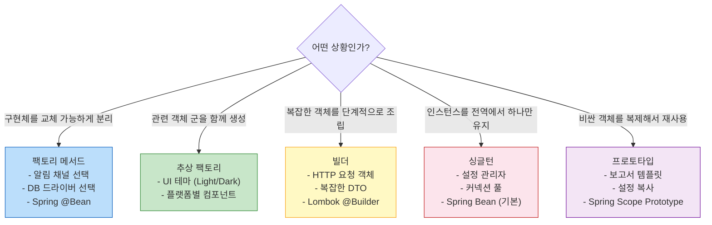

> "new 키워드를 직접 쓰는 것이 항상 옳은가?" — 생성 패턴은 이 질문에서 시작된다. 객체 생성 로직을 캡슐화하고, 결합도를 낮추며, 변경에 유연하게 만드는 GoF 생성 패턴 5가지를 완전히 정복한다.

## 핵심 요약 (TL;DR)

**생성 패턴(Creational Patterns)** 은 객체 생성 방식을 추상화하여 코드 유연성과 재사용성을 높인다. GoF 5가지 생성 패턴 중 실무에서 가장 많이 쓰이는 세 가지: **팩토리 메서드(Factory Method)** 는 어떤 객체를 생성할지를 서브클래스가 결정하게 하고(OCP), **빌더(Builder)** 는 복잡한 객체를 단계적으로 조립하며(생성과 표현 분리), **싱글턴(Singleton)** 은 인스턴스를 하나로 보장한다(전역 접근 단일 지점). Spring은 이 세 패턴을 모두 내부적으로 적극 활용한다.

---

## 왜 생성 패턴이 필요한가

```java
// ❌ Bad: new를 직접 쓰는 강한 결합
public class OrderService {
    // 구현체에 직접 의존 — 다른 알림 방식으로 바꾸려면 OrderService 수정 필요
    private Notifier notifier = new EmailNotifier();  
    private Database db = new MySQLDatabase("jdbc:mysql://...");
}

// ✅ Good: 생성 로직을 분리하면
// - 테스트 시 Mock 주입 가능
// - 구현체 변경 시 OrderService 코드 수정 불필요
// - 객체 생성 방식(풀링, 캐싱)을 한 곳에서 관리
```

---

## 패턴 1: 팩토리 메서드 (Factory Method)

### 의도
"객체를 생성하기 위한 인터페이스를 정의하되, **어떤 클래스의 인스턴스를 생성할지는 서브클래스가 결정**하게 한다."

### 구조



### 구현

```java
// ── 제품 인터페이스 ──────────────────────────────────────────
public interface Notifier {
    void send(String to, String message);
    String getType();
}

// ── 구체 제품 ─────────────────────────────────────────────
public class EmailNotifier implements Notifier {
    @Override
    public void send(String to, String message) {
        System.out.printf("[EMAIL] to=%s, msg=%s%n", to, message);
        // 실제: JavaMailSender 사용
    }
    @Override public String getType() { return "EMAIL"; }
}

public class SlackNotifier implements Notifier {
    @Override
    public void send(String to, String message) {
        System.out.printf("[SLACK] channel=%s, msg=%s%n", to, message);
    }
    @Override public String getType() { return "SLACK"; }
}

public class KakaoNotifier implements Notifier {
    @Override
    public void send(String to, String message) {
        System.out.printf("[KAKAO] to=%s, msg=%s%n", to, message);
    }
    @Override public String getType() { return "KAKAO"; }
}

// ── 팩토리 메서드 (추상 클래스) ──────────────────────────────
public abstract class NotifierFactory {
    // 팩토리 메서드 — 서브클래스가 구현
    public abstract Notifier createNotifier();

    // 템플릿 메서드 패턴과 결합: 공통 로직은 부모에
    public void notify(String to, String message) {
        Notifier notifier = createNotifier();
        // 전처리 (로깅, 검증 등)
        System.out.printf("[%s 알림 발송] to=%s%n", notifier.getType(), to);
        notifier.send(to, message);
    }
}

// ── 구체 팩토리 ──────────────────────────────────────────
public class EmailNotifierFactory extends NotifierFactory {
    @Override
    public Notifier createNotifier() {
        return new EmailNotifier();
    }
}

public class SlackNotifierFactory extends NotifierFactory {
    @Override
    public Notifier createNotifier() {
        return new SlackNotifier();
    }
}

public class KakaoNotifierFactory extends NotifierFactory {
    @Override
    public Notifier createNotifier() {
        return new KakaoNotifier();
    }
}
```

### 실용적인 변형 — 정적 팩토리 메서드 + Enum

```java
// 더 실용적인 패턴: 팩토리 메서드를 정적 메서드로
public enum NotifierType {
    EMAIL, SLACK, KAKAO;

    public Notifier create() {
        return switch (this) {
            case EMAIL -> new EmailNotifier();
            case SLACK -> new SlackNotifier();
            case KAKAO -> new KakaoNotifier();
        };
    }
}

// OCP: 새 채널 추가 = enum 항목 + 구현 클래스 하나 추가. 클라이언트 코드 불변.
// 사용
Notifier notifier = NotifierType.SLACK.create();
notifier.send("#ops-alert", "서버 CPU 90% 경보");
```

### Spring에서의 팩토리 메서드

```java
// Spring의 @Bean은 팩토리 메서드 패턴 그 자체
@Configuration
public class AppConfig {

    @Bean
    public Notifier notifier(
            @Value("${notification.channel}") String channel) {
        // 설정값에 따라 다른 구현체 반환 — 클라이언트는 Notifier 인터페이스만 사용
        return NotifierType.valueOf(channel.toUpperCase()).create();
    }
}

// 사용처는 구현체를 모른다
@Service
@RequiredArgsConstructor
public class OrderService {
    private final Notifier notifier;  // 어떤 구현체인지 모름 — DIP 준수

    public void placeOrder(Order order) {
        notifier.send("ops", "주문 생성: " + order.getId());
    }
}
```

---

## 패턴 2: 추상 팩토리 (Abstract Factory)

팩토리 메서드가 "하나의 제품 계열"이라면, 추상 팩토리는 **"관련 제품 군(family)을 함께 생성"** 한다.

```java
// 관련 제품 군: 메시지 발송 + 첨부파일 처리가 항상 같은 방식이어야 함
public interface MessagingFactory {
    Notifier createNotifier();
    FileUploader createFileUploader();
}

public class EmailMessagingFactory implements MessagingFactory {
    @Override public Notifier createNotifier() { return new EmailNotifier(); }
    @Override public FileUploader createFileUploader() { return new EmailAttachmentUploader(); }
}

public class SlackMessagingFactory implements MessagingFactory {
    @Override public Notifier createNotifier() { return new SlackNotifier(); }
    @Override public FileUploader createFileUploader() { return new SlackFileUploader(); }
}

// 클라이언트 — 팩토리 인터페이스만 사용
public class NotificationClient {
    private final Notifier notifier;
    private final FileUploader uploader;

    public NotificationClient(MessagingFactory factory) {
        this.notifier = factory.createNotifier();
        this.uploader = factory.createFileUploader();
        // 항상 같은 계열의 객체가 생성됨을 보장
    }
}
```

---

## 패턴 3: 빌더 (Builder)

### 의도
"복잡한 객체의 **생성과 표현을 분리**하여, 동일한 생성 절차에서 다양한 표현 결과를 만들어낸다."

### 언제 필요한가

```java
// ❌ 텔레스코핑 생성자 — 매개변수가 늘어날수록 가독성이 무너짐
new HttpRequest("POST", "https://api.example.com", headers, body, 5000, 3, true, false);
// 5000이 타임아웃인지 레트리인지 알 수 없음

// ❌ Setter 방식 — 불변 객체 불가, 일관성 없는 중간 상태 가능
HttpRequest req = new HttpRequest();
req.setMethod("POST");
// setUrl 빠뜨려도 컴파일 오류 없음
```

### 구현

```java
// ── HTTP 요청 객체 (불변) ─────────────────────────────────
public class HttpRequest {
    private final String method;
    private final String url;
    private final Map<String, String> headers;
    private final String body;
    private final int timeoutMs;
    private final int retryCount;
    private final boolean followRedirects;

    // 직접 생성자 호출 불가 — Builder만 사용
    private HttpRequest(Builder builder) {
        this.method = builder.method;
        this.url = builder.url;
        this.headers = Collections.unmodifiableMap(builder.headers);
        this.body = builder.body;
        this.timeoutMs = builder.timeoutMs;
        this.retryCount = builder.retryCount;
        this.followRedirects = builder.followRedirects;
    }

    public String getMethod() { return method; }
    public String getUrl() { return url; }
    public Map<String, String> getHeaders() { return headers; }
    public String getBody() { return body; }
    public int getTimeoutMs() { return timeoutMs; }

    @Override
    public String toString() {
        return String.format("HttpRequest{method=%s, url=%s, timeout=%dms, retry=%d}",
                method, url, timeoutMs, retryCount);
    }

    // ── Builder 내부 클래스 ────────────────────────────────
    public static class Builder {
        // 필수 필드
        private final String method;
        private final String url;

        // 선택 필드 (기본값 설정)
        private Map<String, String> headers = new HashMap<>();
        private String body = null;
        private int timeoutMs = 3000;
        private int retryCount = 0;
        private boolean followRedirects = true;

        // 필수 필드는 생성자에서 강제
        public Builder(String method, String url) {
            if (method == null || method.isBlank())
                throw new IllegalArgumentException("HTTP 메서드는 필수입니다");
            if (url == null || url.isBlank())
                throw new IllegalArgumentException("URL은 필수입니다");
            this.method = method.toUpperCase();
            this.url = url;
        }

        public Builder header(String name, String value) {
            this.headers.put(name, value);
            return this;  // 메서드 체이닝
        }

        public Builder bearerToken(String token) {
            return header("Authorization", "Bearer " + token);
        }

        public Builder jsonBody(String json) {
            this.body = json;
            return header("Content-Type", "application/json");
        }

        public Builder timeout(int ms) {
            if (ms <= 0) throw new IllegalArgumentException("타임아웃은 양수여야 합니다");
            this.timeoutMs = ms;
            return this;
        }

        public Builder retry(int count) {
            if (count < 0) throw new IllegalArgumentException("재시도 횟수는 0 이상이어야 합니다");
            this.retryCount = count;
            return this;
        }

        public Builder noRedirect() {
            this.followRedirects = false;
            return this;
        }

        public HttpRequest build() {
            // 빌드 시점에 상태 일관성 검증
            if ("POST".equals(method) || "PUT".equals(method) || "PATCH".equals(method)) {
                if (body == null) {
                    System.out.println("[WARN] " + method + " 요청에 body가 없습니다");
                }
            }
            return new HttpRequest(this);
        }
    }
}
```

### 사용 예시

```java
// 읽기 — 깔끔하고 자기 설명적
HttpRequest getRequest = new HttpRequest.Builder("GET", "https://api.honeybarrel.co.kr/products")
        .header("Accept", "application/json")
        .bearerToken("eyJhbGciOiJIUzI1NiJ9...")
        .timeout(5000)
        .retry(3)
        .build();

// 쓰기
HttpRequest postRequest = new HttpRequest.Builder("POST", "https://api.honeybarrel.co.kr/orders")
        .bearerToken("eyJhbGciOiJIUzI1NiJ9...")
        .jsonBody("""
                {
                  "productId": 1,
                  "quantity": 2
                }
                """)
        .timeout(10000)
        .build();

System.out.println(getRequest);
System.out.println(postRequest);
```

### Lombok `@Builder` — 실무에서의 간소화

```java
// 실무에서는 Lombok @Builder로 보일러플레이트 제거
@Getter
@Builder
@ToString
public class CreateOrderRequest {

    @NonNull  // build() 시점에 null 체크
    private final Long productId;

    @NonNull
    private final String buyerEmail;

    @Builder.Default  // 기본값 설정
    private final int quantity = 1;

    @Builder.Default
    private final String currency = "KRW";

    private final String couponCode;  // 선택 필드 (null 허용)
}

// 사용
CreateOrderRequest request = CreateOrderRequest.builder()
        .productId(101L)
        .buyerEmail("king@honeybarrel.co.kr")
        .quantity(3)
        .couponCode("HONEY10")
        .build();
```

---

## 패턴 4: 싱글턴 (Singleton)

### 의도
"클래스의 **인스턴스가 오직 하나**임을 보장하고, 이에 대한 전역 접근점을 제공한다."

### 구현 방법 비교

```java
// ── 방법 1: 이른 초기화 (Eager Initialization) ─────────────
// 클래스 로딩 시점에 인스턴스 생성 — 스레드 안전 (JVM 클래스 로딩 보장)
// 단점: 사용 안 해도 메모리 차지, 예외 처리 어려움
public class DatabaseConfig {
    private static final DatabaseConfig INSTANCE = new DatabaseConfig();

    private DatabaseConfig() {
        System.out.println("DatabaseConfig 초기화");
    }

    public static DatabaseConfig getInstance() {
        return INSTANCE;
    }
}

// ── 방법 2: 지연 초기화 + double-checked locking ───────────
// 최초 사용 시 초기화 + 멀티스레드 안전
// volatile: CPU 캐시가 아닌 메인 메모리에서 읽도록 강제 (명령어 재정렬 방지)
public class ConnectionPool {
    private static volatile ConnectionPool instance;
    private final List<Connection> pool = new ArrayList<>();

    private ConnectionPool() {
        // 초기 커넥션 생성
        for (int i = 0; i < 10; i++) {
            pool.add(createConnection());
        }
    }

    public static ConnectionPool getInstance() {
        if (instance == null) {                    // 1차 체크 (락 없이 빠른 탈출)
            synchronized (ConnectionPool.class) {  // 임계 구역 진입
                if (instance == null) {            // 2차 체크 (락 안에서 재확인)
                    instance = new ConnectionPool();
                }
            }
        }
        return instance;
    }

    private Connection createConnection() {
        return new Connection(); // 실제 DB 연결
    }

    public synchronized Connection acquire() {
        if (pool.isEmpty()) throw new RuntimeException("커넥션 풀 고갈");
        return pool.remove(pool.size() - 1);
    }

    public synchronized void release(Connection conn) {
        pool.add(conn);
    }
}

// ── 방법 3: Initialization-on-demand Holder ─────────────────
// 가장 우아한 Lazy 초기화 — 스레드 안전, volatile 불필요
// JVM의 클래스 초기화 보장을 활용 (클래스 로더는 클래스 초기화를 한 번만 수행)
public class AppConfig {

    private AppConfig() {}

    // Holder 클래스는 getInstance() 최초 호출 시점에 로딩됨
    private static class Holder {
        private static final AppConfig INSTANCE = new AppConfig();
    }

    public static AppConfig getInstance() {
        return Holder.INSTANCE;  // 클래스 로딩 시 초기화 → 스레드 안전
    }
}

// ── 방법 4: Enum 싱글턴 (직렬화 안전, 리플렉션 공격 방어) ────
// Joshua Bloch가 "Effective Java"에서 권장한 방법
// 직렬화/역직렬화해도 인스턴스 하나 보장, 리플렉션으로 생성자 호출 불가
public enum EventBus {
    INSTANCE;

    private final List<EventListener> listeners = new CopyOnWriteArrayList<>();

    public void subscribe(EventListener listener) {
        listeners.add(listener);
    }

    public void publish(Object event) {
        listeners.forEach(l -> l.onEvent(event));
    }
}

// 사용
EventBus.INSTANCE.subscribe(event -> System.out.println("이벤트: " + event));
EventBus.INSTANCE.publish("주문 완료");
```

### 싱글턴의 함정과 테스트 문제

```java
// ❌ 문제: 싱글턴은 전역 상태 → 테스트 격리 어려움
class OrderServiceTest {
    @Test
    void 주문_생성() {
        // AppConfig.getInstance()가 다른 테스트에서 변경됐다면?
        // 테스트 순서에 따라 결과가 달라질 수 있음
    }
}

// ✅ 해결: Spring에서는 IoC 컨테이너가 싱글턴 생명주기를 관리
// 직접 getInstance() 대신 DI로 주입받음 → 테스트 시 Mock 주입 가능
@Service  // Spring이 싱글턴으로 관리
public class OrderService {
    private final NotificationService notificationService;

    public OrderService(NotificationService notificationService) {
        this.notificationService = notificationService;
        // 테스트 시 MockNotificationService 주입 가능
    }
}
```

---

## 패턴 5: 프로토타입 (Prototype)

### 의도
"생성할 객체의 종류를 원형(prototype) 인스턴스로 명시하고, 이를 **복사(clone)** 하여 새 객체를 생성한다."

```java
// 생성 비용이 큰 객체를 복제로 재사용
public class ReportTemplate implements Cloneable {
    private String title;
    private List<String> sections;
    private Map<String, Object> metadata;

    public ReportTemplate(String title) {
        this.title = title;
        this.sections = new ArrayList<>();
        this.metadata = new HashMap<>();
        // 무거운 초기화 (DB 조회, 파일 로딩 등)
        System.out.println("ReportTemplate 생성 (비용이 큰 작업)");
    }

    public void addSection(String section) { sections.add(section); }
    public void setMeta(String key, Object value) { metadata.put(key, value); }

    @Override
    public ReportTemplate clone() {
        try {
            ReportTemplate clone = (ReportTemplate) super.clone();
            // 깊은 복사 필요한 필드
            clone.sections = new ArrayList<>(this.sections);
            clone.metadata = new HashMap<>(this.metadata);
            return clone;
        } catch (CloneNotSupportedException e) {
            throw new RuntimeException(e);
        }
    }
}

// 사용: 원형에서 복제
ReportTemplate base = new ReportTemplate("월간 보고서");
base.addSection("요약");
base.addSection("상세 내용");

// 복제 — 무거운 초기화 없이 빠르게 생성
ReportTemplate aprilReport = base.clone();
aprilReport.setMeta("month", "2026-04");
aprilReport.addSection("4월 특이사항");

ReportTemplate marchReport = base.clone();
marchReport.setMeta("month", "2026-03");
```

---

## 패턴별 실무 선택 가이드



| 패턴 | 해결하는 문제 | Spring 활용 예 | 트레이드오프 |
|------|------------|--------------|------------|
| **팩토리 메서드** | 구현체 교체 유연성 | `@Bean`, `FactoryBean` | 팩토리 클래스 증가 |
| **추상 팩토리** | 제품 군 일관성 | 자동 설정 조건부 Bean | 복잡도 증가 |
| **빌더** | 복잡한 객체 안전 생성 | `UriComponentsBuilder`, `MockMvcRequestBuilders` | 코드량 증가 (Lombok으로 완화) |
| **싱글턴** | 전역 단일 인스턴스 | Spring Bean 기본 스코프 | 전역 상태 → 테스트 어려움 |
| **프로토타입** | 비싼 초기화 재사용 | `@Scope("prototype")` | 깊은 복사 구현 주의 |

---

## 실행 및 테스트

```java
// Main.java — 통합 테스트
public class CreationalPatternDemo {

    public static void main(String[] args) {
        System.out.println("=== 팩토리 메서드 ===");
        NotifierType.EMAIL.create().send("dev@honeybarrel.co.kr", "배포 완료");
        NotifierType.SLACK.create().send("#dev-alert", "배포 완료");

        System.out.println("\n=== 빌더 ===");
        HttpRequest request = new HttpRequest.Builder("POST", "https://api.honeybarrel.co.kr/orders")
                .bearerToken("token123")
                .jsonBody("{\"productId\": 1, \"quantity\": 2}")
                .timeout(5000)
                .retry(3)
                .build();
        System.out.println(request);

        System.out.println("\n=== 싱글턴 ===");
        AppConfig cfg1 = AppConfig.getInstance();
        AppConfig cfg2 = AppConfig.getInstance();
        System.out.println("동일 인스턴스: " + (cfg1 == cfg2));  // true

        EventBus.INSTANCE.subscribe(e -> System.out.println("이벤트 수신: " + e));
        EventBus.INSTANCE.publish("주문 완료");

        System.out.println("\n=== 프로토타입 ===");
        ReportTemplate base = new ReportTemplate("월간 보고서");
        base.addSection("요약");

        ReportTemplate aprilReport = base.clone();
        aprilReport.setMeta("month", "2026-04");
        System.out.println("base와 다른 sections 객체: "
                + (base.sections != aprilReport.sections));  // true
    }
}
```

```bash
# 실행
./gradlew run

# 예상 출력
=== 팩토리 메서드 ===
[EMAIL] to=dev@honeybarrel.co.kr, msg=배포 완료
[SLACK] channel=#dev-alert, msg=배포 완료

=== 빌더 ===
HttpRequest{method=POST, url=https://api.honeybarrel.co.kr/orders, timeout=5000ms, retry=3}

=== 싱글턴 ===
동일 인스턴스: true
이벤트 수신: 주문 완료

=== 프로토타입 ===
ReportTemplate 생성 (비용이 큰 작업)
base와 다른 sections 객체: true
```

---

## SOLID와 생성 패턴의 연결

| 생성 패턴 | SOLID 원칙 | 설명 |
|---------|----------|------|
| 팩토리 메서드 | **OCP** | 새 제품 추가 = 서브클래스 하나 추가, 기존 코드 수정 없음 |
| 팩토리 메서드 | **DIP** | 고수준 모듈이 추상 팩토리에 의존, 구체 클래스 모름 |
| 빌더 | **SRP** | 객체 생성 로직(빌더)과 사용 로직 분리 |
| 싱글턴 | **ISP** | 전역 접근 단일 지점 제공 (남발하면 DIP 위반) |
| 추상 팩토리 | **LSP** | 동일 계열 팩토리로 교체 가능 |

---

## 레퍼런스

### 공식 / 표준 문서
- [Refactoring.Guru — 생성 패턴](https://refactoring.guru/ko/design-patterns/creational-patterns) — GoF 패턴 시각화 가이드
- [Effective Java (Joshua Bloch)](https://www.oreilly.com/library/view/effective-java-3rd/9780134686097/) — Item 1: 정적 팩토리 메서드, Item 2: 빌더, Item 3: Enum 싱글턴

### 기술 블로그
- [얄팍한 코딩사전 (@yalco-coding)](https://www.youtube.com/@yalco-coding) — 디자인패턴 시리즈 (애니메이션으로 쉬운 설명)
- [Spring Framework @Bean 팩토리 메서드](https://docs.spring.io/spring-framework/reference/core/beans/java/bean-annotation.html) — Spring 공식 문서

---

*이 포스트는 [HoneyByte](https://blog.honeybarrel.co.kr) 개발 블로그 디자인패턴 시리즈의 일부입니다.*
