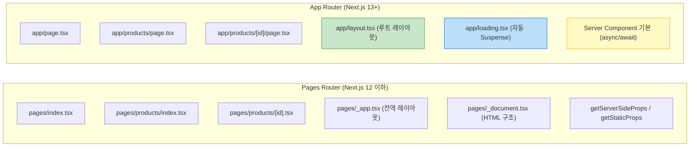
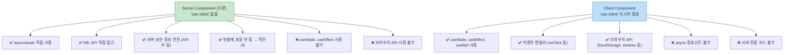

> Next.js 13에서 도입된 App Router는 2025년 기준 Next.js의 기본이자 표준이다. 파일 시스템 라우팅의 진화, React Server Components의 원리, `layout.tsx` / `page.tsx` / `loading.tsx` / `error.tsx` 특수 파일의 역할까지 — 처음부터 제대로 이해하고 시작하자.

## 핵심 요약 (TL;DR)

**App Router**는 `app/` 디렉터리 기반의 파일 시스템 라우터로, Next.js 13부터 도입되어 15 기준으로 안정화됐다. 폴더 구조가 곧 URL 경로이며, **특수 파일(special files)** 로 레이아웃·로딩·에러·404를 선언적으로 처리한다. 가장 큰 변화는 **React Server Components(RSC)** — 기본적으로 모든 컴포넌트는 서버에서 실행되고, 클라이언트에서 실행이 필요할 때만 `'use client'` 지시어를 붙인다. 이로 인해 번들 크기가 줄고 초기 로딩이 빨라진다.

---

## App Router vs Pages Router



**왜 App Router로 이동했는가:**
- `getServerSideProps`의 파일 단위 분리 → 컴포넌트 단위 데이터 페칭
- 전역 `_app.tsx` 하나 → **중첩 레이아웃** (경로별 독립 레이아웃)
- 클라이언트 번들에 불필요한 서버 코드 포함 문제 → RSC로 완전 분리
- 스트리밍 SSR + Suspense 지원 → 부분적 UI 표시

---

## 환경 설정

### 프로젝트 생성

```bash
# Next.js 15 (최신 안정판) 프로젝트 생성
npx create-next-app@latest honey-next \
  --typescript \
  --tailwind \
  --eslint \
  --app \
  --src-dir \
  --import-alias "@/*"

cd honey-next

# 의존성 설치 (자동으로 됨)
# next, react, react-dom, typescript, tailwindcss 등

# 개발 서버 실행
npm run dev
# http://localhost:3000
```

### 생성된 프로젝트 구조

```
honey-next/
├── src/
│   └── app/
│       ├── layout.tsx        ← 루트 레이아웃 (필수)
│       ├── page.tsx          ← / 경로
│       ├── globals.css       ← 전역 스타일
│       └── favicon.ico
├── public/                   ← 정적 파일
├── next.config.ts            ← Next.js 설정
├── tailwind.config.ts
└── tsconfig.json
```

### `next.config.ts` 기본 설정

```typescript
import type { NextConfig } from 'next'

const nextConfig: NextConfig = {
  // 이미지 최적화 허용 도메인
  images: {
    remotePatterns: [
      {
        protocol: 'https',
        hostname: 'api.honeybarrel.co.kr',
      },
    ],
  },
  // 실험적 기능 (Next.js 15)
  experimental: {
    // PPR (Partial Pre-rendering) — 정적+동적 혼합 렌더링
    ppr: false,
  },
}

export default nextConfig
```

---

## App Router 핵심 개념

### 파일 시스템 = URL 경로

```
app/
├── page.tsx                     → /
├── about/
│   └── page.tsx                 → /about
├── products/
│   ├── page.tsx                 → /products
│   └── [id]/
│       └── page.tsx             → /products/123
├── blog/
│   └── [slug]/
│       └── page.tsx             → /blog/hello-world
├── (marketing)/                 ← () = 라우트 그룹 (URL에 포함 안 됨)
│   ├── layout.tsx               → 마케팅 페이지 공통 레이아웃
│   ├── pricing/page.tsx         → /pricing
│   └── features/page.tsx        → /features
└── api/
    └── products/
        └── route.ts             → API 엔드포인트 /api/products
```

### 특수 파일 완전 정리

| 파일명 | 역할 | 렌더링 |
|--------|------|--------|
| `layout.tsx` | 중첩 레이아웃 (자식 경로에 유지됨) | Server |
| `page.tsx` | 해당 경로의 실제 UI | Server |
| `loading.tsx` | Suspense 폴백 — 페이지 로딩 중 표시 | Server |
| `error.tsx` | 에러 바운더리 폴백 | **Client** |
| `not-found.tsx` | 404 UI | Server |
| `template.tsx` | layout과 유사하지만 경로 이동 시 마운트 재실행 | Server |
| `route.ts` | API 엔드포인트 (REST API 처리) | Server |

---

## 구현 — 실제 레이아웃 구조 설계

### `app/layout.tsx` — 루트 레이아웃

```tsx
// src/app/layout.tsx
import type { Metadata } from 'next'
import { Inter } from 'next/font/google'
import './globals.css'

const inter = Inter({ subsets: ['latin'] })

// 메타데이터 — 정적 선언
export const metadata: Metadata = {
  title: {
    template: '%s | HoneyBarrel',  // 각 페이지 title + 기본 이름
    default: 'HoneyBarrel — 꿀 전문 쇼핑몰',
  },
  description: '최고 품질의 국내산 꿀을 만나보세요',
  openGraph: {
    siteName: 'HoneyBarrel',
    locale: 'ko_KR',
  },
}

interface RootLayoutProps {
  children: React.ReactNode
}

// 루트 레이아웃은 반드시 <html>과 <body> 포함 (기존 _document.tsx 대체)
export default function RootLayout({ children }: RootLayoutProps) {
  return (
    <html lang="ko">
      <body className={`${inter.className} bg-gray-50`}>
        {/* 헤더, 네비게이션 등 공통 UI */}
        <Header />
        <main className="min-h-screen container mx-auto px-4 py-8">
          {children}
        </main>
        <Footer />
      </body>
    </html>
  )
}

// 서버 컴포넌트이므로 직접 async 함수 사용 가능
async function Header() {
  // 서버에서 직접 데이터 페칭 가능 (DB, API 호출)
  const navItems = await fetchNavigation()

  return (
    <header className="bg-amber-400 shadow-sm">
      <nav className="container mx-auto px-4 py-4 flex items-center justify-between">
        <a href="/" className="text-2xl font-bold text-amber-900">🍯 HoneyBarrel</a>
        <ul className="flex gap-6">
          {navItems.map(item => (
            <li key={item.href}>
              <a href={item.href} className="text-amber-900 hover:underline">
                {item.label}
              </a>
            </li>
          ))}
        </ul>
      </nav>
    </header>
  )
}

async function fetchNavigation() {
  // 실제로는 CMS API 또는 DB 조회
  return [
    { href: '/products', label: '상품' },
    { href: '/about', label: '회사 소개' },
  ]
}

function Footer() {
  return (
    <footer className="bg-amber-900 text-amber-100 py-8 mt-16">
      <div className="container mx-auto px-4 text-center">
        <p>© 2026 HoneyBarrel. All rights reserved.</p>
      </div>
    </footer>
  )
}
```

### `app/page.tsx` — 홈 페이지 (Server Component)

```tsx
// src/app/page.tsx
import type { Metadata } from 'next'
import Link from 'next/link'
import Image from 'next/image'

// 페이지별 메타데이터 오버라이드
export const metadata: Metadata = {
  title: '홈',  // → "홈 | HoneyBarrel"
}

// 기본적으로 Server Component — 'use client' 없음
// async 함수로 서버에서 직접 데이터 페칭
export default async function HomePage() {
  const featuredProducts = await getFeaturedProducts()

  return (
    <div>
      {/* 히어로 섹션 */}
      <section className="text-center py-16">
        <h1 className="text-4xl font-bold text-amber-900 mb-4">
          자연이 만든 달콤함, 꿀
        </h1>
        <p className="text-xl text-gray-600 mb-8">
          국내 최상급 양봉농가에서 직접 공수한 꿀
        </p>
        <Link
          href="/products"
          className="bg-amber-400 text-amber-900 px-8 py-3 rounded-full font-semibold hover:bg-amber-500 transition-colors"
        >
          상품 보러가기
        </Link>
      </section>

      {/* 추천 상품 */}
      <section>
        <h2 className="text-2xl font-bold mb-6">인기 상품</h2>
        <div className="grid grid-cols-1 md:grid-cols-3 gap-6">
          {featuredProducts.map(product => (
            <ProductCard key={product.id} product={product} />
          ))}
        </div>
      </section>
    </div>
  )
}

// 서버 컴포넌트 내 중첩 서버 컴포넌트
function ProductCard({ product }: { product: Product }) {
  return (
    <Link href={`/products/${product.id}`}>
      <div className="bg-white rounded-xl shadow-sm hover:shadow-md transition-shadow p-4">
        <div className="aspect-square relative mb-3">
          <Image
            src={product.imageUrl}
            alt={product.name}
            fill
            className="object-cover rounded-lg"
          />
        </div>
        <h3 className="font-semibold text-gray-900">{product.name}</h3>
        <p className="text-amber-600 font-bold">
          {product.price.toLocaleString('ko-KR')}원
        </p>
      </div>
    </Link>
  )
}

// 데이터 페칭 함수 (서버에서만 실행)
async function getFeaturedProducts(): Promise<Product[]> {
  // fetch는 Next.js에서 자동으로 요청 메모이제이션 + 캐싱
  const res = await fetch('https://api.honeybarrel.co.kr/products?featured=true', {
    // 캐시 전략: 'force-cache'(SSG) | 'no-store'(SSR) | { next: { revalidate: 60 } }(ISR)
    next: { revalidate: 300 },  // 5분마다 재검증 (ISR)
  })

  if (!res.ok) throw new Error('추천 상품 로딩 실패')
  return res.json()
}

interface Product {
  id: number
  name: string
  price: number
  imageUrl: string
}
```

### `app/products/loading.tsx` — 스켈레톤 UI

```tsx
// src/app/products/loading.tsx
// page.tsx가 데이터 페칭 중일 때 자동으로 Suspense 폴백으로 표시됨

export default function ProductsLoading() {
  return (
    <div>
      <div className="h-8 bg-gray-200 rounded animate-pulse mb-6 w-48" />
      <div className="grid grid-cols-1 md:grid-cols-3 gap-6">
        {Array.from({ length: 6 }).map((_, i) => (
          <div key={i} className="bg-white rounded-xl p-4 shadow-sm">
            <div className="aspect-square bg-gray-200 animate-pulse rounded-lg mb-3" />
            <div className="h-4 bg-gray-200 rounded animate-pulse mb-2" />
            <div className="h-4 bg-gray-200 rounded animate-pulse w-24" />
          </div>
        ))}
      </div>
    </div>
  )
}
```

### `app/products/error.tsx` — 에러 바운더리

```tsx
// src/app/products/error.tsx
'use client'  // 에러 바운더리는 Client Component 필수

import { useEffect } from 'react'
import { useRouter } from 'next/navigation'

interface ErrorProps {
  error: Error & { digest?: string }  // digest: 서버 에러 ID
  reset: () => void  // 재시도 함수
}

export default function ProductsError({ error, reset }: ErrorProps) {
  useEffect(() => {
    // 에러 리포팅 서비스로 전송 (Sentry 등)
    console.error('[Products Error]', error)
  }, [error])

  const router = useRouter()

  return (
    <div className="text-center py-16">
      <div className="text-6xl mb-4">😵</div>
      <h2 className="text-2xl font-bold text-gray-900 mb-2">
        상품을 불러올 수 없습니다
      </h2>
      <p className="text-gray-500 mb-6">
        {error.message || '잠시 후 다시 시도해주세요.'}
      </p>
      <div className="flex gap-3 justify-center">
        <button
          onClick={reset}
          className="bg-amber-400 text-amber-900 px-6 py-2 rounded-full font-semibold hover:bg-amber-500"
        >
          다시 시도
        </button>
        <button
          onClick={() => router.push('/')}
          className="border border-gray-300 px-6 py-2 rounded-full text-gray-600 hover:bg-gray-50"
        >
          홈으로
        </button>
      </div>
    </div>
  )
}
```

### `app/not-found.tsx` — 전역 404

```tsx
// src/app/not-found.tsx
import Link from 'next/link'

export default function NotFound() {
  return (
    <div className="text-center py-24">
      <h1 className="text-8xl font-bold text-amber-300 mb-4">404</h1>
      <p className="text-2xl text-gray-700 mb-2">페이지를 찾을 수 없습니다</p>
      <p className="text-gray-500 mb-8">
        URL을 확인하거나 홈으로 돌아가세요
      </p>
      <Link
        href="/"
        className="bg-amber-400 text-amber-900 px-8 py-3 rounded-full font-semibold hover:bg-amber-500"
      >
        홈으로
      </Link>
    </div>
  )
}
```

---

## Server Component vs Client Component



### 올바른 경계 설정

```tsx
// ── 서버 컴포넌트 (데이터 페칭 담당) ─────────────────────────
// src/app/products/[id]/page.tsx
export default async function ProductDetailPage({
  params,
}: {
  params: Promise<{ id: string }>  // Next.js 15: params는 Promise
}) {
  const { id } = await params
  const product = await getProduct(id)

  return (
    <div>
      <h1>{product.name}</h1>
      <p>{product.description}</p>
      <p>{product.price.toLocaleString()}원</p>

      {/* 상호작용 필요 → Client Component로 위임 */}
      <AddToCartButton productId={product.id} price={product.price} />
    </div>
  )
}

// ── 클라이언트 컴포넌트 (인터랙션 담당) ─────────────────────
// src/components/AddToCartButton.tsx
'use client'

import { useState } from 'react'

interface AddToCartButtonProps {
  productId: number
  price: number
}

export function AddToCartButton({ productId, price }: AddToCartButtonProps) {
  const [quantity, setQuantity] = useState(1)
  const [loading, setLoading] = useState(false)

  const handleAddToCart = async () => {
    setLoading(true)
    try {
      // Server Action 또는 API 호출
      await addToCart({ productId, quantity })
      alert('장바구니에 추가되었습니다!')
    } finally {
      setLoading(false)
    }
  }

  return (
    <div className="flex items-center gap-3 mt-4">
      <div className="flex items-center border rounded-lg">
        <button
          onClick={() => setQuantity(q => Math.max(1, q - 1))}
          className="px-3 py-2 hover:bg-gray-100"
        >
          -
        </button>
        <span className="px-4 py-2">{quantity}</span>
        <button
          onClick={() => setQuantity(q => q + 1)}
          className="px-3 py-2 hover:bg-gray-100"
        >
          +
        </button>
      </div>

      <button
        onClick={handleAddToCart}
        disabled={loading}
        className="flex-1 bg-amber-400 text-amber-900 py-2 rounded-lg font-semibold
                   hover:bg-amber-500 disabled:opacity-50 disabled:cursor-not-allowed"
      >
        {loading ? '추가 중...' : `장바구니 담기 (${(price * quantity).toLocaleString()}원)`}
      </button>
    </div>
  )
}

async function addToCart({ productId, quantity }: { productId: number; quantity: number }) {
  const res = await fetch('/api/cart', {
    method: 'POST',
    headers: { 'Content-Type': 'application/json' },
    body: JSON.stringify({ productId, quantity }),
  })
  if (!res.ok) throw new Error('장바구니 추가 실패')
}
```

### 중첩 레이아웃 — 경로별 레이아웃

```tsx
// src/app/products/layout.tsx
// /products/* 모든 경로에 적용되는 레이아웃
export default function ProductsLayout({
  children,
}: {
  children: React.ReactNode
}) {
  return (
    <div className="flex gap-8">
      {/* 사이드바 — 상품 카테고리 필터 */}
      <aside className="w-64 shrink-0">
        <ProductCategoryFilter />
      </aside>
      {/* 메인 콘텐츠 (children) */}
      <div className="flex-1">{children}</div>
    </div>
  )
}

async function ProductCategoryFilter() {
  const categories = await fetchCategories()
  return (
    <nav>
      <h2 className="font-bold mb-3">카테고리</h2>
      <ul className="space-y-2">
        {categories.map(cat => (
          <li key={cat.id}>
            <a href={`/products?category=${cat.slug}`} className="text-gray-600 hover:text-amber-600">
              {cat.name}
            </a>
          </li>
        ))}
      </ul>
    </nav>
  )
}
```

---

## 빌드 및 실행

```bash
# 개발 서버 (HMR 포함)
npm run dev

# 프로덕션 빌드
npm run build
# 출력: 각 경로별 렌더링 전략 표시 (Static / Dynamic / SSR)

# 빌드 결과 확인
npm run start

# 빌드 분석 (번들 크기 시각화)
ANALYZE=true npm run build
```

**빌드 출력 예시:**
```
Route (app)               Size     First Load JS
┌ ○ /                     5.2 kB   87 kB
├ ○ /about                1.8 kB   83 kB
├ ƒ /products             3.1 kB   85 kB
├ ƒ /products/[id]        2.9 kB   84 kB
└ ○ /404                  1.2 kB   82 kB

○ (Static)  — 빌드 시 정적 생성
ƒ (Dynamic) — 요청마다 서버 렌더링
```

---

## 설계 포인트

**Server Component를 최대한 활용하라:**
- 데이터 페칭, DB 접근, 민감한 로직 → Server Component
- 인터랙션(클릭, 입력, 상태) → Client Component로 "잎새(leaf)"에 격리
- 서버-클라이언트 경계를 가능한 한 아래로 밀어내기

```
❌ 전체 페이지를 'use client'로 만드는 것
  → Pages Router 방식, 서버 컴포넌트의 장점 없음

✅ 페이지는 Server Component, 상호작용 버튼만 Client Component
  → 작은 JS 번들, 빠른 초기 로딩, SEO 최적화
```

| 결정 | 이유 | 트레이드오프 |
|------|------|------------|
| `loading.tsx` 사용 | 자동 Suspense 폴백, 스켈레톤 UI | 별도 파일 관리 필요 |
| `error.tsx` Client Component 강제 | 클라이언트 에러 바운더리 동작 요구 | `reset()` 제공 |
| 중첩 레이아웃 | 경로별 독립 레이아웃, 마운트 유지 | Pages Router보다 복잡 |
| `params` async (Next.js 15+) | 동적 라우팅 최적화 | `await params` 필수 |

---

## 시리즈 안내

| Part | 주제 | 상태 |
|------|------|------|
| **Part 1** | **App Router 시작하기** | 현재 글 |
| Part 2 | 데이터 페칭과 캐싱 전략 | 예정 |
| Part 3 | Server Actions | 예정 |
| Part 4 | 인증과 미들웨어 | 예정 |
| Part 5 | 성능 최적화 | 예정 |
| Part 6 | 배포와 운영 | 예정 |

---

## 레퍼런스

### 공식 문서
- [Next.js App Router Documentation](https://nextjs.org/docs/app) — 공식 App Router 레퍼런스
- [Getting Started: Layouts and Pages](https://nextjs.org/docs/app/getting-started/layouts-and-pages) — 레이아웃/페이지 시작 가이드 (2026-04-10 업데이트)
- [Next.js 15 Release Blog](https://nextjs.org/blog/next-15) — Next.js 15 주요 변경사항

### 기술 블로그
- [Key Considerations for Next.js App Router Files — Builder.io](https://www.builder.io/blog/nextjs-app-router-files) — App Router 특수 파일 9가지 완전 정리 (2025)
- [Next.js 15: App Router — A Complete Senior-Level Guide — Medium](https://medium.com/@livenapps/next-js-15-app-router-a-complete-senior-level-guide-0554a2b820f7) — 시니어 수준의 App Router 심화 가이드 (2025)

---

*이 포스트는 [HoneyByte](https://blog.honeybarrel.co.kr) Next.js Deep Dive 시리즈의 일부입니다.*
