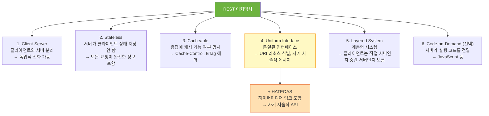
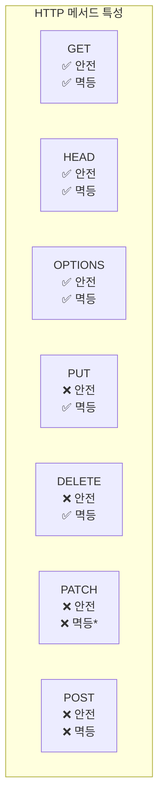

> GET /api/data는 REST가 아니다. REST는 URL에 동사를 쓰지 않고, 리소스를 명사로 표현하며, HTTP 메서드의 의미를 정확히 지킨다. 원칙과 실무를 함께 이해해야 '좋은 API'를 설계할 수 있다.

## 핵심 요약 (TL;DR)

**REST(REpresentational State Transfer)** 는 Roy Fielding이 2000년 박사 논문에서 제안한 웹 아키텍처 스타일이다. 핵심은 **리소스(Resource)** 를 URI로 식별하고, **HTTP 메서드**로 행위를 표현하며, **상태코드**로 결과를 전달하는 것이다. `GET /users/1` 은 RESTful하지만, `POST /getUser` 는 아니다. **멱등성(Idempotency)** 은 같은 요청을 여러 번 해도 결과가 동일한 속성이며, **HATEOAS**는 응답에 다음에 취할 수 있는 행동의 링크를 포함하는 REST의 완성형이다.

---

## REST의 6가지 제약 조건



**현실에서의 REST:** 완전한 REST(특히 HATEOAS)를 구현하는 API는 드물다. 대부분의 'RESTful API'는 REST 원칙의 부분 집합을 따르는 **HTTP API**다. Roy Fielding 본인도 이를 지적했다. 그러나 리소스 중심 URI, 올바른 HTTP 메서드 사용, 적절한 상태코드는 반드시 지켜야 한다.

---

## 리소스 URI 설계

### 핵심 규칙

```
✅ 명사 사용 (리소스 = 명사)
GET  /users              → 사용자 목록
GET  /users/1            → 사용자 1번
POST /users              → 사용자 생성
PUT  /users/1            → 사용자 1번 전체 수정
PATCH /users/1           → 사용자 1번 부분 수정
DELETE /users/1          → 사용자 1번 삭제

❌ 동사 사용 금지
GET  /getUsers           ← 동사 포함
POST /createUser         ← 동사 포함
GET  /deleteUser?id=1    ← GET으로 삭제

✅ 컬렉션은 복수명사
/users (O), /user (X)
/orders (O), /order (X)

✅ 계층 관계 표현
GET /users/1/orders          → 사용자 1의 주문 목록
GET /users/1/orders/5        → 사용자 1의 주문 5번
GET /orders/5/items          → 주문 5의 상품 목록
POST /users/1/addresses      → 사용자 1에게 주소 추가

✅ 소문자 + 하이픈
/product-categories (O)
/productCategories (X)
/product_categories (X)

✅ 버전 관리
/api/v1/users
/api/v2/users
```

### 계층이 깊어질 때

```
❌ 너무 깊은 중첩 (3단계 이상 피하기)
GET /users/1/orders/5/items/3/reviews   ← 복잡함

✅ 리소스를 독립적으로 설계
GET /reviews/7                          ← 리뷰 ID가 있으면 직접 접근
GET /orders/5/items                     ← 주문-상품 관계만
```

---

## HTTP 메서드 — 안전성과 멱등성



| 메서드 | 용도 | 안전 | 멱등 | 요청 Body | 응답 Body |
|--------|------|------|------|----------|----------|
| **GET** | 리소스 조회 | ✅ | ✅ | ❌ | ✅ |
| **POST** | 리소스 생성 / 행위 | ❌ | ❌ | ✅ | ✅ |
| **PUT** | 리소스 전체 대체 | ❌ | ✅ | ✅ | ✅ |
| **PATCH** | 리소스 부분 수정 | ❌ | △* | ✅ | ✅ |
| **DELETE** | 리소스 삭제 | ❌ | ✅ | △ | △ |
| **HEAD** | GET과 동일하나 Body 없음 | ✅ | ✅ | ❌ | ❌ |
| **OPTIONS** | 허용 메서드 확인 (CORS) | ✅ | ✅ | ❌ | ✅ |

**안전(Safe):** 서버 상태를 변경하지 않음
**멱등(Idempotent):** 같은 요청을 여러 번 해도 결과가 동일

```
멱등성 예시:

PUT /users/1 body: {"name": "꿀벌왕"}
→ 몇 번을 해도 결과는 동일 (id=1, name=꿀벌왕) ✅ 멱등

DELETE /users/1
→ 첫 번째: 200 OK (삭제 성공)
→ 두 번째: 404 Not Found (이미 없음)
→ 최종 상태는 동일 (없는 상태) ✅ 멱등

POST /users body: {"name": "꿀벌왕"}
→ 첫 번째: id=1 생성
→ 두 번째: id=2 생성 (다른 결과) ❌ 비멱등

*PATCH는 구현에 따라 멱등일 수도 있음:
  "이름을 꿀벌왕으로 설정" → 멱등
  "포인트를 100 증가" → 비멱등
```

---

## HTTP 상태코드 — 정확하게 쓰는 법

### 2xx — 성공

```
200 OK            : 조회(GET), 수정(PUT/PATCH), 행위(POST) 성공
201 Created       : 리소스 생성 성공 (POST) → Location 헤더에 새 URI 포함
204 No Content    : 성공했지만 반환할 본문 없음 (DELETE, 일부 PUT)
206 Partial Content : 범위 요청 성공 (대용량 파일 스트리밍)
```

### 4xx — 클라이언트 오류

```
400 Bad Request         : 요청 형식/값 오류 (유효성 검사 실패)
401 Unauthorized        : 인증 필요 (로그인 안 함)
403 Forbidden           : 인증됐지만 권한 없음
404 Not Found           : 리소스 없음
405 Method Not Allowed  : 지원하지 않는 HTTP 메서드
409 Conflict            : 리소스 충돌 (중복, 버전 불일치)
410 Gone                : 리소스 영구 삭제됨 (404와 달리 되살아나지 않음)
422 Unprocessable Entity: 요청 형식은 맞지만 비즈니스 로직 오류
429 Too Many Requests   : 속도 제한 초과
```

### 5xx — 서버 오류

```
500 Internal Server Error : 서버 처리 오류 (예기치 못한 예외)
502 Bad Gateway           : 프록시/게이트웨이 오류
503 Service Unavailable   : 서버 과부하 / 점검 중
504 Gateway Timeout       : 업스트림 서버 응답 시간 초과
```

### 상태코드 사용 실수 예시

```
❌ 잘못된 사용:
GET /users/999 → 200 OK + body: {"error": "사용자 없음"}
  (HTTP 레벨에서 성공이지만 실제는 실패 — 클라이언트 파싱 필요)

POST /users → 200 OK (생성 성공)
  (생성 성공은 201 Created + Location 헤더가 올바름)

✅ 올바른 사용:
GET /users/999 → 404 Not Found
POST /users → 201 Created + Location: /users/101
DELETE /users/1 → 204 No Content
```

---

## 코드 구현 — Spring Boot REST API

### 기본 CRUD API

```java
@RestController
@RequestMapping("/api/v1/products")
@RequiredArgsConstructor
public class ProductController {

    private final ProductService productService;

    // 목록 조회 — 페이징 + 필터링
    @GetMapping
    public ResponseEntity<ApiResponse<Page<ProductDto.Summary>>> getProducts(
            @RequestParam(required = false) String category,
            @RequestParam(required = false) BigDecimal minPrice,
            @PageableDefault(size = 20, sort = "createdAt", direction = Sort.Direction.DESC)
            Pageable pageable) {

        return ResponseEntity.ok(
                ApiResponse.ok(productService.getProducts(category, minPrice, pageable))
        );
    }

    // 단건 조회
    @GetMapping("/{id}")
    public ResponseEntity<ApiResponse<ProductDto.Response>> getProduct(
            @PathVariable Long id) {

        return ResponseEntity.ok(ApiResponse.ok(productService.getProduct(id)));
    }

    // 생성 — 201 + Location 헤더
    @PostMapping
    public ResponseEntity<ApiResponse<ProductDto.Response>> createProduct(
            @Valid @RequestBody ProductDto.CreateRequest request,
            UriComponentsBuilder uriBuilder) {

        ProductDto.Response response = productService.createProduct(request);

        URI location = uriBuilder
                .path("/api/v1/products/{id}")
                .buildAndExpand(response.id())
                .toUri();

        return ResponseEntity
                .created(location)  // 201 + Location 헤더 자동 설정
                .body(ApiResponse.ok("상품이 등록되었습니다", response));
    }

    // 전체 수정 (PUT) — 멱등
    @PutMapping("/{id}")
    public ResponseEntity<ApiResponse<ProductDto.Response>> replaceProduct(
            @PathVariable Long id,
            @Valid @RequestBody ProductDto.ReplaceRequest request) {

        return ResponseEntity.ok(
                ApiResponse.ok(productService.replaceProduct(id, request))
        );
    }

    // 부분 수정 (PATCH)
    @PatchMapping("/{id}")
    public ResponseEntity<ApiResponse<ProductDto.Response>> updateProduct(
            @PathVariable Long id,
            @RequestBody ProductDto.UpdateRequest request) {

        return ResponseEntity.ok(
                ApiResponse.ok(productService.updateProduct(id, request))
        );
    }

    // 삭제 — 204 No Content
    @DeleteMapping("/{id}")
    public ResponseEntity<Void> deleteProduct(@PathVariable Long id) {
        productService.deleteProduct(id);
        return ResponseEntity.noContent().build();  // 204
    }
}
```

### API 버전 관리 전략

```java
// 전략 1: URI 버전 (가장 일반적)
@RequestMapping("/api/v1/products")  // v1
@RequestMapping("/api/v2/products")  // v2 (새 기능 추가)

// 전략 2: 헤더 버전
@GetMapping(headers = "X-API-Version=1")
public ProductV1Response getProductV1() { ... }

@GetMapping(headers = "X-API-Version=2")
public ProductV2Response getProductV2() { ... }

// 전략 3: Accept 헤더 (콘텐츠 협상)
@GetMapping(produces = "application/vnd.honeybarrel.v1+json")
public ProductV1Response getProductV1() { ... }
```

```
버전 전략 비교:
URI 버전   : 가시적, 브라우저 캐싱 용이, URL이 더러워짐
헤더 버전  : 깔끔한 URL, 브라우저 직접 테스트 어려움
Accept 헤더: RFC 표준에 가장 가까움, 구현 복잡

실무 권장: URI 버전 (/api/v1/, /api/v2/)
- 명시적이고 디버깅 쉬움
- Swagger/OpenAPI 문서화 용이
```

---

## HATEOAS — REST의 완성형

**HATEOAS(Hypermedia As The Engine Of Application State):** API 응답에 다음에 취할 수 있는 행동의 링크를 포함한다. 클라이언트가 API 구조를 미리 알 필요 없이 응답에 포함된 링크를 따라갈 수 있다.

```json
// HATEOAS 없는 응답
{
  "id": 1,
  "name": "아카시아 꿀 500g",
  "price": 25000,
  "stock": 50
}
// 클라이언트는 주문하거나 리뷰를 보려면 API 명세를 알아야 함

// HATEOAS 있는 응답
{
  "id": 1,
  "name": "아카시아 꿀 500g",
  "price": 25000,
  "stock": 50,
  "_links": {
    "self":    { "href": "/api/v1/products/1",         "method": "GET" },
    "update":  { "href": "/api/v1/products/1",         "method": "PUT" },
    "delete":  { "href": "/api/v1/products/1",         "method": "DELETE" },
    "order":   { "href": "/api/v1/orders",             "method": "POST" },
    "reviews": { "href": "/api/v1/products/1/reviews", "method": "GET" }
  }
}
// 클라이언트는 응답 링크만 보고 다음 행동을 결정할 수 있음
```

### Spring HATEOAS 구현

```java
// build.gradle.kts
// implementation("org.springframework.boot:spring-boot-starter-hateoas")

import org.springframework.hateoas.EntityModel;
import org.springframework.hateoas.server.mvc.WebMvcLinkBuilder;

@RestController
@RequestMapping("/api/v1/products")
@RequiredArgsConstructor
public class ProductHateoasController {

    private final ProductService productService;

    @GetMapping("/{id}")
    public ResponseEntity<EntityModel<ProductDto.Response>> getProduct(
            @PathVariable Long id) {

        ProductDto.Response product = productService.getProduct(id);

        EntityModel<ProductDto.Response> model = EntityModel.of(product,
                WebMvcLinkBuilder.linkTo(
                        WebMvcLinkBuilder.methodOn(ProductHateoasController.class).getProduct(id)
                ).withSelfRel(),
                WebMvcLinkBuilder.linkTo(
                        WebMvcLinkBuilder.methodOn(ProductHateoasController.class).deleteProduct(id)
                ).withRel("delete"),
                WebMvcLinkBuilder.linkTo(
                        WebMvcLinkBuilder.methodOn(OrderController.class).createOrder(null)
                ).withRel("order")
        );

        return ResponseEntity.ok(model);
    }
}
```

---

## 실무 적용 — 공통 응답 형식과 페이징

```java
// 공통 API 응답 래퍼 (Part 1에서 구현한 ApiResponse 확장)
public record ApiResponse<T>(
        boolean success,
        String message,
        T data,
        PageInfo pageInfo,         // 페이징 응답에만 포함
        List<String> errors,       // 검증 실패 시만 포함
        LocalDateTime timestamp
) {
    // 단건 응답
    public static <T> ApiResponse<T> ok(T data) { ... }

    // 페이징 응답
    public static <T> ApiResponse<Page<T>> page(Page<T> page) {
        return new ApiResponse<>(true, null, page,
                PageInfo.of(page), null, LocalDateTime.now());
    }
}

// 페이징 메타 정보
public record PageInfo(
        int page,        // 현재 페이지 (0-based)
        int size,        // 페이지 크기
        long totalElements,
        int totalPages,
        boolean first,
        boolean last
) {
    public static <T> PageInfo of(Page<T> page) {
        return new PageInfo(
                page.getNumber(), page.getSize(),
                page.getTotalElements(), page.getTotalPages(),
                page.isFirst(), page.isLast()
        );
    }
}
```

### 실무 API 응답 예시

```json
// GET /api/v1/products?category=honey&page=0&size=3
{
  "success": true,
  "data": [
    { "id": 1, "name": "아카시아 꿀 500g", "price": 25000 },
    { "id": 2, "name": "밤꿀 500g",       "price": 28000 },
    { "id": 3, "name": "유채꿀 500g",     "price": 23000 }
  ],
  "pageInfo": {
    "page": 0,
    "size": 3,
    "totalElements": 15,
    "totalPages": 5,
    "first": true,
    "last": false
  },
  "timestamp": "2026-04-14T10:30:00"
}

// POST /api/v1/products — 검증 실패
// HTTP 400 Bad Request
{
  "success": false,
  "message": "입력값 검증 실패",
  "errors": [
    { "field": "name",  "message": "상품명은 필수입니다",   "rejectedValue": "" },
    { "field": "price", "message": "가격은 0보다 커야 합니다", "rejectedValue": -1 }
  ],
  "timestamp": "2026-04-14T10:30:01"
}
```

---

## Deep Dive: HTTP 캐싱 — REST의 Cacheable 제약

```java
// ETag — 조건부 요청으로 불필요한 데이터 전송 방지
@GetMapping("/{id}")
public ResponseEntity<ProductDto.Response> getProduct(
        @PathVariable Long id,
        @RequestHeader(value = "If-None-Match", required = false) String ifNoneMatch) {

    ProductDto.Response product = productService.getProduct(id);
    String etag = "\"" + product.hashCode() + "\"";

    if (etag.equals(ifNoneMatch)) {
        return ResponseEntity.status(HttpStatus.NOT_MODIFIED).build();  // 304
        // 클라이언트는 캐시된 데이터를 그대로 사용
    }

    return ResponseEntity.ok()
            .eTag(etag)                                    // ETag 응답 헤더
            .cacheControl(CacheControl.maxAge(60, TimeUnit.SECONDS))  // 60초 캐시
            .body(product);
}

// Cache-Control 전략:
// public  : CDN/프록시 캐싱 허용
// private : 브라우저만 캐싱 (개인 데이터)
// no-cache: 캐시는 하지만 서버 검증 필수
// no-store: 캐싱 완전 금지 (민감 데이터)
// max-age : 초 단위 캐시 유효기간
```

---

## 장애 사례 — API 설계 실수

```
사례 1: POST로 조회 — 보안 감사 실패
  POST /api/getUserInfo body: {"id": 1}
  → GET이 URL 파라미터로 민감 정보 노출이 걱정된다는 이유로 POST 사용
  → 문제: 로그(access log)에 body는 기록 안 되므로 감사 추적 불가
  → 해결: HTTPS + GET 사용, 민감 ID는 UUID 사용

사례 2: DELETE에 200 대신 204 미사용
  DELETE /users/1 → 200 OK + body: {"deleted": true}
  → 클라이언트가 불필요한 body 파싱
  → 해결: 204 No Content 반환

사례 3: 에러를 200으로 감싸기
  POST /orders → 200 OK + body: {"success": false, "msg": "재고 없음"}
  → HTTP 레벨에서 성공이므로 모니터링/알림 시스템이 오류 감지 못함
  → 해결: 409 Conflict 반환

사례 4: 버전 없는 API 배포
  /api/products에 필드 제거 → 기존 클라이언트 장애
  → 해결: /api/v1/ 유지, /api/v2/ 신규 배포, v1 deprecation 기간 운영
```

---

## 면접 Q&A

| 레벨 | 질문 | 핵심 답변 |
|------|------|----------|
| 🟢 기초 | REST와 RESTful API의 차이는? | REST는 아키텍처 스타일(6가지 제약), RESTful은 이를 준수하는 API. 현실에서는 대부분 부분적으로만 REST 준수 |
| 🟡 중급 | PUT과 PATCH의 차이와 각각의 멱등성을 설명하라 | PUT은 리소스 전체 대체 (멱등), PATCH는 부분 수정. PATCH는 "값을 X로 설정"이면 멱등, "값을 N 증가"이면 비멱등 |
| 🟡 중급 | 409 Conflict는 언제 사용하는가? | 리소스가 현재 상태와 충돌할 때 — 중복 이메일 가입, 재고 없는 주문, 낙관적 락 버전 불일치 |
| 🔴 심화 | HATEOAS를 실제 프로젝트에서 도입하지 않는 이유는? | 클라이언트가 링크를 동적으로 파싱하고 따라가는 코드 구현 복잡. 대부분의 API는 클라이언트-서버가 협의된 명세를 따르므로 HATEOAS 오버헤드가 이익보다 큼. API Gateway + OpenAPI 명세로 대체 가능 |
| 🔴 시니어 | HTTP 캐싱(ETag, Last-Modified)을 REST API에 올바르게 적용하는 방법은? | ETag는 응답 본문 해시로 조건부 요청(If-None-Match) 처리 → 304 Not Modified로 대역폭 절약. Last-Modified는 타임스탬프 기반. Cache-Control: public은 CDN 캐시, private는 브라우저 전용. 개인/인증 데이터는 no-store 필수 |

---

## 정리

| 항목 | 설명 |
|------|------|
| **핵심 키워드** | REST 6제약, 리소스 URI, HTTP 메서드(안전/멱등), 상태코드(2xx/4xx/5xx), HATEOAS, API 버전 관리, ETag, Cache-Control |
| **연관 개념** | HTTP/HTTPS, TLS, CORS, OAuth2, OpenAPI/Swagger, GraphQL, gRPC |
| **실무 결정** | URI 버전 관리, 204 삭제, 201+Location 생성, 공통 응답 래퍼, ETag 캐싱 |

---

## 레퍼런스

### 영상
- [The REST API Handbook — freeCodeCamp](https://www.freecodecamp.org/news/build-consume-and-document-a-rest-api/) — REST API 구축·테스트·문서화 완전 가이드
- [쉬운코드 (@ezcd)](https://www.youtube.com/@ezcd) — 시니어 개발자의 DB/API 설계 실무 강의

### 문서 & 기사
- [Web API Design Best Practices — Microsoft Azure](https://learn.microsoft.com/en-us/azure/architecture/best-practices/api-design) — 마이크로소프트 REST API 설계 공식 가이드
- [HATEOAS: Building Self-Documenting REST APIs (2025)](https://pradeepl.com/blog/rest/hateoas/) — HATEOAS 실전 가이드 (2025)
- [HTTP Methods — REST API Tutorial](https://www.restapitutorial.com/introduction/httpmethods) — HTTP 메서드별 안전성/멱등성 완전 정리
- [Roy Fielding's Dissertation — Chapter 5: REST](https://ics.uci.edu/~fielding/pubs/dissertation/rest_arch_style.htm) — REST 원본 논문

---

*이 포스트는 [HoneyByte](https://blog.honeybarrel.co.kr) CS Study 시리즈의 일부입니다.*
