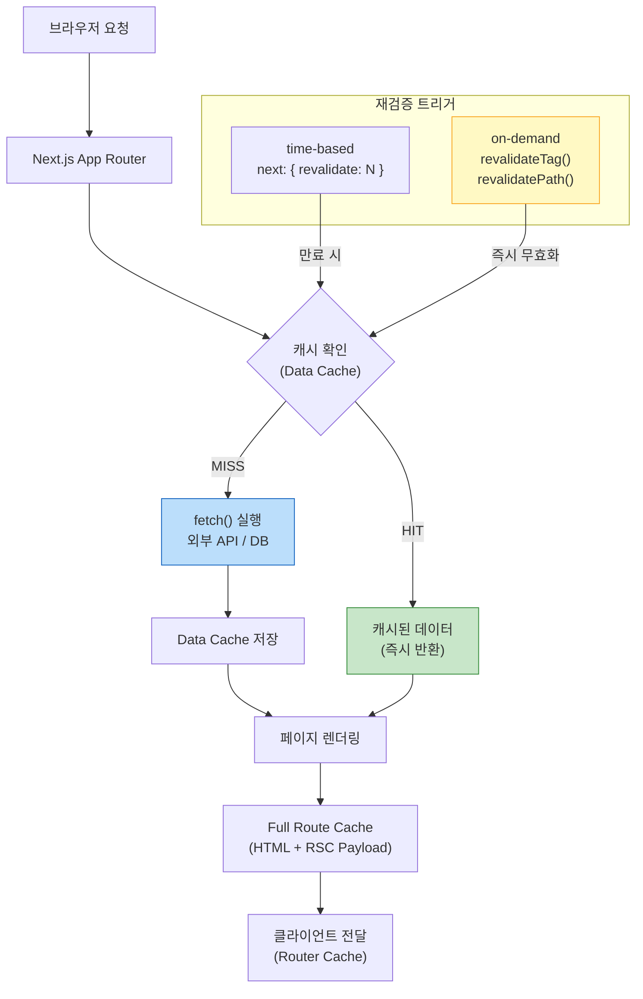
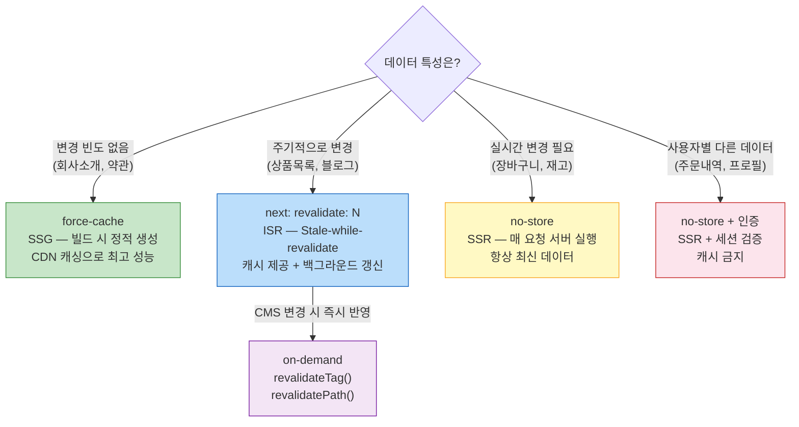

> Next.js 15에서 `fetch`를 쓴다는 건 단순한 HTTP 요청이 아니다. 캐싱 전략을 선언하고, 렌더링 방식(SSG/SSR/ISR)을 결정하며, `revalidateTag`로 정밀하게 캐시를 무효화한다. 이 레이어를 이해하지 않으면 "왜 데이터가 안 바뀌지?"라는 디버깅 지옥에 빠진다.

## 핵심 요약 (TL;DR)

Next.js는 Web `fetch()` API를 확장하여 **서버 컴포넌트에서 캐싱 전략을 선언적으로 지정**할 수 있게 한다. `cache: 'force-cache'`(SSG), `cache: 'no-store'`(SSR), `next: { revalidate: N }`(ISR)으로 요청마다 다른 전략을 쓸 수 있다. **Server Actions**는 서버 함수를 클라이언트에서 직접 호출하는 RPC 패턴으로, API 라우트 없이 폼 처리·DB 뮤테이션이 가능하다. **Streaming + Suspense**로 느린 데이터가 있어도 빠른 부분 먼저 응답한다.

---

## Next.js 데이터 흐름 전체 그림



**Next.js의 4개 캐시 레이어:**

| 레이어 | 위치 | 저장 내용 | 무효화 |
|--------|------|----------|--------|
| **Request Memoization** | 서버 (요청 단위) | 동일 fetch() 중복 제거 | 요청 완료 시 자동 |
| **Data Cache** | 서버 (영구) | fetch 응답 데이터 | `revalidateTag`, `revalidatePath`, `revalidate` 시간 |
| **Full Route Cache** | 서버 (영구) | 렌더링된 HTML + RSC Payload | Data Cache 재검증 시 |
| **Router Cache** | 클라이언트 | RSC Payload (네비게이션용) | 탭 닫기, `router.refresh()` |

---

## fetch 캐싱 전략 — SSG / SSR / ISR

```typescript
// ── SSG (Static Site Generation) — 빌드 시 한 번만 페칭 ──
// cache: 'force-cache' 가 기본값 (Next.js 14 이하)
// Next.js 15: 기본값이 no-store로 변경됨 → 명시 권장
const staticData = await fetch('https://api.honeybarrel.co.kr/config', {
  cache: 'force-cache',
})

// ── SSR (Server-Side Rendering) — 매 요청마다 페칭 ──────
const dynamicData = await fetch('https://api.honeybarrel.co.kr/cart', {
  cache: 'no-store',  // 또는 next: { revalidate: 0 }
})

// ── ISR (Incremental Static Regeneration) — N초마다 재검증 ─
const isr5min = await fetch('https://api.honeybarrel.co.kr/products', {
  next: { revalidate: 300 },  // 5분마다 백그라운드 재생성
})

// ── 태그 기반 캐싱 — on-demand 재검증을 위해 ──────────────
const tagged = await fetch('https://api.honeybarrel.co.kr/products', {
  next: {
    revalidate: 3600,
    tags: ['products'],         // 태그로 정밀 무효화 가능
  },
})
```

### 렌더링 전략 비교

```
빌드 출력 예시 (npm run build):
┌ ○ /                    → force-cache만 사용 → Static (SSG)
├ ƒ /cart                → no-store 사용 → Dynamic (SSR)
├ ○ /products            → revalidate: 300 → Static + ISR
└ ƒ /products/[id]       → 동적 세그먼트 → Dynamic

○ Static  : HTML을 CDN에 캐싱. 가장 빠름
ƒ Dynamic : 매 요청 서버 실행. 실시간 데이터 필요 시
ISR       : 캐시 제공 + 백그라운드 갱신 = 빠르고 최신
```

---

## unstable_cache — DB 쿼리 캐싱

`fetch`가 아닌 DB 직접 쿼리나 ORM은 `unstable_cache`로 캐싱한다.

```typescript
// src/lib/queries/products.ts
import { unstable_cache } from 'next/cache'
import { db } from '@/lib/db'

// 태그 + TTL로 캐싱된 DB 쿼리
export const getCachedProducts = unstable_cache(
  async (category?: string) => {
    // Drizzle ORM / Prisma 쿼리 — 결과가 캐싱됨
    return await db.query.products.findMany({
      where: category ? { category } : undefined,
      orderBy: { createdAt: 'desc' },
    })
  },
  ['products-list'],           // 캐시 키 (배열)
  {
    revalidate: 300,           // 5분 TTL
    tags: ['products'],        // revalidateTag('products')로 무효화
  }
)

// 단건 조회도 캐싱
export const getCachedProduct = unstable_cache(
  async (id: number) => {
    return await db.query.products.findFirst({
      where: { id },
      with: { reviews: true },
    })
  },
  ['product-detail'],
  {
    revalidate: 600,           // 10분
    tags: ['products', `product-${String}`],  // 개별 무효화 가능
  }
)
```

---

## Server Actions — API 없는 서버 뮤테이션

**Server Actions** 는 서버에서 실행되는 비동기 함수를 클라이언트에서 직접 호출하는 패턴이다. `'use server'` 지시어로 선언하며, 폼 제출·데이터 변경에 사용한다.

```typescript
// src/app/actions/product-actions.ts
'use server'  // 이 파일의 모든 export는 Server Action

import { revalidatePath, revalidateTag } from 'next/cache'
import { redirect } from 'next/navigation'
import { db } from '@/lib/db'
import { z } from 'zod'

// ── 입력 검증 스키마 ──────────────────────────────────────
const CreateProductSchema = z.object({
  name: z.string().min(1, '상품명은 필수입니다').max(100),
  price: z.coerce.number().positive('가격은 양수여야 합니다'),
  category: z.string().min(1),
  description: z.string().optional(),
})

export type CreateProductState = {
  errors?: Record<string, string[]>
  message?: string
  success?: boolean
}

// ── 상품 생성 Action ───────────────────────────────────────
export async function createProduct(
  prevState: CreateProductState,
  formData: FormData,
): Promise<CreateProductState> {
  // 1. 입력 검증
  const parsed = CreateProductSchema.safeParse({
    name: formData.get('name'),
    price: formData.get('price'),
    category: formData.get('category'),
    description: formData.get('description'),
  })

  if (!parsed.success) {
    return {
      errors: parsed.error.flatten().fieldErrors,
      message: '입력값을 확인해주세요',
    }
  }

  // 2. DB 저장
  try {
    await db.insert(products).values(parsed.data)
  } catch (error) {
    return { message: 'DB 저장 실패. 잠시 후 다시 시도해주세요.' }
  }

  // 3. 캐시 무효화 — 상품 목록과 관련된 모든 캐시 갱신
  revalidateTag('products')           // unstable_cache 태그 무효화
  revalidatePath('/products')         // 경로 캐시 무효화
  revalidatePath('/admin/products')   // 관리자 목록도 갱신

  return { success: true, message: '상품이 등록되었습니다' }
}

// ── 상품 삭제 Action ───────────────────────────────────────
export async function deleteProduct(id: number): Promise<void> {
  await db.delete(products).where({ id })

  revalidateTag('products')
  revalidatePath('/products')
  redirect('/products')  // 삭제 후 목록으로 이동
}

// ── 장바구니 추가 Action (낙관적 업데이트와 함께) ──────────
export async function addToCart(productId: number, quantity: number) {
  // 서버에서 실행 — 인증 토큰 검증 가능 (쿠키 접근)
  const session = await getServerSession()
  if (!session) throw new Error('로그인이 필요합니다')

  await db.insert(cartItems).values({
    userId: session.user.id,
    productId,
    quantity,
  })

  revalidatePath('/cart')
}
```

### Server Action 클라이언트에서 사용

```tsx
// src/components/CreateProductForm.tsx
'use client'

import { useActionState, useTransition } from 'react'
import { createProduct, type CreateProductState } from '@/app/actions/product-actions'

const initialState: CreateProductState = {}

export function CreateProductForm() {
  // useActionState: 액션의 반환값(state)을 추적
  const [state, formAction, isPending] = useActionState(createProduct, initialState)

  return (
    <form action={formAction} className="space-y-4">
      {/* 상품명 */}
      <div>
        <label className="block text-sm font-medium mb-1">상품명</label>
        <input
          name="name"
          type="text"
          className="w-full border rounded-lg px-3 py-2"
          placeholder="아카시아 꿀 500g"
        />
        {state.errors?.name && (
          <p className="text-red-500 text-sm mt-1">{state.errors.name[0]}</p>
        )}
      </div>

      {/* 가격 */}
      <div>
        <label className="block text-sm font-medium mb-1">가격 (원)</label>
        <input
          name="price"
          type="number"
          className="w-full border rounded-lg px-3 py-2"
          placeholder="25000"
        />
        {state.errors?.price && (
          <p className="text-red-500 text-sm mt-1">{state.errors.price[0]}</p>
        )}
      </div>

      {/* 카테고리 */}
      <div>
        <label className="block text-sm font-medium mb-1">카테고리</label>
        <select name="category" className="w-full border rounded-lg px-3 py-2">
          <option value="honey">꿀</option>
          <option value="propolis">프로폴리스</option>
          <option value="beeswax">밀랍</option>
        </select>
      </div>

      {/* 성공/에러 메시지 */}
      {state.message && (
        <p className={`text-sm ${state.success ? 'text-green-600' : 'text-red-500'}`}>
          {state.message}
        </p>
      )}

      <button
        type="submit"
        disabled={isPending}
        className="w-full bg-amber-400 text-amber-900 py-2 rounded-lg font-semibold
                   hover:bg-amber-500 disabled:opacity-50 disabled:cursor-not-allowed"
      >
        {isPending ? '등록 중...' : '상품 등록'}
      </button>
    </form>
  )
}
```

---

## Streaming + Suspense — 느린 데이터가 있어도 빠르게

**문제:** 상품 목록(빠름) + 추천 상품(느림, ML API) + 리뷰(보통) → 모두 기다리면 느림

**해결:** Suspense로 각 부분을 독립적으로 스트리밍

```tsx
// src/app/products/[id]/page.tsx
import { Suspense } from 'react'
import { ProductInfo } from '@/components/ProductInfo'
import { ProductReviews } from '@/components/ProductReviews'
import { RelatedProducts } from '@/components/RelatedProducts'

export default async function ProductPage({
  params,
}: {
  params: Promise<{ id: string }>
}) {
  const { id } = await params

  return (
    <div className="grid grid-cols-1 lg:grid-cols-3 gap-8">

      {/* 메인 상품 정보 — 빠름, Suspense 없어도 됨 */}
      <div className="lg:col-span-2">
        <Suspense fallback={<ProductInfoSkeleton />}>
          <ProductInfo productId={Number(id)} />
        </Suspense>
      </div>

      {/* 사이드바 */}
      <div className="space-y-6">
        {/* 리뷰 — 중간 속도, 별도 스트림 */}
        <Suspense fallback={<ReviewsSkeleton />}>
          <ProductReviews productId={Number(id)} />
        </Suspense>

        {/* 추천 상품 — ML API 느림, 가장 나중에 표시 */}
        <Suspense fallback={<RelatedSkeleton />}>
          <RelatedProducts productId={Number(id)} />
        </Suspense>
      </div>

    </div>
  )
}

// 각 컴포넌트가 독립적으로 데이터 페칭
// ProductInfo: 100ms → 먼저 표시
// ProductReviews: 300ms → 두 번째 표시
// RelatedProducts: 800ms (ML API) → 마지막 표시

async function ProductInfoSkeleton() {
  return (
    <div className="animate-pulse space-y-4">
      <div className="aspect-square bg-gray-200 rounded-xl" />
      <div className="h-8 bg-gray-200 rounded w-3/4" />
      <div className="h-6 bg-gray-200 rounded w-1/3" />
    </div>
  )
}
```

### 스트리밍 서버 컴포넌트 구현

```tsx
// src/components/RelatedProducts.tsx
// 이 컴포넌트만 느린 ML API를 기다림 — 나머지 UI 블로킹 없음
export async function RelatedProducts({ productId }: { productId: number }) {
  // 800ms짜리 ML 추천 API — 이 컴포넌트만 기다림
  const related = await fetch(
    `https://ml.honeybarrel.co.kr/recommendations/${productId}`,
    { next: { revalidate: 3600, tags: [`related-${productId}`] } }
  ).then(r => r.json())

  return (
    <section>
      <h3 className="font-bold mb-3">이런 상품도 좋아요</h3>
      <ul className="space-y-2">
        {related.map((item: { id: number; name: string; price: number }) => (
          <li key={item.id} className="flex justify-between text-sm">
            <a href={`/products/${item.id}`} className="hover:underline">
              {item.name}
            </a>
            <span className="text-amber-600 font-medium">
              {item.price.toLocaleString()}원
            </span>
          </li>
        ))}
      </ul>
    </section>
  )
}
```

---

## Request Memoization — 중복 fetch 자동 제거

같은 URL을 여러 컴포넌트에서 호출해도 **하나의 요청**만 실행된다.

```tsx
// 레이아웃, 헤더, 페이지가 각각 같은 사용자 정보를 조회
// → 실제 HTTP 요청은 단 1번만 실행됨

// app/layout.tsx
export default async function Layout() {
  const user = await getUser()  // fetch('/api/me')
  // ...
}

// app/(components)/Header.tsx
export async function Header() {
  const user = await getUser()  // ← 동일 URL: 캐시에서 반환 (메모이제이션)
  // ...
}

// app/page.tsx
export default async function Page() {
  const user = await getUser()  // ← 역시 메모이제이션
  // ...
}

// 데이터 페칭 함수
async function getUser() {
  // Next.js가 이 함수의 fetch를 요청 단위로 메모이제이션
  const res = await fetch('/api/me', { cache: 'no-store' })
  return res.json()
}
// 세 컴포넌트에서 3번 호출했지만 실제 네트워크 요청은 1번!
```

---

## on-demand 재검증 — 관리자 패널 패턴

```typescript
// src/app/api/revalidate/route.ts
// 외부 시스템(CMS, 웹훅)에서 캐시를 즉시 무효화
import { revalidateTag, revalidatePath } from 'next/cache'
import { NextRequest, NextResponse } from 'next/server'

export async function POST(request: NextRequest) {
  // 웹훅 시크릿 검증
  const secret = request.headers.get('x-revalidate-secret')
  if (secret !== process.env.REVALIDATE_SECRET) {
    return NextResponse.json({ error: 'Unauthorized' }, { status: 401 })
  }

  const { tag, path } = await request.json()

  if (tag) {
    revalidateTag(tag)       // 특정 태그의 모든 캐시 무효화
  }
  if (path) {
    revalidatePath(path)     // 특정 경로 캐시 무효화
  }

  return NextResponse.json({ revalidated: true, timestamp: Date.now() })
}

// 사용: Shopify, Contentful 등 CMS에서 상품 변경 시 웹훅 발송
// curl -X POST https://honeybarrel.co.kr/api/revalidate \
//   -H "x-revalidate-secret: $SECRET" \
//   -d '{"tag": "products"}'
```

---

## 캐시 전략 선택 가이드



---

## 실무 트레이드오프 & 주의사항

```
⚠️ Next.js 15 변경사항:
  fetch 기본값이 'no-store'로 변경됨 (14: force-cache)
  → 기존 14 코드 마이그레이션 시 캐싱 의도 명시 필수

⚠️ Server Action 주의:
  - 'use server' 파일의 모든 export가 공개 엔드포인트
  - 반드시 서버 측 인증·권한 검증 필요 (클라이언트 검증만 믿으면 위험)
  - 민감 데이터를 action 인자로 받지 말 것

⚠️ unstable_cache:
  - 이름에 'unstable'이지만 실무에서 안정적으로 사용됨
  - Next.js 16에서 'use cache' 지시어로 대체 예정

✅ Streaming 모범 사례:
  - 빠른 데이터(레이아웃, 핵심 UI)는 Suspense 밖에
  - 느린 데이터(추천, 댓글)는 Suspense 안에 격리
  - 항상 의미있는 fallback UI (스켈레톤) 제공
```

---

## 시리즈 안내

| Part | 주제 | 상태 |
|------|------|------|
| Part 1 | App Router 시작하기 | ✅ 완료 |
| **Part 2** | **데이터 페칭과 캐싱** | 현재 글 |
| Part 3 | Server Actions 심화 | 예정 |
| Part 4 | 인증과 미들웨어 | 예정 |
| Part 5 | 성능 최적화 | 예정 |
| Part 6 | 배포와 운영 | 예정 |

---

## 레퍼런스

### 공식 문서
- [Data Fetching: Caching and Revalidating — Next.js](https://nextjs.org/docs/app/getting-started/caching-and-revalidating) — 공식 캐싱 가이드 (2026-04-10 업데이트)
- [Functions: fetch — Next.js](https://nextjs.org/docs/app/api-reference/functions/fetch) — fetch 확장 API 레퍼런스
- [Guides: ISR — Next.js](https://nextjs.org/docs/app/guides/incremental-static-regeneration) — ISR + unstable_cache 공식 가이드
- [Functions: revalidateTag — Next.js](https://nextjs.org/docs/app/api-reference/functions/revalidateTag) — on-demand 재검증 API

---

*이 포스트는 [HoneyByte](https://blog.honeybarrel.co.kr) Next.js Deep Dive 시리즈의 일부입니다.*
