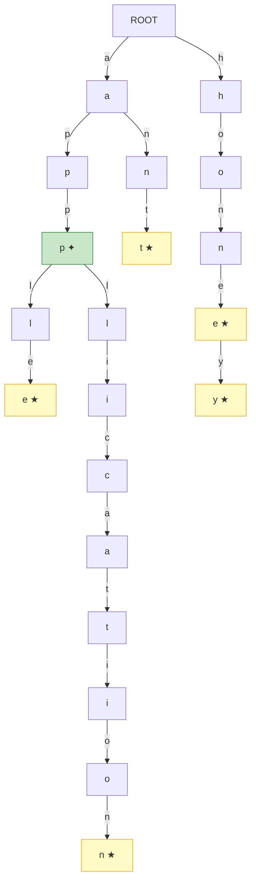
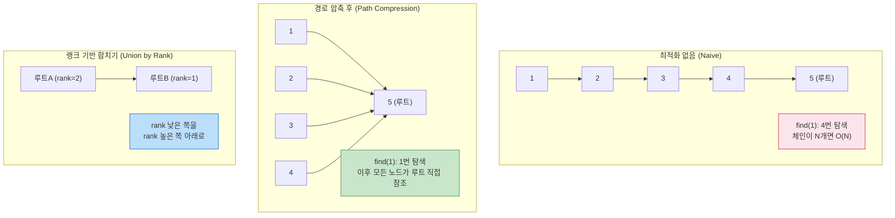

> 검색창에 "ap"를 치면 "apple", "application", "apt"가 뜬다. 이 자동완성 뒤에는 **트라이(Trie)** 가 있다. 소셜 네트워크에서 두 사람이 같은 그룹인지 O(α(N))에 판별하는 **유니온-파인드(Union-Find)** — 두 자료구조는 적용 도메인이 전혀 다르지만, 둘 다 특정 문제를 극적으로 최적화하기 위해 설계된 정밀 도구다.

## 핵심 요약 (TL;DR)

**트라이(Trie, Prefix Tree):** 문자열 집합을 트리 형태로 저장. 각 노드가 한 글자를 표현. 삽입·검색·접두사 확인이 모두 **O(L)** (L = 문자열 길이). 해시맵 검색이 O(L) 충돌 시 더 느려질 수 있는 반면 트라이는 최악에도 O(L) 보장.

**유니온-파인드(Union-Find, Disjoint Set Union):** 서로소 집합들을 관리. `union(a, b)` 로 두 집합을 합치고, `find(a)` 로 루트(대표자) 탐색. **경로 압축(Path Compression)** + **랭크 기반 합치기(Union by Rank)** 두 최적화를 같이 쓰면 연산당 **O(α(N))** — 아커만 역함수, 사실상 상수.

---

## 파트 1: 트라이 (Trie)

### 구조 시각화



> ★ = 단어 끝(is_end=True) / ✦ = 접두사 노드

**트라이의 핵심 아이디어:** 공통 접두사를 공유한다. `honey`와 `hone`은 `h-o-n-e`를 공유하므로 노드 4개를 절약한다. 단어 n개를 배열로 저장하면 접두사 검색이 O(N·L)이지만, 트라이는 O(L)이다.

---

### Python 구현

```python
from __future__ import annotations
from typing import Optional
import collections


class TrieNode:
    """트라이 노드 — 자식 노드 맵 + 단어 끝 표시"""
    __slots__ = ('children', 'is_end', 'count')

    def __init__(self):
        self.children: dict[str, TrieNode] = {}
        self.is_end: bool = False
        self.count: int = 0  # 이 접두사를 가진 단어 수 (자동완성 우선순위)


class Trie:
    """
    접두사 트리 (Trie / Prefix Tree)

    Operations:
        insert  : O(L)
        search  : O(L)
        startswith: O(L)
        delete  : O(L)
        autocomplete: O(L + K) — L:접두사 길이, K:결과 수

    Space: O(N * L * ALPHABET_SIZE) 최악 (N:단어 수, L:평균 길이)
    """

    def __init__(self):
        self.root = TrieNode()

    def insert(self, word: str) -> None:
        """단어 삽입 — O(L)"""
        node = self.root
        for ch in word:
            if ch not in node.children:
                node.children[ch] = TrieNode()
            node = node.children[ch]
            node.count += 1
        node.is_end = True

    def search(self, word: str) -> bool:
        """단어 존재 여부 — O(L)"""
        node = self._traverse(word)
        return node is not None and node.is_end

    def starts_with(self, prefix: str) -> bool:
        """접두사 존재 여부 — O(L)"""
        return self._traverse(prefix) is not None

    def delete(self, word: str) -> bool:
        """단어 삭제 — O(L) (재귀 후위 순회로 불필요 노드 제거)"""
        def _delete(node: TrieNode, word: str, depth: int) -> bool:
            if depth == len(word):
                if not node.is_end:
                    return False  # 단어가 없음
                node.is_end = False
                return len(node.children) == 0  # 자식 없으면 삭제 가능

            ch = word[depth]
            if ch not in node.children:
                return False
            should_delete = _delete(node.children[ch], word, depth + 1)
            if should_delete:
                del node.children[ch]
                node.count -= 1
                return not node.is_end and len(node.children) == 0
            node.count -= 1
            return False

        return _delete(self.root, word, 0)

    def autocomplete(self, prefix: str, limit: int = 10) -> list[str]:
        """
        접두사로 시작하는 단어 목록 반환 (count 내림차순)
        O(L + K) — L:접두사, K:결과 수
        """
        node = self._traverse(prefix)
        if node is None:
            return []

        results: list[tuple[int, str]] = []

        def dfs(cur: TrieNode, path: str) -> None:
            if len(results) >= limit:
                return
            if cur.is_end:
                results.append((cur.count, path))
            for ch, child in sorted(cur.children.items()):
                dfs(child, path + ch)

        dfs(node, prefix)
        results.sort(key=lambda x: -x[0])
        return [word for _, word in results]

    def _traverse(self, s: str) -> Optional[TrieNode]:
        node = self.root
        for ch in s:
            if ch not in node.children:
                return None
            node = node.children[ch]
        return node


# ── 실행 예시 ────────────────────────────────────────────────
if __name__ == '__main__':
    trie = Trie()

    words = ['apple', 'app', 'application', 'apply', 'apt', 'ant',
             'honey', 'hone', 'honest', 'honesty', 'hang']
    for w in words:
        trie.insert(w)

    print("=== 검색 ===")
    print(f"search('apple') = {trie.search('apple')}")    # True
    print(f"search('appl')  = {trie.search('appl')}")     # False (접두사만)
    print(f"starts_with('app') = {trie.starts_with('app')}")  # True

    print("\n=== 자동완성 ===")
    print(f"autocomplete('app') = {trie.autocomplete('app')}")
    print(f"autocomplete('hon') = {trie.autocomplete('hon')}")

    print("\n=== 삭제 ===")
    trie.delete('apple')
    print(f"search('apple') after delete = {trie.search('apple')}")  # False
    print(f"search('app') after delete   = {trie.search('app')}")    # True (공유 노드 유지)
```

### Java 구현

```java
import java.util.*;

public class Trie {

    private static class TrieNode {
        Map<Character, TrieNode> children = new HashMap<>();
        boolean isEnd = false;
        int count = 0;  // 이 접두사를 공유하는 단어 수
    }

    private final TrieNode root = new TrieNode();

    /** 단어 삽입 — O(L) */
    public void insert(String word) {
        TrieNode node = root;
        for (char ch : word.toCharArray()) {
            node.children.putIfAbsent(ch, new TrieNode());
            node = node.children.get(ch);
            node.count++;
        }
        node.isEnd = true;
    }

    /** 단어 존재 여부 — O(L) */
    public boolean search(String word) {
        TrieNode node = traverse(word);
        return node != null && node.isEnd;
    }

    /** 접두사 존재 여부 — O(L) */
    public boolean startsWith(String prefix) {
        return traverse(prefix) != null;
    }

    /** 자동완성: 접두사로 시작하는 단어 목록 (BFS) */
    public List<String> autocomplete(String prefix, int limit) {
        TrieNode node = traverse(prefix);
        if (node == null) return Collections.emptyList();

        List<String> result = new ArrayList<>();
        // BFS로 탐색
        Deque<Object[]> queue = new ArrayDeque<>();
        queue.offer(new Object[]{node, prefix});

        while (!queue.isEmpty() && result.size() < limit) {
            Object[] curr = queue.poll();
            TrieNode cur = (TrieNode) curr[0];
            String path = (String) curr[1];

            if (cur.isEnd) result.add(path);

            // 자식을 정렬 순서로 탐색
            cur.children.entrySet().stream()
                    .sorted(Map.Entry.comparingByKey())
                    .forEach(e -> queue.offer(new Object[]{e.getValue(), path + e.getKey()}));
        }
        return result;
    }

    private TrieNode traverse(String s) {
        TrieNode node = root;
        for (char ch : s.toCharArray()) {
            if (!node.children.containsKey(ch)) return null;
            node = node.children.get(ch);
        }
        return node;
    }

    public static void main(String[] args) {
        Trie trie = new Trie();
        String[] words = {"apple", "app", "application", "apply",
                          "honey", "hone", "honest", "ant"};
        for (String w : words) trie.insert(w);

        System.out.println(trie.search("apple"));       // true
        System.out.println(trie.search("appl"));        // false
        System.out.println(trie.startsWith("app"));     // true
        System.out.println(trie.autocomplete("app", 5));// [app, apple, application, apply]
    }
}
```

---

## 파트 2: 유니온-파인드 (Union-Find / Disjoint Set Union)

### 핵심 아이디어와 최적화



**아커만 역함수 α(N):** 실용적인 N 범위(10^80 이하)에서 α(N) ≤ 4다. 즉 연산당 사실상 O(1).

---

### Python 구현

```python
class UnionFind:
    """
    유니온-파인드 (Disjoint Set Union)

    최적화:
    1. 경로 압축 (Path Compression): find 시 모든 노드가 루트 직접 참조
    2. 랭크 기반 합치기 (Union by Rank): 낮은 트리를 높은 트리 아래에

    복잡도: O(α(N)) per operation — 사실상 O(1)
    """

    def __init__(self, n: int):
        self.parent = list(range(n))  # 자기 자신이 루트
        self.rank = [0] * n           # 트리 높이 상한
        self.size = [1] * n           # 집합 크기
        self.num_components = n       # 연결 컴포넌트 수

    def find(self, x: int) -> int:
        """루트 탐색 + 경로 압축 — O(α(N))"""
        if self.parent[x] != x:
            self.parent[x] = self.find(self.parent[x])  # 재귀 경로 압축
        return self.parent[x]

    def union(self, x: int, y: int) -> bool:
        """
        두 집합 합치기 — O(α(N))
        이미 같은 집합이면 False, 새로 합쳤으면 True
        """
        rx, ry = self.find(x), self.find(y)
        if rx == ry:
            return False  # 이미 같은 집합 (사이클 감지에 활용)

        # 랭크 기반: 작은 트리를 큰 트리 아래에
        if self.rank[rx] < self.rank[ry]:
            rx, ry = ry, rx
        self.parent[ry] = rx
        self.size[rx] += self.size[ry]
        if self.rank[rx] == self.rank[ry]:
            self.rank[rx] += 1

        self.num_components -= 1
        return True

    def connected(self, x: int, y: int) -> bool:
        """두 원소가 같은 집합에 있는지 — O(α(N))"""
        return self.find(x) == self.find(y)

    def get_size(self, x: int) -> int:
        """x가 속한 집합의 크기"""
        return self.size[self.find(x)]


# ── 실행 예시 ────────────────────────────────────────────────
if __name__ == '__main__':
    # 그래프 연결 컴포넌트 문제 (LeetCode 547: Number of Provinces)
    # n = 6개 노드
    uf = UnionFind(6)

    edges = [(0, 1), (1, 2), (3, 4)]  # 3개 컴포넌트: {0,1,2}, {3,4}, {5}
    for u, v in edges:
        uf.union(u, v)

    print(f"컴포넌트 수: {uf.num_components}")       # 3
    print(f"0과 2 연결?: {uf.connected(0, 2)}")       # True
    print(f"0과 3 연결?: {uf.connected(0, 3)}")       # False
    print(f"집합 크기 (0 포함): {uf.get_size(0)}")    # 3

    # 사이클 감지 (크루스칼 알고리즘 핵심)
    print(f"\n=== 사이클 감지 ===")
    uf2 = UnionFind(4)  # 0-1-2-0 사이클 있는 그래프
    for u, v in [(0, 1), (1, 2), (2, 0), (2, 3)]:
        result = uf2.union(u, v)
        print(f"union({u}, {v}) = {result}",
              "← 사이클!" if not result else "")
    # union(2, 0) = False ← 사이클!
```

### Java 구현

```java
public class UnionFind {
    private final int[] parent;
    private final int[] rank;
    private final int[] size;
    private int numComponents;

    public UnionFind(int n) {
        parent = new int[n];
        rank = new int[n];
        size = new int[n];
        numComponents = n;
        for (int i = 0; i < n; i++) {
            parent[i] = i;
            size[i] = 1;
        }
    }

    /** 루트 탐색 + 경로 압축 (반복문 방식 — 스택 오버플로 방지) */
    public int find(int x) {
        int root = x;
        // 1단계: 루트 찾기
        while (parent[root] != root) root = parent[root];
        // 2단계: 경로 압축 (모든 노드가 루트 직접 참조)
        while (parent[x] != root) {
            int next = parent[x];
            parent[x] = root;
            x = next;
        }
        return root;
    }

    /** 두 집합 합치기 — 랭크 기반 */
    public boolean union(int x, int y) {
        int rx = find(x), ry = find(y);
        if (rx == ry) return false;

        if (rank[rx] < rank[ry]) { int tmp = rx; rx = ry; ry = tmp; }
        parent[ry] = rx;
        size[rx] += size[ry];
        if (rank[rx] == rank[ry]) rank[rx]++;
        numComponents--;
        return true;
    }

    public boolean connected(int x, int y) { return find(x) == find(y); }
    public int getSize(int x) { return size[find(x)]; }
    public int getNumComponents() { return numComponents; }

    public static void main(String[] args) {
        // LeetCode 200: Number of Islands (그리드 버전)
        char[][] grid = {
            {'1','1','0','0','0'},
            {'1','1','0','0','0'},
            {'0','0','1','0','0'},
            {'0','0','0','1','1'}
        };

        int rows = grid.length, cols = grid[0].length;
        UnionFind uf = new UnionFind(rows * cols);

        int islands = 0;
        for (int r = 0; r < rows; r++) {
            for (int c = 0; c < cols; c++) {
                if (grid[r][c] == '1') {
                    islands++;
                    int idx = r * cols + c;
                    // 오른쪽, 아래 이웃과 union
                    if (r + 1 < rows && grid[r+1][c] == '1') {
                        if (uf.union(idx, (r+1)*cols + c)) islands--;
                    }
                    if (c + 1 < cols && grid[r][c+1] == '1') {
                        if (uf.union(idx, r*cols + (c+1))) islands--;
                    }
                }
            }
        }
        System.out.println("섬의 수: " + islands);  // 3
    }
}
```

---

## 복잡도 분석

### 트라이

| 연산 | 평균 | 최악 | 공간 |
|------|------|------|------|
| insert(word) | O(L) | O(L) | O(L) |
| search(word) | O(L) | O(L) | - |
| startsWith(prefix) | O(L) | O(L) | - |
| delete(word) | O(L) | O(L) | - |
| autocomplete(prefix, k) | O(L + k) | O(L + N) | - |
| **전체 공간** | - | - | O(N·L·A) |

> L = 문자열 길이, N = 단어 수, A = 알파벳 크기(26 for lowercase)

**트라이 vs 해시맵 비교:**
```
해시맵: search O(L) 평균, O(L²) 최악(해시 충돌)
트라이: search O(L) 항상 보장, 접두사 검색 지원
→ 자동완성, 사전 검색: 트라이 압도적 우위
→ 단순 키-값 저장: 해시맵이 공간 효율 우위
```

### 유니온-파인드

| 연산 | 최적화 없음 | 경로 압축만 | 랭크만 | 경로압축 + 랭크 |
|------|------------|------------|--------|--------------|
| find | O(N) | O(log N) amortized | O(log N) | **O(α(N))** |
| union | O(N) | O(log N) | O(log N) | **O(α(N))** |
| connected | O(N) | O(log N) | O(log N) | **O(α(N))** |

> α(N) = 아커만 역함수, N ≤ 10^80에서 α(N) ≤ 4 (실질적 O(1))

---

## 실무 적용

### 트라이 — 실무 활용 패턴

```python
# 실무: 검색 자동완성 + 오타 수정 (Elasticsearch 없을 때)
class SearchAutocomplete:
    def __init__(self, max_results: int = 5):
        self.trie = Trie()
        self.search_counts: dict[str, int] = {}
        self.max_results = max_results

    def record_search(self, query: str) -> None:
        """검색어 기록 + 트라이 갱신"""
        query = query.lower().strip()
        self.search_counts[query] = self.search_counts.get(query, 0) + 1
        self.trie.insert(query)

    def suggest(self, prefix: str) -> list[dict]:
        """자동완성 제안 (검색 횟수 기준 정렬)"""
        prefix = prefix.lower().strip()
        candidates = self.trie.autocomplete(prefix, self.max_results * 3)
        results = [
            {'query': q, 'count': self.search_counts.get(q, 0)}
            for q in candidates
        ]
        results.sort(key=lambda x: -x['count'])
        return results[:self.max_results]


# 사용
autocomplete = SearchAutocomplete()
for query in ['honey', 'honey bee', 'honeypot', 'hone', 'honest', 'hello'] * 3:
    autocomplete.record_search(query)
autocomplete.record_search('honey')  # 한 번 더

print(autocomplete.suggest('hon'))
# [{'query': 'honey', 'count': 4}, {'query': 'honey bee', 'count': 3}, ...]
```

### 유니온-파인드 — 실무 활용 패턴

```python
# 실무: 네트워크 연결 컴포넌트 분석 (MST, 친구 그룹, 클러스터링)
def kruskal_mst(n: int, edges: list[tuple[int, int, int]]) -> list[tuple[int, int, int]]:
    """
    크루스칼 알고리즘으로 최소 신장 트리(MST) 구하기
    edges: [(weight, u, v), ...]
    """
    uf = UnionFind(n)
    mst = []
    total_weight = 0

    # 가중치 오름차순 정렬
    for weight, u, v in sorted(edges):
        if uf.union(u, v):  # 사이클 없으면 MST에 추가
            mst.append((u, v, weight))
            total_weight += weight
            if len(mst) == n - 1:  # MST 완성 (n-1개 엣지)
                break

    return mst if len(mst) == n - 1 else []  # 연결 그래프가 아니면 빈 리스트


# 예: 도시 간 최소 비용 네트워크 구축
# (도시 수, 도로 목록: (비용, 도시A, 도시B))
cities = 5
roads = [
    (1, 0, 1), (3, 0, 2), (2, 1, 2),
    (4, 1, 3), (5, 2, 3), (1, 3, 4)
]
mst = kruskal_mst(cities, roads)
print(f"MST: {mst}")
# MST: [(0, 1, 1), (1, 2, 2), (3, 4, 1), (1, 3, 4)]
```

---

## Deep Dive: 트라이 메모리 최적화

```
문제: 영소문자 트라이는 노드당 children 배열 26개 포인터
→ 노드 1000개 × 26 × 8bytes = 208KB (대부분 null)

해결 1: Hash Map 자식 (구현에서 사용 중)
  → 실제 자식만 저장, 공간 O(N·L) 실제 사용량
  → 단점: 해시맵 오버헤드

해결 2: 압축 트라이 (Radix Trie / Patricia Trie)
  → 단일 자식 체인을 하나의 엣지로 압축
  → "application" → 분기점까지 하나의 엣지로

해결 3: 이중 배열 트라이 (Double-Array Trie)
  → 메모리 효율 최고, 구현 복잡
  → Elasticsearch, MeCab 형태소 분석기에서 사용
```

---

## 관련 알고리즘 문제

| 문제 | 플랫폼 | 난이도 | 핵심 |
|------|--------|--------|------|
| [208. Implement Trie](https://leetcode.com/problems/implement-trie-prefix-tree/) | LeetCode | Medium | 트라이 기본 구현 |
| [212. Word Search II](https://leetcode.com/problems/word-search-ii/) | LeetCode | Hard | 트라이 + 백트래킹 |
| [547. Number of Provinces](https://leetcode.com/problems/number-of-provinces/) | LeetCode | Medium | 유니온-파인드 기본 |
| [200. Number of Islands](https://leetcode.com/problems/number-of-islands/) | LeetCode | Medium | 유니온-파인드 + 그리드 |
| [1202. Smallest String With Swaps](https://leetcode.com/problems/smallest-string-with-swaps/) | LeetCode | Medium | 유니온-파인드 응용 |
| [백준 5052 전화번호 목록](https://www.acmicpc.net/problem/5052) | 백준 | Gold IV | 트라이 접두사 검사 |
| [백준 1717 집합의 표현](https://www.acmicpc.net/problem/1717) | 백준 | Gold V | 유니온-파인드 기본 |
| [백준 1197 최소 스패닝 트리](https://www.acmicpc.net/problem/1197) | 백준 | Gold IV | 크루스칼 + 유니온-파인드 |

---

## 정리

| 항목 | 트라이 | 유니온-파인드 |
|------|--------|-------------|
| 핵심 아이디어 | 공통 접두사 공유 트리 | 분리 집합, 루트로 대표 |
| 핵심 연산 | insert / search / startsWith | find / union / connected |
| 시간 복잡도 | O(L) | O(α(N)) ≈ O(1) |
| 최적화 | 압축 트라이, 이중 배열 | 경로 압축 + 랭크 기반 |
| 주요 적용 | 자동완성, 사전, IP 라우팅 | MST, 네트워크 연결, 사이클 감지 |
| 연관 개념 | Radix Trie, Aho-Corasick | Kruskal MST, Percolation |

---

## 레퍼런스

### 영상
- [Union Find in 5 minutes — Data Structures & Algorithms](https://www.youtube.com/watch?v=ayW5B2W9hfo) — 유니온-파인드 5분 핵심 정리
- [Learn Data Structures and Algorithms in 48 Hours — freeCodeCamp](https://www.freecodecamp.org/news/learn-data-structures-and-algorithms-2/) — Trie 포함 DS&A 48시간 풀코스

### 문서 & 기사
- [Introduction to Disjoint Set — GeeksforGeeks](https://www.geeksforgeeks.org/dsa/introduction-to-disjoint-set-data-structure-or-union-find-algorithm/) — 유니온-파인드 공식 가이드
- [LeetCode 208. Implement Trie — AlgoMonster](https://algo.monster/liteproblems/208) — 트라이 구현 심화 해설 (Python/Java/C++)
- [MIT 6.006 Introduction to Algorithms](https://ocw.mit.edu/courses/6-006-introduction-to-algorithms-fall-2011/) — MIT OpenCourseWare DS&A 정규 강의

---

*이 포스트는 [HoneyByte](https://blog.honeybarrel.co.kr) CS Study 시리즈의 일부입니다.*
