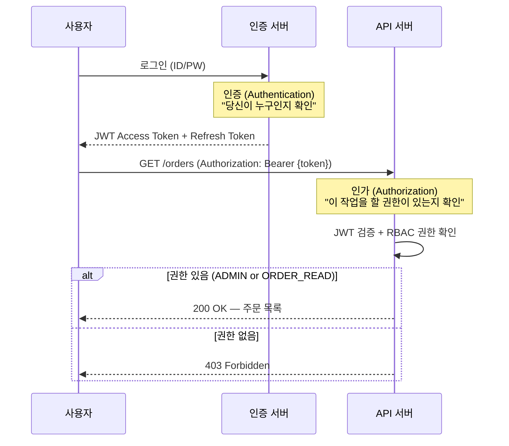
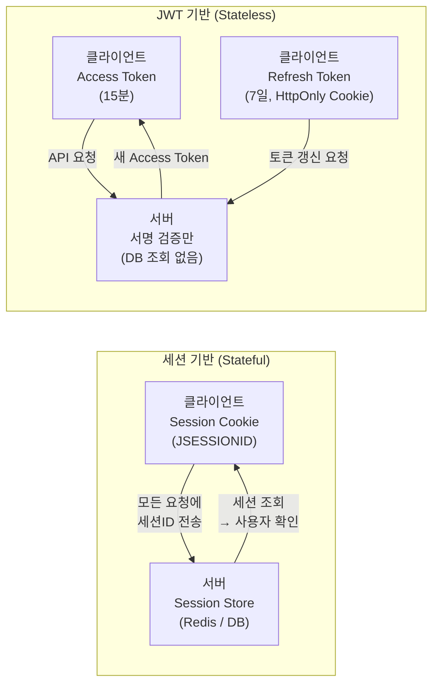
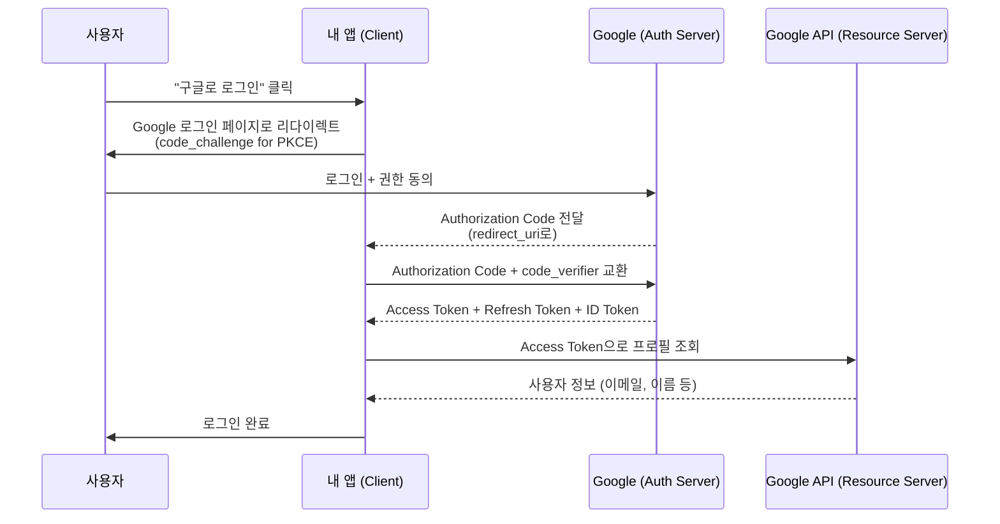

> 2025년 OWASP Top 10 1위는 여전히 **Broken Access Control**이다. JWT 알고리즘 혼동 공격(CVE-2025-30144), 권한 우회, 세션 탈취 — 인증·인가를 이론으로만 알면 취약점을 만든다. 원리부터 공격 시나리오, 방어 코드까지 함께 이해해야 한다.

## 핵심 요약 (TL;DR)

**인증(Authentication):** "당신이 누구인지" 증명. 로그인, 비밀번호 검증, OTP.
**인가(Authorization):** "당신이 무엇을 할 수 있는지" 결정. 역할 확인, 권한 검사.

**세션 기반:** 서버가 상태 보관 → Stateful, 수평 확장 시 세션 공유 문제
**JWT 기반:** 클라이언트가 토큰 보관 → Stateless, 서버 DB 조회 없음, 만료 전 무효화 어려움
**OAuth 2.0:** 써드파티 앱에 리소스 접근 위임. "구글로 로그인" 뒤의 표준 프로토콜
**RBAC:** Role-Based Access Control — 사용자에게 역할 부여, 역할에 권한 부여

---

## 인증과 인가의 차이



---

## JWT (JSON Web Token)

### 구조

```
eyJhbGciOiJIUzI1NiIsInR5cCI6IkpXVCJ9   ← Header (Base64url)
.eyJzdWIiOiJ1c2VyOjEiLCJyb2xlIjoiQURNSU4iLCJleHAiOjE3NzYzOTk5OTl9  ← Payload
.SflKxwRJSMeKKF2QT4fwpMeJf36POk6yJV_adQssw5c  ← Signature (HMAC-SHA256)
```

```json
// Header
{ "alg": "HS256", "typ": "JWT" }

// Payload (Claims)
{
  "sub": "user:1",           // Subject — 사용자 식별자
  "iss": "honeybarrel.co.kr", // Issuer
  "aud": "api.honeybarrel.co.kr", // Audience
  "iat": 1776313599,         // Issued At
  "exp": 1776399999,         // Expiration (15분)
  "role": "ADMIN",
  "email": "king@honeybarrel.co.kr"
}
```

**⚠️ JWT는 암호화가 아니다!** Base64url 인코딩이므로 누구나 Payload를 디코딩할 수 있다. 서명(Signature)만 검증할 뿐이다. 민감 정보(비밀번호, 신용카드)를 Payload에 넣으면 안 된다.

### JWT 구현 (Java + Spring Boot)

```java
// build.gradle.kts
// implementation("io.jsonwebtoken:jjwt-api:0.12.6")
// runtimeOnly("io.jsonwebtoken:jjwt-impl:0.12.6")
// runtimeOnly("io.jsonwebtoken:jjwt-jackson:0.12.6")

@Component
public class JwtTokenProvider {

    @Value("${jwt.secret}")        // 최소 256비트 (32자) 이상 권장
    private String secretKey;

    private final long ACCESS_EXPIRE_MS  = 15 * 60 * 1000;       // 15분
    private final long REFRESH_EXPIRE_MS = 7 * 24 * 60 * 60 * 1000; // 7일

    private SecretKey key() {
        return Keys.hmacShaKeyFor(Decoders.BASE64URL.decode(secretKey));
    }

    /** Access Token 생성 */
    public String generateAccessToken(Long userId, String email, String role) {
        Instant now = Instant.now();
        return Jwts.builder()
                .subject(String.valueOf(userId))
                .issuer("honeybarrel.co.kr")
                .audience().add("api.honeybarrel.co.kr").and()
                .claim("email", email)
                .claim("role", role)
                .issuedAt(Date.from(now))
                .expiration(Date.from(now.plusMillis(ACCESS_EXPIRE_MS)))
                .signWith(key(), Jwts.SIG.HS256)
                .compact();
    }

    /** Refresh Token 생성 (최소 클레임) */
    public String generateRefreshToken(Long userId) {
        Instant now = Instant.now();
        return Jwts.builder()
                .subject(String.valueOf(userId))
                .issuedAt(Date.from(now))
                .expiration(Date.from(now.plusMillis(REFRESH_EXPIRE_MS)))
                .signWith(key(), Jwts.SIG.HS256)
                .compact();
    }

    /** 토큰 검증 + Claims 추출 */
    public Claims validateToken(String token) {
        return Jwts.parser()
                .verifyWith(key())
                .requireIssuer("honeybarrel.co.kr")    // iss 검증
                .requireAudience("api.honeybarrel.co.kr") // aud 검증
                .build()
                .parseSignedClaims(token)
                .getPayload();
    }

    /** Spring Security Filter에서 사용 */
    public Authentication getAuthentication(String token) {
        Claims claims = validateToken(token);
        String role = claims.get("role", String.class);

        UserDetails userDetails = User.builder()
                .username(claims.getSubject())
                .password("")
                .authorities("ROLE_" + role)
                .build();

        return new UsernamePasswordAuthenticationToken(
                userDetails, token, userDetails.getAuthorities());
    }
}
```

### JWT Filter

```java
@Component
@RequiredArgsConstructor
public class JwtAuthenticationFilter extends OncePerRequestFilter {

    private final JwtTokenProvider jwtProvider;

    @Override
    protected void doFilterInternal(
            HttpServletRequest request,
            HttpServletResponse response,
            FilterChain filterChain) throws ServletException, IOException {

        String token = extractToken(request);

        if (token != null) {
            try {
                Authentication auth = jwtProvider.getAuthentication(token);
                SecurityContextHolder.getContext().setAuthentication(auth);
            } catch (ExpiredJwtException e) {
                response.setStatus(HttpServletResponse.SC_UNAUTHORIZED);
                response.getWriter().write("{\"error\": \"Token expired\"}");
                return;
            } catch (JwtException e) {
                response.setStatus(HttpServletResponse.SC_UNAUTHORIZED);
                response.getWriter().write("{\"error\": \"Invalid token\"}");
                return;
            }
        }

        filterChain.doFilter(request, response);
    }

    private String extractToken(HttpServletRequest request) {
        String bearer = request.getHeader("Authorization");
        if (bearer != null && bearer.startsWith("Bearer ")) {
            return bearer.substring(7);
        }
        return null;
    }
}
```

---

## 세션 vs JWT — 언제 무엇을 쓸까



| 항목 | 세션 | JWT |
|------|------|-----|
| **서버 상태** | Stateful (세션 저장소 필요) | Stateless |
| **수평 확장** | 세션 공유 필요 (Redis) | 쉬움 (서명 검증만) |
| **즉시 무효화** | ✅ 세션 삭제로 즉시 | ❌ 만료 전까지 유효 |
| **트래픽** | 매 요청 DB/Redis 조회 | 서명 검증만 (빠름) |
| **보안 위협** | CSRF, 세션 고정 | 토큰 탈취, 알고리즘 혼동 |
| **모바일/SPA** | 쿠키 제약 있음 | 유연 |
| **권장 시나리오** | 단일 서버, 즉시 만료 중요 | 마이크로서비스, API 서버 |

**토큰 저장 위치:**
```
❌ localStorage : XSS로 탈취 가능
✅ HttpOnly Cookie: JS 접근 불가, CSRF 방어 필요
→ Access Token: 메모리 (짧은 수명)
→ Refresh Token: HttpOnly Secure SameSite=Strict Cookie
```

---

## RBAC (Role-Based Access Control)

```java
// 역할 정의
public enum Role {
    USER,        // 일반 사용자
    SELLER,      // 판매자
    ADMIN,       // 관리자
    SUPER_ADMIN  // 슈퍼 관리자
}

// 권한 정의
public enum Permission {
    PRODUCT_READ,
    PRODUCT_WRITE,
    PRODUCT_DELETE,
    ORDER_READ,
    ORDER_MANAGE,
    USER_MANAGE,
    SYSTEM_CONFIG
}

// 역할-권한 매핑 (OCP: 역할 추가 시 매핑만 확장)
public enum Role {
    USER(Set.of(PRODUCT_READ, ORDER_READ)),
    SELLER(Set.of(PRODUCT_READ, PRODUCT_WRITE, ORDER_READ, ORDER_MANAGE)),
    ADMIN(Set.of(PRODUCT_READ, PRODUCT_WRITE, PRODUCT_DELETE,
                 ORDER_READ, ORDER_MANAGE, USER_MANAGE)),
    SUPER_ADMIN(EnumSet.allOf(Permission.class));

    private final Set<Permission> permissions;
    Role(Set<Permission> permissions) { this.permissions = permissions; }

    public Set<SimpleGrantedAuthority> getGrantedAuthorities() {
        Set<SimpleGrantedAuthority> authorities = permissions.stream()
                .map(p -> new SimpleGrantedAuthority(p.name()))
                .collect(Collectors.toSet());
        authorities.add(new SimpleGrantedAuthority("ROLE_" + this.name()));
        return authorities;
    }
}

// Spring Security 설정
@Configuration
@EnableMethodSecurity  // @PreAuthorize 활성화
public class SecurityConfig {

    @Bean
    public SecurityFilterChain securityFilterChain(HttpSecurity http) throws Exception {
        http
            .csrf(AbstractHttpConfigurer::disable)
            .sessionManagement(s -> s.sessionCreationPolicy(SessionCreationPolicy.STATELESS))
            .authorizeHttpRequests(auth -> auth
                .requestMatchers("/api/v1/auth/**").permitAll()
                .requestMatchers(HttpMethod.GET, "/api/v1/products/**").permitAll()
                .requestMatchers(HttpMethod.POST, "/api/v1/products/**")
                    .hasAuthority(Permission.PRODUCT_WRITE.name())
                .requestMatchers("/api/v1/admin/**").hasRole("ADMIN")
                .anyRequest().authenticated()
            )
            .addFilterBefore(jwtAuthFilter, UsernamePasswordAuthenticationFilter.class);
        return http.build();
    }
}

// 메서드 레벨 인가
@RestController
@RequestMapping("/api/v1/products")
public class ProductController {

    @DeleteMapping("/{id}")
    @PreAuthorize("hasAuthority('PRODUCT_DELETE')")
    public ResponseEntity<Void> deleteProduct(@PathVariable Long id) { ... }

    @GetMapping("/my")
    @PreAuthorize("hasRole('SELLER') and #sellerId == authentication.principal.username")
    public ResponseEntity<?> getMyProducts(@RequestParam String sellerId) { ... }
}
```

---

## OAuth 2.0 — "구글로 로그인"의 실제



### Spring Boot OAuth2 클라이언트 설정

```yaml
# application.yml
spring:
  security:
    oauth2:
      client:
        registration:
          google:
            client-id: ${GOOGLE_CLIENT_ID}
            client-secret: ${GOOGLE_CLIENT_SECRET}
            scope: openid, profile, email
            redirect-uri: "{baseUrl}/login/oauth2/code/{registrationId}"
          kakao:
            client-id: ${KAKAO_CLIENT_ID}
            client-secret: ${KAKAO_CLIENT_SECRET}
            client-authentication-method: client_secret_post
            authorization-grant-type: authorization_code
            scope: profile_nickname, account_email
            redirect-uri: "{baseUrl}/login/oauth2/code/kakao"
        provider:
          kakao:
            authorization-uri: https://kauth.kakao.com/oauth/authorize
            token-uri: https://kauth.kakao.com/oauth/token
            user-info-uri: https://kapi.kakao.com/v2/user/me
            user-name-attribute: id
```

```java
@Service
@RequiredArgsConstructor
public class CustomOAuth2UserService extends DefaultOAuth2UserService {

    private final UserRepository userRepository;
    private final JwtTokenProvider jwtProvider;

    @Override
    public OAuth2User loadUser(OAuth2UserRequest userRequest) {
        OAuth2User oauth2User = super.loadUser(userRequest);

        String provider = userRequest.getClientRegistration().getRegistrationId(); // "google"
        String providerId = oauth2User.getAttribute("sub");   // Google: sub, Kakao: id
        String email = oauth2User.getAttribute("email");
        String name = oauth2User.getAttribute("name");

        // 최초 소셜 로그인 시 회원 자동 가입
        User user = userRepository.findByProviderAndProviderId(provider, providerId)
                .orElseGet(() -> userRepository.save(
                        User.builder()
                                .email(email)
                                .name(name)
                                .provider(provider)
                                .providerId(providerId)
                                .role(Role.USER)
                                .build()
                ));

        return new DefaultOAuth2User(
                user.getRole().getGrantedAuthorities(),
                oauth2User.getAttributes(),
                "sub"
        );
    }
}
```

---

## Deep Dive: JWT 보안 취약점과 방어

### 1. 알고리즘 혼동 공격 (Algorithm Confusion)

```java
// ❌ 취약: alg 검증 없이 파싱
// 공격자가 alg를 "none"으로 변조하면 서명 없이 통과
Jwts.parser().setSigningKey(key).parseClaimsJws(token);

// ✅ 안전: 허용할 알고리즘 명시 (JJWT 0.12+)
Jwts.parser()
    .verifyWith(key)                          // HS256 키 타입으로 alg 제한
    .require("alg", "HS256")                  // alg 클레임 검증
    .build()
    .parseSignedClaims(token);

// RS256(비대칭) 사용 시 더 안전: 서명은 Private Key, 검증은 Public Key
// 서명 키가 노출되지 않음
```

### 2. JWT 즉시 무효화 — 블랙리스트 패턴

```java
// JWT는 만료 전 무효화가 불가 → Redis 블랙리스트로 해결
@Service
@RequiredArgsConstructor
public class TokenBlacklistService {

    private final RedisTemplate<String, String> redisTemplate;

    /** 로그아웃/비밀번호 변경 시 현재 토큰 블랙리스트 등록 */
    public void blacklist(String token, Claims claims) {
        long ttl = claims.getExpiration().getTime() - System.currentTimeMillis();
        if (ttl > 0) {
            // 토큰 JTI(고유 ID) 또는 해시를 키로 저장
            String jti = claims.getId() != null ? claims.getId()
                       : DigestUtils.sha256Hex(token);
            redisTemplate.opsForValue()
                    .set("blacklist:" + jti, "1", ttl, TimeUnit.MILLISECONDS);
        }
    }

    /** JWT 검증 시 블랙리스트 확인 */
    public boolean isBlacklisted(String token, Claims claims) {
        String jti = claims.getId() != null ? claims.getId()
                   : DigestUtils.sha256Hex(token);
        return Boolean.TRUE.equals(
                redisTemplate.hasKey("blacklist:" + jti)
        );
    }
}
```

### 3. Refresh Token Rotation

```java
// Refresh Token 재사용 방지: 사용 시마다 새 Refresh Token 발급
@Transactional
public TokenPair refresh(String refreshToken) {
    // 1. 검증
    Claims claims = jwtProvider.validateToken(refreshToken);
    Long userId = Long.parseLong(claims.getSubject());

    // 2. DB에 저장된 Refresh Token과 비교 (단방향 해시)
    String storedHash = refreshTokenRepository.findByUserId(userId)
            .orElseThrow(() -> new UnauthorizedException("알 수 없는 토큰"));

    if (!passwordEncoder.matches(refreshToken, storedHash)) {
        // 토큰 재사용 감지 → 모든 토큰 무효화 (계정 탈취 대응)
        refreshTokenRepository.deleteByUserId(userId);
        throw new UnauthorizedException("토큰 재사용 감지: 다시 로그인하세요");
    }

    // 3. 새 토큰 쌍 발급 (Rotation)
    User user = userRepository.findById(userId).orElseThrow();
    String newAccessToken = jwtProvider.generateAccessToken(userId, user.getEmail(), user.getRole().name());
    String newRefreshToken = jwtProvider.generateRefreshToken(userId);

    // 4. 기존 Refresh Token 교체
    refreshTokenRepository.save(RefreshToken.builder()
            .userId(userId)
            .tokenHash(passwordEncoder.encode(newRefreshToken))
            .expiresAt(LocalDateTime.now().plusDays(7))
            .build());

    return new TokenPair(newAccessToken, newRefreshToken);
}
```

---

## 실무 장애 사례

```
사례 1: JWT Secret 환경변수 미설정 → "secret" 기본값 사용
  → 공격자가 동일한 "secret"으로 임의 토큰 생성 가능
  → 해결: 시작 시 Secret 길이 검증, 기본값 없애기

사례 2: Refresh Token을 localStorage에 저장
  → XSS 취약점으로 Refresh Token 탈취 → 장기 접근 가능
  → 해결: HttpOnly Secure SameSite=Strict Cookie만 사용

사례 3: IDOR (Insecure Direct Object Reference)
  GET /api/orders/5555 → 다른 사용자의 주문 조회 가능
  → 인증은 됐지만 인가(ownership check) 누락
  → 해결: @PreAuthorize에서 리소스 소유자 검증 필수

사례 4: alg=none 공격 (CVE-2025-30144)
  → 특정 JWT 라이브러리가 alg:none 허용
  → 해결: 라이브러리 버전 업데이트 + 허용 알고리즘 명시
```

---

## 면접 Q&A

| 레벨 | 질문 | 핵심 답변 |
|------|------|----------|
| 🟢 기초 | 인증과 인가의 차이는? | 인증(Authentication): 신원 확인 (로그인), 인가(Authorization): 권한 확인 (접근 제어). 인증 후 인가 순서 |
| 🟡 중급 | JWT를 localStorage에 저장하면 안 되는 이유는? | XSS 공격으로 `document.cookie` 접근 불가한 HttpOnly Cookie와 달리, localStorage는 JavaScript로 탈취 가능. Access Token은 메모리, Refresh Token은 HttpOnly Cookie |
| 🟡 중급 | OAuth 2.0에서 PKCE가 필요한 이유는? | SPA/모바일 앱은 client_secret을 안전하게 보관 불가. Authorization Code 탈취 방지를 위해 code_verifier/code_challenge를 사용. RFC 7636 |
| 🔴 심화 | JWT의 즉시 무효화는 왜 어렵고, 어떻게 해결하는가? | JWT는 서버가 상태를 갖지 않으므로 서명만 검증. 만료 전 무효화를 위해 Redis 블랙리스트(JTI 기반), Refresh Token Rotation, 짧은 Access Token 만료 시간(15분) 조합 사용 |
| 🔴 시니어 | RBAC vs ABAC의 차이와 적용 시나리오를 설명하라 | RBAC: 역할 기반 — 구현 단순, 대부분의 서비스에 적합. ABAC(Attribute-Based): 사용자·리소스·환경 속성 조합 — 표현력 높지만 복잡. "오전 9-18시에만 서울 IP에서 접근 허용" 같은 세밀한 제어는 ABAC |

---

## 정리

| 항목 | 설명 |
|------|------|
| **핵심 키워드** | JWT(Header.Payload.Signature), OAuth 2.0(Authorization Code + PKCE), 세션 vs 토큰, RBAC, 블랙리스트, Refresh Token Rotation |
| **연관 개념** | TLS/HTTPS, CORS, CSRF, XSS, OWASP Top 10, ABAC, OpenID Connect |
| **실무 결정** | Refresh Token → HttpOnly Cookie, JWT Secret → 최소 256bit, Access Token TTL → 15분 이하 |

---

## 레퍼런스

### 영상
- [freeCodeCamp.org (@freecodecamp)](https://www.youtube.com/@freecodecamp) — OAuth 2.0, JWT 풀코스 강의 (무료)
- [쉬운코드 (@ezcd)](https://www.youtube.com/@ezcd) — 시니어 개발자 관점의 인증/인가 실무

### 문서 & 기사
- [OWASP Top 10:2025 — A01 Broken Access Control](https://owasp.org/Top10/2025/A01_2025-Broken_Access_Control/) — 접근 제어 취약점 공식 가이드
- [Authorization Code Flow with PKCE — Auth0 Docs](https://auth0.com/docs/get-started/authentication-and-authorization-flow/authorization-code-flow-with-pkce) — PKCE 상세 설명
- [JWT Security Vulnerabilities 2026 Guide — Red Sentry](https://redsentry.com/resources/blog/jwt-vulnerabilities-list-2026-security-risks-mitigation-guide) — JWT CVE 목록 및 완화 전략
- [PKCE RFC 7636 — oauth.net](https://oauth.net/2/pkce/) — PKCE 공식 스펙

---

*이 포스트는 [HoneyByte](https://blog.honeybarrel.co.kr) CS Study 시리즈의 일부입니다.*
