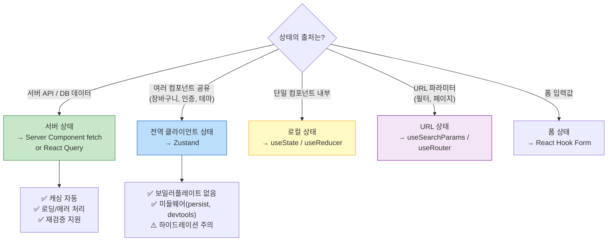

> App Router로 오면서 상태 관리가 다시 복잡해졌다. "이 데이터는 서버에서 가져올까, 클라이언트에서 관리할까?" — 이 질문에 제대로 답하지 못하면 하이드레이션 오류, 불필요한 API 호출, 앱 전체를 `'use client'`로 도배하는 상황을 만든다.

## 핵심 요약 (TL;DR)

**서버 상태(Server State):** 외부 API/DB에서 가져오는 데이터. `fetch` + Server Component or **React Query(TanStack Query)** — 캐싱, 로딩, 에러, 재검증을 자동으로 처리.

**전역 클라이언트 상태(Global Client State):** 장바구니, 모달 열림 여부, 테마 등 서버와 무관한 클라이언트 전용 상태. **Zustand** — 보일러플레이트 없이 가장 단순.

**로컬 상태(Local State):** 단일 컴포넌트 내 상태. `useState` — 끌어올릴 필요 없으면 여기서.

---

## 상태 분류와 설계 원칙



---

## 설치

```bash
# 상태 관리 라이브러리
npm install zustand @tanstack/react-query @tanstack/react-query-devtools

# 폼 상태 (선택)
npm install react-hook-form zod @hookform/resolvers
```

---

## Zustand — 전역 클라이언트 상태

### 장바구니 스토어 구현

```typescript
// src/store/cart-store.ts
import { create } from 'zustand'
import { persist, createJSONStorage, devtools } from 'zustand/middleware'
import { immer } from 'zustand/middleware/immer'

export interface CartItem {
  id: number
  name: string
  price: number
  quantity: number
  imageUrl: string
}

interface CartState {
  items: CartItem[]
  isOpen: boolean

  // Actions
  addItem: (product: Omit<CartItem, 'quantity'>) => void
  removeItem: (id: number) => void
  updateQuantity: (id: number, quantity: number) => void
  clearCart: () => void
  toggleCart: () => void

  // Computed (Derived State)
  totalItems: () => number
  totalPrice: () => number
}

export const useCartStore = create<CartState>()(
  devtools(  // Redux DevTools 연동
    persist(  // localStorage에 지속 저장
      immer(  // Immer로 불변 업데이트 단순화
        (set, get) => ({
          items: [],
          isOpen: false,

          addItem: (product) =>
            set((state) => {
              const existing = state.items.find(i => i.id === product.id)
              if (existing) {
                existing.quantity += 1  // Immer: 직접 변경 가능
              } else {
                state.items.push({ ...product, quantity: 1 })
              }
            }),

          removeItem: (id) =>
            set((state) => {
              state.items = state.items.filter(i => i.id !== id)
            }),

          updateQuantity: (id, quantity) =>
            set((state) => {
              if (quantity <= 0) {
                state.items = state.items.filter(i => i.id !== id)
                return
              }
              const item = state.items.find(i => i.id === id)
              if (item) item.quantity = quantity
            }),

          clearCart: () =>
            set((state) => { state.items = [] }),

          toggleCart: () =>
            set((state) => { state.isOpen = !state.isOpen }),

          // Computed — 함수로 선언하여 파생 상태 계산
          totalItems: () => get().items.reduce((sum, i) => sum + i.quantity, 0),
          totalPrice: () => get().items.reduce((sum, i) => sum + i.price * i.quantity, 0),
        })
      ),
      {
        name: 'honey-cart',            // localStorage 키
        storage: createJSONStorage(() => localStorage),
        partialize: (state) => ({      // 저장할 필드만 선택 (isOpen 제외)
          items: state.items,
        }),
      }
    ),
    { name: 'CartStore' }             // DevTools에 표시될 이름
  )
)
```

### App Router에서 Zustand 하이드레이션 문제 해결

```tsx
// ⚠️ 문제: localStorage persist가 SSR과 충돌
// 서버: items = [] (localStorage 없음)
// 클라이언트: items = [이전 장바구니] (localStorage)
// → 하이드레이션 불일치 오류

// ✅ 해결 패턴 1: useEffect로 마운트 후 렌더링
// src/components/CartItemCount.tsx
'use client'

import { useState, useEffect } from 'react'
import { useCartStore } from '@/store/cart-store'

export function CartItemCount() {
  const [mounted, setMounted] = useState(false)
  const totalItems = useCartStore(state => state.totalItems())

  // 클라이언트 마운트 후에만 표시 (하이드레이션 안전)
  useEffect(() => setMounted(true), [])

  if (!mounted) return <span className="text-xs">-</span>

  return (
    <span className="bg-amber-500 text-white text-xs rounded-full w-5 h-5 flex items-center justify-center">
      {totalItems}
    </span>
  )
}

// ✅ 해결 패턴 2: Zustand의 공식 권장 방식 — StoreProvider
// src/providers/cart-provider.tsx
'use client'

import { createContext, useContext, useRef, type ReactNode } from 'react'
import { createStore, useStore } from 'zustand'
import type { CartState } from '@/store/cart-store'

// 인스턴스 기반 스토어 (요청별 격리)
type CartStore = ReturnType<typeof createCartStore>

function createCartStore(initialItems?: CartState['items']) {
  return createStore<CartState>()((set, get) => ({
    items: initialItems ?? [],
    isOpen: false,
    // ... 나머지 actions
    addItem: (product) => set(state => ({ /* ... */ })),
    totalItems: () => get().items.reduce((sum, i) => sum + i.quantity, 0),
    totalPrice: () => get().items.reduce((sum, i) => sum + i.price * i.quantity, 0),
    removeItem: (id) => set(state => ({ items: state.items.filter(i => i.id !== id) })),
    updateQuantity: (id, qty) => set(state => ({ items: state.items.map(i => i.id === id ? { ...i, quantity: qty } : i) })),
    clearCart: () => set({ items: [] }),
    toggleCart: () => set(state => ({ isOpen: !state.isOpen })),
  }))
}

const CartStoreContext = createContext<CartStore | null>(null)

export function CartProvider({ children, initialItems }: {
  children: ReactNode
  initialItems?: CartState['items']
}) {
  const storeRef = useRef<CartStore | null>(null)
  if (!storeRef.current) {
    storeRef.current = createCartStore(initialItems)
  }
  return (
    <CartStoreContext.Provider value={storeRef.current}>
      {children}
    </CartStoreContext.Provider>
  )
}

export function useCart<T>(selector: (state: CartState) => T): T {
  const store = useContext(CartStoreContext)
  if (!store) throw new Error('useCart must be used within CartProvider')
  return useStore(store, selector)
}
```

### 장바구니 UI 컴포넌트

```tsx
// src/components/CartDrawer.tsx
'use client'

import { useCartStore } from '@/store/cart-store'
import Image from 'next/image'

export function CartDrawer() {
  const { items, isOpen, toggleCart, removeItem, updateQuantity, totalPrice, clearCart } = useCartStore()

  return (
    <>
      {/* 오버레이 */}
      {isOpen && (
        <div
          className="fixed inset-0 bg-black/40 z-40"
          onClick={toggleCart}
        />
      )}

      {/* 드로어 */}
      <aside className={`
        fixed right-0 top-0 h-full w-80 bg-white shadow-2xl z-50
        transition-transform duration-300
        ${isOpen ? 'translate-x-0' : 'translate-x-full'}
      `}>
        <div className="flex items-center justify-between p-4 border-b">
          <h2 className="text-lg font-bold">🛒 장바구니</h2>
          <button onClick={toggleCart} className="text-gray-400 hover:text-gray-600">✕</button>
        </div>

        {items.length === 0 ? (
          <div className="flex flex-col items-center justify-center h-64 text-gray-400">
            <span className="text-4xl mb-3">🍯</span>
            <p>장바구니가 비어있습니다</p>
          </div>
        ) : (
          <>
            <ul className="flex-1 overflow-y-auto p-4 space-y-3">
              {items.map(item => (
                <li key={item.id} className="flex gap-3 items-center">
                  <div className="relative w-16 h-16 shrink-0">
                    <Image src={item.imageUrl} alt={item.name} fill className="object-cover rounded-lg" />
                  </div>
                  <div className="flex-1 min-w-0">
                    <p className="font-medium truncate text-sm">{item.name}</p>
                    <p className="text-amber-600 text-sm">{item.price.toLocaleString()}원</p>
                    <div className="flex items-center gap-2 mt-1">
                      <button
                        onClick={() => updateQuantity(item.id, item.quantity - 1)}
                        className="w-6 h-6 rounded-full border flex items-center justify-center text-sm"
                      >-</button>
                      <span className="text-sm w-4 text-center">{item.quantity}</span>
                      <button
                        onClick={() => updateQuantity(item.id, item.quantity + 1)}
                        className="w-6 h-6 rounded-full border flex items-center justify-center text-sm"
                      >+</button>
                    </div>
                  </div>
                  <button
                    onClick={() => removeItem(item.id)}
                    className="text-gray-300 hover:text-red-400 text-lg"
                  >✕</button>
                </li>
              ))}
            </ul>

            <div className="border-t p-4">
              <div className="flex justify-between font-bold mb-4">
                <span>합계</span>
                <span className="text-amber-600">{totalPrice().toLocaleString()}원</span>
              </div>
              <button className="w-full bg-amber-400 text-amber-900 py-3 rounded-xl font-bold hover:bg-amber-500">
                결제하기
              </button>
              <button onClick={clearCart} className="w-full text-gray-400 text-sm mt-2">
                장바구니 비우기
              </button>
            </div>
          </>
        )}
      </aside>
    </>
  )
}
```

---

## React Query — 서버 상태 관리

### QueryClient Provider 설정

```tsx
// src/providers/query-provider.tsx
'use client'

import { QueryClient, QueryClientProvider } from '@tanstack/react-query'
import { ReactQueryDevtools } from '@tanstack/react-query-devtools'
import { useState, type ReactNode } from 'react'

export function QueryProvider({ children }: { children: ReactNode }) {
  // useState로 QueryClient 생성 → 요청별 독립 인스턴스 보장
  const [queryClient] = useState(
    () => new QueryClient({
      defaultOptions: {
        queries: {
          staleTime: 60 * 1000,     // 1분 stale
          gcTime: 5 * 60 * 1000,   // 5분 후 캐시 제거 (구: cacheTime)
          retry: 1,                  // 실패 시 1회 재시도
          refetchOnWindowFocus: false, // 탭 포커스 시 재요청 비활성화
        },
      },
    })
  )

  return (
    <QueryClientProvider client={queryClient}>
      {children}
      {process.env.NODE_ENV === 'development' && (
        <ReactQueryDevtools initialIsOpen={false} />
      )}
    </QueryClientProvider>
  )
}

// src/app/layout.tsx에 추가
// <QueryProvider><CartProvider>{children}</CartProvider></QueryProvider>
```

### 상품 목록 — useQuery + 낙관적 업데이트

```typescript
// src/hooks/use-products.ts
import { useQuery, useMutation, useQueryClient } from '@tanstack/react-query'

export interface Product {
  id: number
  name: string
  price: number
  stock: number
  imageUrl: string
}

// 쿼리 키 팩토리 — 중앙 관리 (타입 안전성 + 재사용)
export const productKeys = {
  all: ['products'] as const,
  list: (filters?: { category?: string; page?: number }) =>
    [...productKeys.all, 'list', filters] as const,
  detail: (id: number) => [...productKeys.all, 'detail', id] as const,
}

// 서버 상태 조회
export function useProducts(filters?: { category?: string; page?: number }) {
  return useQuery({
    queryKey: productKeys.list(filters),
    queryFn: async () => {
      const params = new URLSearchParams()
      if (filters?.category) params.set('category', filters.category)
      if (filters?.page) params.set('page', String(filters.page))

      const res = await fetch(`/api/products?${params}`)
      if (!res.ok) throw new Error('상품 목록 로딩 실패')
      return res.json() as Promise<{ products: Product[]; total: number }>
    },
    staleTime: 5 * 60 * 1000,  // 5분 fresh
    placeholderData: (prev) => prev,  // 필터 변경 시 이전 데이터 유지 (깜빡임 방지)
  })
}

export function useProduct(id: number) {
  return useQuery({
    queryKey: productKeys.detail(id),
    queryFn: async () => {
      const res = await fetch(`/api/products/${id}`)
      if (!res.ok) throw new Error('상품 상세 로딩 실패')
      return res.json() as Promise<Product>
    },
  })
}

// 뮤테이션 — 낙관적 업데이트(Optimistic Update)
export function useUpdateProductStock() {
  const queryClient = useQueryClient()

  return useMutation({
    mutationFn: async ({ id, stock }: { id: number; stock: number }) => {
      const res = await fetch(`/api/products/${id}`, {
        method: 'PATCH',
        headers: { 'Content-Type': 'application/json' },
        body: JSON.stringify({ stock }),
      })
      if (!res.ok) throw new Error('재고 업데이트 실패')
      return res.json()
    },

    // 낙관적 업데이트: 서버 응답 전에 UI를 먼저 변경
    onMutate: async ({ id, stock }) => {
      // 진행 중인 관련 쿼리 취소
      await queryClient.cancelQueries({ queryKey: productKeys.detail(id) })

      // 현재 캐시 스냅샷 저장 (롤백용)
      const snapshot = queryClient.getQueryData<Product>(productKeys.detail(id))

      // 낙관적으로 캐시 업데이트
      queryClient.setQueryData<Product>(productKeys.detail(id), (old) =>
        old ? { ...old, stock } : undefined
      )

      return { snapshot }  // onError에서 롤백에 사용
    },

    // 실패 시 롤백
    onError: (err, { id }, context) => {
      if (context?.snapshot) {
        queryClient.setQueryData(productKeys.detail(id), context.snapshot)
      }
    },

    // 성공/실패 모두 서버에서 최신 데이터 재검증
    onSettled: (_, __, { id }) => {
      queryClient.invalidateQueries({ queryKey: productKeys.detail(id) })
      queryClient.invalidateQueries({ queryKey: productKeys.all })
    },
  })
}
```

### 서버 프리페칭 — Server Component + React Query 조합

```tsx
// src/app/products/page.tsx (Server Component)
import { HydrationBoundary, QueryClient, dehydrate } from '@tanstack/react-query'
import { ProductList } from '@/components/ProductList'
import { productKeys } from '@/hooks/use-products'

export default async function ProductsPage({
  searchParams,
}: {
  searchParams: Promise<{ category?: string; page?: string }>
}) {
  const { category, page } = await searchParams
  const filters = { category, page: page ? Number(page) : 1 }

  // 서버에서 미리 데이터 페칭 → 클라이언트 하이드레이션
  const queryClient = new QueryClient()
  await queryClient.prefetchQuery({
    queryKey: productKeys.list(filters),
    queryFn: async () => {
      // 서버에서는 직접 DB 조회 또는 내부 API 호출
      const { products, total } = await getProductsFromDB(filters)
      return { products, total }
    },
  })

  return (
    // dehydrate: 서버 캐시를 직렬화하여 클라이언트로 전달
    <HydrationBoundary state={dehydrate(queryClient)}>
      {/* 클라이언트 컴포넌트에서 useProducts()를 호출하면
          서버에서 페칭한 데이터를 즉시 반환 (네트워크 요청 없음) */}
      <ProductList filters={filters} />
    </HydrationBoundary>
  )
}
```

```tsx
// src/components/ProductList.tsx (Client Component)
'use client'

import { useProducts } from '@/hooks/use-products'
import { useCartStore } from '@/store/cart-store'

export function ProductList({ filters }: { filters: { category?: string; page?: number } }) {
  // HydrationBoundary 덕분에 서버 데이터로 즉시 렌더링 (로딩 없음)
  const { data, isLoading, error } = useProducts(filters)
  const addItem = useCartStore(state => state.addItem)
  const toggleCart = useCartStore(state => state.toggleCart)

  if (isLoading) return <ProductListSkeleton />
  if (error) return <ErrorMessage message={error.message} />

  return (
    <div className="grid grid-cols-1 md:grid-cols-3 gap-6">
      {data?.products.map(product => (
        <div key={product.id} className="bg-white rounded-xl p-4 shadow-sm hover:shadow-md transition-shadow">
          <h3 className="font-semibold text-gray-900">{product.name}</h3>
          <p className="text-amber-600 font-bold mt-1">{product.price.toLocaleString()}원</p>
          <p className="text-gray-400 text-sm">재고 {product.stock}개</p>
          <button
            onClick={() => {
              addItem({ id: product.id, name: product.name, price: product.price, imageUrl: product.imageUrl })
              toggleCart()
            }}
            className="mt-3 w-full bg-amber-400 text-amber-900 py-2 rounded-lg text-sm font-semibold hover:bg-amber-500"
          >
            장바구니 담기
          </button>
        </div>
      ))}
    </div>
  )
}

function ProductListSkeleton() {
  return (
    <div className="grid grid-cols-1 md:grid-cols-3 gap-6">
      {Array.from({ length: 6 }).map((_, i) => (
        <div key={i} className="bg-white rounded-xl p-4 animate-pulse">
          <div className="h-5 bg-gray-200 rounded mb-2" />
          <div className="h-4 bg-gray-200 rounded w-24 mb-1" />
          <div className="h-4 bg-gray-200 rounded w-16 mb-3" />
          <div className="h-9 bg-gray-200 rounded" />
        </div>
      ))}
    </div>
  )
}
```

---

## URL 상태 — 필터와 페이지네이션

```tsx
// src/components/ProductFilters.tsx
// URL에 필터 상태 저장 → 공유 가능한 링크, 뒤로가기 지원
'use client'

import { useRouter, useSearchParams, usePathname } from 'next/navigation'
import { useTransition } from 'react'

const CATEGORIES = ['전체', '아카시아꿀', '밤꿀', '유채꿀', '프로폴리스']

export function ProductFilters() {
  const router = useRouter()
  const pathname = usePathname()
  const searchParams = useSearchParams()
  const [isPending, startTransition] = useTransition()

  const currentCategory = searchParams.get('category') ?? '전체'

  const setCategory = (category: string) => {
    const params = new URLSearchParams(searchParams.toString())
    if (category === '전체') {
      params.delete('category')
    } else {
      params.set('category', category)
    }
    params.delete('page')  // 필터 변경 시 첫 페이지로

    startTransition(() => {
      router.push(`${pathname}?${params.toString()}`, { scroll: false })
    })
  }

  return (
    <div className="flex gap-2 flex-wrap mb-6">
      {CATEGORIES.map(cat => (
        <button
          key={cat}
          onClick={() => setCategory(cat)}
          disabled={isPending}
          className={`px-4 py-1.5 rounded-full text-sm font-medium transition-colors ${
            currentCategory === cat
              ? 'bg-amber-400 text-amber-900'
              : 'bg-gray-100 text-gray-600 hover:bg-gray-200'
          } disabled:opacity-50`}
        >
          {cat}
        </button>
      ))}
    </div>
  )
}
```

---

## 설계 원칙 적용

```
SRP (단일 책임 원칙):
  - useCartStore: 장바구니 상태만
  - useProducts: 상품 서버 상태만
  - ProductFilters: URL 상태만
  → 각 훅/스토어가 하나의 상태 도메인만 담당

OCP (개방-폐쇄 원칙):
  - productKeys 팩토리: 새 쿼리 추가 시 기존 키 변경 없음
  - Zustand 미들웨어 체이닝: persist → devtools → immer 조합 확장

DIP (의존성 역전):
  - 컴포넌트는 구체적인 API 함수가 아닌 useProducts 훅에 의존
  - 서버 구현 변경 시 훅만 수정, UI 컴포넌트 불변
```

---

## 트레이드오프 요약

| 상태 종류 | 도구 | 이유 | 피해야 할 경우 |
|---------|------|------|-------------|
| 서버 데이터 | React Query | 캐싱, 재검증, 로딩/에러 자동 | Server Component로 충분한 경우 |
| 전역 클라이언트 | Zustand | 최소 보일러플레이트 | 단일 컴포넌트 내 상태 |
| 로컬 UI | useState | 단순, 격리됨 | 여러 컴포넌트에서 공유 필요 시 |
| URL/필터 | searchParams | 공유 가능, SEO 친화적 | 복잡한 객체 상태 |
| 폼 | React Hook Form | 검증, 성능 최적화 | 단순 단일 필드 |

---

## 시리즈 안내

| Part | 주제 | 상태 |
|------|------|------|
| Part 1 | App Router 시작하기 | ✅ |
| Part 2 | 데이터 페칭과 캐싱 | ✅ |
| Part 3 | 인증과 미들웨어 | ✅ |
| **Part 4** | **상태 관리와 클라이언트 패턴** | 현재 글 |
| Part 5 | 성능 최적화 | 예정 |
| Part 6 | 배포와 운영 | 예정 |

---

## 레퍼런스

### 공식 문서
- [TanStack Query — Server Rendering & Hydration](https://tanstack.com/query/latest/docs/framework/react/guides/ssr) — App Router + React Query 공식 SSR 가이드
- [Zustand — Next.js with App Router](https://zustand.docs.pmnd.rs/guides/nextjs) — Zustand 공식 Next.js 통합 가이드

### 기술 블로그
- [How To Use Zustand With Next.js 15 — dimasroger.com](https://www.dimasroger.com/blog/how-to-use-zustand-with-next-js-15) — Zustand + Next.js 15 하이드레이션 해결 가이드
- [Next.js App Router & Zustand: Global State Sync — TechNetExperts](https://www.technetexperts.com/nextjs-zustand-app-router-state/) — 하이드레이션 오류 방지 패턴 (2025.12)

---

*이 포스트는 [HoneyByte](https://blog.honeybarrel.co.kr) Next.js Deep Dive 시리즈의 일부입니다.*
