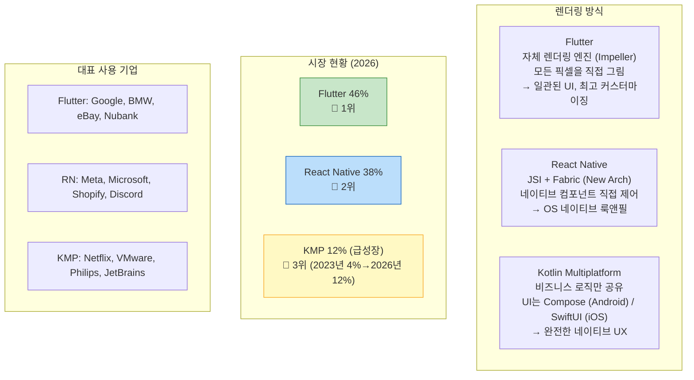
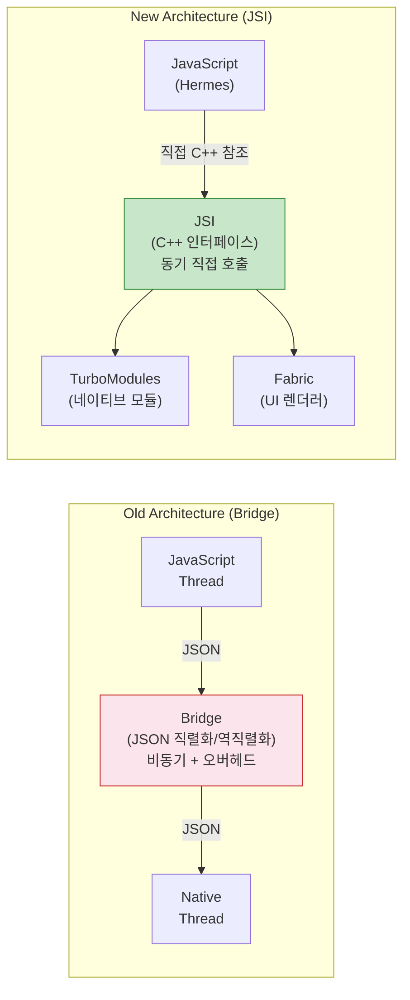
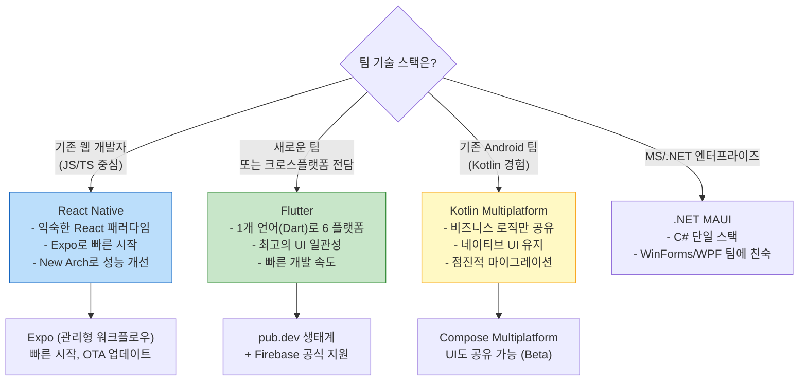

> "하나의 코드로 iOS와 Android를"이라는 약속은 2026년에야 진짜로 실현되고 있다. 3년 전까지의 크로스플랫폼은 타협이었지만, 지금은 진지한 선택지다. Flutter의 독주, React Native의 재건, KMP의 조용한 부상 — 세 가지 흐름을 코드와 함께 정직하게 비교한다.

## 핵심 요약 (TL;DR)

**2026 크로스플랫폼 시장 현황:**
- **Flutter**: 46% 채택률로 1위. Dart + 자체 렌더링 엔진(Impeller). Web·Desktop까지 확장
- **React Native**: 35~42%. New Architecture(JSI + Fabric + TurboModules) 기본 활성화로 네이티브 수준 성능
- **Kotlin Multiplatform (KMP)**: Android 팀이 Kotlin을 아는 기업에서 빠르게 성장. 비즈니스 로직 공유 + 플랫폼 네이티브 UI

**핵심 결론:** 단일 정답은 없다. 팀 기술 스택, 요구 성능, UI 커스터마이징 깊이에 따라 다르다.

---

## 2026 크로스플랫폼 지형도



---

## Flutter — 렌더링 엔진의 독립

### 핵심 아키텍처

Flutter는 **Impeller** (Next-gen 렌더링 엔진, Flutter 3.10+) 로 플랫폼 UI 컴포넌트를 전혀 사용하지 않는다. Skia를 대체한 Impeller는 GPU 셰이더를 앱 빌드 시 미리 컴파일하여 첫 프레임 지연(jank)을 제거했다.

```dart
// Flutter 3.x — 완전한 카운터 앱 (설치부터 실행까지)
// 1. 설치: https://docs.flutter.dev/get-started/install
// 2. 프로젝트 생성: flutter create honey_app
// 3. 실행: flutter run

import 'package:flutter/material.dart';
import 'package:flutter_riverpod/flutter_riverpod.dart';

// Riverpod — Flutter 권장 상태관리 (Provider의 차세대)
final counterProvider = StateNotifierProvider<CounterNotifier, int>((ref) {
  return CounterNotifier();
});

class CounterNotifier extends StateNotifier<int> {
  CounterNotifier() : super(0);
  void increment() => state++;
  void decrement() => state = state > 0 ? state - 1 : 0;
}

void main() {
  runApp(
    // ProviderScope: Riverpod 루트 위젯
    const ProviderScope(child: HoneyApp()),
  );
}

class HoneyApp extends StatelessWidget {
  const HoneyApp({super.key});

  @override
  Widget build(BuildContext context) {
    return MaterialApp(
      title: 'HoneyBarrel',
      theme: ThemeData(
        colorScheme: ColorScheme.fromSeed(seedColor: Colors.amber),
        useMaterial3: true,
      ),
      home: const ProductListPage(),
    );
  }
}

// ConsumerWidget: Riverpod 상태를 읽는 위젯
class ProductListPage extends ConsumerWidget {
  const ProductListPage({super.key});

  @override
  Widget build(BuildContext context, WidgetRef ref) {
    final count = ref.watch(counterProvider);

    return Scaffold(
      appBar: AppBar(
        title: const Text('🍯 HoneyBarrel'),
        backgroundColor: Colors.amber,
      ),
      body: Center(
        child: Column(
          mainAxisAlignment: MainAxisAlignment.center,
          children: [
            Text(
              '선택한 상품: $count',
              style: Theme.of(context).textTheme.headlineMedium,
            ),
            const SizedBox(height: 24),
            Row(
              mainAxisAlignment: MainAxisAlignment.center,
              children: [
                FloatingActionButton(
                  heroTag: 'dec',
                  onPressed: () => ref.read(counterProvider.notifier).decrement(),
                  child: const Icon(Icons.remove),
                ),
                const SizedBox(width: 16),
                FloatingActionButton(
                  heroTag: 'inc',
                  onPressed: () => ref.read(counterProvider.notifier).increment(),
                  child: const Icon(Icons.add),
                ),
              ],
            ),
          ],
        ),
      ),
    );
  }
}
```

```bash
# 빌드 & 실행
flutter pub get
flutter run                     # 디바이스/에뮬레이터
flutter run -d chrome           # 웹
flutter build apk --release     # Android
flutter build ipa               # iOS (macOS 필요)
```

### Flutter의 강점과 약점

```
✅ 강점:
  - 플랫폼 무관 일관된 UI (디자인 시스템 구현에 최적)
  - Impeller로 60/120fps 보장
  - Web, Desktop까지 단일 코드베이스
  - 풍부한 위젯 생태계, 빠른 개발 속도

❌ 약점:
  - Dart: 웹 개발자에게 새로운 학습 곡선
  - 앱 크기: Hello World가 ~10MB (네이티브 ~4MB)
  - 플랫폼 네이티브 룩앤필이 필요한 경우 추가 작업
  - 복잡한 플랫폼 네이티브 기능(NFC, 블루투스)은 여전히 플랫폼 채널 필요
```

---

## React Native — 브리지를 버리다

### New Architecture: JSI + Fabric + TurboModules

React Native의 구 아키텍처는 JSON 직렬화 브리지로 JS ↔ Native가 통신했다. 비동기, 느림, 드롭 프레임의 원인이었다.



```typescript
// React Native 0.74+ (New Architecture 기본 활성화)
// 1. 설치: npx react-native@latest init HoneyApp
// 2. 실행: npx react-native run-android / run-ios

import React, { useState, useCallback } from 'react'
import {
  View,
  Text,
  FlatList,
  TouchableOpacity,
  StyleSheet,
  ActivityIndicator,
  RefreshControl,
} from 'react-native'
import { useQuery } from '@tanstack/react-query'

interface Product {
  id: number
  name: string
  price: number
}

// React Query로 서버 상태 관리
function useProducts() {
  return useQuery({
    queryKey: ['products'],
    queryFn: async (): Promise<Product[]> => {
      const res = await fetch('https://api.honeybarrel.co.kr/products')
      if (!res.ok) throw new Error('상품 로딩 실패')
      return res.json()
    },
    staleTime: 5 * 60 * 1000,  // 5분 캐시
  })
}

export default function ProductListScreen() {
  const { data: products, isLoading, error, refetch } = useProducts()
  const [cart, setCart] = useState<Map<number, number>>(new Map())

  const addToCart = useCallback((productId: number) => {
    setCart(prev => new Map(prev).set(productId, (prev.get(productId) ?? 0) + 1))
  }, [])

  if (isLoading) {
    return (
      <View style={styles.center}>
        <ActivityIndicator size="large" color="#F59E0B" />
      </View>
    )
  }

  if (error) {
    return (
      <View style={styles.center}>
        <Text style={styles.errorText}>상품을 불러올 수 없습니다</Text>
        <TouchableOpacity style={styles.retryBtn} onPress={() => refetch()}>
          <Text style={styles.retryText}>다시 시도</Text>
        </TouchableOpacity>
      </View>
    )
  }

  return (
    <View style={styles.container}>
      <Text style={styles.header}>🍯 HoneyBarrel</Text>
      <FlatList
        data={products}
        keyExtractor={item => String(item.id)}
        refreshControl={
          <RefreshControl refreshing={isLoading} onRefresh={refetch} tintColor="#F59E0B" />
        }
        renderItem={({ item }) => (
          <View style={styles.card}>
            <View style={styles.info}>
              <Text style={styles.name}>{item.name}</Text>
              <Text style={styles.price}>{item.price.toLocaleString()}원</Text>
            </View>
            <TouchableOpacity
              style={styles.addBtn}
              onPress={() => addToCart(item.id)}
            >
              <Text style={styles.addBtnText}>
                {cart.has(item.id) ? `✓ ${cart.get(item.id)}` : '담기'}
              </Text>
            </TouchableOpacity>
          </View>
        )}
      />
    </View>
  )
}

const styles = StyleSheet.create({
  container: { flex: 1, backgroundColor: '#FFFBEB' },
  center: { flex: 1, justifyContent: 'center', alignItems: 'center' },
  header: { fontSize: 24, fontWeight: 'bold', padding: 16, color: '#92400E' },
  card: {
    flexDirection: 'row', justifyContent: 'space-between', alignItems: 'center',
    backgroundColor: '#fff', margin: 8, padding: 16, borderRadius: 12,
    shadowColor: '#000', shadowOffset: { width: 0, height: 2 },
    shadowOpacity: 0.08, shadowRadius: 4, elevation: 2,
  },
  info: { flex: 1 },
  name: { fontSize: 16, fontWeight: '600', color: '#1F2937' },
  price: { fontSize: 14, color: '#D97706', marginTop: 4 },
  addBtn: {
    backgroundColor: '#F59E0B', paddingHorizontal: 16, paddingVertical: 8, borderRadius: 20,
  },
  addBtnText: { color: '#fff', fontWeight: '700', fontSize: 13 },
  errorText: { fontSize: 16, color: '#EF4444', marginBottom: 12 },
  retryBtn: { backgroundColor: '#F59E0B', paddingHorizontal: 20, paddingVertical: 10, borderRadius: 8 },
  retryText: { color: '#fff', fontWeight: '600' },
})
```

---

## Kotlin Multiplatform — 비즈니스 로직의 공유

KMP는 **UI를 공유하지 않는다**. 비즈니스 로직, 네트워크, DB를 Kotlin으로 공유하고 UI는 각 플랫폼 네이티브(Android: Compose, iOS: SwiftUI)로 작성한다. Compose Multiplatform을 추가하면 UI도 공유할 수 있다.

```kotlin
// shared/src/commonMain/kotlin/co/kr/honeybarrel/ProductRepository.kt
// iOS와 Android 모두에서 실행되는 공유 코드

import kotlinx.coroutines.flow.Flow
import kotlinx.coroutines.flow.flow
import io.ktor.client.*
import io.ktor.client.call.*
import io.ktor.client.request.*
import kotlinx.serialization.Serializable

@Serializable
data class Product(
    val id: Int,
    val name: String,
    val price: Int,
)

class ProductRepository(private val httpClient: HttpClient) {

    fun getProducts(): Flow<List<Product>> = flow {
        val products = httpClient
            .get("https://api.honeybarrel.co.kr/products")
            .body<List<Product>>()
        emit(products)
    }
}

// expect/actual: 플랫폼별 다른 구현
expect fun createHttpClient(): HttpClient

// androidMain
actual fun createHttpClient() = HttpClient(OkHttp) {
    install(ContentNegotiation) { json() }
}

// iosMain
actual fun createHttpClient() = HttpClient(Darwin) {
    install(ContentNegotiation) { json() }
}
```

```kotlin
// androidApp/ProductViewModel.kt — Android에서 공유 로직 사용
class ProductViewModel(
    private val repository: ProductRepository
) : ViewModel() {

    val products = repository.getProducts()
        .stateIn(viewModelScope, SharingStarted.WhileSubscribed(5000), emptyList())
}
```

```swift
// iosApp/ProductView.swift — iOS에서 동일한 공유 로직 사용
import SwiftUI
import shared  // KMP 공유 모듈

struct ProductView: View {
    @StateObject private var viewModel = ProductViewModel()

    var body: some View {
        List(viewModel.products, id: \.id) { product in
            HStack {
                Text(product.name)
                Spacer()
                Text("\(product.price)원")
                    .foregroundColor(.orange)
            }
        }
        .navigationTitle("🍯 HoneyBarrel")
        .task { await viewModel.loadProducts() }
    }
}
```

---

## 기술 선택 가이드



| 항목 | Flutter | React Native | KMP |
|------|---------|-------------|-----|
| **언어** | Dart | JavaScript / TypeScript | Kotlin |
| **UI 방식** | 자체 렌더링 (Impeller) | 네이티브 컴포넌트 (Fabric) | 플랫폼 네이티브 |
| **성능** | 고성능, 일관됨 | New Arch로 네이티브 수준 | 완전 네이티브 |
| **학습 곡선** | 중간 (Dart) | 낮음 (React 아는 경우) | 높음 (iOS 추가 필요) |
| **공유 범위** | UI + 로직 전체 | UI + 로직 전체 | 로직만 (UI별도) |
| **생태계** | 크고 성숙 | 매우 크고 성숙 | 성장 중 |
| **Web 지원** | ✅ (실험적 → 안정화) | ✅ (React Native Web) | ❌ |

---

## 실무 적용 — 보안 관점

```
모바일 앱 보안 체크리스트 (OWASP Mobile Top 10 기준):

1. 하드코딩된 API 키 금지
   Flutter: flutter_secure_storage
   RN: react-native-keychain
   KMP: expect/actual로 플랫폼 보안 저장소 래핑

2. 네트워크 보안
   - 인증서 피닝 (Certificate Pinning)
   - TLS 1.3 강제
   Flutter: dio + dio_certificate_pinning
   RN: react-native-ssl-pinning

3. 루팅/탈옥 탐지
   Flutter: flutter_jailbreak_detection
   RN: react-native-device-info

4. 코드 난독화
   Flutter: --obfuscate --split-debug-info
   RN: ProGuard (Android) + Hermes bytecode

5. OTA 업데이트 보안 (Expo EAS / CodePush)
   → 서명 검증 필수, JS 번들만 업데이트 가능 (스토어 가이드라인 준수)
```

---

## 2026 전망과 다음을 볼 것들

```
📌 주목할 흐름:

1. Flutter Web 성숙도 향상
   → PWA + 앱 단일 코드 시대 본격화

2. React Native의 기업 채택 가속
   → New Architecture 안정화 + Expo EAS의 CI/CD 통합

3. Compose Multiplatform 안정화 (Beta → Stable 예상 2026)
   → KMP로 UI까지 공유 가능해지면 KMP 채택 폭발적 증가 예상

4. AI 통합 (온디바이스 추론)
   → Flutter: TFLite, ML Kit 통합
   → RN: react-native-ml-kit
   → Apple CoreML / Android NNAPI 직접 활용

5. 크로스플랫폼 vs 네이티브의 경계 소멸
   → 성능 격차가 사실상 없어짐 (New Arch, Impeller)
   → 생산성이 선택 기준의 핵심으로
```

---

## 레퍼런스

### 영상
- [freeCodeCamp.org (@freecodecamp)](https://www.youtube.com/@freecodecamp) — Flutter, React Native 풀코스 강의 (무료)
- [조코딩 JoCoding (@jocoding)](https://www.youtube.com/@jocoding) — 모바일 앱 개발 트렌드, 실용 크로스플랫폼 프로젝트

### 문서 & 기사
- [5 Best Cross Platform Frameworks 2026 — Uno Platform](https://platform.uno/articles/best-cross-platform-frameworks-2026/) — 2026년 크로스플랫폼 프레임워크 비교 (2026.03)
- [KMP vs Flutter vs React Native: 2026 Reality — JavaCodeGeeks](https://www.javacodegeeks.com/2026/02/kotlin-multiplatform-vs-flutter-vs-react-native-the-2026-cross-platform-reality.html) — 3대 프레임워크 실전 비교
- [React Native New Architecture 2025: Fabric, JSI & TurboModules — Medium](https://medium.com/react-native-journal/react-natives-new-architecture-in-2025-fabric-turbomodules-jsi-explained-bf84c446e5cd) — New Architecture 심화 해설
- [Flutter vs React Native vs KMP 2025 Snapshot — DEV Community](https://dev.to/forge-stackobea/flutter-react-native-or-kotlin-multiplatform-choosing-the-right-stack-in-2025-22g3) — 2025 실전 비교 가이드

---

*이 포스트는 [HoneyByte](https://blog.honeybarrel.co.kr) CS Study 시리즈의 일부입니다.*
