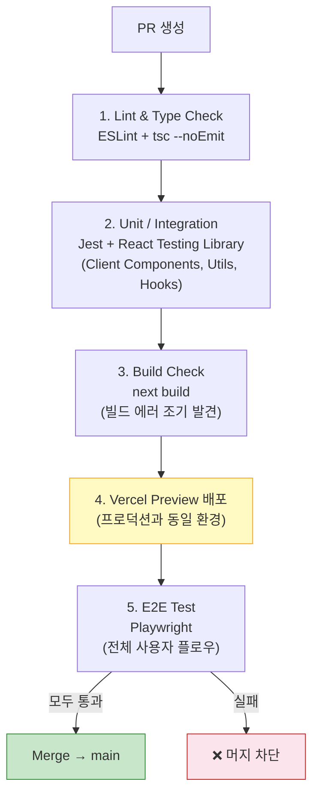

> "테스트 없이 배포는 도박이다." App Router에서 테스트 전략이 달라졌다. Server Component는 E2E로, Client Component는 Unit/Integration으로 — 계층별로 올바른 테스트 도구를 선택하고 GitHub Actions + Vercel로 자동화하는 전체 파이프라인을 구축한다.

## 핵심 요약 (TL;DR)

**테스트 계층:**
- **Unit/Integration (Jest + Testing Library):** Client Component 로직, 유틸 함수, 커스텀 훅
- **E2E (Playwright):** 전체 사용자 시나리오, Server Component 포함, 인증 플로우
- **Server Component:** async 렌더링 특성상 RTL로 직접 렌더링 어려움 → E2E 권장

**CI/CD 파이프라인:**
- PR → GitHub Actions (Lint + Unit Test + Build) → Vercel Preview 배포 → Playwright E2E → Merge

---

## 테스트 전략 전체 구조



---

## 1단계: Jest + Testing Library 설정

### 설치

```bash
npm install -D jest jest-environment-jsdom \
  @testing-library/react @testing-library/dom @testing-library/jest-dom \
  @testing-library/user-event \
  ts-node @types/jest

# MSW (API 모킹)
npm install -D msw

# 또는 create-next-app의 with-jest 예제 사용
npx create-next-app@latest --example with-jest
```

### `jest.config.ts`

```typescript
// jest.config.ts
import type { Config } from 'jest'
import nextJest from 'next/jest.js'

const createJestConfig = nextJest({
  dir: './',  // Next.js 앱 루트 (next.config.ts 위치)
})

const config: Config = {
  coverageProvider: 'v8',
  testEnvironment: 'jsdom',

  // Server Component 테스트는 node 환경 (DOM 불필요)
  // 파일별로 환경 재정의 가능
  // @jest-environment node (파일 최상단 주석으로 설정)

  setupFilesAfterFramework: ['<rootDir>/jest.setup.ts'],

  moduleNameMapper: {
    // '@/*' 경로 알리아스
    '^@/(.*)$': '<rootDir>/src/$1',
  },

  testPathIgnorePatterns: ['<rootDir>/.next/', '<rootDir>/node_modules/', '<rootDir>/e2e/'],
  coverageThreshold: {
    global: {
      branches: 70,
      functions: 75,
      lines: 80,
      statements: 80,
    },
  },
}

export default createJestConfig(config)
```

### `jest.setup.ts`

```typescript
// jest.setup.ts
import '@testing-library/jest-dom'

// fetch 폴리필 (Node 18+ 기본 제공이지만 Jest 환경에서 필요할 수 있음)
global.fetch = jest.fn()

// ResizeObserver 모킹 (Next.js Image 등에서 사용)
global.ResizeObserver = jest.fn().mockImplementation(() => ({
  observe: jest.fn(),
  unobserve: jest.fn(),
  disconnect: jest.fn(),
}))

// IntersectionObserver 모킹
global.IntersectionObserver = jest.fn().mockImplementation(() => ({
  observe: jest.fn(),
  unobserve: jest.fn(),
  disconnect: jest.fn(),
}))
```

---

## 2단계: Client Component 테스트

### 장바구니 버튼 테스트

```tsx
// src/components/__tests__/AddToCartButton.test.tsx
import { render, screen, waitFor } from '@testing-library/react'
import userEvent from '@testing-library/user-event'
import { AddToCartButton } from '../AddToCartButton'

// Zustand 스토어 모킹
jest.mock('@/store/cart-store', () => ({
  useCartStore: jest.fn((selector) => {
    const store = {
      addItem: jest.fn(),
      toggleCart: jest.fn(),
    }
    return selector(store)
  }),
}))

describe('AddToCartButton', () => {
  const mockProduct = {
    id: 1,
    name: '아카시아 꿀 500g',
    price: 25000,
    imageUrl: '/honey.jpg',
  }

  it('상품 이름과 가격이 표시된다', () => {
    render(<AddToCartButton product={mockProduct} />)
    expect(screen.getByText('장바구니 담기')).toBeInTheDocument()
    expect(screen.getByText('25,000원')).toBeInTheDocument()
  })

  it('클릭하면 addItem이 호출된다', async () => {
    const user = userEvent.setup()
    const mockAddItem = jest.fn()
    const mockToggleCart = jest.fn()

    const { useCartStore } = require('@/store/cart-store')
    useCartStore.mockImplementation((selector: any) =>
      selector({ addItem: mockAddItem, toggleCart: mockToggleCart })
    )

    render(<AddToCartButton product={mockProduct} />)
    await user.click(screen.getByRole('button', { name: /장바구니 담기/i }))

    expect(mockAddItem).toHaveBeenCalledWith(mockProduct)
    expect(mockToggleCart).toHaveBeenCalled()
  })

  it('로딩 중에는 버튼이 비활성화된다', async () => {
    const user = userEvent.setup()
    render(<AddToCartButton product={mockProduct} />)

    const button = screen.getByRole('button')
    await user.click(button)

    // 로딩 상태 진입 확인
    expect(button).toBeDisabled()
    await waitFor(() => expect(button).not.toBeDisabled())
  })
})
```

### 커스텀 훅 테스트

```typescript
// src/hooks/__tests__/use-products.test.ts
import { renderHook, waitFor } from '@testing-library/react'
import { QueryClient, QueryClientProvider } from '@tanstack/react-query'
import { useProducts } from '../use-products'
import { server } from '@/mocks/server'
import { http, HttpResponse } from 'msw'

// React Query Provider 래퍼
function createWrapper() {
  const queryClient = new QueryClient({
    defaultOptions: { queries: { retry: false } },
  })
  return ({ children }: { children: React.ReactNode }) => (
    <QueryClientProvider client={queryClient}>{children}</QueryClientProvider>
  )
}

describe('useProducts', () => {
  it('상품 목록을 성공적으로 불러온다', async () => {
    const { result } = renderHook(() => useProducts(), {
      wrapper: createWrapper(),
    })

    // 초기 로딩 상태 확인
    expect(result.current.isLoading).toBe(true)

    // 데이터 로딩 완료 대기
    await waitFor(() => expect(result.current.isSuccess).toBe(true))

    expect(result.current.data?.products).toHaveLength(3)
    expect(result.current.data?.products[0].name).toBe('아카시아 꿀 500g')
  })

  it('API 오류 시 error 상태가 된다', async () => {
    // MSW로 에러 응답 오버라이드
    server.use(
      http.get('/api/products', () =>
        HttpResponse.json({ message: '서버 오류' }, { status: 500 })
      )
    )

    const { result } = renderHook(() => useProducts(), {
      wrapper: createWrapper(),
    })

    await waitFor(() => expect(result.current.isError).toBe(true))
    expect(result.current.error?.message).toBe('상품 목록 로딩 실패')
  })
})
```

### MSW 핸들러 설정

```typescript
// src/mocks/handlers.ts
import { http, HttpResponse } from 'msw'

export const handlers = [
  http.get('/api/products', () => {
    return HttpResponse.json({
      products: [
        { id: 1, name: '아카시아 꿀 500g', price: 25000, stock: 50, imageUrl: '/honey1.jpg' },
        { id: 2, name: '밤꿀 500g', price: 28000, stock: 30, imageUrl: '/honey2.jpg' },
        { id: 3, name: '유채꿀 500g', price: 23000, stock: 0, imageUrl: '/honey3.jpg' },
      ],
      total: 3,
    })
  }),

  http.post('/api/cart', async ({ request }) => {
    const body = await request.json() as { productId: number; quantity: number }
    return HttpResponse.json({ success: true, cartItemId: 101, ...body })
  }),
]

// src/mocks/server.ts (Node.js 환경 - Jest용)
import { setupServer } from 'msw/node'
import { handlers } from './handlers'

export const server = setupServer(...handlers)

// jest.setup.ts에 추가
beforeAll(() => server.listen())
afterEach(() => server.resetHandlers())
afterAll(() => server.close())
```

---

## 3단계: Playwright E2E 테스트

### 설치 및 설정

```bash
npm install -D @playwright/test
npx playwright install  # 브라우저 설치 (Chromium, Firefox, WebKit)
```

```typescript
// playwright.config.ts
import { defineConfig, devices } from '@playwright/test'

export default defineConfig({
  testDir: './e2e',
  fullyParallel: true,
  forbidOnly: !!process.env.CI,  // CI에서 .only 실수 방지
  retries: process.env.CI ? 2 : 0,
  workers: process.env.CI ? 1 : undefined,

  reporter: [
    ['html'],
    ['github'],  // GitHub Actions 어노테이션
  ],

  use: {
    // CI: Vercel Preview URL 사용, 로컬: localhost
    baseURL: process.env.PLAYWRIGHT_TEST_BASE_URL ?? 'http://localhost:3000',
    trace: 'on-first-retry',  // 실패 시 트레이스 저장
    screenshot: 'only-on-failure',
    video: 'retain-on-failure',
  },

  projects: [
    // 인증 상태 설정 (로그인 필요한 테스트용)
    { name: 'setup', testMatch: '**/auth.setup.ts' },

    {
      name: 'chromium',
      use: { ...devices['Desktop Chrome'] },
      dependencies: ['setup'],
    },
    {
      name: 'mobile',
      use: { ...devices['iPhone 14'] },
      dependencies: ['setup'],
    },
  ],

  // 로컬 개발 시 Next.js 서버 자동 시작
  webServer: process.env.CI
    ? undefined  // CI: Vercel Preview URL 사용
    : {
        command: 'npm run dev',
        url: 'http://localhost:3000',
        reuseExistingServer: !process.env.CI,
      },
})
```

### 인증 상태 설정

```typescript
// e2e/auth.setup.ts
import { test as setup, expect } from '@playwright/test'
import path from 'path'

const authFile = path.join(__dirname, '../.playwright/.auth/user.json')

setup('인증 상태 설정', async ({ page }) => {
  await page.goto('/login')

  // 로그인
  await page.getByLabel('이메일').fill('test@honeybarrel.co.kr')
  await page.getByLabel('비밀번호').fill('test1234!')
  await page.getByRole('button', { name: '로그인' }).click()

  // 대시보드로 리다이렉트 확인
  await expect(page).toHaveURL('/dashboard')

  // 인증 상태 저장 (쿠키, localStorage 등)
  await page.context().storageState({ path: authFile })
})
```

### 상품 구매 플로우 E2E 테스트

```typescript
// e2e/purchase-flow.spec.ts
import { test, expect } from '@playwright/test'

test.use({ storageState: '.playwright/.auth/user.json' })

test.describe('상품 구매 플로우', () => {

  test('상품 목록 → 상세 → 장바구니 추가 → 결제 완료', async ({ page }) => {
    // 1. 상품 목록 페이지
    await page.goto('/products')
    await expect(page.getByRole('heading', { name: /상품/i })).toBeVisible()

    // 상품 카드 로딩 확인 (스켈레톤 → 실제 컨텐츠)
    await expect(page.getByTestId('product-card')).toHaveCount(3, { timeout: 5000 })

    // 2. 첫 번째 상품 클릭
    await page.getByTestId('product-card').first().click()
    await expect(page).toHaveURL(/\/products\/\d+/)

    // 3. 상품 상세 페이지 확인
    await expect(page.getByRole('heading', { level: 1 })).toBeVisible()
    const priceText = await page.getByTestId('product-price').textContent()
    expect(priceText).toMatch(/\d{1,3}(,\d{3})*원/)

    // 4. 수량 변경
    await page.getByRole('button', { name: '+' }).click()
    await page.getByRole('button', { name: '+' }).click()
    await expect(page.getByTestId('quantity')).toHaveText('3')

    // 5. 장바구니 담기
    await page.getByRole('button', { name: /장바구니 담기/i }).click()

    // 장바구니 드로어 열림 확인
    await expect(page.getByRole('complementary')).toBeVisible()
    await expect(page.getByText('3')).toBeVisible()  // 수량

    // 6. 결제하기 버튼 클릭
    await page.getByRole('button', { name: '결제하기' }).click()
    await expect(page).toHaveURL('/checkout')
  })

  test('품절 상품은 장바구니 담기 버튼이 비활성화된다', async ({ page }) => {
    // API 응답 모킹 (Playwright Network Interception)
    await page.route('/api/products/999', async (route) => {
      await route.fulfill({
        json: { id: 999, name: '품절 꿀', price: 20000, stock: 0 },
      })
    })

    await page.goto('/products/999')

    const addButton = page.getByRole('button', { name: /장바구니/i })
    await expect(addButton).toBeDisabled()
    await expect(page.getByText('품절')).toBeVisible()
  })

  test('비로그인 사용자가 결제 시도 시 로그인 페이지로 이동', async ({ browser }) => {
    // 인증 없는 새 컨텍스트
    const context = await browser.newContext()
    const page = await context.newPage()

    await page.goto('/checkout')
    await expect(page).toHaveURL(/\/login/)
    await expect(page.getByText(/로그인/i)).toBeVisible()

    await context.close()
  })
})

test.describe('접근성 테스트', () => {
  test('홈 페이지 키보드 네비게이션', async ({ page }) => {
    await page.goto('/')

    // Tab 키로 네비게이션 가능한지 확인
    await page.keyboard.press('Tab')
    const focusedEl = page.locator(':focus')
    await expect(focusedEl).toBeVisible()

    // 첫 번째 링크로 Enter 이동
    await page.keyboard.press('Enter')
    await expect(page).not.toHaveURL('/')  // 페이지 이동 확인
  })
})
```

---

## 4단계: GitHub Actions CI/CD

```yaml
# .github/workflows/ci.yml
name: CI

on:
  push:
    branches: [main]
  pull_request:
    branches: [main]

jobs:
  # ── 1. 코드 품질 검사 ─────────────────────────────────────
  quality:
    name: Lint & Type Check
    runs-on: ubuntu-latest
    steps:
      - uses: actions/checkout@v4
      - uses: actions/setup-node@v4
        with:
          node-version: '20'
          cache: 'npm'
      - run: npm ci
      - run: npm run lint
      - run: npx tsc --noEmit

  # ── 2. 단위/통합 테스트 ──────────────────────────────────
  unit-test:
    name: Unit & Integration Tests
    runs-on: ubuntu-latest
    steps:
      - uses: actions/checkout@v4
      - uses: actions/setup-node@v4
        with:
          node-version: '20'
          cache: 'npm'
      - run: npm ci
      - run: npm test -- --coverage --ci
      - name: Upload coverage to Codecov
        uses: codecov/codecov-action@v4
        with:
          token: ${{ secrets.CODECOV_TOKEN }}

  # ── 3. 빌드 검증 ─────────────────────────────────────────
  build:
    name: Build Check
    runs-on: ubuntu-latest
    steps:
      - uses: actions/checkout@v4
      - uses: actions/setup-node@v4
        with:
          node-version: '20'
          cache: 'npm'
      - run: npm ci
      - run: npm run build
        env:
          # 빌드에 필요한 환경변수
          NEXT_PUBLIC_API_URL: ${{ vars.NEXT_PUBLIC_API_URL }}

  # ── 4. E2E 테스트 (Vercel Preview 배포 후) ───────────────
  e2e:
    name: E2E Tests
    runs-on: ubuntu-latest
    needs: [quality, unit-test, build]  # 앞 단계 통과 후 실행
    steps:
      - uses: actions/checkout@v4
      - uses: actions/setup-node@v4
        with:
          node-version: '20'
          cache: 'npm'
      - run: npm ci
      - name: Install Playwright Browsers
        run: npx playwright install --with-deps chromium
      - name: Wait for Vercel Preview
        uses: patrickedqvist/wait-for-vercel-preview@v1.2.0
        id: vercel-preview
        with:
          token: ${{ secrets.GITHUB_TOKEN }}
          max_timeout: 300  # 5분 대기
      - name: Run Playwright E2E
        run: npx playwright test
        env:
          PLAYWRIGHT_TEST_BASE_URL: ${{ steps.vercel-preview.outputs.url }}
      - name: Upload Playwright Report
        if: always()  # 실패해도 리포트 업로드
        uses: actions/upload-artifact@v4
        with:
          name: playwright-report
          path: playwright-report/
          retention-days: 7
```

---

## `package.json` 스크립트

```json
{
  "scripts": {
    "dev": "next dev",
    "build": "next build",
    "start": "next start",
    "lint": "next lint",
    "test": "jest",
    "test:watch": "jest --watch",
    "test:coverage": "jest --coverage",
    "test:e2e": "playwright test",
    "test:e2e:ui": "playwright test --ui",
    "test:e2e:headed": "playwright test --headed",
    "type-check": "tsc --noEmit"
  }
}
```

---

## 테스트 전략 결정 가이드

```
Server Component 테스트:
  ❌ Jest + RTL로 직접 렌더링 → async 데이터 페칭 처리 복잡
  ✅ Playwright E2E → 실제 브라우저에서 렌더링 검증

Client Component 테스트:
  ✅ Jest + Testing Library → 빠르고 격리된 단위 테스트
  ✅ userEvent로 실제 사용자 상호작용 시뮬레이션
  ✅ MSW로 API 모킹 → 네트워크 독립성

인증 플로우:
  ❌ Unit Test → 실제 쿠키/세션 불가
  ✅ Playwright storageState → 로그인 상태 재사용

성능 예산 (CI에서 자동 확인):
  - 단위 테스트: 30초 이내
  - 빌드: 3분 이내
  - E2E: 10분 이내 (병렬 실행)
```

---

## 트레이드오프 요약

| 도구 | 용도 | 속도 | 현실성 | 유지비용 |
|------|------|------|--------|---------|
| **Jest + RTL** | Client 컴포넌트, 훅, 유틸 | ⚡⚡⚡ 빠름 | 모킹 필요 | 낮음 |
| **Playwright** | 전체 사용자 플로우 | 🐢 느림 | 실제 브라우저 | 중간 |
| **MSW** | API 모킹 | ⚡⚡ | 현실적 | 낮음 |

---

## 시리즈 안내

| Part | 주제 | 상태 |
|------|------|------|
| Part 1 | App Router 시작하기 | ✅ |
| Part 2 | 데이터 페칭과 캐싱 | ✅ |
| Part 3 | 인증과 미들웨어 | ✅ |
| Part 4 | 상태 관리와 클라이언트 패턴 | ✅ |
| **Part 5** | **테스트와 CI/CD** | 현재 글 |
| Part 6 | 배포와 운영 | 예정 |

---

## 레퍼런스

### 공식 문서
- [Testing: Jest — Next.js](https://nextjs.org/docs/app/guides/testing/jest) — Next.js 공식 Jest 설정 가이드
- [Playwright Documentation](https://playwright.dev/docs/intro) — Playwright 공식 문서

### 기술 블로그
- [E2E Testing with Playwright, Vercel & GitHub Actions — enreina.com](https://enreina.com/blog/e2e-testing-in-next-js-with-playwright-vercel-and-github-actions-a-guide-with-example/) — Vercel Preview + Playwright 통합 가이드
- [Testing Next.js with Jest & RTL in 2025 — Medium](https://medium.com/@sureshdotariya/testing-next-js-components-with-jest-and-react-testing-library-in-2025-478ecf7dcb7d) — App Router 시대 테스트 셋업 (2025)
- [Integrating Playwright with Vercel — This Dot Labs](https://www.thisdot.co/blog/integrating-playwright-tests-into-your-github-workflow-with-vercel) — GitHub Actions + Vercel 통합 실전 (2025)

---

*이 포스트는 [HoneyByte](https://blog.honeybarrel.co.kr) Next.js Deep Dive 시리즈의 일부입니다.*
