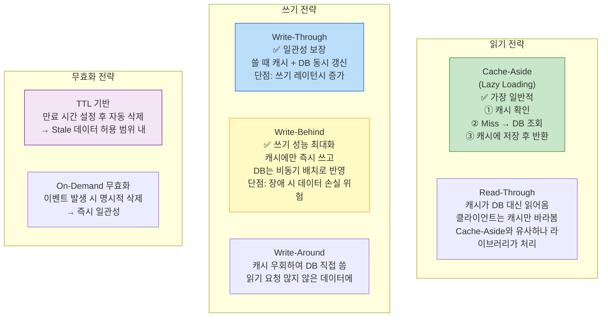
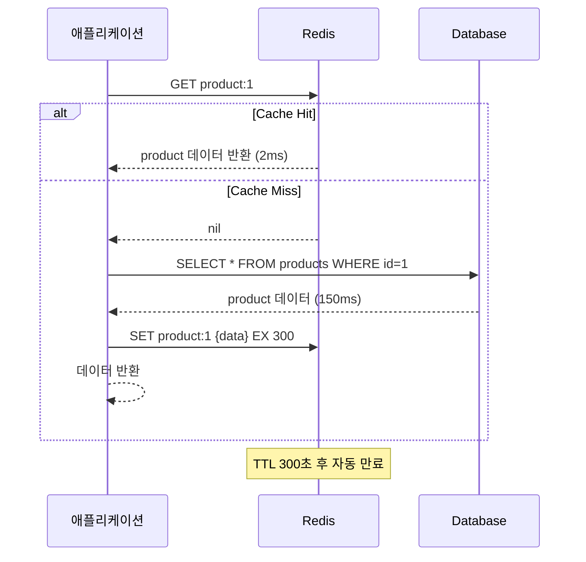
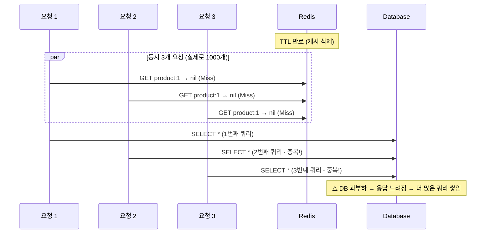

> 서비스가 느리다. DB 응답이 200ms다. Redis를 붙이면 2ms로 줄어든다. 하지만 잘못 붙이면 캐시와 DB 데이터가 달라지고, 트래픽이 몰리면 캐시 스탬피드로 DB가 죽는다. 캐시는 쓰는 법보다 **무효화하는 법**이 더 어렵다.

## 핵심 요약 (TL;DR)

캐싱은 자주 읽히고 변경이 적은 데이터를 빠른 저장소(Redis, Memcached)에 두어 DB 부하를 줄이는 기법이다. 4가지 주요 전략:

- **Cache-Aside (Lazy Loading):** 읽을 때 캐시에 없으면 DB에서 읽어 캐시에 저장. 가장 일반적.
- **Read-Through:** 캐시가 DB에서 직접 읽어옴. 클라이언트는 캐시만 바라봄.
- **Write-Through:** 쓸 때 캐시와 DB에 동시에 씀. 데이터 일관성 보장.
- **Write-Behind (Write-Back):** 캐시에만 쓰고, 비동기로 나중에 DB에 반영. 쓰기 성능 최적화.

---

## 캐싱 전략 비교 전체 구조



---

## Cache-Aside (Lazy Loading)

가장 널리 쓰이는 패턴. 읽기 요청이 왔을 때만 캐시에 올린다.



### Spring Boot 구현

```java
// build.gradle.kts
// implementation("org.springframework.boot:spring-boot-starter-data-redis")
// implementation("org.springframework.boot:spring-boot-starter-cache")

// application.yml
spring:
  data:
    redis:
      host: localhost
      port: 6379
      timeout: 2000ms
      lettuce:
        pool:
          max-active: 20
          max-idle: 10
          min-idle: 5
  cache:
    type: redis
    redis:
      time-to-live: 300000  # 5분 (ms)
      cache-null-values: false

// Redis Config
@Configuration
@EnableCaching
public class RedisConfig {

    @Bean
    public RedisTemplate<String, Object> redisTemplate(RedisConnectionFactory factory) {
        RedisTemplate<String, Object> template = new RedisTemplate<>();
        template.setConnectionFactory(factory);

        // JSON 직렬화 (기본 JDK 직렬화 대신)
        Jackson2JsonRedisSerializer<Object> serializer =
                new Jackson2JsonRedisSerializer<>(Object.class);

        template.setKeySerializer(new StringRedisSerializer());
        template.setValueSerializer(serializer);
        template.setHashKeySerializer(new StringRedisSerializer());
        template.setHashValueSerializer(serializer);
        return template;
    }

    @Bean
    public CacheManager cacheManager(RedisConnectionFactory factory) {
        RedisCacheConfiguration config = RedisCacheConfiguration.defaultCacheConfig()
                .entryTtl(Duration.ofMinutes(5))
                .serializeKeysWith(RedisSerializationContext.SerializationPair.fromSerializer(
                        new StringRedisSerializer()))
                .serializeValuesWith(RedisSerializationContext.SerializationPair.fromSerializer(
                        new GenericJackson2JsonRedisSerializer()))
                .disableCachingNullValues();

        return RedisCacheManager.builder(factory)
                .cacheDefaults(config)
                .withCacheConfiguration("products", config.entryTtl(Duration.ofMinutes(10)))
                .withCacheConfiguration("users", config.entryTtl(Duration.ofHours(1)))
                .build();
    }
}

// Service 계층 — @Cacheable로 Cache-Aside 자동 적용
@Service
@RequiredArgsConstructor
public class ProductService {

    private final ProductRepository productRepository;
    private final RedisTemplate<String, Object> redisTemplate;

    // @Cacheable: 캐시 있으면 반환, 없으면 메서드 실행 후 캐시 저장
    @Cacheable(value = "products", key = "#id", unless = "#result == null")
    public ProductDto getProduct(Long id) {
        return productRepository.findById(id)
                .map(ProductDto::from)
                .orElseThrow(() -> new NotFoundException("상품 없음: " + id));
    }

    @Cacheable(value = "products", key = "'list:' + #category + ':' + #page")
    public Page<ProductDto> getProducts(String category, int page) {
        return productRepository.findByCategory(category, PageRequest.of(page, 20))
                .map(ProductDto::from);
    }

    // @CachePut: 메서드 실행 후 캐시 갱신 (Write-Through 패턴)
    @CachePut(value = "products", key = "#result.id")
    @Transactional
    public ProductDto updateProduct(Long id, UpdateProductRequest request) {
        Product product = productRepository.findById(id)
                .orElseThrow(() -> new NotFoundException("상품 없음"));
        product.update(request);
        return ProductDto.from(productRepository.save(product));
    }

    // @CacheEvict: 캐시 삭제 (무효화)
    @CacheEvict(value = "products", key = "#id")
    @Transactional
    public void deleteProduct(Long id) {
        productRepository.deleteById(id);
    }

    // 여러 캐시 동시 무효화
    @Caching(evict = {
        @CacheEvict(value = "products", key = "#id"),
        @CacheEvict(value = "products", allEntries = true)  // 목록 캐시 전체 삭제
    })
    @Transactional
    public void deleteProductAndClearList(Long id) {
        productRepository.deleteById(id);
    }
}
```

### 수동 Cache-Aside (정밀 제어)

```java
@Service
@RequiredArgsConstructor
public class ManualCacheService {

    private final RedisTemplate<String, Object> redisTemplate;
    private final ProductRepository productRepository;

    private static final String PRODUCT_KEY = "product:";
    private static final Duration PRODUCT_TTL = Duration.ofMinutes(10);

    public ProductDto getProductWithCache(Long id) {
        String key = PRODUCT_KEY + id;

        // 1. 캐시 확인
        ProductDto cached = (ProductDto) redisTemplate.opsForValue().get(key);
        if (cached != null) {
            return cached;  // Cache Hit
        }

        // 2. DB 조회 (Cache Miss)
        ProductDto product = productRepository.findById(id)
                .map(ProductDto::from)
                .orElseThrow(() -> new NotFoundException("상품 없음"));

        // 3. 캐시 저장 (TTL 설정)
        redisTemplate.opsForValue().set(key, product, PRODUCT_TTL);

        return product;
    }

    // 조건부 TTL: 재고 있는 상품은 짧게, 없는 상품은 길게
    public ProductDto getProductAdaptiveTtl(Long id) {
        String key = PRODUCT_KEY + id;
        ProductDto cached = (ProductDto) redisTemplate.opsForValue().get(key);
        if (cached != null) return cached;

        ProductDto product = productRepository.findById(id)
                .map(ProductDto::from)
                .orElseThrow(() -> new NotFoundException("상품 없음"));

        // 재고 있으면 짧은 TTL (자주 변함), 품절이면 긴 TTL
        Duration ttl = product.getStock() > 0
                ? Duration.ofMinutes(5)
                : Duration.ofHours(1);

        redisTemplate.opsForValue().set(key, product, ttl);
        return product;
    }
}
```

---

## Write-Through

```java
// 쓰기 시 DB와 캐시를 동시에 갱신 → 일관성 보장, 쓰기 레이턴시 증가
@Transactional
public ProductDto writeThrough(Long id, UpdateProductRequest request) {
    // 1. DB 갱신
    Product product = productRepository.findById(id).orElseThrow();
    product.update(request);
    productRepository.save(product);

    // 2. 캐시 즉시 갱신 (DB 성공 후)
    ProductDto dto = ProductDto.from(product);
    redisTemplate.opsForValue().set(PRODUCT_KEY + id, dto, PRODUCT_TTL);

    return dto;
}
```

---

## Write-Behind (Write-Back)

```java
// 캐시에 먼저 쓰고, DB는 비동기/배치로 나중에 반영
// 쓰기 성능 극대화, 장애 시 데이터 손실 위험

@Service
@RequiredArgsConstructor
public class WriteBehindCacheService {

    private final RedisTemplate<String, Object> redisTemplate;
    private final ProductRepository productRepository;

    private static final String DIRTY_SET_KEY = "dirty:products";

    @Async
    public CompletableFuture<ProductDto> writeBehind(Long id, UpdateProductRequest request) {
        String key = PRODUCT_KEY + id;

        // 1. 캐시 즉시 갱신 (클라이언트는 빠른 응답)
        ProductDto dto = buildDto(id, request);
        redisTemplate.opsForValue().set(key, dto, Duration.ofMinutes(10));

        // 2. "더티 목록"에 추가 (DB 반영 필요 표시)
        redisTemplate.opsForSet().add(DIRTY_SET_KEY, String.valueOf(id));

        return CompletableFuture.completedFuture(dto);
    }

    // 스케줄러로 주기적으로 더티 목록을 DB에 플러시
    @Scheduled(fixedDelay = 5000)  // 5초마다
    public void flushDirtyToDB() {
        Set<Object> dirtyIds = redisTemplate.opsForSet().members(DIRTY_SET_KEY);
        if (dirtyIds == null || dirtyIds.isEmpty()) return;

        for (Object idObj : dirtyIds) {
            Long id = Long.parseLong(idObj.toString());
            String key = PRODUCT_KEY + id;

            ProductDto cached = (ProductDto) redisTemplate.opsForValue().get(key);
            if (cached != null) {
                // DB 반영
                productRepository.save(cached.toEntity());
                redisTemplate.opsForSet().remove(DIRTY_SET_KEY, idObj);
            }
        }
    }
}
```

---

## Deep Dive: Cache Stampede (캐시 스탬피드)

**상황:** 인기 상품 캐시가 TTL 만료 → 동시 요청 1000개가 모두 DB로 → DB 과부하 → 장애



### 해결 1: Redis NX 분산 락

```java
public ProductDto getProductWithLock(Long id) {
    String key = PRODUCT_KEY + id;
    String lockKey = "lock:" + key;

    // 캐시 확인
    ProductDto cached = (ProductDto) redisTemplate.opsForValue().get(key);
    if (cached != null) return cached;

    // 분산 락 획득 시도 (SET NX EX)
    Boolean acquired = redisTemplate.opsForValue()
            .setIfAbsent(lockKey, "1", Duration.ofSeconds(5));

    if (Boolean.TRUE.equals(acquired)) {
        try {
            // 락 획득 성공 → 이 스레드만 DB 조회
            ProductDto product = productRepository.findById(id)
                    .map(ProductDto::from)
                    .orElseThrow();
            redisTemplate.opsForValue().set(key, product, PRODUCT_TTL);
            return product;
        } finally {
            redisTemplate.delete(lockKey);  // 락 해제
        }
    } else {
        // 락 획득 실패 → 짧게 대기 후 캐시 재시도
        try { Thread.sleep(50); } catch (InterruptedException ignored) {}
        return getProductWithLock(id);  // 재귀 재시도
    }
}
```

### 해결 2: 조기 갱신 (Early Revalidation / Probabilistic Early Expiration)

```java
// 만료 시간이 다가오면 확률적으로 미리 갱신
// → 만료 순간 동시 요청을 방지
public ProductDto getProductWithEarlyExpiry(Long id) {
    String key = PRODUCT_KEY + id;
    Duration ttl = redisTemplate.getExpire(key, TimeUnit.SECONDS) != null
            ? Duration.ofSeconds(redisTemplate.getExpire(key, TimeUnit.SECONDS))
            : Duration.ZERO;

    ProductDto cached = (ProductDto) redisTemplate.opsForValue().get(key);

    // TTL이 30초 미만이고 5% 확률로 미리 갱신
    if (cached != null && ttl.getSeconds() > 30) {
        return cached;
    }

    if (cached != null && Math.random() > 0.95) {
        // 백그라운드에서 비동기 갱신
        CompletableFuture.runAsync(() -> {
            ProductDto fresh = productRepository.findById(id).map(ProductDto::from).orElseThrow();
            redisTemplate.opsForValue().set(key, fresh, PRODUCT_TTL);
        });
        return cached;  // 기존 캐시 반환하며 백그라운드 갱신
    }

    // Cache Miss: DB 조회
    ProductDto product = productRepository.findById(id).map(ProductDto::from).orElseThrow();
    redisTemplate.opsForValue().set(key, product, PRODUCT_TTL);
    return product;
}
```

---

## 실무 Redis 설정 — 메모리와 Eviction

```bash
# redis.conf (운영 필수 설정)
maxmemory 2gb                    # 최대 메모리 제한
maxmemory-policy allkeys-lru     # 메모리 가득 차면 가장 오래 안 쓴 키 제거

# Eviction 정책 비교:
# noeviction     : 메모리 초과 시 쓰기 에러 (캐시로 쓰면 안 됨)
# allkeys-lru    : 전체 키 중 LRU 제거 (캐시에 권장)
# volatile-lru   : TTL 있는 키 중 LRU 제거
# allkeys-lfu    : 접근 빈도 기반 제거 (Redis 4.0+, 핫 데이터 보호)

# 지속성 (캐시 용도면 끄거나 AOF만)
save ""                          # RDB 스냅샷 비활성화 (캐시 전용)
appendonly yes                   # AOF (중요 데이터 포함 시)
```

---

## 실무 장애 사례

```
사례 1: Cache Stampede — 이벤트 오픈 순간 Redis TTL 만료
  상황: 오픈 이벤트 상품 캐시가 하필 행사 시작 1분 전 만료
  → 트래픽 폭증과 동시에 캐시 Miss → DB CPU 100% → 서비스 다운
  → 해결: 이벤트 전 TTL 연장 + 분산 락 적용 + 읽기 전용 복제본(Redis Replica)

사례 2: Cache Poisoning — 잘못된 데이터가 캐시에 저장
  상황: 재고 0인 상품이 캐시에 '재고 있음'으로 저장
  → 결제는 성공하지만 실제 재고 없어 주문 취소 폭발
  → 해결: Write-Through 도입, 재고 변경 즉시 캐시 무효화 이벤트

사례 3: 캐시 키 충돌 — 다른 서비스가 같은 Redis 공유
  상황: 두 서비스가 product:1을 다른 형식으로 저장
  → 한 서비스 배포 후 다른 서비스 오동작
  → 해결: 서비스별 키 프리픽스 필수 (service-a:product:1, service-b:product:1)

사례 4: 메모리 부족으로 eviction 폭풍
  상황: maxmemory 설정 없이 운영 → 메모리 가득 참 → OOM Killer → Redis 재시작
  → 모든 캐시 삭제 → DB에 전체 트래픽 → 연쇄 장애
  → 해결: maxmemory + allkeys-lru 정책 + 알람 설정 (70% 사용 시 경보)
```

---

## 캐싱 전략 선택 가이드

| 상황 | 권장 전략 | 이유 |
|------|----------|------|
| 읽기 많음, 쓰기 적음 | Cache-Aside + TTL | 구현 단순, 자연스러운 무효화 |
| 읽기/쓰기 균형, 일관성 중요 | Write-Through | 캐시와 DB 항상 동기 |
| 쓰기 매우 많음 | Write-Behind | DB 쓰기 I/O 최소화 |
| 장애 허용 안 됨 | On-Demand 무효화 | 이벤트 기반 즉시 무효화 |
| Stale 허용 (일부) | TTL + Cache-Aside | 복잡도 최소화 |

---

## 면접 Q&A

| 레벨 | 질문 | 핵심 답변 |
|------|------|----------|
| 🟢 기초 | Cache Hit와 Cache Miss의 차이는? | Hit: 캐시에 데이터 있어 빠르게 반환. Miss: 캐시에 없어 원본(DB) 조회 필요. Cache Hit Rate = Hit / (Hit + Miss) |
| 🟡 중급 | Cache-Aside와 Read-Through의 차이는? | Cache-Aside: 애플리케이션이 직접 캐시/DB 관리. Read-Through: 캐시 레이어가 투명하게 DB 조회 처리. 동작은 비슷하나 책임 주체가 다름 |
| 🟡 중급 | TTL은 어떻게 설정하는가? | 데이터 변경 빈도와 Stale 허용 기간 기준. 실시간 재고: 30초, 상품 정보: 5~10분, 카테고리: 1시간. 너무 짧으면 Cache Miss 폭발, 너무 길면 Stale 데이터 |
| 🔴 심화 | Cache Stampede란 무엇이고 어떻게 방어하는가? | 캐시 만료 순간 다수 요청이 동시에 DB 조회 → DB 과부하. 방어: ① Redis SET NX 분산 락 (한 스레드만 DB 조회) ② Probabilistic Early Expiration (만료 전 미리 갱신) ③ 만료 시간 분산 (TTL에 랜덤 jitter 추가) |
| 🔴 시니어 | Write-Through와 Write-Behind의 트레이드오프는? | Write-Through: 일관성 보장, 쓰기 레이턴시 증가(캐시+DB 동시 쓰기), 사용 안 된 데이터도 캐시에 올라감. Write-Behind: 쓰기 속도 극대화, 장애 시 유실 위험(캐시 데이터가 DB에 반영 안 된 상태), 구현 복잡도 높음. 금융/결제: Write-Through, 로그/통계: Write-Behind |

---

## 정리

| 항목 | 설명 |
|------|------|
| **핵심 키워드** | Cache-Aside, Read-Through, Write-Through, Write-Behind, TTL, Eviction, Cache Stampede, Redis NX 락 |
| **연관 개념** | CDN 캐싱, HTTP 캐시(ETag, Cache-Control), DB 쿼리 캐시, CPU L1/L2 캐시 계층 |
| **실무 결정** | maxmemory + allkeys-lru 필수 설정, 키 프리픽스 네이밍 컨벤션, Stampede 방어 |

---

## 레퍼런스

### 영상
- [freeCodeCamp.org (@freecodecamp)](https://www.youtube.com/@freecodecamp) — Redis 풀코스 + 캐싱 전략 강의
- [쉬운코드 (@ezcd)](https://www.youtube.com/@ezcd) — 시니어 관점의 캐싱/DB 설계 실무

### 문서 & 기사
- [Cache Optimization Strategies — Redis.io](https://redis.io/blog/guide-to-cache-optimization-strategies/) — Redis 공식 캐시 최적화 가이드 (2026.02)
- [Why Caching Strategies Might Be Holding You Back — Redis.io](https://redis.io/blog/why-your-caching-strategies-might-be-holding-you-back-and-what-to-consider-next/) — Redis 공식 전략 비교 (2025.10)
- [Thundering Herd Problem — HowTech](https://howtech.substack.com/p/thundering-herd-problem-cache-stampede) — Cache Stampede 해결법 심화 (2025)
- [Cache Stampede — Wikipedia](https://en.wikipedia.org/wiki/Cache_stampede) — 개념 정의 및 학술 참고

---

*이 포스트는 [HoneyByte](https://blog.honeybarrel.co.kr) CS Study 시리즈의 일부입니다.*
