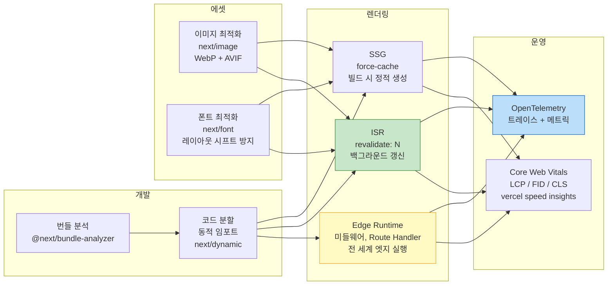

> 좋은 Next.js 앱은 빠른 앱이다. Core Web Vitals(LCP, FID, CLS)가 SEO와 사용자 경험을 결정한다. 번들 분석으로 무거운 의존성을 발견하고, `next/image`로 이미지를 최적화하며, ISR과 Edge Runtime으로 렌더링을 정밀하게 조율한다. 그리고 OpenTelemetry로 프로덕션을 관찰한다.

## 핵심 요약 (TL;DR)

**성능 최적화 체크리스트:**
1. **번들 분석** → `@next/bundle-analyzer`로 무거운 패키지 발견 → 동적 임포트/트리 쉐이킹
2. **이미지 최적화** → `next/image`로 WebP 변환 + 사이즈 자동 조정 + lazy loading
3. **렌더링 전략** → 변경 없는 데이터: SSG, 주기적 변경: ISR, 실시간: SSR
4. **Edge Runtime** → 미들웨어 + 일부 Route Handler → 전 세계 엣지에서 실행 (낮은 지연)
5. **모니터링** → OpenTelemetry + `instrumentation.ts` → 트레이스, 메트릭, 로그

---

## 성능 최적화 전체 흐름



---

## 1. 번들 분석과 코드 분할

### 설치 및 설정

```bash
npm install -D @next/bundle-analyzer
```

```typescript
// next.config.ts
import type { NextConfig } from 'next'
import bundleAnalyzer from '@next/bundle-analyzer'

const withBundleAnalyzer = bundleAnalyzer({
  enabled: process.env.ANALYZE === 'true',
})

const nextConfig: NextConfig = {
  // 실험적 기능: PPR (Partial Prerendering) — Next.js 15+
  experimental: {
    ppr: false,  // 안정화 후 true
  },

  // 외부 패키지 번들링 제어 (App Router)
  serverExternalPackages: ['sharp'],  // 서버에서만, 번들에 포함 안 함

  // 컴파일러 최적화
  compiler: {
    removeConsole: process.env.NODE_ENV === 'production'
      ? { exclude: ['error'] }  // 프로덕션: console.log 제거, error만 유지
      : false,
  },
}

export default withBundleAnalyzer(nextConfig)
```

```bash
# 번들 분석 실행 — 브라우저에서 시각화 리포트 열림
ANALYZE=true npm run build
# .next/analyze/client.html → 브라우저 번들
# .next/analyze/nodejs.html → 서버 번들
# .next/analyze/edge.html   → Edge Runtime 번들
```

### 동적 임포트로 번들 분할

```typescript
// ❌ 무거운 라이브러리를 최상단에 정적 임포트
import { Chart } from 'chart.js'        // 200KB — 모든 페이지에 포함
import { Editor } from '@tiptap/react'  // 150KB — 에디터 페이지에서만 필요

// ✅ 동적 임포트 — 필요한 순간에만 로딩
import dynamic from 'next/dynamic'

// SSR 비활성화: 브라우저에서만 동작하는 컴포넌트
const Chart = dynamic(
  () => import('@/components/analytics/SalesChart'),
  {
    ssr: false,  // window, document 사용하는 컴포넌트
    loading: () => <ChartSkeleton />,
  }
)

// 사용자가 에디터를 열 때만 로딩 (코드 스플리팅)
const RichTextEditor = dynamic(
  () => import('@/components/editor/RichTextEditor'),
  { loading: () => <EditorSkeleton /> }
)

// 뷰포트 진입 시 로딩 (Intersection Observer)
export function ProductDetailPage() {
  return (
    <div>
      <ProductInfo />
      {/* 스크롤 내려야 보이는 섹션 — 초기 번들에서 제외 */}
      <React.Suspense fallback={<ReviewsSkeleton />}>
        <ReviewSection />
      </React.Suspense>
    </div>
  )
}
```

---

## 2. 이미지 최적화

```tsx
// src/components/ProductCard.tsx
import Image from 'next/image'

// ── 기본 최적화 ───────────────────────────────────────────
export function ProductCard({ product }: { product: Product }) {
  return (
    <div className="group relative overflow-hidden rounded-xl">
      <Image
        src={product.imageUrl}
        alt={product.name}
        width={400}
        height={400}
        // WebP/AVIF 자동 변환 + srcset 자동 생성
        // sizes: 뷰포트별 최적 이미지 크기 힌트
        sizes="(max-width: 768px) 100vw, (max-width: 1200px) 50vw, 33vw"
        className="object-cover transition-transform group-hover:scale-105"
        // placeholder: 저해상도 블러 미리보기 (Layout Shift 방지)
        placeholder="blur"
        blurDataURL="data:image/jpeg;base64,/9j/4AAQSkZJRgABAQAAAQABAAD/..."
        loading="lazy"         // 기본값 (뷰포트 밖 이미지)
      />
    </div>
  )
}

// ── LCP 이미지 (히어로): priority=true ──────────────────
export function HeroImage() {
  return (
    <Image
      src="/hero-honey.jpg"
      alt="HoneyBarrel 대표 이미지"
      fill                  // 부모 컨테이너를 채움 (position: relative 필요)
      priority              // ⚡ LCP 이미지: 프리로드 → 빠른 첫 화면
      quality={90}          // 기본값 75, 히어로는 고품질
      sizes="100vw"
      className="object-cover"
    />
  )
}
```

### 외부 이미지 도메인 허용

```typescript
// next.config.ts
const nextConfig: NextConfig = {
  images: {
    remotePatterns: [
      {
        protocol: 'https',
        hostname: 'cdn.honeybarrel.co.kr',
        pathname: '/images/**',
      },
      {
        protocol: 'https',
        hostname: '**.unsplash.com',  // 와일드카드 서브도메인
      },
    ],
    formats: ['image/avif', 'image/webp'],  // AVIF 우선 (더 작음)
    minimumCacheTTL: 60 * 60 * 24 * 7,     // 이미지 캐시 7일
  },
}
```

---

## 3. 폰트 최적화

```typescript
// src/app/layout.tsx
import { Noto_Sans_KR, Inter } from 'next/font/google'

// 시스템 폰트 최적화 — 레이아웃 시프트(CLS) 방지
// 폰트를 CSS 변수로 주입 → FOUT(Flash Of Unstyled Text) 없음
const notoSansKR = Noto_Sans_KR({
  subsets: ['latin'],
  weight: ['400', '500', '700'],
  display: 'swap',        // 폰트 로딩 중 시스템 폰트 표시
  variable: '--font-noto', // CSS 변수로 노출
  preload: true,
})

const inter = Inter({
  subsets: ['latin'],
  variable: '--font-inter',
})

export default function RootLayout({ children }: { children: React.ReactNode }) {
  return (
    // CSS 변수를 body에 적용
    <html lang="ko" className={`${notoSansKR.variable} ${inter.variable}`}>
      <body className="font-noto">
        {children}
      </body>
    </html>
  )
}
```

```css
/* tailwind.config.ts에서 CSS 변수 연결 */
/* fontFamily: { noto: ['var(--font-noto)', 'sans-serif'] } */
```

---

## 4. ISR + 렌더링 전략

```typescript
// 페이지별 렌더링 전략 명시적 설정
// src/app/products/page.tsx
export const revalidate = 300  // 5분 ISR (파일 레벨)
export const dynamic = 'auto'  // 기본값

// src/app/cart/page.tsx
export const dynamic = 'force-dynamic'  // 항상 SSR (개인 데이터)

// src/app/about/page.tsx
export const dynamic = 'force-static'  // 빌드 시 정적 생성 강제

// ── 동적 경로의 정적 생성 (generateStaticParams) ─────────
// src/app/products/[id]/page.tsx
export async function generateStaticParams() {
  // 빌드 시 상위 N개 상품을 미리 생성
  const topProducts = await getTopProducts(100)
  return topProducts.map(p => ({ id: String(p.id) }))
}

export const dynamicParams = true  // 목록에 없는 ID는 on-demand 생성
export const revalidate = 600      // 10분 ISR
```

---

## 5. Edge Runtime — 전 세계 엣지에서 실행

```typescript
// src/middleware.ts — 이미 Edge Runtime (기본)
// src/app/api/geo/route.ts — Edge Route Handler
export const runtime = 'edge'  // Node.js 대신 Edge Runtime

import { NextRequest, NextResponse } from 'next/server'

export async function GET(request: NextRequest) {
  // Edge Runtime에서 가능:
  const geo = request.geo        // 사용자 위치 (Vercel)
  const ip = request.ip          // IP 주소
  const ua = request.headers.get('user-agent') ?? ''

  // ❌ Edge Runtime에서 불가:
  // - Prisma (Node.js API 의존)
  // - fs, path 등 Node.js 내장 모듈
  // - 대부분의 npm 패키지 (Edge 호환 패키지만 가능)

  // ✅ 가능: fetch, Web Crypto API, URL, Headers, Response
  const data = await fetch('https://api.honeybarrel.co.kr/config', {
    next: { revalidate: 3600 },
  }).then(r => r.json())

  return NextResponse.json({
    country: geo?.country ?? 'KR',
    city: geo?.city,
    data,
  })
}
```

### Edge vs Node.js 선택 가이드

```
Edge Runtime 적합:
  ✅ 인증 검증 (JWT 서명 검증)
  ✅ 지역별 리다이렉트 (geo 기반)
  ✅ A/B 테스트 쿠키 설정
  ✅ Rate Limiting (단순)
  ✅ 헤더 조작

Node.js Runtime 필요:
  ✅ DB 접근 (Prisma, pg 등)
  ✅ 파일 시스템 (sharp, pdf 생성)
  ✅ Node.js 전용 npm 패키지
  ✅ 복잡한 비즈니스 로직
```

---

## 6. OpenTelemetry 모니터링

### 설치 및 설정

```bash
npm install @vercel/otel @opentelemetry/api
```

```typescript
// src/instrumentation.ts (Next.js 내장 진입점)
import { registerOTel } from '@vercel/otel'

export function register() {
  registerOTel({
    serviceName: 'honeybarrel-web',
    // Vercel: 자동 연결
    // 자체 호스팅: OTEL_EXPORTER_OTLP_ENDPOINT 환경변수로 Collector 설정
  })
}
```

### 커스텀 트레이싱

```typescript
// src/lib/tracing.ts
import { trace, context, SpanStatusCode } from '@opentelemetry/api'

const tracer = trace.getTracer('honeybarrel')

// 함수를 스팬으로 래핑하는 유틸리티
export async function withSpan<T>(
  name: string,
  attributes: Record<string, string | number | boolean>,
  fn: () => Promise<T>
): Promise<T> {
  return tracer.startActiveSpan(name, async (span) => {
    try {
      Object.entries(attributes).forEach(([k, v]) => span.setAttribute(k, v))
      const result = await fn()
      span.setStatus({ code: SpanStatusCode.OK })
      return result
    } catch (error) {
      span.setStatus({
        code: SpanStatusCode.ERROR,
        message: error instanceof Error ? error.message : 'Unknown error',
      })
      span.recordException(error as Error)
      throw error
    } finally {
      span.end()
    }
  })
}

// 사용 예: 주요 비즈니스 로직 추적
export async function getProductWithTracing(id: number) {
  return withSpan(
    'product.get',
    { 'product.id': id, 'db.system': 'postgresql' },
    () => productRepository.findById(id)
  )
}
```

### Core Web Vitals 측정

```typescript
// src/app/layout.tsx
import { SpeedInsights } from '@vercel/speed-insights/next'
import { Analytics } from '@vercel/analytics/react'

export default function RootLayout({ children }: { children: React.ReactNode }) {
  return (
    <html lang="ko">
      <body>
        {children}
        {/* Core Web Vitals (LCP, FID, CLS) 자동 수집 */}
        <SpeedInsights />
        {/* 페이지뷰, 방문자 추적 */}
        <Analytics />
      </body>
    </html>
  )
}

// 커스텀 Web Vitals 리포팅 (자체 분석 서버)
// src/app/_components/WebVitals.tsx
'use client'

import { useReportWebVitals } from 'next/dist/client/components/web-vitals'

export function WebVitals() {
  useReportWebVitals((metric) => {
    // 자체 분석 엔드포인트로 전송
    const body = JSON.stringify({
      name: metric.name,
      value: metric.value,
      rating: metric.rating,   // 'good' | 'needs-improvement' | 'poor'
      id: metric.id,
    })

    if (navigator.sendBeacon) {
      navigator.sendBeacon('/api/vitals', body)  // 페이지 이동 시에도 전송
    } else {
      fetch('/api/vitals', { method: 'POST', body, keepalive: true })
    }
  })
  return null
}
```

---

## 7. 프로덕션 배포 체크리스트

```typescript
// next.config.ts — 프로덕션 필수 설정
const nextConfig: NextConfig = {
  // 보안 헤더
  async headers() {
    return [
      {
        source: '/(.*)',
        headers: [
          { key: 'X-Frame-Options', value: 'DENY' },
          { key: 'X-Content-Type-Options', value: 'nosniff' },
          { key: 'Referrer-Policy', value: 'strict-origin-when-cross-origin' },
          {
            key: 'Content-Security-Policy',
            value: [
              "default-src 'self'",
              "img-src 'self' data: https://cdn.honeybarrel.co.kr",
              "script-src 'self' 'unsafe-inline'",  // Next.js 인라인 스크립트 필요
            ].join('; '),
          },
        ],
      },
      {
        // 정적 에셋 장기 캐싱
        source: '/_next/static/(.*)',
        headers: [
          { key: 'Cache-Control', value: 'public, max-age=31536000, immutable' },
        ],
      },
    ]
  },

  // 리다이렉트
  async redirects() {
    return [
      {
        source: '/old-products',
        destination: '/products',
        permanent: true,  // 301
      },
    ]
  },

  // 압축
  compress: true,

  // PoweredByHeader 제거 (보안)
  poweredByHeader: false,
}
```

### Vercel 배포 설정

```json
// vercel.json
{
  "regions": ["icn1", "nrt1"],  // 서울, 도쿄 리전
  "functions": {
    "src/app/api/**": {
      "maxDuration": 30  // 타임아웃 (초)
    }
  },
  "headers": [
    {
      "source": "/api/(.*)",
      "headers": [
        { "key": "Cache-Control", "value": "no-store" }
      ]
    }
  ]
}
```

### 환경변수 관리

```bash
# .env.local (로컬, .gitignore에 포함)
DATABASE_URL=postgresql://...
AUTH_SECRET=...

# .env.production (공개 안전한 값만)
NEXT_PUBLIC_API_URL=https://api.honeybarrel.co.kr

# Vercel 대시보드에서 시크릿 설정
# vercel env pull .env.local  # 팀 환경변수 동기화
```

---

## 성능 측정 결과 예시

```
빌드 출력 (npm run build):
Route (app)                    Size     First Load JS
┌ ● /                          4.2 kB   89.1 kB
├ ○ /about                     1.8 kB   85.9 kB
├ ƒ /cart                      3.1 kB   91.5 kB
├ ● /products                  5.8 kB   92.5 kB    ← ISR
└ ƒ /products/[id]             2.9 kB   89.9 kB

+ First Load JS shared by all  84.1 kB
  ├ chunks/main.js             31.4 kB
  └ chunks/framework.js        44.8 kB

● (SSG) prerendered as static content
ƒ (Dynamic) server-rendered on demand
```

```
Core Web Vitals 목표:
  LCP (Largest Contentful Paint): < 2.5s  ✅ 1.8s
  FID (First Input Delay):        < 100ms ✅ 45ms
  CLS (Cumulative Layout Shift):  < 0.1   ✅ 0.02
```

---

## 시리즈 완결 🎉

| Part | 주제 | 상태 |
|------|------|------|
| Part 1 | App Router 시작하기 | ✅ |
| Part 2 | 데이터 페칭과 캐싱 | ✅ |
| Part 3 | 인증과 미들웨어 | ✅ |
| Part 4 | 상태 관리와 클라이언트 패턴 | ✅ |
| Part 5 | 테스트와 CI/CD | ✅ |
| **Part 6** | **성능 최적화와 배포** | ✅ **완결** |

---

## 레퍼런스

### 공식 문서
- [Package Bundling — Next.js](https://nextjs.org/docs/app/guides/package-bundling) — 번들 최적화 공식 가이드
- [OpenTelemetry — Next.js](https://nextjs.org/docs/app/guides/open-telemetry) — OTel 공식 설정 가이드

### 기술 블로그
- [Optimizing Next.js Performance — DEV Community](https://dev.to/devops-make-it-run/optimizing-nextjs-for-maximum-performance-3634) — 번들/이미지/렌더링 최적화 종합 (2025.10)
- [Optimizing Next.js: Bundles, Lazy Loading and Images — Catch Metrics](https://www.catchmetrics.io/blog/optimizing-nextjs-performance-bundles-lazy-loading-and-images) — Bundle Analyzer 실전 가이드
- [How to Instrument Next.js with OpenTelemetry — SigNoz](https://signoz.io/blog/opentelemetry-nextjs/) — OTel + 자체 호스팅 설정 (2026.03)

---

*이 포스트는 [HoneyByte](https://blog.honeybarrel.co.kr) Next.js Deep Dive 시리즈의 **마지막 편**입니다. 🍯*
