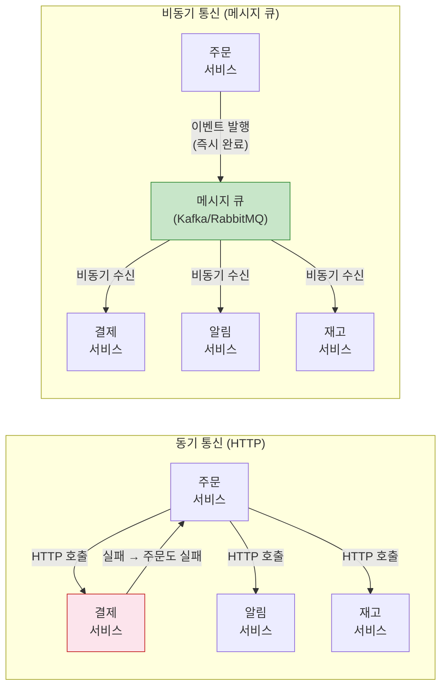
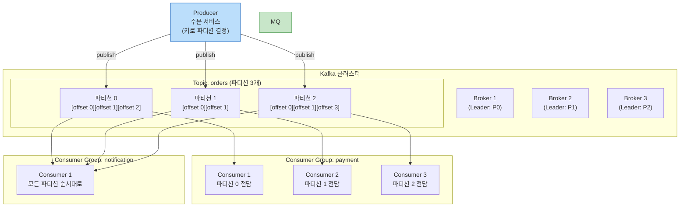

> 주문 서비스가 결제 서비스를 직접 HTTP로 호출한다면? 결제 서비스가 다운되면 주문도 실패한다. 메시지 큐가 사이에 있다면? 주문은 메시지를 보내고 즉시 완료. 결제 서비스는 살아날 때 처리한다. 이것이 **이벤트 드리븐 아키텍처**의 핵심 가치다.

## 핵심 요약 (TL;DR)

**메시지 큐:** 서비스 간 비동기 통신을 중재. Producer가 메시지를 보내면 Consumer가 나중에 처리. 서비스 간 결합도 감소, 장애 격리, 트래픽 완충.

**pub/sub (발행-구독):** 한 Publisher의 메시지를 여러 Subscriber가 수신. Kafka, Google Pub/Sub.

**Kafka vs RabbitMQ:**
- **Kafka:** 로그 기반, 메시지 보존 + 재처리, 대용량 스트리밍. LinkedIn → 오픈소스.
- **RabbitMQ:** AMQP 기반, 복잡한 라우팅, 메시지 즉시 삭제 후 처리. 유연한 토폴로지.

**이벤트 소싱:** 상태가 아닌 이벤트를 저장. 언제든 이벤트를 재생해 상태 복원.
**CQRS:** 읽기(Query)와 쓰기(Command) 모델 분리.

---

## 동기 vs 비동기 통신



---

## Kafka 아키텍처



**Kafka 핵심 개념:**
- **Topic:** 메시지 카테고리. `orders`, `payments`, `notifications`
- **Partition:** Topic을 병렬 처리하는 단위. 파티션 수 = 최대 병렬 Consumer 수
- **Consumer Group:** 하나의 논리적 구독자. 그룹 내 Consumer들이 파티션을 나눠 처리
- **Offset:** 파티션 내 메시지 위치. Consumer가 직접 관리 → 재처리 가능
- **Retention:** 기본 7일 보존. 기간 내 언제든 재처리 가능

---

## Spring Boot + Kafka 구현

### 의존성

```yaml
# build.gradle.kts
implementation("org.springframework.kafka:spring-kafka")
testImplementation("org.springframework.kafka:spring-kafka-test")

# application.yml
spring:
  kafka:
    bootstrap-servers: localhost:9092
    producer:
      key-serializer: org.apache.kafka.common.serialization.StringSerializer
      value-serializer: org.springframework.kafka.support.serializer.JsonSerializer
      acks: all              # 모든 레플리카 확인 후 완료 (데이터 손실 방지)
      retries: 3
      properties:
        enable.idempotence: true   # 중복 메시지 방지
    consumer:
      group-id: payment-service
      auto-offset-reset: earliest  # 새 Consumer 그룹은 처음부터
      key-deserializer: org.apache.kafka.common.serialization.StringDeserializer
      value-deserializer: org.springframework.kafka.support.serializer.JsonDeserializer
      properties:
        spring.json.trusted.packages: "co.kr.honeybarrel.*"
```

### 이벤트 정의

```java
// 이벤트 객체 — 불변(Immutable) 설계
public record OrderCreatedEvent(
        String orderId,
        Long userId,
        List<OrderItem> items,
        int totalAmount,
        LocalDateTime occurredAt
) {
    public static OrderCreatedEvent of(Order order) {
        return new OrderCreatedEvent(
                order.getId(),
                order.getUserId(),
                order.getItems().stream().map(OrderItem::from).toList(),
                order.getTotalAmount(),
                LocalDateTime.now()
        );
    }
}

public record OrderItem(Long productId, int quantity, int price) {
    public static OrderItem from(co.kr.honeybarrel.domain.OrderItem item) {
        return new OrderItem(item.getProductId(), item.getQuantity(), item.getPrice());
    }
}
```

### Producer

```java
@Service
@RequiredArgsConstructor
public class OrderEventPublisher {

    private final KafkaTemplate<String, Object> kafkaTemplate;

    private static final String ORDERS_TOPIC = "orders";

    @Transactional  // DB 트랜잭션과 함께 (Transactional Outbox 패턴 참고)
    public void publishOrderCreated(Order order) {
        OrderCreatedEvent event = OrderCreatedEvent.of(order);

        // 키: userId → 같은 사용자의 주문은 항상 같은 파티션 (순서 보장)
        kafkaTemplate.send(ORDERS_TOPIC, order.getUserId().toString(), event)
                .whenComplete((result, ex) -> {
                    if (ex != null) {
                        log.error("[Kafka] 이벤트 발행 실패: orderId={}, error={}",
                                order.getId(), ex.getMessage());
                        // Dead Letter Queue 또는 재발행 로직
                    } else {
                        log.info("[Kafka] 이벤트 발행 성공: orderId={}, partition={}, offset={}",
                                order.getId(),
                                result.getRecordMetadata().partition(),
                                result.getRecordMetadata().offset());
                    }
                });
    }
}
```

### Consumer

```java
@Component
@RequiredArgsConstructor
@Slf4j
public class PaymentEventConsumer {

    private final PaymentService paymentService;

    // 결제 서비스 Consumer
    @KafkaListener(
            topics = "orders",
            groupId = "payment-service",
            concurrency = "3"  // 파티션 수와 같게 설정
    )
    public void handleOrderCreated(
            @Payload OrderCreatedEvent event,
            @Header(KafkaHeaders.RECEIVED_PARTITION) int partition,
            @Header(KafkaHeaders.OFFSET) long offset,
            Acknowledgment ack  // 수동 커밋 (처리 완료 후 커밋)
    ) {
        log.info("[Payment] 주문 이벤트 수신: orderId={}, partition={}, offset={}",
                event.orderId(), partition, offset);

        try {
            paymentService.processPayment(event);
            ack.acknowledge();  // 성공 시에만 커밋 (실패 시 재처리)
        } catch (PaymentException e) {
            log.error("[Payment] 결제 실패: orderId={}, 이유={}", event.orderId(), e.getMessage());
            // Dead Letter Topic으로 발행하여 나중에 분석/재처리
            ack.acknowledge();  // 비즈니스 실패는 DLT로, 커밋은 함
        } catch (Exception e) {
            log.error("[Payment] 예기치 못한 오류: orderId={}", event.orderId(), e);
            // 재처리 필요 → ack 안 함 → Kafka가 재전달
        }
    }

    // Dead Letter Topic 핸들러
    @KafkaListener(topics = "orders.DLT", groupId = "payment-service-dlt")
    public void handleDeadLetter(OrderCreatedEvent event) {
        log.error("[DLT] 처리 실패 이벤트: orderId={}", event.orderId());
        // 알림 발송, 수동 확인 필요 처리
    }
}

// application.yml에 DLT 설정
@Bean
public DeadLetterPublishingRecoverer deadLetterRecoverer(
        KafkaOperations<Object, Object> operations) {
    return new DeadLetterPublishingRecoverer(operations,
            (record, ex) -> new TopicPartition(record.topic() + ".DLT", -1));
}
```

---

## RabbitMQ — 라우팅 유연성

```java
// build.gradle.kts
// implementation("org.springframework.boot:spring-boot-starter-amqp")

@Configuration
public class RabbitMQConfig {

    // Exchange: 메시지 라우팅 규칙
    @Bean
    public TopicExchange ordersExchange() {
        return new TopicExchange("orders.exchange");
    }

    // Queue: 실제 메시지 저장소
    @Bean
    public Queue paymentQueue() {
        return QueueBuilder.durable("payment.queue")
                .withArgument("x-dead-letter-exchange", "orders.dlx")  // DLX 설정
                .build();
    }

    @Bean
    public Queue notificationQueue() {
        return QueueBuilder.durable("notification.queue").build();
    }

    // Binding: Exchange → Queue 라우팅 규칙
    // "orders.*" → payment.queue (orders.created, orders.updated 모두)
    @Bean
    public Binding paymentBinding() {
        return BindingBuilder.bind(paymentQueue())
                .to(ordersExchange())
                .with("orders.*");  // 와일드카드 라우팅 키
    }

    // "orders.created"만 → notification.queue
    @Bean
    public Binding notificationBinding() {
        return BindingBuilder.bind(notificationQueue())
                .to(ordersExchange())
                .with("orders.created");
    }
}

// Producer
@Service
@RequiredArgsConstructor
public class RabbitOrderPublisher {

    private final RabbitTemplate rabbitTemplate;

    public void publishOrderCreated(OrderCreatedEvent event) {
        rabbitTemplate.convertAndSend(
                "orders.exchange",
                "orders.created",  // 라우팅 키
                event
        );
    }
}

// Consumer
@Component
public class RabbitPaymentConsumer {

    @RabbitListener(queues = "payment.queue")
    public void handleOrderCreated(OrderCreatedEvent event) {
        // 메시지 처리 실패 시 DLX로 이동
        paymentService.processPayment(event);
    }
}
```

---

## Kafka vs RabbitMQ 비교

| 항목 | Kafka | RabbitMQ |
|------|-------|---------|
| **모델** | 로그 기반 (이벤트 스트림) | 큐 기반 (메시지 삭제) |
| **메시지 보존** | 설정 기간 유지 (기본 7일) | 소비 후 삭제 |
| **재처리** | ✅ Offset 재설정으로 가능 | ❌ 불가 (이미 삭제) |
| **처리량** | 매우 높음 (100만 msg/s+) | 높음 (수만 msg/s) |
| **라우팅** | Topic/Partition (단순) | Exchange 유형별 복잡 라우팅 |
| **순서 보장** | 파티션 내 순서 보장 | 큐 단위 순서 보장 |
| **적합한 경우** | 대용량 스트리밍, 감사 로그, 이벤트 소싱 | 작업 분배, 복잡한 라우팅, 빠른 확인 |
| **대표 사용처** | LinkedIn, Netflix, Uber | Instagram, Reddit, Zalando |

---

## Deep Dive: 이벤트 소싱과 CQRS

```java
// 이벤트 소싱: 상태가 아닌 이벤트를 저장
// 이벤트를 재생(replay)하면 언제든 상태 복원 가능

// 이벤트 스토어 (쓰기 모델)
public class OrderAggregate {
    private String orderId;
    private OrderStatus status;
    private List<OrderItem> items;
    private final List<DomainEvent> changes = new ArrayList<>();

    // Command 처리 → 이벤트 발생
    public void createOrder(CreateOrderCommand command) {
        // 비즈니스 검증
        if (command.items().isEmpty()) throw new IllegalArgumentException("아이템 없음");

        // 이벤트 발생 (상태 변경 X)
        applyChange(new OrderCreatedEvent(
                command.orderId(), command.userId(), command.items(), LocalDateTime.now()
        ));
    }

    public void confirmPayment(String paymentId) {
        if (status != OrderStatus.PENDING) throw new IllegalStateException("결제 대기 상태가 아님");
        applyChange(new PaymentConfirmedEvent(orderId, paymentId, LocalDateTime.now()));
    }

    // 이벤트 적용 → 상태 변경
    private void apply(OrderCreatedEvent event) {
        this.orderId = event.orderId();
        this.status = OrderStatus.PENDING;
        this.items = new ArrayList<>(event.items());
    }

    private void apply(PaymentConfirmedEvent event) {
        this.status = OrderStatus.CONFIRMED;
    }

    private void applyChange(DomainEvent event) {
        // 상태 변경
        var applyMethod = this.getClass().getDeclaredMethod("apply", event.getClass());
        applyMethod.invoke(this, event);
        // 변경 이벤트 기록 (나중에 저장소에 저장)
        changes.add(event);
    }

    // 이벤트 재생으로 상태 복원 (Event Replay)
    public static OrderAggregate reconstitute(List<DomainEvent> events) {
        OrderAggregate order = new OrderAggregate();
        events.forEach(order::applyChange);
        return order;
    }
}

// CQRS: 읽기 모델(Query)과 쓰기 모델(Command) 분리
// 쓰기: 이벤트 스토어 (MongoDB - 이벤트 로그)
// 읽기: 최적화된 Read DB (PostgreSQL - 현재 상태 뷰)

@EventHandler  // 이벤트를 읽기 모델에 반영 (Projection)
public class OrderProjection {

    private final OrderReadRepository readRepository;

    @EventHandler
    public void on(OrderCreatedEvent event) {
        OrderView view = new OrderView(event.orderId(), event.userId(), "PENDING");
        readRepository.save(view);
    }

    @EventHandler
    public void on(PaymentConfirmedEvent event) {
        readRepository.updateStatus(event.orderId(), "CONFIRMED");
    }
}
```

---

## 실무 장애 사례

```
사례 1: Consumer Group 리밸런싱 폭풍
  상황: Consumer 하나가 처리 시간이 너무 길어 session.timeout.ms 초과
  → Kafka가 해당 Consumer를 dead로 판단 → 전체 Group 리밸런싱
  → 리밸런싱 동안 메시지 처리 중단 → 지연 폭증
  → 해결: max.poll.interval.ms 조정, 처리 시간 단축 (비동기 처리)

사례 2: Exactly-Once 미구현으로 중복 결제
  상황: 결제 처리 중 Crash → Consumer 재시작 → 같은 메시지 재처리 → 이중 결제
  → 해결: Idempotency Key (메시지 ID 기반 중복 체크), DB UNIQUE 제약

사례 3: Schema 변경으로 Consumer 파싱 실패
  상황: Producer에서 이벤트 필드 추가 → 구 버전 Consumer가 역직렬화 실패
  → 해결: Schema Registry(Confluent) 사용, 하위 호환 필드 추가만 허용

사례 4: Disk Full로 Kafka Broker 장애
  상황: Retention 7일 + 대용량 트래픽 → 브로커 디스크 가득 참 → 브로커 다운
  → 해결: log.retention.bytes 설정, 디스크 사용량 모니터링 알람
```

---

## 면접 Q&A

| 레벨 | 질문 | 핵심 답변 |
|------|------|----------|
| 🟢 기초 | 메시지 큐를 사용하는 이유는? | 서비스 간 결합도 감소, 비동기 처리, 트래픽 완충, 장애 격리. 결제 서비스가 다운돼도 주문은 정상 동작 |
| 🟡 중급 | Kafka의 Consumer Group이란? | 동일 Topic을 소비하는 Consumer 집합. 그룹 내 파티션이 분배됨. 같은 그룹의 Consumer는 메시지를 나눠 처리, 다른 그룹은 독립적으로 전체 수신 |
| 🟡 중급 | at-least-once vs exactly-once의 차이는? | at-least-once: 메시지 최소 1번 이상 처리 (중복 가능), exactly-once: 정확히 1번 (Kafka Transactions + Idempotent Producer). 금융은 exactly-once 필수 |
| 🔴 심화 | Kafka와 RabbitMQ를 어떤 기준으로 선택하는가? | Kafka: 대용량 스트리밍, 메시지 재처리 필요, 이벤트 소싱. RabbitMQ: 복잡한 라우팅(토폴로지), 빠른 확인 응답 필요, 작업 큐. 보통 Kafka로 시작하고 특수 라우팅 필요 시 RabbitMQ 추가 |
| 🔴 시니어 | Transactional Outbox 패턴이란? | DB 트랜잭션과 메시지 발행을 원자적으로 처리. 주문 저장 + Outbox 테이블에 이벤트 기록을 같은 트랜잭션으로. Debezium/CDC로 Outbox를 읽어 Kafka에 발행. MQ 장애 시에도 이벤트 유실 없음 |

---

## 정리

| 항목 | 설명 |
|------|------|
| **핵심 키워드** | Topic/Partition/Offset/Consumer Group, pub/sub, at-least-once/exactly-once, 이벤트 소싱, CQRS, Outbox 패턴 |
| **연관 개념** | 마이크로서비스, Saga 패턴, CDC(Change Data Capture), DLQ/DLT, Schema Registry |
| **실무 결정** | 대용량 스트리밍 → Kafka, 복잡한 라우팅 → RabbitMQ, 이벤트 재처리 → Kafka Retention |

---

## 레퍼런스

### 영상
- [freeCodeCamp.org (@freecodecamp)](https://www.youtube.com/@freecodecamp) — Kafka, RabbitMQ 풀코스 강의 (무료)
- [쉬운코드 (@ezcd)](https://www.youtube.com/@ezcd) — 시니어 백엔드 관점 메시지 큐 실무

### 문서 & 기사
- [Apache Kafka Architecture 2026 Complete Guide — Instaclustr](https://www.instaclustr.com/education/apache-kafka/apache-kafka-architecture-a-complete-guide-2026/) — Kafka 아키텍처 공식 가이드 (2026.03)
- [Introducing Spring Kafka Share Consumer — spring.io](https://spring.io/blog/2025/10/14/introducing-spring-kafka-share-consumer/) — Kafka 4.0 Share Groups + Spring Boot 4.0 (2025.10)
- [Event Sourcing with Apache Kafka — Class Central](https://www.classcentral.com/course/youtube-event-sourcing-and-event-storage-with-apache-kafka-event-sourcing-101-93042) — Confluent 공식 이벤트 소싱 강의
- [Kafka Consumer Concurrency — Medium](https://codefarm0.medium.com/kafka-consumer-concurrency-demystified-partitions-consumer-groups-and-spring-boot-b8166f2d60dc) — Spring Boot Kafka 파티션/컨슈머 동시성 (2026.01)

---

*이 포스트는 [HoneyByte](https://blog.honeybarrel.co.kr) CS Study 시리즈의 일부입니다.*
