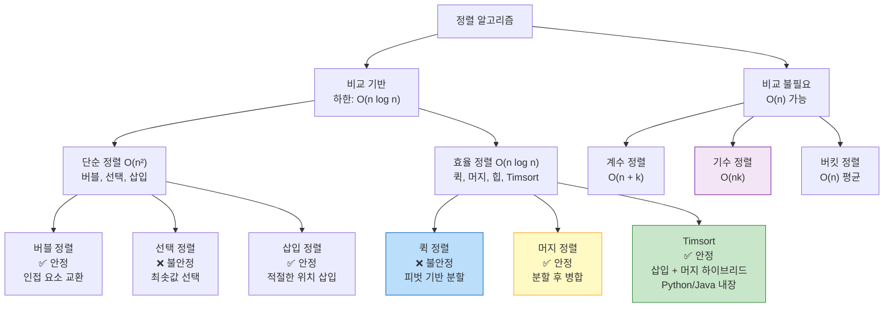

> 정렬 알고리즘을 외우는 것은 의미가 없다. 왜 퀵 정렬은 평균 O(n log n)이지만 최악이 O(n²)인지, 왜 머지 정렬은 안정적이고 퀵 정렬은 그렇지 않은지, 왜 파이썬은 내부적으로 Timsort를 쓰는지 — 원리를 이해하면 절대 잊지 않는다.

## 핵심 요약 (TL;DR)

| 알고리즘 | 평균 | 최악 | 공간 | 안정 | 특징 |
|---------|------|------|------|------|------|
| **버블 정렬** | O(n²) | O(n²) | O(1) | ✅ | 교육용, 거의 정렬된 배열에서 O(n) |
| **선택 정렬** | O(n²) | O(n²) | O(1) | ❌ | 교환 횟수 최소 (n-1번) |
| **삽입 정렬** | O(n²) | O(n²) | O(1) | ✅ | 거의 정렬된 배열에서 매우 빠름 |
| **퀵 정렬** | O(n log n) | O(n²) | O(log n) | ❌ | 실무 최속, 캐시 효율적 |
| **머지 정렬** | O(n log n) | O(n log n) | O(n) | ✅ | 최악 보장, Linked List에 최적 |
| **힙 정렬** | O(n log n) | O(n log n) | O(1) | ❌ | in-place + 최악 보장 |
| **기수 정렬** | O(nk) | O(nk) | O(n+k) | ✅ | 비교 없이 O(n) (정수/문자열) |
| **Timsort** | O(n log n) | O(n log n) | O(n) | ✅ | Python/Java 내장, 실무 표준 |

**안정 정렬(Stable Sort):** 같은 키를 가진 요소들의 원래 순서를 유지.

---

## 정렬 알고리즘 분류



---

## 퀵 정렬 (Quick Sort)

**핵심 아이디어:** 피벗(pivot)을 선택해 작은 것은 왼쪽, 큰 것은 오른쪽으로 분할. 재귀적으로 반복.

**왜 빠른가?** 평균적으로 피벗이 배열을 절반으로 나누면 깊이 O(log n), 각 레벨에서 O(n) 작업 → O(n log n). 캐시 지역성(locality)이 좋아 실제로는 머지 정렬보다 빠른 경우 많음.

**왜 최악이 O(n²)인가?** 피벗이 항상 최솟값/최댓값이면 분할이 1:n-1 → 깊이가 O(n).

```python
# Python 퀵 정렬 — 3-way partition (중복값 처리 포함)
from typing import List
import random


def quick_sort(arr: List[int]) -> List[int]:
    """
    재귀 퀵 정렬 (함수형 스타일 — 이해용)
    시간: O(n log n) 평균, O(n²) 최악
    공간: O(log n) 재귀 스택
    안정성: ❌
    """
    if len(arr) <= 1:
        return arr

    pivot = arr[len(arr) // 2]  # 중간값 피벗 (최악 방지)
    left  = [x for x in arr if x < pivot]
    mid   = [x for x in arr if x == pivot]  # 중복값 처리
    right = [x for x in arr if x > pivot]

    return quick_sort(left) + mid + quick_sort(right)


def quick_sort_inplace(arr: List[int], lo: int = 0, hi: int = None) -> None:
    """
    in-place 퀵 정렬 — 공간 O(1) (스택 제외)
    Lomuto partition scheme
    """
    if hi is None:
        hi = len(arr) - 1

    if lo >= hi:
        return

    # 랜덤 피벗: 최악 케이스 방지
    pivot_idx = random.randint(lo, hi)
    arr[pivot_idx], arr[hi] = arr[hi], arr[pivot_idx]

    pivot = arr[hi]
    i = lo - 1  # 작은 영역의 경계

    for j in range(lo, hi):
        if arr[j] <= pivot:
            i += 1
            arr[i], arr[j] = arr[j], arr[i]

    arr[i + 1], arr[hi] = arr[hi], arr[i + 1]
    partition_idx = i + 1

    quick_sort_inplace(arr, lo, partition_idx - 1)
    quick_sort_inplace(arr, partition_idx + 1, hi)


# 실행
arr = [64, 34, 25, 12, 22, 11, 90]
print(quick_sort(arr))                 # [11, 12, 22, 25, 34, 64, 90]
quick_sort_inplace(arr)
print(arr)                              # [11, 12, 22, 25, 34, 64, 90]
```

```java
// Java 퀵 정렬 — in-place, 랜덤 피벗
import java.util.Random;

public class QuickSort {
    private static final Random RAND = new Random();

    public static void sort(int[] arr) {
        sort(arr, 0, arr.length - 1);
    }

    private static void sort(int[] arr, int lo, int hi) {
        if (lo >= hi) return;

        int pivotIdx = partition(arr, lo, hi);
        sort(arr, lo, pivotIdx - 1);
        sort(arr, pivotIdx + 1, hi);
    }

    private static int partition(int[] arr, int lo, int hi) {
        // 랜덤 피벗으로 최악 케이스 방지
        int randIdx = lo + RAND.nextInt(hi - lo + 1);
        swap(arr, randIdx, hi);

        int pivot = arr[hi];
        int i = lo - 1;

        for (int j = lo; j < hi; j++) {
            if (arr[j] <= pivot) {
                i++;
                swap(arr, i, j);
            }
        }
        swap(arr, i + 1, hi);
        return i + 1;
    }

    private static void swap(int[] arr, int i, int j) {
        int tmp = arr[i]; arr[i] = arr[j]; arr[j] = tmp;
    }

    public static void main(String[] args) {
        int[] arr = {64, 34, 25, 12, 22, 11, 90};
        sort(arr);
        System.out.println(java.util.Arrays.toString(arr));
        // [11, 12, 22, 25, 34, 64, 90]
    }
}
```

---

## 머지 정렬 (Merge Sort)

**핵심 아이디어:** 배열을 반으로 계속 나눈 후, 정렬된 두 부분을 병합. **분할 정복**의 전형.

**왜 안정적인가?** 두 배열을 병합할 때 같은 값이면 왼쪽 배열의 값을 먼저 가져오므로 원래 순서 유지.

```python
def merge_sort(arr: List[int]) -> List[int]:
    """
    머지 정렬
    시간: O(n log n) 항상 보장
    공간: O(n) 보조 배열
    안정성: ✅
    """
    if len(arr) <= 1:
        return arr

    mid = len(arr) // 2
    left  = merge_sort(arr[:mid])
    right = merge_sort(arr[mid:])
    return merge(left, right)


def merge(left: List[int], right: List[int]) -> List[int]:
    """두 정렬된 배열 병합"""
    result = []
    i = j = 0

    while i < len(left) and j < len(right):
        if left[i] <= right[j]:  # <=: 안정 정렬 보장 (같으면 왼쪽 우선)
            result.append(left[i])
            i += 1
        else:
            result.append(right[j])
            j += 1

    result.extend(left[i:])
    result.extend(right[j:])
    return result


# ── 병합 정렬 응용: 역순 쌍 개수 (inversion count) ─────────
# LeetCode 315. Count of Smaller Numbers After Self
def count_inversions(arr: List[int]) -> int:
    """
    역전 쌍 개수: arr[i] > arr[j] 이고 i < j 인 쌍의 수
    머지 정렬로 O(n log n)에 해결
    """
    inversions = [0]

    def merge_count(arr):
        if len(arr) <= 1:
            return arr
        mid = len(arr) // 2
        left  = merge_count(arr[:mid])
        right = merge_count(arr[mid:])
        return merge_and_count(left, right)

    def merge_and_count(left, right):
        result = []
        i = j = 0
        while i < len(left) and j < len(right):
            if left[i] <= right[j]:
                result.append(left[i])
                i += 1
            else:
                # left[i] > right[j]: left[i:] 모두 right[j]보다 큼
                inversions[0] += len(left) - i
                result.append(right[j])
                j += 1
        result.extend(left[i:])
        result.extend(right[j:])
        return result

    merge_count(arr)
    return inversions[0]


arr = [5, 3, 1, 4, 2]
print(count_inversions(arr))  # 6 → (5,3),(5,1),(5,4),(5,2),(3,1),(3,2)
```

---

## 기수 정렬 (Radix Sort)

**핵심 아이디어:** 각 자릿수를 기준으로 계수 정렬을 반복. **비교 없이** 정렬 가능.

**왜 O(n)인가?** k자리 정수를 정렬할 때 k번의 O(n) 계수 정렬 = O(nk). 정수 범위가 고정이면 k도 상수.

```python
def radix_sort(arr: List[int]) -> List[int]:
    """
    기수 정렬 (LSD - Least Significant Digit 우선)
    시간: O(nk) — k: 최대 자릿수
    공간: O(n + 10) = O(n)
    안정성: ✅ (계수 정렬이 안정적이므로)
    """
    if not arr:
        return arr

    max_val = max(arr)
    exp = 1  # 현재 자릿수 (1, 10, 100, ...)

    while max_val // exp > 0:
        arr = counting_sort_by_digit(arr, exp)
        exp *= 10

    return arr


def counting_sort_by_digit(arr: List[int], exp: int) -> List[int]:
    """특정 자릿수 기준 계수 정렬 (안정 정렬)"""
    n = len(arr)
    output = [0] * n
    count = [0] * 10  # 0~9

    # 각 자릿수 빈도 계산
    for num in arr:
        digit = (num // exp) % 10
        count[digit] += 1

    # 누적합으로 위치 계산
    for i in range(1, 10):
        count[i] += count[i - 1]

    # 뒤에서부터 채워야 안정 정렬
    for i in range(n - 1, -1, -1):
        digit = (arr[i] // exp) % 10
        count[digit] -= 1
        output[count[digit]] = arr[i]

    return output


# 실행
arr = [170, 45, 75, 90, 802, 24, 2, 66]
print(radix_sort(arr))  # [2, 24, 45, 66, 75, 90, 170, 802]
```

---

## 버블 정렬과 최적화

```python
def bubble_sort_optimized(arr: List[int]) -> List[int]:
    """
    최적화된 버블 정렬
    - 이미 정렬된 경우 O(n)으로 조기 종료
    시간: O(n²) 평균, O(n) 최선
    공간: O(1)
    안정성: ✅
    """
    arr = arr.copy()
    n = len(arr)

    for i in range(n - 1):
        swapped = False
        for j in range(n - 1 - i):
            if arr[j] > arr[j + 1]:
                arr[j], arr[j + 1] = arr[j + 1], arr[j]
                swapped = True

        if not swapped:
            break  # 교환 없으면 이미 정렬 완료 → O(n) 종료

    return arr
```

---

## Deep Dive: Python의 Timsort

```python
# Python의 list.sort()와 sorted()는 Timsort를 사용
# Tim Peters가 2002년 Python 2.3을 위해 개발
# 삽입 정렬 + 머지 정렬의 하이브리드

# Timsort 핵심:
# 1. 실제 데이터는 대부분 부분적으로 정렬되어 있음
# 2. 자연적으로 오름차순/내림차순인 "run"을 감지
# 3. 짧은 run은 삽입 정렬로 최소 크기(minrun, 보통 32~64)까지 확장
# 4. run들을 머지 정렬로 병합

# 실무에서 정렬 키 커스터마이징
from functools import cmp_to_key
from dataclasses import dataclass

@dataclass
class Product:
    name: str
    price: int
    stock: int

products = [
    Product("꿀A", 25000, 50),
    Product("꿀B", 25000, 30),  # 가격 같음 → 재고 많은 순으로 정렬
    Product("꿀C", 15000, 100),
]

# key 함수로 다중 키 정렬 (안정 정렬이라 순서 보장)
sorted_products = sorted(products, key=lambda p: (p.price, -p.stock))
# → 꿀C(15000), 꿀A(25000,50), 꿀B(25000,30)

# Java: Comparable, Comparator
# List.sort()도 Timsort 사용 (Java 8+)
```

---

## 복잡도 분석 상세

```
비교 기반 정렬의 이론적 하한:
  - n개 요소를 정렬하는 비교 기반 알고리즘은 Ω(n log n)이 최선
  - 증명: 결정 트리의 리프 노드 수 = n! (순열 수)
  - 트리 높이 = log₂(n!) ≈ n log n (스털링 근사)
  - 즉 어떤 비교 기반 알고리즘도 O(n log n)보다 빠를 수 없음

기수 정렬이 이를 깨는 이유:
  - 비교를 하지 않음 → 결정 트리 모델 밖
  - k가 작을 때 (예: 32비트 정수 k=10자리) O(n) 수렴
  - 단, k가 크면 O(nk)가 O(n log n)보다 느릴 수 있음
```

---

## 실무 선택 가이드

```
# 상황별 정렬 선택

1. 일반 정렬:
   Python → list.sort() / sorted()  (Timsort, 최적화됨)
   Java   → Arrays.sort() / Collections.sort()  (Timsort)

2. 거의 정렬된 배열:
   삽입 정렬 or Timsort (자동 감지)

3. 안정 정렬 필수 (같은 값의 순서 유지):
   머지 정렬, Timsort, 기수 정렬

4. 메모리 제약 (in-place 필요):
   퀵 정렬 (평균 O(n log n), O(log n) 스택)
   힙 정렬 (최악도 O(n log n), O(1) in-place)

5. 정수 범위가 제한된 대용량 데이터:
   기수 정렬 or 계수 정렬 (O(n))

6. Linked List 정렬:
   머지 정렬 (랜덤 접근 없이 정렬 가능)
```

---

## 관련 알고리즘 문제

| 문제 | 플랫폼 | 난이도 | 핵심 |
|------|--------|--------|------|
| [912. Sort an Array](https://leetcode.com/problems/sort-an-array/) | LeetCode | Medium | 정렬 직접 구현 |
| [148. Sort List](https://leetcode.com/problems/sort-list/) | LeetCode | Medium | Linked List 머지 정렬 |
| [315. Count of Smaller Numbers After Self](https://leetcode.com/problems/count-of-smaller-numbers-after-self/) | LeetCode | Hard | 역전 쌍 (머지 정렬 응용) |
| [75. Sort Colors](https://leetcode.com/problems/sort-colors/) | LeetCode | Medium | 3-way 파티셔닝 (Dutch National Flag) |
| [백준 2750 수 정렬하기](https://www.acmicpc.net/problem/2750) | 백준 | Bronze | 버블/삽입 정렬 기본 |
| [백준 2751 수 정렬하기 2](https://www.acmicpc.net/problem/2751) | 백준 | Silver | O(n log n) 필요 |
| [백준 10989 수 정렬하기 3](https://www.acmicpc.net/problem/10989) | 백준 | Bronze | 계수 정렬 (메모리 제한) |
| [백준 1427 소트인사이드](https://www.acmicpc.net/problem/1427) | 백준 | Bronze | 자릿수 정렬 |

---

## 레퍼런스

### 영상
- [Learn Data Structures and Algorithms in 48 Hours — freeCodeCamp](https://www.freecodecamp.org/news/learn-data-structures-and-algorithms-2/) — 정렬 알고리즘 풀코스 (2025.11)
- [Understanding Sorting Algorithms — freeCodeCamp](https://www.freecodecamp.org/news/understanding-sorting-algorithms/) — 정렬 시각화 + 원리 설명
- [주니온TV (@joonion)](https://www.youtube.com/@joonion) — 누워서 보는 알고리즘 시리즈 (정렬 포함)

### 문서 & 기사
- [Sorting Algorithms — Python docs](https://docs.python.org/3/howto/sorting.html) — Python Timsort 공식 정렬 가이드
- [MIT 6.006 Introduction to Algorithms — OpenCourseWare](https://ocw.mit.edu/courses/6-006-introduction-to-algorithms-fall-2011/) — 정렬 알고리즘 정규 강의 (Lecture 7-8)

---

*이 포스트는 [HoneyByte](https://blog.honeybarrel.co.kr) CS Study 시리즈의 일부입니다.*
