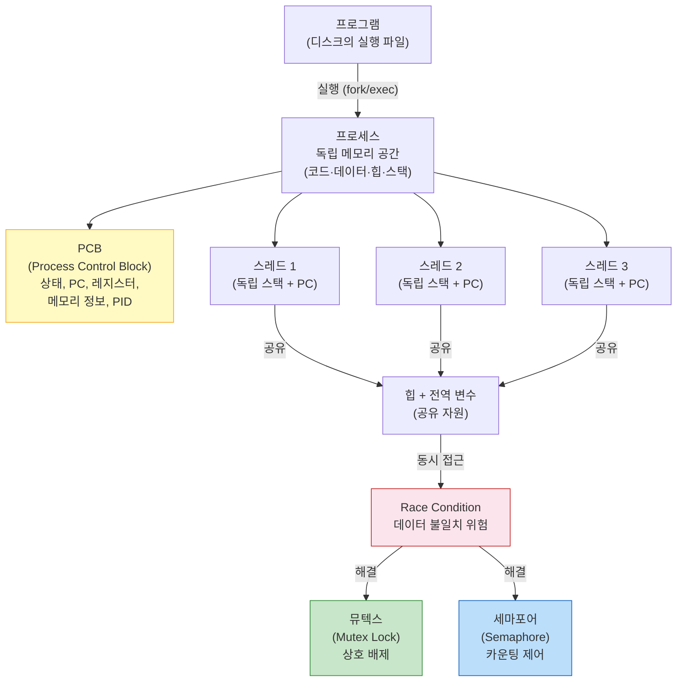
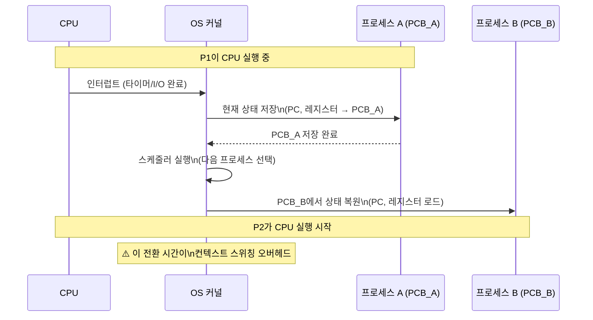

> Chrome 탭 하나가 프로세스고, 탭 안에서 JS 엔진·렌더러·네트워크 요청이 동시에 돌아간다. 이것이 스레드다. "동시에"라는 환상을 만들기 위해 OS는 컨텍스트 스위칭을 한다. 이 메커니즘을 이해하면 멀티스레딩 버그의 절반은 예방할 수 있다.

## 핵심 요약 (TL;DR)

**프로세스(Process):** OS가 프로그램에 독립적인 메모리 공간(코드·데이터·힙·스택)을 할당해 실행하는 단위. 프로세스 간 메모리는 격리됨.

**스레드(Thread):** 프로세스 내 실행 단위. 코드·데이터·힙은 공유, 스택은 독립. 생성 비용이 프로세스보다 낮고 통신이 쉬움.

**컨텍스트 스위칭(Context Switching):** CPU가 한 프로세스에서 다른 프로세스로 전환. PCB에 상태 저장·복원. 오버헤드 발생.

**동기화:** 여러 스레드가 공유 자원에 동시 접근하면 데이터 불일치(Race Condition) 발생 → 뮤텍스·세마포어로 제어.

---

## 프로세스 → 스레드 → 동기화 연결 구조



---

## PCB (Process Control Block)

OS가 프로세스를 관리하기 위해 유지하는 자료구조. 커널 영역에 존재.

```
PCB 구성:
┌─────────────────────────────────┐
│ PID (Process ID)                │ ← 프로세스 식별자
│ 프로세스 상태                    │ ← New/Ready/Running/Waiting/Terminated
│ PC (Program Counter)            │ ← 다음 실행할 명령어 주소
│ CPU 레지스터                    │ ← 범용 레지스터, 스택 포인터 등
│ CPU 스케줄링 정보               │ ← 우선순위, 스케줄 큐 포인터
│ 메모리 관리 정보               │ ← 페이지 테이블, 세그먼트 테이블
│ 입출력 상태                    │ ← 열린 파일 목록, 장치 할당
│ 계정 정보                      │ ← CPU 사용 시간, 시간 제한
└─────────────────────────────────┘
```

---

## 컨텍스트 스위칭



**스위칭 트리거:**
1. **타이머 인터럽트** — 시간 할당량(Time Quantum) 소진
2. **I/O 요청** — 디스크/네트워크 대기 → 다른 프로세스 실행
3. **우선순위 높은 프로세스 도착** — 선점(Preemption)

**오버헤드:** 프로세스 간 스위칭은 메모리 주소 공간도 바뀌어 TLB 플러시 필요 → 스레드 간 스위칭보다 비용이 큼.

---

## 멀티스레딩 — Java 구현

### 기본 스레드 생성

```java
// Thread 클래스 상속 (SRP 위반 가능성 — 기능과 실행 혼재)
class WorkerThread extends Thread {
    private final String name;

    WorkerThread(String name) { this.name = name; }

    @Override
    public void run() {
        System.out.println(name + " 시작: " + Thread.currentThread().getName());
        // 작업 수행
        try { Thread.sleep(100); } catch (InterruptedException e) {
            Thread.currentThread().interrupt();
        }
        System.out.println(name + " 완료");
    }
}

// Runnable 구현 (권장 — 기능 분리)
public class ThreadExample {
    public static void main(String[] args) throws InterruptedException {
        // 방법 1: Runnable 구현체
        Thread t1 = new Thread(() -> {
            System.out.println("작업 1: " + Thread.currentThread().getName());
        }, "worker-1");

        // 방법 2: ExecutorService (실무 권장)
        var executor = java.util.concurrent.Executors.newFixedThreadPool(4);

        for (int i = 0; i < 10; i++) {
            final int taskId = i;
            executor.submit(() -> {
                System.out.println("Task " + taskId + ": " + Thread.currentThread().getName());
                return taskId * 2;
            });
        }

        executor.shutdown();
        executor.awaitTermination(1, java.util.concurrent.TimeUnit.MINUTES);
    }
}
```

---

## 동기화 — Race Condition과 해결

### Race Condition 발생

```java
// ❌ Race Condition: 두 스레드가 동시에 count++ 실행
public class RaceConditionExample {
    private static int count = 0;  // 공유 자원

    public static void main(String[] args) throws InterruptedException {
        Thread t1 = new Thread(() -> {
            for (int i = 0; i < 10000; i++) count++;  // 읽기-증가-쓰기가 원자적이지 않음!
        });
        Thread t2 = new Thread(() -> {
            for (int i = 0; i < 10000; i++) count++;
        });

        t1.start(); t2.start();
        t1.join(); t2.join();

        System.out.println("기대값: 20000, 실제: " + count);
        // 결과: 10000~20000 사이 랜덤 (매번 다름!)
    }
}

// count++ 의 실제 동작 (JVM 바이트코드):
// 1. GETFIELD count   (메모리에서 읽기)
// 2. ICONST_1        (1 준비)
// 3. IADD            (더하기)
// 4. PUTFIELD count  (메모리에 쓰기)
// T1이 1단계 후 스위치 → T2가 같은 값으로 1~4 실행 → T1이 4단계 덮어쓰기 → 1증가 손실
```

### 해결 1: synchronized

```java
public class SynchronizedExample {
    private int count = 0;
    private final Object lock = new Object();

    // 메서드 수준 동기화 — 객체의 intrinsic lock 사용
    public synchronized void incrementMethod() {
        count++;
    }

    // 블록 수준 동기화 — 더 세밀한 제어
    public void incrementBlock() {
        // 다른 작업 (락 불필요)
        synchronized (lock) {
            count++;  // 임계 구역 (Critical Section)
        }
        // 다른 작업
    }

    public synchronized int getCount() { return count; }
}
```

### 해결 2: AtomicInteger (가장 효율적)

```java
import java.util.concurrent.atomic.AtomicInteger;

public class AtomicExample {
    // CAS (Compare-And-Swap) 연산으로 락 없이 원자적 연산
    private final AtomicInteger count = new AtomicInteger(0);

    public void increment() {
        count.incrementAndGet();  // 원자적: 읽기-증가-쓰기가 분리 불가
    }

    public int getCount() { return count.get(); }

    // 비교 후 갱신 패턴
    public boolean conditionalUpdate(int expectedValue, int newValue) {
        return count.compareAndSet(expectedValue, newValue);
        // expectedValue와 현재값이 같을 때만 newValue로 교체
    }
}
```

### 해결 3: ReentrantLock (고급 제어)

```java
import java.util.concurrent.locks.ReentrantLock;
import java.util.concurrent.locks.Condition;

public class ReentrantLockExample {
    private final ReentrantLock lock = new ReentrantLock();
    private final Condition notEmpty = lock.newCondition();
    private final Condition notFull = lock.newCondition();
    private final int[] buffer;
    private int count, putIdx, takeIdx;

    public ReentrantLockExample(int capacity) {
        buffer = new int[capacity];
    }

    // Producer: 버퍼가 가득 찰 때까지 기다림
    public void put(int item) throws InterruptedException {
        lock.lock();
        try {
            while (count == buffer.length)
                notFull.await();              // 락 해제하고 대기
            buffer[putIdx] = item;
            putIdx = (putIdx + 1) % buffer.length;
            count++;
            notEmpty.signal();               // Consumer 깨우기
        } finally {
            lock.unlock();  // finally에서 반드시 해제
        }
    }

    // Consumer: 버퍼가 비어있을 때까지 기다림
    public int take() throws InterruptedException {
        lock.lock();
        try {
            while (count == 0)
                notEmpty.await();
            int item = buffer[takeIdx];
            takeIdx = (takeIdx + 1) % buffer.length;
            count--;
            notFull.signal();
            return item;
        } finally {
            lock.unlock();
        }
    }
}
```

---

## 뮤텍스 vs 세마포어

```
뮤텍스 (Mutex Lock):
  - 상호 배제(Mutual Exclusion)
  - 한 번에 하나의 스레드만 임계 구역 진입
  - 소유권: 획득한 스레드만 해제 가능
  - 용도: 단일 자원 보호

세마포어 (Semaphore):
  - 카운팅 기반 (초기값 N)
  - 최대 N개 스레드 동시 진입 허용
  - 소유권 없음: 다른 스레드가 해제 가능 (Signal)
  - 용도: 자원 풀 관리, Producer-Consumer

Java 세마포어:
import java.util.concurrent.Semaphore;

// DB 커넥션 풀 — 최대 10개만 동시 접근
Semaphore dbConnections = new Semaphore(10);

dbConnections.acquire();  // 카운트 감소 (0이면 대기)
try {
    // DB 작업
} finally {
    dbConnections.release();  // 카운트 증가 (대기 중인 스레드 깨움)
}
```

---

## 데드락 (Deadlock)

**4가지 필요 조건 (코프만 조건):**
```
1. 상호 배제 (Mutual Exclusion): 한 번에 하나의 프로세스만 자원 사용
2. 점유 대기 (Hold & Wait): 자원 가진 채로 다른 자원 대기
3. 비선점 (No Preemption): 강제로 자원 빼앗기 불가
4. 순환 대기 (Circular Wait): P1→R1→P2→R2→P1 순환

→ 4가지 중 하나라도 해제하면 데드락 불가
```

```java
// ❌ 데드락 예시
Object lockA = new Object();
Object lockB = new Object();

Thread t1 = new Thread(() -> {
    synchronized (lockA) {
        System.out.println("T1: A 획득");
        try { Thread.sleep(100); } catch (InterruptedException e) {}
        synchronized (lockB) { System.out.println("T1: B 획득"); }
    }
});

Thread t2 = new Thread(() -> {
    synchronized (lockB) {           // T2는 B 먼저
        System.out.println("T2: B 획득");
        try { Thread.sleep(100); } catch (InterruptedException e) {}
        synchronized (lockA) { System.out.println("T2: A 획득"); }
    }
});
// T1: A 잠금, B 대기 / T2: B 잠금, A 대기 → 영원히 대기 (데드락)

// ✅ 해결: 항상 같은 순서로 락 획득 (순환 대기 해소)
Thread t1Fixed = new Thread(() -> {
    synchronized (lockA) {
        synchronized (lockB) { /* 항상 A → B 순서 */ }
    }
});
Thread t2Fixed = new Thread(() -> {
    synchronized (lockA) {           // T2도 A 먼저
        synchronized (lockB) { /* 항상 A → B 순서 */ }
    }
});
```

---

## Deep Dive: Java 21 가상 스레드 (Virtual Thread)

```java
// 전통적 문제: 스레드당 ~1MB 메모리 → 1000개 스레드 = 1GB
// I/O 대기 중에도 OS 스레드가 블로킹됨

// Java 21 Project Loom: 가상 스레드
// - JVM이 관리하는 경량 스레드 (수백만 개 생성 가능)
// - I/O 블로킹 시 OS 스레드(Carrier Thread)를 차지하지 않음
// - 기존 synchronized/lock API 그대로 사용

// Spring Boot 3.2+ 가상 스레드 활성화
// application.yml:
// spring:
//   threads:
//     virtual:
//       enabled: true

// 가상 스레드 생성
Thread vThread = Thread.ofVirtual()
        .name("virtual-worker")
        .start(() -> System.out.println("가상 스레드 실행"));

// ExecutorService로 가상 스레드 풀
try (var executor = java.util.concurrent.Executors.newVirtualThreadPerTaskExecutor()) {
    // 요청마다 새 가상 스레드 생성 (비용 매우 낮음)
    List<Future<String>> futures = new ArrayList<>();
    for (int i = 0; i < 10000; i++) {
        final int id = i;
        futures.add(executor.submit(() -> {
            // DB 쿼리, HTTP 호출 등 I/O 블로킹 작업
            // 블로킹 시 carrier thread를 yield → 다른 가상 스레드 실행
            return fetchFromDB(id);
        }));
    }
    // 10000개 가상 스레드가 동시에 실행 가능 (메모리 수 MB)
}

// ⚠️ 가상 스레드 주의사항:
// 1. synchronized 블록 내 블로킹: carrier thread 점유 (pinning) 발생
//    → ReentrantLock 사용 권장
// 2. ThreadLocal: 가상 스레드마다 생성 → 메모리 주의
//    → ScopedValue (Java 21) 사용 권장
// 3. CPU 집약적 작업: 가상 스레드의 이점 없음 (carrier thread 점유)
```

---

## 실무 적용 — Spring Boot 스레드 설정

```yaml
# application.yml

# Java 21 가상 스레드 (Spring Boot 3.2+)
spring:
  threads:
    virtual:
      enabled: true  # Tomcat도 가상 스레드로 전환

# 전통적 스레드 풀 (가상 스레드 비활성화 시)
server:
  tomcat:
    threads:
      max: 200       # 최대 스레드 수
      min-spare: 10  # 최소 유지 스레드

# @Async 스레드 풀 설정
@Configuration
@EnableAsync
public class AsyncConfig implements AsyncConfigurer {
    @Override
    public Executor getAsyncExecutor() {
        ThreadPoolTaskExecutor executor = new ThreadPoolTaskExecutor();
        executor.setCorePoolSize(10);
        executor.setMaxPoolSize(50);
        executor.setQueueCapacity(100);
        executor.setThreadNamePrefix("async-");
        executor.setRejectedExecutionHandler(new ThreadPoolExecutor.CallerRunsPolicy());
        executor.initialize();
        return executor;
    }
}
```

---

## 장애 사례

```
사례 1: 운영 환경 데드락 (은행 계좌 이체)
  Thread A: account1 잠금 → account2 잠금 시도
  Thread B: account2 잠금 → account1 잠금 시도 → 데드락
  → 애플리케이션 응답 없음, CPU 0%, 스레드 덤프로 발견
  → 해결: 계좌 ID 오름차순으로 항상 같은 순서 잠금

사례 2: Visible 속성 누락으로 캐시 불일치
  한 스레드가 변수 수정했지만 다른 스레드는 CPU 캐시에서 이전 값 읽음
  → 해결: volatile 키워드 (JVM이 항상 메인 메모리에서 읽도록 강제)

사례 3: 가상 스레드 + synchronized 핀닝
  Spring Boot 3.2+ 가상 스레드 활성화 후 성능 저하
  → synchronized 블록에서 DB 쿼리 시 carrier thread 점유 (pinning)
  → 해결: synchronized → ReentrantLock 교체
```

---

## 면접 Q&A

| 레벨 | 질문 | 핵심 답변 |
|------|------|----------|
| 🟢 기초 | 프로세스와 스레드의 차이는? | 프로세스: 독립 메모리 공간 (코드·데이터·힙·스택), 프로세스 간 메모리 격리. 스레드: 프로세스 내 실행 단위, 코드·데이터·힙 공유, 스택만 독립 |
| 🟡 중급 | 컨텍스트 스위칭 오버헤드가 발생하는 이유는? | CPU 레지스터와 PC를 PCB에 저장·복원하는 시간 + 캐시 무효화(TLB 플러시) + 스케줄러 실행 시간. 프로세스 간 스위칭이 스레드 간보다 비쌈 (주소 공간 전환) |
| 🟡 중급 | 뮤텍스와 세마포어의 차이는? | 뮤텍스: 1개 자원 상호 배제, 소유권 있음(획득한 스레드만 해제). 세마포어: N개 동시 접근 허용, 소유권 없음. DB 커넥션 풀: 세마포어(10개 동시), 임계 구역 보호: 뮤텍스 |
| 🔴 심화 | 데드락 4가지 조건과 방지 방법은? | 상호배제·점유대기·비선점·순환대기 모두 충족 시 발생. 방지: ① 자원 순서 고정(순환대기 해소) ② try-lock(점유대기 해소) ③ 타임아웃 후 롤백 ④ 은행원 알고리즘(회피) |
| 🔴 시니어 | Java 가상 스레드가 전통 스레드 대비 장점과 제약은? | 장점: 경량(수백만 생성 가능), I/O 블로킹 시 carrier thread yield. 제약: synchronized 내 블로킹 시 pinning(carrier 점유) → ReentrantLock 필요, CPU 집약 작업에는 이점 없음 |

---

## 정리

| 항목 | 설명 |
|------|------|
| **핵심 키워드** | PCB, 컨텍스트 스위칭, TLB, Race Condition, 임계 구역, 뮤텍스, 세마포어, 데드락, CAS, Java 가상 스레드 |
| **연관 개념** | CPU 스케줄링(FCFS/SJF/Round-Robin), 페이지 교체, 가상 메모리, IPC(파이프·소켓·공유메모리) |
| **실무 결정** | 가상 스레드(Java 21): I/O 집약적 서비스, synchronized 사용 최소화, 공유 자원 → AtomicXxx 우선 |

---

## 레퍼런스

### 영상
- [강민철 (@kangminchul)](https://www.youtube.com/@kangminchul) — 컴퓨터구조+운영체제 17시간 무료 강의 (인프런 4.9/5.0)
- [쉬운코드 (@ezcd)](https://www.youtube.com/@ezcd) — 시니어 관점의 OS/동시성/트랜잭션 실무 강의

### 문서 & 기사
- [Embracing Virtual Threads — spring.io](https://spring.io/blog/2022/10/11/embracing-virtual-threads/) — Spring 공식 가상 스레드 도입 가이드
- [Spring Boot Performance with Java Virtual Threads — JavaCodeGeeks](https://www.javacodegeeks.com/2025/04/spring-boot-performance-with-java-virtual-threads.html) — 가상 스레드 벤치마크 + 실무 적용 (2025.04)
- [MIT 6.828 Operating System Engineering](https://ocw.mit.edu/courses/6-828-operating-system-engineering-fall-2012/) — MIT OpenCourseWare OS 정규 강의

---

*이 포스트는 [HoneyByte](https://blog.honeybarrel.co.kr) CS Study 시리즈의 일부입니다.*
