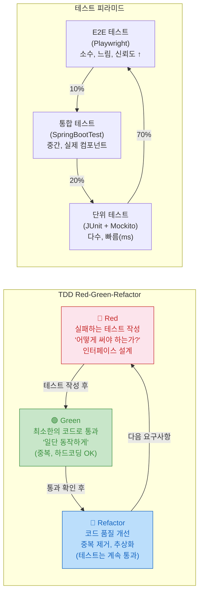

> "테스트 없는 코드는 레거시다." — Michael Feathers. TDD는 단순히 테스트를 많이 쓰는 게 아니다. 테스트가 설계를 이끄는 개발 방식이다. 코드를 쓰기 전에 "이 코드는 어떻게 동작해야 하는가?"를 먼저 묻는다.

## 핵심 요약 (TL;DR)

**TDD 사이클: Red → Green → Refactor**
1. 🔴 **Red:** 실패하는 테스트 먼저 작성 (컴파일도 안 돼도 됨)
2. 🟢 **Green:** 테스트를 통과시키는 최소한의 코드 작성
3. 🔵 **Refactor:** 동작을 유지하면서 코드 품질 개선

**테스트 계층:**
- **단위 테스트(Unit):** 클래스/메서드 하나. 빠름(ms). Mockito로 의존성 모킹.
- **통합 테스트(Integration):** 여러 컴포넌트. 느림. `@SpringBootTest` or `@DataJpaTest`.
- **E2E 테스트:** 전체 흐름. 가장 느림. Testcontainers로 실제 DB.

---

## TDD 사이클



---

## 환경 설정

```kotlin
// build.gradle.kts
dependencies {
    // 스프링 부트 테스트 스타터 (JUnit 5 + Mockito + AssertJ 포함)
    testImplementation("org.springframework.boot:spring-boot-starter-test")

    // Testcontainers — 실제 DB를 Docker로 실행
    testImplementation("org.testcontainers:junit-jupiter")
    testImplementation("org.testcontainers:postgresql")

    // MockK (Kotlin 친화적 Mockito 대안, 여기선 Java/Mockito 사용)
    // testImplementation("io.mockk:mockk:1.13.8")
}

tasks.test {
    useJUnitPlatform()

    // JaCoCo 커버리지
    finalizedBy(tasks.jacocoTestReport)
}

jacoco {
    toolVersion = "0.8.11"
}

tasks.jacocoTestReport {
    dependsOn(tasks.test)
    reports {
        xml.required = true   // CI 리포팅
        html.required = true  // 로컬 확인
    }
}

// 커버리지 품질 게이트
tasks.jacocoTestCoverageVerification {
    violationRules {
        rule {
            limit {
                minimum = "0.80".toBigDecimal()  // 80% 이상 필수
            }
        }
    }
}
```

---

## TDD 실전 — 장바구니 도메인 구현

### Step 1 🔴 Red — 테스트 먼저

```java
// src/test/java/co/kr/honey/cart/CartTest.java
// 아직 Cart 클래스도 없음 — 컴파일 에러 발생 (RED 상태)
import org.junit.jupiter.api.*;
import static org.assertj.core.api.Assertions.*;

class CartTest {

    private Cart cart;

    @BeforeEach
    void setUp() {
        cart = new Cart();  // ← 아직 존재하지 않음
    }

    @Test
    @DisplayName("빈 장바구니의 총액은 0원이다")
    void emptyCartTotalIsZero() {
        assertThat(cart.getTotal()).isEqualTo(0);
    }

    @Test
    @DisplayName("상품을 추가하면 총액이 증가한다")
    void addItemIncreasesTotal() {
        Product honey = new Product(1L, "아카시아 꿀 500g", 25000);

        cart.addItem(honey, 2);

        assertThat(cart.getTotal()).isEqualTo(50000);
        assertThat(cart.getItemCount()).isEqualTo(1);  // 품목 수
        assertThat(cart.getTotalQuantity()).isEqualTo(2);  // 총 수량
    }

    @Test
    @DisplayName("같은 상품을 다시 추가하면 수량이 합산된다")
    void addSameItemMergesQuantity() {
        Product honey = new Product(1L, "아카시아 꿀 500g", 25000);

        cart.addItem(honey, 1);
        cart.addItem(honey, 2);

        assertThat(cart.getTotalQuantity()).isEqualTo(3);
        assertThat(cart.getTotal()).isEqualTo(75000);
    }

    @Test
    @DisplayName("상품을 제거하면 총액에서 차감된다")
    void removeItemDecreasesTotal() {
        Product honey = new Product(1L, "아카시아 꿀 500g", 25000);
        Product beeswax = new Product(2L, "밀랍 100g", 15000);

        cart.addItem(honey, 1);
        cart.addItem(beeswax, 1);
        cart.removeItem(1L);

        assertThat(cart.getTotal()).isEqualTo(15000);
        assertThat(cart.getItemCount()).isEqualTo(1);
    }

    @Test
    @DisplayName("수량이 0이 되면 자동으로 제거된다")
    void itemRemovedWhenQuantityBecomesZero() {
        Product honey = new Product(1L, "아카시아 꿀 500g", 25000);
        cart.addItem(honey, 1);

        cart.updateQuantity(1L, 0);

        assertThat(cart.getItemCount()).isEqualTo(0);
    }

    @Test
    @DisplayName("존재하지 않는 상품 제거 시 예외 발생")
    void removeNonExistentItemThrowsException() {
        assertThatThrownBy(() -> cart.removeItem(999L))
                .isInstanceOf(ItemNotFoundException.class)
                .hasMessage("상품 없음: 999");
    }
}
```

### Step 2 🟢 Green — 최소 구현

```java
// src/main/java/co/kr/honey/cart/Cart.java
public class Cart {
    private final Map<Long, CartItem> items = new LinkedHashMap<>();

    public void addItem(Product product, int quantity) {
        items.merge(
            product.id(),
            new CartItem(product, quantity),
            (existing, newItem) -> existing.addQuantity(newItem.quantity())
        );
    }

    public void removeItem(Long productId) {
        if (!items.containsKey(productId)) {
            throw new ItemNotFoundException("상품 없음: " + productId);
        }
        items.remove(productId);
    }

    public void updateQuantity(Long productId, int quantity) {
        if (quantity <= 0) {
            items.remove(productId);
        } else {
            CartItem item = items.get(productId);
            if (item == null) throw new ItemNotFoundException("상품 없음: " + productId);
            items.put(productId, item.withQuantity(quantity));
        }
    }

    public int getTotal() {
        return items.values().stream()
                .mapToInt(item -> item.product().price() * item.quantity())
                .sum();
    }

    public int getItemCount() { return items.size(); }

    public int getTotalQuantity() {
        return items.values().stream().mapToInt(CartItem::quantity).sum();
    }
}

public record Product(Long id, String name, int price) {}

public record CartItem(Product product, int quantity) {
    public CartItem addQuantity(int add) {
        return new CartItem(product, quantity + add);
    }
    public CartItem withQuantity(int q) {
        return new CartItem(product, q);
    }
}

public class ItemNotFoundException extends RuntimeException {
    public ItemNotFoundException(String msg) { super(msg); }
}
```

### Step 3 🔵 Refactor

```java
// 리팩토링: 할인 정책 추가 (OCP 준수 — 기존 Cart 코드 수정 없이 확장)
public interface DiscountPolicy {
    int discount(int total);
}

@Component
public class NoDiscount implements DiscountPolicy {
    @Override
    public int discount(int total) { return 0; }
}

@Component
public class PercentageDiscount implements DiscountPolicy {
    private final int rate;  // 10 = 10%

    public PercentageDiscount(int rate) {
        if (rate < 0 || rate > 100) throw new IllegalArgumentException("할인율 범위 초과");
        this.rate = rate;
    }

    @Override
    public int discount(int total) {
        return total * rate / 100;
    }
}

// Cart에 정책 주입 (DIP)
public class Cart {
    private final Map<Long, CartItem> items = new LinkedHashMap<>();
    private final DiscountPolicy discountPolicy;

    public Cart() { this(new NoDiscount()); }

    public Cart(DiscountPolicy discountPolicy) {
        this.discountPolicy = discountPolicy;
    }

    public int getFinalTotal() {
        int total = getTotal();
        return total - discountPolicy.discount(total);
    }
    // ... 나머지 동일
}

// 리팩토링 후 테스트 추가
@Test
@DisplayName("10% 할인 정책 적용 시 총액이 감소한다")
void discountPolicyApplied() {
    Cart discountCart = new Cart(new PercentageDiscount(10));
    discountCart.addItem(new Product(1L, "꿀", 10000), 1);

    assertThat(discountCart.getFinalTotal()).isEqualTo(9000);
}
```

---

## 서비스 레이어 단위 테스트 — Mockito

```java
// src/test/java/co/kr/honey/order/OrderServiceTest.java
@ExtendWith(MockitoExtension.class)
class OrderServiceTest {

    @Mock
    private OrderRepository orderRepository;

    @Mock
    private StockService stockService;

    @Mock
    private NotificationService notificationService;

    @InjectMocks
    private OrderService orderService;

    @Test
    @DisplayName("주문 생성 성공: 재고 감소 + DB 저장 + 알림 발송")
    void createOrder_success() {
        // Given (준비)
        CreateOrderRequest request = new CreateOrderRequest(1L, List.of(
                new OrderItemDto(101L, 2)  // 상품 101 2개
        ));
        Order savedOrder = Order.builder()
                .id(UUID.randomUUID().toString())
                .userId(1L)
                .status(OrderStatus.PENDING)
                .build();

        given(stockService.checkAndDecrease(101L, 2)).willReturn(true);
        given(orderRepository.save(any(Order.class))).willReturn(savedOrder);

        // When (실행)
        OrderResponse response = orderService.createOrder(request);

        // Then (검증)
        assertThat(response.orderId()).isNotNull();
        assertThat(response.status()).isEqualTo("PENDING");

        // 호출 검증
        then(stockService).should(times(1)).checkAndDecrease(101L, 2);
        then(orderRepository).should(times(1)).save(any(Order.class));
        then(notificationService).should(times(1))
                .sendOrderConfirmation(eq(savedOrder.getId()));
    }

    @Test
    @DisplayName("재고 부족 시 InsufficientStockException 발생")
    void createOrder_insufficientStock() {
        // Given
        CreateOrderRequest request = new CreateOrderRequest(1L, List.of(
                new OrderItemDto(101L, 100)  // 100개 주문
        ));
        given(stockService.checkAndDecrease(101L, 100)).willReturn(false);

        // When & Then
        assertThatThrownBy(() -> orderService.createOrder(request))
                .isInstanceOf(InsufficientStockException.class)
                .hasMessageContaining("101");

        // DB 저장 안 됨 검증
        then(orderRepository).should(never()).save(any());
        then(notificationService).should(never()).sendOrderConfirmation(any());
    }

    @Test
    @DisplayName("주문 생성 중 예외 발생 시 재고 롤백")
    void createOrder_rollbackOnException() {
        // Given
        CreateOrderRequest request = new CreateOrderRequest(1L, List.of(
                new OrderItemDto(101L, 2)
        ));
        given(stockService.checkAndDecrease(101L, 2)).willReturn(true);
        given(orderRepository.save(any())).willThrow(new DataAccessException("DB 오류") {});

        // When & Then
        assertThatThrownBy(() -> orderService.createOrder(request))
                .isInstanceOf(OrderCreationException.class);

        // 재고 복구 호출 검증
        then(stockService).should(times(1)).restore(101L, 2);
    }
}
```

---

## Repository 레이어 — @DataJpaTest

```java
// src/test/java/co/kr/honey/product/ProductRepositoryTest.java
@DataJpaTest  // JPA 관련 빈만 로드 (가볍고 빠름), H2 인메모리 DB
@AutoConfigureTestDatabase(replace = Replace.NONE)  // 실제 DB 설정 사용 시
class ProductRepositoryTest {

    @Autowired
    private ProductRepository productRepository;

    @Autowired
    private TestEntityManager em;  // 테스트 데이터 직접 관리

    @BeforeEach
    void setUp() {
        em.persist(new Product(null, "아카시아 꿀 500g", 25000, "HONEY", 50));
        em.persist(new Product(null, "밤꿀 500g", 28000, "HONEY", 30));
        em.persist(new Product(null, "프로폴리스 30ml", 45000, "PROPOLIS", 20));
        em.flush();
    }

    @Test
    @DisplayName("카테고리로 상품 조회")
    void findByCategory() {
        List<Product> honeyProducts = productRepository.findByCategory("HONEY");

        assertThat(honeyProducts).hasSize(2)
                .extracting(Product::getName)
                .containsExactlyInAnyOrder("아카시아 꿀 500g", "밤꿀 500g");
    }

    @Test
    @DisplayName("가격 범위로 상품 조회")
    void findByPriceRange() {
        List<Product> products = productRepository.findByPriceBetween(20000, 30000);

        assertThat(products).hasSize(2)
                .allSatisfy(p -> {
                    assertThat(p.getPrice()).isBetween(20000, 30000);
                });
    }

    @Test
    @DisplayName("재고 있는 상품만 조회")
    void findInStockOnly() {
        em.persist(new Product(null, "품절 꿀", 10000, "HONEY", 0));
        em.flush();

        List<Product> inStockProducts = productRepository.findByStockGreaterThan(0);
        assertThat(inStockProducts).noneMatch(p -> p.getStock() == 0);
    }
}
```

---

## 통합 테스트 — Testcontainers

```java
// src/test/java/co/kr/honey/ProductIntegrationTest.java
@SpringBootTest(webEnvironment = WebEnvironment.RANDOM_PORT)
@Testcontainers
class ProductIntegrationTest {

    // 실제 PostgreSQL 컨테이너 실행
    @Container
    static PostgreSQLContainer<?> postgres = new PostgreSQLContainer<>("postgres:16-alpine")
            .withDatabaseName("testdb")
            .withUsername("test")
            .withPassword("test");

    @DynamicPropertySource
    static void configureProperties(DynamicPropertyRegistry registry) {
        registry.add("spring.datasource.url", postgres::getJdbcUrl);
        registry.add("spring.datasource.username", postgres::getUsername);
        registry.add("spring.datasource.password", postgres::getPassword);
    }

    @Autowired
    private TestRestTemplate restTemplate;

    @Autowired
    private ProductRepository productRepository;

    @BeforeEach
    void setUp() {
        productRepository.deleteAll();
    }

    @Test
    @DisplayName("상품 목록 API — 실제 DB로 통합 테스트")
    void getProducts_withRealDatabase() {
        // Given: 실제 PostgreSQL에 데이터 저장
        productRepository.saveAll(List.of(
                new Product(null, "아카시아 꿀 500g", 25000, "HONEY", 50),
                new Product(null, "밤꿀 500g", 28000, "HONEY", 30)
        ));

        // When: 실제 HTTP 요청
        ResponseEntity<ProductListResponse> response = restTemplate.getForEntity(
                "/api/v1/products?category=HONEY",
                ProductListResponse.class
        );

        // Then
        assertThat(response.getStatusCode()).isEqualTo(HttpStatus.OK);
        assertThat(response.getBody().products()).hasSize(2);
    }

    @Test
    @DisplayName("상품 생성 API — 생성 후 조회 가능")
    void createProduct_thenRetrievable() {
        // Given
        CreateProductRequest request = new CreateProductRequest("유채꿀 500g", 23000, "HONEY", 100);

        // When: 생성
        ResponseEntity<ProductResponse> createResponse = restTemplate.postForEntity(
                "/api/v1/products", request, ProductResponse.class
        );
        assertThat(createResponse.getStatusCode()).isEqualTo(HttpStatus.CREATED);
        Long productId = createResponse.getBody().id();

        // Then: 조회 가능
        ResponseEntity<ProductResponse> getResponse = restTemplate.getForEntity(
                "/api/v1/products/" + productId, ProductResponse.class
        );
        assertThat(getResponse.getStatusCode()).isEqualTo(HttpStatus.OK);
        assertThat(getResponse.getBody().name()).isEqualTo("유채꿀 500g");
    }
}
```

---

## JaCoCo 커버리지 설정과 품질 게이트

```bash
# 커버리지 리포트 생성
./gradlew test jacocoTestReport

# 리포트 확인 (브라우저에서 열기)
open build/reports/jacoco/test/html/index.html

# 커버리지 미달 시 빌드 실패
./gradlew jacocoTestCoverageVerification
```

```yaml
# .github/workflows/ci.yml — CI 커버리지 강제
- name: Run tests with coverage
  run: ./gradlew test jacocoTestReport jacocoTestCoverageVerification

- name: Upload coverage to Codecov
  uses: codecov/codecov-action@v4
  with:
    token: ${{ secrets.CODECOV_TOKEN }}
    files: build/reports/jacoco/test/jacocoTestReport.xml
```

---

## TDD가 강제하는 설계 원칙

```
1. SRP (단일 책임 원칙):
   - 클래스가 여러 역할을 하면 테스트하기 어렵다
   - 테스트가 복잡해지면 → 클래스를 분리하라는 신호

2. DIP (의존성 역전):
   - 직접 new로 생성하면 모킹이 어렵다
   - 의존성을 주입받아야 Mockito로 대체 가능

3. OCP (개방-폐쇄):
   - 새 요구사항 = 새 테스트 추가
   - 기존 테스트를 깨지 않고 새 기능 추가 가능해야 함

4. 인터페이스 설계:
   - 테스트 코드가 클라이언트의 첫 번째 사용자
   - 어색하게 쓰이면 인터페이스 설계를 재검토

실무 팁:
  - 테스트 클래스명: {대상 클래스}Test
  - 메서드명: {테스트 조건}_{기대 결과} (Korean OK)
  - @DisplayName으로 비즈니스 언어로 설명
  - AAA 패턴: Arrange(준비) - Act(실행) - Assert(검증)
  - Given-When-Then (BDD 스타일): Mockito의 given/when/then
```

---

## 트레이드오프 — TDD의 현실

```
TDD의 장점:
  ✅ 명확한 인터페이스 설계 (테스트가 API 문서)
  ✅ 리팩토링 안전망 (테스트가 있으면 자신 있게 수정)
  ✅ 빠른 버그 발견 (개발 중 즉시)
  ✅ 테스트 가능한 코드 = 유연한 코드

TDD의 어려움:
  ❌ 초반 개발 속도 느림 (익숙해질 때까지)
  ❌ DB/외부 시스템 의존 코드는 테스트 작성 어려움
  ❌ UI 코드는 단위 테스트 효과 낮음
  ❌ 과도한 모킹은 오히려 유지비용 증가

실무 권장:
  - 비즈니스 로직(서비스): TDD 강력 권장
  - 단순 CRUD: @DataJpaTest로 통합 테스트
  - 복잡한 쿼리: Testcontainers로 실제 DB 테스트
  - UI 컴포넌트: E2E(Playwright)로 커버
```

---

## 레퍼런스

### 공식 문서
- [JUnit 5 User Guide](https://junit.org/junit5/docs/current/user-guide/) — JUnit 5 공식 가이드
- [Mockito Documentation](https://javadoc.io/doc/org.mockito/mockito-core/latest/org/mockito/Mockito.html) — Mockito 공식 API

### 기술 블로그
- [TDD with JUnit 5 and Mockito — vincenzoracca.com](https://www.vincenzoracca.com/en/blog/framework/spring/unit-test/) — Spring Boot TDD 실전 가이드
- [Unit Testing with JUnit and Mockito — djamware.com](https://www.djamware.com/post/unit-testing-in-spring-boot-with-junit-and-mockito) — JaCoCo CI 통합 가이드 (2025.12)

---

*이 포스트는 [HoneyByte](https://blog.honeybarrel.co.kr) 개발 블로그의 일부입니다.*
