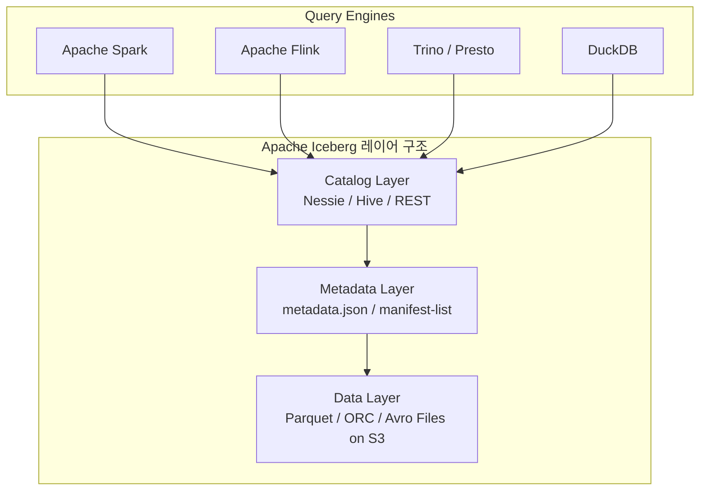
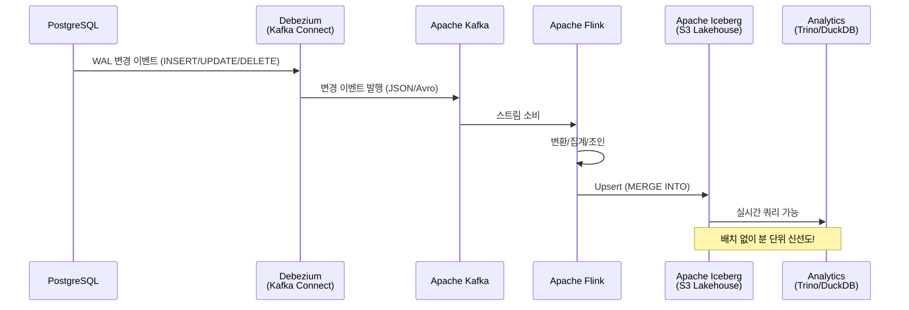
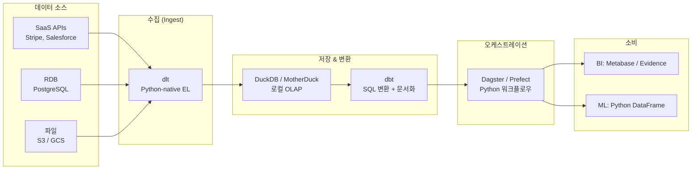
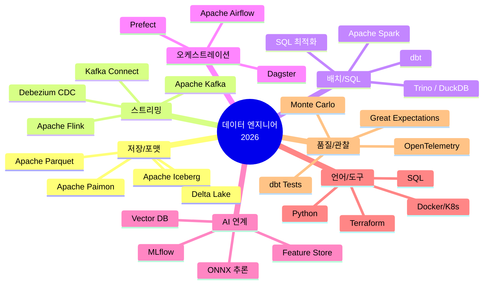

> **TL;DR**
> - 🏗️ **Lakehouse = Data Lake + Data Warehouse**: Apache Iceberg가 사실상 표준으로 자리잡았다
> - ⚡ **스트림-배치 통합**: Apache Flink 2.2로 실시간 AI 추론까지 파이프라인 안으로 들어왔다
> - 🔄 **CDC(Change Data Capture)**: Debezium으로 DB 변경사항을 밀리초 단위로 Lakehouse에 동기화
> - 🤖 **AI-Native 파이프라인**: 멀티모달 데이터(이미지, 오디오, 벡터)가 파이프라인의 일급 시민이 됐다
> - 🐍 **Python-first 생태계**: dbt + dlt + DuckDB 조합이 소규모 팀의 강력한 대안으로 부상

---

## 1. 왜 지금 데이터 엔지니어링인가

2026년, 데이터 엔지니어는 더 이상 단순히 ETL 파이프라인을 만드는 사람이 아니다. AI 모델의 학습 데이터를 준비하고, 실시간 스트림에서 인사이트를 뽑아내며, 수백 테라바이트의 데이터를 비용 효율적으로 저장하는 인프라 엔지니어에 가깝다.

2025~2026년 사이 데이터 엔지니어링 영역에서 가장 큰 변화를 요약하면 세 가지다:

1. **저장 계층의 통합**: Data Lake와 Data Warehouse의 경계가 무너지며 Lakehouse 아키텍처가 주류가 됐다
2. **배치에서 스트리밍으로**: Lambda 아키텍처(배치 + 스트리밍 이중화)가 스트림-배치 통합 엔진으로 대체되고 있다
3. **AI와 데이터 파이프라인의 융합**: 데이터를 저장하는 게 아니라 모델을 위한 Feature Store, Vector DB를 관리하는 것이 핵심 역할이 됐다

---

## 2. Lakehouse 아키텍처: Data Lake가 진화했다

### 2.1 기존 아키텍처의 한계

```
[기존 데이터 스택]

OLTP DB (PostgreSQL, MySQL)
    │
    ▼ ETL (야간 배치)
Data Warehouse (Snowflake, BigQuery)
    │
    ▼ Export
Data Lake (S3, GCS) ─── BI 도구 (Tableau, Superset)
    │
    ▼ (데이터 이동 반복)
ML 팀 (Jupyter, Spark)
```

문제점:
- **데이터 사일로**: 웨어하우스와 레이크 간 데이터 중복 저장으로 비용 폭증
- **신선도 부족**: 야간 배치로 인해 전날 데이터만 분석 가능
- **ACID 부재**: S3에 직접 쓴 Parquet 파일은 업데이트/삭제가 불가능
- **스키마 관리 지옥**: 파일이 쌓일수록 스키마 불일치로 파이프라인 폭발

### 2.2 Apache Iceberg: Open Table Format의 승자

Apache Iceberg는 이 문제들을 해결하기 위해 설계된 **오픈 테이블 포맷**이다. S3, GCS, ADLS 같은 오브젝트 스토리지 위에서 ACID 트랜잭션, 스키마 진화, Time Travel을 제공한다.



Iceberg의 핵심 기능:

| 기능 | 설명 | 실무 임팩트 |
|------|------|-------------|
| **ACID 트랜잭션** | 동시 읽기/쓰기 격리 보장 | 파이프라인 중간 실패 시 부분 데이터 없음 |
| **Time Travel** | `AS OF TIMESTAMP` 쿼리 | 어제 데이터 스냅샷 복원 가능 |
| **Schema Evolution** | 컬럼 추가/삭제/타입변경 | 기존 파일 재작성 없이 스키마 변경 |
| **Partition Evolution** | 파티션 전략 변경 | 연도별 → 월별 파티션으로 무중단 전환 |
| **Hidden Partitioning** | 파티션 컬럼 자동 관리 | 쿼리에서 파티션 명시 불필요 |

### 2.3 실습: Iceberg 테이블 생성 및 CDC 수신

```python
# pyiceberg를 이용한 Iceberg 테이블 생성
from pyiceberg.catalog import load_catalog
from pyiceberg.schema import Schema
from pyiceberg.types import (
    NestedField, StringType, LongType, TimestampType, BooleanType
)
from pyiceberg.partitioning import PartitionSpec, PartitionField
from pyiceberg.transforms import DayTransform

# REST Catalog 연결 (Nessie, Gravitino 등)
catalog = load_catalog(
    "prod",
    **{
        "type": "rest",
        "uri": "https://catalog.example.com/api/catalog",
        "credential": "token:my-token",
        "warehouse": "s3://my-lakehouse/warehouse",
    }
)

# 스키마 정의
schema = Schema(
    NestedField(1, "user_id", LongType(), required=True),
    NestedField(2, "event_type", StringType(), required=True),
    NestedField(3, "occurred_at", TimestampType(adjust_to_utc=True), required=True),
    NestedField(4, "properties", StringType()),  # JSON string
    NestedField(5, "is_deleted", BooleanType(), required=False),
)

# 일별 파티션
partition_spec = PartitionSpec(
    PartitionField(source_id=3, field_id=1000, transform=DayTransform(), name="day")
)

# 테이블 생성
table = catalog.create_table_if_not_exists(
    identifier="prod.events.user_events",
    schema=schema,
    partition_spec=partition_spec,
    properties={
        "write.format.default": "parquet",
        "write.parquet.compression-codec": "zstd",
        "history.expire.min-snapshots-to-keep": "10",
        "history.expire.max-snapshot-age-ms": str(7 * 24 * 60 * 60 * 1000),  # 7일
    }
)

print(f"테이블 생성 완료: {table.identifier}")
```

---

## 3. CDC (Change Data Capture): DB 변경을 실시간으로 잡아라

CDC는 데이터베이스의 변경 로그(WAL, Binlog)를 읽어 변경사항을 스트림으로 발행하는 기술이다. 2026년에는 CDC가 Lakehouse 파이프라인의 핵심 진입점이 됐다.



### 3.1 Debezium PostgreSQL CDC 설정

```json
// Debezium PostgreSQL Connector 설정 (Kafka Connect REST API)
{
  "name": "postgres-cdc-connector",
  "config": {
    "connector.class": "io.debezium.connector.postgresql.PostgresConnector",
    "database.hostname": "postgres.internal",
    "database.port": "5432",
    "database.user": "debezium",
    "database.password": "${file:/opt/kafka/config/credentials.properties:postgres.password}",
    "database.dbname": "production",
    "database.server.name": "prod_pg",
    "plugin.name": "pgoutput",
    "slot.name": "debezium_slot",
    "publication.name": "debezium_pub",
    "table.include.list": "public.users,public.orders,public.events",
    "topic.prefix": "cdc",
    "snapshot.mode": "initial",
    "decimal.handling.mode": "double",
    "time.precision.mode": "adaptive",
    "transforms": "unwrap",
    "transforms.unwrap.type": "io.debezium.transforms.ExtractNewRecordState",
    "transforms.unwrap.add.fields": "op,ts_ms,source.ts_ms",
    "transforms.unwrap.delete.handling.mode": "rewrite",
    "transforms.unwrap.drop.tombstones": "false"
  }
}
```

### 3.2 PostgreSQL WAL 설정 (DBA 필수)

```sql
-- postgresql.conf 설정 확인
SHOW wal_level;  -- replica 이상이어야 함
SHOW max_replication_slots;  -- 최소 1 이상
SHOW max_wal_senders;  -- 최소 1 이상

-- 복제 슬롯 확인
SELECT slot_name, plugin, active, restart_lsn
FROM pg_replication_slots;

-- Debezium용 복제 역할 생성
CREATE ROLE debezium WITH REPLICATION LOGIN PASSWORD 'secure_password';
GRANT SELECT ON ALL TABLES IN SCHEMA public TO debezium;

-- 발행(Publication) 생성
CREATE PUBLICATION debezium_pub FOR TABLE users, orders, events;
```

---

## 4. Apache Flink 2.2: 스트림-배치 통합의 완성

Apache Flink 2.2.0 (2025년 12월 릴리스)은 AI 시대를 위한 스트림 처리 엔진으로 진화했다. 핵심 업그레이드는 **Materialized Table**, **PyFlink AI 추론 통합**, **Streaming Lakehouse** 지원이다.

### 4.1 Flink SQL로 실시간 집계

```sql
-- Flink SQL: CDC 이벤트를 실시간으로 집계해 Iceberg에 저장

-- Kafka 소스 테이블 (Debezium CDC 이벤트)
CREATE TABLE kafka_orders (
    order_id    BIGINT,
    user_id     BIGINT,
    amount      DECIMAL(10, 2),
    status      STRING,
    created_at  TIMESTAMP(3),
    op          STRING,  -- Debezium: c(insert), u(update), d(delete), r(read)
    WATERMARK FOR created_at AS created_at - INTERVAL '5' SECOND
) WITH (
    'connector' = 'kafka',
    'topic' = 'cdc.public.orders',
    'properties.bootstrap.servers' = 'kafka:9092',
    'properties.group.id' = 'flink-orders-consumer',
    'format' = 'debezium-json',
    'scan.startup.mode' = 'latest-offset'
);

-- Iceberg 싱크 테이블
CREATE TABLE iceberg_order_summary (
    window_start    TIMESTAMP(3),
    window_end      TIMESTAMP(3),
    total_amount    DECIMAL(15, 2),
    order_count     BIGINT,
    avg_amount      DECIMAL(10, 2)
) WITH (
    'connector' = 'iceberg',
    'catalog-name' = 'prod',
    'catalog-type' = 'rest',
    'uri' = 'https://catalog.example.com/api/catalog',
    'warehouse' = 's3://my-lakehouse/warehouse',
    'database-name' = 'analytics',
    'table-name' = 'order_summary'
);

-- 5분 Tumbling Window 집계
INSERT INTO iceberg_order_summary
SELECT
    TUMBLE_START(created_at, INTERVAL '5' MINUTE) AS window_start,
    TUMBLE_END(created_at, INTERVAL '5' MINUTE)   AS window_end,
    SUM(amount)                                    AS total_amount,
    COUNT(*)                                       AS order_count,
    AVG(amount)                                    AS avg_amount
FROM kafka_orders
WHERE op IN ('c', 'u')  -- insert, update만
GROUP BY TUMBLE(created_at, INTERVAL '5' MINUTE);
```

### 4.2 PyFlink로 실시간 AI 추론 통합

Flink 2.2의 가장 주목할 기능: **스트림 안에서 ML 모델 추론**을 직접 실행할 수 있다.

```python
from pyflink.datastream import StreamExecutionEnvironment
from pyflink.datastream.functions import MapFunction
import onnxruntime as rt
import numpy as np
import json

class FraudDetectionInference(MapFunction):
    """Flink 스트림 안에서 ONNX 모델로 실시간 사기 탐지"""
    
    def __init__(self, model_path: str):
        self.model_path = model_path
        self.session = None  # 워커별 초기화
    
    def open(self, runtime_context):
        # 각 TaskManager 워커에서 모델 로드 (멀티스레딩 안전)
        self.session = rt.InferenceSession(
            self.model_path,
            providers=["CPUExecutionProvider"]
        )
        self.input_name = self.session.get_inputs()[0].name
    
    def map(self, value: str) -> str:
        event = json.loads(value)
        
        # Feature 추출
        features = np.array([[
            event["amount"],
            event["hour_of_day"],
            event["merchant_category_code"],
            event["distance_from_home_km"],
            event["transaction_count_1h"],
        ]], dtype=np.float32)
        
        # ONNX 추론
        result = self.session.run(None, {self.input_name: features})
        fraud_prob = float(result[0][0][1])  # 사기 확률
        
        event["fraud_probability"] = fraud_prob
        event["is_fraud_alert"] = fraud_prob > 0.85
        
        return json.dumps(event)

# Flink 파이프라인 설정
env = StreamExecutionEnvironment.get_execution_environment()
env.set_parallelism(8)

# Kafka 소스
kafka_source = (
    env.from_source(
        source=KafkaSource.builder()
            .set_bootstrap_servers("kafka:9092")
            .set_topics("transactions")
            .set_group_id("fraud-detection")
            .set_value_only_deserializer(SimpleStringSchema())
            .build(),
        watermark_strategy=WatermarkStrategy.for_bounded_out_of_orderness(
            Duration.of_seconds(5)
        ),
        source_name="kafka-transactions"
    )
    .map(FraudDetectionInference("/models/fraud_v3.onnx"))
    .filter(lambda x: json.loads(x)["is_fraud_alert"])
)

# 결과를 Kafka 알림 토픽으로 발행
kafka_source.sink_to(...)
env.execute("Realtime Fraud Detection")
```

---

## 5. Modern Data Stack: Python-first 소규모 팀을 위한 선택

대기업의 Spark 클러스터 없이도 강력한 데이터 파이프라인을 구축할 수 있는 시대가 됐다.



### 5.1 dlt로 REST API → DuckDB 파이프라인 5분 만에

```python
import dlt
from dlt.sources.rest_api import rest_api_source

# Stripe API → DuckDB 파이프라인
pipeline = dlt.pipeline(
    pipeline_name="stripe_to_duckdb",
    destination="duckdb",
    dataset_name="stripe_raw",
)

stripe_source = rest_api_source(
    {
        "client": {
            "base_url": "https://api.stripe.com/v1/",
            "auth": {
                "type": "bearer",
                "token": dlt.secrets["stripe_api_key"],
            },
            "paginator": {
                "type": "cursor",
                "cursor_path": "data[-1].id",
                "cursor_param": "starting_after",
                "stop_after_empty_page": True,
            },
        },
        "resources": [
            {
                "name": "charges",
                "endpoint": {
                    "path": "charges",
                    "params": {
                        "limit": 100,
                        "created[gte]": {
                            "type": "incremental",
                            "cursor_path": "created",
                            "initial_value": "1700000000",  # 2023-11-14
                        },
                    },
                },
            },
            {
                "name": "customers",
                "endpoint": {"path": "customers", "params": {"limit": 100}},
            },
        ],
    }
)

# 실행: 자동 스키마 추론 + 증분 로드
load_info = pipeline.run(stripe_source)
print(load_info)
# 출력: Pipeline stripe_to_duckdb completed in 12.4 seconds
#       Loaded 1 load package(s) with 2 jobs to duckdb
```

### 5.2 dbt로 변환 레이어 구성

```sql
-- models/marts/finance/fct_revenue_daily.sql
{{
    config(
        materialized='incremental',
        unique_key='date_day',
        on_schema_change='sync_all_columns',
        incremental_strategy='merge',
    )
}}

WITH charges AS (
    SELECT
        date_trunc('day', to_timestamp(created)) AS date_day,
        currency,
        SUM(amount / 100.0)                      AS gross_revenue,
        SUM(CASE WHEN refunded THEN amount_refunded / 100.0 ELSE 0 END) AS refunds,
        COUNT(*)                                  AS charge_count,
        COUNT(CASE WHEN status = 'failed' THEN 1 END) AS failed_count
    FROM {{ ref('stg_stripe__charges') }}
    
        WHERE to_timestamp(created) >= (SELECT MAX(date_day) FROM {{ this }})
    
    GROUP BY 1, 2
)

SELECT
    date_day,
    currency,
    gross_revenue,
    refunds,
    gross_revenue - refunds AS net_revenue,
    charge_count,
    failed_count,
    ROUND(failed_count * 100.0 / charge_count, 2) AS failure_rate_pct
FROM charges
```

---

## 6. 데이터 품질과 관찰가능성 (Observability)

파이프라인은 만들었는데 데이터가 맞는지 어떻게 알 수 있을까? 2026년의 답은 **코드 as 테스트 + 자동 이상 탐지**다.

### 6.1 Great Expectations로 데이터 검증

```python
import great_expectations as gx

context = gx.get_context()

# 데이터 소스 연결 (DuckDB)
datasource = context.sources.add_duckdb(
    name="duckdb_source",
    database_path="/data/warehouse.duckdb"
)

# Expectation Suite 정의
suite = context.add_or_update_expectation_suite("orders_suite")

validator = context.get_validator(
    datasource_name="duckdb_source",
    data_asset_name="orders",
    expectation_suite_name="orders_suite",
)

# 핵심 데이터 품질 규칙
validator.expect_column_values_to_not_be_null("order_id")
validator.expect_column_values_to_be_unique("order_id")
validator.expect_column_values_to_be_between("amount", min_value=0, max_value=1_000_000)
validator.expect_column_values_to_be_in_set("status", ["pending", "completed", "refunded", "failed"])
validator.expect_column_pair_values_A_to_be_greater_than_B(
    "completed_at", "created_at", ignore_row_if="either_value_is_missing"
)

# 통계 기반 이상 탐지
validator.expect_column_mean_to_be_between("amount", min_value=50, max_value=500)
validator.expect_column_stdev_to_be_between("amount", min_value=10, max_value=200)

results = validator.validate()
if not results.success:
    raise ValueError(f"데이터 품질 검증 실패: {results.statistics}")
```

---

## 7. 2026년 데이터 엔지니어의 스킬맵



---

## 8. 장애 사례: Iceberg 스냅샷 폭발 문제

**실제 사례 (2025년 핀테크 A사):** Apache Iceberg로 마이그레이션 후 2주 만에 S3 메타데이터 파일이 수백만 개로 폭발, 쿼리 시작 시간이 30초 이상으로 늘어났다.

**원인 분석:**
- 분 단위로 소규모 배치를 수백 번 커밋 → 스냅샷이 무한 증가
- 스냅샷 만료 설정(Expire Snapshots) 누락
- 소형 파일(Small Files) 방치로 쿼리 플래닝 비용 급증

**해결책:**

```python
# Spark로 Iceberg 유지보수 작업
from pyspark.sql import SparkSession

spark = SparkSession.builder \
    .config("spark.sql.extensions", "org.apache.iceberg.spark.extensions.IcebergSparkSessionExtensions") \
    .getOrCreate()

# 1. 스냅샷 만료 (7일 이전 삭제)
spark.sql("""
    CALL prod.system.expire_snapshots(
        table => 'prod.events.user_events',
        older_than => TIMESTAMP '2026-04-17 00:00:00',
        retain_last => 5
    )
""")

# 2. 고아 파일 정리 (스냅샷에서 참조되지 않는 파일)
spark.sql("""
    CALL prod.system.remove_orphan_files(
        table => 'prod.events.user_events',
        older_than => TIMESTAMP '2026-04-10 00:00:00'
    )
""")

# 3. 소형 파일 압축 (128MB 타겟)
spark.sql("""
    CALL prod.system.rewrite_data_files(
        table => 'prod.events.user_events',
        strategy => 'binpack',
        options => map('target-file-size-bytes', '134217728')
    )
""")

# 4. 메타데이터 압축
spark.sql("""
    CALL prod.system.rewrite_manifests('prod.events.user_events')
""")
```

**예방 설정 (테이블 속성):**

```sql
ALTER TABLE prod.events.user_events SET TBLPROPERTIES (
    'history.expire.min-snapshots-to-keep' = '5',
    'history.expire.max-snapshot-age-ms' = '604800000',  -- 7일
    'write.target-file-size-bytes' = '134217728',         -- 128MB
    'write.delete.target-file-size-bytes' = '67108864'    -- 64MB
);
```

---

## 9. 보안 관점: 데이터 엔지니어가 신경 써야 할 것들

데이터 파이프라인은 기업 데이터의 동맥이다. CISO가 반드시 검토해야 할 항목들:

1. **Column-level Encryption**: Iceberg는 컬럼 단위 암호화를 지원한다. PII(개인정보) 컬럼(이메일, 전화번호, 주민번호)에 반드시 적용할 것
2. **Row-level Security**: Trino의 `system.access_control`로 특정 팀만 특정 파티션 접근 가능하도록 설정
3. **CDC 토픽 암호화**: Kafka 토픽의 SSL/TLS + SASL 인증 필수. CDC 이벤트에는 DB 전체 변경 이력이 담긴다
4. **Secrets 관리**: dbt 프로필, Flink 커넥터 설정의 DB 패스워드는 반드시 HashiCorp Vault 또는 AWS Secrets Manager로 관리
5. **감사 로그**: 누가 어떤 쿼리를 실행했는지 Trino 쿼리 로그 + S3 액세스 로그로 추적

---

## 10. 전망: 2026년 하반기 주목할 것들

1. **Apache Paimon + Flink**: 스트리밍 Lakehouse의 새로운 조합. Iceberg보다 낮은 레이턴시의 업서트를 제공한다
2. **멀티모달 Lakehouse**: 벡터 인덱스가 Iceberg 테이블 안으로 들어오고 있다. 이미지/오디오 임베딩을 SQL로 쿼리하는 시대
3. **Data Contract**: 팀 간 데이터 스키마 약속을 코드로 관리하는 방식. 파이프라인 장애의 40%는 스키마 불일치에서 발생한다
4. **Serverless Flink**: AWS Managed Flink(구 Kinesis Data Analytics)가 더 저렴해지며, 클러스터 관리 없이 스트리밍 파이프라인을 운영하는 팀이 늘고 있다
5. **DuckDB의 부상**: 단일 머신에서 100GB+ 데이터를 처리하는 DuckDB가 소규모 팀의 Spark 대안으로 자리잡고 있다

---

## 관련 포스트

- 이 블로그의 다른 HoneyByte 포스트: [blog.honeybarrel.co.kr](https://blog.honeybarrel.co.kr)

---

## 레퍼런스

### 📹 추천 영상
- [freeCodeCamp - Data Engineering with Python and AI/LLMs](https://www.freecodecamp.org/news/data-loading-with-python-and-ai/) — dlt, DuckDB, REST API 수집 실전 튜토리얼
- [DataTalksClub - Data Engineering Zoomcamp 2026](https://github.com/DataTalksClub/data-engineering-zoomcamp) — Docker, Airflow, dbt, Airbyte까지 9주 무료 커리큘럼
- [Apache Flink YouTube Channel](https://www.youtube.com/@ApacheFlink) — Flink 2.0/2.2 릴리스 발표 및 실습

### 📄 공식 문서 & 블로그
- [Apache Iceberg 공식 문서](https://iceberg.apache.org/docs/latest/) — Open Table Format 완전 가이드
- [Apache Flink 2.2.0 릴리스 노트](https://flink.apache.org/2025/12/04/apache-flink-2.2.0-advancing-real-time-data--ai-and-empowering-stream-processing-for-the-ai-era/) — AI 통합, Materialized Table 심층 분석
- [Debezium 공식 문서](https://debezium.io/documentation/reference/) — PostgreSQL CDC 설정 레퍼런스
- [dlt (data load tool) 문서](https://dlthub.com/docs) — Python-native EL 파이프라인
- [N-iX: Data management trends in 2026](https://www.n-ix.com/data-management-trends/) — 2026 데이터 관리 트렌드 분석
- [The 2025-2026 Ultimate Guide to the Data Lakehouse](https://dev.to/alexmercedcoder/the-2025-2026-ultimate-guide-to-the-data-lakehouse-and-the-data-lakehouse-ecosystem-dig) — Lakehouse 생태계 종합 가이드
- [5 Data & AI Engineering Trends in 2026](https://applydata.io/5-data-ai-engineering-trends/) — 멀티모달 Lakehouse, AI-native 파이프라인 트렌드
