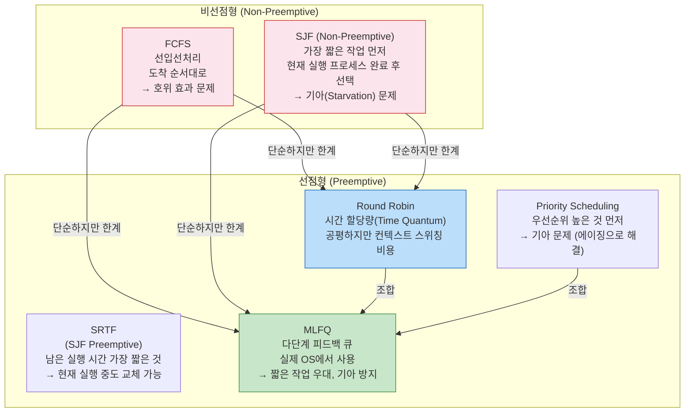
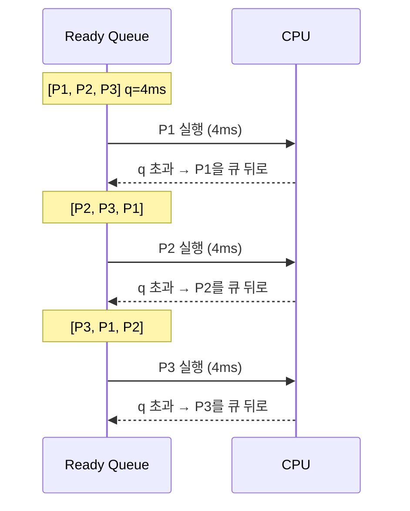
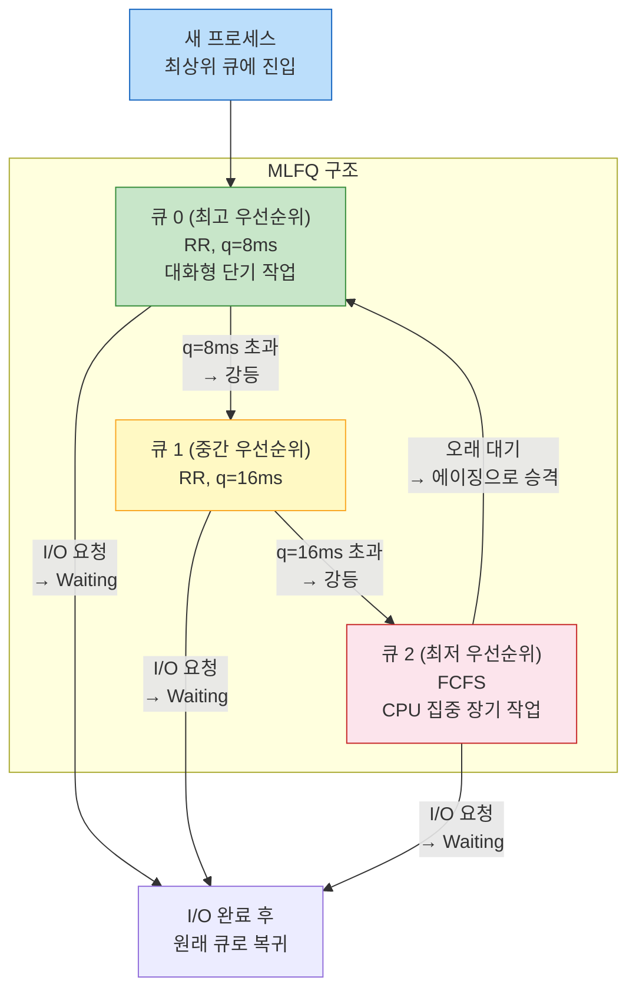

> 싱글 코어 CPU에서 100개의 프로세스가 동시에 실행되는 것처럼 보이는 이유는 OS 스케줄러가 빠르게 프로세스를 교체하기 때문이다. 어떤 순서로 교체할지를 결정하는 것이 **CPU 스케줄링 알고리즘**이다.

## 핵심 요약 (TL;DR)

**스케줄링의 목표 (서로 충돌):**
- **CPU 활용률(Utilization):** CPU를 항상 바쁘게 유지
- **처리량(Throughput):** 단위 시간당 완료 프로세스 수 최대화
- **반환 시간(Turnaround Time):** 프로세스 제출~완료 시간 최소화
- **대기 시간(Waiting Time):** Ready Queue 대기 시간 최소화
- **응답 시간(Response Time):** 첫 응답까지의 시간 최소화 (대화형)

→ **어떤 알고리즘도 모든 목표를 동시에 최적화할 수 없다.**

---

## 스케줄링 알고리즘 비교



---

## 알고리즘 1: FCFS (First Come, First Served)

**원리:** 도착 순서대로 실행. 큐 자료구조.

```
예시: P1(24ms), P2(3ms), P3(3ms) 순서로 도착

도착 순서: P1 → P2 → P3
타임라인: [P1: 0~24] [P2: 24~27] [P3: 27~30]

대기 시간: P1=0, P2=24, P3=27
평균 대기 시간: (0 + 24 + 27) / 3 = 17ms

같은 작업, 도착 순서 바꿈: P2 → P3 → P1
타임라인: [P2: 0~3] [P3: 3~6] [P1: 6~30]
평균 대기 시간: (6 + 0 + 3) / 3 = 3ms  ← 17ms → 3ms 개선!
```

**호위 효과 (Convoy Effect):** 하나의 긴 프로세스 뒤에 짧은 프로세스들이 줄 서서 기다리는 현상. CPU 집중 작업 하나가 I/O 집중 작업들을 지연시킴.

---

## 알고리즘 2: SJF (Shortest Job First)

**원리:** 실행 시간이 가장 짧은 프로세스 먼저. 평균 대기 시간 최솟값 보장.

**문제:** 실행 시간을 미리 알 수 없다 → 예측(지수 이동 평균)으로 근사

```python
# 지수 이동 평균으로 다음 CPU 버스트 예측
def predict_next_burst(tau_prev: float, t_actual: float, alpha: float = 0.5) -> float:
    """
    tau_next = alpha * t_actual + (1 - alpha) * tau_prev
    - alpha = 0.5: 최근 버스트와 과거 예측을 동등하게 반영
    - alpha → 1: 최근 값만 반영 (급격한 변화 대응)
    - alpha → 0: 과거 예측만 반영 (안정적, 반응 느림)
    """
    return alpha * t_actual + (1 - alpha) * tau_prev

# 시뮬레이션
tau = 10.0  # 초기 예측
bursts = [6, 4, 6, 4, 13, 13, 13]
print(f"초기 예측: {tau:.1f}ms")
for i, actual in enumerate(bursts):
    tau_next = predict_next_burst(tau, actual)
    print(f"실제 버스트 {i+1}: {actual}ms → 다음 예측: {tau_next:.2f}ms")
    tau = tau_next
```

**기아 (Starvation):** 실행 시간이 긴 프로세스는 짧은 프로세스가 계속 도착하면 영원히 실행되지 못할 수 있음.

**해결: 에이징(Aging):** 대기 시간이 길어질수록 우선순위를 높임.

---

## 알고리즘 3: Round Robin (RR)

**원리:** 각 프로세스에 동일한 시간 할당량(Time Quantum, q) 부여. q 초과 시 Ready Queue 맨 뒤로.



**Time Quantum 선택의 트레이드오프:**
```
q → 매우 크면:
  → FCFS와 동일 (프로세스가 자발적으로 끝날 때까지 실행)

q → 매우 작으면:
  → 응답 시간 ↓ (대화형 서비스에 좋음)
  → 컨텍스트 스위칭 오버헤드 ↑ (CPU가 스위칭에 바빠짐)
  → 실제 CPU 사용률 ↓

실무 가이드:
  q = 프로세스 평균 CPU 버스트의 80%가 q 이내여야 함
  Linux: 기본 약 100ms~1000ms (CFS에서 가변적으로 계산)
```

### Python 시뮬레이터

```python
from collections import deque
from dataclasses import dataclass, field
from typing import List

@dataclass
class Process:
    pid: str
    arrival: int
    burst: int
    remaining: int = field(init=False)
    waiting_time: int = 0
    start_time: int = -1
    finish_time: int = -1

    def __post_init__(self):
        self.remaining = self.burst

def round_robin(processes: List[Process], quantum: int) -> None:
    queue = deque()
    time = 0
    pending = sorted(processes, key=lambda p: p.arrival)
    pending_idx = 0
    completed = 0
    n = len(processes)

    # 시작 시점에 도착한 프로세스 큐에 추가
    while pending_idx < n and pending[pending_idx].arrival <= time:
        queue.append(pending[pending_idx])
        pending_idx += 1

    print(f"Round Robin (q={quantum}ms) 시뮬레이션:")

    while completed < n:
        if not queue:
            # CPU 유휴 — 다음 프로세스 도착까지 대기
            time = pending[pending_idx].arrival
            queue.append(pending[pending_idx])
            pending_idx += 1
            continue

        proc = queue.popleft()

        if proc.start_time == -1:
            proc.start_time = time

        exec_time = min(quantum, proc.remaining)
        print(f"  t={time:3d}~{time+exec_time:3d}: {proc.pid} 실행 (남은 {proc.remaining}ms → {proc.remaining-exec_time}ms)")
        time += exec_time
        proc.remaining -= exec_time

        # 실행 중 도착한 프로세스 추가
        while pending_idx < n and pending[pending_idx].arrival <= time:
            queue.append(pending[pending_idx])
            pending_idx += 1

        if proc.remaining > 0:
            queue.append(proc)
        else:
            proc.finish_time = time
            proc.waiting_time = proc.finish_time - proc.arrival - proc.burst
            completed += 1

    # 통계 출력
    print("\n결과:")
    total_wt = total_tat = 0
    for p in processes:
        tat = p.finish_time - p.arrival
        print(f"  {p.pid}: 대기={p.waiting_time}ms, 반환={tat}ms")
        total_wt += p.waiting_time
        total_tat += tat

    print(f"  평균 대기시간: {total_wt / n:.1f}ms")
    print(f"  평균 반환시간: {total_tat / n:.1f}ms")


# 실행
processes = [
    Process("P1", arrival=0, burst=24),
    Process("P2", arrival=0, burst=3),
    Process("P3", arrival=0, burst=3),
]
round_robin(processes, quantum=4)
```

---

## 알고리즘 4: Priority Scheduling

**원리:** 숫자가 낮을수록 우선순위 높음(일반적). 높은 우선순위 프로세스 먼저 실행.

**문제: 기아(Starvation)** — 낮은 우선순위 프로세스가 오래 실행 못 할 수 있음.

**해결: 에이징(Aging)** — 대기 시간에 따라 우선순위를 점진적으로 상승.

```python
def aging_priority(base_priority: int, waiting_time_seconds: int,
                   aging_rate: int = 1, max_boost: int = 10) -> int:
    """
    대기 시간에 따라 우선순위 상승
    aging_rate: N초마다 우선순위 1 상승
    """
    boost = min(waiting_time_seconds // aging_rate, max_boost)
    return max(0, base_priority - boost)  # 낮을수록 높은 우선순위

# 예시: 기본 우선순위 15인 프로세스가 30초 대기
aged = aging_priority(15, waiting_time_seconds=30, aging_rate=5)
print(f"30초 대기 후 우선순위: {aged}")  # 9 (15 - 6 = 9)
```

---

## 알고리즘 5: MLFQ (Multi-Level Feedback Queue)

**가장 현실적인 알고리즘 — 실제 OS에서 사용**

**규칙:**
1. 높은 우선순위 큐의 프로세스 먼저 실행
2. 같은 우선순위 큐 내에서는 RR
3. 프로세스가 한 큐에서 너무 많은 CPU 시간 사용 → 낮은 우선순위 큐로 강등
4. 프로세스가 대기 시간이 길면 → 높은 우선순위 큐로 승격 (기아 방지)
5. 새 프로세스는 최상위 큐에서 시작



**왜 MLFQ가 좋은가:**
```
단기 CPU 작업 (GUI 응답 등):
  → Q0에서 짧게 실행 후 완료 → 빠른 응답
  
장기 CPU 작업 (계산, 렌더링):
  → Q0 → Q1 → Q2로 강등 → CPU 독점 방지
  → Q2에서 FCFS로 실행 (컨텍스트 스위칭 최소화)

I/O 집중 작업:
  → CPU 짧게 쓰고 I/O 대기 → Q0 유지 → 높은 우선순위
```

---

## Deep Dive: Linux CFS (Completely Fair Scheduler)

```
Linux 커널 2.6.23 (2007)에서 도입. MLFQ의 실무 구현체.

핵심 아이디어:
  - 모든 프로세스에 "공평하게" CPU 시간 분배
  - Red-Black Tree(자가 균형 BST)로 가상 런타임(vruntime) 관리
  - vruntime: 프로세스가 실제 CPU를 사용한 시간 (나이스 값으로 가중치)
  - 항상 vruntime이 가장 낮은 프로세스를 다음에 실행

nice 값 (-20 ~ +19):
  - nice = -20: 가중치 높음 → 같은 CPU 시간에 vruntime 적게 증가 → 더 자주 선택
  - nice = +19: 가중치 낮음 → vruntime 빠르게 증가 → 덜 선택
  - nice = 0: 기본값

Java 스레드 우선순위 (1~10) → OS nice 값으로 변환
  Thread.MIN_PRIORITY = 1 → nice +5
  Thread.NORM_PRIORITY = 5 → nice 0 (기본)
  Thread.MAX_PRIORITY = 10 → nice -5
```

```java
// Java 스레드 우선순위 설정
Thread highPriority = new Thread(() -> {
    // CPU 집중 작업
}, "high-priority-worker");
highPriority.setPriority(Thread.MAX_PRIORITY);  // 10

Thread lowPriority = new Thread(() -> {
    // 백그라운드 작업
}, "low-priority-worker");
lowPriority.setPriority(Thread.MIN_PRIORITY);   // 1

// ⚠️ 주의: Java 스레드 우선순위는 힌트일 뿐
// OS가 반드시 따르지 않음. 플랫폼마다 동작 다름.
// 우선순위에 의존한 프로그램 설계는 위험
```

---

## 스케줄링 기준 비교

| 알고리즘 | 평균 대기 시간 | 공평성 | 기아 | 선점 | 실용성 |
|---------|------------|--------|------|------|--------|
| **FCFS** | 나쁨 (호위 효과) | △ | 없음 | ❌ | 간단 |
| **SJF** | 최적 | 나쁨 | ⚠️ 있음 | ❌ | 예측 불가 |
| **SRTF** | 최적 | 나쁨 | ⚠️ 있음 | ✅ | 예측 불가 |
| **Round Robin** | 중간 | ✅ 최고 | 없음 | ✅ | 대화형에 적합 |
| **Priority** | 중간 | 낮음 | ⚠️ 있음 | ✅ | 에이징 필요 |
| **MLFQ** | 좋음 | ✅ 좋음 | 에이징으로 방지 | ✅ | **실제 OS 사용** |

---

## 면접 Q&A

| 레벨 | 질문 | 핵심 답변 |
|------|------|----------|
| 🟢 기초 | FCFS의 단점은? | 호위 효과(Convoy Effect): 하나의 긴 프로세스가 뒤의 짧은 프로세스들을 지연. 평균 대기 시간 나쁨 |
| 🟡 중급 | Round Robin에서 Time Quantum을 어떻게 설정하는가? | 너무 작으면 컨텍스트 스위칭 오버헤드 증가, 너무 크면 FCFS와 동일. 경험칙: 프로세스 버스트의 80%가 q 이내. Linux는 대략 100ms~1000ms 사용 |
| 🟡 중급 | SJF가 최적 알고리즘인데 왜 실제 OS에서 안 쓰는가? | 프로세스의 실행 시간을 미리 알 수 없기 때문. 예측(지수 이동 평균)을 쓰지만 오버헤드와 부정확성 존재 |
| 🔴 심화 | 기아(Starvation)가 발생하는 이유와 에이징(Aging) 해결 방법은? | 우선순위/SJF에서 높은 우선순위/짧은 작업이 계속 도착하면 낮은 우선순위/긴 작업이 무한 대기. 에이징: 대기 시간이 길수록 우선순위를 점진적으로 높여 결국 실행되도록 보장 |
| 🔴 시니어 | Linux CFS의 동작 원리와 MLFQ와의 차이는? | CFS: 모든 프로세스에 CPU 비례 분배, vruntime(가상 런타임)이 가장 낮은 프로세스 선택, Red-Black Tree로 O(log N) 스케줄링. nice 값으로 가중치 조정. MLFQ보다 공평성 강조, 별도 큐 없이 단일 자료구조로 관리 |

---

## 정리

| 항목 | 설명 |
|------|------|
| **핵심 키워드** | 선점/비선점, 호위 효과, 기아, 에이징, Time Quantum, vruntime, CFS, nice 값 |
| **연관 개념** | 프로세스 상태(Ready/Running/Waiting), 컨텍스트 스위칭, PCB, 인터럽트, 우선순위 역전 |
| **실무 결정** | Java 스레드 우선순위는 힌트, 실제 CPU 점유는 OS 스케줄러가 결정; CPU 집중 작업은 별도 스레드 풀로 분리 |

---

## 레퍼런스

### 영상
- [강민철 (@kangminchul)](https://www.youtube.com/@kangminchul) — 컴퓨터구조+운영체제 17시간 무료 강의 (스케줄링 파트 포함)
- [쉬운코드 (@ezcd)](https://www.youtube.com/@ezcd) — 시니어 관점의 OS/동시성 실무 강의

### 문서 & 기사
- [CFS Scheduler — Linux Kernel Documentation](https://docs.kernel.org/scheduler/sched-design-CFS.html) — Linux CFS 공식 설계 문서
- [CFS: Completely Fair Scheduling — Opensource.com](https://opensource.com/article/19/2/fair-scheduling-linux) — CFS 동작 원리 해설
- [CS 341 Scheduling — University of Illinois](https://cs341.cs.illinois.edu/coursebook/Scheduling) — 스케줄링 알고리즘 대학 강의노트
- [MIT 6.828 OS Engineering](https://ocw.mit.edu/courses/6-828-operating-system-engineering-fall-2012/) — MIT OpenCourseWare OS 정규 강의

---

*이 포스트는 [HoneyByte](https://blog.honeybarrel.co.kr) CS Study 시리즈의 일부입니다.*
